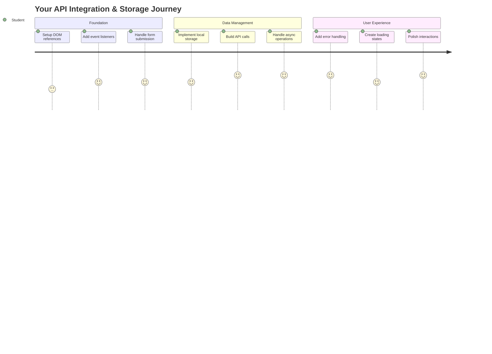
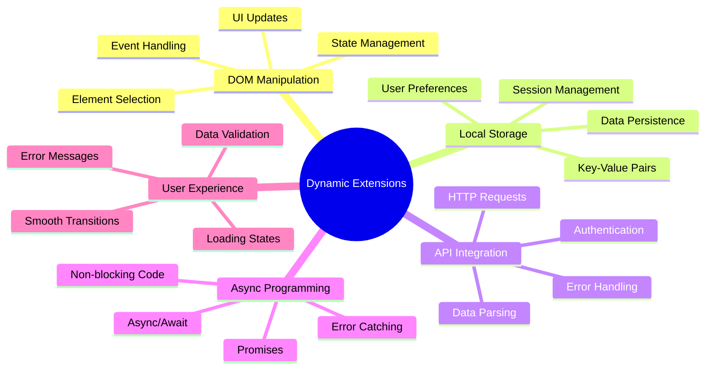
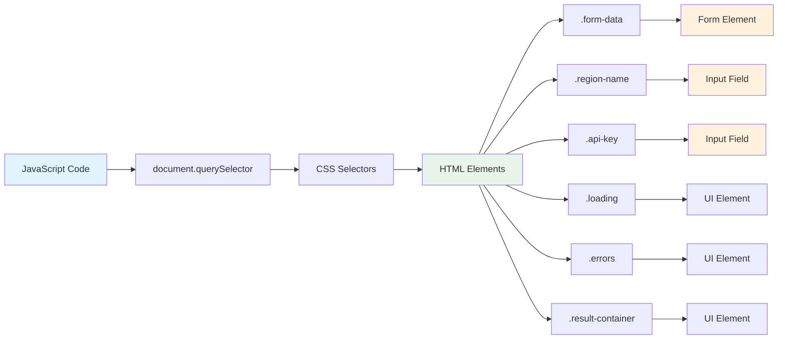
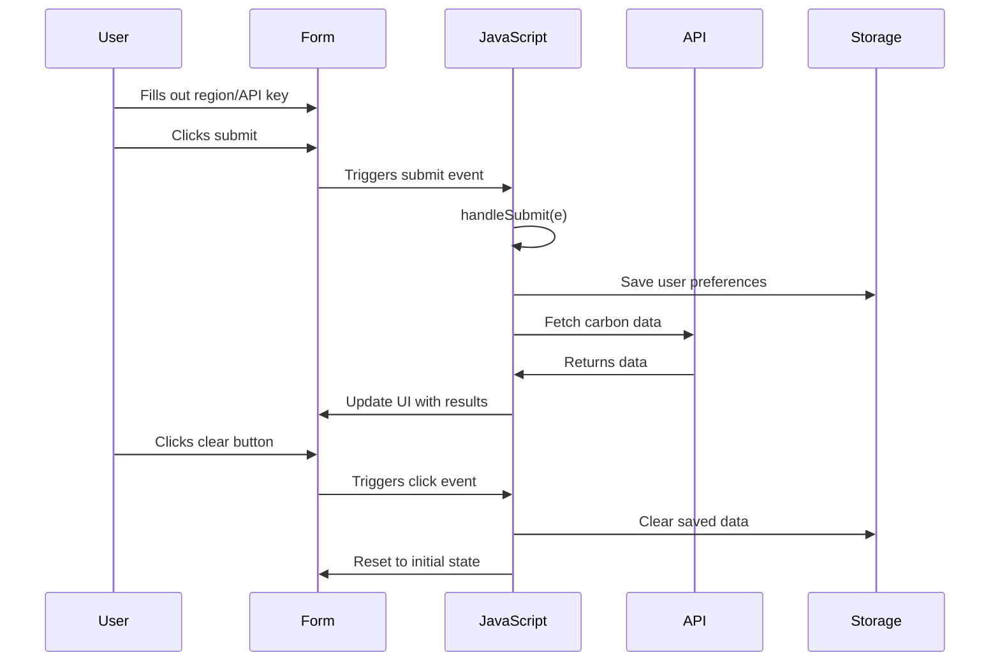
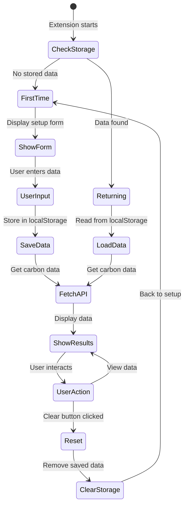
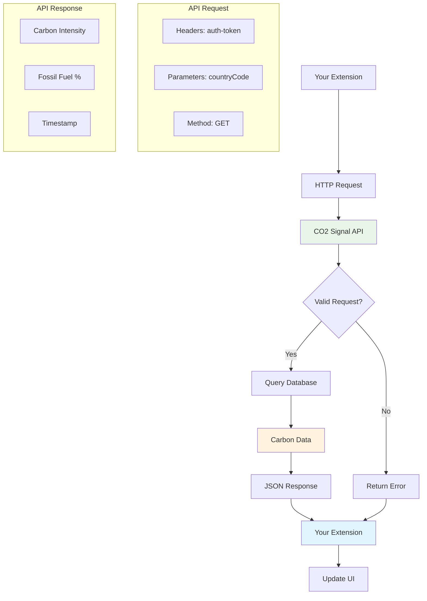
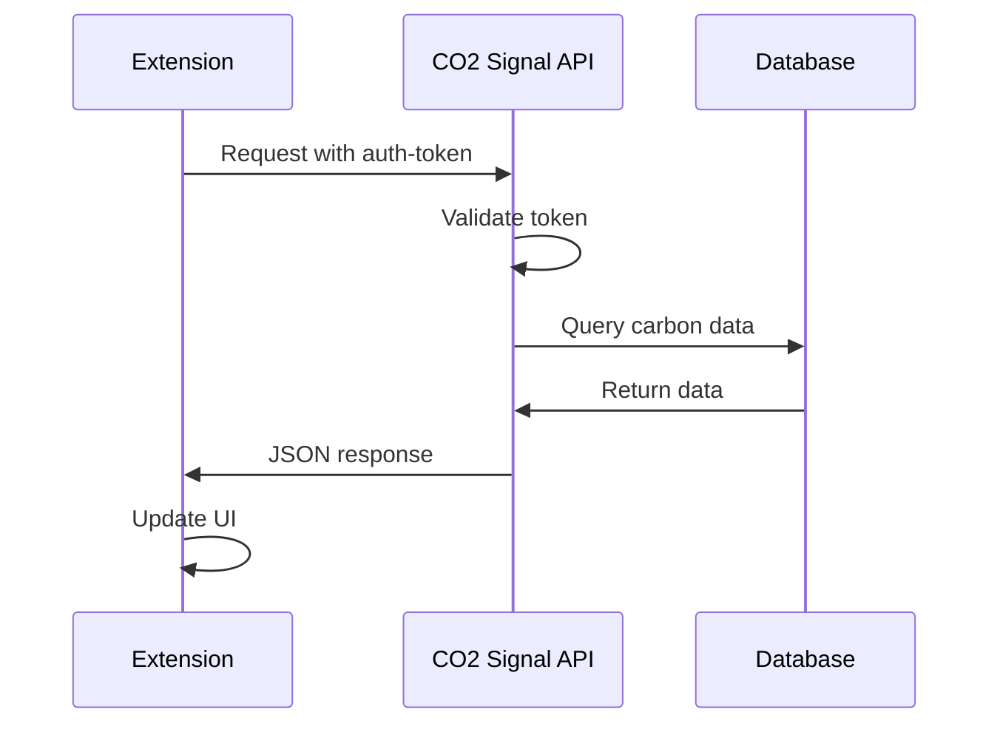
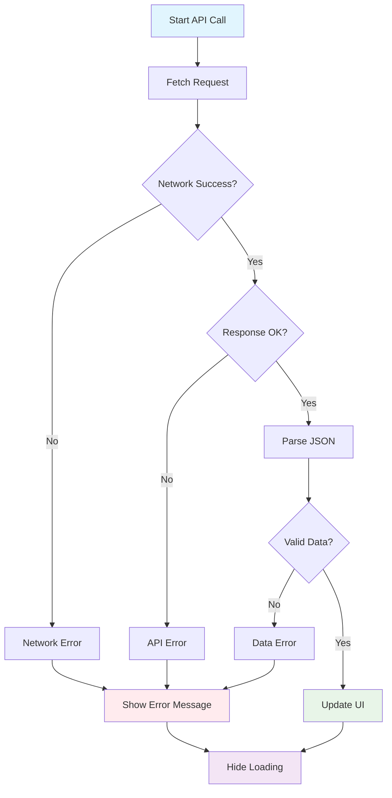
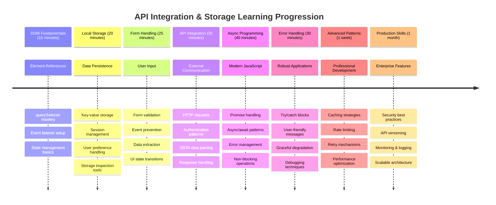

<!--
CO_OP_TRANSLATOR_METADATA:
{
  "original_hash": "2b6203a48c48d8234e0948353b47d84e",
  "translation_date": "2025-11-06T11:59:02+00:00",
  "source_file": "5-browser-extension/2-forms-browsers-local-storage/README.md",
  "language_code": "id"
}
-->
# Proyek Ekstensi Browser Bagian 2: Memanggil API, menggunakan Penyimpanan Lokal



## Kuis Pra-Kuliah

[Kuis pra-kuliah](https://ff-quizzes.netlify.app/web/quiz/25)

## Pengantar

Ingat ekstensi browser yang mulai Anda bangun? Saat ini Anda memiliki formulir yang terlihat bagus, tetapi masih bersifat statis. Hari ini kita akan menghidupkannya dengan menghubungkannya ke data nyata dan memberinya kemampuan untuk mengingat.

Pikirkan tentang komputer kontrol misi Apollo - mereka tidak hanya menampilkan informasi tetap. Mereka terus berkomunikasi dengan pesawat luar angkasa, memperbarui data telemetri, dan mengingat parameter misi penting. Itulah jenis perilaku dinamis yang akan kita bangun hari ini. Ekstensi Anda akan terhubung ke internet, mengambil data lingkungan nyata, dan mengingat pengaturan Anda untuk penggunaan berikutnya.

Integrasi API mungkin terdengar rumit, tetapi sebenarnya hanya mengajarkan kode Anda cara berkomunikasi dengan layanan lain. Apakah Anda mengambil data cuaca, feed media sosial, atau informasi jejak karbon seperti yang akan kita lakukan hari ini, semuanya tentang membangun koneksi digital ini. Kita juga akan mengeksplorasi bagaimana browser dapat menyimpan informasi - mirip dengan bagaimana perpustakaan menggunakan katalog kartu untuk mengingat lokasi buku.

Pada akhir pelajaran ini, Anda akan memiliki ekstensi browser yang mengambil data nyata, menyimpan preferensi pengguna, dan memberikan pengalaman yang lancar. Mari kita mulai!



✅ Ikuti segmen bernomor di file yang sesuai untuk mengetahui di mana menempatkan kode Anda

## Siapkan elemen untuk dimanipulasi dalam ekstensi

Sebelum JavaScript Anda dapat memanipulasi antarmuka, ia membutuhkan referensi ke elemen HTML tertentu. Pikirkan seperti teleskop yang perlu diarahkan ke bintang tertentu - sebelum Galileo dapat mempelajari bulan Jupiter, ia harus menemukan dan memfokuskan pada Jupiter itu sendiri.

Di file `index.js` Anda, kita akan membuat variabel `const` yang menangkap referensi ke setiap elemen formulir penting. Ini mirip dengan bagaimana ilmuwan memberi label pada peralatan mereka - alih-alih mencari seluruh laboratorium setiap kali, mereka dapat langsung mengakses apa yang mereka butuhkan.



```javascript
// form fields
const form = document.querySelector('.form-data');
const region = document.querySelector('.region-name');
const apiKey = document.querySelector('.api-key');

// results
const errors = document.querySelector('.errors');
const loading = document.querySelector('.loading');
const results = document.querySelector('.result-container');
const usage = document.querySelector('.carbon-usage');
const fossilfuel = document.querySelector('.fossil-fuel');
const myregion = document.querySelector('.my-region');
const clearBtn = document.querySelector('.clear-btn');
```

**Inilah yang dilakukan kode ini:**
- **Menangkap** elemen formulir menggunakan `document.querySelector()` dengan selektor kelas CSS
- **Membuat** referensi ke bidang input untuk nama wilayah dan kunci API
- **Membangun** koneksi ke elemen tampilan hasil untuk data penggunaan karbon
- **Menyiapkan** akses ke elemen UI seperti indikator pemuatan dan pesan kesalahan
- **Menyimpan** setiap referensi elemen dalam variabel `const` untuk penggunaan ulang yang mudah di seluruh kode Anda

## Tambahkan pendengar acara

Sekarang kita akan membuat ekstensi Anda merespons tindakan pengguna. Pendengar acara adalah cara kode Anda memantau interaksi pengguna. Pikirkan mereka seperti operator di pertukaran telepon awal - mereka mendengarkan panggilan masuk dan menghubungkan sirkuit yang tepat ketika seseorang ingin melakukan koneksi.



```javascript
form.addEventListener('submit', (e) => handleSubmit(e));
clearBtn.addEventListener('click', (e) => reset(e));
init();
```

**Memahami konsep ini:**
- **Melampirkan** pendengar pengiriman ke formulir yang dipicu saat pengguna menekan Enter atau klik kirim
- **Menghubungkan** pendengar klik ke tombol hapus untuk mereset formulir
- **Meneruskan** objek acara `(e)` ke fungsi penangan untuk kontrol tambahan
- **Memanggil** fungsi `init()` segera untuk mengatur keadaan awal ekstensi Anda

✅ Perhatikan sintaks fungsi panah singkat yang digunakan di sini. Pendekatan JavaScript modern ini lebih bersih daripada ekspresi fungsi tradisional, tetapi keduanya bekerja sama baiknya!

### 🔄 **Pemeriksaan Pedagogis**
**Pemahaman Penanganan Acara**: Sebelum melanjutkan ke inisialisasi, pastikan Anda dapat:
- ✅ Menjelaskan bagaimana `addEventListener` menghubungkan tindakan pengguna ke fungsi JavaScript
- ✅ Memahami mengapa kita meneruskan objek acara `(e)` ke fungsi penangan
- ✅ Mengenali perbedaan antara acara `submit` dan `click`
- ✅ Menjelaskan kapan fungsi `init()` dijalankan dan mengapa

**Tes Cepat Diri**: Apa yang akan terjadi jika Anda lupa `e.preventDefault()` dalam pengiriman formulir?
*Jawaban: Halaman akan dimuat ulang, kehilangan semua status JavaScript dan mengganggu pengalaman pengguna*

## Bangun fungsi inisialisasi dan reset

Mari kita buat logika inisialisasi untuk ekstensi Anda. Fungsi `init()` seperti sistem navigasi kapal yang memeriksa instrumennya - ia menentukan keadaan saat ini dan menyesuaikan antarmuka sesuai. Ia memeriksa apakah seseorang telah menggunakan ekstensi Anda sebelumnya dan memuat pengaturan mereka sebelumnya.

Fungsi `reset()` memberikan pengguna awal yang segar - mirip dengan bagaimana ilmuwan mereset instrumen mereka di antara eksperimen untuk memastikan data bersih.

```javascript
function init() {
	// Check if user has previously saved API credentials
	const storedApiKey = localStorage.getItem('apiKey');
	const storedRegion = localStorage.getItem('regionName');

	// Set extension icon to generic green (placeholder for future lesson)
	// TODO: Implement icon update in next lesson

	if (storedApiKey === null || storedRegion === null) {
		// First-time user: show the setup form
		form.style.display = 'block';
		results.style.display = 'none';
		loading.style.display = 'none';
		clearBtn.style.display = 'none';
		errors.textContent = '';
	} else {
		// Returning user: load their saved data automatically
		displayCarbonUsage(storedApiKey, storedRegion);
		results.style.display = 'none';
		form.style.display = 'none';
		clearBtn.style.display = 'block';
	}
}

function reset(e) {
	e.preventDefault();
	// Clear stored region to allow user to choose a new location
	localStorage.removeItem('regionName');
	// Restart the initialization process
	init();
}
```

**Memecah apa yang terjadi di sini:**
- **Mengambil** kunci API dan wilayah yang disimpan dari penyimpanan lokal browser
- **Memeriksa** apakah ini adalah pengguna pertama kali (tidak ada kredensial yang disimpan) atau pengguna yang kembali
- **Menampilkan** formulir pengaturan untuk pengguna baru dan menyembunyikan elemen antarmuka lainnya
- **Memuat** data yang disimpan secara otomatis untuk pengguna yang kembali dan menampilkan opsi reset
- **Mengelola** keadaan antarmuka pengguna berdasarkan data yang tersedia

**Konsep utama tentang Penyimpanan Lokal:**
- **Menyimpan** data antara sesi browser (berbeda dengan penyimpanan sesi)
- **Menyimpan** data sebagai pasangan kunci-nilai menggunakan `getItem()` dan `setItem()`
- **Mengembalikan** `null` saat tidak ada data untuk kunci tertentu
- **Memberikan** cara sederhana untuk mengingat preferensi dan pengaturan pengguna

> 💡 **Memahami Penyimpanan Browser**: [LocalStorage](https://developer.mozilla.org/docs/Web/API/Window/localStorage) seperti memberikan ekstensi Anda memori yang persisten. Pertimbangkan bagaimana Perpustakaan Alexandria kuno menyimpan gulungan - informasi tetap tersedia bahkan ketika para sarjana pergi dan kembali.
>
> **Karakteristik utama:**
> - **Menyimpan** data bahkan setelah Anda menutup browser
> - **Bertahan** dari restart komputer dan crash browser
> - **Memberikan** ruang penyimpanan yang cukup untuk preferensi pengguna
> - **Menawarkan** akses instan tanpa penundaan jaringan

> **Catatan Penting**: Ekstensi browser Anda memiliki penyimpanan lokal terisolasi sendiri yang terpisah dari halaman web biasa. Ini memberikan keamanan dan mencegah konflik dengan situs web lain.

Anda dapat melihat data yang disimpan dengan membuka Alat Pengembang browser (F12), menavigasi ke tab **Aplikasi**, dan memperluas bagian **Penyimpanan Lokal**.




> ⚠️ **Pertimbangan Keamanan**: Dalam aplikasi produksi, menyimpan kunci API di LocalStorage menimbulkan risiko keamanan karena JavaScript dapat mengakses data ini. Untuk tujuan pembelajaran, pendekatan ini baik-baik saja, tetapi aplikasi nyata harus menggunakan penyimpanan sisi server yang aman untuk kredensial sensitif.

## Tangani pengiriman formulir

Sekarang kita akan menangani apa yang terjadi ketika seseorang mengirimkan formulir Anda. Secara default, browser memuat ulang halaman saat formulir dikirimkan, tetapi kita akan mencegat perilaku ini untuk menciptakan pengalaman yang lebih lancar.

Pendekatan ini mencerminkan bagaimana kontrol misi menangani komunikasi pesawat luar angkasa - alih-alih mereset seluruh sistem untuk setiap transmisi, mereka mempertahankan operasi berkelanjutan sambil memproses informasi baru.

Buat fungsi yang menangkap acara pengiriman formulir dan mengekstrak input pengguna:

```javascript
function handleSubmit(e) {
	e.preventDefault();
	setUpUser(apiKey.value, region.value);
}
```

**Dalam kode di atas, kita telah:**
- **Mencegah** perilaku pengiriman formulir default yang akan menyegarkan halaman
- **Menarik** nilai input pengguna dari bidang kunci API dan wilayah
- **Meneruskan** data formulir ke fungsi `setUpUser()` untuk diproses
- **Mempertahankan** perilaku aplikasi satu halaman dengan menghindari pemuatan ulang halaman

✅ Ingat bahwa bidang formulir HTML Anda menyertakan atribut `required`, sehingga browser secara otomatis memvalidasi bahwa pengguna memberikan kunci API dan wilayah sebelum fungsi ini dijalankan.

## Atur preferensi pengguna

Fungsi `setUpUser` bertanggung jawab untuk menyimpan kredensial pengguna dan memulai panggilan API pertama. Ini menciptakan transisi yang lancar dari pengaturan ke menampilkan hasil.

```javascript
function setUpUser(apiKey, regionName) {
	// Save user credentials for future sessions
	localStorage.setItem('apiKey', apiKey);
	localStorage.setItem('regionName', regionName);
	
	// Update UI to show loading state
	loading.style.display = 'block';
	errors.textContent = '';
	clearBtn.style.display = 'block';
	
	// Fetch carbon usage data with user's credentials
	displayCarbonUsage(apiKey, regionName);
}
```

**Langkah demi langkah, inilah yang terjadi:**
- **Menyimpan** kunci API dan nama wilayah ke penyimpanan lokal untuk penggunaan di masa depan
- **Menampilkan** indikator pemuatan untuk memberi tahu pengguna bahwa data sedang diambil
- **Menghapus** pesan kesalahan sebelumnya dari tampilan
- **Menampilkan** tombol hapus untuk pengguna mereset pengaturan mereka nanti
- **Memulai** panggilan API untuk mengambil data penggunaan karbon nyata

Fungsi ini menciptakan pengalaman pengguna yang mulus dengan mengelola baik penyimpanan data maupun pembaruan antarmuka pengguna dalam satu tindakan terkoordinasi.

## Tampilkan data penggunaan karbon

Sekarang kita akan menghubungkan ekstensi Anda ke sumber data eksternal melalui API. Ini mengubah ekstensi Anda dari alat mandiri menjadi sesuatu yang dapat mengakses informasi waktu nyata dari seluruh internet.

**Memahami API**

[API](https://www.webopedia.com/TERM/A/API.html) adalah cara aplikasi yang berbeda berkomunikasi satu sama lain. Pikirkan mereka seperti sistem telegraf yang menghubungkan kota-kota jauh di abad ke-19 - operator akan mengirim permintaan ke stasiun jauh dan menerima respons dengan informasi yang diminta. Setiap kali Anda memeriksa media sosial, bertanya kepada asisten suara, atau menggunakan aplikasi pengiriman, API memfasilitasi pertukaran data ini.



**Konsep utama tentang REST API:**
- **REST** adalah singkatan dari 'Representational State Transfer'
- **Menggunakan** metode HTTP standar (GET, POST, PUT, DELETE) untuk berinteraksi dengan data
- **Mengembalikan** data dalam format yang dapat diprediksi, biasanya JSON
- **Memberikan** endpoint berbasis URL yang konsisten untuk berbagai jenis permintaan

✅ [API CO2 Signal](https://www.co2signal.com/) yang akan kita gunakan menyediakan data intensitas karbon waktu nyata dari jaringan listrik di seluruh dunia. Ini membantu pengguna memahami dampak lingkungan dari penggunaan listrik mereka!

> 💡 **Memahami JavaScript Asinkron**: Kata kunci [`async`](https://developer.mozilla.org/docs/Web/JavaScript/Reference/Statements/async_function) memungkinkan kode Anda menangani beberapa operasi secara bersamaan. Ketika Anda meminta data dari server, Anda tidak ingin seluruh ekstensi Anda membeku - itu seperti kontrol lalu lintas udara menghentikan semua operasi sambil menunggu satu pesawat merespons.
>
> **Manfaat utama:**
> - **Mempertahankan** responsivitas ekstensi saat data dimuat
> - **Memungkinkan** kode lain terus berjalan selama permintaan jaringan
> - **Meningkatkan** keterbacaan kode dibandingkan pola callback tradisional
> - **Memungkinkan** penanganan kesalahan yang elegan untuk masalah jaringan

Berikut video singkat tentang `async`:

[](https://youtube.com/watch?v=YwmlRkrxvkk "Async dan Await untuk mengelola janji")

> 🎥 Klik gambar di atas untuk video tentang async/await.

### 🔄 **Pemeriksaan Pedagogis**
**Pemahaman Pemrograman Asinkron**: Sebelum mendalami fungsi API, pastikan Anda memahami:
- ✅ Mengapa kita menggunakan `async/await` daripada memblokir seluruh ekstensi
- ✅ Bagaimana blok `try/catch` menangani kesalahan jaringan dengan elegan
- ✅ Perbedaan antara operasi sinkron dan asinkron
- ✅ Mengapa panggilan API bisa gagal dan bagaimana menangani kegagalan tersebut

**Koneksi Dunia Nyata**: Pertimbangkan contoh asinkron sehari-hari ini:
- **Memesan makanan**: Anda tidak menunggu di dapur - Anda mendapatkan tanda terima dan melanjutkan aktivitas lain
- **Mengirim email**: Aplikasi email Anda tidak membeku saat mengirim - Anda dapat menulis lebih banyak email
- **Memuat halaman web**: Gambar dimuat secara progresif sementara Anda sudah dapat membaca teks

**Alur Otentikasi API**:


Buat fungsi untuk mengambil dan menampilkan data penggunaan karbon:

```javascript
// Modern fetch API approach (no external dependencies needed)
async function displayCarbonUsage(apiKey, region) {
	try {
		// Fetch carbon intensity data from CO2 Signal API
		const response = await fetch('https://api.co2signal.com/v1/latest', {
			method: 'GET',
			headers: {
				'auth-token': apiKey,
				'Content-Type': 'application/json'
			},
			// Add query parameters for the specific region
			...new URLSearchParams({ countryCode: region }) && {
				url: `https://api.co2signal.com/v1/latest?countryCode=${region}`
			}
		});

		// Check if the API request was successful
		if (!response.ok) {
			throw new Error(`API request failed: ${response.status}`);
		}

		const data = await response.json();
		const carbonData = data.data;

		// Calculate rounded carbon intensity value
		const carbonIntensity = Math.round(carbonData.carbonIntensity);

		// Update the user interface with fetched data
		loading.style.display = 'none';
		form.style.display = 'none';
		myregion.textContent = region.toUpperCase();
		usage.textContent = `${carbonIntensity} grams (grams CO₂ emitted per kilowatt hour)`;
		fossilfuel.textContent = `${carbonData.fossilFuelPercentage.toFixed(2)}% (percentage of fossil fuels used to generate electricity)`;
		results.style.display = 'block';

		// TODO: calculateColor(carbonIntensity) - implement in next lesson

	} catch (error) {
		console.error('Error fetching carbon data:', error);
		
		// Show user-friendly error message
		loading.style.display = 'none';
		results.style.display = 'none';
		errors.textContent = 'Sorry, we couldn\'t fetch data for that region. Please check your API key and region code.';
	}
}
```

**Memecah apa yang terjadi di sini:**
- **Menggunakan** API `fetch()` modern daripada pustaka eksternal seperti Axios untuk kode yang lebih bersih dan bebas ketergantungan
- **Menerapkan** pemeriksaan kesalahan yang tepat dengan `response.ok` untuk menangkap kegagalan API lebih awal
- **Menangani** operasi asinkron dengan `async/await` untuk alur kode yang lebih mudah dibaca
- **Mengotentikasi** dengan API CO2 Signal menggunakan header `auth-token`
- **Memparsing** data respons JSON dan mengekstrak informasi intensitas karbon
- **Memperbarui** beberapa elemen UI dengan data lingkungan yang diformat
- **Memberikan** pesan kesalahan yang ramah pengguna saat panggilan API gagal

**Konsep JavaScript modern utama yang ditunjukkan:**
- **Template literals** dengan sintaks `${}` untuk format string yang bersih
- **Penanganan kesalahan** dengan blok try/catch untuk aplikasi yang kuat
- **Pola async/await** untuk menangani permintaan jaringan dengan elegan
- **Destrukturisasi objek** untuk mengekstrak data spesifik dari respons API
- **Chaining metode** untuk beberapa manipulasi DOM

✅ Fungsi ini menunjukkan beberapa konsep penting pengembangan web - berkomunikasi dengan server eksternal, menangani otentikasi, memproses data, memperbarui antarmuka, dan menangani kesalahan dengan elegan. Ini adalah keterampilan dasar yang digunakan pengembang profesional secara teratur.



### 🔄 **Pemeriksaan Pedagogis**
**Pemahaman Sistem Lengkap**: Verifikasi penguasaan Anda atas seluruh alur:
- ✅ Bagaimana referensi DOM memungkinkan JavaScript mengontrol antarmuka
- ✅ Mengapa penyimpanan lokal menciptakan persistensi antara sesi browser
- ✅ Bagaimana async/await membuat panggilan API tanpa membekukan ekstensi
- ✅ Apa yang terjadi ketika panggilan API gagal dan bagaimana kesalahan ditangani
- ✅ Mengapa pengalaman pengguna mencakup status pemuatan dan pesan kesalahan

🎉 **Apa yang telah Anda capai:** Anda telah membuat ekstensi browser yang:
- **Terhubung** ke internet dan mengambil data lingkungan nyata
- **Menyimpan** pengaturan pengguna antara sesi
- **Menangani** kesalahan dengan elegan daripada crash
- **Memberikan** pengalaman pengguna yang lancar dan profesional

Uji pekerjaan Anda dengan menjalankan `npm run build` dan menyegarkan ekstensi Anda di browser. Anda sekarang memiliki pelacak jejak karbon yang berfungsi. Pelajaran berikutnya akan menambahkan fungsi ikon dinamis untuk melengkapi ekstensi.

---

## Tantangan Agen GitHub Copilot 🚀

Gunakan mode Agen untuk menyelesaikan tantangan berikut:
**Deskripsi:** Tingkatkan ekstensi browser dengan menambahkan perbaikan penanganan kesalahan dan fitur pengalaman pengguna. Tantangan ini akan membantu Anda berlatih bekerja dengan API, penyimpanan lokal, dan manipulasi DOM menggunakan pola JavaScript modern.

**Tugas:** Buat versi yang ditingkatkan dari fungsi displayCarbonUsage yang mencakup: 1) Mekanisme retry untuk panggilan API yang gagal dengan backoff eksponensial, 2) Validasi input untuk kode wilayah sebelum melakukan panggilan API, 3) Animasi loading dengan indikator progres, 4) Caching respons API di localStorage dengan stempel waktu kedaluwarsa (cache selama 30 menit), dan 5) Fitur untuk menampilkan data historis dari panggilan API sebelumnya. Tambahkan juga komentar JSDoc bergaya TypeScript untuk mendokumentasikan semua parameter fungsi dan tipe pengembalian.

Pelajari lebih lanjut tentang [mode agen](https://code.visualstudio.com/blogs/2025/02/24/introducing-copilot-agent-mode) di sini.

## 🚀 Tantangan

Perluas pemahaman Anda tentang API dengan menjelajahi berbagai API berbasis browser yang tersedia untuk pengembangan web. Pilih salah satu API browser ini dan buat demonstrasi kecil:

- [Geolocation API](https://developer.mozilla.org/docs/Web/API/Geolocation_API) - Mendapatkan lokasi pengguna saat ini
- [Notification API](https://developer.mozilla.org/docs/Web/API/Notifications_API) - Mengirim notifikasi desktop
- [HTML Drag and Drop API](https://developer.mozilla.org/docs/Web/API/HTML_Drag_and_Drop_API) - Membuat antarmuka drag interaktif
- [Web Storage API](https://developer.mozilla.org/docs/Web/API/Web_Storage_API) - Teknik penyimpanan lokal yang canggih
- [Fetch API](https://developer.mozilla.org/docs/Web/API/Fetch_API) - Alternatif modern untuk XMLHttpRequest

**Pertanyaan penelitian yang perlu dipertimbangkan:**
- Masalah dunia nyata apa yang diselesaikan oleh API ini?
- Bagaimana API menangani kesalahan dan kasus tepi?
- Pertimbangan keamanan apa yang ada saat menggunakan API ini?
- Seberapa luas dukungan API ini di berbagai browser?

Setelah penelitian Anda, identifikasi karakteristik apa yang membuat sebuah API ramah pengembang dan dapat diandalkan.

## Kuis Pasca-Pelajaran

[Kuis pasca-pelajaran](https://ff-quizzes.netlify.app/web/quiz/26)

## Tinjauan & Studi Mandiri

Anda telah belajar tentang LocalStorage dan API dalam pelajaran ini, keduanya sangat berguna bagi pengembang web profesional. Bisakah Anda memikirkan bagaimana kedua hal ini bekerja bersama? Pikirkan bagaimana Anda akan merancang sebuah situs web yang akan menyimpan item untuk digunakan oleh sebuah API.

### ⚡ **Yang Bisa Anda Lakukan dalam 5 Menit Berikutnya**
- [ ] Buka tab Aplikasi di DevTools dan jelajahi localStorage di situs web mana pun
- [ ] Buat formulir HTML sederhana dan uji validasi formulir di browser
- [ ] Coba simpan dan ambil data menggunakan localStorage di konsol browser
- [ ] Periksa data formulir yang dikirimkan menggunakan tab Jaringan

### 🎯 **Yang Bisa Anda Capai dalam Satu Jam**
- [ ] Selesaikan kuis pasca-pelajaran dan pahami konsep penanganan formulir
- [ ] Bangun formulir ekstensi browser yang menyimpan preferensi pengguna
- [ ] Implementasikan validasi formulir sisi klien dengan pesan kesalahan yang membantu
- [ ] Latih penggunaan chrome.storage API untuk penyimpanan data ekstensi
- [ ] Buat antarmuka pengguna yang merespons pengaturan pengguna yang disimpan

### 📅 **Pembangunan Ekstensi Anda Selama Seminggu**
- [ ] Selesaikan ekstensi browser yang lengkap dengan fungsi formulir
- [ ] Kuasai berbagai opsi penyimpanan: lokal, sinkronisasi, dan sesi
- [ ] Implementasikan fitur formulir lanjutan seperti autocomplete dan validasi
- [ ] Tambahkan fungsi impor/ekspor untuk data pengguna
- [ ] Uji ekstensi Anda secara menyeluruh di berbagai browser
- [ ] Poles pengalaman pengguna dan penanganan kesalahan ekstensi Anda

### 🌟 **Penguasaan Web API Anda Selama Sebulan**
- [ ] Bangun aplikasi kompleks menggunakan berbagai API penyimpanan browser
- [ ] Pelajari pola pengembangan offline-first
- [ ] Berkontribusi pada proyek open source yang melibatkan penyimpanan data
- [ ] Kuasai pengembangan yang berfokus pada privasi dan kepatuhan GDPR
- [ ] Buat pustaka yang dapat digunakan kembali untuk penanganan formulir dan manajemen data
- [ ] Bagikan pengetahuan tentang API web dan pengembangan ekstensi

## 🎯 Garis Waktu Penguasaan Pengembangan Ekstensi Anda



### 🛠️ Ringkasan Toolkit Pengembangan Full-Stack Anda

Setelah menyelesaikan pelajaran ini, Anda sekarang memiliki:
- **Penguasaan DOM**: Penargetan dan manipulasi elemen yang presisi
- **Keahlian Penyimpanan**: Manajemen data yang persisten dengan localStorage
- **Integrasi API**: Pengambilan data real-time dan autentikasi
- **Pemrograman Async**: Operasi non-blok dengan JavaScript modern
- **Penanganan Kesalahan**: Aplikasi yang tangguh yang menangani kegagalan dengan baik
- **Pengalaman Pengguna**: Status loading, validasi, dan interaksi yang mulus
- **Pola Modern**: fetch API, async/await, dan fitur ES6+

**Keahlian Profesional yang Diperoleh**: Anda telah menerapkan pola yang digunakan dalam:
- **Aplikasi Web**: Aplikasi satu halaman dengan sumber data eksternal
- **Pengembangan Mobile**: Aplikasi berbasis API dengan kemampuan offline
- **Perangkat Lunak Desktop**: Aplikasi Electron dengan penyimpanan persisten
- **Sistem Perusahaan**: Autentikasi, caching, dan penanganan kesalahan
- **Kerangka Kerja Modern**: Pola manajemen data React/Vue/Angular

**Tingkat Berikutnya**: Anda siap untuk menjelajahi topik lanjutan seperti strategi caching, koneksi WebSocket real-time, atau manajemen status yang kompleks!

## Tugas

[Adopsi sebuah API](assignment.md)

---

**Penafian**:  
Dokumen ini telah diterjemahkan menggunakan layanan penerjemahan AI [Co-op Translator](https://github.com/Azure/co-op-translator). Meskipun kami berupaya untuk memberikan hasil yang akurat, harap diketahui bahwa terjemahan otomatis mungkin mengandung kesalahan atau ketidakakuratan. Dokumen asli dalam bahasa aslinya harus dianggap sebagai sumber yang otoritatif. Untuk informasi yang bersifat kritis, disarankan menggunakan jasa penerjemahan manusia profesional. Kami tidak bertanggung jawab atas kesalahpahaman atau penafsiran yang keliru yang timbul dari penggunaan terjemahan ini.