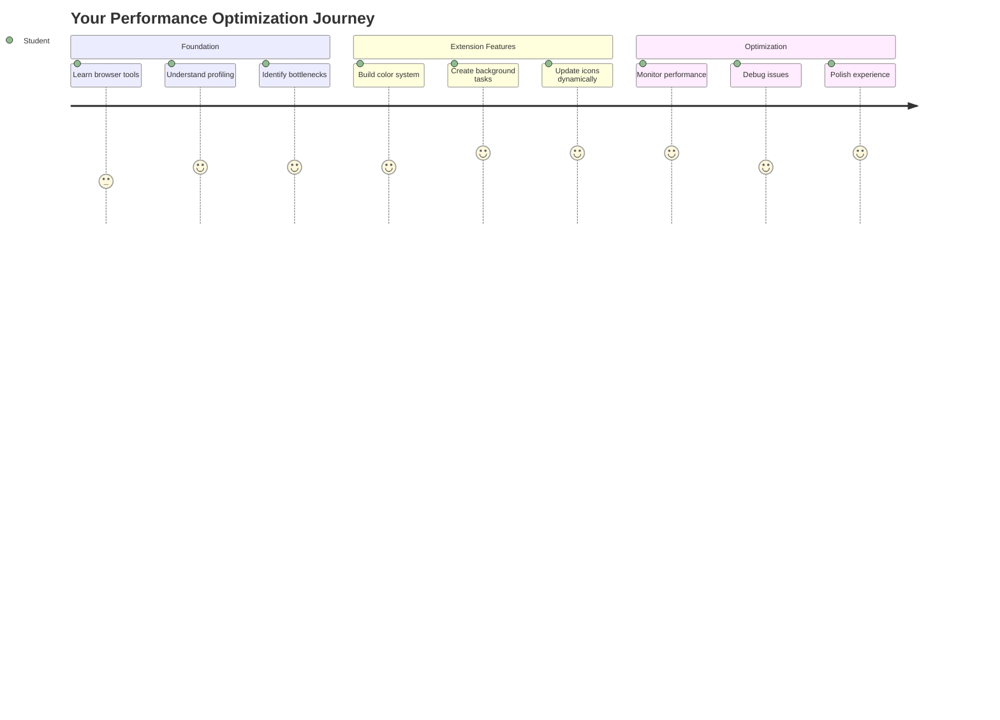
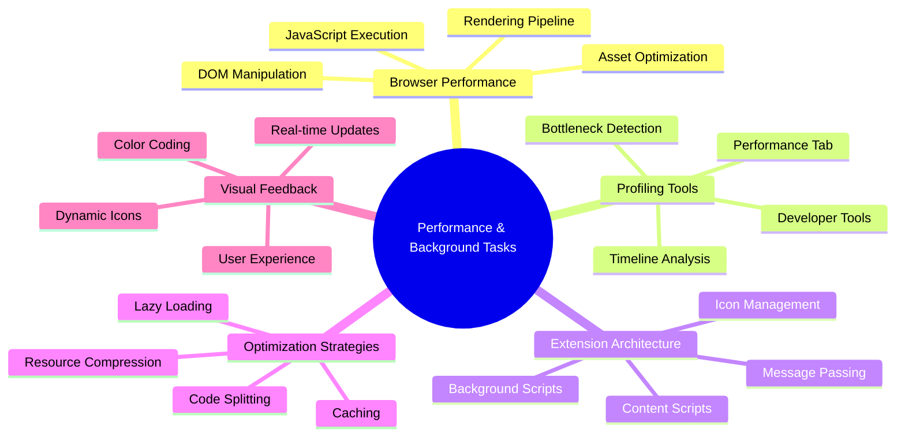
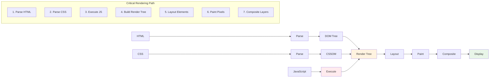
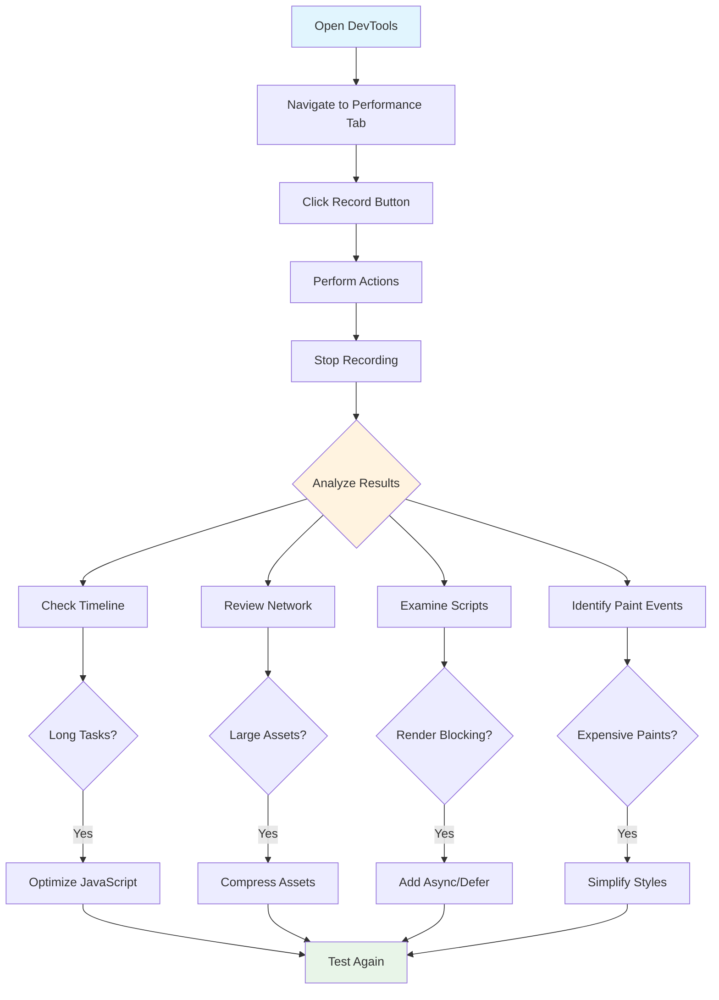
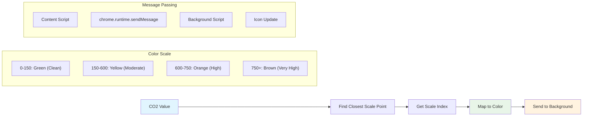
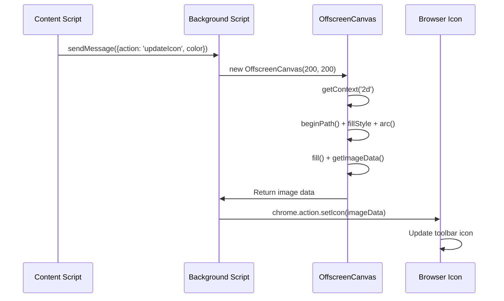
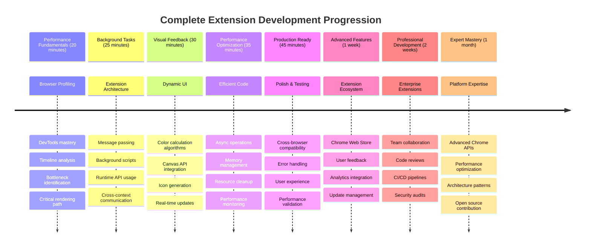

<!--
CO_OP_TRANSLATOR_METADATA:
{
  "original_hash": "b275fed2c6fc90d2b9b6661a3225faa2",
  "translation_date": "2025-11-06T11:58:22+00:00",
  "source_file": "5-browser-extension/3-background-tasks-and-performance/README.md",
  "language_code": "id"
}
-->
# Proyek Ekstensi Browser Bagian 3: Pelajari Tugas Latar Belakang dan Performa



Pernah bertanya-tanya mengapa beberapa ekstensi browser terasa cepat dan responsif sementara yang lain terasa lambat? Rahasianya terletak pada apa yang terjadi di balik layar. Saat pengguna mengklik antarmuka ekstensi Anda, ada dunia proses latar belakang yang diam-diam mengelola pengambilan data, pembaruan ikon, dan sumber daya sistem.

Ini adalah pelajaran terakhir dalam seri ekstensi browser, dan kami akan membuat pelacak jejak karbon Anda bekerja dengan lancar. Anda akan menambahkan pembaruan ikon dinamis dan belajar cara mendeteksi masalah performa sebelum menjadi masalah besar. Ini seperti menyetel mobil balap - optimasi kecil dapat membuat perbedaan besar dalam cara semuanya berjalan.

Saat kita selesai, Anda akan memiliki ekstensi yang sudah dipoles dan memahami prinsip performa yang membedakan aplikasi web yang baik dari yang hebat. Mari kita selami dunia optimasi browser.

## Kuis Pra-Pelajaran

[Kuis pra-pelajaran](https://ff-quizzes.netlify.app/web/quiz/27)

### Pengantar

Dalam pelajaran sebelumnya, Anda telah membuat formulir, menghubungkannya ke API, dan menangani pengambilan data asinkron. Ekstensi Anda mulai terbentuk dengan baik.

Sekarang kita perlu menambahkan sentuhan akhir - seperti membuat ikon ekstensi berubah warna berdasarkan data karbon. Ini mengingatkan saya pada bagaimana NASA harus mengoptimalkan setiap sistem di pesawat ruang angkasa Apollo. Mereka tidak bisa membuang siklus atau memori karena performa sangat penting. Meskipun ekstensi browser kita tidak sepenting itu, prinsip yang sama berlaku - kode yang efisien menciptakan pengalaman pengguna yang lebih baik.



## Dasar-Dasar Performa Web

Ketika kode Anda berjalan dengan efisien, orang benar-benar *merasakan* perbedaannya. Anda tahu momen ketika sebuah halaman langsung dimuat atau animasi berjalan dengan mulus? Itu adalah performa yang baik.

Performa bukan hanya tentang kecepatan - ini tentang menciptakan pengalaman web yang terasa alami daripada kaku dan membuat frustrasi. Pada masa awal komputasi, Grace Hopper terkenal menyimpan nanodetik (seutas kawat sepanjang sekitar satu kaki) di mejanya untuk menunjukkan seberapa jauh cahaya bergerak dalam satu miliar detik. Itu adalah caranya menjelaskan mengapa setiap mikrodetik penting dalam komputasi. Mari kita jelajahi alat detektif yang membantu Anda mencari tahu apa yang memperlambat segalanya.

> "Performa situs web adalah tentang dua hal: seberapa cepat halaman dimuat, dan seberapa cepat kode di dalamnya berjalan." -- [Zack Grossbart](https://www.smashingmagazine.com/2012/06/javascript-profiling-chrome-developer-tools/)

Topik tentang cara membuat situs web Anda sangat cepat di semua jenis perangkat, untuk semua jenis pengguna, dalam semua jenis situasi, tidak mengherankan, sangat luas. Berikut adalah beberapa poin yang perlu diingat saat Anda membangun proyek web standar atau ekstensi browser.

Langkah pertama dalam mengoptimalkan situs Anda adalah memahami apa yang sebenarnya terjadi di balik layar. Untungnya, browser Anda dilengkapi dengan alat detektif yang kuat.



Untuk membuka Developer Tools di Edge, klik tiga titik di sudut kanan atas, lalu pergi ke More Tools > Developer Tools. Atau gunakan pintasan keyboard: `Ctrl` + `Shift` + `I` di Windows atau `Option` + `Command` + `I` di Mac. Setelah Anda berada di sana, klik tab Performance - di sinilah Anda akan melakukan investigasi.

**Berikut adalah alat detektif performa Anda:**
- **Buka** Developer Tools (Anda akan sering menggunakannya sebagai pengembang!)
- **Pergi** ke tab Performance - anggap ini sebagai pelacak kebugaran aplikasi web Anda
- **Tekan** tombol Record dan lihat halaman Anda beraksi
- **Pelajari** hasilnya untuk menemukan apa yang memperlambat segalanya

Mari kita coba ini. Buka sebuah situs web (Microsoft.com bekerja dengan baik untuk ini) dan klik tombol 'Record'. Sekarang segarkan halaman dan lihat profiler menangkap semua yang terjadi. Ketika Anda berhenti merekam, Anda akan melihat rincian mendetail tentang bagaimana browser 'menyusun', 'merender', dan 'melukis' situs tersebut. Ini mengingatkan saya pada bagaimana pusat kendali misi memantau setiap sistem selama peluncuran roket - Anda mendapatkan data waktu nyata tentang apa yang terjadi dan kapan.


✅ [Dokumentasi Microsoft](https://docs.microsoft.com/microsoft-edge/devtools-guide/performance/?WT.mc_id=academic-77807-sagibbon) memiliki banyak detail jika Anda ingin mendalami lebih jauh

> Tip: Bersihkan cache browser Anda sebelum menguji untuk melihat bagaimana situs Anda bekerja untuk pengunjung pertama kali - biasanya sangat berbeda dari kunjungan ulang!

Pilih elemen dari timeline profil untuk memperbesar peristiwa yang terjadi saat halaman Anda dimuat.

Dapatkan snapshot performa halaman Anda dengan memilih bagian dari timeline profil dan melihat panel ringkasan:


Periksa panel Event Log untuk melihat apakah ada peristiwa yang memakan waktu lebih dari 15 ms:


✅ Kenali profiler Anda! Buka developer tools di situs ini dan lihat apakah ada hambatan. Apa aset yang paling lambat dimuat? Yang tercepat?



## Apa yang Harus Dicari Saat Profiling

Menjalankan profiler hanyalah permulaan - keterampilan sebenarnya adalah mengetahui apa yang sebenarnya dikatakan oleh grafik berwarna-warni tersebut. Jangan khawatir, Anda akan terbiasa membacanya. Pengembang berpengalaman telah belajar mengenali tanda-tanda peringatan sebelum menjadi masalah besar.

Mari kita bicara tentang pelaku masalah yang biasa - penyebab masalah performa yang cenderung menyelinap ke dalam proyek web. Seperti bagaimana Marie Curie harus memantau tingkat radiasi di labnya dengan hati-hati, kita perlu mengawasi pola tertentu yang menunjukkan masalah yang sedang berkembang. Menangkap ini lebih awal akan menghemat banyak frustrasi bagi Anda (dan pengguna Anda).

**Ukuran aset**: Situs web telah menjadi semakin "berat" selama bertahun-tahun, dan banyak dari berat tambahan itu berasal dari gambar. Ini seperti kita terus memasukkan lebih banyak ke dalam koper digital kita.

✅ Lihat [Internet Archive](https://httparchive.org/reports/page-weight) untuk melihat bagaimana ukuran halaman telah berkembang dari waktu ke waktu - ini cukup mengungkapkan.

**Berikut cara menjaga aset Anda tetap optimal:**
- **Kompres** gambar-gambar tersebut! Format modern seperti WebP dapat memangkas ukuran file secara dramatis
- **Sajikan** ukuran gambar yang tepat untuk setiap perangkat - tidak perlu mengirim gambar desktop besar ke ponsel
- **Minify** CSS dan JavaScript Anda - setiap byte penting
- **Gunakan** lazy loading sehingga gambar hanya diunduh saat pengguna benar-benar menggulir ke sana

**Traversals DOM**: Browser harus membangun Document Object Model berdasarkan kode yang Anda tulis, jadi demi performa halaman yang baik, jaga agar tag Anda seminimal mungkin, hanya menggunakan dan menata apa yang dibutuhkan halaman. Dalam hal ini, CSS yang berlebihan yang terkait dengan halaman dapat dioptimalkan; gaya yang hanya perlu digunakan di satu halaman tidak perlu dimasukkan dalam lembar gaya utama, misalnya.

**Strategi utama untuk optimasi DOM:**
- **Minimalkan** jumlah elemen HTML dan tingkat nesting
- **Hapus** aturan CSS yang tidak digunakan dan konsolidasikan stylesheet secara efisien
- **Organisasikan** CSS untuk memuat hanya yang diperlukan untuk setiap halaman
- **Strukturkan** HTML secara semantik untuk parsing browser yang lebih baik

**JavaScript**: Setiap pengembang JavaScript harus memperhatikan skrip 'render-blocking' yang harus dimuat sebelum sisa DOM dapat ditelusuri dan dilukis ke browser. Pertimbangkan menggunakan `defer` dengan skrip inline Anda (seperti yang dilakukan dalam modul Terrarium).

**Teknik optimasi JavaScript modern:**
- **Gunakan** atribut `defer` untuk memuat skrip setelah parsing DOM
- **Implementasikan** code splitting untuk memuat JavaScript yang diperlukan saja
- **Terapkan** lazy loading untuk fungsi yang tidak kritis
- **Minimalkan** penggunaan library dan framework yang berat jika memungkinkan

✅ Coba beberapa situs di [Situs Uji Kecepatan](https://www.webpagetest.org/) untuk mempelajari lebih lanjut tentang pemeriksaan umum yang dilakukan untuk menentukan performa situs.

### 🔄 **Pengecekan Pedagogis**
**Pemahaman Performa**: Sebelum membangun fitur ekstensi, pastikan Anda dapat:
- ✅ Jelaskan jalur rendering kritis dari HTML ke piksel
- ✅ Identifikasi hambatan performa umum dalam aplikasi web
- ✅ Gunakan alat pengembang browser untuk memprofil performa halaman
- ✅ Pahami bagaimana ukuran aset dan kompleksitas DOM memengaruhi kecepatan

**Tes Diri Cepat**: Apa yang terjadi ketika Anda memiliki JavaScript yang menghalangi render?
*Jawaban: Browser harus mengunduh dan menjalankan skrip sebelum dapat melanjutkan parsing HTML dan merender halaman*

**Dampak Performa Dunia Nyata**:
- **Penundaan 100ms**: Pengguna memperhatikan perlambatan
- **Penundaan 1 detik**: Pengguna mulai kehilangan fokus
- **Penundaan 3+ detik**: 40% pengguna meninggalkan halaman
- **Jaringan seluler**: Performa menjadi lebih penting

Sekarang setelah Anda memiliki gambaran tentang bagaimana browser merender aset yang Anda kirimkan, mari kita lihat beberapa hal terakhir yang perlu Anda lakukan untuk menyelesaikan ekstensi Anda:

### Buat fungsi untuk menghitung warna

Sekarang kita akan membuat fungsi yang mengubah data numerik menjadi warna yang bermakna. Anggap ini seperti sistem lampu lalu lintas - hijau untuk energi bersih, merah untuk intensitas karbon tinggi.

Fungsi ini akan mengambil data CO2 dari API kita dan menentukan warna apa yang paling mewakili dampak lingkungan. Ini mirip dengan bagaimana para ilmuwan menggunakan kode warna dalam peta panas untuk memvisualisasikan pola data yang kompleks - dari suhu laut hingga pembentukan bintang. Mari tambahkan ini ke `/src/index.js`, tepat setelah variabel `const` yang kita tetapkan sebelumnya:



```javascript
function calculateColor(value) {
	// Define CO2 intensity scale (grams per kWh)
	const co2Scale = [0, 150, 600, 750, 800];
	// Corresponding colors from green (clean) to dark brown (high carbon)
	const colors = ['#2AA364', '#F5EB4D', '#9E4229', '#381D02', '#381D02'];

	// Find the closest scale value to our input
	const closestNum = co2Scale.sort((a, b) => {
		return Math.abs(a - value) - Math.abs(b - value);
	})[0];
	
	console.log(`${value} is closest to ${closestNum}`);
	
	// Find the index for color mapping
	const num = (element) => element > closestNum;
	const scaleIndex = co2Scale.findIndex(num);

	const closestColor = colors[scaleIndex];
	console.log(scaleIndex, closestColor);

	// Send color update message to background script
	chrome.runtime.sendMessage({ action: 'updateIcon', value: { color: closestColor } });
}
```

**Mari kita uraikan fungsi kecil yang cerdas ini:**
- **Menyiapkan** dua array - satu untuk tingkat CO2, satu lagi untuk warna (hijau = bersih, coklat = kotor!)
- **Menemukan** kecocokan terdekat dengan nilai CO2 aktual kita menggunakan beberapa pengurutan array yang rapi
- **Mengambil** warna yang cocok menggunakan metode findIndex()
- **Mengirim** pesan ke skrip latar belakang Chrome dengan warna yang kita pilih
- **Menggunakan** template literal (backticks) untuk format string yang lebih bersih
- **Menjaga** semuanya terorganisir dengan deklarasi const

API `chrome.runtime` [API](https://developer.chrome.com/extensions/runtime) seperti sistem saraf ekstensi Anda - ini menangani semua komunikasi dan tugas di balik layar:

> "Gunakan API chrome.runtime untuk mengambil halaman latar belakang, mengembalikan detail tentang manifest, dan mendengarkan serta merespons peristiwa dalam siklus hidup aplikasi atau ekstensi. Anda juga dapat menggunakan API ini untuk mengonversi jalur relatif URL menjadi URL yang sepenuhnya memenuhi syarat."

**Mengapa API Chrome Runtime sangat berguna:**
- **Memungkinkan** bagian-bagian berbeda dari ekstensi Anda berbicara satu sama lain
- **Menangani** pekerjaan latar belakang tanpa membekukan antarmuka pengguna
- **Mengelola** peristiwa siklus hidup ekstensi Anda
- **Membuat** pengiriman pesan antar skrip menjadi sangat mudah

✅ Jika Anda mengembangkan ekstensi browser ini untuk Edge, mungkin mengejutkan Anda bahwa Anda menggunakan API chrome. Versi browser Edge yang lebih baru berjalan di mesin browser Chromium, sehingga Anda dapat memanfaatkan alat ini.

```mermaid
architecture-beta
    group browser(logos:chrome)[Browser]
    
    service popup(logos:html5)[Popup UI] in browser
    service content(logos:javascript)[Content Script] in browser
    service background(database)[Background Script] in browser
    service api(logos:api)[External API] in browser
    
    popup:R -- L:content
    content:R -- L:background
    background:T -- B:api
    content:T -- B:api
    
    junction junctionCenter in browser
    popup:R -- L:junctionCenter
    junctionCenter:R -- L:background
```



> **Tip**: Jika Anda ingin memprofil ekstensi browser, buka dev tools dari dalam ekstensi itu sendiri, karena ini adalah instance browser terpisah. Ini memberi Anda akses ke metrik performa khusus ekstensi.

### Tetapkan warna ikon default

Sebelum kita mulai mengambil data nyata, mari beri ekstensi kita titik awal. Tidak ada yang suka melihat ikon yang kosong atau terlihat rusak. Kita akan mulai dengan warna hijau sehingga pengguna tahu ekstensi berfungsi sejak saat mereka menginstalnya.

Dalam fungsi `init()` Anda, mari kita atur ikon hijau default itu:

```javascript
chrome.runtime.sendMessage({
	action: 'updateIcon',
	value: {
		color: 'green',
	},
});
```

**Apa yang dicapai oleh inisialisasi ini:**
- **Menetapkan** warna hijau netral sebagai keadaan default
- **Memberikan** umpan balik visual langsung saat ekstensi dimuat
- **Membangun** pola komunikasi dengan skrip latar belakang
- **Memastikan** pengguna melihat ekstensi yang berfungsi sebelum data dimuat
### Panggil fungsi, eksekusi panggilan

Sekarang mari kita hubungkan semuanya sehingga ketika data CO2 baru masuk, ikon Anda secara otomatis diperbarui dengan warna yang tepat. Ini seperti menghubungkan sirkuit terakhir dalam perangkat elektronik - tiba-tiba semua komponen individu bekerja sebagai satu sistem.

Tambahkan baris ini tepat setelah Anda mendapatkan data CO2 dari API:

```javascript
// After retrieving CO2 data from the API
// let CO2 = data.data[0].intensity.actual;
calculateColor(CO2);
```

**Integrasi ini mencapai:**
- **Menghubungkan** aliran data API dengan sistem indikator visual
- **Memicu** pembaruan ikon secara otomatis saat data baru tiba
- **Memastikan** umpan balik visual waktu nyata berdasarkan intensitas karbon saat ini
- **Mempertahankan** pemisahan perhatian antara pengambilan data dan logika tampilan

Dan akhirnya, di `/dist/background.js`, tambahkan pendengar untuk panggilan aksi latar belakang ini:

```javascript
// Listen for messages from the content script
chrome.runtime.onMessage.addListener(function (msg, sender, sendResponse) {
	if (msg.action === 'updateIcon') {
		chrome.action.setIcon({ imageData: drawIcon(msg.value) });
	}
});

// Draw dynamic icon using Canvas API
// Borrowed from energy lollipop extension - nice feature!
function drawIcon(value) {
	// Create an offscreen canvas for better performance
	const canvas = new OffscreenCanvas(200, 200);
	const context = canvas.getContext('2d');

	// Draw a colored circle representing carbon intensity
	context.beginPath();
	context.fillStyle = value.color;
	context.arc(100, 100, 50, 0, 2 * Math.PI);
	context.fill();

	// Return the image data for the browser icon
	return context.getImageData(50, 50, 100, 100);
}
```

**Berikut apa yang dilakukan skrip latar belakang ini:**
- **Mendengarkan** pesan dari skrip utama Anda (seperti resepsionis yang menerima panggilan)
- **Memproses** permintaan 'updateIcon' untuk mengubah ikon toolbar Anda
- **Membuat** ikon baru secara langsung menggunakan Canvas API
- **Menggambar** lingkaran berwarna sederhana yang menunjukkan intensitas karbon saat ini
- **Memperbarui** toolbar browser Anda dengan ikon baru
- **Menggunakan** OffscreenCanvas untuk performa yang mulus (tanpa UI yang terblokir)

✅ Anda akan belajar lebih banyak tentang Canvas API dalam [pelajaran Space Game](../../6-space-game/2-drawing-to-canvas/README.md).



### 🔄 **Pengecekan Pedagogis**
**Pemahaman Lengkap Ekstensi**: Verifikasi penguasaan Anda atas seluruh sistem:
- ✅ Bagaimana cara kerja pengiriman pesan antara skrip ekstensi yang berbeda?
- ✅ Mengapa kita menggunakan OffscreenCanvas daripada Canvas biasa untuk performa?
- ✅ Apa peran Chrome Runtime API dalam arsitektur ekstensi?
- ✅ Bagaimana algoritma perhitungan warna memetakan data ke umpan balik visual?

**Pertimbangan Kinerja**: Ekstensi Anda sekarang menunjukkan:
- **Pesan yang efisien**: Komunikasi yang bersih antara konteks skrip
- **Rendering yang dioptimalkan**: OffscreenCanvas mencegah UI terblokir
- **Pembaruan real-time**: Perubahan ikon dinamis berdasarkan data langsung
- **Manajemen memori**: Pembersihan dan penanganan sumber daya yang tepat

**Saatnya menguji ekstensi Anda:**
- **Bangun** semuanya dengan `npm run build`
- **Muat ulang** ekstensi Anda di browser (jangan lupa langkah ini)
- **Buka** ekstensi Anda dan lihat ikon berubah warna
- **Periksa** bagaimana ia merespons data karbon nyata dari seluruh dunia

Sekarang Anda akan tahu sekilas apakah ini waktu yang tepat untuk mencuci pakaian atau sebaiknya menunggu energi yang lebih bersih. Anda baru saja membangun sesuatu yang benar-benar berguna dan belajar tentang kinerja browser di sepanjang jalan.

## Tantangan GitHub Copilot Agent 🚀

Gunakan mode Agent untuk menyelesaikan tantangan berikut:

**Deskripsi:** Tingkatkan kemampuan pemantauan kinerja ekstensi browser dengan menambahkan fitur yang melacak dan menampilkan waktu pemuatan untuk berbagai komponen ekstensi.

**Prompt:** Buat sistem pemantauan kinerja untuk ekstensi browser yang mengukur dan mencatat waktu yang diperlukan untuk mengambil data CO2 dari API, menghitung warna, dan memperbarui ikon. Tambahkan fungsi bernama `performanceTracker` yang menggunakan Performance API untuk mengukur operasi ini dan menampilkan hasilnya di konsol browser dengan stempel waktu dan metrik durasi.

Pelajari lebih lanjut tentang [mode agent](https://code.visualstudio.com/blogs/2025/02/24/introducing-copilot-agent-mode) di sini.

## 🚀 Tantangan

Berikut adalah misi detektif yang menarik: pilih beberapa situs web open source yang telah ada selama bertahun-tahun (seperti Wikipedia, GitHub, atau Stack Overflow) dan telusuri riwayat commit mereka. Bisakah Anda menemukan di mana mereka melakukan peningkatan kinerja? Masalah apa yang terus muncul?

**Pendekatan investigasi Anda:**
- **Cari** pesan commit dengan kata-kata seperti "optimalkan," "kinerja," atau "lebih cepat"
- **Perhatikan** pola - apakah mereka terus memperbaiki jenis masalah yang sama?
- **Identifikasi** penyebab umum yang memperlambat situs web
- **Bagikan** apa yang Anda temukan - pengembang lain belajar dari contoh dunia nyata

## Kuis Pasca-Kuliah

[Kuis pasca-kuliah](https://ff-quizzes.netlify.app/web/quiz/28)

## Tinjauan & Studi Mandiri

Pertimbangkan untuk mendaftar ke [newsletter kinerja](https://perf.email/)

Selidiki beberapa cara browser mengukur kinerja web dengan melihat melalui tab kinerja di alat web mereka. Apakah Anda menemukan perbedaan besar?

### ⚡ **Apa yang Bisa Anda Lakukan dalam 5 Menit Berikutnya**
- [ ] Buka Task Manager browser (Shift+Esc di Chrome) untuk melihat penggunaan sumber daya ekstensi
- [ ] Gunakan tab Performance di DevTools untuk merekam dan menganalisis kinerja halaman web
- [ ] Periksa halaman Ekstensi browser untuk melihat ekstensi mana yang memengaruhi waktu startup
- [ ] Coba nonaktifkan ekstensi sementara untuk melihat perbedaan kinerja

### 🎯 **Apa yang Bisa Anda Capai dalam Satu Jam**
- [ ] Selesaikan kuis pasca-pelajaran dan pahami konsep kinerja
- [ ] Implementasikan skrip latar belakang untuk ekstensi browser Anda
- [ ] Pelajari cara menggunakan browser.alarms untuk tugas latar belakang yang efisien
- [ ] Latih pengiriman pesan antara skrip konten dan skrip latar belakang
- [ ] Ukur dan optimalkan penggunaan sumber daya ekstensi Anda

### 📅 **Perjalanan Kinerja Anda Selama Seminggu**
- [ ] Selesaikan ekstensi browser berkinerja tinggi dengan fungsi latar belakang
- [ ] Kuasai service workers dan arsitektur ekstensi modern
- [ ] Implementasikan strategi sinkronisasi data dan caching yang efisien
- [ ] Pelajari teknik debugging lanjutan untuk kinerja ekstensi
- [ ] Optimalkan ekstensi Anda untuk fungsionalitas dan efisiensi sumber daya
- [ ] Buat pengujian komprehensif untuk skenario kinerja ekstensi

### 🌟 **Penguasaan Optimasi Anda Selama Sebulan**
- [ ] Bangun ekstensi browser kelas enterprise dengan kinerja optimal
- [ ] Pelajari tentang Web Workers, Service Workers, dan kinerja web modern
- [ ] Berkontribusi pada proyek open source yang berfokus pada optimasi kinerja
- [ ] Kuasai internal browser dan teknik debugging lanjutan
- [ ] Buat alat pemantauan kinerja dan panduan praktik terbaik
- [ ] Jadilah ahli kinerja yang membantu mengoptimalkan aplikasi web

## 🎯 Garis Waktu Penguasaan Pengembangan Ekstensi Browser Anda



### 🛠️ Toolkit Lengkap Pengembangan Ekstensi Anda

Setelah menyelesaikan trilogi ini, Anda sekarang telah menguasai:
- **Arsitektur Browser**: Pemahaman mendalam tentang bagaimana ekstensi terintegrasi dengan sistem browser
- **Profil Kinerja**: Kemampuan untuk mengidentifikasi dan memperbaiki hambatan menggunakan alat pengembang
- **Pemrograman Async**: Pola JavaScript modern untuk operasi yang responsif dan tidak terblokir
- **Integrasi API**: Pengambilan data eksternal dengan autentikasi dan penanganan kesalahan
- **Desain Visual**: Pembaruan UI dinamis dan pembuatan grafik berbasis Canvas
- **Pengiriman Pesan**: Komunikasi antar-skrip dalam arsitektur ekstensi
- **Pengalaman Pengguna**: Status pemuatan, penanganan kesalahan, dan interaksi yang intuitif
- **Keterampilan Produksi**: Pengujian, debugging, dan optimasi untuk penerapan dunia nyata

**Aplikasi Dunia Nyata**: Keterampilan pengembangan ekstensi Anda langsung berlaku untuk:
- **Aplikasi Web Progresif**: Arsitektur dan pola kinerja yang serupa
- **Aplikasi Desktop Electron**: Aplikasi lintas platform menggunakan teknologi web
- **Aplikasi Hybrid Mobile**: Pengembangan Cordova/PhoneGap menggunakan API web
- **Aplikasi Web Enterprise**: Alat dasbor dan produktivitas yang kompleks
- **Ekstensi Chrome DevTools**: Alat pengembang dan debugging yang canggih
- **Integrasi API Web**: Aplikasi apa pun yang berkomunikasi dengan layanan eksternal

**Dampak Profesional**: Anda sekarang dapat:
- **Membangun** ekstensi browser siap produksi dari konsep hingga penerapan
- **Mengoptimalkan** kinerja aplikasi web menggunakan alat profil standar industri
- **Merancang** sistem yang skalabel dengan pemisahan yang tepat
- **Debug** operasi async yang kompleks dan komunikasi lintas konteks
- **Berkontribusi** pada proyek ekstensi open source dan standar browser

**Peluang Tingkat Lanjut**:
- **Pengembang Chrome Web Store**: Publikasikan ekstensi untuk jutaan pengguna
- **Insinyur Kinerja Web**: Spesialisasi dalam optimasi dan pengalaman pengguna
- **Pengembang Platform Browser**: Berkontribusi pada pengembangan mesin browser
- **Pencipta Kerangka Ekstensi**: Bangun alat yang membantu pengembang lain
- **Hubungan Pengembang**: Bagikan pengetahuan melalui pengajaran dan pembuatan konten

🌟 **Pencapaian Terkunci**: Anda telah membangun ekstensi browser yang lengkap dan fungsional yang menunjukkan praktik pengembangan profesional dan standar web modern!

## Tugas

[Analisis situs untuk kinerja](assignment.md)

---

**Penafian**:  
Dokumen ini telah diterjemahkan menggunakan layanan penerjemahan AI [Co-op Translator](https://github.com/Azure/co-op-translator). Meskipun kami berupaya untuk memberikan hasil yang akurat, harap diketahui bahwa terjemahan otomatis mungkin mengandung kesalahan atau ketidakakuratan. Dokumen asli dalam bahasa aslinya harus dianggap sebagai sumber yang otoritatif. Untuk informasi yang penting, disarankan menggunakan jasa penerjemahan manusia profesional. Kami tidak bertanggung jawab atas kesalahpahaman atau penafsiran yang timbul dari penggunaan terjemahan ini.