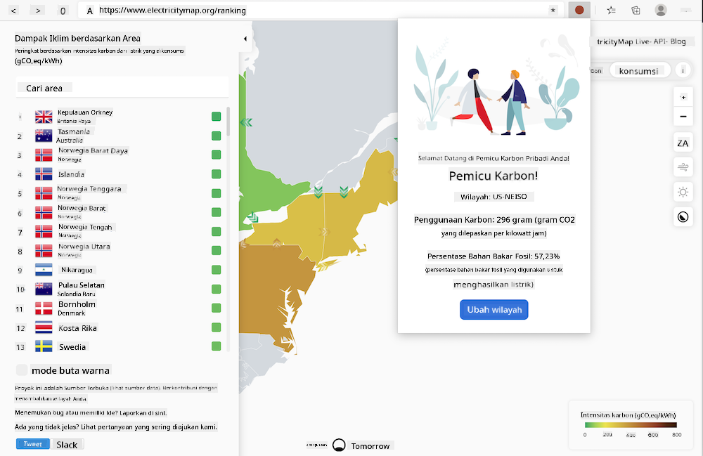

<!--
CO_OP_TRANSLATOR_METADATA:
{
  "original_hash": "3f5e6821e0febccfc5d05e7c944d9e3d",
  "translation_date": "2025-08-27T22:25:39+00:00",
  "source_file": "5-browser-extension/solution/translation/README.ja.md",
  "language_code": "id"
}
-->
# Ekstensi Browser Carbon Trigger: Kode Selesai

Bangun ekstensi browser yang memungkinkan Anda menampilkan pengingat di browser tentang seberapa besar konsumsi listrik di wilayah Anda, menggunakan API CO2 Signal dari tmrow untuk melacak penggunaan listrik. Dengan menggunakan ekstensi ini secara ad-hoc, Anda dapat membuat keputusan berdasarkan informasi ini untuk aktivitas Anda.



## Memulai

Anda perlu menginstal [npm](https://npmjs.com). Unduh salinan kode ini ke folder di komputer Anda.

Instal semua paket yang diperlukan.

```
npm install
```

Bangun ekstensi menggunakan webpack.

```
npm run build
```

Untuk menginstalnya di Edge, temukan panel "Ekstensi" dari menu "tiga titik" di kanan atas browser. Dari sana, pilih "Load Unpacked" untuk memuat ekstensi baru. Ketika diminta, buka folder "dist", dan ekstensi akan dimuat. Untuk menggunakannya, Anda memerlukan API key dari CO2 Signal API ([dapatkan di sini melalui email](https://www.co2signal.com/) - masukkan email Anda di kotak pada halaman tersebut) dan [kode untuk wilayah Anda](http://api.electricitymap.org/v3/zones) yang sesuai dengan [Electricity Map](https://www.electricitymap.org/map) (misalnya, untuk Boston, gunakan 'US-NEISO').


Setelah Anda memasukkan API key dan wilayah Anda di antarmuka ekstensi, titik berwarna yang muncul di bilah ekstensi browser akan berubah, mencerminkan konsumsi energi di wilayah Anda. Ini akan membantu Anda menentukan aktivitas apa yang sesuai berdasarkan kebutuhan energi. Konsep sistem "titik" ini terinspirasi oleh [Energy Lollipop extension](https://energylollipop.com/) untuk emisi di California.

---

**Penafian**:  
Dokumen ini telah diterjemahkan menggunakan layanan penerjemahan AI [Co-op Translator](https://github.com/Azure/co-op-translator). Meskipun kami berusaha untuk memberikan hasil yang akurat, harap diingat bahwa terjemahan otomatis mungkin mengandung kesalahan atau ketidakakuratan. Dokumen asli dalam bahasa aslinya harus dianggap sebagai sumber yang otoritatif. Untuk informasi yang bersifat kritis, disarankan menggunakan jasa penerjemahan profesional oleh manusia. Kami tidak bertanggung jawab atas kesalahpahaman atau penafsiran yang keliru yang timbul dari penggunaan terjemahan ini.