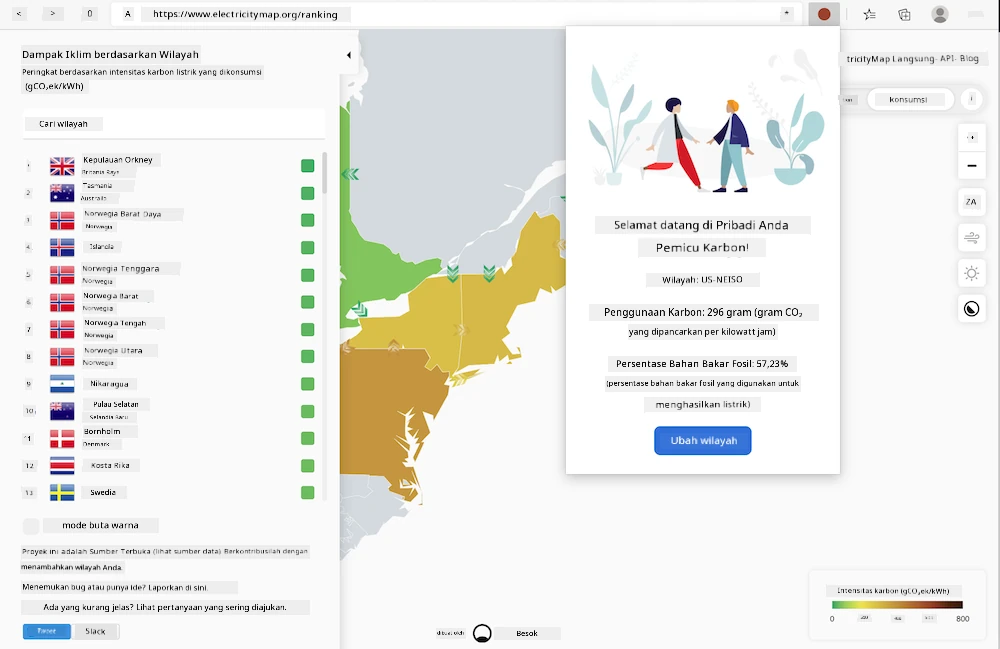
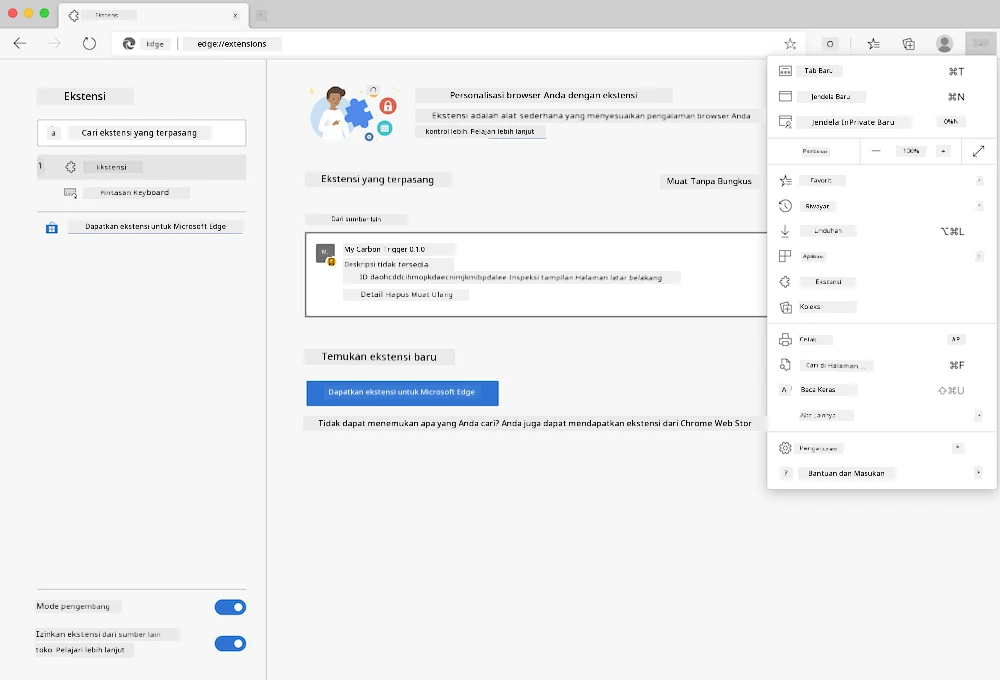

<!--
CO_OP_TRANSLATOR_METADATA:
{
  "original_hash": "21b364c158c8e4f698de65eeac16c9fe",
  "translation_date": "2025-08-27T22:26:49+00:00",
  "source_file": "5-browser-extension/solution/translation/README.ms.md",
  "language_code": "id"
}
-->
# Sambungan Peramban Carbon Trigger: Kode Lengkap

Menggunakan API Sinyal CO2 dari tmrow untuk memantau penggunaan listrik, buat ekstensi peramban sehingga Anda dapat menerima peringatan di peramban Anda tentang seberapa besar konsumsi listrik di wilayah Anda. Menggunakan ekstensi ini secara khusus akan membantu Anda membuat keputusan tentang aktivitas Anda berdasarkan informasi tersebut.



## Memulai

Anda perlu menginstal [npm](https://npmjs.com). Unduh salinan kode ini ke folder di komputer Anda.

Instal semua paket yang diperlukan:

```
npm install
```

Bangun ekstensi menggunakan webpack:

```
npm run build
```

Untuk menginstal di Edge, gunakan menu 'tiga titik' di sudut kanan atas peramban untuk menemukan panel Ekstensi. Dari sana, pilih 'Load Unpacked' untuk memuat ekstensi baru. Buka folder 'dist' saat diminta, dan ekstensi akan dimuat. Untuk menggunakannya, Anda memerlukan kunci API untuk API Sinyal CO2 ([dapatkan satu di sini melalui email](https://www.co2signal.com/) - masukkan email Anda di kotak pada halaman tersebut) dan [kode untuk wilayah Anda](http://api.electricitymap.org/v3/zones) yang sesuai dengan [Peta Listrik](https://www.electricitymap.org/map) (di Boston, misalnya, saya menggunakan 'US-NEISO').



Setelah kunci API dan wilayah dimasukkan ke antarmuka ekstensi, titik berwarna di bilah ekstensi peramban akan berubah untuk mencerminkan konsumsi energi di wilayah Anda dan memberikan petunjuk tentang aktivitas berat yang sesuai untuk Anda lakukan. Konsep di balik sistem 'titik' ini terinspirasi oleh [ekstensi peramban Energy Lollipop](https://energylollipop.com/) untuk emisi di California.

---

**Penafian**:  
Dokumen ini telah diterjemahkan menggunakan layanan penerjemahan AI [Co-op Translator](https://github.com/Azure/co-op-translator). Meskipun kami berusaha untuk memberikan hasil yang akurat, harap diingat bahwa terjemahan otomatis mungkin mengandung kesalahan atau ketidakakuratan. Dokumen asli dalam bahasa aslinya harus dianggap sebagai sumber yang otoritatif. Untuk informasi yang bersifat kritis, disarankan menggunakan jasa penerjemahan profesional oleh manusia. Kami tidak bertanggung jawab atas kesalahpahaman atau penafsiran yang keliru yang timbul dari penggunaan terjemahan ini.