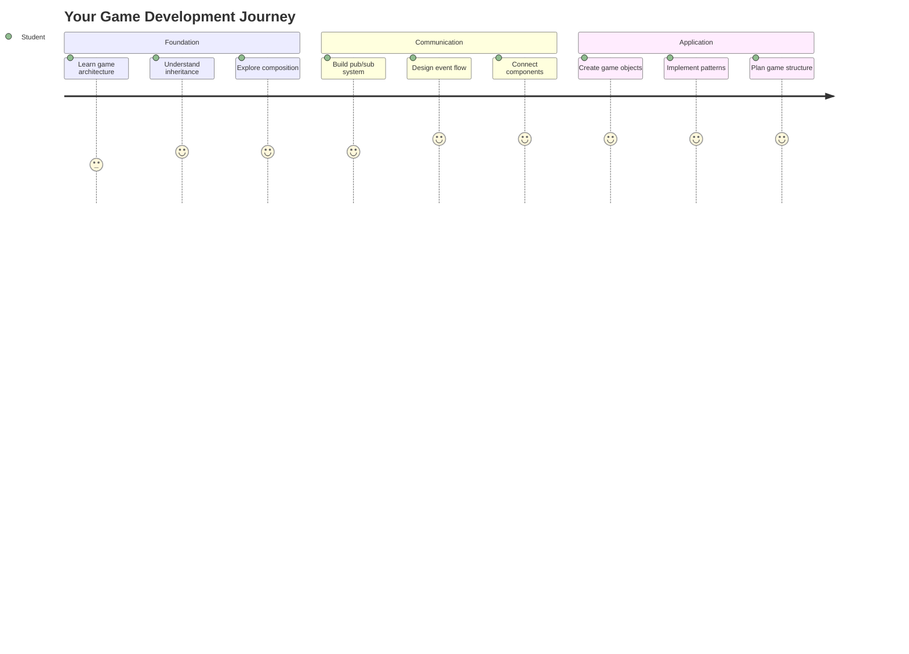
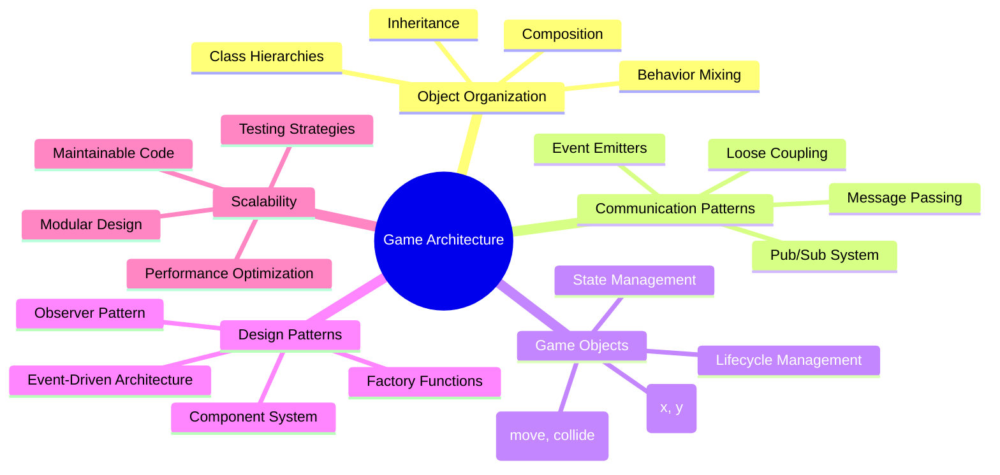
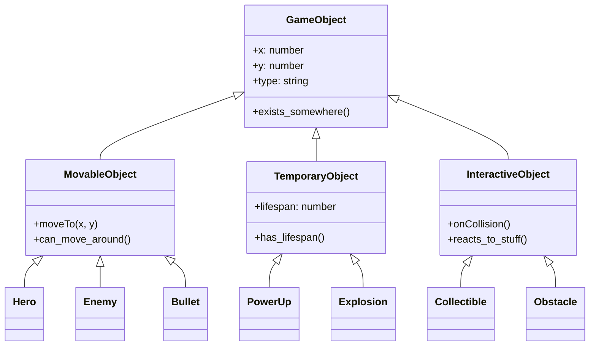
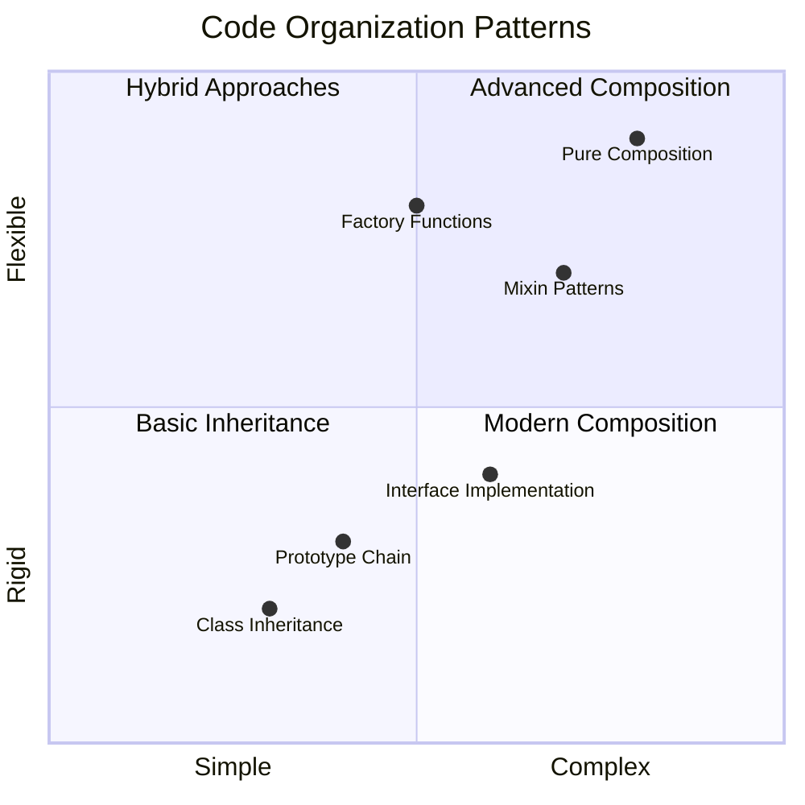
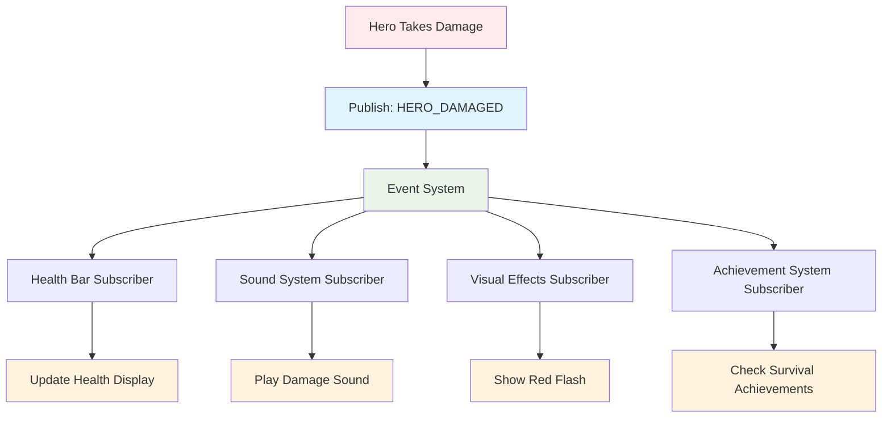
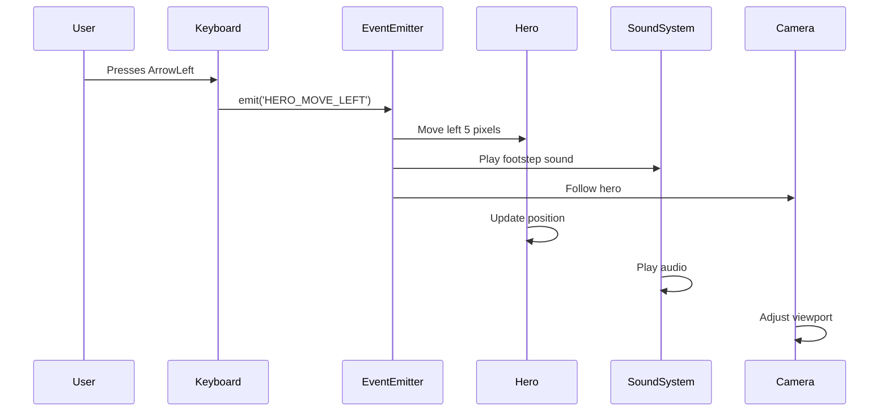
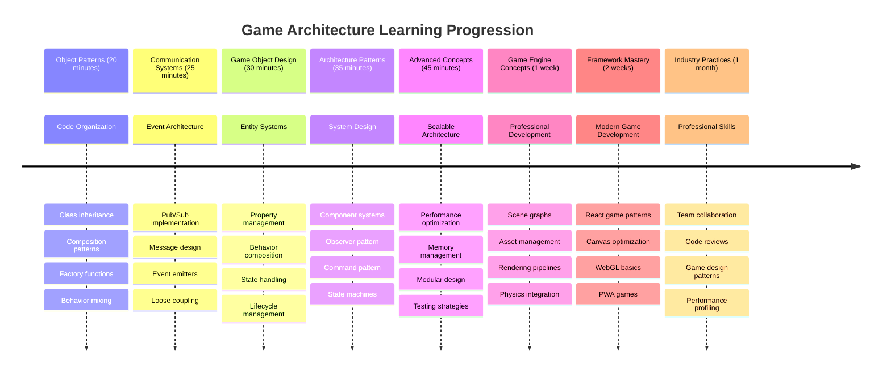

# Membangun Game Luar Angkasa Bagian 1: Pengantar




Seperti halnya misi NASA yang mengoordinasikan berbagai sistem selama peluncuran luar angkasa, kita akan membangun sebuah game luar angkasa yang menunjukkan bagaimana berbagai bagian dari sebuah program dapat bekerja bersama dengan lancar. Sambil menciptakan sesuatu yang bisa dimainkan, Anda akan mempelajari konsep pemrograman penting yang berlaku untuk proyek perangkat lunak apa pun.

Kita akan menjelajahi dua pendekatan mendasar untuk mengorganisasi kode: inheritance dan composition. Ini bukan hanya konsep akademis – ini adalah pola yang sama yang mendukung segalanya mulai dari video game hingga sistem perbankan. Kita juga akan menerapkan sistem komunikasi yang disebut pub/sub yang bekerja seperti jaringan komunikasi yang digunakan di pesawat luar angkasa, memungkinkan berbagai komponen berbagi informasi tanpa menciptakan ketergantungan.

Pada akhir seri ini, Anda akan memahami cara membangun aplikasi yang dapat berkembang dan beradaptasi – baik Anda mengembangkan game, aplikasi web, atau sistem perangkat lunak lainnya.



## Kuis Pra-Kuliah

[Kuis pra-kuliah](https://ff-quizzes.netlify.app/web/quiz/29)

## Inheritance dan Composition dalam Pengembangan Game

Saat proyek menjadi lebih kompleks, pengorganisasian kode menjadi sangat penting. Apa yang dimulai sebagai skrip sederhana dapat menjadi sulit untuk dikelola tanpa struktur yang tepat – seperti bagaimana misi Apollo memerlukan koordinasi yang hati-hati antara ribuan komponen.

Kita akan menjelajahi dua pendekatan mendasar untuk mengorganisasi kode: inheritance dan composition. Masing-masing memiliki keunggulan yang berbeda, dan memahami keduanya membantu Anda memilih pendekatan yang tepat untuk situasi yang berbeda. Kita akan mendemonstrasikan konsep-konsep ini melalui game luar angkasa kita, di mana pahlawan, musuh, power-up, dan objek lainnya harus berinteraksi secara efisien.

✅ Salah satu buku pemrograman paling terkenal yang pernah ditulis berkaitan dengan [design patterns](https://en.wikipedia.org/wiki/Design_Patterns).

Dalam game apa pun, Anda memiliki `game objects` – elemen interaktif yang mengisi dunia game Anda. Pahlawan, musuh, power-up, dan efek visual semuanya adalah objek game. Masing-masing ada di koordinat layar tertentu menggunakan nilai `x` dan `y`, mirip dengan memplot titik pada bidang koordinat.

Meskipun secara visual berbeda, objek-objek ini sering kali memiliki perilaku mendasar yang sama:

- **Mereka ada di suatu tempat** – Setiap objek memiliki koordinat x dan y sehingga game tahu di mana harus menggambarnya
- **Banyak yang bisa bergerak** – Pahlawan berlari, musuh mengejar, peluru melintasi layar
- **Mereka memiliki masa hidup** – Beberapa tetap ada selamanya, yang lain (seperti ledakan) muncul sebentar dan menghilang
- **Mereka bereaksi terhadap sesuatu** – Ketika benda bertabrakan, power-up dikumpulkan, bilah kesehatan diperbarui

✅ Pikirkan tentang game seperti Pac-Man. Bisakah Anda mengidentifikasi empat jenis objek yang tercantum di atas dalam game ini?



### Mengekspresikan Perilaku Melalui Kode

Sekarang setelah Anda memahami perilaku umum yang dimiliki objek game, mari kita jelajahi cara menerapkan perilaku ini dalam JavaScript. Anda dapat mengekspresikan perilaku objek melalui metode yang terlampir pada kelas atau objek individu, dan ada beberapa pendekatan yang dapat dipilih.

**Pendekatan Berbasis Kelas**

Kelas dan inheritance menyediakan pendekatan terstruktur untuk mengorganisasi objek game. Seperti sistem klasifikasi taksonomi yang dikembangkan oleh Carl Linnaeus, Anda mulai dengan kelas dasar yang berisi properti umum, lalu membuat kelas khusus yang mewarisi dasar-dasar ini sambil menambahkan kemampuan spesifik.

✅ Inheritance adalah konsep penting untuk dipahami. Pelajari lebih lanjut di [artikel MDN tentang inheritance](https://developer.mozilla.org/docs/Web/JavaScript/Inheritance_and_the_prototype_chain).

Berikut cara Anda dapat menerapkan objek game menggunakan kelas dan inheritance:

```javascript
// Step 1: Create the base GameObject class
class GameObject {
  constructor(x, y, type) {
    this.x = x;
    this.y = y;
    this.type = type;
  }
}
```

**Mari kita uraikan langkah demi langkah:**
- Kita membuat template dasar yang dapat digunakan setiap objek game
- Konstruktor menyimpan di mana objek berada (`x`, `y`) dan jenis objeknya
- Ini menjadi dasar yang akan digunakan semua objek game Anda

```javascript
// Step 2: Add movement capability through inheritance
class Movable extends GameObject {
  constructor(x, y, type) {
    super(x, y, type); // Call parent constructor
  }

  // Add the ability to move to a new position
  moveTo(x, y) {
    this.x = x;
    this.y = y;
  }
}
```

**Dalam kode di atas, kita telah:**
- **Memperluas** kelas GameObject untuk menambahkan fungsi gerakan
- **Memanggil** konstruktor induk menggunakan `super()` untuk menginisialisasi properti yang diwarisi
- **Menambahkan** metode `moveTo()` yang memperbarui posisi objek

```javascript
// Step 3: Create specific game object types
class Hero extends Movable {
  constructor(x, y) {
    super(x, y, 'Hero'); // Set type automatically
  }
}

class Tree extends GameObject {
  constructor(x, y) {
    super(x, y, 'Tree'); // Trees don't need movement
  }
}

// Step 4: Use your game objects
const hero = new Hero(0, 0);
hero.moveTo(5, 5); // Hero can move!

const tree = new Tree(10, 15);
// tree.moveTo() would cause an error - trees can't move
```

**Memahami konsep-konsep ini:**
- **Menciptakan** jenis objek khusus yang mewarisi perilaku yang sesuai
- **Menunjukkan** bagaimana inheritance memungkinkan inklusi fitur selektif
- **Menunjukkan** bahwa pahlawan dapat bergerak sementara pohon tetap diam
- **Mengilustrasikan** bagaimana hierarki kelas mencegah tindakan yang tidak sesuai

✅ Luangkan beberapa menit untuk membayangkan kembali pahlawan Pac-Man (Inky, Pinky, atau Blinky, misalnya) dan bagaimana itu akan ditulis dalam JavaScript.

**Pendekatan Komposisi**

Komposisi mengikuti filosofi desain modular, mirip dengan bagaimana insinyur merancang pesawat luar angkasa dengan komponen yang dapat diganti. Alih-alih mewarisi dari kelas induk, Anda menggabungkan perilaku spesifik untuk membuat objek dengan fungsi yang tepat yang mereka butuhkan. Pendekatan ini menawarkan fleksibilitas tanpa batasan hierarki yang kaku.

```javascript
// Step 1: Create base behavior objects
const gameObject = {
  x: 0,
  y: 0,
  type: ''
};

const movable = {
  moveTo(x, y) {
    this.x = x;
    this.y = y;
  }
};
```

**Berikut yang dilakukan kode ini:**
- **Mendefinisikan** objek dasar `gameObject` dengan properti posisi dan jenis
- **Membuat** objek perilaku `movable` terpisah dengan fungsi gerakan
- **Memisahkan** perhatian dengan menjaga data posisi dan logika gerakan tetap independen

```javascript
// Step 2: Compose objects by combining behaviors
const movableObject = { ...gameObject, ...movable };

// Step 3: Create factory functions for different object types
function createHero(x, y) {
  return {
    ...movableObject,
    x,
    y,
    type: 'Hero'
  };
}

function createStatic(x, y, type) {
  return {
    ...gameObject,
    x,
    y,
    type
  };
}
```

**Dalam kode di atas, kita telah:**
- **Menggabungkan** properti objek dasar dengan perilaku gerakan menggunakan sintaks penyebaran
- **Membuat** fungsi pabrik yang mengembalikan objek yang disesuaikan
- **Memungkinkan** pembuatan objek yang fleksibel tanpa hierarki kelas yang kaku
- **Mengizinkan** objek memiliki perilaku yang tepat yang mereka butuhkan

```javascript
// Step 4: Create and use your composed objects
const hero = createHero(10, 10);
hero.moveTo(5, 5); // Works perfectly!

const tree = createStatic(0, 0, 'Tree');
// tree.moveTo() is undefined - no movement behavior was composed
```

**Poin-poin penting yang perlu diingat:**
- **Menggabungkan** objek dengan mencampur perilaku daripada mewarisinya
- **Memberikan** lebih banyak fleksibilitas daripada hierarki inheritance yang kaku
- **Mengizinkan** objek memiliki fitur yang tepat yang mereka butuhkan
- **Menggunakan** sintaks penyebaran JavaScript modern untuk kombinasi objek yang bersih
```

**Which Pattern Should You Choose?**

**Which Pattern Should You Choose?**



> 💡 **Tips Profesional**: Kedua pola memiliki tempatnya dalam pengembangan JavaScript modern. Kelas bekerja dengan baik untuk hierarki yang jelas, sementara komposisi unggul ketika Anda membutuhkan fleksibilitas maksimum.
> 
**Berikut kapan menggunakan masing-masing pendekatan:**
- **Pilih** inheritance ketika Anda memiliki hubungan "is-a" yang jelas (seorang Pahlawan *adalah* objek yang dapat bergerak)
- **Pilih** komposisi ketika Anda membutuhkan hubungan "has-a" (seorang Pahlawan *memiliki* kemampuan bergerak)
- **Pertimbangkan** preferensi tim Anda dan persyaratan proyek
- **Ingat** bahwa Anda dapat mencampur kedua pendekatan dalam aplikasi yang sama

### 🔄 **Pengecekan Pedagogis**
**Pemahaman Organisasi Objek**: Sebelum beralih ke pola komunikasi, pastikan Anda dapat:
- ✅ Menjelaskan perbedaan antara inheritance dan komposisi
- ✅ Mengidentifikasi kapan menggunakan kelas vs fungsi pabrik
- ✅ Memahami cara kerja kata kunci `super()` dalam inheritance
- ✅ Mengenali manfaat masing-masing pendekatan untuk pengembangan game

**Tes Cepat**: Bagaimana Anda akan membuat Musuh Terbang yang dapat bergerak dan terbang?
- **Pendekatan inheritance**: `class FlyingEnemy extends Movable`
- **Pendekatan komposisi**: `{ ...movable, ...flyable, ...gameObject }`

**Koneksi Dunia Nyata**: Pola-pola ini muncul di mana-mana:
- **Komponen React**: Props (komposisi) vs inheritance kelas
- **Mesin Game**: Sistem entitas-komponen menggunakan komposisi
- **Aplikasi Mobile**: Kerangka kerja UI sering menggunakan hierarki inheritance

## Pola Komunikasi: Sistem Pub/Sub

Saat aplikasi menjadi kompleks, mengelola komunikasi antara komponen menjadi tantangan. Pola publish-subscribe (pub/sub) menyelesaikan masalah ini menggunakan prinsip yang mirip dengan siaran radio – satu pemancar dapat mencapai banyak penerima tanpa mengetahui siapa yang mendengarkan.

Pertimbangkan apa yang terjadi ketika seorang pahlawan menerima kerusakan: bilah kesehatan diperbarui, efek suara dimainkan, umpan balik visual muncul. Daripada menghubungkan objek pahlawan langsung ke sistem-sistem ini, pub/sub memungkinkan pahlawan untuk menyiarkan pesan "kerusakan diterima". Sistem apa pun yang perlu merespons dapat berlangganan jenis pesan ini dan bereaksi sesuai.

✅ **Pub/Sub** adalah singkatan dari 'publish-subscribe'



### Memahami Arsitektur Pub/Sub

Pola pub/sub menjaga bagian-bagian aplikasi Anda tetap terpisah, artinya mereka dapat bekerja bersama tanpa bergantung langsung satu sama lain. Pemisahan ini membuat kode Anda lebih mudah dikelola, diuji, dan fleksibel terhadap perubahan.

**Pemain kunci dalam pub/sub:**
- **Pesan** – Label teks sederhana seperti `'PLAYER_SCORED'` yang menggambarkan apa yang terjadi (ditambah info tambahan)
- **Penerbit** – Objek yang berteriak "Sesuatu terjadi!" kepada siapa pun yang mendengarkan
- **Pelanggan** – Objek yang mengatakan "Saya peduli dengan acara itu" dan bereaksi ketika itu terjadi
- **Sistem Acara** – Perantara yang memastikan pesan sampai ke pendengar yang tepat

### Membangun Sistem Acara

Mari kita buat sistem acara sederhana namun kuat yang menunjukkan konsep-konsep ini:

```javascript
// Step 1: Create the EventEmitter class
class EventEmitter {
  constructor() {
    this.listeners = {}; // Store all event listeners
  }
  
  // Register a listener for a specific message type
  on(message, listener) {
    if (!this.listeners[message]) {
      this.listeners[message] = [];
    }
    this.listeners[message].push(listener);
  }
  
  // Send a message to all registered listeners
  emit(message, payload = null) {
    if (this.listeners[message]) {
      this.listeners[message].forEach(listener => {
        listener(message, payload);
      });
    }
  }
}
```

**Menguraikan apa yang terjadi di sini:**
- **Membuat** sistem manajemen acara pusat menggunakan kelas sederhana
- **Menyimpan** pendengar dalam objek yang diorganisasi berdasarkan jenis pesan
- **Mendaftarkan** pendengar baru menggunakan metode `on()`
- **Menyiarkan** pesan ke semua pendengar yang tertarik menggunakan `emit()`
- **Mendukung** payload data opsional untuk menyampaikan informasi yang relevan

### Menggabungkan Semuanya: Contoh Praktis

Baiklah, mari kita lihat ini dalam aksi! Kita akan membangun sistem gerakan sederhana yang menunjukkan betapa bersih dan fleksibelnya pub/sub:

```javascript
// Step 1: Define your message types
const Messages = {
  HERO_MOVE_LEFT: 'HERO_MOVE_LEFT',
  HERO_MOVE_RIGHT: 'HERO_MOVE_RIGHT',
  ENEMY_SPOTTED: 'ENEMY_SPOTTED'
};

// Step 2: Create your event system and game objects
const eventEmitter = new EventEmitter();
const hero = createHero(0, 0);
```

**Berikut yang dilakukan kode ini:**
- **Mendefinisikan** objek konstanta untuk mencegah kesalahan ketik dalam nama pesan
- **Membuat** instance pemancar acara untuk menangani semua komunikasi
- **Menginisialisasi** objek pahlawan di posisi awal

```javascript
// Step 3: Set up event listeners (subscribers)
eventEmitter.on(Messages.HERO_MOVE_LEFT, () => {
  hero.moveTo(hero.x - 5, hero.y);
  console.log(`Hero moved to position: ${hero.x}, ${hero.y}`);
});

eventEmitter.on(Messages.HERO_MOVE_RIGHT, () => {
  hero.moveTo(hero.x + 5, hero.y);
  console.log(`Hero moved to position: ${hero.x}, ${hero.y}`);
});
```

**Dalam kode di atas, kita telah:**
- **Mendaftarkan** pendengar acara yang merespons pesan gerakan
- **Memperbarui** posisi pahlawan berdasarkan arah gerakan
- **Menambahkan** logging konsol untuk melacak perubahan posisi pahlawan
- **Memisahkan** logika gerakan dari penanganan input

```javascript
// Step 4: Connect keyboard input to events (publishers)
window.addEventListener('keydown', (event) => {
  switch(event.key) {
    case 'ArrowLeft':
      eventEmitter.emit(Messages.HERO_MOVE_LEFT);
      break;
    case 'ArrowRight':
      eventEmitter.emit(Messages.HERO_MOVE_RIGHT);
      break;
  }
});
```

**Memahami konsep-konsep ini:**
- **Menghubungkan** input keyboard ke acara game tanpa penghubungan yang ketat
- **Memungkinkan** sistem input untuk berkomunikasi dengan objek game secara tidak langsung
- **Mengizinkan** beberapa sistem untuk merespons acara keyboard yang sama
- **Membuat** mudah untuk mengubah pengikatan tombol atau menambahkan metode input baru



> 💡 **Tips Profesional**: Keindahan pola ini adalah fleksibilitasnya! Anda dapat dengan mudah menambahkan efek suara, getaran layar, atau efek partikel hanya dengan menambahkan lebih banyak pendengar acara – tidak perlu memodifikasi kode keyboard atau gerakan yang ada.
> 
**Berikut mengapa Anda akan menyukai pendekatan ini:**
- Menambahkan fitur baru menjadi sangat mudah – cukup dengarkan acara yang Anda pedulikan
- Banyak hal dapat bereaksi terhadap acara yang sama tanpa saling mengganggu
- Pengujian menjadi jauh lebih sederhana karena setiap bagian bekerja secara independen
- Ketika sesuatu rusak, Anda tahu persis di mana mencarinya

### Mengapa Pub/Sub Efektif untuk Skalabilitas

Pola pub/sub mempertahankan kesederhanaan saat aplikasi tumbuh dalam kompleksitas. Baik mengelola puluhan musuh, pembaruan UI dinamis, atau sistem suara, pola ini menangani peningkatan skala tanpa perubahan arsitektur. Fitur baru terintegrasi ke dalam sistem acara yang ada tanpa memengaruhi fungsi yang sudah ada.

> ⚠️ **Kesalahan Umum**: Jangan membuat terlalu banyak jenis pesan spesifik di awal. Mulailah dengan kategori yang luas dan perbaiki sesuai kebutuhan game Anda.
> 
**Praktik terbaik yang harus diikuti:**
- **Mengelompokkan** pesan terkait ke dalam kategori logis
- **Menggunakan** nama deskriptif yang jelas menunjukkan apa yang terjadi
- **Menjaga** payload pesan tetap sederhana dan fokus
- **Mendokumentasikan** jenis pesan Anda untuk kolaborasi tim

### 🔄 **Pengecekan Pedagogis**
**Pemahaman Arsitektur Berbasis Acara**: Verifikasi pemahaman Anda tentang sistem lengkap:
- ✅ Bagaimana pola pub/sub mencegah penghubungan yang ketat antara komponen?
- ✅ Mengapa lebih mudah menambahkan fitur baru dengan arsitektur berbasis acara?
- ✅ Apa peran EventEmitter dalam alur komunikasi?
- ✅ Bagaimana konstanta pesan mencegah bug dan meningkatkan kemampuan pemeliharaan?

**Tantangan Desain**: Bagaimana Anda akan menangani skenario game ini dengan pub/sub?
1. **Musuh mati**: Perbarui skor, mainkan suara, munculkan power-up, hapus dari layar
2. **Level selesai**: Hentikan musik, tampilkan UI, simpan progres, muat level berikutnya
3. **Power-up dikumpulkan**: Tingkatkan kemampuan, perbarui UI, mainkan efek, mulai timer

**Koneksi Profesional**: Pola ini muncul dalam:
- **Kerangka Frontend**: Sistem acara React/Vue
- **Layanan Backend**: Komunikasi microservice
- **Mesin Game**: Sistem acara Unity
- **Pengembangan Mobile**: Sistem notifikasi iOS/Android

---

## Tantangan Agen GitHub Copilot 🚀

Gunakan mode Agen untuk menyelesaikan tantangan berikut:

**Deskripsi:** Buat sistem objek game sederhana menggunakan inheritance dan pola pub/sub. Anda akan mengimplementasikan game dasar di mana berbagai objek dapat berkomunikasi melalui acara tanpa langsung mengetahui satu sama lain.

**Prompt:** Buat sistem game JavaScript dengan persyaratan berikut: 1) Buat kelas GameObject dasar dengan koordinat x, y dan properti jenis. 2) Buat kelas Hero yang memperluas GameObject dan dapat bergerak. 3) Buat kelas Enemy yang memperluas GameObject dan dapat mengejar pahlawan. 4) Implementasikan kelas EventEmitter untuk pola pub/sub. 5) Atur pendengar acara sehingga ketika pahlawan bergerak, musuh di dekatnya menerima acara 'HERO_MOVED' dan memperbarui posisi mereka untuk bergerak menuju pahlawan. Sertakan pernyataan console.log untuk menunjukkan komunikasi antara objek.

Pelajari lebih lanjut tentang [mode agen](https://code.visualstudio.com/blogs/2025/02/24/introducing-copilot-agent-mode) di sini.

## 🚀 Tantangan
Pertimbangkan bagaimana pola pub-sub dapat meningkatkan arsitektur game. Identifikasi komponen mana yang harus mengeluarkan event dan bagaimana sistem harus merespons. Rancang konsep game dan petakan pola komunikasi antara komponennya.

## Kuis Setelah Kuliah

[Kuis setelah kuliah](https://ff-quizzes.netlify.app/web/quiz/30)

## Tinjauan & Belajar Mandiri

Pelajari lebih lanjut tentang Pub/Sub dengan [membacanya](https://docs.microsoft.com/azure/architecture/patterns/publisher-subscriber/?WT.mc_id=academic-77807-sagibbon).

### ⚡ **Yang Bisa Anda Lakukan dalam 5 Menit Berikutnya**
- [ ] Buka game HTML5 online dan periksa kodenya menggunakan DevTools
- [ ] Buat elemen HTML5 Canvas sederhana dan gambar bentuk dasar
- [ ] Coba gunakan `setInterval` untuk membuat loop animasi sederhana
- [ ] Jelajahi dokumentasi Canvas API dan coba metode menggambar

### 🎯 **Yang Bisa Anda Capai dalam Satu Jam**
- [ ] Selesaikan kuis setelah pelajaran dan pahami konsep pengembangan game
- [ ] Atur struktur proyek game Anda dengan file HTML, CSS, dan JavaScript
- [ ] Buat loop game dasar yang terus diperbarui dan dirender
- [ ] Gambar sprite game pertama Anda di canvas
- [ ] Implementasikan pemuatan aset dasar untuk gambar dan suara

### 📅 **Pembuatan Game Selama Seminggu**
- [ ] Selesaikan game luar angkasa lengkap dengan semua fitur yang direncanakan
- [ ] Tambahkan grafis yang halus, efek suara, dan animasi yang mulus
- [ ] Implementasikan status game (layar awal, gameplay, game over)
- [ ] Buat sistem skor dan pelacakan kemajuan pemain
- [ ] Jadikan game Anda responsif dan dapat diakses di berbagai perangkat
- [ ] Bagikan game Anda secara online dan kumpulkan umpan balik dari pemain

### 🌟 **Pengembangan Game Selama Sebulan**
- [ ] Bangun beberapa game dengan mengeksplorasi genre dan mekanik yang berbeda
- [ ] Pelajari framework pengembangan game seperti Phaser atau Three.js
- [ ] Berkontribusi pada proyek pengembangan game open source
- [ ] Kuasai pola pemrograman game tingkat lanjut dan optimasi
- [ ] Buat portofolio yang menampilkan keterampilan pengembangan game Anda
- [ ] Bimbing orang lain yang tertarik pada pengembangan game dan media interaktif

## 🎯 Garis Waktu Penguasaan Pengembangan Game Anda



### 🛠️ Ringkasan Toolkit Arsitektur Game Anda

Setelah menyelesaikan pelajaran ini, Anda sekarang memiliki:
- **Penguasaan Pola Desain**: Pemahaman tentang trade-off antara inheritance dan composition
- **Arsitektur Berbasis Event**: Implementasi pub/sub untuk komunikasi yang skalabel
- **Desain Berorientasi Objek**: Hierarki kelas dan komposisi perilaku
- **JavaScript Modern**: Fungsi factory, sintaks spread, dan pola ES6+
- **Arsitektur Skalabel**: Prinsip desain modular dan loose coupling
- **Dasar Pengembangan Game**: Sistem entitas dan pola komponen
- **Pola Profesional**: Pendekatan standar industri untuk organisasi kode

**Aplikasi Dunia Nyata**: Pola-pola ini langsung diterapkan pada:
- **Framework Frontend**: Arsitektur komponen React/Vue dan manajemen state
- **Layanan Backend**: Komunikasi microservice dan sistem berbasis event
- **Pengembangan Mobile**: Arsitektur aplikasi iOS/Android dan sistem notifikasi
- **Game Engine**: Pengembangan game berbasis web, Unity, dan Unreal
- **Perangkat Lunak Enterprise**: Event sourcing dan desain sistem terdistribusi
- **Desain API**: Layanan RESTful dan komunikasi real-time

**Keterampilan Profesional yang Diperoleh**: Anda sekarang dapat:
- **Merancang** arsitektur perangkat lunak yang skalabel menggunakan pola yang terbukti
- **Mengimplementasikan** sistem berbasis event yang menangani interaksi kompleks
- **Memilih** strategi organisasi kode yang sesuai untuk berbagai skenario
- **Melakukan Debug** dan memelihara sistem yang loose coupling secara efektif
- **Mengkomunikasikan** keputusan teknis menggunakan terminologi standar industri

**Tingkat Berikutnya**: Anda siap untuk mengimplementasikan pola-pola ini dalam game nyata, mengeksplorasi topik pengembangan game tingkat lanjut, atau menerapkan konsep arsitektur ini pada aplikasi web!

🌟 **Pencapaian Terkunci**: Anda telah menguasai pola arsitektur perangkat lunak fundamental yang mendukung segalanya, mulai dari game sederhana hingga sistem enterprise yang kompleks!

## Tugas

[Mock up sebuah game](assignment.md)

---

**Penafian**:  
Dokumen ini telah diterjemahkan menggunakan layanan penerjemahan AI [Co-op Translator](https://github.com/Azure/co-op-translator). Meskipun kami berupaya untuk memberikan hasil yang akurat, harap diketahui bahwa terjemahan otomatis mungkin mengandung kesalahan atau ketidakakuratan. Dokumen asli dalam bahasa aslinya harus dianggap sebagai sumber yang otoritatif. Untuk informasi yang penting, disarankan menggunakan jasa penerjemahan manusia profesional. Kami tidak bertanggung jawab atas kesalahpahaman atau penafsiran yang timbul dari penggunaan terjemahan ini.