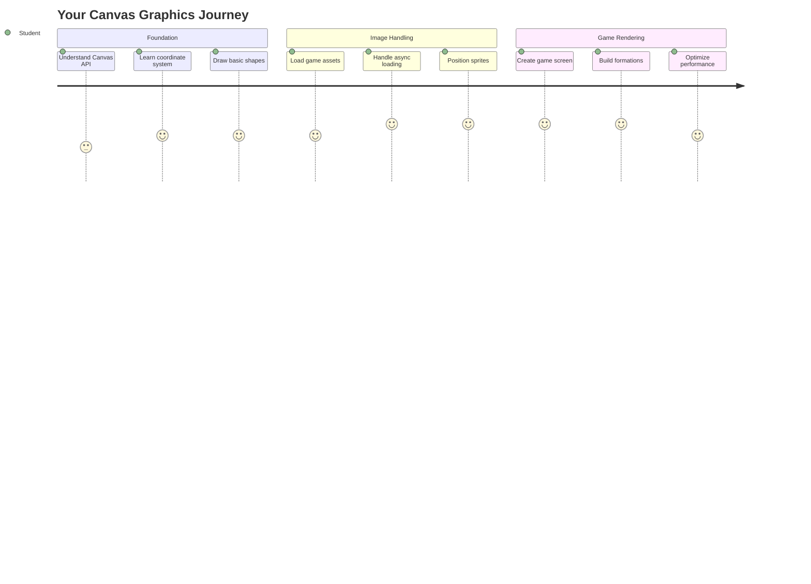
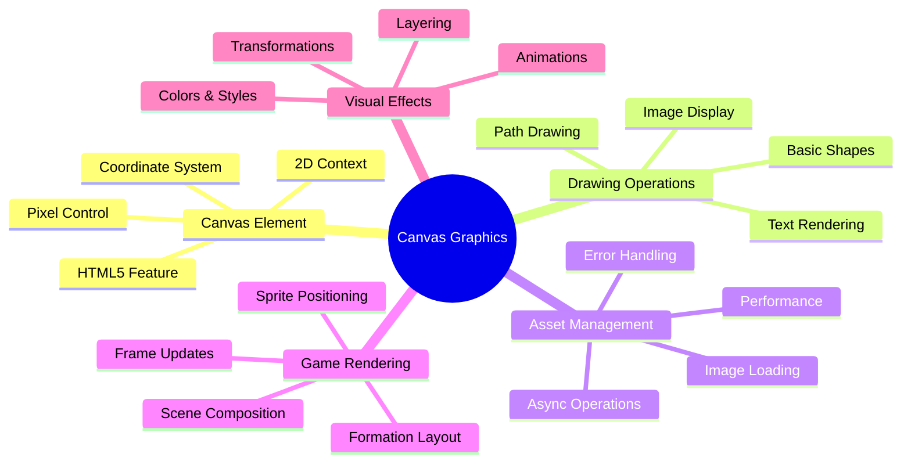
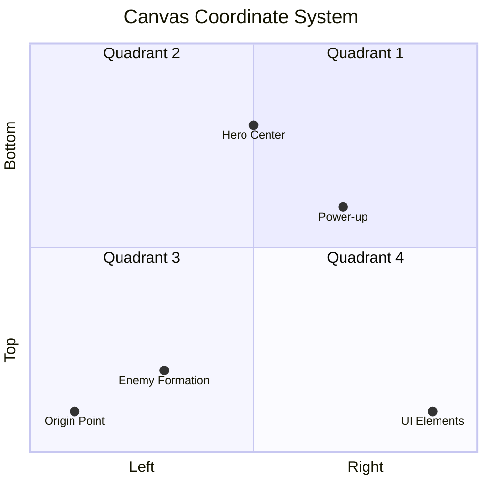
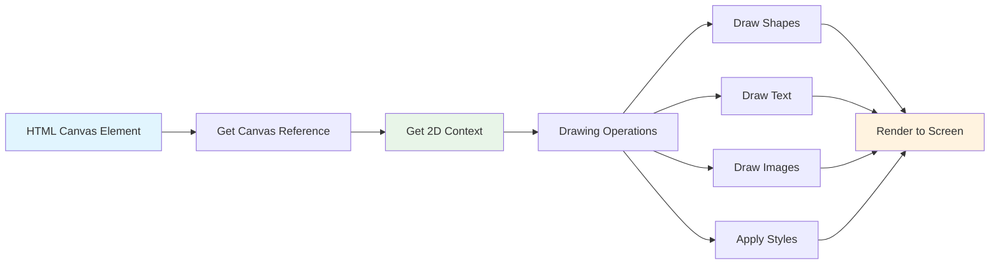
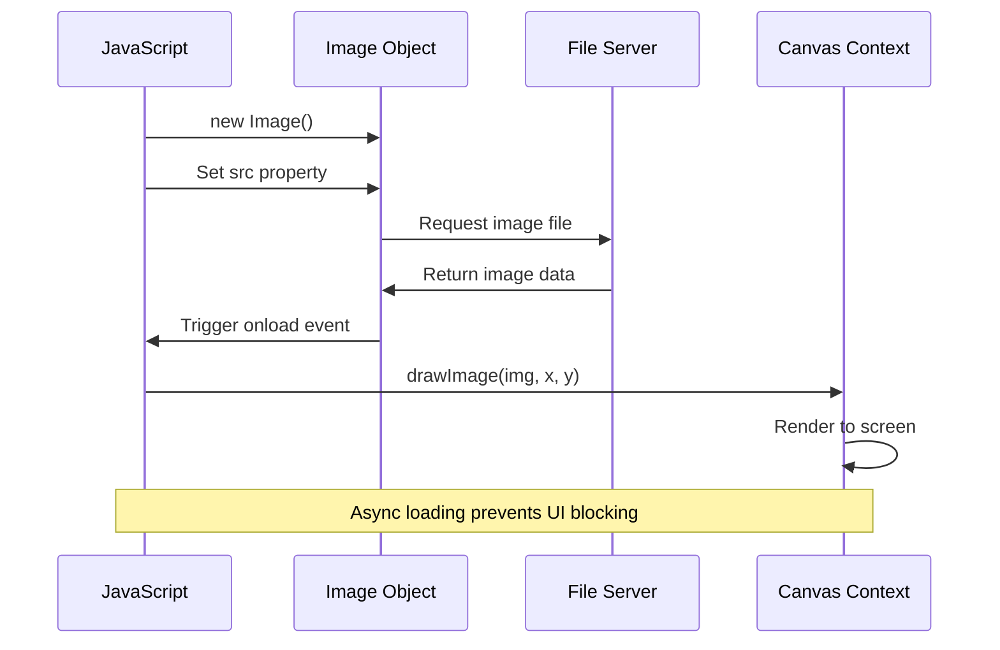
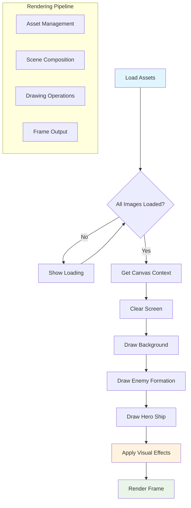
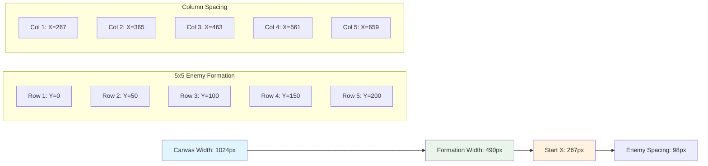
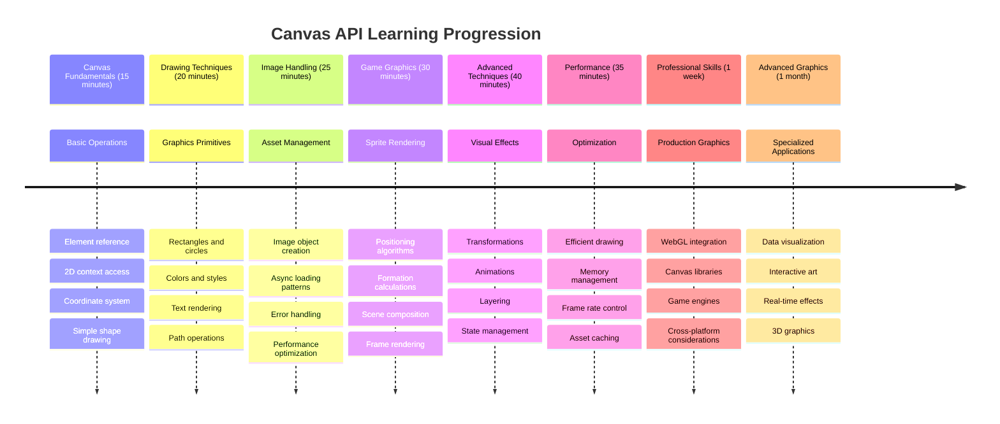

<!--
CO_OP_TRANSLATOR_METADATA:
{
  "original_hash": "7994743c5b21fdcceb36307916ef249a",
  "translation_date": "2025-11-06T11:55:33+00:00",
  "source_file": "6-space-game/2-drawing-to-canvas/README.md",
  "language_code": "id"
}
-->
# Membangun Game Luar Angkasa Bagian 2: Gambar Hero dan Monster ke Canvas



Canvas API adalah salah satu fitur paling kuat dalam pengembangan web untuk menciptakan grafik dinamis dan interaktif langsung di browser Anda. Dalam pelajaran ini, kita akan mengubah elemen HTML `<canvas>` yang kosong menjadi dunia permainan yang penuh dengan pahlawan dan monster. Anggaplah canvas sebagai papan seni digital Anda di mana kode menjadi visual.

Kita akan melanjutkan dari apa yang telah Anda pelajari di pelajaran sebelumnya, dan sekarang kita akan masuk ke aspek visual. Anda akan belajar cara memuat dan menampilkan sprite permainan, memposisikan elemen dengan tepat, dan menciptakan dasar visual untuk game luar angkasa Anda. Ini menjembatani kesenjangan antara halaman web statis dan pengalaman interaktif yang dinamis.

Pada akhir pelajaran ini, Anda akan memiliki adegan permainan lengkap dengan kapal pahlawan Anda yang diposisikan dengan benar dan formasi musuh yang siap untuk bertempur. Anda akan memahami bagaimana game modern merender grafik di browser dan mendapatkan keterampilan untuk menciptakan pengalaman visual interaktif Anda sendiri. Mari kita jelajahi grafik canvas dan hidupkan game luar angkasa Anda!



## Kuis Pra-Pelajaran

[Kuis pra-pelajaran](https://ff-quizzes.netlify.app/web/quiz/31)

## Canvas

Jadi, apa sebenarnya elemen `<canvas>` ini? Ini adalah solusi HTML5 untuk menciptakan grafik dan animasi dinamis di browser web. Tidak seperti gambar atau video biasa yang bersifat statis, canvas memberi Anda kontrol tingkat piksel atas segala sesuatu yang muncul di layar. Ini membuatnya sempurna untuk game, visualisasi data, dan seni interaktif. Anggaplah ini sebagai permukaan gambar yang dapat diprogram di mana JavaScript menjadi kuas Anda.

Secara default, elemen canvas terlihat seperti persegi panjang transparan kosong di halaman Anda. Tapi di situlah potensinya terletak! Kekuatan sebenarnya muncul ketika Anda menggunakan JavaScript untuk menggambar bentuk, memuat gambar, membuat animasi, dan membuat hal-hal merespons interaksi pengguna. Ini mirip dengan bagaimana para pionir grafik komputer awal di Bell Labs pada tahun 1960-an harus memprogram setiap piksel untuk menciptakan animasi digital pertama.

✅ Baca [lebih lanjut tentang Canvas API](https://developer.mozilla.org/docs/Web/API/Canvas_API) di MDN.

Berikut adalah cara biasanya dideklarasikan, sebagai bagian dari tubuh halaman:

```html
<canvas id="myCanvas" width="200" height="100"></canvas>
```

**Inilah yang dilakukan kode ini:**
- **Menetapkan** atribut `id` sehingga Anda dapat merujuk elemen canvas tertentu ini di JavaScript
- **Mendefinisikan** `width` dalam piksel untuk mengontrol ukuran horizontal canvas
- **Menentukan** `height` dalam piksel untuk menentukan dimensi vertikal canvas

## Menggambar Geometri Sederhana

Sekarang Anda tahu apa itu elemen canvas, mari kita jelajahi cara menggambar di atasnya! Canvas menggunakan sistem koordinat yang mungkin terasa familiar dari kelas matematika, tetapi ada satu perbedaan penting yang spesifik untuk grafik komputer.

Canvas menggunakan koordinat Cartesian dengan sumbu x (horizontal) dan sumbu y (vertikal) untuk memposisikan segala sesuatu yang Anda gambar. Tetapi inilah perbedaan utamanya: tidak seperti sistem koordinat dari kelas matematika, titik asal `(0,0)` dimulai di sudut kiri atas, dengan nilai x meningkat saat Anda bergerak ke kanan dan nilai y meningkat saat Anda bergerak ke bawah. Pendekatan ini berasal dari tampilan komputer awal di mana sinar elektron memindai dari atas ke bawah, membuat kiri atas menjadi titik awal yang alami.




> Gambar dari [MDN](https://developer.mozilla.org/docs/Web/API/Canvas_API/Tutorial/Drawing_shapes)

Untuk menggambar di elemen canvas, Anda akan mengikuti proses tiga langkah yang sama yang membentuk dasar dari semua grafik canvas. Setelah Anda melakukannya beberapa kali, ini menjadi kebiasaan:



1. **Dapatkan referensi** ke elemen Canvas Anda dari DOM (seperti elemen HTML lainnya)
2. **Dapatkan konteks rendering 2D** – ini menyediakan semua metode menggambar
3. **Mulai menggambar!** Gunakan metode bawaan konteks untuk membuat grafik Anda

Berikut adalah bagaimana ini terlihat dalam kode:

```javascript
// Step 1: Get the canvas element
const canvas = document.getElementById("myCanvas");

// Step 2: Get the 2D rendering context
const ctx = canvas.getContext("2d");

// Step 3: Set fill color and draw a rectangle
ctx.fillStyle = 'red';
ctx.fillRect(0, 0, 200, 200); // x, y, width, height
```

**Mari kita uraikan langkah demi langkah:**
- Kita **mengambil** elemen canvas kita menggunakan ID-nya dan menyimpannya dalam variabel
- Kita **mendapatkan** konteks rendering 2D – ini adalah alat kita yang penuh dengan metode menggambar
- Kita **memberitahu** canvas bahwa kita ingin mengisi sesuatu dengan warna merah menggunakan properti `fillStyle`
- Kita **menggambar** persegi panjang yang dimulai di sudut kiri atas (0,0) dengan lebar dan tinggi 200 piksel

✅ Canvas API sebagian besar berfokus pada bentuk 2D, tetapi Anda juga dapat menggambar elemen 3D ke situs web; untuk ini, Anda mungkin menggunakan [WebGL API](https://developer.mozilla.org/docs/Web/API/WebGL_API).

Anda dapat menggambar berbagai hal dengan Canvas API seperti:

- **Bentuk geometris**, kita sudah menunjukkan cara menggambar persegi panjang, tetapi ada banyak lagi yang bisa Anda gambar.
- **Teks**, Anda dapat menggambar teks dengan font dan warna apa pun yang Anda inginkan.
- **Gambar**, Anda dapat menggambar gambar berdasarkan aset gambar seperti .jpg atau .png misalnya.

✅ Coba! Anda tahu cara menggambar persegi panjang, bisakah Anda menggambar lingkaran di halaman? Lihat beberapa gambar Canvas yang menarik di CodePen. Berikut adalah [contoh yang sangat mengesankan](https://codepen.io/dissimulate/pen/KrAwx).

### 🔄 **Pengecekan Pedagogis**
**Pemahaman Dasar Canvas**: Sebelum beralih ke pemuatan gambar, pastikan Anda dapat:
- ✅ Menjelaskan bagaimana sistem koordinat canvas berbeda dari koordinat matematika
- ✅ Memahami proses tiga langkah untuk operasi menggambar canvas
- ✅ Mengidentifikasi apa yang disediakan oleh konteks rendering 2D
- ✅ Menjelaskan bagaimana fillStyle dan fillRect bekerja bersama

**Tes Diri Cepat**: Bagaimana Anda akan menggambar lingkaran biru di posisi (100, 50) dengan radius 25?
```javascript
ctx.fillStyle = 'blue';
ctx.beginPath();
ctx.arc(100, 50, 25, 0, 2 * Math.PI);
ctx.fill();
```

**Metode Menggambar Canvas yang Anda Ketahui Sekarang**:
- **fillRect()**: Menggambar persegi panjang yang terisi
- **fillStyle**: Mengatur warna dan pola
- **beginPath()**: Memulai jalur menggambar baru
- **arc()**: Membuat lingkaran dan kurva

## Memuat dan Menggambar Aset Gambar

Menggambar bentuk dasar berguna untuk memulai, tetapi sebagian besar game membutuhkan gambar nyata! Sprite, latar belakang, dan tekstur adalah yang memberikan daya tarik visual pada game. Memuat dan menampilkan gambar di canvas bekerja berbeda dari menggambar bentuk geometris, tetapi cukup sederhana setelah Anda memahami prosesnya.

Kita perlu membuat objek `Image`, memuat file gambar kita (ini terjadi secara asinkron, artinya "di latar belakang"), dan kemudian menggambarnya ke canvas setelah siap. Pendekatan ini memastikan gambar Anda ditampilkan dengan benar tanpa menghalangi aplikasi Anda saat mereka dimuat.



### Pemuatan Gambar Dasar

```javascript
const img = new Image();
img.src = 'path/to/my/image.png';
img.onload = () => {
  // Image loaded and ready to be used
  console.log('Image loaded successfully!');
};
```

**Inilah yang terjadi dalam kode ini:**
- Kita **membuat** objek Gambar baru untuk menampung sprite atau tekstur kita
- Kita **memberitahu** file gambar mana yang akan dimuat dengan menetapkan jalur sumber
- Kita **mendengarkan** acara load sehingga kita tahu persis kapan gambar siap digunakan

### Cara yang Lebih Baik untuk Memuat Gambar

Berikut adalah cara yang lebih kuat untuk menangani pemuatan gambar yang biasa digunakan oleh pengembang profesional. Kita akan membungkus pemuatan gambar dalam fungsi berbasis Promise – pendekatan ini, yang dipopulerkan ketika Promise JavaScript menjadi standar di ES6, membuat kode Anda lebih terorganisir dan menangani kesalahan dengan baik:

```javascript
function loadAsset(path) {
  return new Promise((resolve, reject) => {
    const img = new Image();
    img.src = path;
    img.onload = () => {
      resolve(img);
    };
    img.onerror = () => {
      reject(new Error(`Failed to load image: ${path}`));
    };
  });
}

// Modern usage with async/await
async function initializeGame() {
  try {
    const heroImg = await loadAsset('hero.png');
    const monsterImg = await loadAsset('monster.png');
    // Images are now ready to use
  } catch (error) {
    console.error('Failed to load game assets:', error);
  }
}
```

**Apa yang telah kita lakukan di sini:**
- **Membungkus** semua logika pemuatan gambar dalam Promise sehingga kita dapat menanganinya dengan lebih baik
- **Menambahkan** penanganan kesalahan yang benar-benar memberi tahu kita ketika sesuatu tidak beres
- **Menggunakan** sintaks async/await modern karena lebih mudah dibaca
- **Menyertakan** blok try/catch untuk menangani gangguan pemuatan dengan baik

Setelah gambar Anda dimuat, menggambarnya ke canvas sebenarnya cukup sederhana:

```javascript
async function renderGameScreen() {
  try {
    // Load game assets
    const heroImg = await loadAsset('hero.png');
    const monsterImg = await loadAsset('monster.png');

    // Get canvas and context
    const canvas = document.getElementById("myCanvas");
    const ctx = canvas.getContext("2d");

    // Draw images to specific positions
    ctx.drawImage(heroImg, canvas.width / 2, canvas.height / 2);
    ctx.drawImage(monsterImg, 0, 0);
  } catch (error) {
    console.error('Failed to render game screen:', error);
  }
}
```

**Mari kita uraikan langkah demi langkah:**
- Kita **memuat** gambar pahlawan dan monster kita di latar belakang menggunakan await
- Kita **mengambil** elemen canvas kita dan mendapatkan konteks rendering 2D yang kita butuhkan
- Kita **memposisikan** gambar pahlawan tepat di tengah menggunakan beberapa perhitungan koordinat cepat
- Kita **menempatkan** gambar monster di sudut kiri atas untuk memulai formasi musuh kita
- Kita **menangkap** kesalahan apa pun yang mungkin terjadi selama pemuatan atau rendering



## Sekarang Saatnya Mulai Membangun Game Anda

Sekarang kita akan menggabungkan semuanya untuk menciptakan dasar visual dari game luar angkasa Anda. Anda memiliki pemahaman yang solid tentang dasar-dasar canvas dan teknik pemuatan gambar, jadi bagian praktis ini akan memandu Anda melalui pembuatan layar game lengkap dengan sprite yang diposisikan dengan benar.

### Apa yang Harus Dibangun

Anda akan membuat halaman web dengan elemen Canvas. Halaman tersebut harus menampilkan layar hitam berukuran `1024*768`. Kami telah menyediakan dua gambar untuk Anda:

- Kapal pahlawan

   

- 5*5 monster

   

### Langkah-langkah yang Direkomendasikan untuk Memulai Pengembangan

Temukan file starter yang telah dibuat untuk Anda di sub folder `your-work`. Struktur proyek Anda harus berisi:

```bash
your-work/
├── assets/
│   ├── enemyShip.png
│   └── player.png
├── index.html
├── app.js
└── package.json
```

**Inilah yang Anda kerjakan:**
- **Sprite game** berada di folder `assets/` sehingga semuanya tetap terorganisir
- **File HTML utama Anda** menyiapkan elemen canvas dan mempersiapkan semuanya
- **File JavaScript** tempat Anda akan menulis semua keajaiban rendering game Anda
- **File package.json** yang menyiapkan server pengembangan sehingga Anda dapat menguji secara lokal

Buka folder ini di Visual Studio Code untuk memulai pengembangan. Anda akan membutuhkan lingkungan pengembangan lokal dengan Visual Studio Code, NPM, dan Node.js yang terinstal. Jika Anda belum mengatur `npm` di komputer Anda, [berikut cara menginstalnya](https://www.npmjs.com/get-npm).

Mulai server pengembangan Anda dengan menavigasi ke folder `your-work`:

```bash
cd your-work
npm start
```

**Perintah ini melakukan beberapa hal keren:**
- **Memulai** server lokal di `http://localhost:5000` sehingga Anda dapat menguji game Anda
- **Melayani** semua file Anda dengan benar sehingga browser Anda dapat memuatnya dengan benar
- **Memantau** file Anda untuk perubahan sehingga Anda dapat mengembangkan dengan lancar
- **Memberikan** lingkungan pengembangan profesional untuk menguji semuanya

> 💡 **Catatan**: Browser Anda akan menampilkan halaman kosong pada awalnya – itu diharapkan! Saat Anda menambahkan kode, segarkan browser Anda untuk melihat perubahan Anda. Pendekatan pengembangan iteratif ini mirip dengan bagaimana NASA membangun komputer panduan Apollo – menguji setiap komponen sebelum mengintegrasikannya ke dalam sistem yang lebih besar.

### Tambahkan kode

Tambahkan kode yang diperlukan ke `your-work/app.js` untuk menyelesaikan tugas berikut:

1. **Gambar canvas dengan latar belakang hitam**
   > 💡 **Begini caranya**: Temukan TODO di `/app.js` dan tambahkan hanya dua baris. Tetapkan `ctx.fillStyle` ke hitam, lalu gunakan `ctx.fillRect()` mulai dari (0,0) dengan dimensi canvas Anda. Mudah!

2. **Muat tekstur game**
   > 💡 **Begini caranya**: Gunakan `await loadAsset()` untuk memuat gambar pemain dan musuh Anda. Simpan mereka dalam variabel sehingga Anda dapat menggunakannya nanti. Ingat – mereka tidak akan muncul sampai Anda benar-benar menggambar mereka!

3. **Gambar kapal pahlawan di posisi tengah-bawah**
   > 💡 **Begini caranya**: Gunakan `ctx.drawImage()` untuk memposisikan pahlawan Anda. Untuk koordinat x, coba `canvas.width / 2 - 45` untuk memusatkannya, dan untuk koordinat y gunakan `canvas.height - canvas.height / 4` untuk menempatkannya di area bawah.

4. **Gambar formasi 5×5 kapal musuh**
   > 💡 **Begini caranya**: Temukan fungsi `createEnemies` dan atur loop bersarang. Anda perlu melakukan beberapa perhitungan untuk jarak dan posisi, tetapi jangan khawatir – saya akan menunjukkan caranya!

Pertama, tetapkan konstanta untuk tata letak formasi musuh yang tepat:

```javascript
const ENEMY_TOTAL = 5;
const ENEMY_SPACING = 98;
const FORMATION_WIDTH = ENEMY_TOTAL * ENEMY_SPACING;
const START_X = (canvas.width - FORMATION_WIDTH) / 2;
const STOP_X = START_X + FORMATION_WIDTH;
```

**Mari kita uraikan apa yang dilakukan konstanta ini:**
- Kita **menetapkan** 5 musuh per baris dan kolom (grid 5×5 yang bagus)
- Kita **mendefinisikan** berapa banyak ruang yang harus diberikan di antara musuh sehingga mereka tidak terlihat sempit
- Kita **menghitung** seberapa lebar seluruh formasi kita
- Kita **menentukan** di mana harus memulai dan berhenti sehingga formasi terlihat terpusat



Kemudian, buat loop bersarang untuk menggambar formasi musuh:

```javascript
for (let x = START_X; x < STOP_X; x += ENEMY_SPACING) {
  for (let y = 0; y < 50 * 5; y += 50) {
    ctx.drawImage(enemyImg, x, y);
  }
}
```

**Inilah yang dilakukan loop bersarang ini:**
- Loop luar **bergerak** dari kiri ke kanan melintasi formasi kita
- Loop dalam **berjalan** dari atas ke bawah untuk membuat baris yang rapi
- Kita **menggambar** setiap sprite musuh di koordinat x,y yang tepat yang kita hitung
- Semuanya tetap **berjarak merata** sehingga terlihat profesional dan terorganisir

### 🔄 **Pengecekan Pedagogis**
**Penguasaan Rendering Game**: Verifikasi pemahaman Anda tentang sistem rendering lengkap:
- ✅ Bagaimana pemuatan gambar asinkron mencegah pemblokiran UI selama startup game?
- ✅ Mengapa kita menghitung posisi formasi musuh menggunakan konstanta daripada hardcoding?
- ✅ Apa peran konteks rendering 2D dalam operasi menggambar?
- ✅ Bagaimana loop bersarang menciptakan formasi sprite yang terorganisir?

**Pertimbangan Performa**: Game Anda sekarang menunjukkan:
- **Pemuatan aset yang efisien**: Manajemen gambar berbasis Promise
- **Rendering yang terorganisir**: Operasi menggambar yang terstruktur
- **Penempatan matematis**: Penempatan sprite yang dihitung
- **Penanganan kesalahan**: Manajemen kegagalan yang baik

**Konsep Pemrograman Visual**: Anda telah belajar:
- **Sistem koordinat**: Menerjemahkan matematika ke posisi layar
- **Manajemen sprite**: Memuat dan menampilkan grafik permainan
- **Algoritma formasi**: Pola matematis untuk tata letak yang terorganisir
- **Operasi asinkron**: JavaScript modern untuk pengalaman pengguna yang lancar

## Hasil

Hasil akhir seharusnya terlihat seperti ini:


## Solusi

Cobalah menyelesaikannya sendiri terlebih dahulu, tetapi jika Anda mengalami kesulitan, lihat [solusi](../../../../6-space-game/2-drawing-to-canvas/solution/app.js).

---

## Tantangan GitHub Copilot Agent 🚀

Gunakan mode Agent untuk menyelesaikan tantangan berikut:

**Deskripsi:** Tingkatkan kanvas permainan luar angkasa Anda dengan menambahkan efek visual dan elemen interaktif menggunakan teknik Canvas API yang telah Anda pelajari.

**Prompt:** Buat file baru bernama `enhanced-canvas.html` dengan kanvas yang menampilkan bintang animasi di latar belakang, bilah kesehatan yang berdenyut untuk kapal pahlawan, dan kapal musuh yang perlahan bergerak ke bawah. Sertakan kode JavaScript yang menggambar bintang berkedip menggunakan posisi dan opasitas acak, menerapkan bilah kesehatan yang berubah warna berdasarkan tingkat kesehatan (hijau > kuning > merah), dan menganimasikan kapal musuh untuk bergerak ke bawah layar dengan kecepatan berbeda.

Pelajari lebih lanjut tentang [mode agent](https://code.visualstudio.com/blogs/2025/02/24/introducing-copilot-agent-mode) di sini.

## 🚀 Tantangan

Anda telah belajar tentang menggambar dengan Canvas API yang berfokus pada 2D; lihat [WebGL API](https://developer.mozilla.org/docs/Web/API/WebGL_API), dan coba menggambar objek 3D.

## Kuis Pasca-Pelajaran

[Kuis pasca-pelajaran](https://ff-quizzes.netlify.app/web/quiz/32)

## Tinjauan & Belajar Mandiri

Pelajari lebih lanjut tentang Canvas API dengan [membacanya](https://developer.mozilla.org/docs/Web/API/Canvas_API).

### ⚡ **Yang Bisa Anda Lakukan dalam 5 Menit Berikutnya**
- [ ] Buka konsol browser dan buat elemen kanvas dengan `document.createElement('canvas')`
- [ ] Coba menggambar persegi panjang menggunakan `fillRect()` pada konteks kanvas
- [ ] Bereksperimen dengan berbagai warna menggunakan properti `fillStyle`
- [ ] Gambar lingkaran sederhana menggunakan metode `arc()`

### 🎯 **Yang Bisa Anda Capai dalam Satu Jam**
- [ ] Selesaikan kuis pasca-pelajaran dan pahami dasar-dasar kanvas
- [ ] Buat aplikasi menggambar kanvas dengan berbagai bentuk dan warna
- [ ] Terapkan pemuatan gambar dan rendering sprite untuk permainan Anda
- [ ] Bangun animasi sederhana yang menggerakkan objek melintasi kanvas
- [ ] Latih transformasi kanvas seperti skala, rotasi, dan translasi

### 📅 **Perjalanan Kanvas Anda Selama Seminggu**
- [ ] Selesaikan permainan luar angkasa dengan grafik yang halus dan animasi sprite
- [ ] Kuasai teknik kanvas tingkat lanjut seperti gradien, pola, dan komposit
- [ ] Buat visualisasi interaktif menggunakan kanvas untuk representasi data
- [ ] Pelajari teknik optimasi kanvas untuk kinerja yang lancar
- [ ] Bangun aplikasi menggambar atau melukis dengan berbagai alat
- [ ] Jelajahi pola pengkodean kreatif dan seni generatif dengan kanvas

### 🌟 **Penguasaan Grafik Anda Selama Sebulan**
- [ ] Bangun aplikasi visual kompleks menggunakan Canvas 2D dan WebGL
- [ ] Pelajari konsep pemrograman grafik dan dasar-dasar shader
- [ ] Berkontribusi pada pustaka grafik open source dan alat visualisasi
- [ ] Kuasai optimasi kinerja untuk aplikasi intensif grafik
- [ ] Buat konten edukasi tentang pemrograman kanvas dan grafik komputer
- [ ] Jadilah ahli pemrograman grafik yang membantu orang lain menciptakan pengalaman visual

## 🎯 Garis Waktu Penguasaan Grafik Kanvas Anda



### 🛠️ Ringkasan Toolkit Grafik Kanvas Anda

Setelah menyelesaikan pelajaran ini, Anda sekarang memiliki:
- **Penguasaan Canvas API**: Pemahaman lengkap tentang pemrograman grafik 2D
- **Matematika Koordinat**: Penentuan posisi dan algoritma tata letak yang presisi
- **Manajemen Aset**: Pemuatan gambar profesional dan penanganan kesalahan
- **Pipeline Rendering**: Pendekatan terstruktur untuk komposisi adegan
- **Grafik Permainan**: Penentuan posisi sprite dan perhitungan formasi
- **Pemrograman Asinkron**: Pola JavaScript modern untuk kinerja yang lancar
- **Pemrograman Visual**: Menerjemahkan konsep matematis ke grafik layar

**Aplikasi Dunia Nyata**: Keterampilan Kanvas Anda langsung dapat diterapkan pada:
- **Visualisasi Data**: Grafik, diagram, dan dasbor interaktif
- **Pengembangan Game**: Permainan 2D, simulasi, dan pengalaman interaktif
- **Seni Digital**: Pengkodean kreatif dan proyek seni generatif
- **Desain UI/UX**: Grafik khusus dan elemen interaktif
- **Perangkat Lunak Pendidikan**: Alat pembelajaran visual dan simulasi
- **Aplikasi Web**: Grafik dinamis dan visualisasi waktu nyata

**Keterampilan Profesional yang Diperoleh**: Anda sekarang dapat:
- **Membangun** solusi grafik khusus tanpa pustaka eksternal
- **Mengoptimalkan** kinerja rendering untuk pengalaman pengguna yang lancar
- **Mendiagnosis** masalah visual kompleks menggunakan alat pengembang browser
- **Merancang** sistem grafik yang skalabel menggunakan prinsip matematis
- **Mengintegrasikan** grafik kanvas dengan kerangka kerja aplikasi web modern

**Metode Canvas API yang Telah Anda Kuasai**:
- **Manajemen Elemen**: getElementById, getContext
- **Operasi Menggambar**: fillRect, drawImage, fillStyle
- **Pemuatan Aset**: Objek Gambar, pola Promise
- **Penentuan Posisi Matematis**: Perhitungan koordinat, algoritma formasi

**Tingkat Berikutnya**: Anda siap menambahkan animasi, interaksi pengguna, deteksi tabrakan, atau menjelajahi WebGL untuk grafik 3D!

🌟 **Pencapaian Terkunci**: Anda telah membangun sistem rendering permainan lengkap menggunakan teknik dasar Canvas API!

## Tugas

[Bermain dengan Canvas API](assignment.md)

---

**Penafian**:  
Dokumen ini telah diterjemahkan menggunakan layanan penerjemahan AI [Co-op Translator](https://github.com/Azure/co-op-translator). Meskipun kami berupaya untuk memberikan hasil yang akurat, harap diketahui bahwa terjemahan otomatis mungkin mengandung kesalahan atau ketidakakuratan. Dokumen asli dalam bahasa aslinya harus dianggap sebagai sumber yang otoritatif. Untuk informasi yang penting, disarankan menggunakan jasa penerjemahan manusia profesional. Kami tidak bertanggung jawab atas kesalahpahaman atau penafsiran yang timbul dari penggunaan terjemahan ini.