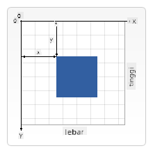

<!--
CO_OP_TRANSLATOR_METADATA:
{
  "original_hash": "41be8d35e7f30aa9dad10773c35e89c4",
  "translation_date": "2025-08-27T22:39:46+00:00",
  "source_file": "6-space-game/2-drawing-to-canvas/README.md",
  "language_code": "id"
}
-->
# Membangun Game Luar Angkasa Bagian 2: Gambar Hero dan Monster ke Canvas

## Kuis Pra-Kuliah

[Kuis pra-kuliah](https://ashy-river-0debb7803.1.azurestaticapps.net/quiz/31)

## Canvas

Canvas adalah elemen HTML yang secara default tidak memiliki konten; ini adalah kanvas kosong. Anda perlu menambahkan konten dengan menggambar di atasnya.

✅ Baca [lebih lanjut tentang Canvas API](https://developer.mozilla.org/docs/Web/API/Canvas_API) di MDN.

Berikut adalah cara biasanya dideklarasikan, sebagai bagian dari body halaman:

```html
<canvas id="myCanvas" width="200" height="100"></canvas>
```

Di atas, kita menetapkan `id`, `width`, dan `height`.

- `id`: tetapkan ini agar Anda dapat memperoleh referensi saat Anda perlu berinteraksi dengannya.
- `width`: ini adalah lebar elemen.
- `height`: ini adalah tinggi elemen.

## Menggambar Geometri Sederhana

Canvas menggunakan sistem koordinat kartesian untuk menggambar sesuatu. Oleh karena itu, ia menggunakan sumbu x dan sumbu y untuk mengekspresikan lokasi sesuatu. Lokasi `0,0` adalah posisi kiri atas, dan kanan bawah adalah apa yang Anda tetapkan sebagai WIDTH dan HEIGHT dari canvas.


> Gambar dari [MDN](https://developer.mozilla.org/docs/Web/API/Canvas_API/Tutorial/Drawing_shapes)

Untuk menggambar di elemen canvas, Anda perlu melalui langkah-langkah berikut:

1. **Dapatkan referensi** ke elemen Canvas.
1. **Dapatkan referensi** ke elemen Context yang berada di elemen Canvas.
1. **Lakukan operasi menggambar** menggunakan elemen Context.

Kode untuk langkah-langkah di atas biasanya terlihat seperti ini:

```javascript
// draws a red rectangle
//1. get the canvas reference
canvas = document.getElementById("myCanvas");

//2. set the context to 2D to draw basic shapes
ctx = canvas.getContext("2d");

//3. fill it with the color red
ctx.fillStyle = 'red';

//4. and draw a rectangle with these parameters, setting location and size
ctx.fillRect(0,0, 200, 200) // x,y,width, height
```

✅ Canvas API sebagian besar berfokus pada bentuk 2D, tetapi Anda juga dapat menggambar elemen 3D ke situs web; untuk ini, Anda mungkin menggunakan [WebGL API](https://developer.mozilla.org/docs/Web/API/WebGL_API).

Anda dapat menggambar berbagai hal dengan Canvas API seperti:

- **Bentuk geometris**, kita sudah menunjukkan cara menggambar persegi panjang, tetapi ada banyak lagi yang bisa Anda gambar.
- **Teks**, Anda dapat menggambar teks dengan font dan warna apa pun yang Anda inginkan.
- **Gambar**, Anda dapat menggambar gambar berdasarkan aset gambar seperti .jpg atau .png, misalnya.

✅ Coba! Anda sudah tahu cara menggambar persegi panjang, bisakah Anda menggambar lingkaran di halaman? Lihat beberapa gambar menarik menggunakan Canvas di CodePen. Berikut adalah [contoh yang sangat mengesankan](https://codepen.io/dissimulate/pen/KrAwx).

## Memuat dan Menggambar Aset Gambar

Anda memuat aset gambar dengan membuat objek `Image` dan menetapkan properti `src`-nya. Kemudian Anda mendengarkan event `load` untuk mengetahui kapan gambar siap digunakan. Kodenya terlihat seperti ini:

### Memuat Aset

```javascript
const img = new Image();
img.src = 'path/to/my/image.png';
img.onload = () => {
  // image loaded and ready to be used
}
```

### Pola Memuat Aset

Disarankan untuk membungkus kode di atas dalam sebuah konstruksi seperti ini, sehingga lebih mudah digunakan dan Anda hanya mencoba memanipulasinya saat sudah sepenuhnya dimuat:

```javascript
function loadAsset(path) {
  return new Promise((resolve) => {
    const img = new Image();
    img.src = path;
    img.onload = () => {
      // image loaded and ready to be used
      resolve(img);
    }
  })
}

// use like so

async function run() {
  const heroImg = await loadAsset('hero.png')
  const monsterImg = await loadAsset('monster.png')
}

```

Untuk menggambar aset game ke layar, kode Anda akan terlihat seperti ini:

```javascript
async function run() {
  const heroImg = await loadAsset('hero.png')
  const monsterImg = await loadAsset('monster.png')

  canvas = document.getElementById("myCanvas");
  ctx = canvas.getContext("2d");
  ctx.drawImage(heroImg, canvas.width/2,canvas.height/2);
  ctx.drawImage(monsterImg, 0,0);
}
```

## Sekarang Saatnya Mulai Membangun Game Anda

### Apa yang Akan Dibangun

Anda akan membangun halaman web dengan elemen Canvas. Halaman ini harus menampilkan layar hitam berukuran `1024*768`. Kami telah menyediakan dua gambar untuk Anda:

- Kapal Hero

   

- Kapal Monster 5*5

   

### Langkah-Langkah yang Direkomendasikan untuk Memulai Pengembangan

Temukan file yang telah dibuat untuk Anda di subfolder `your-work`. Folder ini harus berisi:

```bash
-| assets
  -| enemyShip.png
  -| player.png
-| index.html
-| app.js
-| package.json
```

Buka salinan folder ini di Visual Studio Code. Anda perlu memiliki lingkungan pengembangan lokal yang sudah diatur, sebaiknya dengan Visual Studio Code dengan NPM dan Node terinstal. Jika Anda belum memiliki `npm` di komputer Anda, [berikut cara mengaturnya](https://www.npmjs.com/get-npm).

Mulai proyek Anda dengan menavigasi ke folder `your_work`:

```bash
cd your-work
npm start
```

Kode di atas akan memulai HTTP Server di alamat `http://localhost:5000`. Buka browser dan masukkan alamat tersebut. Halaman ini masih kosong sekarang, tetapi itu akan berubah.

> Catatan: untuk melihat perubahan di layar Anda, segarkan browser Anda.

### Tambahkan Kode

Tambahkan kode yang diperlukan ke `your-work/app.js` untuk menyelesaikan langkah-langkah berikut:

1. **Gambar** canvas dengan latar belakang hitam  
   > tip: tambahkan dua baris di bawah TODO yang sesuai di `/app.js`, tetapkan elemen `ctx` menjadi hitam dan koordinat atas/kiri ke 0,0 serta tinggi dan lebar sesuai dengan canvas.
2. **Muat** tekstur  
   > tip: tambahkan gambar pemain dan musuh menggunakan `await loadTexture` dan masukkan jalur gambar. Anda belum akan melihatnya di layar!
3. **Gambar** hero di tengah layar di bagian bawah  
   > tip: gunakan API `drawImage` untuk menggambar heroImg ke layar, tetapkan `canvas.width / 2 - 45` dan `canvas.height - canvas.height / 4)`.
4. **Gambar** monster 5*5  
   > tip: Sekarang Anda dapat menghapus komentar kode untuk menggambar musuh di layar. Selanjutnya, pergi ke fungsi `createEnemies` dan bangun fungsinya.

   Pertama, tetapkan beberapa konstanta:

    ```javascript
    const MONSTER_TOTAL = 5;
    const MONSTER_WIDTH = MONSTER_TOTAL * 98;
    const START_X = (canvas.width - MONSTER_WIDTH) / 2;
    const STOP_X = START_X + MONSTER_WIDTH;
    ```

    kemudian, buat loop untuk menggambar array monster ke layar:

    ```javascript
    for (let x = START_X; x < STOP_X; x += 98) {
        for (let y = 0; y < 50 * 5; y += 50) {
          ctx.drawImage(enemyImg, x, y);
        }
      }
    ```

## Hasil

Hasil akhir harus terlihat seperti ini:


## Solusi

Cobalah menyelesaikannya sendiri terlebih dahulu, tetapi jika Anda mengalami kesulitan, lihat [solusi](../../../../6-space-game/2-drawing-to-canvas/solution/app.js).

---

## 🚀 Tantangan

Anda telah belajar tentang menggambar dengan Canvas API yang berfokus pada 2D; lihat [WebGL API](https://developer.mozilla.org/docs/Web/API/WebGL_API), dan coba gambar objek 3D.

## Kuis Pasca-Kuliah

[Kuis pasca-kuliah](https://ashy-river-0debb7803.1.azurestaticapps.net/quiz/32)

## Tinjauan & Studi Mandiri

Pelajari lebih lanjut tentang Canvas API dengan [membacanya](https://developer.mozilla.org/docs/Web/API/Canvas_API).

## Tugas

[Bermain dengan Canvas API](assignment.md)

---

**Penafian**:  
Dokumen ini telah diterjemahkan menggunakan layanan penerjemahan AI [Co-op Translator](https://github.com/Azure/co-op-translator). Meskipun kami berusaha untuk memberikan hasil yang akurat, harap diingat bahwa terjemahan otomatis mungkin mengandung kesalahan atau ketidakakuratan. Dokumen asli dalam bahasa aslinya harus dianggap sebagai sumber yang otoritatif. Untuk informasi yang bersifat kritis, disarankan menggunakan jasa penerjemahan manusia profesional. Kami tidak bertanggung jawab atas kesalahpahaman atau penafsiran yang keliru yang timbul dari penggunaan terjemahan ini.