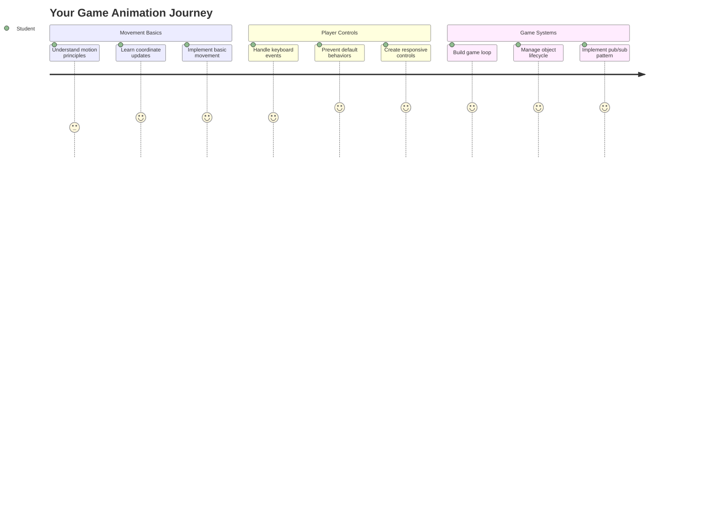
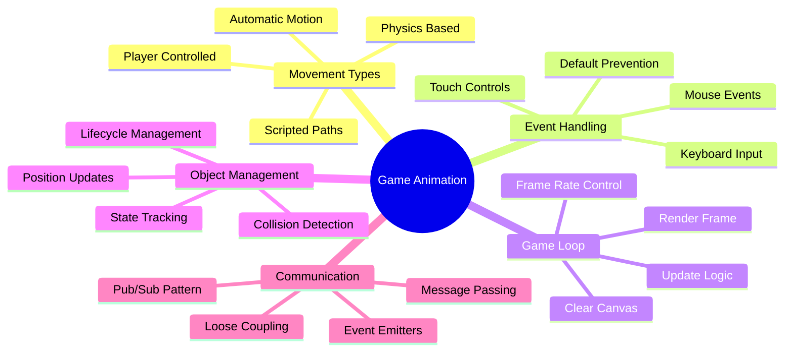
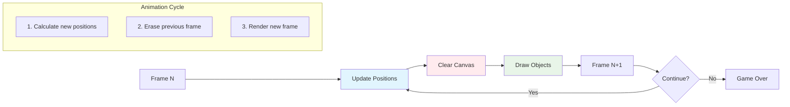
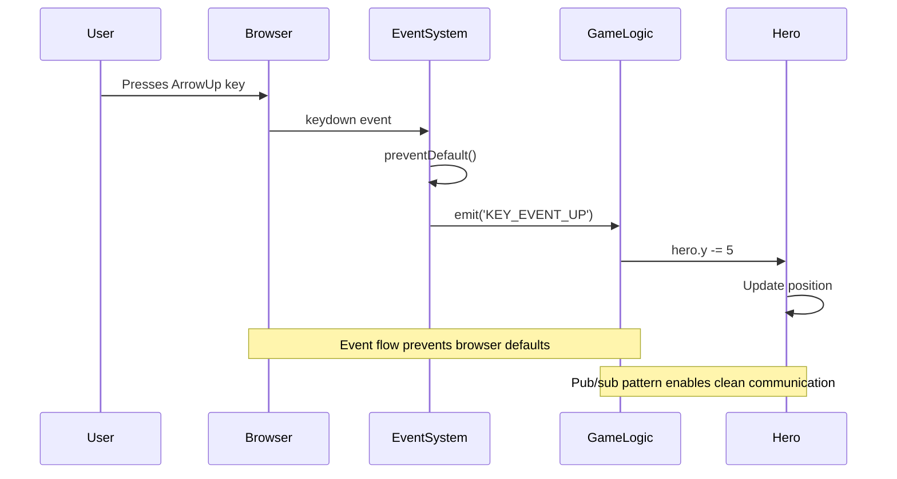
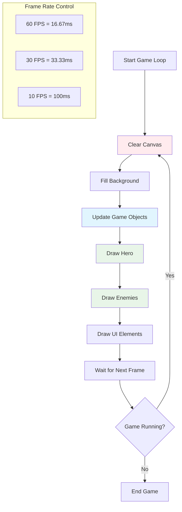
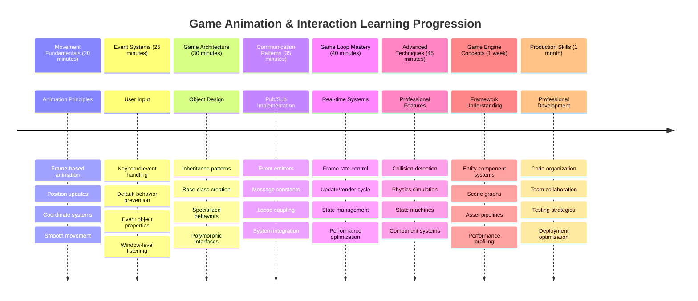

<!--
CO_OP_TRANSLATOR_METADATA:
{
  "original_hash": "8c55a2bd4bc0ebe4c88198fd563a9e09",
  "translation_date": "2025-11-06T11:54:48+00:00",
  "source_file": "6-space-game/3-moving-elements-around/README.md",
  "language_code": "id"
}
-->
# Membangun Game Luar Angkasa Bagian 3: Menambahkan Gerakan



Pikirkan tentang game favoritmu – yang membuatnya menarik bukan hanya grafis yang indah, tetapi juga cara semuanya bergerak dan merespons tindakanmu. Saat ini, game luar angkasamu seperti lukisan yang indah, tetapi kita akan menambahkan gerakan yang membuatnya hidup.

Ketika insinyur NASA memprogram komputer panduan untuk misi Apollo, mereka menghadapi tantangan serupa: bagaimana membuat pesawat luar angkasa merespons input pilot sambil secara otomatis menjaga koreksi jalur? Prinsip yang akan kita pelajari hari ini mencerminkan konsep yang sama – mengelola gerakan yang dikendalikan pemain bersama perilaku sistem otomatis.

Dalam pelajaran ini, kamu akan belajar cara membuat pesawat luar angkasa meluncur di layar, merespons perintah pemain, dan menciptakan pola gerakan yang halus. Kita akan memecah semuanya menjadi konsep yang mudah dipahami yang saling membangun secara alami.

Pada akhirnya, pemain akan dapat menerbangkan kapal pahlawan mereka di layar sementara kapal musuh berpatroli di atas. Lebih penting lagi, kamu akan memahami prinsip inti yang mendukung sistem gerakan dalam game.



## Kuis Pra-Pelajaran

[Kuis pra-pelajaran](https://ff-quizzes.netlify.app/web/quiz/33)

## Memahami Gerakan dalam Game

Game menjadi hidup ketika objek mulai bergerak, dan secara fundamental ada dua cara hal ini terjadi:

- **Gerakan yang dikendalikan pemain**: Ketika kamu menekan tombol atau mengklik mouse, sesuatu bergerak. Ini adalah hubungan langsung antara kamu dan dunia game.
- **Gerakan otomatis**: Ketika game itu sendiri memutuskan untuk menggerakkan objek – seperti kapal musuh yang harus berpatroli di layar meskipun kamu tidak melakukan apa-apa.

Membuat objek bergerak di layar komputer lebih sederhana dari yang kamu pikirkan. Ingat koordinat x dan y dari kelas matematika? Itulah yang kita gunakan di sini. Ketika Galileo melacak bulan Jupiter pada tahun 1610, dia pada dasarnya melakukan hal yang sama – memplot posisi dari waktu ke waktu untuk memahami pola gerakan.

Menggerakkan objek di layar seperti membuat animasi buku flip – kamu perlu mengikuti tiga langkah sederhana ini:



1. **Perbarui posisi** – Ubah di mana objekmu seharusnya berada (misalnya pindahkan 5 piksel ke kanan)
2. **Hapus frame lama** – Bersihkan layar agar tidak terlihat jejak bayangan di mana-mana
3. **Gambar frame baru** – Tempatkan objekmu di posisi barunya

Lakukan ini dengan cukup cepat, dan boom! Kamu mendapatkan gerakan halus yang terasa alami bagi pemain.

Berikut adalah contoh kode:

```javascript
// Set the hero's location
hero.x += 5;
// Clear the rectangle that hosts the hero
ctx.clearRect(0, 0, canvas.width, canvas.height);
// Redraw the game background and hero
ctx.fillRect(0, 0, canvas.width, canvas.height);
ctx.fillStyle = "black";
ctx.drawImage(heroImg, hero.x, hero.y);
```

**Apa yang dilakukan kode ini:**
- **Memperbarui** koordinat x hero sebanyak 5 piksel untuk menggerakkannya secara horizontal
- **Membersihkan** seluruh area kanvas untuk menghapus frame sebelumnya
- **Mengisi** kanvas dengan warna latar belakang hitam
- **Menggambar ulang** gambar hero di posisi barunya

✅ Bisakah kamu memikirkan alasan mengapa menggambar ulang hero beberapa frame per detik dapat menyebabkan biaya kinerja? Baca tentang [alternatif untuk pola ini](https://developer.mozilla.org/en-US/docs/Web/API/Canvas_API/Tutorial/Optimizing_canvas).

## Menangani Event Keyboard

Di sinilah kita menghubungkan input pemain dengan aksi dalam game. Ketika seseorang menekan tombol spasi untuk menembakkan laser atau mengetuk tombol panah untuk menghindari asteroid, game kamu perlu mendeteksi dan merespons input tersebut.

Event keyboard terjadi di tingkat window, artinya seluruh jendela browsermu mendengarkan penekanan tombol tersebut. Klik mouse, di sisi lain, dapat diikat ke elemen tertentu (seperti mengklik tombol). Untuk game luar angkasa kita, kita akan fokus pada kontrol keyboard karena itulah yang memberikan pemain nuansa arcade klasik.

Ini mengingatkan saya pada bagaimana operator telegraf di tahun 1800-an harus menerjemahkan input kode morse menjadi pesan yang bermakna – kita melakukan sesuatu yang serupa, menerjemahkan penekanan tombol menjadi perintah game.

Untuk menangani sebuah event, kamu perlu menggunakan metode `addEventListener()` pada window dan memberikannya dua parameter input. Parameter pertama adalah nama event, misalnya `keyup`. Parameter kedua adalah fungsi yang harus dipanggil sebagai hasil dari event yang terjadi.

Berikut adalah contohnya:

```javascript
window.addEventListener('keyup', (evt) => {
  // evt.key = string representation of the key
  if (evt.key === 'ArrowUp') {
    // do something
  }
});
```

**Penjelasan apa yang terjadi di sini:**
- **Mendengarkan** event keyboard di seluruh window
- **Menangkap** objek event yang berisi informasi tentang tombol mana yang ditekan
- **Memeriksa** apakah tombol yang ditekan cocok dengan tombol tertentu (dalam hal ini, tombol panah atas)
- **Menjalankan** kode ketika kondisi terpenuhi

Untuk event tombol, ada dua properti pada event yang dapat kamu gunakan untuk melihat tombol mana yang ditekan:

- `key` - ini adalah representasi string dari tombol yang ditekan, misalnya `'ArrowUp'`
- `keyCode` - ini adalah representasi angka, misalnya `37`, yang sesuai dengan `ArrowLeft`

✅ Manipulasi event tombol berguna di luar pengembangan game. Apa kegunaan lain yang bisa kamu pikirkan untuk teknik ini?



### Tombol Khusus: Perhatian!

Beberapa tombol memiliki perilaku bawaan browser yang dapat mengganggu game kamu. Tombol panah menggulir halaman dan tombol spasi melompat ke bawah – perilaku yang tidak kamu inginkan saat seseorang mencoba mengendalikan pesawat luar angkasa mereka.

Kita dapat mencegah perilaku bawaan ini dan membiarkan game kita menangani input tersebut. Ini mirip dengan bagaimana programmer komputer awal harus menimpa interupsi sistem untuk menciptakan perilaku khusus – kita hanya melakukannya di tingkat browser. Berikut caranya:

```javascript
const onKeyDown = function (e) {
  console.log(e.keyCode);
  switch (e.keyCode) {
    case 37:
    case 39:
    case 38:
    case 40: // Arrow keys
    case 32:
      e.preventDefault();
      break; // Space
    default:
      break; // do not block other keys
  }
};

window.addEventListener('keydown', onKeyDown);
```

**Memahami kode pencegahan ini:**
- **Memeriksa** kode tombol tertentu yang mungkin menyebabkan perilaku browser yang tidak diinginkan
- **Mencegah** aksi bawaan browser untuk tombol panah dan tombol spasi
- **Mengizinkan** tombol lain berfungsi normal
- **Menggunakan** `e.preventDefault()` untuk menghentikan perilaku bawaan browser

### 🔄 **Pengecekan Pedagogis**
**Pemahaman Penanganan Event**: Sebelum beralih ke gerakan otomatis, pastikan kamu dapat:
- ✅ Menjelaskan perbedaan antara event `keydown` dan `keyup`
- ✅ Memahami mengapa kita mencegah perilaku bawaan browser
- ✅ Menggambarkan bagaimana event listener menghubungkan input pengguna dengan logika game
- ✅ Mengidentifikasi tombol mana yang mungkin mengganggu kontrol game

**Tes Cepat Diri Sendiri**: Apa yang akan terjadi jika kamu tidak mencegah perilaku bawaan untuk tombol panah?
*Jawaban: Browser akan menggulir halaman, mengganggu gerakan dalam game*

**Arsitektur Sistem Event**: Kamu sekarang memahami:
- **Pendengaran tingkat window**: Menangkap event di tingkat browser
- **Properti objek event**: String `key` vs angka `keyCode`
- **Pencegahan bawaan**: Menghentikan perilaku browser yang tidak diinginkan
- **Logika kondisional**: Merespons kombinasi tombol tertentu

## Gerakan yang Diinduksi Game

Sekarang mari kita bicara tentang objek yang bergerak tanpa input pemain. Pikirkan tentang kapal musuh yang meluncur di layar, peluru yang terbang dalam garis lurus, atau awan yang melayang di latar belakang. Gerakan otomatis ini membuat dunia game kamu terasa hidup bahkan ketika tidak ada yang menyentuh kontrol.

Kita menggunakan timer bawaan JavaScript untuk memperbarui posisi pada interval yang teratur. Konsep ini mirip dengan cara kerja jam pendulum – mekanisme reguler yang memicu aksi yang konsisten dan teratur. Berikut betapa sederhananya ini:

```javascript
const id = setInterval(() => {
  // Move the enemy on the y axis
  enemy.y += 10;
}, 100);
```

**Apa yang dilakukan kode gerakan ini:**
- **Membuat** timer yang berjalan setiap 100 milidetik
- **Memperbarui** koordinat y musuh sebanyak 10 piksel setiap kali
- **Menyimpan** ID interval sehingga kita dapat menghentikannya nanti jika diperlukan
- **Menggerakkan** musuh ke bawah layar secara otomatis

## Loop Game

Berikut adalah konsep yang mengikat semuanya – loop game. Jika game kamu adalah sebuah film, loop game akan menjadi proyektor film, menampilkan frame demi frame dengan sangat cepat sehingga semuanya tampak bergerak dengan mulus.

Setiap game memiliki salah satu loop ini yang berjalan di belakang layar. Ini adalah fungsi yang memperbarui semua objek game, menggambar ulang layar, dan mengulangi proses ini secara terus-menerus. Ini melacak hero kamu, semua musuh, peluru yang terbang – seluruh keadaan game.

Konsep ini mengingatkan saya pada bagaimana animator film awal seperti Walt Disney harus menggambar ulang karakter frame demi frame untuk menciptakan ilusi gerakan. Kita melakukan hal yang sama, hanya saja dengan kode, bukan pensil.

Berikut adalah seperti apa loop game biasanya, diekspresikan dalam kode:



```javascript
const gameLoopId = setInterval(() => {
  function gameLoop() {
    ctx.clearRect(0, 0, canvas.width, canvas.height);
    ctx.fillStyle = "black";
    ctx.fillRect(0, 0, canvas.width, canvas.height);
    drawHero();
    drawEnemies();
    drawStaticObjects();
  }
  gameLoop();
}, 200);
```

**Memahami struktur loop game:**
- **Membersihkan** seluruh kanvas untuk menghapus frame sebelumnya
- **Mengisi** latar belakang dengan warna solid
- **Menggambar** semua objek game di posisi mereka saat ini
- **Mengulangi** proses ini setiap 200 milidetik untuk menciptakan animasi yang halus
- **Mengelola** frame rate dengan mengontrol waktu interval

## Melanjutkan Game Luar Angkasa

Sekarang kita akan menambahkan gerakan ke adegan statis yang telah kamu buat sebelumnya. Kita akan mengubahnya dari tangkapan layar menjadi pengalaman interaktif. Kita akan bekerja melalui ini langkah demi langkah untuk memastikan setiap bagian saling membangun.

Ambil kode dari tempat kita berhenti di pelajaran sebelumnya (atau mulai dengan kode di folder [Part II- starter](../../../../6-space-game/3-moving-elements-around/your-work) jika kamu membutuhkan awal yang baru).

**Inilah yang akan kita bangun hari ini:**
- **Kontrol hero**: Tombol panah akan mengendalikan pesawat luar angkasamu di layar
- **Gerakan musuh**: Kapal alien itu akan mulai bergerak maju

Mari kita mulai mengimplementasikan fitur-fitur ini.

## Langkah yang Direkomendasikan

Temukan file yang telah dibuat untukmu di sub folder `your-work`. Folder tersebut harus berisi:

```bash
-| assets
  -| enemyShip.png
  -| player.png
-| index.html
-| app.js
-| package.json
```

Mulailah proyekmu di folder `your-work` dengan mengetik:

```bash
cd your-work
npm start
```

**Apa yang dilakukan perintah ini:**
- **Menavigasi** ke direktori proyekmu
- **Memulai** HTTP Server di alamat `http://localhost:5000`
- **Melayani** file game-mu sehingga kamu dapat mengujinya di browser

Perintah di atas akan memulai HTTP Server di alamat `http://localhost:5000`. Buka browser dan masukkan alamat tersebut, saat ini seharusnya menampilkan hero dan semua musuh; tidak ada yang bergerak - belum!

### Tambahkan kode

1. **Tambahkan objek khusus** untuk `hero`, `enemy`, dan `game object`, mereka harus memiliki properti `x` dan `y`. (Ingat bagian tentang [Inheritance atau composition](../README.md)).

   *PETUNJUK* `game object` harus menjadi objek yang memiliki `x` dan `y` serta kemampuan untuk menggambar dirinya sendiri ke kanvas.

   > **Tip**: Mulailah dengan menambahkan kelas baru `GameObject` dengan konstruktor yang ditentukan seperti di bawah ini, lalu gambarlah ke kanvas:

    ```javascript
    class GameObject {
      constructor(x, y) {
        this.x = x;
        this.y = y;
        this.dead = false;
        this.type = "";
        this.width = 0;
        this.height = 0;
        this.img = undefined;
      }
    
      draw(ctx) {
        ctx.drawImage(this.img, this.x, this.y, this.width, this.height);
      }
    }
    ```

    **Memahami kelas dasar ini:**
    - **Mendefinisikan** properti umum yang dimiliki semua objek game (posisi, ukuran, gambar)
    - **Menyertakan** flag `dead` untuk melacak apakah objek harus dihapus
    - **Menyediakan** metode `draw()` yang merender objek di kanvas
    - **Mengatur** nilai default untuk semua properti yang dapat ditimpa oleh kelas turunan

    ```mermaid
    classDiagram
        class GameObject {
            +x: number
            +y: number
            +dead: boolean
            +type: string
            +width: number
            +height: number
            +img: Image
            +draw(ctx)
        }
        
        class Hero {
            +speed: number
            +type: "Hero"
            +width: 98
            +height: 75
        }
        
        class Enemy {
            +type: "Enemy"
            +width: 98
            +height: 50
            +setInterval()
        }
        
        GameObject <|-- Hero
        GameObject <|-- Enemy
        
        class EventEmitter {
            +listeners: object
            +on(message, listener)
            +emit(message, payload)
        }
    ```

    Sekarang, perpanjang `GameObject` ini untuk membuat `Hero` dan `Enemy`:
    
    ```javascript
    class Hero extends GameObject {
      constructor(x, y) {
        super(x, y);
        this.width = 98;
        this.height = 75;
        this.type = "Hero";
        this.speed = 5;
      }
    }
    ```

    ```javascript
    class Enemy extends GameObject {
      constructor(x, y) {
        super(x, y);
        this.width = 98;
        this.height = 50;
        this.type = "Enemy";
        const id = setInterval(() => {
          if (this.y < canvas.height - this.height) {
            this.y += 5;
          } else {
            console.log('Stopped at', this.y);
            clearInterval(id);
          }
        }, 300);
      }
    }
    ```

    **Konsep utama dalam kelas-kelas ini:**
    - **Mewarisi** dari `GameObject` menggunakan kata kunci `extends`
    - **Memanggil** konstruktor induk dengan `super(x, y)`
    - **Mengatur** dimensi dan properti spesifik untuk setiap tipe objek
    - **Mengimplementasikan** gerakan otomatis untuk musuh menggunakan `setInterval()`

2. **Tambahkan penangan event tombol** untuk menangani navigasi tombol (gerakkan hero ke atas/bawah kiri/kanan)

   *INGAT* ini adalah sistem kartesian, kiri atas adalah `0,0`. Juga ingat untuk menambahkan kode untuk menghentikan *perilaku bawaan*

   > **Tip**: Buat fungsi `onKeyDown` dan lampirkan ke window:

   ```javascript
   const onKeyDown = function (e) {
     console.log(e.keyCode);
     // Add the code from the lesson above to stop default behavior
     switch (e.keyCode) {
       case 37:
       case 39:
       case 38:
       case 40: // Arrow keys
       case 32:
         e.preventDefault();
         break; // Space
       default:
         break; // do not block other keys
     }
   };

   window.addEventListener("keydown", onKeyDown);
   ```
    
   **Apa yang dilakukan penangan event ini:**
   - **Mendengarkan** event keydown di seluruh window
   - **Mencatat** kode tombol untuk membantumu memeriksa tombol mana yang ditekan
   - **Mencegah** perilaku bawaan browser untuk tombol panah dan tombol spasi
   - **Mengizinkan** tombol lain berfungsi normal
   
   Periksa konsol browsermu pada titik ini, dan lihat penekanan tombol yang dicatat.

3. **Implementasikan** [Pola Pub-Sub](../README.md), ini akan menjaga kode kamu tetap bersih saat kamu mengikuti bagian-bagian berikutnya.

   Pola Publish-Subscribe membantu mengorganisasi kode kamu dengan memisahkan deteksi event dari penanganan event. Ini membuat kode kamu lebih modular dan mudah dipelihara.

   Untuk melakukan bagian terakhir ini, kamu dapat:

   1. **Tambahkan pendengar event** pada window:

       ```javascript
       window.addEventListener("keyup", (evt) => {
         if (evt.key === "ArrowUp") {
           eventEmitter.emit(Messages.KEY_EVENT_UP);
         } else if (evt.key === "ArrowDown") {
           eventEmitter.emit(Messages.KEY_EVENT_DOWN);
         } else if (evt.key === "ArrowLeft") {
           eventEmitter.emit(Messages.KEY_EVENT_LEFT);
         } else if (evt.key === "ArrowRight") {
           eventEmitter.emit(Messages.KEY_EVENT_RIGHT);
         }
       });
       ```

   **Apa yang dilakukan sistem event ini:**
   - **Mendeteksi** input keyboard dan mengonversinya menjadi event game khusus
   - **Memisahkan** deteksi input dari logika game
   - **Mempermudah** perubahan kontrol nanti tanpa memengaruhi kode game
   - **Mengizinkan** beberapa sistem merespons input yang sama

   ```mermaid
   flowchart TD
       A["Keyboard Input"] --> B["Window Event Listener"]
       B --> C["Event Emitter"]
       C --> D["KEY_EVENT_UP"]
       C --> E["KEY_EVENT_DOWN"]
       C --> F["KEY_EVENT_LEFT"]
       C --> G["KEY_EVENT_RIGHT"]
       
       D --> H["Hero Movement"]
       D --> I["Sound System"]
       D --> J["Visual Effects"]
       
       E --> H
       F --> H
       G --> H
       
       style A fill:#e1f5fe
       style C fill:#e8f5e8
       style H fill:#fff3e0
   ```

   2. **Buat kelas EventEmitter** untuk mempublikasikan dan berlangganan pesan:

       ```javascript
       class EventEmitter {
         constructor() {
           this.listeners = {};
         }
       
         on(message, listener) {
           if (!this.listeners[message]) {
             this.listeners[message] = [];
           }
           this.listeners[message].push(listener);
         }
       
   3. **Tambahkan konstanta** dan atur EventEmitter:

       ```javascript
       const Messages = {
         KEY_EVENT_UP: "KEY_EVENT_UP",
         KEY_EVENT_DOWN: "KEY_EVENT_DOWN",
         KEY_EVENT_LEFT: "KEY_EVENT_LEFT",
         KEY_EVENT_RIGHT: "KEY_EVENT_RIGHT",
       };
       
       let heroImg, 
           enemyImg, 
           laserImg,
           canvas, ctx, 
           gameObjects = [], 
           hero, 
           eventEmitter = new EventEmitter();
       ```

   **Memahami pengaturan:**
   - **Mendefinisikan** konstanta pesan untuk menghindari kesalahan ketik dan mempermudah refactoring
   - **Mendeklarasikan** variabel untuk gambar, konteks kanvas, dan status game
   - **Membuat** event emitter global untuk sistem pub-sub
   - **Menginisialisasi** array untuk menyimpan semua objek permainan

   4. **Inisialisasi permainan**

       ```javascript
       function initGame() {
         gameObjects = [];
         createEnemies();
         createHero();
       
         eventEmitter.on(Messages.KEY_EVENT_UP, () => {
           hero.y -= 5;
         });
       
         eventEmitter.on(Messages.KEY_EVENT_DOWN, () => {
           hero.y += 5;
         });
       
         eventEmitter.on(Messages.KEY_EVENT_LEFT, () => {
           hero.x -= 5;
         });
       
4. **Siapkan game loop**

   Refactor fungsi `window.onload` untuk menginisialisasi permainan dan mengatur game loop dengan interval yang baik. Anda juga akan menambahkan sinar laser:

    ```javascript
    window.onload = async () => {
      canvas = document.getElementById("canvas");
      ctx = canvas.getContext("2d");
      heroImg = await loadTexture("assets/player.png");
      enemyImg = await loadTexture("assets/enemyShip.png");
      laserImg = await loadTexture("assets/laserRed.png");
    
      initGame();
      const gameLoopId = setInterval(() => {
        ctx.clearRect(0, 0, canvas.width, canvas.height);
        ctx.fillStyle = "black";
        ctx.fillRect(0, 0, canvas.width, canvas.height);
        drawGameObjects(ctx);
      }, 100);
    };
    ```

   **Memahami pengaturan permainan:**
   - **Menunggu** halaman selesai dimuat sebelum memulai
   - **Mendapatkan** elemen canvas dan konteks rendering 2D-nya
   - **Memuat** semua aset gambar secara asinkron menggunakan `await`
   - **Memulai** game loop dengan interval 100ms (10 FPS)
   - **Membersihkan** dan menggambar ulang seluruh layar setiap frame

5. **Tambahkan kode** untuk menggerakkan musuh pada interval tertentu

    Refactor fungsi `createEnemies()` untuk membuat musuh dan menambahkannya ke kelas gameObjects baru:

    ```javascript
    function createEnemies() {
      const MONSTER_TOTAL = 5;
      const MONSTER_WIDTH = MONSTER_TOTAL * 98;
      const START_X = (canvas.width - MONSTER_WIDTH) / 2;
      const STOP_X = START_X + MONSTER_WIDTH;
    
      for (let x = START_X; x < STOP_X; x += 98) {
        for (let y = 0; y < 50 * 5; y += 50) {
          const enemy = new Enemy(x, y);
          enemy.img = enemyImg;
          gameObjects.push(enemy);
        }
      }
    }
    ```

    **Apa yang dilakukan pembuatan musuh:**
    - **Menghitung** posisi untuk memusatkan musuh di layar
    - **Membuat** grid musuh menggunakan loop bersarang
    - **Menetapkan** gambar musuh ke setiap objek musuh
    - **Menambahkan** setiap musuh ke array objek permainan global
    
    dan tambahkan fungsi `createHero()` untuk melakukan proses serupa untuk hero.
    
    ```javascript
    function createHero() {
      hero = new Hero(
        canvas.width / 2 - 45,
        canvas.height - canvas.height / 4
      );
      hero.img = heroImg;
      gameObjects.push(hero);
    }
    ```

    **Apa yang dilakukan pembuatan hero:**
    - **Memposisikan** hero di bagian bawah tengah layar
    - **Menetapkan** gambar hero ke objek hero
    - **Menambahkan** hero ke array objek permainan untuk dirender

    dan terakhir, tambahkan fungsi `drawGameObjects()` untuk memulai proses menggambar:

    ```javascript
    function drawGameObjects(ctx) {
      gameObjects.forEach(go => go.draw(ctx));
    }
    ```

    **Memahami fungsi menggambar:**
    - **Mengiterasi** semua objek permainan dalam array
    - **Memanggil** metode `draw()` pada setiap objek
    - **Melewatkan** konteks canvas sehingga objek dapat merender dirinya sendiri

    ### 🔄 **Pengecekan Pedagogis**
    **Pemahaman Sistem Permainan Lengkap**: Verifikasi penguasaan Anda terhadap seluruh arsitektur:
    - ✅ Bagaimana pewarisan memungkinkan Hero dan Enemy berbagi properti GameObject yang sama?
    - ✅ Mengapa pola pub/sub membuat kode Anda lebih mudah dipelihara?
    - ✅ Apa peran game loop dalam menciptakan animasi yang mulus?
    - ✅ Bagaimana event listener menghubungkan input pengguna dengan perilaku objek permainan?

    **Integrasi Sistem**: Permainan Anda sekarang menunjukkan:
    - **Desain Berorientasi Objek**: Kelas dasar dengan pewarisan khusus
    - **Arsitektur Berbasis Event**: Pola pub/sub untuk coupling yang longgar
    - **Kerangka Animasi**: Game loop dengan pembaruan frame yang konsisten
    - **Penanganan Input**: Event keyboard dengan pencegahan default
    - **Manajemen Aset**: Pemuatan gambar dan rendering sprite

    **Pola Profesional**: Anda telah menerapkan:
    - **Pemisahan Tugas**: Input, logika, dan rendering terpisah
    - **Polimorfisme**: Semua objek permainan berbagi antarmuka menggambar yang sama
    - **Pengiriman Pesan**: Komunikasi bersih antara komponen
    - **Manajemen Sumber Daya**: Penanganan sprite dan animasi yang efisien

    Musuh Anda harus mulai maju menuju pesawat luar angkasa hero Anda!
      }
    }
    ```
    
    and add a `createHero()` function to do a similar process for the hero.
    
    ```javascript
    function createHero() {
      hero = new Hero(
        canvas.width / 2 - 45,
        canvas.height - canvas.height / 4
      );
      hero.img = heroImg;
      gameObjects.push(hero);
    }
    ```

    dan terakhir, tambahkan fungsi `drawGameObjects()` untuk memulai proses menggambar:

    ```javascript
    function drawGameObjects(ctx) {
      gameObjects.forEach(go => go.draw(ctx));
    }
    ```

    Musuh Anda harus mulai maju menuju pesawat luar angkasa hero Anda!

---

## Tantangan GitHub Copilot Agent 🚀

Berikut tantangan yang akan meningkatkan kualitas permainan Anda: menambahkan batas layar dan kontrol yang halus. Saat ini, hero Anda bisa terbang keluar layar, dan gerakannya mungkin terasa patah-patah.

**Misi Anda:** Buat pesawat luar angkasa Anda terasa lebih realistis dengan menerapkan batas layar dan gerakan yang mulus. Ini mirip dengan bagaimana sistem kontrol penerbangan NASA mencegah pesawat luar angkasa melebihi parameter operasional yang aman.

**Apa yang harus dibuat:** Buat sistem yang menjaga pesawat luar angkasa hero tetap di layar, dan buat kontrol terasa halus. Ketika pemain menahan tombol panah, pesawat harus meluncur terus-menerus daripada bergerak dalam langkah-langkah diskrit. Pertimbangkan untuk menambahkan umpan balik visual saat pesawat mencapai batas layar – mungkin efek halus untuk menunjukkan tepi area permainan.

Pelajari lebih lanjut tentang [mode agen](https://code.visualstudio.com/blogs/2025/02/24/introducing-copilot-agent-mode) di sini.

## 🚀 Tantangan

Organisasi kode menjadi semakin penting seiring pertumbuhan proyek. Anda mungkin telah memperhatikan file Anda menjadi penuh dengan fungsi, variabel, dan kelas yang bercampur aduk. Ini mengingatkan saya pada bagaimana para insinyur yang mengorganisasi kode misi Apollo harus menciptakan sistem yang jelas dan dapat dipelihara sehingga banyak tim dapat bekerja secara bersamaan.

**Misi Anda:**
Berpikir seperti seorang arsitek perangkat lunak. Bagaimana Anda akan mengorganisasi kode Anda sehingga enam bulan dari sekarang, Anda (atau rekan tim) dapat memahami apa yang sedang terjadi? Bahkan jika semuanya tetap dalam satu file untuk saat ini, Anda dapat menciptakan organisasi yang lebih baik:

- **Mengelompokkan fungsi terkait** dengan header komentar yang jelas
- **Memisahkan tugas** - menjaga logika permainan terpisah dari rendering
- **Menggunakan konvensi penamaan** yang konsisten untuk variabel dan fungsi
- **Membuat modul** atau namespace untuk mengorganisasi aspek-aspek berbeda dari permainan Anda
- **Menambahkan dokumentasi** yang menjelaskan tujuan setiap bagian utama

**Pertanyaan refleksi:**
- Bagian mana dari kode Anda yang paling sulit dipahami saat Anda kembali ke sana?
- Bagaimana Anda dapat mengorganisasi kode Anda agar lebih mudah bagi orang lain untuk berkontribusi?
- Apa yang akan terjadi jika Anda ingin menambahkan fitur baru seperti power-up atau jenis musuh yang berbeda?

## Kuis Pasca-Pelajaran

[Kuis pasca-pelajaran](https://ff-quizzes.netlify.app/web/quiz/34)

## Tinjauan & Studi Mandiri

Kami telah membangun semuanya dari awal, yang sangat bagus untuk pembelajaran, tetapi ada sedikit rahasia – ada beberapa kerangka kerja JavaScript yang luar biasa di luar sana yang dapat menangani banyak pekerjaan berat untuk Anda. Setelah Anda merasa nyaman dengan dasar-dasar yang telah kita bahas, ada baiknya [mengeksplorasi apa yang tersedia](https://github.com/collections/javascript-game-engines).

Pikirkan kerangka kerja seperti memiliki kotak alat yang lengkap daripada membuat setiap alat secara manual. Mereka dapat menyelesaikan banyak tantangan organisasi kode yang kita bicarakan, plus menawarkan fitur yang akan memakan waktu berminggu-minggu untuk dibangun sendiri.

**Hal-hal yang layak dieksplorasi:**
- Bagaimana mesin permainan mengorganisasi kode – Anda akan kagum dengan pola cerdas yang mereka gunakan
- Trik performa untuk membuat permainan canvas berjalan sangat mulus  
- Fitur JavaScript modern yang dapat membuat kode Anda lebih bersih dan mudah dipelihara
- Pendekatan berbeda untuk mengelola objek permainan dan hubungannya

## 🎯 Garis Waktu Penguasaan Animasi Permainan Anda



### 🛠️ Ringkasan Toolkit Pengembangan Permainan Anda

Setelah menyelesaikan pelajaran ini, Anda sekarang telah menguasai:
- **Prinsip Animasi**: Gerakan berbasis frame dan transisi yang mulus
- **Pemrograman Berbasis Event**: Penanganan input keyboard dengan manajemen event yang tepat
- **Desain Berorientasi Objek**: Hierarki pewarisan dan antarmuka polimorfik
- **Pola Komunikasi**: Arsitektur pub/sub untuk kode yang dapat dipelihara
- **Arsitektur Game Loop**: Pembaruan real-time dan siklus rendering
- **Sistem Input**: Pemetaan kontrol pengguna dengan pencegahan perilaku default
- **Manajemen Aset**: Pemuatan sprite dan teknik rendering yang efisien

### ⚡ **Apa yang Bisa Anda Lakukan dalam 5 Menit Berikutnya**
- [ ] Buka konsol browser dan coba `addEventListener('keydown', console.log)` untuk melihat event keyboard
- [ ] Buat elemen div sederhana dan gerakkan menggunakan tombol panah
- [ ] Bereksperimen dengan `setInterval` untuk menciptakan gerakan terus-menerus
- [ ] Coba mencegah perilaku default dengan `event.preventDefault()`

### 🎯 **Apa yang Bisa Anda Capai dalam Satu Jam**
- [ ] Selesaikan kuis pasca-pelajaran dan pahami pemrograman berbasis event
- [ ] Bangun pesawat luar angkasa hero yang bergerak dengan kontrol keyboard penuh
- [ ] Terapkan pola gerakan musuh yang mulus
- [ ] Tambahkan batas untuk mencegah objek permainan keluar dari layar
- [ ] Buat deteksi tabrakan dasar antara objek permainan

### 📅 **Perjalanan Animasi Anda Selama Seminggu**
- [ ] Selesaikan permainan luar angkasa lengkap dengan gerakan dan interaksi yang halus
- [ ] Tambahkan pola gerakan canggih seperti kurva, akselerasi, dan fisika
- [ ] Terapkan transisi yang mulus dan fungsi easing
- [ ] Buat efek partikel dan sistem umpan balik visual
- [ ] Optimalkan performa permainan untuk gameplay 60fps yang mulus
- [ ] Tambahkan kontrol sentuh untuk perangkat mobile dan desain responsif

### 🌟 **Pengembangan Interaktif Anda Selama Sebulan**
- [ ] Bangun aplikasi interaktif kompleks dengan sistem animasi canggih
- [ ] Pelajari pustaka animasi seperti GSAP atau buat mesin animasi Anda sendiri
- [ ] Berkontribusi pada proyek pengembangan permainan dan animasi open source
- [ ] Kuasai optimasi performa untuk aplikasi grafis intensif
- [ ] Buat konten edukasi tentang pengembangan permainan dan animasi
- [ ] Bangun portofolio yang menampilkan keterampilan pemrograman interaktif tingkat lanjut

**Aplikasi Dunia Nyata**: Keterampilan animasi permainan Anda langsung berlaku untuk:
- **Aplikasi Web Interaktif**: Dasbor dinamis dan antarmuka real-time
- **Visualisasi Data**: Grafik animasi dan grafik interaktif
- **Perangkat Lunak Pendidikan**: Simulasi interaktif dan alat pembelajaran
- **Pengembangan Mobile**: Permainan berbasis sentuhan dan penanganan gestur
- **Aplikasi Desktop**: Aplikasi Electron dengan animasi yang mulus
- **Animasi Web**: Pustaka animasi CSS dan JavaScript

**Keterampilan Profesional yang Diperoleh**: Anda sekarang dapat:
- **Merancang** sistem berbasis event yang skalabel dengan kompleksitas
- **Menerapkan** animasi yang mulus menggunakan prinsip matematika
- **Mendiagnosis** sistem interaksi kompleks menggunakan alat pengembang browser
- **Mengoptimalkan** performa permainan untuk berbagai perangkat dan browser
- **Merancang** struktur kode yang dapat dipelihara menggunakan pola yang terbukti

**Konsep Pengembangan Permainan yang Dikuasai**:
- **Manajemen Frame Rate**: Memahami FPS dan kontrol waktu
- **Penanganan Input**: Sistem keyboard dan event lintas platform
- **Siklus Objek**: Pola pembuatan, pembaruan, dan penghancuran
- **Sinkronisasi Status**: Menjaga konsistensi status permainan di setiap frame
- **Arsitektur Event**: Komunikasi yang terpisah antara sistem permainan

**Tingkat Selanjutnya**: Anda siap menambahkan deteksi tabrakan, sistem skor, efek suara, atau mengeksplorasi kerangka kerja permainan modern seperti Phaser atau Three.js!

🌟 **Pencapaian Terkunci**: Anda telah membangun sistem permainan interaktif lengkap dengan pola arsitektur profesional!

## Tugas

[Komentari kode Anda](assignment.md)

---

**Penafian**:  
Dokumen ini telah diterjemahkan menggunakan layanan penerjemahan AI [Co-op Translator](https://github.com/Azure/co-op-translator). Meskipun kami berupaya untuk memberikan hasil yang akurat, harap diketahui bahwa terjemahan otomatis mungkin mengandung kesalahan atau ketidakakuratan. Dokumen asli dalam bahasa aslinya harus dianggap sebagai sumber yang otoritatif. Untuk informasi yang penting, disarankan menggunakan jasa penerjemahan manusia profesional. Kami tidak bertanggung jawab atas kesalahpahaman atau interpretasi yang keliru yang timbul dari penggunaan terjemahan ini.