# Membangun Game Luar Angkasa Bagian 4: Menambahkan Laser dan Mendeteksi Tabrakan


## Kuis Pra-Pelajaran

[Kuis pra-pelajaran](https://ff-quizzes.netlify.app/web/quiz/35)

Pikirkan momen dalam Star Wars ketika torpedo proton Luke mengenai lubang pembuangan Death Star. Deteksi tabrakan yang tepat itu mengubah nasib galaksi! Dalam game, deteksi tabrakan bekerja dengan cara yang sama - menentukan kapan objek berinteraksi dan apa yang terjadi selanjutnya.

Dalam pelajaran ini, Anda akan menambahkan senjata laser ke game luar angkasa Anda dan menerapkan deteksi tabrakan. Sama seperti perencana misi NASA menghitung lintasan pesawat ruang angkasa untuk menghindari puing-puing, Anda akan belajar mendeteksi saat objek game saling bersinggungan. Kami akan memecahnya menjadi langkah-langkah yang dapat dikelola yang saling membangun.

Pada akhirnya, Anda akan memiliki sistem pertempuran yang berfungsi di mana laser menghancurkan musuh dan tabrakan memicu peristiwa dalam game. Prinsip deteksi tabrakan yang sama digunakan dalam segala hal mulai dari simulasi fisika hingga antarmuka web interaktif.


✅ Lakukan sedikit riset tentang game komputer pertama yang pernah dibuat. Apa fungsinya?

## Deteksi Tabrakan

Deteksi tabrakan bekerja seperti sensor jarak pada modul lunar Apollo - terus-menerus memeriksa jarak dan memicu peringatan saat objek terlalu dekat. Dalam game, sistem ini menentukan kapan objek berinteraksi dan apa yang harus terjadi selanjutnya.

Pendekatan yang akan kita gunakan memperlakukan setiap objek game sebagai persegi panjang, mirip dengan bagaimana sistem kontrol lalu lintas udara menggunakan bentuk geometris sederhana untuk melacak pesawat. Metode persegi panjang ini mungkin terlihat sederhana, tetapi efisien secara komputasi dan bekerja dengan baik untuk sebagian besar skenario game.

### Representasi Persegi Panjang

Setiap objek game membutuhkan batas koordinat, mirip dengan bagaimana rover Mars Pathfinder memetakan lokasinya di permukaan Mars. Berikut cara kita mendefinisikan koordinat batas ini:

```mermaid
flowchart TD
    A["🎯 Game Object"] --> B["📍 Position (x, y)"]
    A --> C["📏 Dimensions (width, height)"]
    
    B --> D["Top: y"]
    B --> E["Left: x"]
    
    C --> F["Bottom: y + height"]
    C --> G["Right: x + width"]
    
    D --> H["🔲 Rectangle Bounds"]
    E --> H
    F --> H
    G --> H
    
    H --> I["Collision Detection Ready"]
    
    style A fill:#e3f2fd
    style H fill:#e8f5e8
    style I fill:#fff3e0
```



```javascript
rectFromGameObject() {
  return {
    top: this.y,
    left: this.x,
    bottom: this.y + this.height,
    right: this.x + this.width
  }
}
```

**Mari kita uraikan:**
- **Tepi atas**: Di sinilah objek Anda dimulai secara vertikal (posisi y-nya)
- **Tepi kiri**: Di mana ia dimulai secara horizontal (posisi x-nya)
- **Tepi bawah**: Tambahkan tinggi ke posisi y - sekarang Anda tahu di mana ia berakhir!
- **Tepi kanan**: Tambahkan lebar ke posisi x - dan Anda memiliki batas lengkap

### Algoritma Persilangan

Mendeteksi persilangan persegi panjang menggunakan logika yang mirip dengan cara Teleskop Luar Angkasa Hubble menentukan apakah objek langit saling tumpang tindih dalam bidang pandangnya. Algoritma memeriksa pemisahan:

```mermaid
flowchart LR
    A["Rectangle 1"] --> B{"Separation Tests"}
    C["Rectangle 2"] --> B
    
    B --> D["R2 left > R1 right?"]
    B --> E["R2 right < R1 left?"]
    B --> F["R2 top > R1 bottom?"]
    B --> G["R2 bottom < R1 top?"]
    
    D --> H{"Any True?"}
    E --> H
    F --> H
    G --> H
    
    H -->|Yes| I["❌ No Collision"]
    H -->|No| J["✅ Collision Detected"]
    
    style B fill:#e3f2fd
    style I fill:#ffebee
    style J fill:#e8f5e8
```



```javascript
function intersectRect(r1, r2) {
  return !(r2.left > r1.right ||
    r2.right < r1.left ||
    r2.top > r1.bottom ||
    r2.bottom < r1.top);
}
```

**Tes pemisahan bekerja seperti sistem radar:**
- Apakah persegi panjang 2 sepenuhnya di sebelah kanan persegi panjang 1?
- Apakah persegi panjang 2 sepenuhnya di sebelah kiri persegi panjang 1?
- Apakah persegi panjang 2 sepenuhnya di bawah persegi panjang 1?
- Apakah persegi panjang 2 sepenuhnya di atas persegi panjang 1?

Jika tidak ada kondisi ini yang benar, persegi panjang pasti saling tumpang tindih. Pendekatan ini mencerminkan bagaimana operator radar menentukan apakah dua pesawat berada pada jarak aman.

## Mengelola Siklus Hidup Objek

Ketika laser mengenai musuh, kedua objek perlu dihapus dari game. Namun, menghapus objek di tengah loop dapat menyebabkan crash - pelajaran yang dipelajari dengan susah payah dalam sistem komputer awal seperti Apollo Guidance Computer. Sebagai gantinya, kita menggunakan pendekatan "tandai untuk dihapus" yang dengan aman menghapus objek di antara frame.


Berikut cara kita menandai sesuatu untuk dihapus:

```javascript
// Mark object for removal
enemy.dead = true;
```

**Mengapa pendekatan ini berhasil:**
- Kita menandai objek sebagai "mati" tetapi tidak langsung menghapusnya
- Ini memungkinkan frame game saat ini selesai dengan aman
- Tidak ada crash karena mencoba menggunakan sesuatu yang sudah hilang!

Kemudian filter objek yang ditandai sebelum siklus render berikutnya:

```javascript
gameObjects = gameObjects.filter(go => !go.dead);
```

**Apa yang dilakukan filter ini:**
- Membuat daftar baru hanya dengan objek yang "hidup"
- Membuang apa pun yang ditandai sebagai mati
- Menjaga game Anda tetap berjalan lancar
- Mencegah pembengkakan memori dari akumulasi objek yang hancur

## Menerapkan Mekanisme Laser

Proyektil laser dalam game bekerja dengan prinsip yang sama seperti torpedo foton dalam Star Trek - mereka adalah objek diskrit yang bergerak dalam garis lurus hingga mengenai sesuatu. Setiap kali tombol spasi ditekan, objek laser baru dibuat yang bergerak melintasi layar.

Untuk membuat ini berhasil, kita perlu mengoordinasikan beberapa bagian berbeda:

**Komponen utama untuk diterapkan:**
- **Buat** objek laser yang muncul dari posisi pahlawan
- **Tangani** input keyboard untuk memicu pembuatan laser
- **Kelola** pergerakan dan siklus hidup laser
- **Terapkan** representasi visual untuk proyektil laser

## Menerapkan Kontrol Tingkat Penembakan

Tingkat penembakan tanpa batas akan membebani mesin game dan membuat gameplay terlalu mudah. Sistem senjata nyata menghadapi kendala serupa - bahkan phaser USS Enterprise membutuhkan waktu untuk mengisi ulang di antara tembakan.

Kita akan menerapkan sistem cooldown yang mencegah spam tembakan cepat sambil mempertahankan kontrol yang responsif:


```javascript
class Cooldown {
  constructor(time) {
    this.cool = false;
    setTimeout(() => {
      this.cool = true;
    }, time);
  }
}

class Weapon {
  constructor() {
    this.cooldown = null;
  }
  
  fire() {
    if (!this.cooldown || this.cooldown.cool) {
      // Create laser projectile
      this.cooldown = new Cooldown(500);
    } else {
      // Weapon is still cooling down
    }
  }
}
```

**Bagaimana cooldown bekerja:**
- Saat dibuat, senjata mulai "panas" (belum bisa menembak)
- Setelah periode timeout, senjata menjadi "dingin" (siap menembak)
- Sebelum menembak, kita memeriksa: "Apakah senjata dingin?"
- Ini mencegah spam-klik sambil menjaga kontrol tetap responsif

✅ Lihat pelajaran 1 dalam seri game luar angkasa untuk mengingat tentang cooldown.

## Membangun Sistem Deteksi Tabrakan

Anda akan memperluas kode game luar angkasa Anda yang ada untuk membuat sistem deteksi tabrakan. Seperti sistem penghindaran tabrakan otomatis Stasiun Luar Angkasa Internasional, game Anda akan terus memantau posisi objek dan merespons persilangan.

Mulai dari kode pelajaran sebelumnya, Anda akan menambahkan deteksi tabrakan dengan aturan spesifik yang mengatur interaksi objek.

> 💡 **Tip Pro**: Sprite laser sudah termasuk dalam folder aset Anda dan dirujuk dalam kode Anda, siap untuk diterapkan.

### Aturan Tabrakan yang Harus Diterapkan

**Mekanisme game yang harus ditambahkan:**
1. **Laser mengenai musuh**: Objek musuh hancur saat terkena proyektil laser
2. **Laser mengenai batas layar**: Laser dihapus saat mencapai tepi atas layar
3. **Tabrakan musuh dan pahlawan**: Kedua objek hancur saat mereka bersinggungan
4. **Musuh mencapai bawah**: Kondisi game over saat musuh mencapai bagian bawah layar

### 🔄 **Pengecekan Pedagogis**
**Dasar Deteksi Tabrakan**: Sebelum menerapkan, pastikan Anda memahami:
- ✅ Bagaimana batas persegi panjang mendefinisikan zona tabrakan
- ✅ Mengapa pengujian pemisahan lebih efisien daripada perhitungan persilangan
- ✅ Pentingnya pengelolaan siklus hidup objek dalam loop game
- ✅ Bagaimana sistem berbasis peristiwa mengoordinasikan respons tabrakan

**Tes Cepat**: Apa yang akan terjadi jika Anda langsung menghapus objek daripada menandainya?
*Jawaban: Penghapusan di tengah loop dapat menyebabkan crash atau melewatkan objek dalam iterasi*

**Pemahaman Fisika**: Anda sekarang memahami:
- **Sistem Koordinat**: Bagaimana posisi dan dimensi menciptakan batas
- **Logika Persilangan**: Prinsip matematika di balik deteksi tabrakan
- **Optimasi Performa**: Mengapa algoritma yang efisien penting dalam sistem waktu nyata
- **Manajemen Memori**: Pola siklus hidup objek yang aman untuk stabilitas

## Menyiapkan Lingkungan Pengembangan Anda

Kabar baik - kami telah menyiapkan sebagian besar dasar-dasarnya untuk Anda! Semua aset game dan struktur dasar Anda sudah ada di subfolder `your-work`, siap untuk Anda tambahkan fitur tabrakan yang keren.

### Struktur Proyek

```bash
-| assets
  -| enemyShip.png
  -| player.png
  -| laserRed.png
-| index.html
-| app.js
-| package.json
```

**Memahami struktur file:**
- **Berisi** semua gambar sprite yang diperlukan untuk objek game
- **Termasuk** dokumen HTML utama dan file aplikasi JavaScript
- **Menyediakan** konfigurasi paket untuk server pengembangan lokal

### Memulai Server Pengembangan

Navigasikan ke folder proyek Anda dan mulai server lokal:

```bash
cd your-work
npm start
```

**Urutan perintah ini:**
- **Mengubah** direktori ke folder proyek kerja Anda
- **Memulai** server HTTP lokal di `http://localhost:5000`
- **Melayani** file game Anda untuk pengujian dan pengembangan
- **Mengaktifkan** pengembangan langsung dengan pemuatan ulang otomatis

Buka browser Anda dan navigasikan ke `http://localhost:5000` untuk melihat status game Anda saat ini dengan pahlawan dan musuh yang dirender di layar.

### Implementasi Langkah-demi-Langkah

Seperti pendekatan sistematis yang digunakan NASA untuk memprogram pesawat ruang angkasa Voyager, kita akan menerapkan deteksi tabrakan secara metodis, membangun setiap komponen langkah demi langkah.


#### 1. Tambahkan Batas Tabrakan Persegi Panjang

Pertama, mari ajarkan objek game kita cara mendeskripsikan batas mereka. Tambahkan metode ini ke kelas `GameObject` Anda:

```javascript
rectFromGameObject() {
    return {
      top: this.y,
      left: this.x,
      bottom: this.y + this.height,
      right: this.x + this.width,
    };
  }
```

**Metode ini menyelesaikan:**
- **Membuat** objek persegi panjang dengan koordinat batas yang tepat
- **Menghitung** tepi bawah dan kanan menggunakan posisi ditambah dimensi
- **Mengembalikan** objek yang siap untuk algoritma deteksi tabrakan
- **Menyediakan** antarmuka standar untuk semua objek game

#### 2. Terapkan Deteksi Persilangan

Sekarang mari kita buat detektif tabrakan kita - sebuah fungsi yang dapat memberi tahu kapan dua persegi panjang saling tumpang tindih:

```javascript
function intersectRect(r1, r2) {
  return !(
    r2.left > r1.right ||
    r2.right < r1.left ||
    r2.top > r1.bottom ||
    r2.bottom < r1.top
  );
}
```

**Algoritma ini bekerja dengan:**
- **Menguji** empat kondisi pemisahan antara persegi panjang
- **Mengembalikan** `false` jika ada kondisi pemisahan yang benar
- **Menunjukkan** tabrakan saat tidak ada pemisahan
- **Menggunakan** logika negasi untuk pengujian persilangan yang efisien

#### 3. Terapkan Sistem Penembakan Laser

Di sinilah segalanya menjadi menarik! Mari kita atur sistem penembakan laser.

##### Konstanta Pesan

Pertama, mari kita definisikan beberapa jenis pesan sehingga bagian-bagian berbeda dari game kita dapat saling berbicara:

```javascript
KEY_EVENT_SPACE: "KEY_EVENT_SPACE",
COLLISION_ENEMY_LASER: "COLLISION_ENEMY_LASER",
COLLISION_ENEMY_HERO: "COLLISION_ENEMY_HERO",
```

**Konstanta ini menyediakan:**
- **Menstandarkan** nama peristiwa di seluruh aplikasi
- **Memungkinkan** komunikasi yang konsisten antara sistem game
- **Mencegah** kesalahan ketik dalam pendaftaran penangan peristiwa

##### Penangan Input Keyboard

Tambahkan deteksi tombol spasi ke pendengar peristiwa tombol Anda:

```javascript
} else if(evt.keyCode === 32) {
  eventEmitter.emit(Messages.KEY_EVENT_SPACE);
}
```

**Penangan input ini:**
- **Mendeteksi** penekanan tombol spasi menggunakan keyCode 32
- **Mengirimkan** pesan peristiwa yang distandarkan
- **Memungkinkan** logika penembakan yang terpisah

##### Pengaturan Pendengar Peristiwa

Daftarkan perilaku penembakan dalam fungsi `initGame()` Anda:

```javascript
eventEmitter.on(Messages.KEY_EVENT_SPACE, () => {
 if (hero.canFire()) {
   hero.fire();
 }
});
```

**Pendengar peristiwa ini:**
- **Merespons** peristiwa tombol spasi
- **Memeriksa** status cooldown penembakan
- **Memicu** pembuatan laser saat diizinkan

Tambahkan penangan tabrakan untuk interaksi laser-musuh:

```javascript
eventEmitter.on(Messages.COLLISION_ENEMY_LASER, (_, { first, second }) => {
  first.dead = true;
  second.dead = true;
});
```

**Penangan tabrakan ini:**
- **Menerima** data peristiwa tabrakan dengan kedua objek
- **Menandai** kedua objek untuk dihapus
- **Memastikan** pembersihan yang tepat setelah tabrakan

#### 4. Buat Kelas Laser

Terapkan proyektil laser yang bergerak ke atas dan mengelola siklus hidupnya sendiri:

```javascript
class Laser extends GameObject {
  constructor(x, y) {
    super(x, y);
    this.width = 9;
    this.height = 33;
    this.type = 'Laser';
    this.img = laserImg;
    
    let id = setInterval(() => {
      if (this.y > 0) {
        this.y -= 15;
      } else {
        this.dead = true;
        clearInterval(id);
      }
    }, 100);
  }
}
```

**Implementasi kelas ini:**
- **Memperluas** GameObject untuk mewarisi fungsionalitas dasar
- **Mengatur** dimensi yang sesuai untuk sprite laser
- **Membuat** gerakan otomatis ke atas menggunakan `setInterval()`
- **Menangani** penghancuran diri saat mencapai bagian atas layar
- **Mengelola** waktu animasi dan pembersihan sendiri

#### 5. Terapkan Sistem Deteksi Tabrakan

Buat fungsi deteksi tabrakan yang komprehensif:

```javascript
function updateGameObjects() {
  const enemies = gameObjects.filter(go => go.type === 'Enemy');
  const lasers = gameObjects.filter(go => go.type === "Laser");
  
  // Test laser-enemy collisions
  lasers.forEach((laser) => {
    enemies.forEach((enemy) => {
      if (intersectRect(laser.rectFromGameObject(), enemy.rectFromGameObject())) {
        eventEmitter.emit(Messages.COLLISION_ENEMY_LASER, {
          first: laser,
          second: enemy,
        });
      }
    });
  });

  // Remove destroyed objects
  gameObjects = gameObjects.filter(go => !go.dead);
}
```

**Sistem tabrakan ini:**
- **Memfilter** objek game berdasarkan tipe untuk pengujian yang efisien
- **Menguji** setiap laser terhadap setiap musuh untuk persilangan
- **Mengirimkan** peristiwa tabrakan saat persilangan terdeteksi
- **Membersihkan** objek yang hancur setelah pemrosesan tabrakan

> ⚠️ **Penting**: Tambahkan `updateGameObjects()` ke loop game utama Anda di `window.onload` untuk mengaktifkan deteksi tabrakan.

#### 6. Tambahkan Sistem Cooldown ke Kelas Hero

Tingkatkan kelas Hero dengan mekanisme penembakan dan pembatasan tingkat:

```javascript
class Hero extends GameObject {
  constructor(x, y) {
    super(x, y);
    this.width = 99;
    this.height = 75;
    this.type = "Hero";
    this.speed = { x: 0, y: 0 };
    this.cooldown = 0;
  }
  
  fire() {
    gameObjects.push(new Laser(this.x + 45, this.y - 10));
    this.cooldown = 500;

    let id = setInterval(() => {
      if (this.cooldown > 0) {
        this.cooldown -= 100;
      } else {
        clearInterval(id);
      }
    }, 200);
  }
  
  canFire() {
    return this.cooldown === 0;
  }
}
```

**Memahami kelas Hero yang ditingkatkan:**
- **Menginisialisasi** timer cooldown pada nol (siap menembak)
- **Membuat** objek laser yang diposisikan di atas kapal pahlawan
- **Mengatur** periode cooldown untuk mencegah penembakan cepat
- **Mengurangi** timer cooldown menggunakan pembaruan berbasis interval
- **Menyediakan** pemeriksaan status penembakan melalui metode `canFire()`

### 🔄 **Pengecekan Pedagogis**
**Pemahaman Sistem Lengkap**: Verifikasi penguasaan Anda atas sistem tabrakan:
- ✅ Bagaimana batas persegi panjang memungkinkan deteksi tabrakan yang efisien?
- ✅ Mengapa pengelolaan siklus hidup objek penting untuk stabilitas game?
- ✅ Bagaimana sistem cooldown mencegah masalah performa?
- ✅ Apa peran arsitektur berbasis peristiwa dalam penanganan tabrakan?

**Integrasi Sistem**: Deteksi tabrakan Anda menunjukkan:
- **Presisi Matematika**: Algoritma persilangan persegi panjang
- **Optimasi Performa**: Pola pengujian tabrakan yang efisien
- **Manajemen Memori**: Pembuatan dan penghancuran objek yang aman
- **Koordinasi Peristiwa**: Komunikasi sistem yang terpisah
- **Pemrosesan Waktu Nyata**: Siklus pembaruan berbasis frame

**Pola Profesional**: Anda telah menerapkan:
- **Pemisahan Tugas**: Fisika, rendering, dan input terpisah
- **Desain Berorientasi Objek**: Pewarisan dan polimorfisme
- **Manajemen Status**: Pelacakan siklus hidup objek dan status game
- **Optimasi Performa**: Algoritma yang efisien untuk penggunaan waktu nyata

### Menguji Implementasi Anda

Game luar angkasa Anda sekarang memiliki deteksi tabrakan lengkap dan mekanisme pertempuran. 🚀 Uji kemampuan baru ini:
- **Navigasikan** dengan tombol panah untuk memverifikasi kontrol gerakan
- **Tembakkan laser** dengan tombol spasi - perhatikan bagaimana cooldown mencegah spam-klik
- **Amati tabrakan** saat laser mengenai musuh, memicu penghapusan
- **Verifikasi pembersihan** saat objek yang hancur menghilang dari game

Anda telah berhasil menerapkan sistem deteksi tabrakan menggunakan prinsip matematika yang sama yang memandu navigasi pesawat ruang angkasa dan robotika.

### ⚡ **Apa yang Bisa Anda Lakukan dalam 5 Menit Berikutnya**
- [ ] Buka DevTools browser dan atur breakpoint di fungsi deteksi tabrakan Anda
- [ ] Coba modifikasi kecepatan laser atau pergerakan musuh untuk melihat efek tabrakan
- [ ] Bereksperimen dengan nilai cooldown yang berbeda untuk menguji tingkat penembakan
- [ ] Tambahkan pernyataan `console.log` untuk melacak kejadian tabrakan secara real-time

### 🎯 **Apa yang Bisa Kamu Capai dalam Satu Jam**
- [ ] Selesaikan kuis pasca-pelajaran dan pahami algoritma deteksi tabrakan
- [ ] Tambahkan efek visual seperti ledakan saat tabrakan terjadi
- [ ] Implementasikan berbagai jenis proyektil dengan sifat yang berbeda
- [ ] Buat power-up yang meningkatkan kemampuan pemain secara sementara
- [ ] Tambahkan efek suara untuk membuat tabrakan lebih memuaskan

### 📅 **Pemrograman Fisika Mingguanmu**
- [ ] Selesaikan game luar angkasa lengkap dengan sistem tabrakan yang sudah dipoles
- [ ] Implementasikan bentuk tabrakan yang lebih canggih selain persegi panjang (lingkaran, poligon)
- [ ] Tambahkan sistem partikel untuk efek ledakan yang realistis
- [ ] Buat perilaku musuh yang kompleks dengan penghindaran tabrakan
- [ ] Optimalkan deteksi tabrakan untuk performa yang lebih baik dengan banyak objek
- [ ] Tambahkan simulasi fisika seperti momentum dan gerakan yang realistis

### 🌟 **Penguasaan Fisika Game Bulananmu**
- [ ] Bangun game dengan mesin fisika canggih dan simulasi yang realistis
- [ ] Pelajari deteksi tabrakan 3D dan algoritma partisi spasial
- [ ] Berkontribusi pada pustaka fisika open source dan mesin game
- [ ] Kuasai optimasi performa untuk aplikasi dengan grafis intensif
- [ ] Buat konten edukasi tentang fisika game dan deteksi tabrakan
- [ ] Bangun portofolio yang menunjukkan keterampilan pemrograman fisika tingkat lanjut

## 🎯 Garis Waktu Penguasaan Deteksi Tabrakanmu


### 🛠️ Ringkasan Toolkit Fisika Game-mu

Setelah menyelesaikan pelajaran ini, kamu telah menguasai:
- **Matematika Tabrakan**: Algoritma perpotongan persegi panjang dan sistem koordinat
- **Optimasi Performa**: Deteksi tabrakan yang efisien untuk aplikasi real-time
- **Manajemen Siklus Objek**: Pola aman untuk pembuatan, pembaruan, dan penghancuran objek
- **Arsitektur Berbasis Peristiwa**: Sistem terpisah untuk respons tabrakan
- **Integrasi Game Loop**: Pembaruan fisika berbasis frame dan koordinasi rendering
- **Sistem Input**: Kontrol responsif dengan pembatasan kecepatan dan umpan balik
- **Manajemen Memori**: Strategi pooling objek dan pembersihan yang efisien

**Aplikasi Dunia Nyata**: Keterampilan deteksi tabrakanmu langsung dapat diterapkan pada:
- **Simulasi Interaktif**: Pemodelan ilmiah dan alat edukasi
- **Desain Antarmuka Pengguna**: Interaksi drag-and-drop dan deteksi sentuhan
- **Visualisasi Data**: Grafik interaktif dan elemen yang dapat diklik
- **Pengembangan Mobile**: Pengakuan gerakan sentuh dan penanganan tabrakan
- **Pemrograman Robotika**: Perencanaan jalur dan penghindaran rintangan
- **Grafis Komputer**: Ray tracing dan algoritma spasial

**Keterampilan Profesional yang Diperoleh**: Kamu sekarang bisa:
- **Merancang** algoritma yang efisien untuk deteksi tabrakan real-time
- **Mengimplementasikan** sistem fisika yang dapat diskalakan dengan kompleksitas objek
- **Mendiagnosis** sistem interaksi kompleks menggunakan prinsip matematika
- **Mengoptimalkan** performa untuk berbagai perangkat keras dan kemampuan browser
- **Membangun** sistem game yang dapat dipelihara menggunakan pola desain yang terbukti

**Konsep Pengembangan Game yang Dikuasai**:
- **Simulasi Fisika**: Deteksi dan respons tabrakan real-time
- **Rekayasa Performa**: Algoritma yang dioptimalkan untuk aplikasi interaktif
- **Sistem Peristiwa**: Komunikasi terpisah antara komponen game
- **Manajemen Objek**: Pola siklus hidup yang efisien untuk konten dinamis
- **Penanganan Input**: Kontrol responsif dengan umpan balik yang sesuai

**Tingkat Selanjutnya**: Kamu siap untuk menjelajahi mesin fisika canggih seperti Matter.js, mengimplementasikan deteksi tabrakan 3D, atau membangun sistem partikel yang kompleks!

🌟 **Pencapaian Terkunci**: Kamu telah membangun sistem interaksi berbasis fisika lengkap dengan deteksi tabrakan tingkat profesional!

## Tantangan Agen GitHub Copilot 🚀

Gunakan mode Agen untuk menyelesaikan tantangan berikut:

**Deskripsi:** Tingkatkan sistem deteksi tabrakan dengan mengimplementasikan power-up yang muncul secara acak dan memberikan kemampuan sementara saat dikumpulkan oleh kapal hero.

**Prompt:** Buat kelas PowerUp yang memperluas GameObject dan implementasikan deteksi tabrakan antara hero dan power-up. Tambahkan setidaknya dua jenis power-up: satu yang meningkatkan kecepatan tembak (mengurangi cooldown) dan satu lagi yang menciptakan perisai sementara. Sertakan logika spawn yang menciptakan power-up pada interval dan posisi acak.

---


## 🚀 Tantangan

Tambahkan ledakan! Lihat aset game di [repo Seni Luar Angkasa](../../../../6-space-game/solution/spaceArt/readme.txt) dan coba tambahkan ledakan saat laser mengenai alien.

## Kuis Pasca-Pelajaran

[Kuis pasca-pelajaran](https://ff-quizzes.netlify.app/web/quiz/36)

## Tinjauan & Studi Mandiri

Eksperimen dengan interval dalam game yang telah kamu buat sejauh ini. Apa yang terjadi saat kamu mengubahnya? Baca lebih lanjut tentang [event timing JavaScript](https://www.freecodecamp.org/news/javascript-timing-events-settimeout-and-setinterval/).

## Tugas

[Jelajahi tabrakan](assignment.md)

---

**Penafian**:  
Dokumen ini telah diterjemahkan menggunakan layanan penerjemahan AI [Co-op Translator](https://github.com/Azure/co-op-translator). Meskipun kami berupaya untuk memberikan hasil yang akurat, harap diketahui bahwa terjemahan otomatis mungkin mengandung kesalahan atau ketidakakuratan. Dokumen asli dalam bahasa aslinya harus dianggap sebagai sumber yang otoritatif. Untuk informasi yang penting, disarankan menggunakan jasa penerjemahan manusia profesional. Kami tidak bertanggung jawab atas kesalahpahaman atau interpretasi yang keliru yang timbul dari penggunaan terjemahan ini.