# Membangun Game Luar Angkasa Bagian 5: Skor dan Nyawa


## Kuis Pra-Pelajaran

[Kuis pra-pelajaran](https://ff-quizzes.netlify.app/web/quiz/37)

Siap membuat game luar angkasa Anda terasa seperti game sungguhan? Mari tambahkan sistem skor dan pengelolaan nyawa - mekanisme inti yang mengubah game arcade awal seperti Space Invaders dari sekadar demonstrasi menjadi hiburan yang adiktif. Di sinilah game Anda menjadi benar-benar dapat dimainkan.


## Menampilkan Teks di Layar - Suara Game Anda

Untuk menampilkan skor Anda, kita perlu belajar cara merender teks di kanvas. Metode `fillText()` adalah alat utama Anda untuk ini - teknik yang sama digunakan dalam game arcade klasik untuk menampilkan skor dan informasi status.


Anda memiliki kendali penuh atas tampilan teks:

```javascript
ctx.font = "30px Arial";
ctx.fillStyle = "red";
ctx.textAlign = "right";
ctx.fillText("show this on the screen", 0, 0);
```

✅ Pelajari lebih dalam tentang [menambahkan teks ke kanvas](https://developer.mozilla.org/docs/Web/API/Canvas_API/Tutorial/Drawing_text) - Anda mungkin akan terkejut dengan seberapa kreatif Anda bisa dengan font dan gaya!

## Nyawa - Lebih dari Sekadar Angka

Dalam desain game, "nyawa" mewakili margin kesalahan pemain. Konsep ini berasal dari mesin pinball, di mana Anda mendapatkan beberapa bola untuk dimainkan. Dalam game video awal seperti Asteroids, nyawa memberi pemain izin untuk mengambil risiko dan belajar dari kesalahan.

```mermaid
flowchart TD
    A["🎮 Player Action"] --> B{"Risk Assessment"}
    
    B --> C["High Risk, High Reward"]
    B --> D["Safe Strategy"]
    
    C --> E{"Outcome"}
    D --> F["Steady Progress"]
    
    E -->|Success| G["🏆 Big Points"]
    E -->|Failure| H["💔 Lose Life"]
    
    H --> I{"Lives Remaining?"}
    I -->|Yes| J["🔄 Try Again"]
    I -->|No| K["💀 Game Over"]
    
    J --> B
    G --> B
    F --> B
    
    style C fill:#ffebee
    style D fill:#e8f5e8
    style G fill:#e3f2fd
    style H fill:#fff3e0
```



Representasi visual sangat penting - menampilkan ikon kapal alih-alih hanya "Nyawa: 3" menciptakan pengenalan visual langsung, mirip dengan bagaimana kabinet arcade awal menggunakan ikonografi untuk berkomunikasi melintasi hambatan bahasa.

## Membangun Sistem Penghargaan Game Anda

Sekarang kita akan mengimplementasikan sistem umpan balik inti yang membuat pemain tetap terlibat:


- **Sistem skor**: Setiap kapal musuh yang dihancurkan memberikan 100 poin (angka bulat lebih mudah dihitung secara mental oleh pemain). Skor ditampilkan di sudut kiri bawah.
- **Penghitung nyawa**: Pahlawan Anda memulai dengan tiga nyawa - standar yang ditetapkan oleh game arcade awal untuk menyeimbangkan tantangan dengan kemampuan bermain. Setiap tabrakan dengan musuh mengurangi satu nyawa. Kita akan menampilkan nyawa yang tersisa di sudut kanan bawah menggunakan ikon kapal .

## Mari Mulai Membangun!

Pertama, siapkan ruang kerja Anda. Navigasikan ke file di folder `your-work`. Anda seharusnya melihat file-file ini:

```bash
-| assets
  -| enemyShip.png
  -| player.png
  -| laserRed.png
-| index.html
-| app.js
-| package.json
```

Untuk menguji game Anda, jalankan server pengembangan dari folder `your_work`:

```bash
cd your-work
npm start
```

Ini menjalankan server lokal di `http://localhost:5000`. Buka alamat ini di browser Anda untuk melihat game Anda. Uji kontrol dengan tombol panah dan coba tembak musuh untuk memastikan semuanya berfungsi.

```mermaid
flowchart TD
    A["1. Asset Loading"] --> B["2. Game Variables"]
    B --> C["3. Collision Detection"]
    C --> D["4. Hero Enhancement"]
    D --> E["5. Display Functions"]
    E --> F["6. Event Handlers"]
    
    G["Life Icon Image"] --> A
    H["Score & Lives Tracking"] --> B
    I["Hero-Enemy Intersections"] --> C
    J["Points & Life Methods"] --> D
    K["Text & Icon Rendering"] --> E
    L["Reward & Penalty Logic"] --> F
    
    F --> M["🎮 Complete Game"]
    
    style A fill:#e3f2fd
    style B fill:#e8f5e8
    style C fill:#fff3e0
    style D fill:#f3e5f5
    style E fill:#e0f2f1
    style F fill:#fce4ec
    style M fill:#e1f5fe
```



### Saatnya Coding!

1. **Ambil aset visual yang Anda butuhkan**. Salin aset `life.png` dari folder `solution/assets/` ke folder `your-work` Anda. Kemudian tambahkan lifeImg ke fungsi window.onload Anda:

    ```javascript
    lifeImg = await loadTexture("assets/life.png");
    ```

1. Jangan lupa tambahkan `lifeImg` ke daftar aset Anda:

    ```javascript
    let heroImg,
    ...
    lifeImg,
    ...
    eventEmitter = new EventEmitter();
    ```
  
2. **Siapkan variabel game Anda**. Tambahkan beberapa kode untuk melacak total skor Anda (dimulai dari 0) dan nyawa yang tersisa (dimulai dari 3). Kita akan menampilkan ini di layar sehingga pemain selalu tahu posisi mereka.

3. **Implementasikan deteksi tabrakan**. Perluas fungsi `updateGameObjects()` Anda untuk mendeteksi saat musuh bertabrakan dengan pahlawan Anda:

    ```javascript
    enemies.forEach(enemy => {
        const heroRect = hero.rectFromGameObject();
        if (intersectRect(heroRect, enemy.rectFromGameObject())) {
          eventEmitter.emit(Messages.COLLISION_ENEMY_HERO, { enemy });
        }
      })
    ```

4. **Tambahkan pelacakan nyawa dan poin ke Pahlawan Anda**. 
   1. **Inisialisasi penghitung**. Di bawah `this.cooldown = 0` dalam kelas `Hero` Anda, siapkan nyawa dan poin:

        ```javascript
        this.life = 3;
        this.points = 0;
        ```

   1. **Tampilkan nilai-nilai ini kepada pemain**. Buat fungsi untuk menggambar nilai-nilai ini di layar:

        ```javascript
        function drawLife() {
          // TODO, 35, 27
          const START_POS = canvas.width - 180;
          for(let i=0; i < hero.life; i++ ) {
            ctx.drawImage(
              lifeImg, 
              START_POS + (45 * (i+1) ), 
              canvas.height - 37);
          }
        }
        
        function drawPoints() {
          ctx.font = "30px Arial";
          ctx.fillStyle = "red";
          ctx.textAlign = "left";
          drawText("Points: " + hero.points, 10, canvas.height-20);
        }
        
        function drawText(message, x, y) {
          ctx.fillText(message, x, y);
        }

        ```

   1. **Hubungkan semuanya ke loop game Anda**. Tambahkan fungsi-fungsi ini ke fungsi window.onload Anda tepat setelah `updateGameObjects()`:

        ```javascript
        drawPoints();
        drawLife();
        ```

### 🔄 **Pengecekan Pedagogis**
**Pemahaman Desain Game**: Sebelum mengimplementasikan konsekuensi, pastikan Anda memahami:
- ✅ Bagaimana umpan balik visual mengkomunikasikan status game kepada pemain
- ✅ Mengapa penempatan konsisten elemen UI meningkatkan kegunaan
- ✅ Psikologi di balik nilai poin dan pengelolaan nyawa
- ✅ Bagaimana rendering teks kanvas berbeda dari teks HTML

**Tes Cepat**: Mengapa game arcade biasanya menggunakan angka bulat untuk nilai poin?
*Jawaban: Angka bulat lebih mudah dihitung secara mental oleh pemain dan menciptakan penghargaan psikologis yang memuaskan*

**Prinsip Pengalaman Pengguna**: Anda sekarang menerapkan:
- **Hierarki Visual**: Informasi penting diposisikan secara menonjol
- **Umpan Balik Langsung**: Pembaruan waktu nyata untuk tindakan pemain
- **Beban Kognitif**: Penyajian informasi yang sederhana dan jelas
- **Desain Emosional**: Ikon dan warna yang menciptakan koneksi pemain

1. **Implementasikan konsekuensi dan penghargaan game**. Sekarang kita akan menambahkan sistem umpan balik yang membuat tindakan pemain bermakna:

   1. **Tabrakan mengurangi nyawa**. Setiap kali pahlawan Anda menabrak musuh, Anda harus kehilangan satu nyawa.
   
      Tambahkan metode ini ke kelas `Hero` Anda:

        ```javascript
        decrementLife() {
          this.life--;
          if (this.life === 0) {
            this.dead = true;
          }
        }
        ```

   2. **Menembak musuh menghasilkan poin**. Setiap tembakan yang berhasil memberikan 100 poin, memberikan umpan balik positif langsung untuk tembakan yang akurat.

      Perluas kelas Hero Anda dengan metode peningkatan ini:
    
        ```javascript
          incrementPoints() {
            this.points += 100;
          }
        ```

        Sekarang hubungkan fungsi-fungsi ini ke peristiwa tabrakan:

        ```javascript
        eventEmitter.on(Messages.COLLISION_ENEMY_LASER, (_, { first, second }) => {
           first.dead = true;
           second.dead = true;
           hero.incrementPoints();
        })

        eventEmitter.on(Messages.COLLISION_ENEMY_HERO, (_, { enemy }) => {
           enemy.dead = true;
           hero.decrementLife();
        });
        ```

✅ Penasaran dengan game lain yang dibuat dengan JavaScript dan Canvas? Lakukan eksplorasi - Anda mungkin akan kagum dengan apa yang mungkin dilakukan!

Setelah mengimplementasikan fitur-fitur ini, uji game Anda untuk melihat sistem umpan balik lengkap beraksi. Anda seharusnya melihat ikon nyawa di sudut kanan bawah, skor Anda di sudut kiri bawah, dan menyaksikan bagaimana tabrakan mengurangi nyawa sementara tembakan yang berhasil meningkatkan skor Anda.

Game Anda sekarang memiliki mekanisme penting yang membuat game arcade awal begitu menarik - tujuan yang jelas, umpan balik langsung, dan konsekuensi yang bermakna untuk tindakan pemain.

### 🔄 **Pengecekan Pedagogis**
**Sistem Desain Game Lengkap**: Verifikasi penguasaan Anda atas sistem umpan balik pemain:
- ✅ Bagaimana mekanisme skor menciptakan motivasi dan keterlibatan pemain?
- ✅ Mengapa konsistensi visual penting untuk desain antarmuka pengguna?
- ✅ Bagaimana sistem nyawa menyeimbangkan tantangan dengan retensi pemain?
- ✅ Apa peran umpan balik langsung dalam menciptakan gameplay yang memuaskan?

**Integrasi Sistem**: Sistem umpan balik Anda menunjukkan:
- **Desain Pengalaman Pengguna**: Komunikasi visual yang jelas dan hierarki informasi
- **Arsitektur Berbasis Peristiwa**: Pembaruan responsif untuk tindakan pemain
- **Manajemen Status**: Melacak dan menampilkan data game dinamis
- **Penguasaan Kanvas**: Rendering teks dan posisi sprite
- **Psikologi Game**: Memahami motivasi dan keterlibatan pemain

**Pola Profesional**: Anda telah mengimplementasikan:
- **Arsitektur MVC**: Pemisahan logika game, data, dan presentasi
- **Pola Observer**: Pembaruan berbasis peristiwa untuk perubahan status game
- **Desain Komponen**: Fungsi yang dapat digunakan kembali untuk rendering dan logika
- **Optimisasi Performa**: Rendering yang efisien dalam loop game

### ⚡ **Apa yang Bisa Anda Lakukan dalam 5 Menit Berikutnya**
- [ ] Bereksperimen dengan ukuran font dan warna yang berbeda untuk tampilan skor
- [ ] Coba ubah nilai poin dan lihat bagaimana itu memengaruhi nuansa gameplay
- [ ] Tambahkan pernyataan console.log untuk melacak saat poin dan nyawa berubah
- [ ] Uji kasus tepi seperti kehabisan nyawa atau mencapai skor tinggi

### 🎯 **Apa yang Bisa Anda Capai dalam Satu Jam**
- [ ] Selesaikan kuis pasca-pelajaran dan pahami psikologi desain game
- [ ] Tambahkan efek suara untuk skor dan kehilangan nyawa
- [ ] Implementasikan sistem skor tinggi menggunakan localStorage
- [ ] Buat nilai poin yang berbeda untuk jenis musuh yang berbeda
- [ ] Tambahkan efek visual seperti guncangan layar saat kehilangan nyawa

### 📅 **Perjalanan Desain Game Anda Selama Seminggu**
- [ ] Selesaikan game luar angkasa lengkap dengan sistem umpan balik yang dipoles
- [ ] Implementasikan mekanisme skor lanjutan seperti pengganda kombo
- [ ] Tambahkan pencapaian dan konten yang dapat dibuka
- [ ] Buat sistem perkembangan dan penyeimbangan kesulitan
- [ ] Desain antarmuka pengguna untuk menu dan layar game over
- [ ] Pelajari game lain untuk memahami mekanisme keterlibatan

### 🌟 **Penguasaan Pengembangan Game Anda Selama Sebulan**
- [ ] Bangun game lengkap dengan sistem perkembangan yang canggih
- [ ] Pelajari analitik game dan pengukuran perilaku pemain
- [ ] Berkontribusi pada proyek pengembangan game open source
- [ ] Kuasai pola desain game lanjutan dan monetisasi
- [ ] Buat konten edukasi tentang desain game dan pengalaman pengguna
- [ ] Bangun portofolio yang menampilkan keterampilan desain dan pengembangan game

## 🎯 Garis Waktu Penguasaan Desain Game Anda


### 🛠️ Ringkasan Toolkit Desain Game Anda

Setelah menyelesaikan pelajaran ini, Anda sekarang telah menguasai:
- **Psikologi Pemain**: Memahami motivasi, risiko/penghargaan, dan loop keterlibatan
- **Komunikasi Visual**: Desain UI yang efektif menggunakan teks, ikon, dan tata letak
- **Sistem Umpan Balik**: Respons waktu nyata terhadap tindakan pemain dan peristiwa game
- **Manajemen Status**: Melacak dan menampilkan data game dinamis secara efisien
- **Rendering Teks Kanvas**: Tampilan teks profesional dengan gaya dan posisi
- **Integrasi Peristiwa**: Menghubungkan tindakan pengguna ke konsekuensi game yang bermakna
- **Keseimbangan Game**: Merancang kurva kesulitan dan sistem perkembangan pemain

**Aplikasi Dunia Nyata**: Keterampilan desain game Anda langsung berlaku untuk:
- **Desain Antarmuka Pengguna**: Membuat antarmuka yang menarik dan intuitif
- **Pengembangan Produk**: Memahami motivasi pengguna dan loop umpan balik
- **Teknologi Pendidikan**: Gamifikasi dan sistem keterlibatan pembelajaran
- **Visualisasi Data**: Membuat informasi kompleks dapat diakses dan menarik
- **Pengembangan Aplikasi Seluler**: Mekanisme retensi dan desain pengalaman pengguna
- **Teknologi Pemasaran**: Memahami perilaku pengguna dan optimisasi konversi

**Keterampilan Profesional yang Diperoleh**: Anda sekarang dapat:
- **Merancang** pengalaman pengguna yang memotivasi dan melibatkan pengguna
- **Mengimplementasikan** sistem umpan balik yang membimbing perilaku pengguna secara efektif
- **Menyeimbangkan** tantangan dan aksesibilitas dalam sistem interaktif
- **Menciptakan** komunikasi visual yang bekerja di berbagai kelompok pengguna
- **Menganalisis** perilaku pengguna dan iterasi pada perbaikan desain

**Konsep Pengembangan Game yang Dikuasai**:
- **Motivasi Pemain**: Memahami apa yang mendorong keterlibatan dan retensi
- **Desain Visual**: Membuat antarmuka yang jelas, menarik, dan fungsional
- **Integrasi Sistem**: Menghubungkan beberapa sistem game untuk pengalaman yang kohesif
- **Optimisasi Performa**: Rendering dan manajemen status yang efisien
- **Aksesibilitas**: Merancang untuk berbagai tingkat keterampilan dan kebutuhan pemain

**Tingkat Berikutnya**: Anda siap menjelajahi pola desain game lanjutan, mengimplementasikan sistem analitik, atau mempelajari strategi monetisasi dan retensi pemain!

🌟 **Pencapaian Terkunci**: Anda telah membangun sistem umpan balik pemain lengkap dengan prinsip desain game profesional!

---

## Tantangan Agen GitHub Copilot 🚀

Gunakan mode Agen untuk menyelesaikan tantangan berikut:

**Deskripsi:** Tingkatkan sistem skor game luar angkasa dengan mengimplementasikan fitur skor tinggi dengan penyimpanan yang persisten dan mekanisme skor bonus.

**Prompt:** Buat sistem skor tinggi yang menyimpan skor terbaik pemain ke localStorage. Tambahkan poin bonus untuk pembunuhan musuh berturut-turut (sistem kombo) dan implementasikan nilai poin yang berbeda untuk jenis musuh yang berbeda. Sertakan indikator visual saat pemain mencapai skor tinggi baru dan tampilkan skor tinggi saat ini di layar game.


## 🚀 Tantangan

Anda sekarang memiliki game yang berfungsi dengan skor dan nyawa. Pertimbangkan fitur tambahan apa yang dapat meningkatkan pengalaman pemain.

## Kuis Pasca-Pelajaran

[Kuis pasca-pelajaran](https://ff-quizzes.netlify.app/web/quiz/38)

## Tinjauan & Studi Mandiri

Ingin menjelajahi lebih banyak? Teliti pendekatan berbeda untuk sistem skor dan nyawa dalam game. Ada mesin game yang menarik seperti [PlayFab](https://playfab.com) yang menangani skor, papan peringkat, dan perkembangan pemain. Bagaimana integrasi sesuatu seperti itu dapat membawa game Anda ke tingkat berikutnya?

## Tugas

[Bangun Game Skor](assignment.md)

---

**Penafian**:  
Dokumen ini telah diterjemahkan menggunakan layanan penerjemahan AI [Co-op Translator](https://github.com/Azure/co-op-translator). Meskipun kami berupaya untuk memberikan hasil yang akurat, harap diketahui bahwa terjemahan otomatis mungkin mengandung kesalahan atau ketidakakuratan. Dokumen asli dalam bahasa aslinya harus dianggap sebagai sumber yang otoritatif. Untuk informasi yang penting, disarankan menggunakan jasa penerjemahan manusia profesional. Kami tidak bertanggung jawab atas kesalahpahaman atau penafsiran yang timbul dari penggunaan terjemahan ini.