# Membangun Game Luar Angkasa Bagian 6: Akhir dan Mulai Ulang


Setiap game yang hebat membutuhkan kondisi akhir yang jelas dan mekanisme mulai ulang yang mulus. Kamu telah membangun game luar angkasa yang mengesankan dengan gerakan, pertarungan, dan skor - sekarang saatnya menambahkan elemen terakhir yang membuatnya terasa lengkap.

Game kamu saat ini berjalan tanpa batas, seperti probe Voyager yang diluncurkan NASA pada tahun 1977 - masih menjelajahi luar angkasa hingga beberapa dekade kemudian. Meskipun itu bagus untuk eksplorasi luar angkasa, game membutuhkan titik akhir yang jelas untuk menciptakan pengalaman yang memuaskan.

Hari ini, kita akan menerapkan kondisi menang/kalah yang tepat dan sistem mulai ulang. Pada akhir pelajaran ini, kamu akan memiliki game yang sudah dipoles yang dapat diselesaikan dan dimainkan ulang, seperti game arcade klasik yang mendefinisikan media ini.


## Kuis Pra-Pelajaran

[Kuis pra-pelajaran](https://ff-quizzes.netlify.app/web/quiz/39)

## Memahami Kondisi Akhir Game

Kapan game kamu harus berakhir? Pertanyaan mendasar ini telah membentuk desain game sejak era arcade awal. Pac-Man berakhir ketika kamu tertangkap oleh hantu atau membersihkan semua titik, sementara Space Invaders berakhir ketika alien mencapai bagian bawah atau kamu menghancurkan semuanya.

Sebagai pembuat game, kamu menentukan kondisi kemenangan dan kekalahan. Untuk game luar angkasa kita, berikut adalah pendekatan yang terbukti menciptakan gameplay yang menarik:

```mermaid
flowchart TD
    A["🎮 Game Start"] --> B{"Check Conditions"}
    
    B --> C["Enemy Count"]
    B --> D["Hero Lives"]
    B --> E["Score Threshold"]
    B --> F["Level Progress"]
    
    C --> C1{"Enemies = 0?"}
    D --> D1{"Lives = 0?"}
    E --> E1{"Score ≥ Target?"}
    F --> F1{"Objectives Complete?"}
    
    C1 -->|Yes| G["🏆 Victory"]
    D1 -->|Yes| H["💀 Defeat"]
    E1 -->|Yes| G
    F1 -->|Yes| G
    
    C1 -->|No| B
    D1 -->|No| B
    E1 -->|No| B
    F1 -->|No| B
    
    G --> I["🔄 Restart Option"]
    H --> I
    
    style G fill:#e8f5e8
    style H fill:#ffebee
    style I fill:#e3f2fd
```



- **`N` Kapal musuh telah dihancurkan**: Ini cukup umum jika kamu membagi game menjadi level-level yang berbeda, di mana kamu perlu menghancurkan `N` kapal musuh untuk menyelesaikan level.
- **Kapalmu telah dihancurkan**: Ada banyak game di mana kamu kalah jika kapalmu dihancurkan. Pendekatan umum lainnya adalah konsep nyawa. Setiap kali kapalmu dihancurkan, itu mengurangi satu nyawa. Setelah semua nyawa habis, maka kamu kalah.
- **Kamu telah mengumpulkan `N` poin**: Kondisi akhir lainnya yang umum adalah mengumpulkan poin. Bagaimana kamu mendapatkan poin terserah kamu, tetapi biasanya poin diberikan untuk berbagai aktivitas seperti menghancurkan kapal musuh atau mungkin mengumpulkan item yang *jatuh* saat mereka dihancurkan.
- **Menyelesaikan level**: Ini mungkin melibatkan beberapa kondisi seperti `X` kapal musuh dihancurkan, `Y` poin dikumpulkan, atau mungkin item tertentu telah dikumpulkan.

## Menerapkan Fungsi Mulai Ulang Game

Game yang bagus mendorong pemain untuk bermain ulang melalui mekanisme mulai ulang yang mulus. Ketika pemain menyelesaikan game (atau mengalami kekalahan), mereka sering ingin mencoba lagi segera - baik untuk mengalahkan skor mereka atau meningkatkan performa mereka.


Tetris adalah contoh sempurna: ketika blokmu mencapai bagian atas, kamu dapat langsung memulai game baru tanpa harus melalui menu yang rumit. Kita akan membangun sistem mulai ulang serupa yang dengan bersih mengatur ulang keadaan game dan membuat pemain kembali bermain dengan cepat.

✅ **Refleksi**: Pikirkan tentang game yang pernah kamu mainkan. Dalam kondisi apa mereka berakhir, dan bagaimana kamu diminta untuk memulai ulang? Apa yang membuat pengalaman mulai ulang terasa mulus dibandingkan dengan yang membuat frustrasi?

## Apa yang Akan Kamu Bangun

Kamu akan menerapkan fitur-fitur terakhir yang mengubah proyekmu menjadi pengalaman game yang lengkap. Elemen-elemen ini membedakan game yang sudah dipoles dari prototipe dasar.

**Berikut adalah yang akan kita tambahkan hari ini:**

1. **Kondisi kemenangan**: Hancurkan semua musuh dan dapatkan perayaan yang layak (kamu pantas mendapatkannya!)
2. **Kondisi kekalahan**: Kehabisan nyawa dan hadapi layar kekalahan
3. **Mekanisme mulai ulang**: Tekan Enter untuk langsung bermain lagi - karena satu game tidak pernah cukup
4. **Manajemen keadaan**: Awal yang bersih setiap kali - tidak ada musuh yang tersisa atau gangguan aneh dari game sebelumnya

## Memulai

Mari kita siapkan lingkungan pengembanganmu. Kamu harus memiliki semua file game luar angkasa dari pelajaran sebelumnya.

**Proyekmu seharusnya terlihat seperti ini:**

```bash
-| assets
  -| enemyShip.png
  -| player.png
  -| laserRed.png
  -| life.png
-| index.html
-| app.js
-| package.json
```

**Mulai server pengembanganmu:**

```bash
cd your-work
npm start
```

**Perintah ini:**
- Menjalankan server lokal di `http://localhost:5000`
- Menyajikan filemu dengan benar
- Secara otomatis menyegarkan saat kamu membuat perubahan

Buka `http://localhost:5000` di browsermu dan pastikan game kamu berjalan. Kamu seharusnya bisa bergerak, menembak, dan berinteraksi dengan musuh. Setelah dikonfirmasi, kita bisa melanjutkan implementasi.

> 💡 **Tips Pro**: Untuk menghindari peringatan di Visual Studio Code, deklarasikan `gameLoopId` di bagian atas filemu sebagai `let gameLoopId;` daripada mendeklarasikannya di dalam fungsi `window.onload`. Ini mengikuti praktik terbaik deklarasi variabel JavaScript modern.


## Langkah-Langkah Implementasi

### Langkah 1: Buat Fungsi Pelacakan Kondisi Akhir

Kita membutuhkan fungsi untuk memantau kapan game harus berakhir. Seperti sensor di Stasiun Luar Angkasa Internasional yang terus memantau sistem kritis, fungsi-fungsi ini akan terus memeriksa keadaan game.

```javascript
function isHeroDead() {
  return hero.life <= 0;
}

function isEnemiesDead() {
  const enemies = gameObjects.filter((go) => go.type === "Enemy" && !go.dead);
  return enemies.length === 0;
}
```

**Berikut yang terjadi di balik layar:**
- **Memeriksa** apakah pahlawan kita kehabisan nyawa (aduh!)
- **Menghitung** berapa banyak musuh yang masih hidup dan aktif
- **Mengembalikan** `true` ketika medan perang bersih dari musuh
- **Menggunakan** logika true/false sederhana untuk menjaga semuanya tetap mudah
- **Menyaring** semua objek game untuk menemukan yang masih bertahan

### Langkah 2: Perbarui Pengendali Event untuk Kondisi Akhir

Sekarang kita akan menghubungkan pemeriksaan kondisi ini ke sistem event game. Setiap kali terjadi tabrakan, game akan mengevaluasi apakah itu memicu kondisi akhir. Ini menciptakan umpan balik langsung untuk peristiwa penting dalam game.


```javascript
eventEmitter.on(Messages.COLLISION_ENEMY_LASER, (_, { first, second }) => {
    first.dead = true;
    second.dead = true;
    hero.incrementPoints();

    if (isEnemiesDead()) {
      eventEmitter.emit(Messages.GAME_END_WIN);
    }
});

eventEmitter.on(Messages.COLLISION_ENEMY_HERO, (_, { enemy }) => {
    enemy.dead = true;
    hero.decrementLife();
    if (isHeroDead())  {
      eventEmitter.emit(Messages.GAME_END_LOSS);
      return; // loss before victory
    }
    if (isEnemiesDead()) {
      eventEmitter.emit(Messages.GAME_END_WIN);
    }
});

eventEmitter.on(Messages.GAME_END_WIN, () => {
    endGame(true);
});
  
eventEmitter.on(Messages.GAME_END_LOSS, () => {
  endGame(false);
});
```

**Apa yang terjadi di sini:**
- **Laser mengenai musuh**: Keduanya menghilang, kamu mendapatkan poin, dan kita memeriksa apakah kamu menang
- **Musuh mengenai kamu**: Kamu kehilangan nyawa, dan kita memeriksa apakah kamu masih bertahan
- **Urutan yang cerdas**: Kita memeriksa kekalahan terlebih dahulu (tidak ada yang ingin menang dan kalah pada saat yang sama!)
- **Reaksi instan**: Begitu sesuatu yang penting terjadi, game langsung mengetahuinya

### Langkah 3: Tambahkan Konstanta Pesan Baru

Kamu perlu menambahkan jenis pesan baru ke objek konstanta `Messages`-mu. Konstanta-konstanta ini membantu menjaga konsistensi dan mencegah kesalahan ketik dalam sistem event-mu.

```javascript
GAME_END_LOSS: "GAME_END_LOSS",
GAME_END_WIN: "GAME_END_WIN",
```

**Dalam hal ini, kita telah:**
- **Menambahkan** konstanta untuk event akhir game untuk menjaga konsistensi
- **Menggunakan** nama deskriptif yang jelas menunjukkan tujuan event
- **Mengikuti** konvensi penamaan yang ada untuk jenis pesan

### Langkah 4: Terapkan Kontrol Mulai Ulang

Sekarang kamu akan menambahkan kontrol keyboard yang memungkinkan pemain untuk memulai ulang game. Tombol Enter adalah pilihan alami karena biasanya diasosiasikan dengan tindakan konfirmasi dan memulai game baru.

**Tambahkan deteksi tombol Enter ke pendengar event keydown yang ada:**

```javascript
else if(evt.key === "Enter") {
   eventEmitter.emit(Messages.KEY_EVENT_ENTER);
}
```

**Tambahkan konstanta pesan baru:**

```javascript
KEY_EVENT_ENTER: "KEY_EVENT_ENTER",
```

**Yang perlu kamu ketahui:**
- **Memperluas** sistem penanganan event keyboard yang ada
- **Menggunakan** tombol Enter sebagai pemicu mulai ulang untuk pengalaman pengguna yang intuitif
- **Mengirimkan** event khusus yang dapat didengar oleh bagian lain dari game-mu
- **Mempertahankan** pola yang sama seperti kontrol keyboard lainnya

### Langkah 5: Buat Sistem Tampilan Pesan

Game-mu perlu berkomunikasi hasil dengan jelas kepada pemain. Kita akan membuat sistem pesan yang menampilkan keadaan kemenangan dan kekalahan menggunakan teks berwarna, mirip dengan antarmuka terminal komputer awal di mana hijau menunjukkan keberhasilan dan merah menandakan kesalahan.

**Buat fungsi `displayMessage()`:**

```javascript
function displayMessage(message, color = "red") {
  ctx.font = "30px Arial";
  ctx.fillStyle = color;
  ctx.textAlign = "center";
  ctx.fillText(message, canvas.width / 2, canvas.height / 2);
}
```

**Langkah demi langkah, berikut yang terjadi:**
- **Mengatur** ukuran dan jenis font untuk teks yang jelas dan mudah dibaca
- **Menerapkan** parameter warna dengan "merah" sebagai default untuk peringatan
- **Memusatkan** teks secara horizontal dan vertikal di kanvas
- **Menggunakan** parameter default modern JavaScript untuk opsi warna yang fleksibel
- **Memanfaatkan** konteks 2D kanvas untuk rendering teks langsung

**Buat fungsi `endGame()`:**

```javascript
function endGame(win) {
  clearInterval(gameLoopId);

  // Set a delay to ensure any pending renders complete
  setTimeout(() => {
    ctx.clearRect(0, 0, canvas.width, canvas.height);
    ctx.fillStyle = "black";
    ctx.fillRect(0, 0, canvas.width, canvas.height);
    if (win) {
      displayMessage(
        "Victory!!! Pew Pew... - Press [Enter] to start a new game Captain Pew Pew",
        "green"
      );
    } else {
      displayMessage(
        "You died !!! Press [Enter] to start a new game Captain Pew Pew"
      );
    }
  }, 200)  
}
```

**Apa yang dilakukan fungsi ini:**
- **Membekukan** semuanya di tempat - tidak ada lagi kapal atau laser yang bergerak
- **Mengambil** jeda kecil (200ms) untuk membiarkan frame terakhir selesai digambar
- **Membersihkan** layar dan mengecatnya hitam untuk efek dramatis
- **Menampilkan** pesan berbeda untuk pemenang dan yang kalah
- **Memberi kode warna** berita - hijau untuk kabar baik, merah untuk... yah, kabar buruk
- **Memberitahu** pemain bagaimana cara langsung bermain lagi

### 🔄 **Pengecekan Pedagogis**
**Manajemen Keadaan Game**: Sebelum menerapkan fungsi reset, pastikan kamu memahami:
- ✅ Bagaimana kondisi akhir menciptakan tujuan gameplay yang jelas
- ✅ Mengapa umpan balik visual penting untuk pemahaman pemain
- ✅ Pentingnya pembersihan yang tepat dalam mencegah kebocoran memori
- ✅ Bagaimana arsitektur berbasis event memungkinkan transisi keadaan yang bersih

**Tes Cepat Diri**: Apa yang akan terjadi jika kamu tidak membersihkan pendengar event selama reset?
*Jawaban: Kebocoran memori dan pengendali event duplikat yang menyebabkan perilaku tidak terduga*

**Prinsip Desain Game**: Kamu sekarang menerapkan:
- **Tujuan yang Jelas**: Pemain tahu persis apa yang mendefinisikan keberhasilan dan kegagalan
- **Umpan Balik Langsung**: Perubahan keadaan game dikomunikasikan secara instan
- **Kontrol Pengguna**: Pemain dapat memulai ulang saat mereka siap
- **Keandalan Sistem**: Pembersihan yang tepat mencegah bug dan masalah performa

### Langkah 6: Terapkan Fungsi Reset Game

Sistem reset perlu sepenuhnya membersihkan keadaan game saat ini dan menginisialisasi sesi game baru. Ini memastikan pemain mendapatkan awal yang bersih tanpa data sisa dari game sebelumnya.

**Buat fungsi `resetGame()`:**

```javascript
function resetGame() {
  if (gameLoopId) {
    clearInterval(gameLoopId);
    eventEmitter.clear();
    initGame();
    gameLoopId = setInterval(() => {
      ctx.clearRect(0, 0, canvas.width, canvas.height);
      ctx.fillStyle = "black";
      ctx.fillRect(0, 0, canvas.width, canvas.height);
      drawPoints();
      drawLife();
      updateGameObjects();
      drawGameObjects(ctx);
    }, 100);
  }
}
```

**Mari kita pahami setiap bagian:**
- **Memeriksa** apakah loop game sedang berjalan sebelum mereset
- **Membersihkan** loop game yang ada untuk menghentikan semua aktivitas game saat ini
- **Menghapus** semua pendengar event untuk mencegah kebocoran memori
- **Menginisialisasi ulang** keadaan game dengan objek dan variabel baru
- **Memulai** loop game baru dengan semua fungsi game yang penting
- **Mempertahankan** interval 100ms yang sama untuk performa game yang konsisten

**Tambahkan pengendali event tombol Enter ke fungsi `initGame()`:**

```javascript
eventEmitter.on(Messages.KEY_EVENT_ENTER, () => {
  resetGame();
});
```

**Tambahkan metode `clear()` ke kelas EventEmitter-mu:**

```javascript
clear() {
  this.listeners = {};
}
```

**Poin penting yang perlu diingat:**
- **Menghubungkan** penekanan tombol Enter ke fungsi reset game
- **Mendaftarkan** pendengar event ini selama inisialisasi game
- **Memberikan** cara yang bersih untuk menghapus semua pendengar event saat mereset
- **Mencegah** kebocoran memori dengan membersihkan pengendali event antar game
- **Mereset** objek pendengar ke keadaan kosong untuk inisialisasi baru

## Selamat! 🎉

👽 💥 🚀 Kamu telah berhasil membangun game lengkap dari awal. Seperti para programmer yang menciptakan video game pertama pada tahun 1970-an, kamu telah mengubah baris kode menjadi pengalaman interaktif dengan mekanisme game dan umpan balik pengguna yang tepat. 🚀 💥 👽

**Kamu telah mencapai:**
- **Menerapkan** kondisi menang dan kalah lengkap dengan umpan balik pengguna
- **Menciptakan** sistem mulai ulang yang mulus untuk gameplay berkelanjutan
- **Merancang** komunikasi visual yang jelas untuk keadaan game
- **Mengelola** transisi keadaan game yang kompleks dan pembersihan
- **Merakit** semua komponen menjadi game yang kohesif dan dapat dimainkan

### 🔄 **Pengecekan Pedagogis**
**Sistem Pengembangan Game Lengkap**: Rayakan penguasaanmu atas siklus pengembangan game penuh:
- ✅ Bagaimana kondisi akhir menciptakan pengalaman pemain yang memuaskan?
- ✅ Mengapa manajemen keadaan yang tepat penting untuk stabilitas game?
- ✅ Bagaimana umpan balik visual meningkatkan pemahaman pemain?
- ✅ Apa peran sistem mulai ulang dalam retensi pemain?

**Penguasaan Sistem**: Game lengkapmu menunjukkan:
- **Pengembangan Game Full-Stack**: Dari grafik hingga input hingga manajemen keadaan
- **Arsitektur Profesional**: Sistem berbasis event dengan pembersihan yang tepat
- **Desain Pengalaman Pengguna**: Umpan balik yang jelas dan kontrol yang responsif
- **Optimasi Performa**: Rendering yang efisien dan manajemen memori
- **Polesan dan Kelengkapan**: Semua detail yang membuat game terasa selesai

**Keterampilan Siap Industri**: Kamu telah menerapkan:
- **Arsitektur Loop Game**: Sistem real-time dengan performa konsisten
- **Pemrograman Berbasis Event**: Sistem yang terpisah yang dapat diskalakan dengan efektif
- **Manajemen Keadaan**: Penanganan data yang kompleks dan manajemen siklus hidup
- **Desain Antarmuka Pengguna**: Komunikasi yang jelas dan kontrol yang responsif
- **Pengujian dan Debugging**: Pengembangan iteratif dan pemecahan masalah

### ⚡ **Apa yang Bisa Kamu Lakukan dalam 5 Menit Berikutnya**
- [ ] Mainkan game lengkapmu dan uji semua kondisi kemenangan dan kekalahan
- [ ] Bereksperimen dengan parameter kondisi akhir yang berbeda
- [ ] Coba tambahkan pernyataan console.log untuk melacak perubahan keadaan game
- [ ] Bagikan game-mu dengan teman dan kumpulkan umpan balik

### 🎯 **Apa yang Bisa Kamu Capai dalam Satu Jam**
- [ ] Selesaikan kuis pasca-pelajaran dan refleksikan perjalanan pengembangan game-mu
- [ ] Tambahkan efek audio untuk keadaan kemenangan dan kekalahan
- [ ] Terapkan kondisi akhir tambahan seperti batas waktu atau tujuan bonus
- [ ] Buat level kesulitan yang berbeda dengan jumlah musuh yang bervariasi
- [ ] Poles presentasi visual dengan font dan warna yang lebih baik

### 📅 **Penguasaan Pengembangan Game Selama Seminggu**
- [ ] Selesaikan game luar angkasa yang ditingkatkan dengan beberapa level dan progresi
- [ ] Tambahkan fitur-fitur canggih seperti power-up, jenis musuh yang berbeda, dan senjata khusus
- [ ] Buat sistem skor tinggi dengan penyimpanan yang persisten
- [ ] Desain antarmuka pengguna untuk menu, pengaturan, dan opsi game
- [ ] Optimalkan performa untuk perangkat dan browser yang berbeda
- [ ] Publikasikan game-mu secara online dan bagikan dengan komunitas
### 🌟 **Karier Pengembangan Game Selama Sebulan**
- [ ] Bangun beberapa game lengkap dengan mengeksplorasi berbagai genre dan mekanik
- [ ] Pelajari kerangka kerja pengembangan game tingkat lanjut seperti Phaser atau Three.js
- [ ] Berkontribusi pada proyek pengembangan game open source
- [ ] Pelajari prinsip desain game dan psikologi pemain
- [ ] Buat portofolio yang menampilkan keterampilan pengembangan game Anda
- [ ] Terhubung dengan komunitas pengembangan game dan terus belajar

## 🎯 Garis Waktu Penguasaan Pengembangan Game Anda


### 🛠️ Ringkasan Toolkit Pengembangan Game Anda

Setelah menyelesaikan seluruh seri game luar angkasa ini, Anda telah menguasai:
- **Arsitektur Game**: Sistem berbasis event, game loop, dan manajemen state
- **Pemrograman Grafis**: API Canvas, rendering sprite, dan efek visual
- **Sistem Input**: Penanganan keyboard, deteksi tabrakan, dan kontrol responsif
- **Desain Game**: Umpan balik pemain, sistem progresi, dan mekanik keterlibatan
- **Optimasi Performa**: Rendering yang efisien, manajemen memori, dan kontrol frame rate
- **Pengalaman Pengguna**: Komunikasi yang jelas, kontrol intuitif, dan detail yang rapi
- **Pola Profesional**: Kode yang bersih, teknik debugging, dan organisasi proyek

**Aplikasi Dunia Nyata**: Keterampilan pengembangan game Anda dapat langsung diterapkan pada:
- **Aplikasi Web Interaktif**: Antarmuka dinamis dan sistem real-time
- **Visualisasi Data**: Grafik animasi dan interaktif
- **Teknologi Pendidikan**: Gamifikasi dan pengalaman belajar yang menarik
- **Pengembangan Mobile**: Interaksi berbasis sentuhan dan optimasi performa
- **Perangkat Lunak Simulasi**: Mesin fisika dan pemodelan real-time
- **Industri Kreatif**: Seni interaktif, hiburan, dan pengalaman digital

**Keterampilan Profesional yang Diperoleh**: Anda sekarang dapat:
- **Merancang** sistem interaktif kompleks dari awal
- **Debugging** aplikasi real-time dengan pendekatan sistematis
- **Mengoptimalkan** performa untuk pengalaman pengguna yang lancar
- **Mendesain** antarmuka pengguna yang menarik dan pola interaksi
- **Berkolaborasi** secara efektif dalam proyek teknis dengan organisasi kode yang tepat

**Konsep Pengembangan Game yang Dikuasai**:
- **Sistem Real-time**: Game loop, manajemen frame rate, dan performa
- **Arsitektur Berbasis Event**: Sistem yang terpisah dan pengiriman pesan
- **Manajemen State**: Penanganan data kompleks dan manajemen siklus hidup
- **Pemrograman Antarmuka Pengguna**: Grafik Canvas dan desain responsif
- **Teori Desain Game**: Psikologi pemain dan mekanik keterlibatan

**Tingkat Selanjutnya**: Anda siap untuk mengeksplorasi kerangka kerja game tingkat lanjut, grafis 3D, sistem multiplayer, atau beralih ke peran pengembangan game profesional!

🌟 **Pencapaian Terkunci**: Anda telah menyelesaikan perjalanan pengembangan game lengkap dan membangun pengalaman interaktif berkualitas profesional dari awal!

**Selamat datang di komunitas pengembangan game!** 🎮✨

## Tantangan GitHub Copilot Agent 🚀

Gunakan mode Agent untuk menyelesaikan tantangan berikut:

**Deskripsi:** Tingkatkan game luar angkasa dengan menerapkan sistem progresi level dengan peningkatan kesulitan dan fitur bonus.

**Prompt:** Buat sistem game luar angkasa multi-level di mana setiap level memiliki lebih banyak kapal musuh dengan kecepatan dan kesehatan yang meningkat. Tambahkan pengganda skor yang meningkat di setiap level, dan terapkan power-up (seperti tembakan cepat atau perisai) yang muncul secara acak saat musuh dihancurkan. Sertakan bonus penyelesaian level dan tampilkan level saat ini di layar bersama skor dan nyawa yang ada.

Pelajari lebih lanjut tentang [mode agent](https://code.visualstudio.com/blogs/2025/02/24/introducing-copilot-agent-mode) di sini.

## 🚀 Tantangan Peningkatan Opsional

**Tambahkan Audio ke Game Anda**: Tingkatkan pengalaman bermain Anda dengan menerapkan efek suara! Pertimbangkan untuk menambahkan audio untuk:

- **Tembakan laser** saat pemain menembak
- **Penghancuran musuh** saat kapal terkena
- **Kerusakan hero** saat pemain terkena serangan
- **Musik kemenangan** saat game dimenangkan
- **Suara kekalahan** saat game kalah

**Contoh penerapan audio:**

```javascript
// Create audio objects
const laserSound = new Audio('assets/laser.wav');
const explosionSound = new Audio('assets/explosion.wav');

// Play sounds during game events
function playLaserSound() {
  laserSound.currentTime = 0; // Reset to beginning
  laserSound.play();
}
```

**Yang perlu Anda ketahui:**
- **Membuat** objek Audio untuk berbagai efek suara
- **Mengatur ulang** `currentTime` untuk memungkinkan efek suara tembakan cepat
- **Menangani** kebijakan autoplay browser dengan memicu suara dari interaksi pengguna
- **Mengelola** volume audio dan waktu untuk pengalaman game yang lebih baik

> 💡 **Sumber Belajar**: Jelajahi [audio sandbox](https://www.w3schools.com/jsref/tryit.asp?filename=tryjsref_audio_play) ini untuk mempelajari lebih lanjut tentang penerapan audio dalam game JavaScript.

## Kuis Pasca-Kuliah

[Kuis pasca-kuliah](https://ff-quizzes.netlify.app/web/quiz/40)

## Tinjauan & Studi Mandiri

Tugas Anda adalah membuat contoh game baru, jadi jelajahi beberapa game menarik di luar sana untuk melihat jenis game apa yang mungkin Anda buat.

## Tugas

[Buat Contoh Game](assignment.md)

---

**Penafian**:  
Dokumen ini telah diterjemahkan menggunakan layanan penerjemahan AI [Co-op Translator](https://github.com/Azure/co-op-translator). Meskipun kami berupaya untuk memberikan hasil yang akurat, harap diketahui bahwa terjemahan otomatis dapat mengandung kesalahan atau ketidakakuratan. Dokumen asli dalam bahasa aslinya harus dianggap sebagai sumber yang otoritatif. Untuk informasi yang bersifat kritis, disarankan menggunakan jasa penerjemahan manusia profesional. Kami tidak bertanggung jawab atas kesalahpahaman atau penafsiran yang timbul dari penggunaan terjemahan ini.