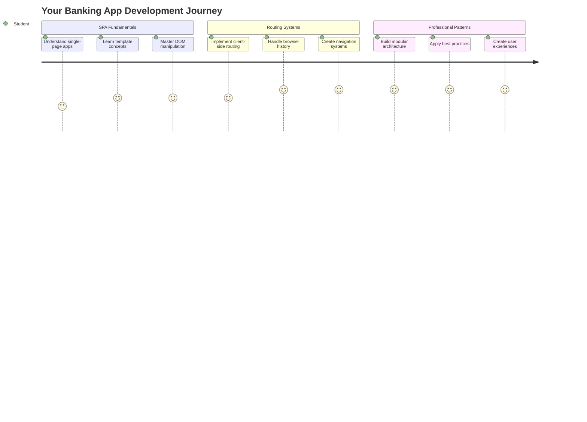
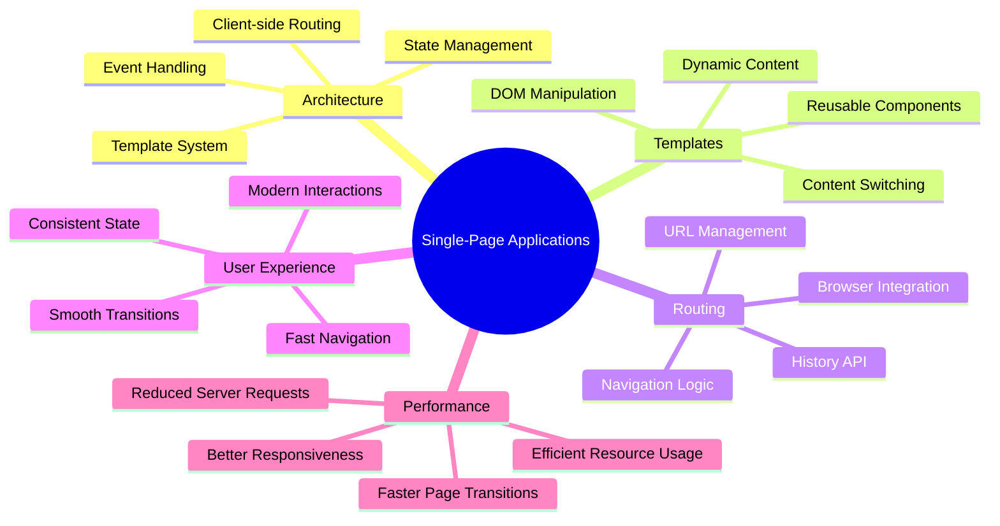
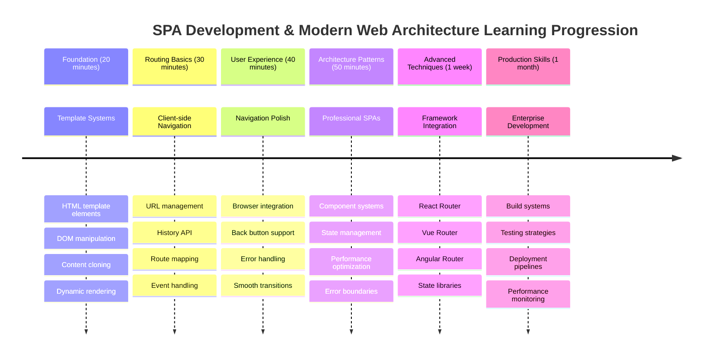

# Membangun Aplikasi Perbankan Bagian 1: Template HTML dan Rute dalam Aplikasi Web



Ketika komputer panduan Apollo 11 menavigasi ke bulan pada tahun 1969, ia harus beralih antara berbagai program tanpa memulai ulang seluruh sistem. Aplikasi web modern bekerja dengan cara yang serupa – mereka mengubah apa yang Anda lihat tanpa memuat ulang semuanya dari awal. Hal ini menciptakan pengalaman yang mulus dan responsif yang diharapkan pengguna saat ini.

Berbeda dengan situs web tradisional yang memuat ulang seluruh halaman untuk setiap interaksi, aplikasi web modern hanya memperbarui bagian yang perlu diubah. Pendekatan ini, seperti bagaimana pusat kendali beralih antara berbagai tampilan sambil tetap menjaga komunikasi yang konstan, menciptakan pengalaman yang lancar yang kita harapkan.

Inilah yang membuat perbedaannya begitu dramatis:

| Aplikasi Multi-Halaman Tradisional | Aplikasi Satu Halaman Modern |
|------------------------------------|-----------------------------|
| **Navigasi** | Muat ulang halaman penuh untuk setiap layar | Pergantian konten instan |
| **Performa** | Lebih lambat karena unduhan HTML lengkap | Lebih cepat dengan pembaruan parsial |
| **Pengalaman Pengguna** | Kilatan halaman yang mengganggu | Transisi mulus seperti aplikasi |
| **Berbagi Data** | Sulit antar halaman | Manajemen status yang mudah |
| **Pengembangan** | Banyak file HTML untuk dikelola | Satu HTML dengan template dinamis |

**Memahami evolusi:**
- **Aplikasi tradisional** membutuhkan permintaan server untuk setiap tindakan navigasi
- **SPA modern** hanya dimuat sekali dan memperbarui konten secara dinamis menggunakan JavaScript
- **Ekspektasi pengguna** sekarang lebih menyukai interaksi yang instan dan mulus
- **Keuntungan performa** termasuk pengurangan bandwidth dan respons yang lebih cepat

Dalam pelajaran ini, kita akan membangun aplikasi perbankan dengan beberapa layar yang mengalir bersama secara mulus. Seperti bagaimana para ilmuwan menggunakan instrumen modular yang dapat dikonfigurasi ulang untuk berbagai eksperimen, kita akan menggunakan template HTML sebagai komponen yang dapat digunakan kembali yang dapat ditampilkan sesuai kebutuhan.

Anda akan bekerja dengan template HTML (cetakan yang dapat digunakan kembali untuk berbagai layar), routing JavaScript (sistem yang beralih antara layar), dan API riwayat browser (yang menjaga tombol kembali berfungsi seperti yang diharapkan). Teknik-teknik ini adalah dasar yang sama yang digunakan oleh kerangka kerja seperti React, Vue, dan Angular.

Pada akhirnya, Anda akan memiliki aplikasi perbankan yang berfungsi yang menunjukkan prinsip aplikasi satu halaman profesional.



## Kuis Pra-Pelajaran

[Kuis pra-pelajaran](https://ff-quizzes.netlify.app/web/quiz/41)

### Apa yang Anda Butuhkan

Kita akan membutuhkan server web lokal untuk menguji aplikasi perbankan kita – jangan khawatir, ini lebih mudah daripada yang Anda pikirkan! Jika Anda belum memilikinya, cukup instal [Node.js](https://nodejs.org) dan jalankan `npx lite-server` dari folder proyek Anda. Perintah praktis ini akan menjalankan server lokal dan secara otomatis membuka aplikasi Anda di browser.

### Persiapan

Di komputer Anda, buat folder bernama `bank` dengan file bernama `index.html` di dalamnya. Kita akan memulai dari [boilerplate HTML](https://en.wikipedia.org/wiki/Boilerplate_code) ini:

```html
<!DOCTYPE html>
<html lang="en">
  <head>
    <meta charset="UTF-8">
    <meta name="viewport" content="width=device-width, initial-scale=1.0">
    <title>Bank App</title>
  </head>
  <body>
    <!-- This is where you'll work -->
  </body>
</html>
```

**Inilah yang disediakan oleh boilerplate ini:**
- **Menetapkan** struktur dokumen HTML5 dengan deklarasi DOCTYPE yang benar
- **Mengonfigurasi** pengkodean karakter sebagai UTF-8 untuk dukungan teks internasional
- **Mengaktifkan** desain responsif dengan tag meta viewport untuk kompatibilitas seluler
- **Menetapkan** judul deskriptif yang muncul di tab browser
- **Membuat** bagian body yang bersih tempat kita akan membangun aplikasi kita

> 📁 **Pratinjau Struktur Proyek**
> 
> **Pada akhir pelajaran ini, proyek Anda akan berisi:**
> ```
> bank/
> ├── index.html      <!-- Main HTML with templates -->
> ├── app.js          <!-- Routing and navigation logic -->
> └── style.css       <!-- (Optional for future lessons) -->
> ```
> 
> **Tanggung jawab file:**
> - **index.html**: Berisi semua template dan menyediakan struktur aplikasi
> - **app.js**: Menangani routing, navigasi, dan manajemen template
> - **Template**: Mendefinisikan UI untuk login, dashboard, dan layar lainnya

---

## Template HTML

Template menyelesaikan masalah mendasar dalam pengembangan web. Ketika Gutenberg menemukan pencetakan tipe bergerak pada tahun 1440-an, ia menyadari bahwa daripada mengukir seluruh halaman, ia dapat membuat blok huruf yang dapat digunakan kembali dan mengaturnya sesuai kebutuhan. Template HTML bekerja dengan prinsip yang sama – daripada membuat file HTML terpisah untuk setiap layar, Anda mendefinisikan struktur yang dapat digunakan kembali yang dapat ditampilkan sesuai kebutuhan.

```mermaid
flowchart TD
    A["📋 Template Definition"] --> B["💬 Hidden in DOM"]
    B --> C["🔍 JavaScript Finds Template"]
    C --> D["📋 Clone Template Content"]
    D --> E["🔗 Attach to Visible DOM"]
    E --> F["👁️ User Sees Content"]
    
    G["Login Template"] --> A
    H["Dashboard Template"] --> A
    I["Future Templates"] --> A
    
    style A fill:#e3f2fd
    style D fill:#e8f5e8
    style F fill:#fff3e0
    style B fill:#f3e5f5
```



Pikirkan template sebagai cetak biru untuk berbagai bagian aplikasi Anda. Sama seperti seorang arsitek membuat satu cetak biru dan menggunakannya beberapa kali daripada menggambar ulang ruangan yang identik, kita membuat template sekali dan menggunakannya sesuai kebutuhan. Browser menyimpan template ini tersembunyi sampai JavaScript mengaktifkannya.

Jika Anda ingin membuat beberapa layar untuk sebuah halaman web, salah satu solusinya adalah membuat satu file HTML untuk setiap layar yang ingin Anda tampilkan. Namun, solusi ini memiliki beberapa ketidaknyamanan:

- Anda harus memuat ulang seluruh HTML saat beralih layar, yang bisa lambat.
- Sulit untuk berbagi data antara layar yang berbeda.

Pendekatan lain adalah hanya memiliki satu file HTML, dan mendefinisikan beberapa [template HTML](https://developer.mozilla.org/docs/Web/HTML/Element/template) menggunakan elemen `<template>`. Template adalah blok HTML yang dapat digunakan kembali yang tidak ditampilkan oleh browser, dan perlu diinstansiasi saat runtime menggunakan JavaScript.

### Mari Kita Bangun

Kita akan membuat aplikasi bank dengan dua layar utama: halaman login dan dashboard. Pertama, mari tambahkan elemen placeholder ke body HTML kita – di sinilah semua layar kita yang berbeda akan muncul:

```html
<div id="app">Loading...</div>
```

**Memahami placeholder ini:**
- **Membuat** wadah dengan ID "app" tempat semua layar akan ditampilkan
- **Menampilkan** pesan pemuatan hingga JavaScript menginisialisasi layar pertama
- **Menyediakan** satu titik pemasangan untuk konten dinamis kita
- **Memungkinkan** penargetan mudah dari JavaScript menggunakan `document.getElementById()`

> 💡 **Tip Pro**: Karena konten elemen ini akan diganti, kita dapat menambahkan pesan atau indikator pemuatan yang akan ditampilkan saat aplikasi sedang dimuat.

Selanjutnya, mari tambahkan template HTML untuk halaman login di bawahnya. Untuk saat ini kita hanya akan menambahkan judul dan bagian yang berisi tautan yang akan kita gunakan untuk melakukan navigasi.

```html
<template id="login">
  <h1>Bank App</h1>
  <section>
    <a href="/dashboard">Login</a>
  </section>
</template>
```

**Memecah template login ini:**
- **Mendefinisikan** template dengan pengidentifikasi unik "login" untuk penargetan JavaScript
- **Menyertakan** heading utama yang menetapkan branding aplikasi
- **Berisi** elemen `<section>` semantik untuk mengelompokkan konten terkait
- **Menyediakan** tautan navigasi yang akan mengarahkan pengguna ke dashboard

Kemudian kita akan menambahkan template HTML lain untuk halaman dashboard. Halaman ini akan berisi beberapa bagian:

- Header dengan judul dan tautan logout
- Saldo saat ini dari rekening bank
- Daftar transaksi, ditampilkan dalam tabel

```html
<template id="dashboard">
  <header>
    <h1>Bank App</h1>
    <a href="/login">Logout</a>
  </header>
  <section>
    Balance: 100$
  </section>
  <section>
    <h2>Transactions</h2>
    <table>
      <thead>
        <tr>
          <th>Date</th>
          <th>Object</th>
          <th>Amount</th>
        </tr>
      </thead>
      <tbody></tbody>
    </table>
  </section>
</template>
```

**Mari kita pahami setiap bagian dari dashboard ini:**
- **Menyusun** halaman dengan elemen `<header>` semantik yang berisi navigasi
- **Menampilkan** judul aplikasi secara konsisten di seluruh layar untuk branding
- **Menyediakan** tautan logout yang mengarahkan kembali ke layar login
- **Menampilkan** saldo rekening saat ini di bagian khusus
- **Mengorganisasi** data transaksi menggunakan tabel HTML yang terstruktur dengan baik
- **Mendefinisikan** header tabel untuk kolom Tanggal, Objek, dan Jumlah
- **Meninggalkan** badan tabel kosong untuk injeksi konten dinamis nanti

> 💡 **Tip Pro**: Saat membuat template HTML, jika Anda ingin melihat seperti apa tampilannya, Anda dapat mengomentari baris `<template>` dan `</template>` dengan menutupnya menggunakan `<!-- -->`.

### 🔄 **Pengecekan Pedagogis**
**Pemahaman Sistem Template**: Sebelum mengimplementasikan JavaScript, pastikan Anda memahami:
- ✅ Bagaimana template berbeda dari elemen HTML biasa
- ✅ Mengapa template tetap tersembunyi hingga diaktifkan oleh JavaScript
- ✅ Pentingnya struktur HTML semantik dalam template
- ✅ Bagaimana template memungkinkan komponen UI yang dapat digunakan kembali

**Tes Cepat Diri**: Apa yang terjadi jika Anda menghapus tag `<template>` dari sekitar HTML Anda?
*Jawaban: Konten akan langsung terlihat dan kehilangan fungsionalitas templatenya*

**Manfaat Arsitektur**: Template menyediakan:
- **Dapat digunakan kembali**: Satu definisi, banyak instance
- **Performa**: Tidak ada parsing HTML yang berlebihan
- **Kemudahan pemeliharaan**: Struktur UI terpusat
- **Fleksibilitas**: Pergantian konten dinamis

✅ Mengapa menurut Anda kita menggunakan atribut `id` pada template? Bisakah kita menggunakan sesuatu yang lain seperti kelas?

## Menghidupkan Template dengan JavaScript

Sekarang kita perlu membuat template kita berfungsi. Seperti bagaimana printer 3D mengambil cetak biru digital dan menciptakan objek fisik, JavaScript mengambil template tersembunyi kita dan menciptakan elemen yang terlihat dan interaktif yang dapat dilihat dan digunakan oleh pengguna.

Prosesnya mengikuti tiga langkah konsisten yang membentuk dasar pengembangan web modern. Setelah Anda memahami pola ini, Anda akan mengenalinya di banyak kerangka kerja dan pustaka.

Jika Anda mencoba file HTML Anda saat ini di browser, Anda akan melihat bahwa itu terjebak menampilkan `Loading...`. Itu karena kita perlu menambahkan beberapa kode JavaScript untuk menginstansiasi dan menampilkan template HTML.

Menginstansiasi template biasanya dilakukan dalam 3 langkah:

1. Mengambil elemen template di DOM, misalnya menggunakan [`document.getElementById`](https://developer.mozilla.org/docs/Web/API/Document/getElementById).
2. Mengkloning elemen template, menggunakan [`cloneNode`](https://developer.mozilla.org/docs/Web/API/Node/cloneNode).
3. Melampirkannya ke DOM di bawah elemen yang terlihat, misalnya menggunakan [`appendChild`](https://developer.mozilla.org/docs/Web/API/Node/appendChild).

```mermaid
flowchart TD
    A[🔍 Step 1: Find Template] --> B[📋 Step 2: Clone Template]
    B --> C[🔗 Step 3: Attach to DOM]
    
    A1["document.getElementById('login')"] --> A
    B1["template.content.cloneNode(true)"] --> B  
    C1["app.appendChild(view)"] --> C
    
    C --> D[👁️ Template Visible to User]
    
    style A fill:#e1f5fe
    style B fill:#f3e5f5
    style C fill:#e8f5e8
    style D fill:#fff3e0
```



**Penjelasan visual dari proses:**
- **Langkah 1** menemukan template tersembunyi dalam struktur DOM
- **Langkah 2** membuat salinan kerja yang dapat dimodifikasi dengan aman
- **Langkah 3** memasukkan salinan ke area halaman yang terlihat
- **Hasil** adalah layar fungsional yang dapat berinteraksi dengan pengguna

✅ Mengapa kita perlu mengkloning template sebelum melampirkannya ke DOM? Apa yang menurut Anda akan terjadi jika kita melewatkan langkah ini?

### Tugas

Buat file baru bernama `app.js` di folder proyek Anda dan impor file tersebut di bagian `<head>` dari HTML Anda:

```html
<script src="app.js" defer></script>
```

**Memahami impor skrip ini:**
- **Menghubungkan** file JavaScript ke dokumen HTML kita
- **Menggunakan** atribut `defer` untuk memastikan skrip berjalan setelah parsing HTML selesai
- **Memungkinkan** akses ke semua elemen DOM karena mereka sepenuhnya dimuat sebelum eksekusi skrip
- **Mengikuti** praktik terbaik modern untuk pemuatan skrip dan performa

Sekarang di `app.js`, kita akan membuat fungsi baru `updateRoute`:

```js
function updateRoute(templateId) {
  const template = document.getElementById(templateId);
  const view = template.content.cloneNode(true);
  const app = document.getElementById('app');
  app.innerHTML = '';
  app.appendChild(view);
}
```

**Langkah demi langkah, inilah yang terjadi:**
- **Menemukan** elemen template menggunakan ID uniknya
- **Membuat** salinan mendalam dari konten template menggunakan `cloneNode(true)`
- **Menemukan** wadah aplikasi tempat konten akan ditampilkan
- **Menghapus** konten yang ada dari wadah aplikasi
- **Memasukkan** konten template yang dikloning ke dalam DOM yang terlihat

Sekarang panggil fungsi ini dengan salah satu template dan lihat hasilnya.

```js
updateRoute('login');
```

**Apa yang dicapai oleh pemanggilan fungsi ini:**
- **Mengaktifkan** template login dengan melewatkan ID-nya sebagai parameter
- **Menunjukkan** cara beralih secara programatik antara layar aplikasi yang berbeda
- **Menampilkan** layar login menggantikan pesan "Loading..."

✅ Apa tujuan dari kode ini `app.innerHTML = '';`? Apa yang terjadi tanpanya?

## Membuat Rute

Routing pada dasarnya adalah tentang menghubungkan URL ke konten yang tepat. Pertimbangkan bagaimana operator telepon awal menggunakan switchboard untuk menghubungkan panggilan – mereka akan mengambil permintaan masuk dan mengarahkannya ke tujuan yang benar. Routing web bekerja dengan cara yang sama, mengambil permintaan URL dan menentukan konten mana yang akan ditampilkan.

```mermaid
flowchart LR
    A["🌐 URL Path<br/>/dashboard"] --> B["🗺️ Routes Object<br/>Lookup"]
    B --> C["🎯 Template ID<br/>'dashboard'"]
    C --> D["📌 Find Template<br/>getElementById"]
    D --> E["👁️ Display Screen<br/>Clone & Append"]
    
    F["📍 /login"] --> G["🎯 'login'"]
    H["📍 /unknown"] --> I["❌ Not Found"]
    I --> J["🔄 Redirect to /login"]
    
    style B fill:#e3f2fd
    style E fill:#e8f5e8
    style I fill:#ffebee
    style J fill:#fff3e0
```



Secara tradisional, server web menangani ini dengan menyajikan file HTML yang berbeda untuk URL yang berbeda. Karena kita sedang membangun aplikasi satu halaman, kita perlu menangani routing ini sendiri dengan JavaScript. Pendekatan ini memberi kita lebih banyak kontrol atas pengalaman pengguna dan performa.

```mermaid
flowchart LR
    A["🌐 URL Path<br/>/dashboard"] --> B["🗺️ Routes Object<br/>Lookup"]
    B --> C["🎯 Template ID<br/>'dashboard'"]
    C --> D["📄 Find Template<br/>getElementById"]
    D --> E["👁️ Display Screen<br/>Clone & Append"]
    
    F["📍 /login"] --> G["🎯 'login'"]
    H["📍 /unknown"] --> I["❌ Not Found"]
    I --> J["🔄 Redirect to /login"]
    
    style B fill:#e3f2fd
    style E fill:#e8f5e8
    style I fill:#ffebee
    style J fill:#fff3e0
```



**Memahami alur routing:**
- **Perubahan URL** memicu pencarian dalam konfigurasi rute kita
- **Rute yang valid** memetakan ke ID template tertentu untuk dirender
- **Rute yang tidak valid** memicu perilaku fallback untuk mencegah keadaan rusak
- **Rendering template** mengikuti proses tiga langkah yang telah kita pelajari sebelumnya

Ketika berbicara tentang aplikasi web, kita menyebut *Routing* sebagai niat untuk memetakan **URL** ke layar tertentu yang harus ditampilkan. Pada situs web dengan banyak file HTML, ini dilakukan secara otomatis karena jalur file tercermin pada URL. Misalnya, dengan file-file ini di folder proyek Anda:

```
mywebsite/index.html
mywebsite/login.html
mywebsite/admin/index.html
```

Jika Anda membuat server web dengan `mywebsite` sebagai root, pemetaan URL akan menjadi:

```
https://site.com            --> mywebsite/index.html
https://site.com/login.html --> mywebsite/login.html
https://site.com/admin/     --> mywebsite/admin/index.html
```

Namun, untuk aplikasi web kita menggunakan satu file HTML yang berisi semua layar sehingga perilaku default ini tidak akan membantu kita. Kita harus membuat peta ini secara manual dan memperbarui template yang ditampilkan menggunakan JavaScript.

### Tugas

Kita akan menggunakan objek sederhana untuk mengimplementasikan [peta](https://en.wikipedia.org/wiki/Associative_array) antara jalur URL dan template kita. Tambahkan objek ini di bagian atas file `app.js` Anda.

```js
const routes = {
  '/login': { templateId: 'login' },
  '/dashboard': { templateId: 'dashboard' },
};
```

**Memahami konfigurasi rute ini:**
- **Mendefinisikan** pemetaan antara jalur URL dan pengidentifikasi template
- **Menggunakan** sintaks objek di mana kunci adalah jalur URL dan nilai berisi informasi template
- **Memungkinkan** pencarian mudah tentang template mana yang akan ditampilkan untuk URL tertentu
- **Menyediakan** struktur yang dapat diskalakan untuk menambahkan rute baru di masa depan
Sekarang mari kita modifikasi sedikit fungsi `updateRoute`. Alih-alih langsung meneruskan `templateId` sebagai argumen, kita ingin mengambilnya dengan terlebih dahulu melihat URL saat ini, lalu menggunakan peta kita untuk mendapatkan nilai ID template yang sesuai. Kita dapat menggunakan [`window.location.pathname`](https://developer.mozilla.org/docs/Web/API/Location/pathname) untuk mendapatkan bagian path saja dari URL.

```js
function updateRoute() {
  const path = window.location.pathname;
  const route = routes[path];

  const template = document.getElementById(route.templateId);
  const view = template.content.cloneNode(true);
  const app = document.getElementById('app');
  app.innerHTML = '';
  app.appendChild(view);
}
```

**Penjelasan tentang apa yang terjadi di sini:**
- **Mengambil** path saat ini dari URL browser menggunakan `window.location.pathname`
- **Mencari** konfigurasi rute yang sesuai dalam objek rute kita
- **Mengambil** ID template dari konfigurasi rute
- **Mengikuti** proses rendering template yang sama seperti sebelumnya
- **Menciptakan** sistem dinamis yang merespons perubahan URL

Di sini kita memetakan rute yang telah kita deklarasikan ke template yang sesuai. Anda dapat mencobanya dan memastikan bahwa ini berfungsi dengan benar dengan mengubah URL secara manual di browser Anda.

✅ Apa yang terjadi jika Anda memasukkan path yang tidak dikenal di URL? Bagaimana kita bisa menyelesaikan ini?

## Menambahkan Navigasi

Dengan routing yang sudah dibuat, pengguna membutuhkan cara untuk bernavigasi melalui aplikasi. Situs web tradisional memuat ulang seluruh halaman saat mengklik tautan, tetapi kita ingin memperbarui URL dan konten tanpa memuat ulang halaman. Ini menciptakan pengalaman yang lebih mulus seperti aplikasi desktop yang beralih antara berbagai tampilan.

Kita perlu mengoordinasikan dua hal: memperbarui URL browser sehingga pengguna dapat menandai halaman dan berbagi tautan, serta menampilkan konten yang sesuai. Ketika diimplementasikan dengan benar, ini menciptakan navigasi yang mulus seperti yang diharapkan pengguna dari aplikasi modern.


### 🔄 **Pengecekan Pedagogis**
**Arsitektur Aplikasi Halaman Tunggal**: Verifikasi pemahaman Anda tentang sistem lengkap:
- ✅ Bagaimana routing sisi klien berbeda dari routing sisi server tradisional?
- ✅ Mengapa History API penting untuk navigasi SPA yang benar?
- ✅ Bagaimana template memungkinkan konten dinamis tanpa memuat ulang halaman?
- ✅ Apa peran penanganan event dalam mencegat navigasi?

**Integrasi Sistem**: SPA Anda menunjukkan:
- **Manajemen Template**: Komponen UI yang dapat digunakan kembali dengan konten dinamis
- **Routing Sisi Klien**: Manajemen URL tanpa permintaan server
- **Arsitektur Berbasis Event**: Navigasi responsif dan interaksi pengguna
- **Integrasi Browser**: Dukungan tombol kembali/maju yang benar
- **Optimasi Performa**: Transisi cepat dan pengurangan beban server

**Pola Profesional**: Anda telah mengimplementasikan:
- **Pemilahan Model-Tampilan**: Template terpisah dari logika aplikasi
- **Manajemen Status**: Status URL disinkronkan dengan konten yang ditampilkan
- **Peningkatan Progresif**: JavaScript meningkatkan fungsionalitas HTML dasar
- **Pengalaman Pengguna**: Navigasi mulus seperti aplikasi tanpa memuat ulang halaman

> � **Wawasan Arsitektur**: Komponen Sistem Navigasi
>
> **Apa yang Anda bangun:**
> - **🔄 Manajemen URL**: Memperbarui bilah alamat browser tanpa memuat ulang halaman
> - **📋 Sistem Template**: Mengganti konten secara dinamis berdasarkan rute saat ini  
> - **📚 Integrasi History**: Mempertahankan fungsionalitas tombol kembali/maju browser
> - **🛡️ Penanganan Error**: Penanganan fallback yang baik untuk rute yang tidak valid atau hilang
>
> **Bagaimana komponen bekerja bersama:**
> - **Mendengarkan** event navigasi (klik, perubahan history)
> - **Memperbarui** URL menggunakan History API
> - **Merender** template yang sesuai untuk rute baru
> - **Mempertahankan** pengalaman pengguna yang mulus sepanjang waktu

Langkah berikutnya untuk aplikasi kita adalah menambahkan kemungkinan untuk bernavigasi antar halaman tanpa harus mengubah URL secara manual. Ini menyiratkan dua hal:

  1. Memperbarui URL saat ini
  2. Memperbarui template yang ditampilkan berdasarkan URL baru

Kita sudah menyelesaikan bagian kedua dengan fungsi `updateRoute`, jadi kita harus mencari cara untuk memperbarui URL saat ini.

Kita harus menggunakan JavaScript dan lebih spesifik lagi [`history.pushState`](https://developer.mozilla.org/docs/Web/API/History/pushState) yang memungkinkan untuk memperbarui URL dan membuat entri baru dalam riwayat penjelajahan, tanpa memuat ulang HTML.

> ⚠️ **Catatan Penting**: Meskipun elemen jangkar HTML [`<a href>`](https://developer.mozilla.org/docs/Web/HTML/Element/a) dapat digunakan sendiri untuk membuat hyperlink ke URL yang berbeda, ini akan membuat browser memuat ulang HTML secara default. Penting untuk mencegah perilaku ini saat menangani routing dengan JavaScript kustom, menggunakan fungsi preventDefault() pada event klik.

### Tugas

Mari kita buat fungsi baru yang dapat kita gunakan untuk bernavigasi dalam aplikasi kita:

```js
function navigate(path) {
  window.history.pushState({}, path, path);
  updateRoute();
}
```

**Memahami fungsi navigasi ini:**
- **Memperbarui** URL browser ke path baru menggunakan `history.pushState`
- **Menambahkan** entri baru ke stack riwayat browser untuk dukungan tombol kembali/maju yang benar
- **Memicu** fungsi `updateRoute()` untuk menampilkan template yang sesuai
- **Mempertahankan** pengalaman aplikasi halaman tunggal tanpa memuat ulang halaman

Metode ini pertama-tama memperbarui URL saat ini berdasarkan path yang diberikan, lalu memperbarui template. Properti `window.location.origin` mengembalikan root URL, memungkinkan kita untuk merekonstruksi URL lengkap dari path yang diberikan.

Sekarang kita memiliki fungsi ini, kita dapat menangani masalah yang kita miliki jika path tidak cocok dengan rute yang didefinisikan. Kita akan memodifikasi fungsi `updateRoute` dengan menambahkan fallback ke salah satu rute yang ada jika kita tidak dapat menemukan kecocokan.

```js
function updateRoute() {
  const path = window.location.pathname;
  const route = routes[path];

  if (!route) {
    return navigate('/login');
  }

  const template = document.getElementById(route.templateId);
  const view = template.content.cloneNode(true);
  const app = document.getElementById('app');
  app.innerHTML = '';
  app.appendChild(view);
}
```

**Poin-poin penting yang perlu diingat:**
- **Memeriksa** apakah rute ada untuk path saat ini
- **Mengalihkan** ke halaman login saat rute tidak valid diakses
- **Menyediakan** mekanisme fallback yang mencegah navigasi rusak
- **Memastikan** pengguna selalu melihat layar yang valid, bahkan dengan URL yang salah

Jika rute tidak dapat ditemukan, kita sekarang akan mengalihkan ke halaman `login`.

Sekarang mari kita buat fungsi untuk mendapatkan URL saat tautan diklik, dan untuk mencegah perilaku tautan default browser:

```js
function onLinkClick(event) {
  event.preventDefault();
  navigate(event.target.href);
}
```

**Penjelasan tentang handler klik ini:**
- **Mencegah** perilaku tautan default browser menggunakan `preventDefault()`
- **Mengambil** URL tujuan dari elemen tautan yang diklik
- **Memanggil** fungsi navigasi kustom kita alih-alih memuat ulang halaman
- **Mempertahankan** pengalaman aplikasi halaman tunggal yang mulus

```html
<a href="/dashboard" onclick="onLinkClick(event)">Login</a>
...
<a href="/login" onclick="onLinkClick(event)">Logout</a>
```

**Apa yang dicapai oleh binding onclick ini:**
- **Menghubungkan** setiap tautan ke sistem navigasi kustom kita
- **Meneruskan** event klik ke fungsi `onLinkClick` kita untuk diproses
- **Memungkinkan** navigasi mulus tanpa memuat ulang halaman
- **Mempertahankan** struktur URL yang benar yang dapat ditandai atau dibagikan oleh pengguna

Atribut [`onclick`](https://developer.mozilla.org/docs/Web/API/GlobalEventHandlers/onclick) mengikat event `click` ke kode JavaScript, di sini panggilan ke fungsi `navigate()`.

Cobalah mengklik tautan ini, Anda sekarang seharusnya dapat bernavigasi antara berbagai layar aplikasi Anda.

✅ Metode `history.pushState` adalah bagian dari standar HTML5 dan diimplementasikan di [semua browser modern](https://caniuse.com/?search=pushState). Jika Anda sedang membangun aplikasi web untuk browser lama, ada trik yang dapat Anda gunakan sebagai pengganti API ini: menggunakan [hash (`#`)](https://en.wikipedia.org/wiki/URI_fragment) sebelum path Anda dapat mengimplementasikan routing yang berfungsi dengan navigasi jangkar biasa dan tidak memuat ulang halaman, karena tujuannya adalah untuk membuat tautan internal dalam halaman.

## Membuat Tombol Kembali dan Maju Berfungsi

Tombol kembali dan maju adalah hal mendasar dalam penjelajahan web, seperti bagaimana pengendali misi NASA dapat meninjau status sistem sebelumnya selama misi luar angkasa. Pengguna mengharapkan tombol ini berfungsi, dan ketika tidak, itu merusak pengalaman penjelajahan yang diharapkan.

Aplikasi halaman tunggal kita membutuhkan konfigurasi tambahan untuk mendukung ini. Browser mempertahankan stack riwayat (yang telah kita tambahkan dengan `history.pushState`), tetapi ketika pengguna bernavigasi melalui riwayat ini, aplikasi kita perlu merespons dengan memperbarui konten yang ditampilkan sesuai.


**Poin interaksi utama:**
- **Tindakan pengguna** memicu navigasi melalui klik atau tombol browser
- **Aplikasi mencegat** klik tautan untuk mencegah pemuatan ulang halaman
- **History API** mengelola perubahan URL dan stack riwayat browser
- **Template** menyediakan struktur konten untuk setiap layar
- **Event listener** memastikan aplikasi merespons semua jenis navigasi

Menggunakan `history.pushState` menciptakan entri baru dalam riwayat navigasi browser. Anda dapat memeriksanya dengan menahan *tombol kembali* browser Anda, seharusnya menampilkan sesuatu seperti ini:


Jika Anda mencoba mengklik tombol kembali beberapa kali, Anda akan melihat bahwa URL saat ini berubah dan riwayat diperbarui, tetapi template yang sama tetap ditampilkan.

Itu karena aplikasi tidak tahu bahwa kita perlu memanggil `updateRoute()` setiap kali riwayat berubah. Jika Anda melihat dokumentasi [`history.pushState`](https://developer.mozilla.org/docs/Web/API/History/pushState), Anda dapat melihat bahwa jika status berubah - artinya kita berpindah ke URL yang berbeda - event [`popstate`](https://developer.mozilla.org/docs/Web/API/Window/popstate_event) dipicu. Kita akan menggunakan itu untuk memperbaiki masalah tersebut.

### Tugas

Untuk memastikan template yang ditampilkan diperbarui saat riwayat browser berubah, kita akan menambahkan fungsi baru yang memanggil `updateRoute()`. Kita akan melakukannya di bagian bawah file `app.js` kita:

```js
window.onpopstate = () => updateRoute();
updateRoute();
```

**Memahami integrasi riwayat ini:**
- **Mendengarkan** event `popstate` yang terjadi saat pengguna bernavigasi dengan tombol browser
- **Menggunakan** fungsi panah untuk sintaks handler event yang ringkas
- **Memanggil** `updateRoute()` secara otomatis setiap kali status riwayat berubah
- **Menginisialisasi** aplikasi dengan memanggil `updateRoute()` saat halaman pertama kali dimuat
- **Memastikan** template yang benar ditampilkan terlepas dari bagaimana pengguna bernavigasi

> 💡 **Tips Profesional**: Kami menggunakan [fungsi panah](https://developer.mozilla.org/docs/Web/JavaScript/Reference/Functions/Arrow_functions) di sini untuk mendeklarasikan handler event `popstate` kami agar lebih ringkas, tetapi fungsi biasa juga akan berfungsi sama.

Berikut video penyegaran tentang fungsi panah:

[](https://youtube.com/watch?v=OP6eEbOj2sc "Fungsi Panah")

> 🎥 Klik gambar di atas untuk video tentang fungsi panah.

Sekarang coba gunakan tombol kembali dan maju browser Anda, dan periksa bahwa rute yang ditampilkan diperbarui dengan benar kali ini.

### ⚡ **Apa yang Bisa Anda Lakukan dalam 5 Menit Berikutnya**
- [ ] Uji navigasi aplikasi perbankan Anda menggunakan tombol kembali/maju browser
- [ ] Coba ketik URL yang berbeda secara manual di bilah alamat untuk menguji routing
- [ ] Buka DevTools browser dan periksa bagaimana template dikloning ke dalam DOM
- [ ] Bereksperimen dengan menambahkan pernyataan console.log untuk melacak alur routing

### 🎯 **Apa yang Bisa Anda Capai dalam Satu Jam**
- [ ] Selesaikan kuis pasca-pelajaran dan pahami konsep arsitektur SPA
- [ ] Tambahkan styling CSS untuk membuat template aplikasi perbankan Anda terlihat profesional
- [ ] Implementasikan tantangan halaman error 404 dengan penanganan error yang benar
- [ ] Buat tantangan halaman kredit dengan fungsionalitas routing tambahan
- [ ] Tambahkan status pemuatan dan transisi antara pergantian template

### 📅 **Perjalanan Pengembangan SPA Anda Selama Seminggu**
- [ ] Selesaikan aplikasi perbankan lengkap dengan formulir, manajemen data, dan persistensi
- [ ] Tambahkan fitur routing lanjutan seperti parameter rute dan rute bersarang
- [ ] Implementasikan penjaga navigasi dan routing berbasis autentikasi
- [ ] Buat komponen template yang dapat digunakan kembali dan pustaka komponen
- [ ] Tambahkan animasi dan transisi untuk pengalaman pengguna yang lebih mulus
- [ ] Deploy SPA Anda ke platform hosting dan konfigurasi routing dengan benar

### 🌟 **Penguasaan Arsitektur Frontend Anda Selama Sebulan**
- [ ] Bangun SPA kompleks menggunakan framework modern seperti React, Vue, atau Angular
- [ ] Pelajari pola manajemen status lanjutan dan pustaka
- [ ] Kuasai alat build dan alur kerja pengembangan untuk pengembangan SPA
- [ ] Implementasikan fitur Progressive Web App dan fungsionalitas offline
- [ ] Pelajari teknik optimasi performa untuk SPA skala besar
- [ ] Berkontribusi pada proyek open source SPA dan bagikan pengetahuan Anda

## 🎯 Garis Waktu Penguasaan Aplikasi Halaman Tunggal Anda



### 🛠️ Ringkasan Toolkit Pengembangan SPA Anda

Setelah menyelesaikan pelajaran ini, Anda sekarang telah menguasai:
- **Arsitektur Template**: Komponen HTML yang dapat digunakan kembali dengan rendering konten dinamis
- **Routing Sisi Klien**: Manajemen URL dan navigasi tanpa memuat ulang halaman
- **Integrasi Browser**: Penggunaan History API dan dukungan tombol kembali/maju
- **Sistem Berbasis Event**: Penanganan navigasi dan manajemen interaksi pengguna
- **Manipulasi DOM**: Kloning template, pergantian konten, dan manajemen elemen
- **Penanganan Error**: Fallback yang baik untuk rute yang tidak valid dan konten yang hilang
- **Pola Performa**: Strategi pemuatan dan rendering konten yang efisien

**Aplikasi Dunia Nyata**: Keterampilan pengembangan SPA Anda langsung berlaku untuk:
- **Aplikasi Web Modern**: Pengembangan framework seperti React, Vue, Angular, dan lainnya
- **Aplikasi Web Progresif**: Aplikasi yang dapat digunakan offline dengan pengalaman seperti aplikasi
- **Dashboard Perusahaan**: Aplikasi bisnis kompleks dengan banyak tampilan
- **Platform E-commerce**: Katalog produk, keranjang belanja, dan alur checkout
- **Manajemen Konten**: Pembuatan dan pengeditan konten dinamis
- **Pengembangan Mobile**: Aplikasi hybrid menggunakan teknologi web

**Keterampilan Profesional yang Diperoleh**: Anda sekarang dapat:
- **Arsitek** aplikasi satu halaman dengan pemisahan tanggung jawab yang tepat  
- **Implementasikan** sistem routing sisi klien yang dapat berkembang sesuai dengan kompleksitas aplikasi  
- **Debug** alur navigasi yang kompleks menggunakan alat pengembang browser  
- **Optimalkan** performa aplikasi melalui pengelolaan template yang efisien  
- **Rancang** pengalaman pengguna yang terasa alami dan responsif  

**Konsep Pengembangan Frontend yang Dikuasai**:  
- **Arsitektur Komponen**: Pola UI yang dapat digunakan kembali dan sistem template  
- **Sinkronisasi Status**: Pengelolaan status URL dan riwayat browser  
- **Pemrograman Berbasis Event**: Penanganan interaksi pengguna dan navigasi  
- **Optimasi Performa**: Manipulasi DOM yang efisien dan pemuatan konten  
- **Desain Pengalaman Pengguna**: Transisi yang mulus dan navigasi yang intuitif  

**Tingkat Selanjutnya**: Anda siap untuk menjelajahi framework frontend modern, manajemen status tingkat lanjut, atau membangun aplikasi perusahaan yang kompleks!  

🌟 **Pencapaian Terkunci**: Anda telah membangun fondasi aplikasi satu halaman profesional dengan pola arsitektur web modern!  

---

## Tantangan GitHub Copilot Agent 🚀  

Gunakan mode Agent untuk menyelesaikan tantangan berikut:  

**Deskripsi:** Tingkatkan aplikasi perbankan dengan menerapkan penanganan kesalahan dan template halaman 404 untuk rute yang tidak valid, meningkatkan pengalaman pengguna saat menavigasi ke halaman yang tidak ada.  

**Prompt:** Buat template HTML baru dengan id "not-found" yang menampilkan halaman kesalahan 404 yang ramah pengguna dengan gaya. Kemudian modifikasi logika routing JavaScript untuk menampilkan template ini saat pengguna menavigasi ke URL yang tidak valid, dan tambahkan tombol "Go Home" yang mengarahkan kembali ke halaman login.  

Pelajari lebih lanjut tentang [mode agent](https://code.visualstudio.com/blogs/2025/02/24/introducing-copilot-agent-mode) di sini.  

## 🚀 Tantangan  

Tambahkan template dan rute baru untuk halaman ketiga yang menampilkan kredit untuk aplikasi ini.  

**Tujuan tantangan:**  
- **Buat** template HTML baru dengan struktur konten yang sesuai  
- **Tambahkan** rute baru ke objek konfigurasi rute Anda  
- **Sertakan** tautan navigasi ke dan dari halaman kredit  
- **Uji** bahwa semua navigasi berfungsi dengan benar dengan riwayat browser  

## Kuis Pasca-Kuliah  

[Kuis pasca-kuliah](https://ff-quizzes.netlify.app/web/quiz/42)  

## Tinjauan & Studi Mandiri  

Routing adalah salah satu bagian yang cukup rumit dalam pengembangan web, terutama saat web beralih dari perilaku penyegaran halaman ke penyegaran halaman Aplikasi Satu Halaman. Bacalah sedikit tentang [bagaimana layanan Azure Static Web App](https://docs.microsoft.com/azure/static-web-apps/routes/?WT.mc_id=academic-77807-sagibbon) menangani routing. Bisakah Anda menjelaskan mengapa beberapa keputusan yang dijelaskan dalam dokumen tersebut diperlukan?  

**Sumber pembelajaran tambahan:**  
- **Jelajahi** bagaimana framework populer seperti React Router dan Vue Router menerapkan routing sisi klien  
- **Teliti** perbedaan antara routing berbasis hash dan routing API riwayat  
- **Pelajari** tentang rendering sisi server (SSR) dan bagaimana hal itu memengaruhi strategi routing  
- **Selidiki** bagaimana Aplikasi Web Progresif (PWA) menangani routing dan navigasi  

## Tugas  

[Perbaiki routing](assignment.md)  

---

**Penafian**:  
Dokumen ini telah diterjemahkan menggunakan layanan penerjemahan AI [Co-op Translator](https://github.com/Azure/co-op-translator). Meskipun kami berupaya untuk memberikan hasil yang akurat, harap diketahui bahwa terjemahan otomatis mungkin mengandung kesalahan atau ketidakakuratan. Dokumen asli dalam bahasa aslinya harus dianggap sebagai sumber yang otoritatif. Untuk informasi yang penting, disarankan menggunakan jasa penerjemahan manusia profesional. Kami tidak bertanggung jawab atas kesalahpahaman atau penafsiran yang timbul dari penggunaan terjemahan ini.