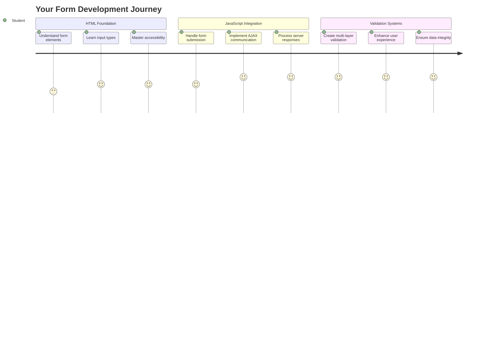
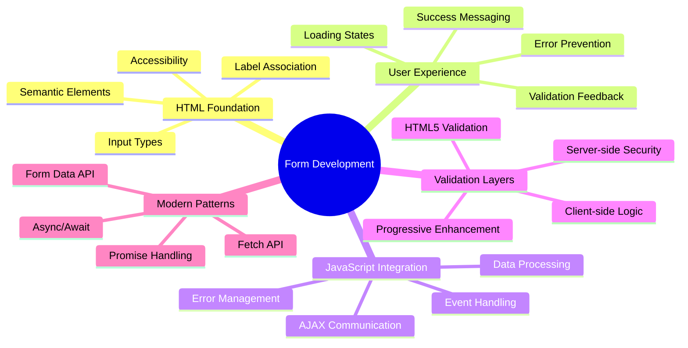
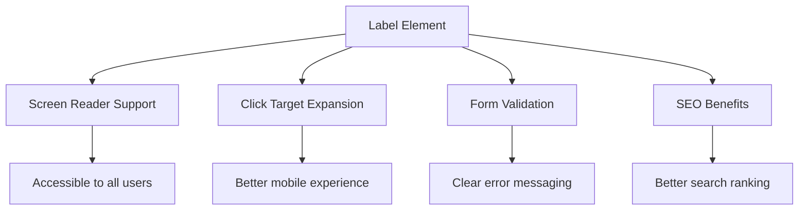
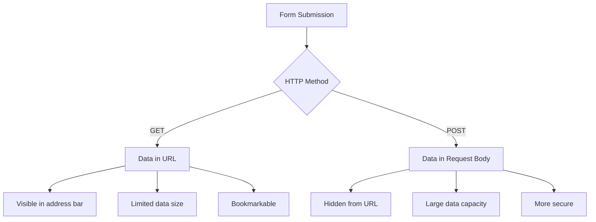
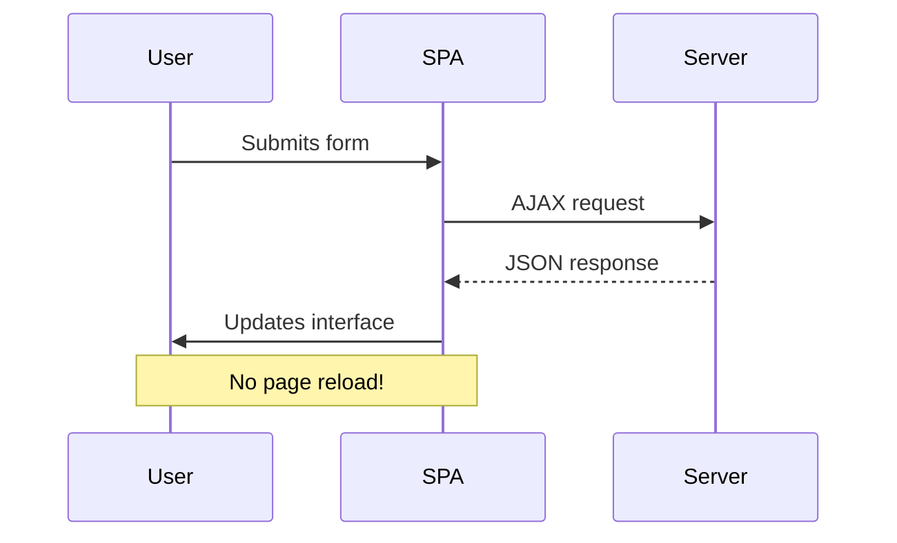
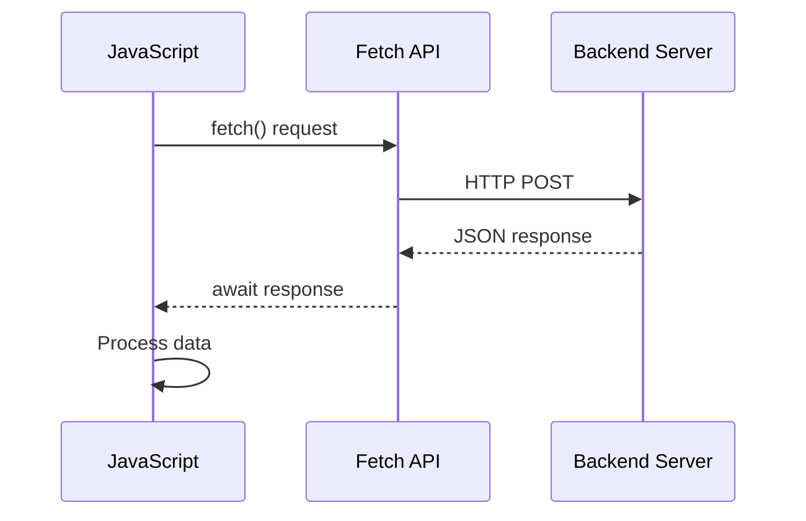
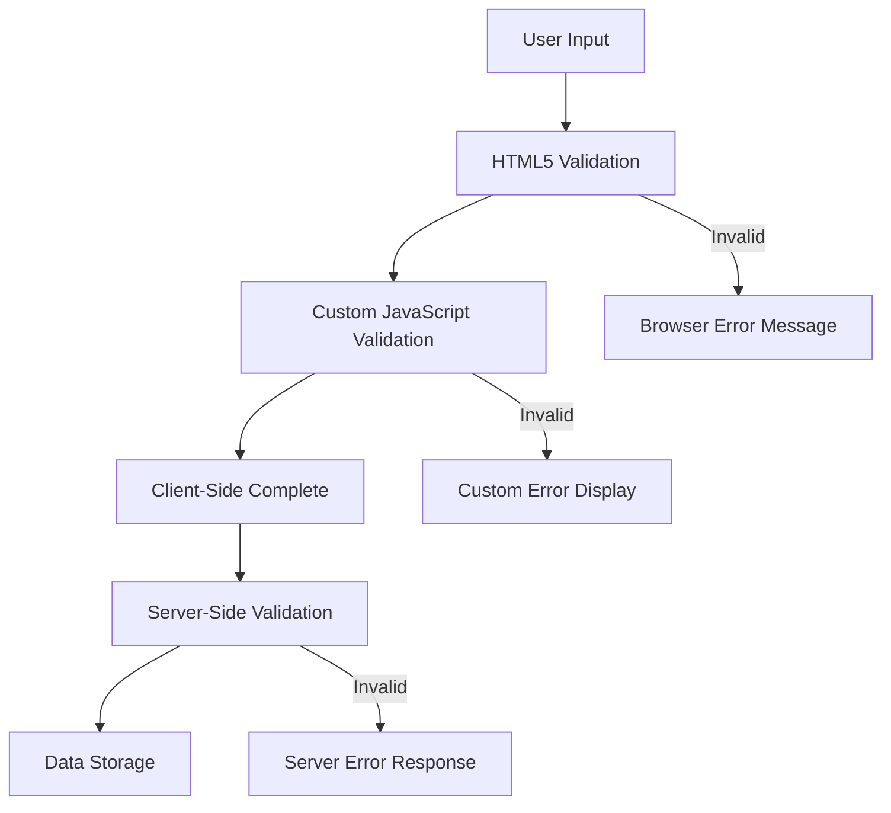
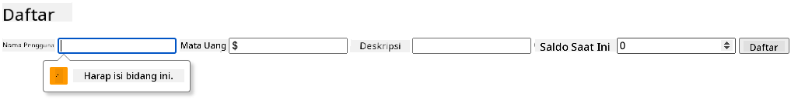
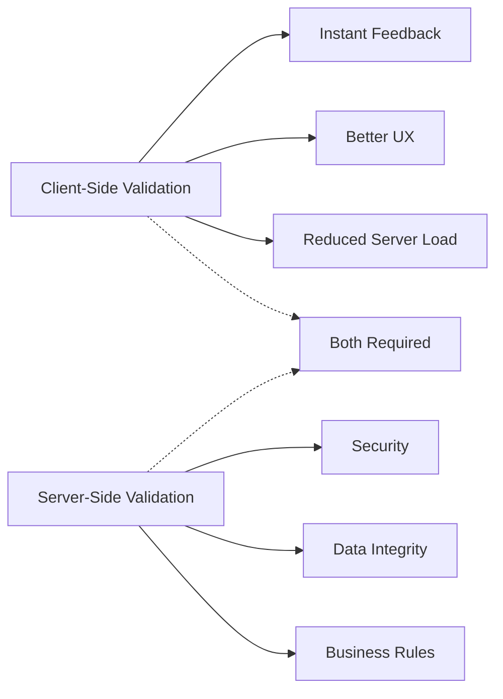
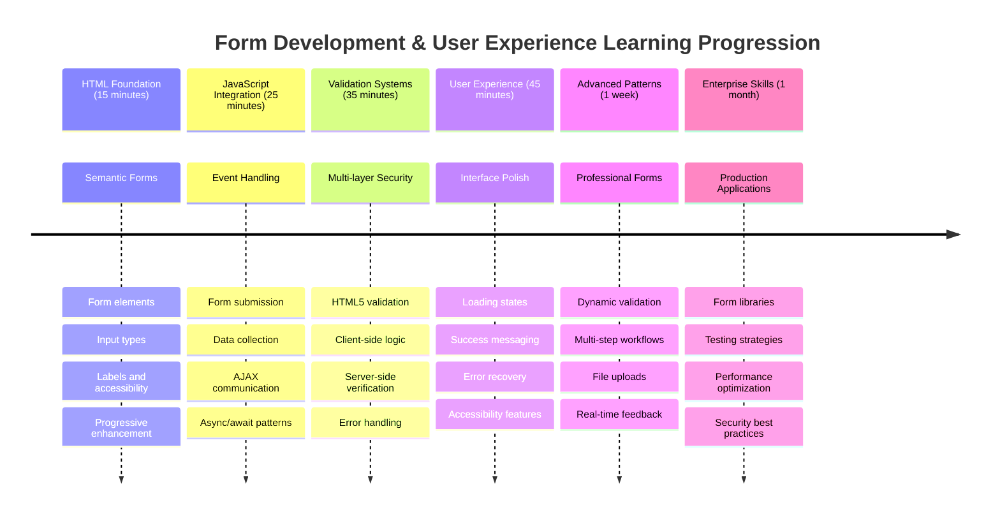

<!--
CO_OP_TRANSLATOR_METADATA:
{
  "original_hash": "7cbdbd132d39a2bb493e85bc2a9387cc",
  "translation_date": "2025-11-06T11:52:48+00:00",
  "source_file": "7-bank-project/2-forms/README.md",
  "language_code": "id"
}
-->
# Membangun Aplikasi Perbankan Bagian 2: Membuat Formulir Login dan Registrasi



## Kuis Pra-Pelajaran

[Kuis pra-pelajaran](https://ff-quizzes.netlify.app/web/quiz/43)

Pernah mengisi formulir online dan email Anda ditolak karena formatnya salah? Atau kehilangan semua informasi saat Anda mengklik tombol kirim? Kita semua pernah mengalami pengalaman yang menjengkelkan ini.

Formulir adalah jembatan antara pengguna dan fungsi aplikasi Anda. Seperti protokol hati-hati yang digunakan pengendali lalu lintas udara untuk memandu pesawat dengan aman ke tujuannya, formulir yang dirancang dengan baik memberikan umpan balik yang jelas dan mencegah kesalahan yang mahal. Formulir yang buruk, di sisi lain, dapat membuat pengguna pergi lebih cepat daripada kesalahan komunikasi di bandara yang sibuk.

Dalam pelajaran ini, kita akan mengubah aplikasi perbankan statis Anda menjadi aplikasi interaktif. Anda akan belajar membuat formulir yang memvalidasi input pengguna, berkomunikasi dengan server, dan memberikan umpan balik yang bermanfaat. Anggap saja ini sebagai membangun antarmuka kontrol yang memungkinkan pengguna menavigasi fitur aplikasi Anda.

Pada akhirnya, Anda akan memiliki sistem login dan registrasi lengkap dengan validasi yang memandu pengguna menuju kesuksesan daripada frustrasi.



## Prasyarat

Sebelum kita mulai membuat formulir, mari kita pastikan semuanya sudah diatur dengan benar. Pelajaran ini melanjutkan dari pelajaran sebelumnya, jadi jika Anda melewatkannya, Anda mungkin ingin kembali dan menyelesaikan dasar-dasarnya terlebih dahulu.

### Pengaturan yang Diperlukan

| Komponen | Status | Deskripsi |
|-----------|--------|-------------|
| [Template HTML](../1-template-route/README.md) | ✅ Diperlukan | Struktur dasar aplikasi perbankan Anda |
| [Node.js](https://nodejs.org) | ✅ Diperlukan | Runtime JavaScript untuk server |
| [Server API Bank](../api/README.md) | ✅ Diperlukan | Layanan backend untuk penyimpanan data |

> 💡 **Tips Pengembangan**: Anda akan menjalankan dua server terpisah secara bersamaan – satu untuk aplikasi perbankan front-end Anda dan satu lagi untuk API backend. Pengaturan ini mencerminkan pengembangan dunia nyata di mana layanan front-end dan back-end beroperasi secara independen.

### Konfigurasi Server

**Lingkungan pengembangan Anda akan mencakup:**
- **Server front-end**: Menyediakan aplikasi perbankan Anda (biasanya port `3000`)
- **Server API backend**: Menangani penyimpanan dan pengambilan data (port `5000`)
- **Kedua server** dapat berjalan secara bersamaan tanpa konflik

**Menguji koneksi API Anda:**
```bash
curl http://localhost:5000/api
# Expected response: "Bank API v1.0.0"
```

**Jika Anda melihat respons versi API, Anda siap melanjutkan!**

---

## Memahami Formulir HTML dan Kontrol

Formulir HTML adalah cara pengguna berkomunikasi dengan aplikasi web Anda. Anggap mereka sebagai sistem telegraf yang menghubungkan tempat-tempat jauh di abad ke-19 – mereka adalah protokol komunikasi antara niat pengguna dan respons aplikasi. Ketika dirancang dengan hati-hati, mereka menangkap kesalahan, memandu format input, dan memberikan saran yang bermanfaat.

Formulir modern jauh lebih canggih daripada input teks dasar. HTML5 memperkenalkan jenis input khusus yang secara otomatis menangani validasi email, format angka, dan pemilihan tanggal. Peningkatan ini menguntungkan baik aksesibilitas maupun pengalaman pengguna seluler.

### Elemen Formulir Esensial

**Blok bangunan yang dibutuhkan setiap formulir:**

```html
<!-- Basic form structure -->
<form id="userForm" method="POST">
  <label for="username">Username</label>
  <input id="username" name="username" type="text" required>
  
  <button type="submit">Submit</button>
</form>
```

**Apa yang dilakukan kode ini:**
- **Membuat** wadah formulir dengan pengidentifikasi unik
- **Menentukan** metode HTTP untuk pengiriman data
- **Mengasosiasikan** label dengan input untuk aksesibilitas
- **Mendefinisikan** tombol kirim untuk memproses formulir

### Jenis Input Modern dan Atribut

| Jenis Input | Tujuan | Contoh Penggunaan |
|------------|---------|---------------|
| `text` | Input teks umum | `<input type="text" name="username">` |
| `email` | Validasi email | `<input type="email" name="email">` |
| `password` | Entri teks tersembunyi | `<input type="password" name="password">` |
| `number` | Input angka | `<input type="number" name="balance" min="0">` |
| `tel` | Nomor telepon | `<input type="tel" name="phone">` |

> 💡 **Keuntungan HTML5 Modern**: Menggunakan jenis input tertentu memberikan validasi otomatis, keyboard seluler yang sesuai, dan dukungan aksesibilitas yang lebih baik tanpa JavaScript tambahan!

### Jenis Tombol dan Perilaku

```html
<!-- Different button behaviors -->
<button type="submit">Save Data</button>     <!-- Submits the form -->
<button type="reset">Clear Form</button>    <!-- Resets all fields -->
<button type="button">Custom Action</button> <!-- No default behavior -->
```

**Apa yang dilakukan setiap jenis tombol:**
- **Tombol kirim**: Memicu pengiriman formulir dan mengirim data ke endpoint yang ditentukan
- **Tombol reset**: Mengembalikan semua bidang formulir ke keadaan awalnya
- **Tombol biasa**: Tidak memberikan perilaku default, membutuhkan JavaScript khusus untuk fungsionalitas

> ⚠️ **Catatan Penting**: Elemen `<input>` bersifat self-closing dan tidak memerlukan tag penutup. Praktik terbaik modern adalah menulis `<input>` tanpa garis miring.

### Membangun Formulir Login Anda

Sekarang mari kita buat formulir login praktis yang menunjukkan praktik formulir HTML modern. Kita akan mulai dengan struktur dasar dan secara bertahap meningkatkannya dengan fitur aksesibilitas dan validasi.

```html
<template id="login">
  <h1>Bank App</h1>
  <section>
    <h2>Login</h2>
    <form id="loginForm" novalidate>
      <div class="form-group">
        <label for="username">Username</label>
        <input id="username" name="user" type="text" required 
               autocomplete="username" placeholder="Enter your username">
      </div>
      <button type="submit">Login</button>
    </form>
  </section>
</template>
```

**Penjelasan apa yang terjadi di sini:**
- **Menyusun** formulir dengan elemen HTML5 semantik
- **Mengelompokkan** elemen terkait menggunakan wadah `div` dengan kelas yang bermakna
- **Mengasosiasikan** label dengan input menggunakan atribut `for` dan `id`
- **Menyertakan** atribut modern seperti `autocomplete` dan `placeholder` untuk UX yang lebih baik
- **Menambahkan** `novalidate` untuk menangani validasi dengan JavaScript daripada default browser

### Kekuatan Label yang Tepat

**Mengapa label penting untuk pengembangan web modern:**



**Apa yang dicapai oleh label yang tepat:**
- **Memungkinkan** pembaca layar mengumumkan bidang formulir dengan jelas
- **Memperluas** area yang dapat diklik (mengklik label memfokuskan input)
- **Meningkatkan** kegunaan seluler dengan target sentuh yang lebih besar
- **Mendukung** validasi formulir dengan pesan kesalahan yang bermakna
- **Meningkatkan** SEO dengan memberikan makna semantik pada elemen formulir

> 🎯 **Tujuan Aksesibilitas**: Setiap input formulir harus memiliki label yang terkait. Praktik sederhana ini membuat formulir Anda dapat digunakan oleh semua orang, termasuk pengguna dengan disabilitas, dan meningkatkan pengalaman untuk semua pengguna.

### Membuat Formulir Registrasi

Formulir registrasi membutuhkan informasi yang lebih rinci untuk membuat akun pengguna yang lengkap. Mari kita bangun dengan fitur HTML5 modern dan aksesibilitas yang ditingkatkan.

```html
<hr/>
<h2>Register</h2>
<form id="registerForm" novalidate>
  <div class="form-group">
    <label for="user">Username</label>
    <input id="user" name="user" type="text" required 
           autocomplete="username" placeholder="Choose a username">
  </div>
  
  <div class="form-group">
    <label for="currency">Currency</label>
    <input id="currency" name="currency" type="text" value="$" 
           required maxlength="3" placeholder="USD, EUR, etc.">
  </div>
  
  <div class="form-group">
    <label for="description">Account Description</label>
    <input id="description" name="description" type="text" 
           maxlength="100" placeholder="Personal savings, checking, etc.">
  </div>
  
  <div class="form-group">
    <label for="balance">Starting Balance</label>
    <input id="balance" name="balance" type="number" value="0" 
           min="0" step="0.01" placeholder="0.00">
  </div>
  
  <button type="submit">Create Account</button>
</form>
```

**Dalam kode di atas, kita telah:**
- **Mengorganisasi** setiap bidang dalam wadah div untuk gaya dan tata letak yang lebih baik
- **Menambahkan** atribut `autocomplete` yang sesuai untuk dukungan pengisian otomatis browser
- **Menyertakan** teks placeholder yang bermanfaat untuk memandu input pengguna
- **Mengatur** default yang masuk akal menggunakan atribut `value`
- **Menerapkan** atribut validasi seperti `required`, `maxlength`, dan `min`
- **Menggunakan** `type="number"` untuk bidang saldo dengan dukungan desimal

### Menjelajahi Jenis Input dan Perilaku

**Jenis input modern memberikan fungsionalitas yang ditingkatkan:**

| Fitur | Manfaat | Contoh |
|---------|---------|----------|
| `type="number"` | Keyboard angka di seluler | Entri saldo lebih mudah |
| `step="0.01"` | Kontrol presisi desimal | Memungkinkan sen dalam mata uang |
| `autocomplete` | Pengisian otomatis browser | Penyelesaian formulir lebih cepat |
| `placeholder` | Petunjuk kontekstual | Membimbing ekspektasi pengguna |

> 🎯 **Tantangan Aksesibilitas**: Cobalah menavigasi formulir hanya menggunakan keyboard Anda! Gunakan `Tab` untuk berpindah antar bidang, `Space` untuk mencentang kotak, dan `Enter` untuk mengirimkan. Pengalaman ini membantu Anda memahami bagaimana pengguna pembaca layar berinteraksi dengan formulir Anda.

### 🔄 **Pemeriksaan Pedagogis**
**Pemahaman Dasar Formulir**: Sebelum menerapkan JavaScript, pastikan Anda memahami:
- ✅ Bagaimana HTML semantik menciptakan struktur formulir yang dapat diakses
- ✅ Mengapa jenis input penting untuk keyboard seluler dan validasi
- ✅ Hubungan antara label dan kontrol formulir
- ✅ Bagaimana atribut formulir memengaruhi perilaku default browser

**Tes Diri Cepat**: Apa yang terjadi jika Anda mengirimkan formulir tanpa JavaScript?
*Jawaban: Browser melakukan pengiriman default, biasanya mengarahkan ke URL aksi*

**Keuntungan Formulir HTML5**: Formulir modern menyediakan:
- **Validasi Bawaan**: Pemeriksaan format email dan angka otomatis
- **Optimasi Seluler**: Keyboard yang sesuai untuk berbagai jenis input
- **Aksesibilitas**: Dukungan pembaca layar dan navigasi keyboard
- **Peningkatan Progresif**: Berfungsi bahkan saat JavaScript dinonaktifkan

## Memahami Metode Pengiriman Formulir

Ketika seseorang mengisi formulir Anda dan menekan kirim, data tersebut perlu dikirim ke suatu tempat – biasanya ke server yang dapat menyimpannya. Ada beberapa cara berbeda untuk melakukannya, dan mengetahui mana yang harus digunakan dapat menghemat waktu Anda dari beberapa masalah di kemudian hari.

Mari kita lihat apa yang sebenarnya terjadi ketika seseorang mengklik tombol kirim itu.

### Perilaku Formulir Default

Pertama, mari kita amati apa yang terjadi dengan pengiriman formulir dasar:

**Uji formulir Anda saat ini:**
1. Klik tombol *Register* di formulir Anda
2. Amati perubahan di bilah alamat browser Anda
3. Perhatikan bagaimana halaman memuat ulang dan data muncul di URL


### Perbandingan Metode HTTP



**Memahami perbedaannya:**

| Metode | Kasus Penggunaan | Lokasi Data | Tingkat Keamanan | Batas Ukuran |
|--------|----------|---------------|----------------|-------------|
| `GET` | Query pencarian, filter | Parameter URL | Rendah (terlihat) | ~2000 karakter |
| `POST` | Akun pengguna, data sensitif | Body permintaan | Lebih tinggi (tersembunyi) | Tidak ada batas praktis |

**Memahami perbedaan mendasar:**
- **GET**: Menambahkan data formulir ke URL sebagai parameter query (cocok untuk operasi pencarian)
- **POST**: Menyertakan data dalam body permintaan (penting untuk informasi sensitif)
- **Batasan GET**: Batas ukuran, data terlihat, riwayat browser yang persisten
- **Keuntungan POST**: Kapasitas data besar, perlindungan privasi, dukungan unggahan file

> 💡 **Praktik Terbaik**: Gunakan `GET` untuk formulir pencarian dan filter (pengambilan data), gunakan `POST` untuk registrasi pengguna, login, dan pembuatan data.

### Mengonfigurasi Pengiriman Formulir

Mari kita konfigurasi formulir registrasi Anda untuk berkomunikasi dengan benar dengan API backend menggunakan metode POST:

```html
<form id="registerForm" action="//localhost:5000/api/accounts" 
      method="POST" novalidate>
```

**Apa yang dilakukan konfigurasi ini:**
- **Mengarahkan** pengiriman formulir ke endpoint API Anda
- **Menggunakan** metode POST untuk transmisi data yang aman
- **Menyertakan** `novalidate` untuk menangani validasi dengan JavaScript

### Menguji Pengiriman Formulir

**Ikuti langkah-langkah ini untuk menguji formulir Anda:**
1. **Isi** formulir registrasi dengan informasi Anda
2. **Klik** tombol "Create Account"
3. **Amati** respons server di browser Anda


**Apa yang harus Anda lihat:**
- **Browser mengarahkan** ke URL endpoint API
- **Respons JSON** berisi data akun baru Anda
- **Konfirmasi server** bahwa akun berhasil dibuat

> 🧪 **Waktu Eksperimen**: Cobalah mendaftar lagi dengan nama pengguna yang sama. Respons apa yang Anda dapatkan? Ini membantu Anda memahami bagaimana server menangani data duplikat dan kondisi kesalahan.

### Memahami Respons JSON

**Ketika server memproses formulir Anda dengan sukses:**
```json
{
  "user": "john_doe",
  "currency": "$",
  "description": "Personal savings",
  "balance": 100,
  "id": "unique_account_id"
}
```

**Respons ini mengonfirmasi:**
- **Membuat** akun baru dengan data yang Anda tentukan
- **Memberikan** pengidentifikasi unik untuk referensi di masa depan
- **Mengembalikan** semua informasi akun untuk verifikasi
- **Menunjukkan** penyimpanan data di database berhasil

## Penanganan Formulir Modern dengan JavaScript

Pengiriman formulir tradisional menyebabkan pemuatan ulang halaman penuh, mirip dengan bagaimana misi luar angkasa awal membutuhkan reset sistem lengkap untuk koreksi jalur. Pendekatan ini mengganggu pengalaman pengguna dan kehilangan status aplikasi.

Penanganan formulir dengan JavaScript bekerja seperti sistem panduan berkelanjutan yang digunakan oleh pesawat luar angkasa modern – membuat penyesuaian waktu nyata tanpa kehilangan konteks navigasi. Kita dapat mencegat pengiriman formulir, memberikan umpan balik langsung, menangani kesalahan dengan baik, dan memperbarui antarmuka berdasarkan respons server sambil mempertahankan posisi pengguna dalam aplikasi.

### Mengapa Menghindari Pemuatan Ulang Halaman?



**Manfaat penanganan formulir dengan JavaScript:**
- **Mempertahankan** status aplikasi dan konteks pengguna
- **Memberikan** umpan balik langsung dan indikator pemuatan
- **Memungkinkan** penanganan kesalahan dan validasi dinamis
- **Menciptakan** pengalaman pengguna yang mulus seperti aplikasi
- **Memungkinkan** logika kondisional berdasarkan respons server

### Beralih dari Formulir Tradisional ke Modern

**Tantangan pendekatan tradisional:**
- **Mengalihkan** pengguna dari aplikasi Anda
- **Kehilangan** status aplikasi dan konteks saat ini
- **Memerlukan** pemuatan ulang halaman penuh untuk operasi sederhana
- **Memberikan** kontrol terbatas atas umpan balik pengguna

**Keuntungan pendekatan JavaScript modern:**
- **Menjaga** pengguna tetap dalam aplikasi Anda
- **Mempertahankan** semua status aplikasi dan data
- **Memungkinkan** validasi dan umpan balik waktu nyata
- **Mendukung** peningkatan progresif dan aksesibilitas

### Menerapkan Penanganan Formulir dengan JavaScript

Mari kita ganti pengiriman formulir tradisional dengan penanganan event JavaScript modern:

```html
<!-- Remove the action attribute and add event handling -->
<form id="registerForm" method="POST" novalidate>
```

**Tambahkan logika registrasi ke file `app.js` Anda:**

```javascript
// Modern event-driven form handling
function register() {
  const registerForm = document.getElementById('registerForm');
  const formData = new FormData(registerForm);
  const data = Object.fromEntries(formData);
  const jsonData = JSON.stringify(data);
  
  console.log('Form data prepared:', data);
}

// Attach event listener when the page loads
document.addEventListener('DOMContentLoaded', () => {
  const registerForm = document.getElementById('registerForm');
  registerForm.addEventListener('submit', (event) => {
    event.preventDefault(); // Prevent default form submission
    register();
  });
});
```

**Penjelasan apa yang terjadi di sini:**
- **Mencegah** pengiriman formulir default menggunakan `event.preventDefault()`
- **Mengambil** elemen formulir menggunakan seleksi DOM modern
- **Menarik** data formulir menggunakan API `FormData` yang kuat
- **Mengonversi** FormData menjadi objek biasa dengan `Object.fromEntries()`
- **Menyerialkan** data ke format JSON untuk komunikasi server
- **Mencatat** data yang diproses untuk debugging dan verifikasi

### Memahami API FormData

**API FormData menyediakan penanganan formulir yang kuat:**
```javascript
// Example of what FormData captures
const formData = new FormData(registerForm);

// FormData automatically captures:
// {
//   "user": "john_doe",
//   "currency": "$", 
//   "description": "Personal account",
//   "balance": "100"
// }
```

**Keunggulan FormData API:**
- **Pengumpulan lengkap**: Menangkap semua elemen formulir termasuk teks, file, dan input kompleks
- **Kesadaran tipe**: Menangani berbagai jenis input secara otomatis tanpa perlu pengkodean khusus
- **Efisiensi**: Menghilangkan pengumpulan bidang secara manual dengan satu panggilan API
- **Adaptabilitas**: Mempertahankan fungsionalitas saat struktur formulir berkembang

### Membuat Fungsi Komunikasi Server

Sekarang mari kita bangun fungsi yang tangguh untuk berkomunikasi dengan server API Anda menggunakan pola JavaScript modern:

```javascript
async function createAccount(account) {
  try {
    const response = await fetch('//localhost:5000/api/accounts', {
      method: 'POST',
      headers: { 
        'Content-Type': 'application/json',
        'Accept': 'application/json'
      },
      body: account
    });
    
    // Check if the response was successful
    if (!response.ok) {
      throw new Error(`HTTP error! status: ${response.status}`);
    }
    
    return await response.json();
  } catch (error) {
    console.error('Account creation failed:', error);
    return { error: error.message || 'Network error occurred' };
  }
}
```

**Memahami JavaScript asinkron:**



**Apa yang dicapai oleh implementasi modern ini:**
- **Menggunakan** `async/await` untuk kode asinkron yang mudah dibaca
- **Menyertakan** penanganan kesalahan yang tepat dengan blok try/catch
- **Memeriksa** status respons sebelum memproses data
- **Mengatur** header yang sesuai untuk komunikasi JSON
- **Memberikan** pesan kesalahan yang rinci untuk debugging
- **Mengembalikan** struktur data yang konsisten untuk kasus sukses dan kesalahan

### Kekuatan Fetch API Modern

**Keunggulan Fetch API dibandingkan metode lama:**

| Fitur | Manfaat | Implementasi |
|-------|---------|--------------|
| Berbasis Promise | Kode asinkron yang bersih | `await fetch()` |
| Kustomisasi permintaan | Kontrol HTTP penuh | Header, metode, body |
| Penanganan respons | Parsing data yang fleksibel | `.json()`, `.text()`, `.blob()` |
| Penanganan kesalahan | Penangkapan kesalahan yang komprehensif | Blok try/catch |

> 🎥 **Pelajari Lebih Lanjut**: [Tutorial Async/Await](https://youtube.com/watch?v=YwmlRkrxvkk) - Memahami pola JavaScript asinkron untuk pengembangan web modern.

**Konsep utama untuk komunikasi server:**
- **Fungsi asinkron** memungkinkan penghentian eksekusi untuk menunggu respons server
- **Kata kunci await** membuat kode asinkron terlihat seperti kode sinkron
- **Fetch API** menyediakan permintaan HTTP berbasis promise yang modern
- **Penanganan kesalahan** memastikan aplikasi Anda merespons dengan baik terhadap masalah jaringan

### Menyelesaikan Fungsi Registrasi

Mari kita gabungkan semuanya dengan fungsi registrasi yang lengkap dan siap produksi:

```javascript
async function register() {
  const registerForm = document.getElementById('registerForm');
  const submitButton = registerForm.querySelector('button[type="submit"]');
  
  try {
    // Show loading state
    submitButton.disabled = true;
    submitButton.textContent = 'Creating Account...';
    
    // Process form data
    const formData = new FormData(registerForm);
    const jsonData = JSON.stringify(Object.fromEntries(formData));
    
    // Send to server
    const result = await createAccount(jsonData);
    
    if (result.error) {
      console.error('Registration failed:', result.error);
      alert(`Registration failed: ${result.error}`);
      return;
    }
    
    console.log('Account created successfully!', result);
    alert(`Welcome, ${result.user}! Your account has been created.`);
    
    // Reset form after successful registration
    registerForm.reset();
    
  } catch (error) {
    console.error('Unexpected error:', error);
    alert('An unexpected error occurred. Please try again.');
  } finally {
    // Restore button state
    submitButton.disabled = false;
    submitButton.textContent = 'Create Account';
  }
}
```

**Implementasi yang ditingkatkan ini mencakup:**
- **Memberikan** umpan balik visual selama pengiriman formulir
- **Menonaktifkan** tombol kirim untuk mencegah pengiriman duplikat
- **Menangani** kesalahan yang diharapkan dan tidak terduga dengan baik
- **Menampilkan** pesan sukses dan kesalahan yang ramah pengguna
- **Mereset** formulir setelah registrasi berhasil
- **Mengembalikan** status UI terlepas dari hasilnya

### Menguji Implementasi Anda

**Buka alat pengembang browser Anda dan uji registrasi:**

1. **Buka** konsol browser (F12 → tab Console)
2. **Isi** formulir registrasi
3. **Klik** "Buat Akun"
4. **Amati** pesan konsol dan umpan balik pengguna


**Apa yang harus Anda lihat:**
- **Status pemuatan** muncul di tombol kirim
- **Log konsol** menunjukkan informasi rinci tentang proses
- **Pesan sukses** muncul saat pembuatan akun berhasil
- **Formulir mereset** secara otomatis setelah pengiriman berhasil

> 🔒 **Pertimbangan Keamanan**: Saat ini, data dikirim melalui HTTP, yang tidak aman untuk produksi. Dalam aplikasi nyata, selalu gunakan HTTPS untuk mengenkripsi transmisi data. Pelajari lebih lanjut tentang [keamanan HTTPS](https://en.wikipedia.org/wiki/HTTPS) dan mengapa ini penting untuk melindungi data pengguna.

### 🔄 **Pengecekan Pedagogis**
**Integrasi JavaScript Modern**: Verifikasi pemahaman Anda tentang penanganan formulir asinkron:
- ✅ Bagaimana `event.preventDefault()` mengubah perilaku default formulir?
- ✅ Mengapa FormData API lebih efisien daripada pengumpulan bidang manual?
- ✅ Bagaimana pola async/await meningkatkan keterbacaan kode?
- ✅ Apa peran penanganan kesalahan dalam pengalaman pengguna?

**Arsitektur Sistem**: Penanganan formulir Anda menunjukkan:
- **Pemrograman Berbasis Peristiwa**: Formulir merespons tindakan pengguna tanpa memuat ulang halaman
- **Komunikasi Asinkron**: Permintaan server tidak memblokir antarmuka pengguna
- **Penanganan Kesalahan**: Degradasi yang baik saat permintaan jaringan gagal
- **Manajemen Status**: Pembaruan UI mencerminkan respons server dengan tepat
- **Peningkatan Progresif**: Fungsionalitas dasar bekerja, JavaScript meningkatkannya

**Pola Profesional**: Anda telah mengimplementasikan:
- **Tanggung Jawab Tunggal**: Fungsi memiliki tujuan yang jelas dan terfokus
- **Batas Kesalahan**: Blok try/catch mencegah aplikasi crash
- **Umpan Balik Pengguna**: Status pemuatan dan pesan sukses/kesalahan
- **Transformasi Data**: FormData ke JSON untuk komunikasi server

## Validasi Formulir yang Komprehensif

Validasi formulir mencegah pengalaman yang membuat frustrasi karena menemukan kesalahan hanya setelah pengiriman. Seperti sistem redundansi ganda di Stasiun Luar Angkasa Internasional, validasi yang efektif menggunakan beberapa lapisan pemeriksaan keamanan.

Pendekatan optimal menggabungkan validasi tingkat browser untuk umpan balik langsung, validasi JavaScript untuk pengalaman pengguna yang lebih baik, dan validasi sisi server untuk keamanan dan integritas data. Redundansi ini memastikan kepuasan pengguna dan perlindungan sistem.

### Memahami Lapisan Validasi



**Strategi validasi multi-lapisan:**
- **Validasi HTML5**: Pemeriksaan berbasis browser langsung
- **Validasi JavaScript**: Logika khusus dan pengalaman pengguna
- **Validasi server**: Pemeriksaan keamanan dan integritas data akhir
- **Peningkatan progresif**: Berfungsi bahkan jika JavaScript dinonaktifkan

### Atribut Validasi HTML5

**Alat validasi modern yang tersedia:**

| Atribut | Tujuan | Contoh Penggunaan | Perilaku Browser |
|---------|--------|-------------------|------------------|
| `required` | Bidang wajib | `<input required>` | Mencegah pengiriman kosong |
| `minlength`/`maxlength` | Batas panjang teks | `<input maxlength="20">` | Menegakkan batas karakter |
| `min`/`max` | Rentang numerik | `<input min="0" max="1000">` | Memvalidasi batas angka |
| `pattern` | Aturan regex khusus | `<input pattern="[A-Za-z]+">` | Mencocokkan format tertentu |
| `type` | Validasi tipe data | `<input type="email">` | Validasi format spesifik |

### Styling Validasi CSS

**Buat umpan balik visual untuk status validasi:**

```css
/* Valid input styling */
input:valid {
  border-color: #28a745;
  background-color: #f8fff9;
}

/* Invalid input styling */
input:invalid {
  border-color: #dc3545;
  background-color: #fff5f5;
}

/* Focus states for better accessibility */
input:focus:valid {
  box-shadow: 0 0 0 0.2rem rgba(40, 167, 69, 0.25);
}

input:focus:invalid {
  box-shadow: 0 0 0 0.2rem rgba(220, 53, 69, 0.25);
}
```

**Apa yang dicapai oleh isyarat visual ini:**
- **Batas hijau**: Menunjukkan validasi berhasil, seperti lampu hijau di pusat kendali
- **Batas merah**: Menandakan kesalahan validasi yang membutuhkan perhatian
- **Sorotan fokus**: Memberikan konteks visual yang jelas untuk lokasi input saat ini
- **Gaya konsisten**: Membangun pola antarmuka yang dapat dipelajari pengguna

> 💡 **Tip Profesional**: Gunakan pseudo-class CSS `:valid` dan `:invalid` untuk memberikan umpan balik visual langsung saat pengguna mengetik, menciptakan antarmuka yang responsif dan membantu.

### Mengimplementasikan Validasi yang Komprehensif

Mari tingkatkan formulir registrasi Anda dengan validasi yang kuat yang memberikan pengalaman pengguna yang luar biasa dan kualitas data yang baik:

```html
<form id="registerForm" method="POST" novalidate>
  <div class="form-group">
    <label for="user">Username <span class="required">*</span></label>
    <input id="user" name="user" type="text" required 
           minlength="3" maxlength="20" 
           pattern="[a-zA-Z0-9_]+" 
           autocomplete="username"
           title="Username must be 3-20 characters, letters, numbers, and underscores only">
    <small class="form-text">Choose a unique username (3-20 characters)</small>
  </div>
  
  <div class="form-group">
    <label for="currency">Currency <span class="required">*</span></label>
    <input id="currency" name="currency" type="text" required 
           value="$" maxlength="3" 
           pattern="[A-Z$€£¥₹]+" 
           title="Enter a valid currency symbol or code">
    <small class="form-text">Currency symbol (e.g., $, €, £)</small>
  </div>
  
  <div class="form-group">
    <label for="description">Account Description</label>
    <input id="description" name="description" type="text" 
           maxlength="100" 
           placeholder="Personal savings, checking, etc.">
    <small class="form-text">Optional description (up to 100 characters)</small>
  </div>
  
  <div class="form-group">
    <label for="balance">Starting Balance</label>
    <input id="balance" name="balance" type="number" 
           value="0" min="0" step="0.01" 
           title="Enter a positive number for your starting balance">
    <small class="form-text">Initial account balance (minimum $0.00)</small>
  </div>
  
  <button type="submit">Create Account</button>
</form>
```

**Memahami validasi yang ditingkatkan:**
- **Menggabungkan** indikator bidang wajib dengan deskripsi yang membantu
- **Menyertakan** atribut `pattern` untuk validasi format
- **Memberikan** atribut `title` untuk aksesibilitas dan tooltip
- **Menambahkan** teks pembantu untuk membimbing input pengguna
- **Menggunakan** struktur HTML semantik untuk aksesibilitas yang lebih baik

### Aturan Validasi Lanjutan

**Apa yang dicapai oleh setiap aturan validasi:**

| Bidang | Aturan Validasi | Manfaat Pengguna |
|-------|------------------|------------------|
| Nama Pengguna | `required`, `minlength="3"`, `maxlength="20"`, `pattern="[a-zA-Z0-9_]+"` | Memastikan pengidentifikasi yang valid dan unik |
| Mata Uang | `required`, `maxlength="3"`, `pattern="[A-Z$€£¥₹]+"` | Menerima simbol mata uang umum |
| Saldo | `min="0"`, `step="0.01"`, `type="number"` | Mencegah saldo negatif |
| Deskripsi | `maxlength="100"` | Batas panjang yang wajar |

### Menguji Perilaku Validasi

**Coba skenario validasi ini:**
1. **Kirim** formulir dengan bidang wajib kosong
2. **Masukkan** nama pengguna yang lebih pendek dari 3 karakter
3. **Coba** karakter khusus di bidang nama pengguna
4. **Masukkan** jumlah saldo negatif



**Apa yang akan Anda amati:**
- **Browser menampilkan** pesan validasi bawaan
- **Perubahan gaya** berdasarkan status `:valid` dan `:invalid`
- **Pengiriman formulir** dicegah hingga semua validasi lolos
- **Fokus otomatis** berpindah ke bidang pertama yang tidak valid

### Validasi Sisi Klien vs Sisi Server



**Mengapa Anda membutuhkan kedua lapisan:**
- **Validasi sisi klien**: Memberikan umpan balik langsung dan meningkatkan pengalaman pengguna
- **Validasi sisi server**: Memastikan keamanan dan menangani aturan bisnis yang kompleks
- **Pendekatan gabungan**: Menciptakan aplikasi yang tangguh, ramah pengguna, dan aman
- **Peningkatan progresif**: Berfungsi bahkan saat JavaScript dinonaktifkan

> 🛡️ **Pengingat Keamanan**: Jangan pernah hanya mengandalkan validasi sisi klien! Pengguna jahat dapat melewati pemeriksaan sisi klien, jadi validasi sisi server sangat penting untuk keamanan dan integritas data.

### ⚡ **Apa yang Bisa Anda Lakukan dalam 5 Menit Berikutnya**
- [ ] Uji formulir Anda dengan data tidak valid untuk melihat pesan validasi
- [ ] Coba kirimkan formulir dengan JavaScript dinonaktifkan untuk melihat validasi HTML5
- [ ] Buka DevTools browser dan inspeksi data formulir yang dikirim ke server
- [ ] Eksperimen dengan berbagai tipe input untuk melihat perubahan keyboard di perangkat seluler

### 🎯 **Apa yang Bisa Anda Capai dalam Satu Jam**
- [ ] Selesaikan kuis pasca-pelajaran dan pahami konsep penanganan formulir
- [ ] Implementasikan tantangan validasi komprehensif dengan umpan balik waktu nyata
- [ ] Tambahkan gaya CSS untuk membuat formulir terlihat profesional
- [ ] Buat penanganan kesalahan untuk nama pengguna duplikat dan kesalahan server
- [ ] Tambahkan bidang konfirmasi kata sandi dengan validasi pencocokan

### 📅 **Perjalanan Penguasaan Formulir Anda Selama Seminggu**
- [ ] Selesaikan aplikasi perbankan lengkap dengan fitur formulir lanjutan
- [ ] Implementasikan kemampuan unggah file untuk foto profil atau dokumen
- [ ] Tambahkan formulir multi-langkah dengan indikator kemajuan dan manajemen status
- [ ] Buat formulir dinamis yang beradaptasi berdasarkan pilihan pengguna
- [ ] Implementasikan penyimpanan otomatis formulir dan pemulihan untuk pengalaman pengguna yang lebih baik
- [ ] Tambahkan validasi lanjutan seperti verifikasi email dan format nomor telepon

### 🌟 **Penguasaan Pengembangan Frontend Anda Selama Sebulan**
- [ ] Bangun aplikasi formulir kompleks dengan logika kondisional dan alur kerja
- [ ] Pelajari pustaka dan kerangka kerja formulir untuk pengembangan cepat
- [ ] Kuasai pedoman aksesibilitas dan prinsip desain inklusif
- [ ] Implementasikan internasionalisasi dan lokalisasi untuk formulir global
- [ ] Buat pustaka komponen formulir yang dapat digunakan kembali dan sistem desain
- [ ] Berkontribusi pada proyek formulir open source dan bagikan praktik terbaik

## 🎯 Garis Waktu Penguasaan Pengembangan Formulir Anda



### 🛠️ Ringkasan Toolkit Pengembangan Formulir Anda

Setelah menyelesaikan pelajaran ini, Anda sekarang telah menguasai:
- **Formulir HTML5**: Struktur semantik, tipe input, dan fitur aksesibilitas
- **Penanganan Formulir JavaScript**: Manajemen peristiwa, pengumpulan data, dan komunikasi AJAX
- **Arsitektur Validasi**: Validasi multi-lapisan untuk keamanan dan pengalaman pengguna
- **Pemrograman Asinkron**: Fetch API modern dan pola async/await
- **Manajemen Kesalahan**: Penanganan kesalahan yang komprehensif dan sistem umpan balik pengguna
- **Desain Pengalaman Pengguna**: Status pemuatan, pesan sukses, dan pemulihan kesalahan
- **Peningkatan Progresif**: Formulir yang berfungsi di semua browser dan kemampuan

**Aplikasi Dunia Nyata**: Keterampilan pengembangan formulir Anda langsung berlaku untuk:
- **Aplikasi E-commerce**: Proses checkout, registrasi akun, dan formulir pembayaran
- **Perangkat Lunak Perusahaan**: Sistem entri data, antarmuka pelaporan, dan aplikasi alur kerja
- **Manajemen Konten**: Platform penerbitan, konten yang dibuat pengguna, dan antarmuka administratif
- **Aplikasi Keuangan**: Antarmuka perbankan, platform investasi, dan sistem transaksi
- **Sistem Kesehatan**: Portal pasien, penjadwalan janji temu, dan formulir catatan medis
- **Platform Pendidikan**: Registrasi kursus, alat penilaian, dan manajemen pembelajaran

**Keterampilan Profesional yang Diperoleh**: Anda sekarang dapat:
- **Merancang** formulir yang dapat diakses yang berfungsi untuk semua pengguna termasuk penyandang disabilitas
- **Mengimplementasikan** validasi formulir yang aman yang mencegah korupsi data dan kerentanan keamanan
- **Membuat** antarmuka pengguna yang responsif yang memberikan umpan balik dan panduan yang jelas
- **Mendebug** interaksi formulir yang kompleks menggunakan alat pengembang browser dan analisis jaringan
- **Mengoptimalkan** kinerja formulir melalui penanganan data dan strategi validasi yang efisien

**Konsep Pengembangan Frontend yang Dikuasai**:
- **Arsitektur Berbasis Peristiwa**: Penanganan interaksi pengguna dan sistem respons
- **Pemrograman Asinkron**: Komunikasi server non-blok dan penanganan kesalahan
- **Validasi Data**: Pemeriksaan keamanan dan integritas sisi klien dan server
- **Desain Pengalaman Pengguna**: Antarmuka intuitif yang membimbing pengguna menuju keberhasilan
- **Rekayasa Aksesibilitas**: Desain inklusif yang berfungsi untuk kebutuhan pengguna yang beragam

**Tingkat Berikutnya**: Anda siap untuk menjelajahi pustaka formulir lanjutan, mengimplementasikan aturan validasi yang kompleks, atau membangun sistem pengumpulan data tingkat perusahaan!

🌟 **Pencapaian Terkunci**: Anda telah membangun sistem penanganan formulir lengkap dengan validasi profesional, penanganan kesalahan, dan pola pengalaman pengguna!

---


---

## Tantangan Agen GitHub Copilot 🚀

Gunakan mode Agen untuk menyelesaikan tantangan berikut:

**Deskripsi:** Tingkatkan formulir registrasi dengan validasi sisi klien yang komprehensif dan umpan balik pengguna. Tantangan ini akan membantu Anda berlatih validasi formulir, penanganan kesalahan, dan meningkatkan pengalaman pengguna dengan umpan balik interaktif.
**Prompt:** Buat sistem validasi formulir lengkap untuk formulir pendaftaran yang mencakup: 1) Umpan balik validasi secara real-time untuk setiap kolom saat pengguna mengetik, 2) Pesan validasi khusus yang muncul di bawah setiap kolom input, 3) Kolom konfirmasi kata sandi dengan validasi kecocokan, 4) Indikator visual (seperti tanda centang hijau untuk kolom yang valid dan peringatan merah untuk kolom yang tidak valid), 5) Tombol kirim yang hanya aktif ketika semua validasi berhasil. Gunakan atribut validasi HTML5, CSS untuk menata status validasi, dan JavaScript untuk perilaku interaktif.

Pelajari lebih lanjut tentang [agent mode](https://code.visualstudio.com/blogs/2025/02/24/introducing-copilot-agent-mode) di sini.

## 🚀 Tantangan

Tampilkan pesan kesalahan di HTML jika pengguna sudah ada.

Berikut adalah contoh tampilan halaman login setelah ditambahkan beberapa gaya CSS:


## Kuis Pasca-Pelajaran

[Kuis pasca-pelajaran](https://ff-quizzes.netlify.app/web/quiz/44)

## Tinjauan & Belajar Mandiri

Para pengembang telah menjadi sangat kreatif dalam upaya mereka membangun formulir, terutama terkait strategi validasi. Pelajari berbagai alur formulir dengan melihat melalui [CodePen](https://codepen.com); bisakah Anda menemukan beberapa formulir yang menarik dan menginspirasi?

## Tugas

[Tambahkan gaya pada aplikasi bank Anda](assignment.md)

---

**Penafian**:  
Dokumen ini telah diterjemahkan menggunakan layanan penerjemahan AI [Co-op Translator](https://github.com/Azure/co-op-translator). Meskipun kami berupaya untuk memberikan hasil yang akurat, harap diperhatikan bahwa terjemahan otomatis mungkin mengandung kesalahan atau ketidakakuratan. Dokumen asli dalam bahasa aslinya harus dianggap sebagai sumber yang otoritatif. Untuk informasi yang bersifat kritis, disarankan menggunakan jasa penerjemahan manusia profesional. Kami tidak bertanggung jawab atas kesalahpahaman atau penafsiran yang timbul dari penggunaan terjemahan ini.