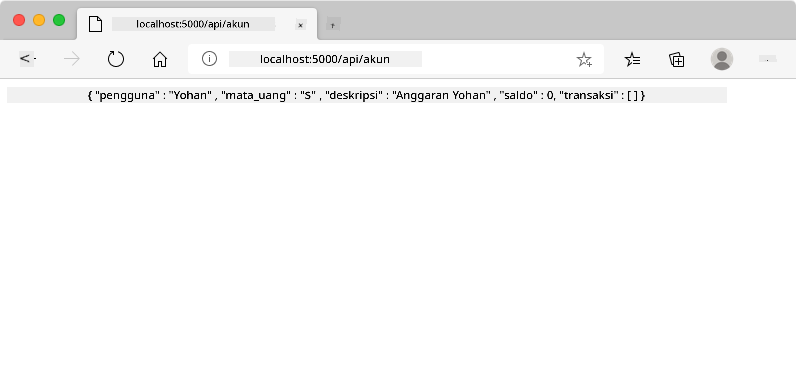
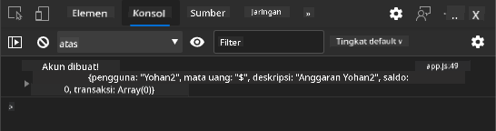
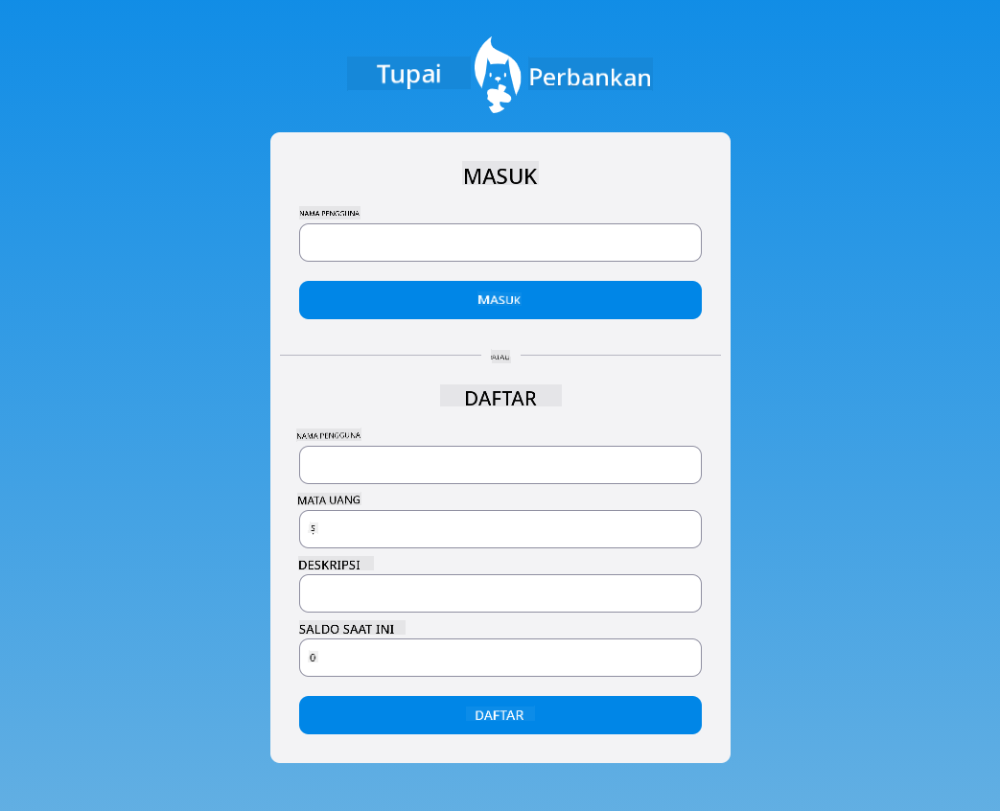

<!--
CO_OP_TRANSLATOR_METADATA:
{
  "original_hash": "b667b7d601e2ee19acb5aa9d102dc9f3",
  "translation_date": "2025-08-27T22:06:36+00:00",
  "source_file": "7-bank-project/2-forms/README.md",
  "language_code": "id"
}
-->
# Membangun Aplikasi Perbankan Bagian 2: Membuat Formulir Login dan Registrasi

## Kuis Pra-Pelajaran

[Kuis pra-pelajaran](https://ashy-river-0debb7803.1.azurestaticapps.net/quiz/43)

### Pendahuluan

Hampir semua aplikasi web modern memungkinkan Anda membuat akun untuk memiliki ruang pribadi. Karena banyak pengguna dapat mengakses aplikasi web secara bersamaan, Anda memerlukan mekanisme untuk menyimpan data pribadi setiap pengguna secara terpisah dan memilih informasi mana yang akan ditampilkan. Kita tidak akan membahas cara mengelola [identitas pengguna secara aman](https://en.wikipedia.org/wiki/Authentication) karena itu adalah topik yang sangat luas, tetapi kita akan memastikan setiap pengguna dapat membuat satu (atau lebih) akun bank di aplikasi kita.

Pada bagian ini, kita akan menggunakan formulir HTML untuk menambahkan fitur login dan registrasi ke aplikasi web kita. Kita akan melihat cara mengirim data ke server API secara programatis, dan akhirnya mendefinisikan aturan validasi dasar untuk input pengguna.

### Prasyarat

Anda perlu menyelesaikan [template HTML dan routing](../1-template-route/README.md) dari aplikasi web untuk pelajaran ini. Anda juga perlu menginstal [Node.js](https://nodejs.org) dan [menjalankan server API](../api/README.md) secara lokal sehingga Anda dapat mengirim data untuk membuat akun.

**Catatan Penting**  
Anda akan memiliki dua terminal yang berjalan secara bersamaan seperti yang tercantum di bawah ini:  
1. Untuk aplikasi bank utama yang kita bangun dalam pelajaran [template HTML dan routing](../1-template-route/README.md).  
2. Untuk [server API aplikasi bank](../api/README.md) yang baru saja kita siapkan di atas.  

Anda memerlukan kedua server tersebut berjalan untuk mengikuti pelajaran ini. Mereka mendengarkan di port yang berbeda (port `3000` dan port `5000`) sehingga semuanya harus berjalan dengan baik.

Anda dapat menguji apakah server berjalan dengan benar dengan menjalankan perintah ini di terminal:

```sh
curl http://localhost:5000/api
# -> should return "Bank API v1.0.0" as a result
```

---

## Formulir dan Kontrol

Elemen `<form>` mencakup bagian dari dokumen HTML di mana pengguna dapat memasukkan dan mengirimkan data dengan kontrol interaktif. Ada berbagai jenis kontrol antarmuka pengguna (UI) yang dapat digunakan dalam formulir, yang paling umum adalah elemen `<input>` dan `<button>`.

Ada banyak [jenis](https://developer.mozilla.org/docs/Web/HTML/Element/input) `<input>` yang berbeda, misalnya untuk membuat bidang di mana pengguna dapat memasukkan nama pengguna, Anda dapat menggunakan:

```html
<input id="username" name="username" type="text">
```

Atribut `name` akan digunakan sebagai nama properti saat data formulir dikirimkan. Atribut `id` digunakan untuk mengaitkan `<label>` dengan kontrol formulir.

> Lihat daftar lengkap [jenis `<input>`](https://developer.mozilla.org/docs/Web/HTML/Element/input) dan [kontrol formulir lainnya](https://developer.mozilla.org/docs/Learn/Forms/Other_form_controls) untuk mendapatkan gambaran tentang semua elemen UI bawaan yang dapat Anda gunakan saat membangun UI Anda.

✅ Perhatikan bahwa `<input>` adalah [elemen kosong](https://developer.mozilla.org/docs/Glossary/Empty_element) yang sebaiknya *tidak* ditambahkan tag penutup yang cocok. Namun, Anda dapat menggunakan notasi penutup sendiri `<input/>`, tetapi itu tidak wajib.

Elemen `<button>` dalam formulir memiliki sedikit keistimewaan. Jika Anda tidak menentukan atribut `type`, secara otomatis tombol akan mengirimkan data formulir ke server saat ditekan. Berikut adalah nilai `type` yang mungkin:

- `submit`: Default dalam `<form>`, tombol memicu aksi pengiriman formulir.
- `reset`: Tombol mengatur ulang semua kontrol formulir ke nilai awalnya.
- `button`: Tidak menetapkan perilaku default saat tombol ditekan. Anda dapat menetapkan aksi khusus menggunakan JavaScript.

### Tugas

Mari kita mulai dengan menambahkan formulir ke template `login`. Kita akan membutuhkan bidang *username* dan tombol *Login*.

```html
<template id="login">
  <h1>Bank App</h1>
  <section>
    <h2>Login</h2>
    <form id="loginForm">
      <label for="username">Username</label>
      <input id="username" name="user" type="text">
      <button>Login</button>
    </form>
  </section>
</template>
```

Jika Anda melihat lebih dekat, Anda dapat melihat bahwa kita juga menambahkan elemen `<label>` di sini. Elemen `<label>` digunakan untuk menambahkan nama ke kontrol UI, seperti bidang nama pengguna kita. Label penting untuk keterbacaan formulir Anda, tetapi juga memiliki manfaat tambahan:

- Dengan mengaitkan label ke kontrol formulir, ini membantu pengguna yang menggunakan teknologi bantu (seperti pembaca layar) untuk memahami data apa yang diharapkan mereka berikan.
- Anda dapat mengklik label untuk langsung memfokuskan kontrol input yang terkait, membuatnya lebih mudah dijangkau pada perangkat berbasis layar sentuh.

> [Aksesibilitas](https://developer.mozilla.org/docs/Learn/Accessibility/What_is_accessibility) di web adalah topik yang sangat penting yang sering diabaikan. Berkat [elemen HTML semantik](https://developer.mozilla.org/docs/Learn/Accessibility/HTML), tidak sulit untuk membuat konten yang dapat diakses jika Anda menggunakannya dengan benar. Anda dapat [membaca lebih lanjut tentang aksesibilitas](https://developer.mozilla.org/docs/Web/Accessibility) untuk menghindari kesalahan umum dan menjadi pengembang yang bertanggung jawab.

Sekarang kita akan menambahkan formulir kedua untuk registrasi, tepat di bawah formulir sebelumnya:

```html
<hr/>
<h2>Register</h2>
<form id="registerForm">
  <label for="user">Username</label>
  <input id="user" name="user" type="text">
  <label for="currency">Currency</label>
  <input id="currency" name="currency" type="text" value="$">
  <label for="description">Description</label>
  <input id="description" name="description" type="text">
  <label for="balance">Current balance</label>
  <input id="balance" name="balance" type="number" value="0">
  <button>Register</button>
</form>
```

Dengan menggunakan atribut `value`, kita dapat mendefinisikan nilai default untuk input tertentu.  
Perhatikan juga bahwa input untuk `balance` memiliki tipe `number`. Apakah terlihat berbeda dari input lainnya? Cobalah berinteraksi dengannya.

✅ Bisakah Anda menavigasi dan berinteraksi dengan formulir hanya menggunakan keyboard? Bagaimana cara melakukannya?

## Mengirimkan Data ke Server

Sekarang kita memiliki UI yang fungsional, langkah berikutnya adalah mengirimkan data ke server. Mari kita lakukan tes cepat menggunakan kode kita saat ini: apa yang terjadi jika Anda mengklik tombol *Login* atau *Register*?

Apakah Anda memperhatikan perubahan di bagian URL browser Anda?


Aksi default untuk `<form>` adalah mengirimkan formulir ke URL server saat ini menggunakan [metode GET](https://www.w3.org/Protocols/rfc2616/rfc2616-sec9.html#sec9.3), menambahkan data formulir langsung ke URL. Namun, metode ini memiliki beberapa kekurangan:

- Data yang dikirim sangat terbatas ukurannya (sekitar 2000 karakter).
- Data terlihat langsung di URL (tidak ideal untuk kata sandi).
- Tidak berfungsi untuk unggahan file.

Itulah mengapa Anda dapat mengubahnya untuk menggunakan [metode POST](https://www.w3.org/Protocols/rfc2616/rfc2616-sec9.html#sec9.5) yang mengirimkan data formulir ke server dalam body permintaan HTTP, tanpa batasan sebelumnya.

> Meskipun POST adalah metode yang paling umum digunakan untuk mengirimkan data, [dalam beberapa skenario tertentu](https://www.w3.org/2001/tag/doc/whenToUseGet.html) lebih baik menggunakan metode GET, misalnya saat mengimplementasikan bidang pencarian.

### Tugas

Tambahkan properti `action` dan `method` ke formulir registrasi:

```html
<form id="registerForm" action="//localhost:5000/api/accounts" method="POST">
```

Sekarang coba daftarkan akun baru dengan nama Anda. Setelah mengklik tombol *Register*, Anda seharusnya melihat sesuatu seperti ini:



Jika semuanya berjalan dengan baik, server akan menjawab permintaan Anda dengan respons [JSON](https://www.json.org/json-en.html) yang berisi data akun yang dibuat.

✅ Coba daftarkan lagi dengan nama yang sama. Apa yang terjadi?

## Mengirimkan Data Tanpa Memuat Ulang Halaman

Seperti yang mungkin Anda perhatikan, ada sedikit masalah dengan pendekatan yang baru saja kita gunakan: saat mengirimkan formulir, kita keluar dari aplikasi kita dan browser mengarahkan ke URL server. Kita mencoba menghindari semua pemuatan ulang halaman dengan aplikasi web kita, karena kita sedang membuat [Aplikasi Halaman Tunggal (SPA)](https://en.wikipedia.org/wiki/Single-page_application).

Untuk mengirimkan data formulir ke server tanpa memaksa pemuatan ulang halaman, kita harus menggunakan kode JavaScript. Alih-alih meletakkan URL di properti `action` elemen `<form>`, Anda dapat menggunakan kode JavaScript apa pun yang diawali dengan string `javascript:` untuk melakukan aksi khusus. Menggunakan ini juga berarti Anda harus mengimplementasikan beberapa tugas yang sebelumnya dilakukan secara otomatis oleh browser:

- Mengambil data formulir.
- Mengonversi dan mengkodekan data formulir ke format yang sesuai.
- Membuat permintaan HTTP dan mengirimkannya ke server.

### Tugas

Ganti `action` formulir registrasi dengan:

```html
<form id="registerForm" action="javascript:register()">
```

Buka `app.js` dan tambahkan fungsi baru bernama `register`:

```js
function register() {
  const registerForm = document.getElementById('registerForm');
  const formData = new FormData(registerForm);
  const data = Object.fromEntries(formData);
  const jsonData = JSON.stringify(data);
}
```

Di sini kita mengambil elemen formulir menggunakan `getElementById()` dan menggunakan pembantu [`FormData`](https://developer.mozilla.org/docs/Web/API/FormData) untuk mengekstrak nilai dari kontrol formulir sebagai pasangan key/value. Kemudian kita mengonversi data menjadi objek biasa menggunakan [`Object.fromEntries()`](https://developer.mozilla.org/docs/Web/JavaScript/Reference/Global_Objects/Object/fromEntries) dan akhirnya menyerialkan data ke [JSON](https://www.json.org/json-en.html), format yang umum digunakan untuk pertukaran data di web.

Data sekarang siap untuk dikirim ke server. Buat fungsi baru bernama `createAccount`:

```js
async function createAccount(account) {
  try {
    const response = await fetch('//localhost:5000/api/accounts', {
      method: 'POST',
      headers: { 'Content-Type': 'application/json' },
      body: account
    });
    return await response.json();
  } catch (error) {
    return { error: error.message || 'Unknown error' };
  }
}
```

Apa yang dilakukan fungsi ini? Pertama, perhatikan kata kunci `async` di sini. Ini berarti bahwa fungsi berisi kode yang akan dieksekusi [**secara asinkron**](https://developer.mozilla.org/docs/Web/JavaScript/Reference/Statements/async_function). Saat digunakan bersama kata kunci `await`, ini memungkinkan menunggu kode asinkron untuk dieksekusi - seperti menunggu respons server di sini - sebelum melanjutkan.

Berikut video singkat tentang penggunaan `async/await`:

[](https://youtube.com/watch?v=YwmlRkrxvkk "Async dan Await untuk mengelola janji")

> 🎥 Klik gambar di atas untuk video tentang async/await.

Kita menggunakan API `fetch()` untuk mengirimkan data JSON ke server. Metode ini membutuhkan 2 parameter:

- URL server, jadi kita meletakkan kembali `//localhost:5000/api/accounts` di sini.
- Pengaturan permintaan. Di sinilah kita menetapkan metode ke `POST` dan menyediakan `body` untuk permintaan. Karena kita mengirimkan data JSON ke server, kita juga perlu menetapkan header `Content-Type` ke `application/json` sehingga server tahu cara menginterpretasikan konten.

Karena server akan merespons permintaan dengan JSON, kita dapat menggunakan `await response.json()` untuk mem-parsing konten JSON dan mengembalikan objek yang dihasilkan. Perhatikan bahwa metode ini bersifat asinkron, jadi kita menggunakan kata kunci `await` di sini sebelum mengembalikan untuk memastikan kesalahan selama parsing juga tertangkap.

Sekarang tambahkan beberapa kode ke fungsi `register` untuk memanggil `createAccount()`:

```js
const result = await createAccount(jsonData);
```

Karena kita menggunakan kata kunci `await` di sini, kita perlu menambahkan kata kunci `async` sebelum fungsi register:

```js
async function register() {
```

Akhirnya, tambahkan beberapa log untuk memeriksa hasilnya. Fungsi akhir seharusnya terlihat seperti ini:

```js
async function register() {
  const registerForm = document.getElementById('registerForm');
  const formData = new FormData(registerForm);
  const jsonData = JSON.stringify(Object.fromEntries(formData));
  const result = await createAccount(jsonData);

  if (result.error) {
    return console.log('An error occurred:', result.error);
  }

  console.log('Account created!', result);
}
```

Itu cukup panjang tetapi kita berhasil! Jika Anda membuka [alat pengembang browser](https://developer.mozilla.org/docs/Learn/Common_questions/What_are_browser_developer_tools), dan mencoba mendaftarkan akun baru, Anda seharusnya tidak melihat perubahan apa pun pada halaman web tetapi pesan akan muncul di konsol yang mengonfirmasi bahwa semuanya berfungsi.



✅ Apakah menurut Anda data dikirim ke server dengan aman? Bagaimana jika seseorang dapat mencegat permintaan tersebut? Anda dapat membaca tentang [HTTPS](https://en.wikipedia.org/wiki/HTTPS) untuk mengetahui lebih lanjut tentang komunikasi data yang aman.

## Validasi Data

Jika Anda mencoba mendaftarkan akun baru tanpa mengatur nama pengguna terlebih dahulu, Anda dapat melihat bahwa server mengembalikan kesalahan dengan kode status [400 (Permintaan Buruk)](https://developer.mozilla.org/docs/Web/HTTP/Status/400#:~:text=The%20HyperText%20Transfer%20Protocol%20(HTTP,%2C%20or%20deceptive%20request%20routing).).

Sebelum mengirimkan data ke server, adalah praktik yang baik untuk [memvalidasi data formulir](https://developer.mozilla.org/docs/Learn/Forms/Form_validation) terlebih dahulu jika memungkinkan, untuk memastikan Anda mengirimkan permintaan yang valid. Kontrol formulir HTML5 menyediakan validasi bawaan menggunakan berbagai atribut:

- `required`: bidang harus diisi, jika tidak formulir tidak dapat dikirimkan.
- `minlength` dan `maxlength`: mendefinisikan jumlah karakter minimum dan maksimum dalam bidang teks.
- `min` dan `max`: mendefinisikan nilai minimum dan maksimum dari bidang numerik.
- `type`: mendefinisikan jenis data yang diharapkan, seperti `number`, `email`, `file`, atau [jenis bawaan lainnya](https://developer.mozilla.org/docs/Web/HTML/Element/input). Atribut ini juga dapat mengubah tampilan visual kontrol formulir.
- `pattern`: memungkinkan untuk mendefinisikan pola [ekspresi reguler](https://developer.mozilla.org/docs/Web/JavaScript/Guide/Regular_Expressions) untuk menguji apakah data yang dimasukkan valid atau tidak.
> Tip: Anda dapat menyesuaikan tampilan kontrol formulir Anda tergantung apakah mereka valid atau tidak dengan menggunakan pseudo-kelas CSS `:valid` dan `:invalid`.
### Tugas

Ada 2 kolom yang wajib diisi untuk membuat akun baru yang valid, yaitu nama pengguna dan mata uang, sementara kolom lainnya bersifat opsional. Perbarui HTML formulir dengan menggunakan atribut `required` dan teks pada label kolom agar:

```html
<label for="user">Username (required)</label>
<input id="user" name="user" type="text" required>
...
<label for="currency">Currency (required)</label>
<input id="currency" name="currency" type="text" value="$" required>
```

Meskipun implementasi server ini tidak menerapkan batasan spesifik pada panjang maksimum kolom, selalu merupakan praktik yang baik untuk menetapkan batasan yang masuk akal untuk setiap entri teks pengguna.

Tambahkan atribut `maxlength` pada kolom teks:

```html
<input id="user" name="user" type="text" maxlength="20" required>
...
<input id="currency" name="currency" type="text" value="$" maxlength="5" required>
...
<input id="description" name="description" type="text" maxlength="100">
```

Sekarang, jika Anda menekan tombol *Register* dan ada kolom yang tidak memenuhi aturan validasi yang telah kita tentukan, Anda akan melihat sesuatu seperti ini:


Validasi seperti ini yang dilakukan *sebelum* mengirimkan data ke server disebut **validasi sisi klien**. Namun, perlu dicatat bahwa tidak selalu memungkinkan untuk melakukan semua pemeriksaan tanpa mengirimkan data. Sebagai contoh, kita tidak dapat memeriksa di sini apakah akun dengan nama pengguna yang sama sudah ada tanpa mengirimkan permintaan ke server. Validasi tambahan yang dilakukan di server disebut **validasi sisi server**.

Biasanya, keduanya perlu diimplementasikan. Meskipun validasi sisi klien meningkatkan pengalaman pengguna dengan memberikan umpan balik instan, validasi sisi server sangat penting untuk memastikan bahwa data pengguna yang Anda proses aman dan valid.

---

## 🚀 Tantangan

Tampilkan pesan kesalahan di HTML jika pengguna sudah ada.

Berikut adalah contoh tampilan halaman login setelah ditambahkan sedikit gaya:



## Kuis Pasca-Pelajaran

[Kuis pasca-pelajaran](https://ashy-river-0debb7803.1.azurestaticapps.net/quiz/44)

## Tinjauan & Studi Mandiri

Para pengembang telah menjadi sangat kreatif dalam upaya mereka membangun formulir, terutama terkait strategi validasi. Pelajari berbagai alur formulir dengan melihat [CodePen](https://codepen.com); bisakah Anda menemukan beberapa formulir yang menarik dan menginspirasi?

## Tugas

[Tambahkan gaya pada aplikasi bank Anda](assignment.md)

---

**Penafian**:  
Dokumen ini telah diterjemahkan menggunakan layanan penerjemahan AI [Co-op Translator](https://github.com/Azure/co-op-translator). Meskipun kami berusaha untuk memberikan hasil yang akurat, harap diingat bahwa terjemahan otomatis mungkin mengandung kesalahan atau ketidakakuratan. Dokumen asli dalam bahasa aslinya harus dianggap sebagai sumber yang otoritatif. Untuk informasi yang bersifat kritis, disarankan menggunakan jasa penerjemahan profesional oleh manusia. Kami tidak bertanggung jawab atas kesalahpahaman atau penafsiran yang keliru yang timbul dari penggunaan terjemahan ini.