<!--
CO_OP_TRANSLATOR_METADATA:
{
  "original_hash": "86ee5069f27ea3151389d8687c95fac9",
  "translation_date": "2025-11-06T11:50:49+00:00",
  "source_file": "7-bank-project/3-data/README.md",
  "language_code": "id"
}
-->
# Membangun Aplikasi Perbankan Bagian 3: Metode Mengambil dan Menggunakan Data

Bayangkan komputer Enterprise di Star Trek - ketika Kapten Picard meminta status kapal, informasi muncul seketika tanpa seluruh antarmuka mati dan dibangun ulang. Aliran informasi yang mulus itulah yang sedang kita bangun di sini dengan pengambilan data yang dinamis.

Saat ini, aplikasi perbankan Anda seperti koran cetak - informatif tetapi statis. Kita akan mengubahnya menjadi sesuatu yang lebih mirip pusat kendali di NASA, di mana data mengalir terus-menerus dan diperbarui secara real-time tanpa mengganggu alur kerja pengguna.

Anda akan belajar cara berkomunikasi dengan server secara asinkron, menangani data yang tiba di waktu berbeda, dan mengubah informasi mentah menjadi sesuatu yang bermakna bagi pengguna Anda. Ini adalah perbedaan antara demo dan perangkat lunak yang siap produksi.

## ⚡ Apa yang Bisa Anda Lakukan dalam 5 Menit Berikutnya

**Jalur Cepat untuk Pengembang Sibuk**

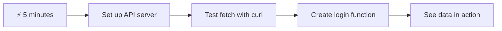

- **Menit 1-2**: Mulai server API Anda (`cd api && npm start`) dan uji koneksi
- **Menit 3**: Buat fungsi dasar `getAccount()` menggunakan fetch
- **Menit 4**: Hubungkan formulir login dengan `action="javascript:login()"`
- **Menit 5**: Uji login dan lihat data akun muncul di konsol

**Perintah Uji Cepat**:
```bash
# Verify API is running
curl http://localhost:5000/api

# Test account data fetch
curl http://localhost:5000/api/accounts/test
```

**Mengapa Ini Penting**: Dalam 5 menit, Anda akan melihat keajaiban pengambilan data asinkron yang mendukung setiap aplikasi web modern. Ini adalah fondasi yang membuat aplikasi terasa responsif dan hidup.

## 🗺️ Perjalanan Belajar Anda Melalui Aplikasi Web Berbasis Data

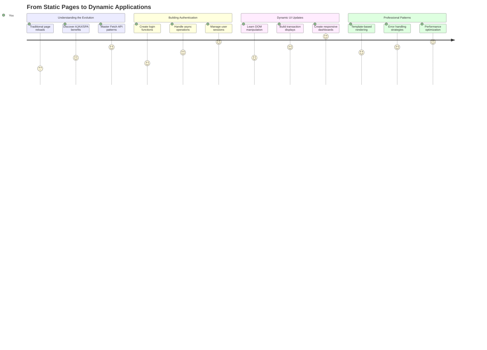

**Tujuan Perjalanan Anda**: Pada akhir pelajaran ini, Anda akan memahami bagaimana aplikasi web modern mengambil, memproses, dan menampilkan data secara dinamis, menciptakan pengalaman pengguna yang mulus seperti yang kita harapkan dari aplikasi profesional.

## Kuis Pra-Pelajaran

[Kuis pra-pelajaran](https://ff-quizzes.netlify.app/web/quiz/45)

### Prasyarat

Sebelum mendalami pengambilan data, pastikan Anda memiliki komponen berikut:

- **Pelajaran Sebelumnya**: Selesaikan [Formulir Login dan Registrasi](../2-forms/README.md) - kita akan membangun di atas dasar ini
- **Server Lokal**: Instal [Node.js](https://nodejs.org) dan [jalankan server API](../api/README.md) untuk menyediakan data akun
- **Koneksi API**: Uji koneksi server Anda dengan perintah ini:

```bash
curl http://localhost:5000/api
# Expected response: "Bank API v1.0.0"
```

Tes cepat ini memastikan semua komponen berkomunikasi dengan baik:
- Memverifikasi bahwa Node.js berjalan dengan benar di sistem Anda
- Mengonfirmasi server API Anda aktif dan merespons
- Memvalidasi bahwa aplikasi Anda dapat mencapai server (seperti memeriksa kontak radio sebelum misi)

## 🧠 Gambaran Ekosistem Pengelolaan Data

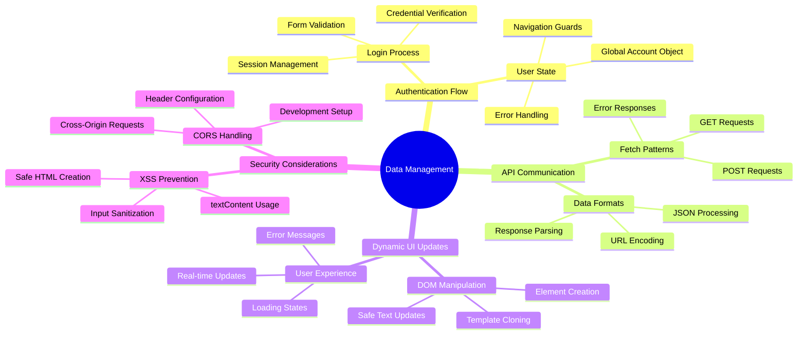

**Prinsip Utama**: Aplikasi web modern adalah sistem orkestrasi data - mereka mengoordinasikan antara antarmuka pengguna, API server, dan model keamanan browser untuk menciptakan pengalaman yang mulus dan responsif.

---

## Memahami Pengambilan Data dalam Aplikasi Web Modern

Cara aplikasi web menangani data telah berkembang pesat selama dua dekade terakhir. Memahami evolusi ini akan membantu Anda menghargai mengapa teknik modern seperti AJAX dan Fetch API sangat kuat dan mengapa mereka menjadi alat penting bagi pengembang web.

Mari kita jelajahi bagaimana situs web tradisional bekerja dibandingkan dengan aplikasi yang dinamis dan responsif yang kita bangun hari ini.

### Aplikasi Multi-Halaman Tradisional (MPA)

Di masa awal web, setiap klik seperti mengganti saluran di televisi lama - layar akan kosong, lalu perlahan menampilkan konten baru. Inilah kenyataan aplikasi web awal, di mana setiap interaksi berarti membangun ulang seluruh halaman dari awal.

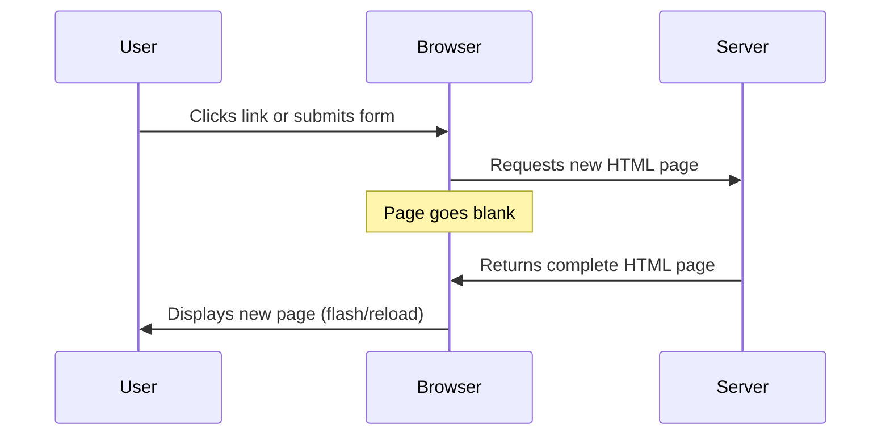

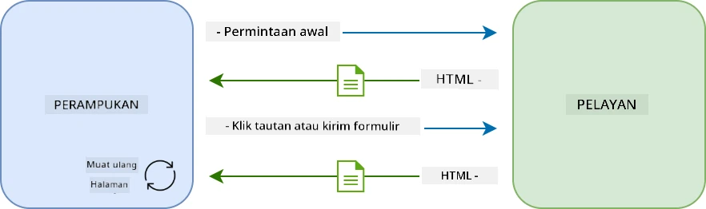

**Mengapa pendekatan ini terasa kaku:**
- Setiap klik berarti membangun ulang seluruh halaman dari awal
- Pengguna terganggu di tengah pikiran mereka oleh kilatan halaman yang mengganggu
- Koneksi internet Anda bekerja keras mengunduh header dan footer yang sama berulang kali
- Aplikasi terasa lebih seperti membuka lemari arsip daripada menggunakan perangkat lunak

### Aplikasi Satu Halaman Modern (SPA)

AJAX (Asynchronous JavaScript and XML) sepenuhnya mengubah paradigma ini. Seperti desain modular Stasiun Luar Angkasa Internasional, di mana astronot dapat mengganti komponen individual tanpa membangun ulang seluruh struktur, AJAX memungkinkan kita memperbarui bagian tertentu dari halaman web tanpa memuat ulang semuanya. Meskipun namanya menyebut XML, kita lebih sering menggunakan JSON hari ini, tetapi prinsip utamanya tetap: memperbarui hanya apa yang perlu diubah.

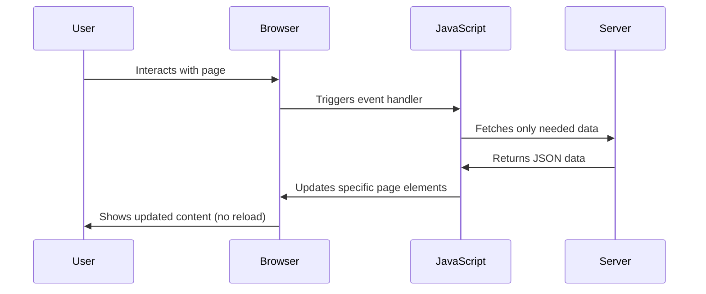

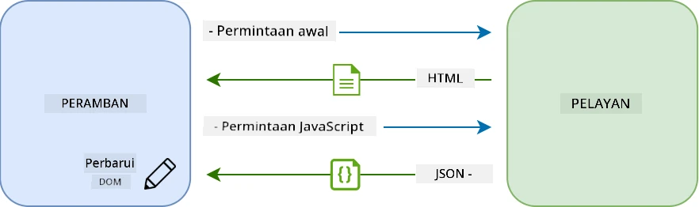

**Mengapa SPA terasa jauh lebih baik:**
- Hanya bagian yang benar-benar berubah yang diperbarui (cerdas, bukan?)
- Tidak ada gangguan yang mengganggu - pengguna Anda tetap fokus
- Data yang lebih sedikit yang dikirim berarti waktu pemuatan lebih cepat
- Semuanya terasa cepat dan responsif, seperti aplikasi di ponsel Anda

### Evolusi ke Fetch API Modern

Browser modern menyediakan [`Fetch` API](https://developer.mozilla.org/docs/Web/API/Fetch_API), yang menggantikan [`XMLHttpRequest`](https://developer.mozilla.org/docs/Web/API/XMLHttpRequest/Using_XMLHttpRequest) yang lebih lama. Seperti perbedaan antara mengoperasikan telegraf dan menggunakan email, Fetch API menggunakan promises untuk kode asinkron yang lebih bersih dan menangani JSON secara alami.

| Fitur | XMLHttpRequest | Fetch API |
|-------|----------------|-----------|
| **Sintaks** | Berbasis callback yang kompleks | Berbasis promise yang bersih |
| **Penanganan JSON** | Memerlukan parsing manual | Metode bawaan `.json()` |
| **Penanganan Error** | Informasi error terbatas | Detail error yang komprehensif |
| **Dukungan Modern** | Kompatibilitas legacy | ES6+ promises dan async/await |

> 💡 **Kompatibilitas Browser**: Kabar baik - Fetch API bekerja di semua browser modern! Jika Anda penasaran tentang versi spesifik, [caniuse.com](https://caniuse.com/fetch) memiliki cerita kompatibilitas lengkap.
> 
**Intinya:**
- Bekerja dengan baik di Chrome, Firefox, Safari, dan Edge (pada dasarnya di mana pun pengguna Anda berada)
- Hanya Internet Explorer yang membutuhkan bantuan ekstra (dan jujur saja, sudah saatnya kita meninggalkan IE)
- Menyiapkan Anda dengan sempurna untuk pola async/await yang elegan yang akan kita gunakan nanti

### Mengimplementasikan Login Pengguna dan Pengambilan Data

Sekarang mari kita implementasikan sistem login yang mengubah aplikasi perbankan Anda dari tampilan statis menjadi aplikasi fungsional. Seperti protokol autentikasi yang digunakan di fasilitas militer yang aman, kita akan memverifikasi kredensial pengguna dan kemudian memberikan akses ke data spesifik mereka.

Kita akan membangun ini secara bertahap, dimulai dengan autentikasi dasar dan kemudian menambahkan kemampuan pengambilan data.

#### Langkah 1: Membuat Dasar Fungsi Login

Buka file `app.js` Anda dan tambahkan fungsi `login` baru. Fungsi ini akan menangani proses autentikasi pengguna:

```javascript
async function login() {
  const loginForm = document.getElementById('loginForm');
  const user = loginForm.user.value;
}
```

**Mari kita uraikan:**
- Kata kunci `async`? Itu memberi tahu JavaScript "hei, fungsi ini mungkin perlu menunggu sesuatu"
- Kita mengambil formulir dari halaman (tidak ada yang mewah, hanya menemukannya berdasarkan ID-nya)
- Lalu kita mengambil apa pun yang diketik pengguna sebagai nama pengguna mereka
- Ini trik yang rapi: Anda dapat mengakses input formulir apa pun dengan atribut `name` - tidak perlu panggilan getElementById tambahan!

> 💡 **Pola Akses Formulir**: Setiap kontrol formulir dapat diakses berdasarkan nama (diatur dalam HTML menggunakan atribut `name`) sebagai properti elemen formulir. Ini memberikan cara yang bersih dan mudah dibaca untuk mendapatkan data formulir.

#### Langkah 2: Membuat Fungsi Pengambilan Data Akun

Selanjutnya, kita akan membuat fungsi khusus untuk mengambil data akun dari server. Ini mengikuti pola yang sama seperti fungsi registrasi Anda tetapi berfokus pada pengambilan data:

```javascript
async function getAccount(user) {
  try {
    const response = await fetch('//localhost:5000/api/accounts/' + encodeURIComponent(user));
    return await response.json();
  } catch (error) {
    return { error: error.message || 'Unknown error' };
  }
}
```

**Inilah yang dicapai oleh kode ini:**
- **Menggunakan** API `fetch` modern untuk meminta data secara asinkron
- **Membangun** URL permintaan GET dengan parameter nama pengguna
- **Menerapkan** `encodeURIComponent()` untuk menangani karakter khusus dalam URL dengan aman
- **Mengonversi** respons ke format JSON untuk manipulasi data yang mudah
- **Menangani** error dengan baik dengan mengembalikan objek error daripada crash

> ⚠️ **Catatan Keamanan**: Fungsi `encodeURIComponent()` menangani karakter khusus dalam URL. Seperti sistem pengkodean dalam komunikasi angkatan laut, ini memastikan pesan Anda tiba persis seperti yang dimaksudkan, mencegah karakter seperti "#" atau "&" disalahartikan.
> 
**Mengapa ini penting:**
- Mencegah karakter khusus merusak URL
- Melindungi dari serangan manipulasi URL
- Memastikan server Anda menerima data yang dimaksudkan
- Mengikuti praktik pengkodean yang aman

#### Memahami Permintaan HTTP GET

Ada sesuatu yang mungkin mengejutkan Anda: ketika Anda menggunakan `fetch` tanpa opsi tambahan, itu secara otomatis membuat permintaan [`GET`](https://developer.mozilla.org/docs/Web/HTTP/Methods/GET). Ini sempurna untuk apa yang kita lakukan - meminta server "hei, bisakah saya melihat data akun pengguna ini?"

Pikirkan permintaan GET seperti meminta untuk meminjam buku dari perpustakaan - Anda meminta untuk melihat sesuatu yang sudah ada. Permintaan POST (yang kita gunakan untuk registrasi) lebih seperti menyerahkan buku baru untuk ditambahkan ke koleksi.

| Permintaan GET | Permintaan POST |
|----------------|-----------------|
| **Tujuan** | Mengambil data yang ada | Mengirim data baru ke server |
| **Parameter** | Dalam path/query string URL | Dalam body permintaan |
| **Caching** | Dapat di-cache oleh browser | Tidak biasanya di-cache |
| **Keamanan** | Terlihat di URL/log | Tersembunyi di body permintaan |

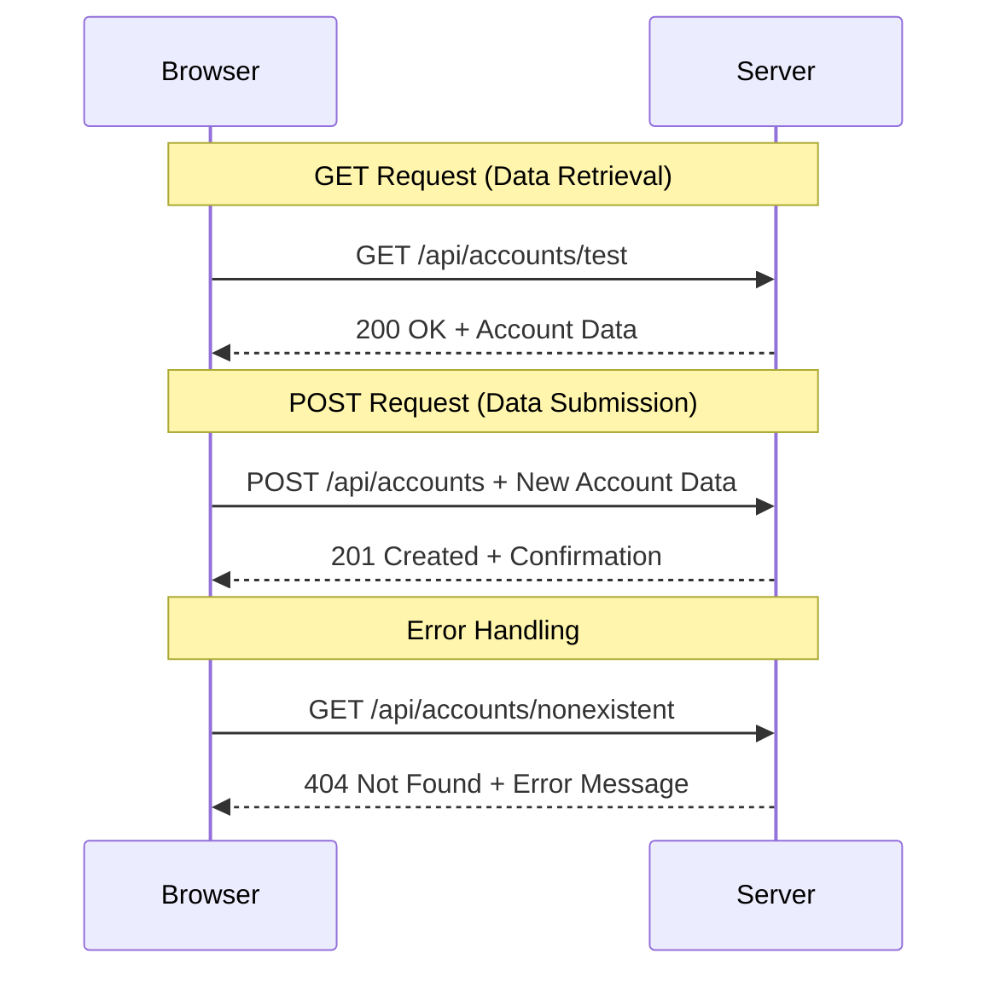

#### Langkah 3: Menggabungkan Semuanya

Sekarang bagian yang memuaskan - mari kita hubungkan fungsi pengambilan data akun Anda ke proses login. Di sinilah semuanya klik:

```javascript
async function login() {
  const loginForm = document.getElementById('loginForm');
  const user = loginForm.user.value;
  const data = await getAccount(user);

  if (data.error) {
    return console.log('loginError', data.error);
  }

  account = data;
  navigate('/dashboard');
}
```

Fungsi ini mengikuti urutan yang jelas:
- Mengambil nama pengguna dari input formulir
- Meminta data akun pengguna dari server
- Menangani error yang terjadi selama proses
- Menyimpan data akun dan menavigasi ke dashboard setelah berhasil

> 🎯 **Pola Async/Await**: Karena `getAccount` adalah fungsi asinkron, kita menggunakan kata kunci `await` untuk menghentikan eksekusi hingga server merespons. Ini mencegah kode melanjutkan dengan data yang tidak terdefinisi.

#### Langkah 4: Membuat Tempat untuk Data Anda

Aplikasi Anda membutuhkan tempat untuk mengingat informasi akun setelah dimuat. Pikirkan ini seperti memori jangka pendek aplikasi Anda - tempat untuk menyimpan data pengguna saat ini. Tambahkan baris ini di bagian atas file `app.js` Anda:

```javascript
// This holds the current user's account data
let account = null;
```

**Mengapa kita membutuhkan ini:**
- Menyimpan data akun agar dapat diakses dari mana saja di aplikasi Anda
- Memulai dengan `null` berarti "belum ada yang login"
- Diperbarui saat seseorang berhasil login atau registrasi
- Bertindak seperti sumber kebenaran tunggal - tidak ada kebingungan tentang siapa yang login

#### Langkah 5: Hubungkan Formulir Anda

Sekarang mari kita hubungkan fungsi login baru Anda ke formulir HTML Anda. Perbarui tag formulir Anda seperti ini:

```html
<form id="loginForm" action="javascript:login()">
  <!-- Your existing form inputs -->
</form>
```

**Apa yang dilakukan perubahan kecil ini:**
- Menghentikan formulir dari melakukan perilaku default "memuat ulang seluruh halaman"
- Memanggil fungsi JavaScript kustom Anda sebagai gantinya
- Menjaga semuanya tetap mulus dan seperti aplikasi satu halaman
- Memberikan Anda kontrol penuh atas apa yang terjadi saat pengguna menekan "Login"

#### Langkah 6: Tingkatkan Fungsi Registrasi Anda

Untuk konsistensi, perbarui fungsi `register` Anda agar juga menyimpan data akun dan menavigasi ke dashboard:

```javascript
// Add these lines at the end of your register function
account = result;
navigate('/dashboard');
```

**Peningkatan ini memberikan:**
- **Transisi mulus** dari registrasi ke dashboard
- **Pengalaman pengguna yang konsisten** antara alur login dan registrasi
- **Akses langsung** ke data akun setelah registrasi berhasil

#### Menguji Implementasi Anda

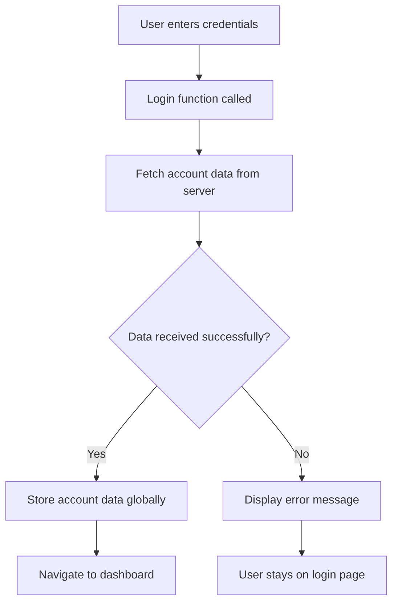

**Saatnya mencoba:**
1. Buat akun baru untuk memastikan semuanya berfungsi
2. Coba login dengan kredensial yang sama
3. Lihat konsol browser Anda (F12) jika ada yang tidak beres
4. Pastikan Anda mendarat di dashboard setelah login berhasil

Jika ada yang tidak berfungsi, jangan panik! Sebagian besar masalah adalah perbaikan sederhana seperti kesalahan ketik atau lupa memulai server API.

#### Sepatah Kata Tentang Keajaiban Cross-Origin

Anda mungkin bertanya-tanya: "Bagaimana aplikasi web saya berbicara dengan server API ini saat mereka berjalan di port yang berbeda?" Pertanyaan bagus! Ini menyentuh sesuatu yang setiap pengembang web temui pada akhirnya.

> 🔒 **Keamanan Cross-Origin**: Browser menerapkan "same-origin policy" untuk mencegah komunikasi tidak sah antara domain yang berbeda. Seperti sistem checkpoint di Pentagon, mereka memverifikasi bahwa komunikasi diizinkan sebelum memungkinkan transfer data.
> 
**Dalam pengaturan kita:**
- Aplikasi web Anda berjalan di `localhost:3000` (server pengembangan)
- Server API Anda berjalan di `localhost:5000` (server backend)
- Server API menyertakan header [CORS](https://developer.mozilla.org/docs/Web/HTTP/CORS) yang secara eksplisit mengizinkan komunikasi dari aplikasi web Anda

Konfigurasi ini mencerminkan pengembangan dunia nyata di mana aplikasi frontend dan backend biasanya berjalan di server terpisah.

> 📚 **Pelajari Lebih Lanjut**: Jelajahi lebih dalam tentang API dan pengambilan data dengan modul [Microsoft Learn tentang API](https://docs.microsoft.com/learn/modules/use-apis-discover-museum-art/?WT.mc_id=academic-77807-sagibbon).

## Membawa Data Anda ke Kehidupan dalam HTML

Sekarang kita akan membuat data yang diambil terlihat oleh pengguna melalui manipulasi DOM. Seperti proses mengembangkan foto di ruang gelap, kita mengambil data yang tidak terlihat dan merendernya menjadi sesuatu yang dapat dilihat dan berinteraksi oleh pengguna.
Manipulasi DOM adalah teknik yang mengubah halaman web statis menjadi aplikasi dinamis yang memperbarui kontennya berdasarkan interaksi pengguna dan respons server.

### Memilih Alat yang Tepat untuk Tugas

Ketika ingin memperbarui HTML dengan JavaScript, Anda memiliki beberapa opsi. Anggap ini seperti berbagai alat dalam kotak perkakas - masing-masing sempurna untuk pekerjaan tertentu:

| Metode | Kegunaan terbaik | Kapan digunakan | Tingkat keamanan |
|--------|------------------|-----------------|------------------|
| `textContent` | Menampilkan data pengguna dengan aman | Kapan saja saat menampilkan teks | ✅ Sangat aman |
| `createElement()` + `append()` | Membuat tata letak yang kompleks | Membuat bagian/daftar baru | ✅ Sangat aman |
| `innerHTML` | Mengatur konten HTML | ⚠️ Sebisa mungkin hindari | ❌ Berisiko tinggi |

#### Cara Aman Menampilkan Teks: textContent

Properti [`textContent`](https://developer.mozilla.org/docs/Web/API/Node/textContent) adalah sahabat terbaik Anda saat menampilkan data pengguna. Ini seperti memiliki penjaga keamanan untuk halaman web Anda - tidak ada yang berbahaya yang bisa lolos:

```javascript
// The safe, reliable way to update text
const balanceElement = document.getElementById('balance');
balanceElement.textContent = account.balance;
```

**Keuntungan textContent:**
- Memperlakukan semuanya sebagai teks biasa (mencegah eksekusi skrip)
- Secara otomatis menghapus konten yang ada
- Efisien untuk pembaruan teks sederhana
- Memberikan keamanan bawaan terhadap konten berbahaya

#### Membuat Elemen HTML Dinamis

Untuk konten yang lebih kompleks, gabungkan [`document.createElement()`](https://developer.mozilla.org/docs/Web/API/Document/createElement) dengan metode [`append()`](https://developer.mozilla.org/docs/Web/API/ParentNode/append):

```javascript
// Safe way to create new elements
const transactionItem = document.createElement('div');
transactionItem.className = 'transaction-item';
transactionItem.textContent = `${transaction.date}: ${transaction.description}`;
container.append(transactionItem);
```

**Memahami pendekatan ini:**
- **Membuat** elemen DOM baru secara programatis
- **Mengontrol** atribut dan konten elemen sepenuhnya
- **Memungkinkan** struktur elemen yang kompleks dan bersarang
- **Menjaga** keamanan dengan memisahkan struktur dari konten

> ⚠️ **Pertimbangan Keamanan**: Meskipun [`innerHTML`](https://developer.mozilla.org/docs/Web/API/Element/innerHTML) sering muncul dalam tutorial, ini dapat mengeksekusi skrip yang disematkan. Seperti protokol keamanan di CERN yang mencegah eksekusi kode yang tidak sah, menggunakan `textContent` dan `createElement` memberikan alternatif yang lebih aman.

**Risiko innerHTML:**
- Menjalankan tag `<script>` dalam data pengguna
- Rentan terhadap serangan injeksi kode
- Menciptakan potensi kerentanan keamanan
- Alternatif yang lebih aman memberikan fungsi yang setara

### Membuat Kesalahan Lebih Ramah Pengguna

Saat ini, kesalahan login hanya muncul di konsol browser, yang tidak terlihat oleh pengguna. Seperti perbedaan antara diagnostik internal pilot dan sistem informasi penumpang, kita perlu menyampaikan informasi penting melalui saluran yang sesuai.

Menerapkan pesan kesalahan yang terlihat memberikan umpan balik langsung kepada pengguna tentang apa yang salah dan bagaimana melanjutkan.

#### Langkah 1: Tambahkan Tempat untuk Pesan Kesalahan

Pertama, mari kita berikan rumah untuk pesan kesalahan di HTML Anda. Tambahkan ini tepat sebelum tombol login agar pengguna dapat melihatnya secara alami:

```html
<!-- This is where error messages will appear -->
<div id="loginError" role="alert"></div>
<button>Login</button>
```

**Apa yang terjadi di sini:**
- Kami membuat wadah kosong yang tetap tidak terlihat sampai dibutuhkan
- Ini diposisikan di tempat pengguna biasanya melihat setelah mengklik "Login"
- `role="alert"` adalah sentuhan bagus untuk pembaca layar - ini memberi tahu teknologi bantu "hei, ini penting!"
- `id` unik memberikan target yang mudah untuk JavaScript kita

#### Langkah 2: Buat Fungsi Pembantu yang Praktis

Mari kita buat fungsi utilitas kecil yang dapat memperbarui teks elemen mana pun. Ini adalah salah satu fungsi "tulis sekali, gunakan di mana saja" yang akan menghemat waktu Anda:

```javascript
function updateElement(id, text) {
  const element = document.getElementById(id);
  element.textContent = text;
}
```

**Keuntungan fungsi:**
- Antarmuka sederhana yang hanya membutuhkan ID elemen dan konten teks
- Menemukan dan memperbarui elemen DOM dengan aman
- Pola yang dapat digunakan kembali yang mengurangi duplikasi kode
- Menjaga perilaku pembaruan yang konsisten di seluruh aplikasi

#### Langkah 3: Tampilkan Kesalahan di Tempat yang Dapat Dilihat Pengguna

Sekarang mari kita ganti pesan konsol yang tersembunyi dengan sesuatu yang benar-benar dapat dilihat pengguna. Perbarui fungsi login Anda:

```javascript
// Instead of just logging to console, show the user what's wrong
if (data.error) {
  return updateElement('loginError', data.error);
}
```

**Perubahan kecil ini membuat perbedaan besar:**
- Pesan kesalahan muncul tepat di tempat pengguna melihat
- Tidak ada lagi kegagalan diam yang misterius
- Pengguna mendapatkan umpan balik langsung yang dapat ditindaklanjuti
- Aplikasi Anda mulai terasa profesional dan penuh perhatian

Sekarang ketika Anda menguji dengan akun yang tidak valid, Anda akan melihat pesan kesalahan yang berguna langsung di halaman!


#### Langkah 4: Menjadi Inklusif dengan Aksesibilitas

Hal keren tentang `role="alert"` yang kita tambahkan sebelumnya - ini bukan hanya dekorasi! Atribut kecil ini menciptakan apa yang disebut [Live Region](https://developer.mozilla.org/docs/Web/Accessibility/ARIA/ARIA_Live_Regions) yang langsung mengumumkan perubahan ke pembaca layar:

```html
<div id="loginError" role="alert"></div>
```

**Mengapa ini penting:**
- Pengguna pembaca layar mendengar pesan kesalahan segera setelah muncul
- Semua orang mendapatkan informasi penting yang sama, terlepas dari cara mereka bernavigasi
- Ini adalah cara sederhana untuk membuat aplikasi Anda bekerja untuk lebih banyak orang
- Menunjukkan bahwa Anda peduli menciptakan pengalaman yang inklusif

Sentuhan kecil seperti ini membedakan pengembang yang baik dari yang hebat!

### 🎯 Pemeriksaan Pedagogis: Pola Otentikasi

**Berhenti dan Renungkan**: Anda baru saja menerapkan alur otentikasi lengkap. Ini adalah pola dasar dalam pengembangan web.

**Penilaian Diri Cepat**:
- Bisakah Anda menjelaskan mengapa kita menggunakan async/await untuk panggilan API?
- Apa yang akan terjadi jika kita lupa fungsi `encodeURIComponent()`?
- Bagaimana penanganan kesalahan kita meningkatkan pengalaman pengguna?

**Koneksi Dunia Nyata**: Pola yang Anda pelajari di sini (pengambilan data async, penanganan kesalahan, umpan balik pengguna) digunakan di setiap aplikasi web utama dari platform media sosial hingga situs e-commerce. Anda sedang membangun keterampilan tingkat produksi!

**Pertanyaan Tantangan**: Bagaimana Anda memodifikasi sistem otentikasi ini untuk menangani beberapa peran pengguna (pelanggan, admin, teller)? Pikirkan tentang struktur data dan perubahan UI yang diperlukan.

#### Langkah 5: Terapkan Pola yang Sama ke Pendaftaran

Untuk konsistensi, terapkan penanganan kesalahan yang identik di formulir pendaftaran Anda:

1. **Tambahkan** elemen tampilan kesalahan ke HTML pendaftaran Anda:
```html
<div id="registerError" role="alert"></div>
```

2. **Perbarui** fungsi pendaftaran Anda untuk menggunakan pola tampilan kesalahan yang sama:
```javascript
if (data.error) {
  return updateElement('registerError', data.error);
}
```

**Keuntungan penanganan kesalahan yang konsisten:**
- **Memberikan** pengalaman pengguna yang seragam di semua formulir
- **Mengurangi** beban kognitif dengan menggunakan pola yang sudah dikenal
- **Menyederhanakan** pemeliharaan dengan kode yang dapat digunakan kembali
- **Memastikan** standar aksesibilitas terpenuhi di seluruh aplikasi

## Membuat Dashboard Dinamis Anda

Sekarang kita akan mengubah dashboard statis Anda menjadi antarmuka dinamis yang menampilkan data akun nyata. Seperti perbedaan antara jadwal penerbangan cetak dan papan keberangkatan langsung di bandara, kita beralih dari informasi statis ke tampilan responsif waktu nyata.

Menggunakan teknik manipulasi DOM yang telah Anda pelajari, kita akan membuat dashboard yang secara otomatis diperbarui dengan informasi akun terkini.

### Mengenal Data Anda

Sebelum kita mulai membangun, mari kita lihat jenis data yang dikirimkan server Anda kembali. Ketika seseorang berhasil login, berikut adalah harta karun informasi yang dapat Anda gunakan:

```json
{
  "user": "test",
  "currency": "$",
  "description": "Test account",
  "balance": 75,
  "transactions": [
    { "id": "1", "date": "2020-10-01", "object": "Pocket money", "amount": 50 },
    { "id": "2", "date": "2020-10-03", "object": "Book", "amount": -10 },
    { "id": "3", "date": "2020-10-04", "object": "Sandwich", "amount": -5 }
  ]
}
```

**Struktur data ini menyediakan:**
- **`user`**: Sempurna untuk personalisasi pengalaman ("Selamat datang kembali, Sarah!")
- **`currency`**: Memastikan kita menampilkan jumlah uang dengan benar
- **`description`**: Nama ramah untuk akun
- **`balance`**: Saldo terkini yang sangat penting
- **`transactions`**: Riwayat transaksi lengkap dengan semua detail

Semua yang Anda butuhkan untuk membangun dashboard perbankan yang terlihat profesional!

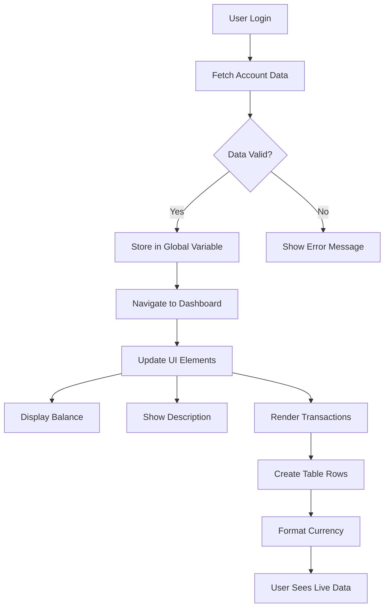

> 💡 **Tips Praktis**: Ingin melihat dashboard Anda beraksi segera? Gunakan nama pengguna `test` saat login - ini sudah dimuat dengan data contoh sehingga Anda dapat melihat semuanya bekerja tanpa harus membuat transaksi terlebih dahulu.

**Mengapa akun uji berguna:**
- Sudah dilengkapi dengan data contoh realistis
- Sempurna untuk melihat bagaimana transaksi ditampilkan
- Bagus untuk menguji fitur dashboard Anda
- Menghemat waktu Anda dari harus membuat data dummy secara manual

### Membuat Elemen Tampilan Dashboard

Mari kita bangun antarmuka dashboard Anda langkah demi langkah, dimulai dengan informasi ringkasan akun dan kemudian beralih ke fitur yang lebih kompleks seperti daftar transaksi.

#### Langkah 1: Perbarui Struktur HTML Anda

Pertama, ganti bagian "Balance" statis dengan elemen placeholder dinamis yang dapat diisi oleh JavaScript Anda:

```html
<section>
  Balance: <span id="balance"></span><span id="currency"></span>
</section>
```

Selanjutnya, tambahkan bagian untuk deskripsi akun. Karena ini berfungsi sebagai judul untuk konten dashboard, gunakan HTML semantik:

```html
<h2 id="description"></h2>
```

**Memahami struktur HTML:**
- **Menggunakan** elemen `<span>` terpisah untuk saldo dan mata uang untuk kontrol individual
- **Menerapkan** ID unik ke setiap elemen untuk penargetan JavaScript
- **Mengikuti** HTML semantik dengan menggunakan `<h2>` untuk deskripsi akun
- **Menciptakan** hierarki logis untuk pembaca layar dan SEO

> ✅ **Wawasan Aksesibilitas**: Deskripsi akun berfungsi sebagai judul untuk konten dashboard, jadi ditandai secara semantik sebagai heading. Pelajari lebih lanjut tentang bagaimana [struktur heading](https://www.nomensa.com/blog/2017/how-structure-headings-web-accessibility) memengaruhi aksesibilitas. Bisakah Anda mengidentifikasi elemen lain di halaman Anda yang mungkin mendapat manfaat dari tag heading?

#### Langkah 2: Buat Fungsi Pembaruan Dashboard

Sekarang buat fungsi yang mengisi dashboard Anda dengan data akun nyata:

```javascript
function updateDashboard() {
  if (!account) {
    return navigate('/login');
  }

  updateElement('description', account.description);
  updateElement('balance', account.balance.toFixed(2));
  updateElement('currency', account.currency);
}
```

**Langkah demi langkah, inilah yang dilakukan fungsi ini:**
- **Memvalidasi** bahwa data akun ada sebelum melanjutkan
- **Mengalihkan** pengguna yang tidak terautentikasi kembali ke halaman login
- **Memperbarui** deskripsi akun menggunakan fungsi `updateElement` yang dapat digunakan kembali
- **Memformat** saldo agar selalu menunjukkan dua tempat desimal
- **Menampilkan** simbol mata uang yang sesuai

> 💰 **Pemformatan Uang**: Metode [`toFixed(2)`](https://developer.mozilla.org/docs/Web/JavaScript/Reference/Global_Objects/Number/toFixed) sangat membantu! Ini memastikan saldo Anda selalu terlihat seperti uang sungguhan - "75.00" daripada hanya "75". Pengguna Anda akan menghargai melihat pemformatan mata uang yang familiar.

#### Langkah 3: Memastikan Dashboard Anda Diperbarui

Untuk memastikan dashboard Anda diperbarui dengan data terkini setiap kali seseorang mengunjunginya, kita perlu terhubung ke sistem navigasi Anda. Jika Anda telah menyelesaikan [tugas pelajaran 1](../1-template-route/assignment.md), ini seharusnya terasa familiar. Jika belum, jangan khawatir - berikut yang Anda butuhkan:

Tambahkan ini ke akhir fungsi `updateRoute()` Anda:

```javascript
if (typeof route.init === 'function') {
  route.init();
}
```

Kemudian perbarui rute Anda untuk menyertakan inisialisasi dashboard:

```javascript
const routes = {
  '/login': { templateId: 'login' },
  '/dashboard': { templateId: 'dashboard', init: updateDashboard }
};
```

**Apa yang dilakukan pengaturan cerdas ini:**
- Memeriksa apakah rute memiliki kode inisialisasi khusus
- Menjalankan kode itu secara otomatis saat rute dimuat
- Memastikan dashboard Anda selalu menunjukkan data terkini
- Menjaga logika routing Anda tetap bersih dan terorganisir

#### Menguji Dashboard Anda

Setelah menerapkan perubahan ini, uji dashboard Anda:

1. **Login** dengan akun uji
2. **Verifikasi** Anda dialihkan ke dashboard
3. **Periksa** bahwa deskripsi akun, saldo, dan mata uang ditampilkan dengan benar
4. **Coba logout dan login kembali** untuk memastikan data diperbarui dengan benar

Dashboard Anda sekarang seharusnya menampilkan informasi akun dinamis yang diperbarui berdasarkan data pengguna yang login!

## Membangun Daftar Transaksi Cerdas dengan Template

Alih-alih membuat HTML secara manual untuk setiap transaksi, kita akan menggunakan template untuk menghasilkan format yang konsisten secara otomatis. Seperti komponen standar yang digunakan dalam pembuatan pesawat luar angkasa, template memastikan setiap baris transaksi mengikuti struktur dan tampilan yang sama.

Teknik ini secara efisien dapat diskalakan dari beberapa transaksi hingga ribuan, menjaga kinerja dan presentasi tetap konsisten.

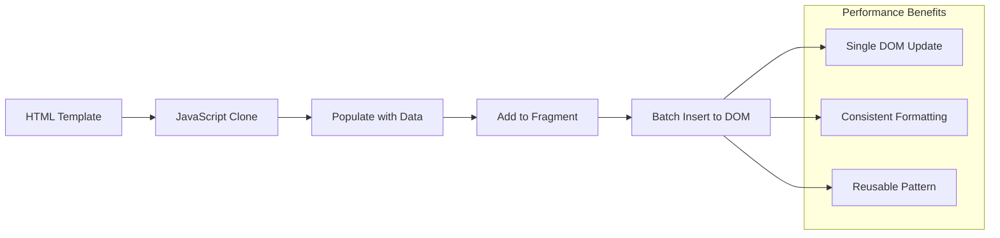

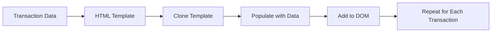

### Langkah 1: Buat Template Transaksi

Pertama, tambahkan template yang dapat digunakan kembali untuk baris transaksi di HTML `<body>` Anda:

```html
<template id="transaction">
  <tr>
    <td></td>
    <td></td>
    <td></td>
  </tr>
</template>
```

**Memahami template HTML:**
- **Mendefinisikan** struktur untuk satu baris tabel
- **Tetap** tidak terlihat sampai dikloning dan diisi dengan JavaScript
- **Menyertakan** tiga sel untuk tanggal, deskripsi, dan jumlah
- **Memberikan** pola yang dapat digunakan kembali untuk format yang konsisten

### Langkah 2: Siapkan Tabel Anda untuk Konten Dinamis

Selanjutnya, tambahkan `id` ke badan tabel Anda agar JavaScript dapat dengan mudah menargetkannya:

```html
<tbody id="transactions"></tbody>
```

**Apa yang dicapai ini:**
- **Menciptakan** target yang jelas untuk menyisipkan baris transaksi
- **Memisahkan** struktur tabel dari konten dinamis
- **Memungkinkan** penghapusan dan pengisian ulang data transaksi dengan mudah

### Langkah 3: Bangun Fungsi Pabrik Baris Transaksi

Sekarang buat fungsi yang mengubah data transaksi menjadi elemen HTML:

```javascript
function createTransactionRow(transaction) {
  const template = document.getElementById('transaction');
  const transactionRow = template.content.cloneNode(true);
  const tr = transactionRow.querySelector('tr');
  tr.children[0].textContent = transaction.date;
  tr.children[1].textContent = transaction.object;
  tr.children[2].textContent = transaction.amount.toFixed(2);
  return transactionRow;
}
```

**Memecah fungsi pabrik ini:**
- **Mengambil** elemen template berdasarkan ID-nya
- **Mengkloning** konten template untuk manipulasi yang aman
- **Memilih** baris tabel dalam konten yang dikloning
- **Mengisi** setiap sel dengan data transaksi
- **Memformat** jumlah untuk menunjukkan tempat desimal yang tepat
- **Mengembalikan** baris yang selesai siap untuk disisipkan

### Langkah 4: Hasilkan Baris Transaksi Secara Efisien

Tambahkan kode ini ke fungsi `updateDashboard()` Anda untuk menampilkan semua transaksi:

```javascript
const transactionsRows = document.createDocumentFragment();
for (const transaction of account.transactions) {
  const transactionRow = createTransactionRow(transaction);
  transactionsRows.appendChild(transactionRow);
}
updateElement('transactions', transactionsRows);
```

**Memahami pendekatan yang efisien ini:**
- **Membuat** fragmen dokumen untuk operasi DOM batch
- **Mengiterasi** semua transaksi dalam data akun
- **Menghasilkan** baris untuk setiap transaksi menggunakan fungsi pabrik
- **Mengumpulkan** semua baris dalam fragmen sebelum menambahkannya ke DOM
- **Melakukan** satu pembaruan DOM daripada beberapa penyisipan individu
> ⚡ **Optimasi Performa**: [`document.createDocumentFragment()`](https://developer.mozilla.org/docs/Web/API/Document/createDocumentFragment) bekerja seperti proses perakitan di Boeing - komponen disiapkan di luar jalur utama, lalu dipasang sebagai unit lengkap. Pendekatan batching ini meminimalkan reflow DOM dengan melakukan satu kali penyisipan daripada beberapa operasi individu.

### Langkah 5: Tingkatkan Fungsi Update untuk Konten Campuran

Fungsi `updateElement()` Anda saat ini hanya menangani konten teks. Perbarui agar dapat bekerja dengan teks maupun node DOM:

```javascript
function updateElement(id, textOrNode) {
  const element = document.getElementById(id);
  element.textContent = ''; // Removes all children
  element.append(textOrNode);
}
```

**Peningkatan utama dalam pembaruan ini:**
- **Menghapus** konten yang ada sebelum menambahkan konten baru
- **Menerima** string teks atau node DOM sebagai parameter
- **Menggunakan** metode [`append()`](https://developer.mozilla.org/docs/Web/API/ParentNode/append) untuk fleksibilitas
- **Mempertahankan** kompatibilitas dengan penggunaan berbasis teks yang sudah ada

### Menguji Dashboard Anda

Saatnya momen kebenaran! Mari lihat dashboard dinamis Anda beraksi:

1. Masuk menggunakan akun `test` (sudah ada data sampel yang siap digunakan)
2. Navigasikan ke dashboard Anda
3. Periksa apakah baris transaksi muncul dengan format yang benar
4. Pastikan tanggal, deskripsi, dan jumlah terlihat baik

Jika semuanya berfungsi, Anda akan melihat daftar transaksi yang sepenuhnya berfungsi di dashboard Anda! 🎉

**Apa yang telah Anda capai:**
- Membangun dashboard yang dapat menangani jumlah data berapa pun
- Membuat template yang dapat digunakan kembali untuk format yang konsisten
- Menerapkan teknik manipulasi DOM yang efisien
- Mengembangkan fungsionalitas yang sebanding dengan aplikasi perbankan produksi

Anda telah berhasil mengubah halaman web statis menjadi aplikasi web dinamis.

### 🎯 Pengecekan Pedagogis: Pembuatan Konten Dinamis

**Pemahaman Arsitektur**: Anda telah menerapkan pipeline data-ke-UI yang canggih yang mencerminkan pola yang digunakan dalam framework seperti React, Vue, dan Angular.

**Konsep Utama yang Dikuasai**:
- **Rendering berbasis template**: Membuat komponen UI yang dapat digunakan kembali
- **Dokumen fragmen**: Mengoptimalkan performa DOM
- **Manipulasi DOM yang aman**: Mencegah kerentanan keamanan
- **Transformasi data**: Mengubah data server menjadi antarmuka pengguna

**Koneksi Industri**: Teknik-teknik ini membentuk dasar framework frontend modern. Virtual DOM di React, sistem template di Vue, dan arsitektur komponen di Angular semuanya dibangun di atas konsep inti ini.

**Pertanyaan Refleksi**: Bagaimana Anda akan memperluas sistem ini untuk menangani pembaruan real-time (seperti transaksi baru yang muncul secara otomatis)? Pertimbangkan WebSockets atau Server-Sent Events.

---

## 📈 Garis Waktu Penguasaan Manajemen Data Anda

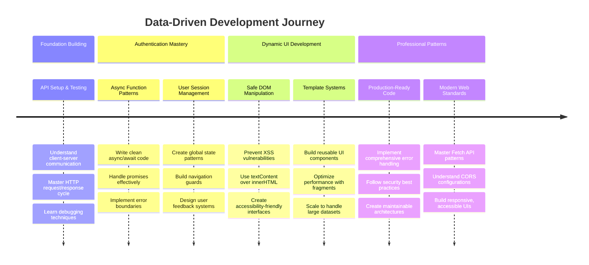

**🎓 Tonggak Kelulusan**: Anda telah berhasil membangun aplikasi web berbasis data lengkap menggunakan pola JavaScript modern. Keterampilan ini langsung dapat diterapkan untuk bekerja dengan framework seperti React, Vue, atau Angular.

**🔄 Kemampuan Tingkat Lanjut**:
- Siap menjelajahi framework frontend yang dibangun di atas konsep ini
- Siap menerapkan fitur real-time dengan WebSockets
- Siap membangun Progressive Web Apps dengan kemampuan offline
- Dasar yang kuat untuk mempelajari pola manajemen state yang lebih maju

## Tantangan Agen GitHub Copilot 🚀

Gunakan mode Agen untuk menyelesaikan tantangan berikut:

**Deskripsi:** Tingkatkan aplikasi perbankan dengan menerapkan fitur pencarian dan filter transaksi yang memungkinkan pengguna menemukan transaksi tertentu berdasarkan rentang tanggal, jumlah, atau kata kunci deskripsi.

**Prompt:** Buat fungsi pencarian untuk aplikasi perbankan yang mencakup: 1) Formulir pencarian dengan bidang input untuk rentang tanggal (dari/hingga), jumlah minimum/maksimum, dan kata kunci deskripsi transaksi, 2) Fungsi `filterTransactions()` yang memfilter array account.transactions berdasarkan kriteria pencarian, 3) Perbarui fungsi `updateDashboard()` untuk menampilkan hasil yang difilter, dan 4) Tambahkan tombol "Clear Filters" untuk mereset tampilan. Gunakan metode array modern JavaScript seperti `filter()` dan tangani kasus tepi untuk kriteria pencarian kosong.

Pelajari lebih lanjut tentang [mode agen](https://code.visualstudio.com/blogs/2025/02/24/introducing-copilot-agent-mode) di sini.

## 🚀 Tantangan

Siap membawa aplikasi perbankan Anda ke tingkat berikutnya? Mari buat aplikasi ini terlihat dan terasa seperti sesuatu yang benar-benar ingin Anda gunakan. Berikut beberapa ide untuk memicu kreativitas Anda:

**Buat lebih indah**: Tambahkan styling CSS untuk mengubah dashboard fungsional Anda menjadi sesuatu yang menarik secara visual. Pikirkan garis bersih, jarak yang baik, dan mungkin beberapa animasi halus.

**Buat responsif**: Cobalah menggunakan [media queries](https://developer.mozilla.org/docs/Web/CSS/Media_Queries) untuk membuat [desain responsif](https://developer.mozilla.org/docs/Web/Progressive_web_apps/Responsive/responsive_design_building_blocks) yang bekerja dengan baik di ponsel, tablet, dan desktop. Pengguna Anda akan berterima kasih!

**Tambahkan sentuhan kreatif**: Pertimbangkan untuk memberi kode warna pada transaksi (hijau untuk pendapatan, merah untuk pengeluaran), menambahkan ikon, atau membuat efek hover yang membuat antarmuka terasa interaktif.

Berikut tampilan dashboard yang sudah dipoles:

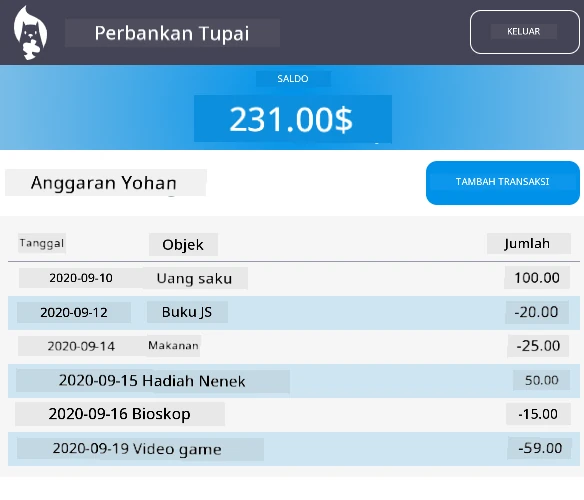

Jangan merasa harus meniru ini persis - gunakan sebagai inspirasi dan buat versi Anda sendiri!

## Kuis Pasca-Kuliah

[Kuis pasca-kuliah](https://ff-quizzes.netlify.app/web/quiz/46)

## Tugas

[Refactor dan beri komentar pada kode Anda](assignment.md)

---

**Penafian**:  
Dokumen ini telah diterjemahkan menggunakan layanan penerjemahan AI [Co-op Translator](https://github.com/Azure/co-op-translator). Meskipun kami berupaya untuk memberikan hasil yang akurat, harap diketahui bahwa terjemahan otomatis mungkin mengandung kesalahan atau ketidakakuratan. Dokumen asli dalam bahasa aslinya harus dianggap sebagai sumber yang otoritatif. Untuk informasi yang penting, disarankan menggunakan jasa penerjemahan manusia profesional. Kami tidak bertanggung jawab atas kesalahpahaman atau penafsiran yang keliru yang timbul dari penggunaan terjemahan ini.