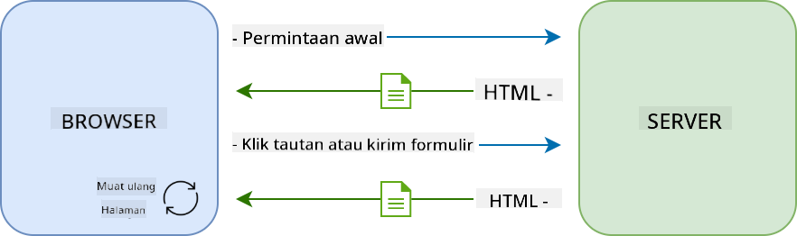

<!--
CO_OP_TRANSLATOR_METADATA:
{
  "original_hash": "f587e913e3f7c0b1c549a05dd74ee8e5",
  "translation_date": "2025-08-27T22:01:46+00:00",
  "source_file": "7-bank-project/3-data/README.md",
  "language_code": "id"
}
-->
# Membangun Aplikasi Perbankan Bagian 3: Metode Mengambil dan Menggunakan Data

## Kuis Pra-Kuliah

[Kuis pra-kuliah](https://ff-quizzes.netlify.app/web/quiz/45)

### Pendahuluan

Di inti setiap aplikasi web terdapat *data*. Data dapat berbentuk berbagai macam, tetapi tujuan utamanya selalu untuk menampilkan informasi kepada pengguna. Dengan aplikasi web yang semakin interaktif dan kompleks, cara pengguna mengakses dan berinteraksi dengan informasi kini menjadi bagian penting dari pengembangan web.

Dalam pelajaran ini, kita akan melihat cara mengambil data dari server secara asinkron, dan menggunakan data ini untuk menampilkan informasi di halaman web tanpa memuat ulang HTML.

### Prasyarat

Anda perlu telah membangun bagian [Formulir Login dan Registrasi](../2-forms/README.md) dari aplikasi web untuk pelajaran ini. Anda juga perlu menginstal [Node.js](https://nodejs.org) dan [menjalankan API server](../api/README.md) secara lokal agar Anda mendapatkan data akun.

Anda dapat menguji apakah server berjalan dengan benar dengan menjalankan perintah ini di terminal:

```sh
curl http://localhost:5000/api
# -> should return "Bank API v1.0.0" as a result
```

---

## AJAX dan pengambilan data

Situs web tradisional memperbarui konten yang ditampilkan ketika pengguna memilih tautan atau mengirimkan data menggunakan formulir, dengan memuat ulang seluruh halaman HTML. Setiap kali data baru perlu dimuat, server web mengembalikan halaman HTML baru yang harus diproses oleh browser, mengganggu tindakan pengguna saat ini dan membatasi interaksi selama pemuatan ulang. Alur kerja ini juga disebut sebagai *Multi-Page Application* atau *MPA*.



Ketika aplikasi web mulai menjadi lebih kompleks dan interaktif, muncul teknik baru yang disebut [AJAX (Asynchronous JavaScript and XML)](https://en.wikipedia.org/wiki/Ajax_(programming)). Teknik ini memungkinkan aplikasi web untuk mengirim dan mengambil data dari server secara asinkron menggunakan JavaScript, tanpa harus memuat ulang halaman HTML, menghasilkan pembaruan yang lebih cepat dan interaksi pengguna yang lebih mulus. Ketika data baru diterima dari server, halaman HTML saat ini juga dapat diperbarui dengan JavaScript menggunakan API [DOM](https://developer.mozilla.org/docs/Web/API/Document_Object_Model). Seiring waktu, pendekatan ini berkembang menjadi apa yang sekarang disebut [*Single-Page Application* atau *SPA*](https://en.wikipedia.org/wiki/Single-page_application).


Ketika AJAX pertama kali diperkenalkan, satu-satunya API yang tersedia untuk mengambil data secara asinkron adalah [`XMLHttpRequest`](https://developer.mozilla.org/docs/Web/API/XMLHttpRequest/Using_XMLHttpRequest). Namun, browser modern sekarang juga mengimplementasikan [`Fetch` API](https://developer.mozilla.org/docs/Web/API/Fetch_API) yang lebih nyaman dan kuat, menggunakan promises dan lebih cocok untuk memanipulasi data JSON.

> Meskipun semua browser modern mendukung `Fetch API`, jika Anda ingin aplikasi web Anda bekerja di browser lama atau lawas, selalu merupakan ide yang baik untuk memeriksa [tabel kompatibilitas di caniuse.com](https://caniuse.com/fetch) terlebih dahulu.

### Tugas

Dalam [pelajaran sebelumnya](../2-forms/README.md) kita telah mengimplementasikan formulir registrasi untuk membuat akun. Sekarang kita akan menambahkan kode untuk login menggunakan akun yang sudah ada, dan mengambil datanya. Buka file `app.js` dan tambahkan fungsi `login` baru:

```js
async function login() {
  const loginForm = document.getElementById('loginForm')
  const user = loginForm.user.value;
}
```

Di sini kita mulai dengan mengambil elemen formulir menggunakan `getElementById()`, lalu kita mendapatkan nama pengguna dari input dengan `loginForm.user.value`. Setiap kontrol formulir dapat diakses berdasarkan namanya (diatur di HTML menggunakan atribut `name`) sebagai properti dari formulir.

Dengan cara yang mirip dengan apa yang kita lakukan untuk registrasi, kita akan membuat fungsi lain untuk melakukan permintaan server, tetapi kali ini untuk mengambil data akun:

```js
async function getAccount(user) {
  try {
    const response = await fetch('//localhost:5000/api/accounts/' + encodeURIComponent(user));
    return await response.json();
  } catch (error) {
    return { error: error.message || 'Unknown error' };
  }
}
```

Kita menggunakan `fetch` API untuk meminta data secara asinkron dari server, tetapi kali ini kita tidak memerlukan parameter tambahan selain URL yang dipanggil, karena kita hanya mengambil data. Secara default, `fetch` membuat permintaan HTTP [`GET`](https://developer.mozilla.org/docs/Web/HTTP/Methods/GET), yang sesuai dengan kebutuhan kita di sini.

✅ `encodeURIComponent()` adalah fungsi yang melarikan karakter khusus untuk URL. Masalah apa yang mungkin terjadi jika kita tidak memanggil fungsi ini dan langsung menggunakan nilai `user` dalam URL?

Sekarang mari kita perbarui fungsi `login` kita untuk menggunakan `getAccount`:

```js
async function login() {
  const loginForm = document.getElementById('loginForm')
  const user = loginForm.user.value;
  const data = await getAccount(user);

  if (data.error) {
    return console.log('loginError', data.error);
  }

  account = data;
  navigate('/dashboard');
}
```

Pertama, karena `getAccount` adalah fungsi asinkron, kita perlu mencocokkannya dengan kata kunci `await` untuk menunggu hasil server. Seperti halnya permintaan server, kita juga harus menangani kasus kesalahan. Untuk saat ini kita hanya akan menambahkan pesan log untuk menampilkan kesalahan, dan kembali ke sana nanti.

Kemudian kita harus menyimpan data di suatu tempat sehingga kita dapat menggunakannya nanti untuk menampilkan informasi dashboard. Karena variabel `account` belum ada, kita akan membuat variabel global untuk itu di bagian atas file kita:

```js
let account = null;
```

Setelah data pengguna disimpan ke dalam variabel, kita dapat bernavigasi dari halaman *login* ke *dashboard* menggunakan fungsi `navigate()` yang sudah kita miliki.

Akhirnya, kita perlu memanggil fungsi `login` kita ketika formulir login dikirimkan, dengan memodifikasi HTML:

```html
<form id="loginForm" action="javascript:login()">
```

Uji apakah semuanya berfungsi dengan benar dengan mendaftarkan akun baru dan mencoba login menggunakan akun yang sama.

Sebelum melanjutkan ke bagian berikutnya, kita juga dapat melengkapi fungsi `register` dengan menambahkan ini di bagian bawah fungsi:

```js
account = result;
navigate('/dashboard');
```

✅ Tahukah Anda bahwa secara default, Anda hanya dapat memanggil API server dari *domain dan port yang sama* dengan halaman web yang Anda lihat? Ini adalah mekanisme keamanan yang diberlakukan oleh browser. Tapi tunggu, aplikasi web kita berjalan di `localhost:3000` sedangkan API server berjalan di `localhost:5000`, mengapa ini berfungsi? Dengan menggunakan teknik yang disebut [Cross-Origin Resource Sharing (CORS)](https://developer.mozilla.org/docs/Web/HTTP/CORS), dimungkinkan untuk melakukan permintaan HTTP lintas domain jika server menambahkan header khusus ke respons, memungkinkan pengecualian untuk domain tertentu.

> Pelajari lebih lanjut tentang API dengan mengikuti [pelajaran ini](https://docs.microsoft.com/learn/modules/use-apis-discover-museum-art/?WT.mc_id=academic-77807-sagibbon)

## Memperbarui HTML untuk menampilkan data

Sekarang kita memiliki data pengguna, kita harus memperbarui HTML yang ada untuk menampilkannya. Kita sudah tahu cara mengambil elemen dari DOM menggunakan misalnya `document.getElementById()`. Setelah Anda memiliki elemen dasar, berikut adalah beberapa API yang dapat Anda gunakan untuk memodifikasi atau menambahkan elemen anak ke dalamnya:

- Menggunakan properti [`textContent`](https://developer.mozilla.org/docs/Web/API/Node/textContent) Anda dapat mengubah teks dari sebuah elemen. Perhatikan bahwa mengubah nilai ini akan menghapus semua anak elemen (jika ada) dan menggantinya dengan teks yang diberikan. Dengan demikian, ini juga merupakan metode yang efisien untuk menghapus semua anak elemen dari elemen tertentu dengan menetapkan string kosong `''` padanya.

- Menggunakan [`document.createElement()`](https://developer.mozilla.org/docs/Web/API/Document/createElement) bersama dengan metode [`append()`](https://developer.mozilla.org/docs/Web/API/ParentNode/append) Anda dapat membuat dan melampirkan satu atau lebih elemen anak baru.

✅ Menggunakan properti [`innerHTML`](https://developer.mozilla.org/docs/Web/API/Element/innerHTML) dari sebuah elemen juga memungkinkan untuk mengubah konten HTML-nya, tetapi ini sebaiknya dihindari karena rentan terhadap serangan [cross-site scripting (XSS)](https://developer.mozilla.org/docs/Glossary/Cross-site_scripting).

### Tugas

Sebelum melanjutkan ke layar dashboard, ada satu hal lagi yang harus kita lakukan di halaman *login*. Saat ini, jika Anda mencoba login dengan nama pengguna yang tidak ada, pesan ditampilkan di konsol tetapi bagi pengguna biasa tidak ada yang berubah dan Anda tidak tahu apa yang terjadi.

Mari kita tambahkan elemen placeholder di formulir login tempat kita dapat menampilkan pesan kesalahan jika diperlukan. Tempat yang baik adalah tepat sebelum tombol login `<button>`:

```html
...
<div id="loginError"></div>
<button>Login</button>
...
```

Elemen `<div>` ini kosong, artinya tidak ada yang akan ditampilkan di layar sampai kita menambahkan konten ke dalamnya. Kita juga memberinya `id` sehingga kita dapat mengambilnya dengan mudah menggunakan JavaScript.

Kembali ke file `app.js` dan buat fungsi pembantu baru `updateElement`:

```js
function updateElement(id, text) {
  const element = document.getElementById(id);
  element.textContent = text;
}
```

Fungsi ini cukup sederhana: diberikan *id* elemen dan *teks*, fungsi ini akan memperbarui konten teks dari elemen DOM dengan `id` yang sesuai. Mari kita gunakan metode ini sebagai pengganti pesan kesalahan sebelumnya di fungsi `login`:

```js
if (data.error) {
  return updateElement('loginError', data.error);
}
```

Sekarang jika Anda mencoba login dengan akun yang tidak valid, Anda akan melihat sesuatu seperti ini:


Sekarang kita memiliki teks kesalahan yang muncul secara visual, tetapi jika Anda mencobanya dengan pembaca layar, Anda akan melihat bahwa tidak ada yang diumumkan. Agar teks yang ditambahkan secara dinamis ke halaman diumumkan oleh pembaca layar, teks tersebut perlu menggunakan sesuatu yang disebut [Live Region](https://developer.mozilla.org/docs/Web/Accessibility/ARIA/ARIA_Live_Regions). Di sini kita akan menggunakan jenis live region tertentu yang disebut alert:

```html
<div id="loginError" role="alert"></div>
```

Terapkan perilaku yang sama untuk kesalahan fungsi `register` (jangan lupa untuk memperbarui HTML).

## Menampilkan informasi di dashboard

Menggunakan teknik yang baru saja kita lihat, kita juga akan menangani penampilan informasi akun di halaman dashboard.

Berikut adalah seperti apa objek akun yang diterima dari server:

```json
{
  "user": "test",
  "currency": "$",
  "description": "Test account",
  "balance": 75,
  "transactions": [
    { "id": "1", "date": "2020-10-01", "object": "Pocket money", "amount": 50 },
    { "id": "2", "date": "2020-10-03", "object": "Book", "amount": -10 },
    { "id": "3", "date": "2020-10-04", "object": "Sandwich", "amount": -5 }
  ],
}
```

> Catatan: untuk mempermudah pekerjaan Anda, Anda dapat menggunakan akun `test` yang sudah ada dan telah diisi dengan data.

### Tugas

Mari kita mulai dengan mengganti bagian "Balance" di HTML untuk menambahkan elemen placeholder:

```html
<section>
  Balance: <span id="balance"></span><span id="currency"></span>
</section>
```

Kita juga akan menambahkan bagian baru tepat di bawahnya untuk menampilkan deskripsi akun:

```html
<h2 id="description"></h2>
```

✅ Karena deskripsi akun berfungsi sebagai judul untuk konten di bawahnya, itu ditandai secara semantik sebagai heading. Pelajari lebih lanjut tentang bagaimana [struktur heading](https://www.nomensa.com/blog/2017/how-structure-headings-web-accessibility) penting untuk aksesibilitas, dan lihat secara kritis halaman untuk menentukan apa lagi yang bisa menjadi heading.

Selanjutnya, kita akan membuat fungsi baru di `app.js` untuk mengisi placeholder:

```js
function updateDashboard() {
  if (!account) {
    return navigate('/login');
  }

  updateElement('description', account.description);
  updateElement('balance', account.balance.toFixed(2));
  updateElement('currency', account.currency);
}
```

Pertama, kita memeriksa bahwa kita memiliki data akun yang kita butuhkan sebelum melangkah lebih jauh. Kemudian kita menggunakan fungsi `updateElement()` yang kita buat sebelumnya untuk memperbarui HTML.

> Untuk membuat tampilan saldo lebih menarik, kita menggunakan metode [`toFixed(2)`](https://developer.mozilla.org/docs/Web/JavaScript/Reference/Global_Objects/Number/toFixed) untuk memaksa menampilkan nilai dengan 2 digit setelah titik desimal.

Sekarang kita perlu memanggil fungsi `updateDashboard()` kita setiap kali halaman dashboard dimuat. Jika Anda sudah menyelesaikan [tugas pelajaran 1](../1-template-route/assignment.md) ini seharusnya mudah, jika tidak Anda dapat menggunakan implementasi berikut.

Tambahkan kode ini di akhir fungsi `updateRoute()`:

```js
if (typeof route.init === 'function') {
  route.init();
}
```

Dan perbarui definisi rute dengan:

```js
const routes = {
  '/login': { templateId: 'login' },
  '/dashboard': { templateId: 'dashboard', init: updateDashboard }
};
```

Dengan perubahan ini, setiap kali halaman dashboard ditampilkan, fungsi `updateDashboard()` dipanggil. Setelah login, Anda seharusnya dapat melihat saldo akun, mata uang, dan deskripsi.

## Membuat baris tabel secara dinamis dengan template HTML

Dalam [pelajaran pertama](../1-template-route/README.md) kita menggunakan template HTML bersama dengan metode [`appendChild()`](https://developer.mozilla.org/docs/Web/API/Node/appendChild) untuk mengimplementasikan navigasi di aplikasi kita. Template juga bisa lebih kecil dan digunakan untuk mengisi bagian halaman yang berulang secara dinamis.

Kita akan menggunakan pendekatan serupa untuk menampilkan daftar transaksi di tabel HTML.

### Tugas

Tambahkan template baru di `<body>` HTML:

```html
<template id="transaction">
  <tr>
    <td></td>
    <td></td>
    <td></td>
  </tr>
</template>
```

Template ini mewakili satu baris tabel, dengan 3 kolom yang ingin kita isi: *tanggal*, *objek*, dan *jumlah* dari transaksi.

Kemudian, tambahkan properti `id` ini ke elemen `<tbody>` tabel dalam template dashboard untuk mempermudah pencarian menggunakan JavaScript:

```html
<tbody id="transactions"></tbody>
```

HTML kita sudah siap, mari kita beralih ke kode JavaScript dan membuat fungsi baru `createTransactionRow`:

```js
function createTransactionRow(transaction) {
  const template = document.getElementById('transaction');
  const transactionRow = template.content.cloneNode(true);
  const tr = transactionRow.querySelector('tr');
  tr.children[0].textContent = transaction.date;
  tr.children[1].textContent = transaction.object;
  tr.children[2].textContent = transaction.amount.toFixed(2);
  return transactionRow;
}
```

Fungsi ini melakukan persis seperti namanya: menggunakan template yang kita buat sebelumnya, fungsi ini membuat baris tabel baru dan mengisi isinya menggunakan data transaksi. Kita akan menggunakan ini dalam fungsi `updateDashboard()` kita untuk mengisi tabel:

```js
const transactionsRows = document.createDocumentFragment();
for (const transaction of account.transactions) {
  const transactionRow = createTransactionRow(transaction);
  transactionsRows.appendChild(transactionRow);
}
updateElement('transactions', transactionsRows);
```

Di sini kita menggunakan metode [`document.createDocumentFragment()`](https://developer.mozilla.org/docs/Web/API/Document/createDocumentFragment) yang membuat fragmen DOM baru yang dapat kita kerjakan, sebelum akhirnya melampirkannya ke tabel HTML kita.

Masih ada satu hal lagi yang harus kita lakukan sebelum kode ini dapat bekerja, karena fungsi `updateElement()` kita saat ini hanya mendukung konten teks. Mari kita ubah kodenya sedikit:

```js
function updateElement(id, textOrNode) {
  const element = document.getElementById(id);
  element.textContent = ''; // Removes all children
  element.append(textOrNode);
}
```

Kita menggunakan metode [`append()`](https://developer.mozilla.org/docs/Web/API/ParentNode/append) karena memungkinkan untuk melampirkan teks atau [DOM Nodes](https://developer.mozilla.org/docs/Web/API/Node) ke elemen induk, yang sempurna untuk semua kasus penggunaan kita.
Jika Anda mencoba menggunakan akun `test` untuk login, Anda sekarang seharusnya melihat daftar transaksi di dashboard 🎉.

---

## 🚀 Tantangan

Bekerja sama untuk membuat halaman dashboard terlihat seperti aplikasi perbankan yang nyata. Jika Anda sudah menata aplikasi Anda, coba gunakan [media queries](https://developer.mozilla.org/docs/Web/CSS/Media_Queries) untuk menciptakan [desain responsif](https://developer.mozilla.org/docs/Web/Progressive_web_apps/Responsive/responsive_design_building_blocks) yang berfungsi dengan baik di perangkat desktop maupun mobile.

Berikut adalah contoh halaman dashboard yang sudah ditata:


## Kuis Pasca-Kuliah

[Kuis pasca-kuliah](https://ff-quizzes.netlify.app/web/quiz/46)

## Tugas

[Refactor dan beri komentar pada kode Anda](assignment.md)

---

**Penafian**:  
Dokumen ini telah diterjemahkan menggunakan layanan penerjemahan AI [Co-op Translator](https://github.com/Azure/co-op-translator). Meskipun kami berupaya untuk memberikan hasil yang akurat, harap diperhatikan bahwa terjemahan otomatis mungkin mengandung kesalahan atau ketidakakuratan. Dokumen asli dalam bahasa aslinya harus dianggap sebagai sumber yang berwenang. Untuk informasi yang bersifat kritis, disarankan menggunakan jasa penerjemahan manusia profesional. Kami tidak bertanggung jawab atas kesalahpahaman atau penafsiran yang keliru yang timbul dari penggunaan terjemahan ini.