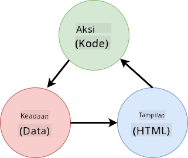

<!--
CO_OP_TRANSLATOR_METADATA:
{
  "original_hash": "4fa20c513e367e9cdd401bf49ae16e33",
  "translation_date": "2025-08-27T22:10:01+00:00",
  "source_file": "7-bank-project/4-state-management/README.md",
  "language_code": "id"
}
-->
# Membangun Aplikasi Perbankan Bagian 4: Konsep Manajemen State

## Kuis Pra-Kuliah

[Kuis pra-kuliah](https://ashy-river-0debb7803.1.azurestaticapps.net/quiz/47)

### Pendahuluan

Seiring dengan berkembangnya aplikasi web, menjadi tantangan untuk melacak semua aliran data. Kode mana yang mendapatkan data, halaman mana yang menggunakannya, di mana dan kapan data perlu diperbarui...mudah sekali berakhir dengan kode yang berantakan dan sulit untuk dipelihara. Hal ini terutama berlaku ketika Anda perlu berbagi data di antara berbagai halaman aplikasi Anda, misalnya data pengguna. Konsep *manajemen state* selalu ada di semua jenis program, tetapi karena aplikasi web terus berkembang dalam kompleksitas, sekarang menjadi poin penting untuk dipikirkan selama pengembangan.

Dalam bagian terakhir ini, kita akan meninjau kembali aplikasi yang telah kita bangun untuk memikirkan ulang bagaimana state dikelola, memungkinkan dukungan untuk penyegaran browser kapan saja, dan mempertahankan data di antara sesi pengguna.

### Prasyarat

Anda perlu menyelesaikan bagian [pengambilan data](../3-data/README.md) dari aplikasi web untuk pelajaran ini. Anda juga perlu menginstal [Node.js](https://nodejs.org) dan [menjalankan server API](../api/README.md) secara lokal sehingga Anda dapat mengelola data akun.

Anda dapat menguji apakah server berjalan dengan baik dengan menjalankan perintah ini di terminal:

```sh
curl http://localhost:5000/api
# -> should return "Bank API v1.0.0" as a result
```

---

## Memikirkan Ulang Manajemen State

Dalam [pelajaran sebelumnya](../3-data/README.md), kami memperkenalkan konsep dasar state dalam aplikasi kami dengan variabel global `account` yang berisi data bank untuk pengguna yang sedang masuk. Namun, implementasi kami saat ini memiliki beberapa kekurangan. Coba segarkan halaman saat Anda berada di dashboard. Apa yang terjadi?

Ada 3 masalah dengan kode saat ini:

- State tidak dipertahankan, karena penyegaran browser membawa Anda kembali ke halaman login.
- Ada beberapa fungsi yang memodifikasi state. Seiring dengan pertumbuhan aplikasi, hal ini dapat membuat perubahan sulit dilacak dan mudah lupa untuk memperbarui salah satunya.
- State tidak dibersihkan, sehingga ketika Anda mengklik *Logout*, data akun masih ada meskipun Anda berada di halaman login.

Kita bisa memperbarui kode kita untuk mengatasi masalah ini satu per satu, tetapi itu akan menciptakan lebih banyak duplikasi kode dan membuat aplikasi lebih kompleks dan sulit untuk dipelihara. Atau kita bisa berhenti sejenak dan memikirkan ulang strategi kita.

> Masalah apa yang sebenarnya kita coba selesaikan di sini?

[Manajemen state](https://en.wikipedia.org/wiki/State_management) adalah tentang menemukan pendekatan yang baik untuk menyelesaikan dua masalah khusus ini:

- Bagaimana cara menjaga aliran data dalam aplikasi tetap dapat dipahami?
- Bagaimana cara menjaga data state selalu sinkron dengan antarmuka pengguna (dan sebaliknya)?

Setelah Anda menangani ini, masalah lain yang mungkin Anda miliki mungkin sudah teratasi atau menjadi lebih mudah untuk diperbaiki. Ada banyak pendekatan yang mungkin untuk menyelesaikan masalah ini, tetapi kami akan menggunakan solusi umum yang terdiri dari **memusatkan data dan cara untuk mengubahnya**. Aliran data akan berjalan seperti ini:



> Di sini kami tidak akan membahas bagian di mana data secara otomatis memicu pembaruan tampilan, karena itu terkait dengan konsep yang lebih maju dari [Pemrograman Reaktif](https://en.wikipedia.org/wiki/Reactive_programming). Ini adalah subjek lanjutan yang bagus jika Anda ingin mendalami lebih jauh.

✅ Ada banyak pustaka di luar sana dengan pendekatan berbeda untuk manajemen state, [Redux](https://redux.js.org) menjadi salah satu opsi populer. Lihat konsep dan pola yang digunakan karena sering kali merupakan cara yang baik untuk mempelajari potensi masalah yang mungkin Anda hadapi dalam aplikasi web besar dan bagaimana cara menyelesaikannya.

### Tugas

Kita akan mulai dengan sedikit refactoring. Ganti deklarasi `account`:

```js
let account = null;
```

Dengan:

```js
let state = {
  account: null
};
```

Idenya adalah untuk *memusatkan* semua data aplikasi kita dalam satu objek state. Saat ini kita hanya memiliki `account` dalam state sehingga tidak banyak berubah, tetapi ini menciptakan jalur untuk evolusi.

Kita juga harus memperbarui fungsi yang menggunakannya. Dalam fungsi `register()` dan `login()`, ganti `account = ...` dengan `state.account = ...`;

Di bagian atas fungsi `updateDashboard()`, tambahkan baris ini:

```js
const account = state.account;
```

Refactoring ini sendiri tidak membawa banyak peningkatan, tetapi idenya adalah untuk meletakkan dasar bagi perubahan berikutnya.

## Melacak Perubahan Data

Sekarang kita telah menempatkan objek `state` untuk menyimpan data kita, langkah berikutnya adalah memusatkan pembaruan. Tujuannya adalah untuk mempermudah melacak setiap perubahan dan kapan perubahan itu terjadi.

Untuk menghindari perubahan yang dilakukan pada objek `state`, juga merupakan praktik yang baik untuk menganggapnya [*immutable*](https://en.wikipedia.org/wiki/Immutable_object), yang berarti bahwa objek tersebut tidak dapat dimodifikasi sama sekali. Ini juga berarti Anda harus membuat objek state baru jika Anda ingin mengubah apa pun di dalamnya. Dengan melakukan ini, Anda membangun perlindungan terhadap [efek samping](https://en.wikipedia.org/wiki/Side_effect_(computer_science)) yang mungkin tidak diinginkan, dan membuka kemungkinan untuk fitur baru dalam aplikasi Anda seperti menerapkan undo/redo, sambil juga mempermudah debugging. Misalnya, Anda dapat mencatat setiap perubahan yang dilakukan pada state dan menyimpan riwayat perubahan untuk memahami sumber bug.

Dalam JavaScript, Anda dapat menggunakan [`Object.freeze()`](https://developer.mozilla.org/docs/Web/JavaScript/Reference/Global_Objects/Object/freeze) untuk membuat versi immutable dari sebuah objek. Jika Anda mencoba membuat perubahan pada objek immutable, sebuah pengecualian akan muncul.

✅ Apakah Anda tahu perbedaan antara objek immutable *shallow* dan *deep*? Anda dapat membacanya [di sini](https://developer.mozilla.org/docs/Web/JavaScript/Reference/Global_Objects/Object/freeze#What_is_shallow_freeze).

### Tugas

Mari kita buat fungsi baru `updateState()`:

```js
function updateState(property, newData) {
  state = Object.freeze({
    ...state,
    [property]: newData
  });
}
```

Dalam fungsi ini, kita membuat objek state baru dan menyalin data dari state sebelumnya menggunakan [*operator spread (`...`)*](https://developer.mozilla.org/docs/Web/JavaScript/Reference/Operators/Spread_syntax#Spread_in_object_literals). Kemudian kita menimpa properti tertentu dari objek state dengan data baru menggunakan [notasi bracket](https://developer.mozilla.org/docs/Web/JavaScript/Guide/Working_with_Objects#Objects_and_properties) `[property]` untuk penugasan. Akhirnya, kita mengunci objek untuk mencegah modifikasi menggunakan `Object.freeze()`. Saat ini kita hanya memiliki properti `account` yang disimpan dalam state, tetapi dengan pendekatan ini Anda dapat menambahkan sebanyak mungkin properti yang Anda butuhkan dalam state.

Kita juga akan memperbarui inisialisasi `state` untuk memastikan state awal juga dibekukan:

```js
let state = Object.freeze({
  account: null
});
```

Setelah itu, perbarui fungsi `register` dengan mengganti penugasan `state.account = result;` dengan:

```js
updateState('account', result);
```

Lakukan hal yang sama dengan fungsi `login`, mengganti `state.account = data;` dengan:

```js
updateState('account', data);
```

Sekarang kita akan memperbaiki masalah data akun yang tidak dibersihkan ketika pengguna mengklik *Logout*.

Buat fungsi baru `logout()`:

```js
function logout() {
  updateState('account', null);
  navigate('/login');
}
```

Dalam `updateDashboard()`, ganti pengalihan `return navigate('/login');` dengan `return logout()`;

Coba daftarkan akun baru, keluar, dan masuk lagi untuk memeriksa apakah semuanya masih berfungsi dengan benar.

> Tip: Anda dapat melihat semua perubahan state dengan menambahkan `console.log(state)` di bagian bawah `updateState()` dan membuka konsol di alat pengembangan browser Anda.

## Mempertahankan State

Sebagian besar aplikasi web perlu mempertahankan data agar dapat berfungsi dengan benar. Semua data penting biasanya disimpan di database dan diakses melalui server API, seperti data akun pengguna dalam kasus kami. Tetapi terkadang, juga menarik untuk mempertahankan beberapa data di aplikasi klien yang berjalan di browser Anda, untuk pengalaman pengguna yang lebih baik atau untuk meningkatkan kinerja pemuatan.

Ketika Anda ingin mempertahankan data di browser Anda, ada beberapa pertanyaan penting yang harus Anda tanyakan pada diri sendiri:

- *Apakah data ini sensitif?* Anda harus menghindari menyimpan data sensitif di klien, seperti kata sandi pengguna.
- *Berapa lama Anda perlu menyimpan data ini?* Apakah Anda berencana mengakses data ini hanya untuk sesi saat ini atau Anda ingin menyimpannya selamanya?

Ada beberapa cara untuk menyimpan informasi di dalam aplikasi web, tergantung pada apa yang ingin Anda capai. Misalnya, Anda dapat menggunakan URL untuk menyimpan kueri pencarian, dan membuatnya dapat dibagikan antara pengguna. Anda juga dapat menggunakan [HTTP cookies](https://developer.mozilla.org/docs/Web/HTTP/Cookies) jika data perlu dibagikan dengan server, seperti informasi [autentikasi](https://en.wikipedia.org/wiki/Authentication).

Opsi lain adalah menggunakan salah satu dari banyak API browser untuk menyimpan data. Dua di antaranya sangat menarik:

- [`localStorage`](https://developer.mozilla.org/docs/Web/API/Window/localStorage): sebuah [Key/Value store](https://en.wikipedia.org/wiki/Key%E2%80%93value_database) yang memungkinkan untuk mempertahankan data spesifik untuk situs web saat ini di antara sesi yang berbeda. Data yang disimpan di dalamnya tidak pernah kedaluwarsa.
- [`sessionStorage`](https://developer.mozilla.org/docs/Web/API/Window/sessionStorage): ini bekerja sama seperti `localStorage` kecuali bahwa data yang disimpan di dalamnya dihapus ketika sesi berakhir (ketika browser ditutup).

Perlu dicatat bahwa kedua API ini hanya memungkinkan untuk menyimpan [string](https://developer.mozilla.org/docs/Web/JavaScript/Reference/Global_Objects/String). Jika Anda ingin menyimpan objek kompleks, Anda perlu menyerialkannya ke format [JSON](https://developer.mozilla.org/docs/Web/JavaScript/Reference/Global_Objects/JSON) menggunakan [`JSON.stringify()`](https://developer.mozilla.org/docs/Web/JavaScript/Reference/Global_Objects/JSON/stringify).

✅ Jika Anda ingin membuat aplikasi web yang tidak bekerja dengan server, juga memungkinkan untuk membuat database di klien menggunakan API [`IndexedDB`](https://developer.mozilla.org/docs/Web/API/IndexedDB_API). Ini disediakan untuk kasus penggunaan lanjutan atau jika Anda perlu menyimpan jumlah data yang signifikan, karena lebih kompleks untuk digunakan.

### Tugas

Kami ingin pengguna kami tetap masuk sampai mereka secara eksplisit mengklik tombol *Logout*, jadi kami akan menggunakan `localStorage` untuk menyimpan data akun. Pertama, mari kita tentukan kunci yang akan kita gunakan untuk menyimpan data kita.

```js
const storageKey = 'savedAccount';
```

Kemudian tambahkan baris ini di akhir fungsi `updateState()`:

```js
localStorage.setItem(storageKey, JSON.stringify(state.account));
```

Dengan ini, data akun pengguna akan dipertahankan dan selalu diperbarui karena sebelumnya kita telah memusatkan semua pembaruan state kita. Di sinilah kita mulai mendapatkan manfaat dari semua refactoring sebelumnya 🙂.

Karena data disimpan, kita juga harus mengurus pemulihannya saat aplikasi dimuat. Karena kita akan mulai memiliki lebih banyak kode inisialisasi, mungkin ide yang baik untuk membuat fungsi baru `init`, yang juga mencakup kode sebelumnya di bagian bawah `app.js`:

```js
function init() {
  const savedAccount = localStorage.getItem(storageKey);
  if (savedAccount) {
    updateState('account', JSON.parse(savedAccount));
  }

  // Our previous initialization code
  window.onpopstate = () => updateRoute();
  updateRoute();
}

init();
```

Di sini kita mengambil data yang disimpan, dan jika ada, kita memperbarui state sesuai. Penting untuk melakukan ini *sebelum* memperbarui rute, karena mungkin ada kode yang bergantung pada state selama pembaruan halaman.

Kita juga dapat menjadikan halaman *Dashboard* sebagai halaman default aplikasi kita, karena sekarang kita mempertahankan data akun. Jika tidak ada data yang ditemukan, dashboard akan mengurus pengalihan ke halaman *Login* bagaimanapun. Dalam `updateRoute()`, ganti fallback `return navigate('/login');` dengan `return navigate('/dashboard');`.

Sekarang masuk ke aplikasi dan coba segarkan halaman. Anda harus tetap berada di dashboard. Dengan pembaruan itu, kami telah menangani semua masalah awal kami...

## Menyegarkan Data

...Tetapi kami mungkin juga telah menciptakan masalah baru. Ups!

Pergi ke dashboard menggunakan akun `test`, lalu jalankan perintah ini di terminal untuk membuat transaksi baru:

```sh
curl --request POST \
     --header "Content-Type: application/json" \
     --data "{ \"date\": \"2020-07-24\", \"object\": \"Bought book\", \"amount\": -20 }" \
     http://localhost:5000/api/accounts/test/transactions
```

Coba segarkan halaman dashboard di browser Anda sekarang. Apa yang terjadi? Apakah Anda melihat transaksi baru?

State dipertahankan tanpa batas waktu berkat `localStorage`, tetapi itu juga berarti tidak pernah diperbarui sampai Anda keluar dari aplikasi dan masuk lagi!

Salah satu strategi yang mungkin untuk memperbaikinya adalah memuat ulang data akun setiap kali dashboard dimuat, untuk menghindari data yang tidak diperbarui.

### Tugas

Buat fungsi baru `updateAccountData`:

```js
async function updateAccountData() {
  const account = state.account;
  if (!account) {
    return logout();
  }

  const data = await getAccount(account.user);
  if (data.error) {
    return logout();
  }

  updateState('account', data);
}
```

Metode ini memeriksa bahwa kita saat ini sedang masuk lalu memuat ulang data akun dari server.

Buat fungsi lain bernama `refresh`:

```js
async function refresh() {
  await updateAccountData();
  updateDashboard();
}
```

Yang satu ini memperbarui data akun, lalu mengurus pembaruan HTML halaman dashboard. Ini adalah apa yang perlu kita panggil ketika rute dashboard dimuat. Perbarui definisi rute dengan:

```js
const routes = {
  '/login': { templateId: 'login' },
  '/dashboard': { templateId: 'dashboard', init: refresh }
};
```

Coba muat ulang dashboard sekarang, seharusnya menampilkan data akun yang diperbarui.

---

## 🚀 Tantangan

Sekarang kita memuat ulang data akun setiap kali dashboard dimuat, apakah menurut Anda kita masih perlu mempertahankan *semua data akun*?

Cobalah bekerja sama untuk mengubah apa yang disimpan dan dimuat dari `localStorage` agar hanya mencakup apa yang benar-benar diperlukan untuk aplikasi berfungsi.

## Kuis Pasca-Kuliah
[Post-lecture quiz](https://ashy-river-0debb7803.1.azurestaticapps.net/quiz/48)

## Tugas

[Implementasikan dialog "Tambah transaksi"](assignment.md)

Berikut adalah contoh hasil setelah menyelesaikan tugas:


---

**Penafian**:  
Dokumen ini telah diterjemahkan menggunakan layanan penerjemahan AI [Co-op Translator](https://github.com/Azure/co-op-translator). Meskipun kami berusaha untuk memberikan hasil yang akurat, harap diingat bahwa terjemahan otomatis mungkin mengandung kesalahan atau ketidakakuratan. Dokumen asli dalam bahasa aslinya harus dianggap sebagai sumber yang otoritatif. Untuk informasi yang bersifat kritis, disarankan menggunakan jasa penerjemahan profesional oleh manusia. Kami tidak bertanggung jawab atas kesalahpahaman atau penafsiran yang keliru yang timbul dari penggunaan terjemahan ini.