<!--
CO_OP_TRANSLATOR_METADATA:
{
  "original_hash": "b807b09df716dc48a2b750835bf8e933",
  "translation_date": "2025-11-06T11:49:59+00:00",
  "source_file": "7-bank-project/4-state-management/README.md",
  "language_code": "id"
}
-->
# Membangun Aplikasi Perbankan Bagian 4: Konsep Manajemen State

## ⚡ Apa yang Bisa Anda Lakukan dalam 5 Menit Berikutnya

**Jalur Cepat untuk Pengembang Sibuk**

```mermaid
flowchart LR
    A[⚡ 5 minutes] --> B[Diagnose state issues]
    B --> C[Create central state object]
    C --> D[Add updateState function]
    D --> E[See immediate improvements]
```



- **Menit 1**: Uji masalah state saat ini - login, refresh halaman, amati logout
- **Menit 2**: Ganti `let account = null` dengan `let state = { account: null }`
- **Menit 3**: Buat fungsi sederhana `updateState()` untuk pembaruan yang terkontrol
- **Menit 4**: Perbarui satu fungsi untuk menggunakan pola baru
- **Menit 5**: Uji peningkatan prediktabilitas dan kemampuan debugging

**Tes Diagnostik Cepat**:
```javascript
// Before: Scattered state
let account = null; // Lost on refresh!

// After: Centralized state
let state = Object.freeze({ account: null }); // Controlled and trackable!
```

**Mengapa Ini Penting**: Dalam 5 menit, Anda akan merasakan transformasi dari manajemen state yang kacau menjadi pola yang prediktif dan mudah di-debug. Ini adalah fondasi yang membuat aplikasi kompleks dapat dikelola.

## 🗺️ Perjalanan Belajar Anda Menuju Penguasaan Manajemen State


**Tujuan Perjalanan Anda**: Pada akhir pelajaran ini, Anda akan membangun sistem manajemen state tingkat profesional yang menangani persistensi, kesegaran data, dan pembaruan yang prediktif - pola yang sama digunakan dalam aplikasi produksi.

## Kuis Pra-Pelajaran

[Kuis pra-pelajaran](https://ff-quizzes.netlify.app/web/quiz/47)

## Pendahuluan

Manajemen state seperti sistem navigasi di pesawat ruang angkasa Voyager – ketika semuanya berjalan lancar, Anda hampir tidak menyadari keberadaannya. Tetapi ketika ada masalah, itu menjadi perbedaan antara mencapai ruang antar bintang dan tersesat di kekosongan kosmik. Dalam pengembangan web, state mewakili semua yang perlu diingat oleh aplikasi Anda: status login pengguna, data formulir, riwayat navigasi, dan state antarmuka sementara.

Saat aplikasi perbankan Anda berkembang dari formulir login sederhana menjadi aplikasi yang lebih canggih, Anda mungkin menghadapi beberapa tantangan umum. Refresh halaman dan pengguna tiba-tiba logout. Tutup browser dan semua kemajuan hilang. Debug masalah dan Anda harus mencari di banyak fungsi yang semuanya memodifikasi data yang sama dengan cara berbeda.

Ini bukan tanda pengkodean yang buruk – ini adalah rasa sakit pertumbuhan alami yang terjadi ketika aplikasi mencapai ambang kompleksitas tertentu. Setiap pengembang menghadapi tantangan ini saat aplikasi mereka beralih dari "bukti konsep" ke "siap produksi."

Dalam pelajaran ini, kita akan menerapkan sistem manajemen state terpusat yang mengubah aplikasi perbankan Anda menjadi aplikasi yang andal dan profesional. Anda akan belajar mengelola aliran data secara prediktif, mempertahankan sesi pengguna dengan tepat, dan menciptakan pengalaman pengguna yang mulus yang diperlukan oleh aplikasi web modern.

## Prasyarat

Sebelum mendalami konsep manajemen state, Anda perlu memastikan lingkungan pengembangan Anda telah diatur dengan benar dan fondasi aplikasi perbankan Anda sudah ada. Pelajaran ini langsung membangun konsep dan kode dari bagian sebelumnya dalam seri ini.

Pastikan Anda memiliki komponen berikut sebelum melanjutkan:

**Pengaturan yang Diperlukan:**
- Selesaikan [pelajaran pengambilan data](../3-data/README.md) - aplikasi Anda harus berhasil memuat dan menampilkan data akun
- Instal [Node.js](https://nodejs.org) di sistem Anda untuk menjalankan API backend
- Jalankan [server API](../api/README.md) secara lokal untuk menangani operasi data akun

**Menguji Lingkungan Anda:**

Verifikasi bahwa server API Anda berjalan dengan benar dengan menjalankan perintah ini di terminal:

```sh
curl http://localhost:5000/api
# -> should return "Bank API v1.0.0" as a result
```

**Apa yang dilakukan perintah ini:**
- **Mengirimkan** permintaan GET ke server API lokal Anda
- **Menguji** koneksi dan memverifikasi bahwa server merespons
- **Mengembalikan** informasi versi API jika semuanya berfungsi dengan benar

## 🧠 Gambaran Arsitektur Manajemen State


**Prinsip Inti**: Manajemen state profesional menyeimbangkan prediktabilitas, persistensi, dan kinerja untuk menciptakan pengalaman pengguna yang andal yang dapat berkembang dari interaksi sederhana hingga alur kerja aplikasi yang kompleks.

---

## Mendiagnosis Masalah State Saat Ini

Seperti Sherlock Holmes yang memeriksa tempat kejadian perkara, kita perlu memahami dengan tepat apa yang terjadi dalam implementasi kita saat ini sebelum kita dapat memecahkan misteri sesi pengguna yang hilang.

Mari lakukan eksperimen sederhana yang mengungkap tantangan manajemen state yang mendasarinya:

**🧪 Coba Tes Diagnostik Ini:**
1. Login ke aplikasi perbankan Anda dan navigasikan ke dashboard
2. Refresh halaman browser
3. Amati apa yang terjadi pada status login Anda

Jika Anda diarahkan kembali ke layar login, Anda telah menemukan masalah klasik persistensi state. Perilaku ini terjadi karena implementasi kita saat ini menyimpan data pengguna dalam variabel JavaScript yang direset setiap kali halaman dimuat ulang.

**Masalah Implementasi Saat Ini:**

Variabel sederhana `account` dari [pelajaran sebelumnya](../3-data/README.md) menciptakan tiga masalah signifikan yang memengaruhi pengalaman pengguna dan pemeliharaan kode:

| Masalah | Penyebab Teknis | Dampak pada Pengguna |
|---------|-----------------|-----------------------|
| **Kehilangan Sesi** | Refresh halaman menghapus variabel JavaScript | Pengguna harus sering otentikasi ulang |
| **Pembaruan Tersebar** | Banyak fungsi memodifikasi state secara langsung | Debugging menjadi semakin sulit |
| **Pembersihan Tidak Lengkap** | Logout tidak menghapus semua referensi state | Potensi masalah keamanan dan privasi |

**Tantangan Arsitektur:**

Seperti desain kompartemen Titanic yang tampak kokoh hingga beberapa kompartemen terisi air secara bersamaan, memperbaiki masalah ini secara individual tidak akan mengatasi masalah arsitektur yang mendasarinya. Kita membutuhkan solusi manajemen state yang komprehensif.

> 💡 **Apa yang sebenarnya kita coba capai di sini?**

[Manajemen state](https://en.wikipedia.org/wiki/State_management) sebenarnya tentang memecahkan dua teka-teki mendasar:

1. **Di mana Data Saya?**: Melacak informasi apa yang kita miliki dan dari mana asalnya
2. **Apakah Semua Orang Sepakat?**: Memastikan apa yang dilihat pengguna sesuai dengan apa yang sebenarnya terjadi

**Rencana Kita:**

Alih-alih mengejar ekor kita sendiri, kita akan membuat sistem **manajemen state terpusat**. Anggap saja seperti memiliki satu orang yang sangat terorganisir yang bertanggung jawab atas semua hal penting:


**Memahami aliran data ini:**
- **Memusatkan** semua state aplikasi di satu lokasi
- **Mengalurkan** semua perubahan state melalui fungsi yang terkontrol
- **Memastikan** UI tetap sinkron dengan state saat ini
- **Memberikan** pola yang jelas dan prediktif untuk manajemen data

> 💡 **Wawasan Profesional**: Pelajaran ini berfokus pada konsep dasar. Untuk aplikasi kompleks, pustaka seperti [Redux](https://redux.js.org) menyediakan fitur manajemen state yang lebih canggih. Memahami prinsip inti ini akan membantu Anda menguasai pustaka manajemen state apa pun.

> ⚠️ **Topik Lanjutan**: Kami tidak akan membahas pembaruan UI otomatis yang dipicu oleh perubahan state, karena ini melibatkan konsep [Pemrograman Reaktif](https://en.wikipedia.org/wiki/Reactive_programming). Anggap ini sebagai langkah berikutnya yang sangat baik untuk perjalanan belajar Anda!

### Tugas: Memusatkan Struktur State

Mari mulai mengubah manajemen state yang tersebar menjadi sistem terpusat. Langkah pertama ini menetapkan fondasi untuk semua peningkatan yang akan datang.

**Langkah 1: Buat Objek State Terpusat**

Ganti deklarasi sederhana `account`:

```js
let account = null;
```

Dengan objek state yang terstruktur:

```js
let state = {
  account: null
};
```

**Mengapa perubahan ini penting:**
- **Memusatkan** semua data aplikasi di satu lokasi
- **Mempersiapkan** struktur untuk menambahkan properti state lainnya nanti
- **Menciptakan** batas yang jelas antara state dan variabel lainnya
- **Menetapkan** pola yang dapat berkembang seiring pertumbuhan aplikasi Anda

**Langkah 2: Perbarui Pola Akses State**

Perbarui fungsi Anda untuk menggunakan struktur state baru:

**Dalam fungsi `register()` dan `login()`**, ganti:
```js
account = ...
```

Dengan:
```js
state.account = ...
```

**Dalam fungsi `updateDashboard()`**, tambahkan baris ini di bagian atas:
```js
const account = state.account;
```

**Apa yang dicapai oleh pembaruan ini:**
- **Mempertahankan** fungsionalitas yang ada sambil meningkatkan struktur
- **Mempersiapkan** kode Anda untuk manajemen state yang lebih canggih
- **Menciptakan** pola yang konsisten untuk mengakses data state
- **Menetapkan** fondasi untuk pembaruan state yang terpusat

> 💡 **Catatan**: Refactoring ini tidak langsung menyelesaikan masalah kita, tetapi menciptakan fondasi penting untuk peningkatan yang kuat yang akan datang!

### 🎯 Pemeriksaan Pedagogis: Prinsip Sentralisasi

**Berhenti dan Renungkan**: Anda baru saja menerapkan fondasi manajemen state terpusat. Ini adalah keputusan arsitektur yang penting.

**Penilaian Diri Cepat**:
- Bisakah Anda menjelaskan mengapa memusatkan state dalam satu objek lebih baik daripada variabel yang tersebar?
- Apa yang akan terjadi jika Anda lupa memperbarui fungsi untuk menggunakan `state.account`?
- Bagaimana pola ini mempersiapkan kode Anda untuk fitur yang lebih canggih?

**Koneksi Dunia Nyata**: Pola sentralisasi yang Anda pelajari adalah fondasi dari kerangka kerja modern seperti Redux, Vuex, dan React Context. Anda sedang membangun pemikiran arsitektur yang sama yang digunakan dalam aplikasi besar.

**Pertanyaan Tantangan**: Jika Anda perlu menambahkan preferensi pengguna (tema, bahasa) ke aplikasi Anda, di mana Anda akan menambahkannya dalam struktur state? Bagaimana ini akan berkembang?

## Menerapkan Pembaruan State yang Terkontrol

Dengan state kita yang terpusat, langkah berikutnya melibatkan pembentukan mekanisme terkontrol untuk modifikasi data. Pendekatan ini memastikan perubahan state yang prediktif dan debugging yang lebih mudah.

Prinsip intinya mirip dengan kontrol lalu lintas udara: alih-alih membiarkan banyak fungsi memodifikasi state secara independen, kita akan menyalurkan semua perubahan melalui satu fungsi yang terkontrol. Pola ini memberikan pengawasan yang jelas tentang kapan dan bagaimana data berubah.

**Manajemen State yang Tidak Dapat Diubah:**

Kita akan memperlakukan objek `state` kita sebagai [*tidak dapat diubah*](https://en.wikipedia.org/wiki/Immutable_object), artinya kita tidak pernah memodifikasinya secara langsung. Sebaliknya, setiap perubahan menciptakan objek state baru dengan data yang diperbarui.

Meskipun pendekatan ini awalnya mungkin tampak tidak efisien dibandingkan dengan modifikasi langsung, ini memberikan keuntungan signifikan untuk debugging, pengujian, dan mempertahankan prediktabilitas aplikasi.

**Manfaat manajemen state yang tidak dapat diubah:**

| Manfaat | Deskripsi | Dampak |
|---------|-----------|--------|
| **Prediktabilitas** | Perubahan hanya terjadi melalui fungsi yang terkontrol | Lebih mudah untuk debugging dan pengujian |
| **Pelacakan Riwayat** | Setiap perubahan state menciptakan objek baru | Memungkinkan fungsi undo/redo |
| **Pencegahan Efek Samping** | Tidak ada modifikasi yang tidak disengaja | Mencegah bug yang tidak jelas |
| **Optimasi Kinerja** | Mudah mendeteksi kapan state benar-benar berubah | Memungkinkan pembaruan UI yang efisien |

**Immutabilitas JavaScript dengan `Object.freeze()`:**

JavaScript menyediakan [`Object.freeze()`](https://developer.mozilla.org/docs/Web/JavaScript/Reference/Global_Objects/Object/freeze) untuk mencegah modifikasi objek:

```js
const immutableState = Object.freeze({ account: userData });
// Any attempt to modify immutableState will throw an error
```

**Memecah apa yang terjadi di sini:**
- **Mencegah** penugasan atau penghapusan properti langsung
- **Melemparkan** pengecualian jika upaya modifikasi dilakukan
- **Memastikan** perubahan state harus melalui fungsi yang terkontrol
- **Menciptakan** kontrak yang jelas untuk bagaimana state dapat diperbarui

> 💡 **Pendalaman**: Pelajari perbedaan antara objek *shallow* dan *deep* yang tidak dapat diubah dalam [dokumentasi MDN](https://developer.mozilla.org/docs/Web/JavaScript/Reference/Global_Objects/Object/freeze#What_is_shallow_freeze). Memahami perbedaan ini sangat penting untuk struktur state yang kompleks.


### Tugas

Mari buat fungsi baru `updateState()`:

```js
function updateState(property, newData) {
  state = Object.freeze({
    ...state,
    [property]: newData
  });
}
```

Dalam fungsi ini, kita membuat objek state baru dan menyalin data dari state sebelumnya menggunakan [*operator spread (`...`)*](https://developer.mozilla.org/docs/Web/JavaScript/Reference/Operators/Spread_syntax#Spread_in_object_literals). Kemudian kita menimpa properti tertentu dari objek state dengan data baru menggunakan [notasi kurung](https://developer.mozilla.org/docs/Web/JavaScript/Guide/Working_with_Objects#Objects_and_properties) `[property]` untuk penugasan. Akhirnya, kita mengunci objek untuk mencegah modifikasi menggunakan `Object.freeze()`. Saat ini kita hanya memiliki properti `account` yang disimpan dalam state, tetapi dengan pendekatan ini Anda dapat menambahkan sebanyak mungkin properti yang Anda butuhkan dalam state.

Kita juga akan memperbarui inisialisasi `state` untuk memastikan state awal juga dibekukan:

```js
let state = Object.freeze({
  account: null
});
```

Setelah itu, perbarui fungsi `register` dengan mengganti penugasan `state.account = result;` dengan:

```js
updateState('account', result);
```

Lakukan hal yang sama dengan fungsi `login`, mengganti `state.account = data;` dengan:

```js
updateState('account', data);
```

Sekarang kita akan memperbaiki masalah data akun yang tidak dihapus saat pengguna mengklik *Logout*.

Buat fungsi baru `logout()`:

```js
function logout() {
  updateState('account', null);
  navigate('/login');
}
```

Dalam `updateDashboard()`, ganti pengalihan `return navigate('/login');` dengan `return logout()`;

Coba daftarkan akun baru, logout, dan login lagi untuk memeriksa bahwa semuanya masih berfungsi dengan benar.

> Tip: Anda dapat melihat semua perubahan state dengan menambahkan `console.log(state)` di bagian bawah `updateState()` dan membuka konsol di alat pengembangan browser Anda.

## Menerapkan Persistensi Data

Masalah kehilangan sesi yang kita identifikasi sebelumnya membutuhkan solusi persistensi yang mempertahankan state pengguna di seluruh sesi browser. Ini mengubah aplikasi kita dari pengalaman sementara menjadi alat profesional yang andal.

Pertimbangkan bagaimana jam atom mempertahankan waktu yang tepat bahkan melalui pemadaman listrik dengan menyimpan state penting dalam memori non-volatil. Demikian pula, aplikasi web membutuhkan mekanisme penyimpanan yang persisten untuk mempertahankan data penting pengguna di seluruh sesi browser dan refresh halaman.

**Pertanyaan Strategis untuk Persistensi Data:**

Sebelum menerapkan persistensi, pertimbangkan faktor-faktor penting ini:

| Pertanyaan | Konteks Aplikasi Perbankan | Dampak Keputusan |
|------------|-----------------------------|------------------|
| **Apakah datanya sensitif?** | Saldo akun, riwayat transaksi | Pilih metode penyimpanan yang aman |
| **Berapa lama harus bertahan?** | Status login vs. preferensi UI sementara | Pilih durasi penyimpanan yang sesuai |
| **Apakah server membutuhkannya?** | Token autentikasi vs. pengaturan UI | Tentukan kebutuhan berbagi data |

**Opsi Penyimpanan Browser:**

Browser modern menyediakan beberapa mekanisme penyimpanan, masing-masing dirancang untuk kasus penggunaan yang berbeda:

**API Penyimpanan Utama:**

1. **[`localStorage`](https://developer.mozilla.org/docs/Web/API/Window/localStorage)**: Penyimpanan [Key/Value](https://en.wikipedia.org/wiki/Key%E2%80%93value_database) yang persisten
   - **Bertahan** tanpa batas waktu di antara sesi browser  
   - **Tetap ada** meskipun browser atau komputer di-restart
   - **Terbatas** pada domain situs web tertentu
   - **Sempurna** untuk preferensi pengguna dan status login

2. **[`sessionStorage`](https://developer.mozilla.org/docs/Web/API/Window/sessionStorage)**: Penyimpanan sesi sementara
   - **Berfungsi** identik dengan localStorage selama sesi aktif
   - **Dihapus** secara otomatis saat tab browser ditutup
   - **Ideal** untuk data sementara yang tidak perlu bertahan

3. **[HTTP Cookies](https://developer.mozilla.org/docs/Web/HTTP/Cookies)**: Penyimpanan yang dibagikan dengan server
   - **Secara otomatis** dikirim dengan setiap permintaan server
   - **Sempurna** untuk [token autentikasi](https://en.wikipedia.org/wiki/Authentication)
   - **Terbatas** dalam ukuran dan dapat memengaruhi performa

**Persyaratan Serialisasi Data:**

Baik `localStorage` maupun `sessionStorage` hanya menyimpan [string](https://developer.mozilla.org/docs/Web/JavaScript/Reference/Global_Objects/String):

```js
// Convert objects to JSON strings for storage
const accountData = { user: 'john', balance: 150 };
localStorage.setItem('account', JSON.stringify(accountData));

// Parse JSON strings back to objects when retrieving
const savedAccount = JSON.parse(localStorage.getItem('account'));
```

**Memahami serialisasi:**
- **Mengonversi** objek JavaScript ke string JSON menggunakan [`JSON.stringify()`](https://developer.mozilla.org/docs/Web/JavaScript/Reference/Global_Objects/JSON/stringify)
- **Merekonstruksi** objek dari JSON menggunakan [`JSON.parse()`](https://developer.mozilla.org/docs/Web/JavaScript/Reference/Global_Objects/JSON/parse)
- **Secara otomatis menangani** objek bersarang dan array yang kompleks
- **Gagal** pada fungsi, nilai undefined, dan referensi melingkar

> 💡 **Opsi Lanjutan**: Untuk aplikasi offline yang kompleks dengan dataset besar, pertimbangkan API [`IndexedDB`](https://developer.mozilla.org/docs/Web/API/IndexedDB_API). Ini menyediakan database sisi klien penuh tetapi membutuhkan implementasi yang lebih kompleks.


### Tugas: Implementasi Penyimpanan Persisten dengan localStorage

Mari kita implementasikan penyimpanan persisten agar pengguna tetap masuk hingga mereka secara eksplisit keluar. Kita akan menggunakan `localStorage` untuk menyimpan data akun di antara sesi browser.

**Langkah 1: Tentukan Konfigurasi Penyimpanan**

```js
const storageKey = 'savedAccount';
```

**Apa yang disediakan oleh konstanta ini:**
- **Membuat** pengidentifikasi yang konsisten untuk data yang disimpan
- **Mencegah** kesalahan ketik dalam referensi kunci penyimpanan
- **Mempermudah** perubahan kunci penyimpanan jika diperlukan
- **Mengikuti** praktik terbaik untuk kode yang dapat dipelihara

**Langkah 2: Tambahkan Persistensi Otomatis**

Tambahkan baris ini di akhir fungsi `updateState()`:

```js
localStorage.setItem(storageKey, JSON.stringify(state.account));
```

**Penjelasan tentang apa yang terjadi di sini:**
- **Mengonversi** objek akun ke string JSON untuk disimpan
- **Menyimpan** data menggunakan kunci penyimpanan yang konsisten
- **Dieksekusi** secara otomatis setiap kali terjadi perubahan status
- **Memastikan** data yang disimpan selalu sinkron dengan status saat ini

> 💡 **Manfaat Arsitektur**: Karena kita memusatkan semua pembaruan status melalui `updateState()`, menambahkan persistensi hanya membutuhkan satu baris kode. Ini menunjukkan kekuatan keputusan arsitektur yang baik!

**Langkah 3: Pulihkan Status saat Aplikasi Dimuat**

Buat fungsi inisialisasi untuk memulihkan data yang disimpan:

```js
function init() {
  const savedAccount = localStorage.getItem(storageKey);
  if (savedAccount) {
    updateState('account', JSON.parse(savedAccount));
  }

  // Our previous initialization code
  window.onpopstate = () => updateRoute();
  updateRoute();
}

init();
```

**Memahami proses inisialisasi:**
- **Mengambil** data akun yang sebelumnya disimpan dari localStorage
- **Mengurai** string JSON kembali menjadi objek JavaScript
- **Memperbarui** status menggunakan fungsi pembaruan yang terkontrol
- **Memulihkan** sesi pengguna secara otomatis saat halaman dimuat
- **Dieksekusi** sebelum pembaruan rute untuk memastikan status tersedia

**Langkah 4: Optimalkan Rute Default**

Perbarui rute default untuk memanfaatkan persistensi:

Dalam `updateRoute()`, ganti:
```js
// Replace: return navigate('/login');
return navigate('/dashboard');
```

**Mengapa perubahan ini masuk akal:**
- **Memanfaatkan** sistem persistensi baru secara efektif
- **Memungkinkan** dashboard menangani pemeriksaan autentikasi
- **Mengalihkan** ke login secara otomatis jika tidak ada sesi yang disimpan
- **Menciptakan** pengalaman pengguna yang lebih mulus

**Pengujian Implementasi Anda:**

1. Masuk ke aplikasi perbankan Anda
2. Segarkan halaman browser
3. Verifikasi bahwa Anda tetap masuk dan berada di dashboard
4. Tutup dan buka kembali browser Anda
5. Kembali ke aplikasi Anda dan pastikan Anda masih masuk

🎉 **Pencapaian Terkunci**: Anda telah berhasil mengimplementasikan manajemen status persisten! Aplikasi Anda sekarang berperilaku seperti aplikasi web profesional.

### 🎯 Pemeriksaan Pedagogis: Arsitektur Persistensi

**Pemahaman Arsitektur**: Anda telah mengimplementasikan lapisan persistensi yang canggih yang menyeimbangkan pengalaman pengguna dengan kompleksitas manajemen data.

**Konsep Utama yang Dikuasai**:
- **Serialisasi JSON**: Mengonversi objek kompleks ke string yang dapat disimpan
- **Sinkronisasi Otomatis**: Perubahan status memicu penyimpanan persisten
- **Pemulihan Sesi**: Aplikasi dapat memulihkan konteks pengguna setelah gangguan
- **Persistensi Terpusat**: Satu fungsi pembaruan menangani semua penyimpanan

**Koneksi Industri**: Pola persistensi ini mendasar untuk Progressive Web Apps (PWAs), aplikasi offline-first, dan pengalaman web mobile modern. Anda sedang membangun kemampuan tingkat produksi.

**Pertanyaan Refleksi**: Bagaimana Anda akan memodifikasi sistem ini untuk menangani beberapa akun pengguna pada perangkat yang sama? Pertimbangkan implikasi privasi dan keamanan.

## Menyeimbangkan Persistensi dengan Kesegaran Data

Sistem persistensi kita berhasil mempertahankan sesi pengguna, tetapi memperkenalkan tantangan baru: data yang usang. Ketika beberapa pengguna atau aplikasi memodifikasi data server yang sama, informasi yang di-cache secara lokal menjadi tidak relevan.

Situasi ini mirip dengan navigator Viking yang mengandalkan peta bintang yang disimpan dan pengamatan langit saat ini. Peta memberikan konsistensi, tetapi navigator membutuhkan pengamatan baru untuk memperhitungkan kondisi yang berubah. Demikian pula, aplikasi kita membutuhkan status pengguna yang persisten dan data server yang terkini.

**🧪 Menemukan Masalah Kesegaran Data:**

1. Masuk ke dashboard menggunakan akun `test`
2. Jalankan perintah ini di terminal untuk mensimulasikan transaksi dari sumber lain:

```sh
curl --request POST \
     --header "Content-Type: application/json" \
     --data "{ \"date\": \"2020-07-24\", \"object\": \"Bought book\", \"amount\": -20 }" \
     http://localhost:5000/api/accounts/test/transactions
```

3. Segarkan halaman dashboard Anda di browser
4. Perhatikan apakah Anda melihat transaksi baru

**Apa yang ditunjukkan oleh pengujian ini:**
- **Menunjukkan** bagaimana penyimpanan lokal dapat menjadi "usang" (tidak relevan)
- **Mensimulasikan** skenario dunia nyata di mana perubahan data terjadi di luar aplikasi Anda
- **Mengungkapkan** ketegangan antara persistensi dan kesegaran data

**Tantangan Data Usang:**

| Masalah | Penyebab | Dampak pada Pengguna |
|---------|----------|----------------------|
| **Data Usang** | localStorage tidak pernah kedaluwarsa secara otomatis | Pengguna melihat informasi yang tidak relevan |
| **Perubahan Server** | Aplikasi/pengguna lain memodifikasi data yang sama | Tampilan tidak konsisten di berbagai platform |
| **Cache vs. Realitas** | Cache lokal tidak sesuai dengan status server | Pengalaman pengguna buruk dan membingungkan |

**Strategi Solusi:**

Kita akan mengimplementasikan pola "refresh on load" yang menyeimbangkan manfaat persistensi dengan kebutuhan data yang segar. Pendekatan ini mempertahankan pengalaman pengguna yang mulus sambil memastikan akurasi data.


### Tugas: Implementasi Sistem Penyegaran Data

Kita akan membuat sistem yang secara otomatis mengambil data segar dari server sambil mempertahankan manfaat manajemen status persisten.

**Langkah 1: Buat Pemutakhiran Data Akun**

```js
async function updateAccountData() {
  const account = state.account;
  if (!account) {
    return logout();
  }

  const data = await getAccount(account.user);
  if (data.error) {
    return logout();
  }

  updateState('account', data);
}
```

**Memahami logika fungsi ini:**
- **Memeriksa** apakah pengguna saat ini masuk (state.account ada)
- **Mengalihkan** ke logout jika tidak ada sesi yang valid
- **Mengambil** data akun segar dari server menggunakan fungsi `getAccount()` yang ada
- **Menangani** kesalahan server dengan baik dengan keluar dari sesi yang tidak valid
- **Memperbarui** status dengan data segar menggunakan sistem pembaruan yang terkontrol
- **Memicu** persistensi localStorage otomatis melalui fungsi `updateState()`

**Langkah 2: Buat Handler Penyegaran Dashboard**

```js
async function refresh() {
  await updateAccountData();
  updateDashboard();
}
```

**Apa yang dicapai oleh fungsi penyegaran ini:**
- **Mengkoordinasikan** proses penyegaran data dan pembaruan UI
- **Menunggu** data segar dimuat sebelum memperbarui tampilan
- **Memastikan** dashboard menampilkan informasi yang paling terkini
- **Mempertahankan** pemisahan yang bersih antara manajemen data dan pembaruan UI

**Langkah 3: Integrasi dengan Sistem Rute**

Perbarui konfigurasi rute Anda untuk memicu penyegaran secara otomatis:

```js
const routes = {
  '/login': { templateId: 'login' },
  '/dashboard': { templateId: 'dashboard', init: refresh }
};
```

**Bagaimana integrasi ini bekerja:**
- **Menjalankan** fungsi penyegaran setiap kali rute dashboard dimuat
- **Memastikan** data segar selalu ditampilkan saat pengguna menavigasi ke dashboard
- **Mempertahankan** struktur rute yang ada sambil menambahkan kesegaran data
- **Memberikan** pola yang konsisten untuk inisialisasi spesifik rute

**Pengujian Sistem Penyegaran Data Anda:**

1. Masuk ke aplikasi perbankan Anda
2. Jalankan perintah curl dari sebelumnya untuk membuat transaksi baru
3. Segarkan halaman dashboard Anda atau navigasikan ke tempat lain dan kembali
4. Verifikasi bahwa transaksi baru muncul segera

🎉 **Keseimbangan Sempurna Tercapai**: Aplikasi Anda sekarang menggabungkan pengalaman mulus dari status persisten dengan akurasi data server yang segar!

## 📈 Garis Waktu Penguasaan Manajemen Status Anda


**🎓 Tonggak Kelulusan**: Anda telah berhasil membangun sistem manajemen status lengkap menggunakan prinsip yang sama yang mendukung Redux, Vuex, dan pustaka status profesional lainnya. Pola-pola ini dapat diskalakan dari aplikasi sederhana hingga aplikasi perusahaan.

**🔄 Kemampuan Tingkat Lanjut**:
- Siap menguasai kerangka kerja manajemen status (Redux, Zustand, Pinia)
- Siap mengimplementasikan fitur real-time dengan WebSockets
- Dilengkapi untuk membangun Progressive Web Apps offline-first
- Fondasi siap untuk pola lanjutan seperti mesin status dan pengamat

## Tantangan Agen GitHub Copilot 🚀

Gunakan mode Agen untuk menyelesaikan tantangan berikut:

**Deskripsi:** Implementasikan sistem manajemen status yang komprehensif dengan fungsi undo/redo untuk aplikasi perbankan. Tantangan ini akan membantu Anda berlatih konsep manajemen status lanjutan termasuk pelacakan riwayat status, pembaruan yang tidak dapat diubah, dan sinkronisasi antarmuka pengguna.

**Prompt:** Buat sistem manajemen status yang ditingkatkan yang mencakup: 1) Array riwayat status yang melacak semua status sebelumnya, 2) Fungsi undo dan redo yang dapat kembali ke status sebelumnya, 3) Tombol UI untuk operasi undo/redo di dashboard, 4) Batas riwayat maksimum 10 status untuk mencegah masalah memori, dan 5) Pembersihan riwayat yang tepat saat pengguna keluar. Pastikan fungsi undo/redo bekerja dengan perubahan saldo akun dan bertahan di antara penyegaran browser.

Pelajari lebih lanjut tentang [mode agen](https://code.visualstudio.com/blogs/2025/02/24/introducing-copilot-agent-mode) di sini.

## 🚀 Tantangan: Optimasi Penyimpanan

Implementasi Anda sekarang menangani sesi pengguna, penyegaran data, dan manajemen status secara efektif. Namun, pertimbangkan apakah pendekatan kita saat ini secara optimal menyeimbangkan efisiensi penyimpanan dengan fungsionalitas.

Seperti master catur yang membedakan antara bidak penting dan bidak yang dapat dikorbankan, manajemen status yang efektif membutuhkan identifikasi data mana yang harus bertahan versus mana yang harus selalu segar dari server.

**Analisis Optimasi:**

Evaluasi implementasi localStorage Anda saat ini dan pertimbangkan pertanyaan strategis berikut:
- Apa informasi minimum yang diperlukan untuk mempertahankan autentikasi pengguna?
- Data mana yang sering berubah sehingga caching lokal memberikan sedikit manfaat?
- Bagaimana optimasi penyimpanan dapat meningkatkan performa tanpa mengurangi pengalaman pengguna?

**Strategi Implementasi:**
- **Identifikasi** data penting yang harus bertahan (kemungkinan hanya identifikasi pengguna)
- **Modifikasi** implementasi localStorage Anda untuk hanya menyimpan data sesi yang penting
- **Pastikan** data segar selalu dimuat dari server saat mengunjungi dashboard
- **Uji** bahwa pendekatan yang dioptimalkan mempertahankan pengalaman pengguna yang sama

**Pertimbangan Lanjutan:**
- **Bandingkan** trade-off antara menyimpan data akun lengkap vs. hanya token autentikasi
- **Dokumentasikan** keputusan dan alasan Anda untuk anggota tim di masa depan

Tantangan ini akan membantu Anda berpikir seperti pengembang profesional yang mempertimbangkan baik pengalaman pengguna maupun efisiensi aplikasi. Luangkan waktu Anda untuk bereksperimen dengan berbagai pendekatan!

## Kuis Pasca-Kuliah

[Kuis pasca-kuliah](https://ff-quizzes.netlify.app/web/quiz/48)

## Tugas

[Implementasikan dialog "Tambah transaksi"](assignment.md)

Berikut adalah contoh hasil setelah menyelesaikan tugas:


---

**Penafian**:  
Dokumen ini telah diterjemahkan menggunakan layanan penerjemahan AI [Co-op Translator](https://github.com/Azure/co-op-translator). Meskipun kami berupaya untuk memberikan hasil yang akurat, harap diketahui bahwa terjemahan otomatis mungkin mengandung kesalahan atau ketidakakuratan. Dokumen asli dalam bahasa aslinya harus dianggap sebagai sumber yang otoritatif. Untuk informasi yang penting, disarankan menggunakan jasa penerjemahan manusia profesional. Kami tidak bertanggung jawab atas kesalahpahaman atau interpretasi yang keliru yang timbul dari penggunaan terjemahan ini.