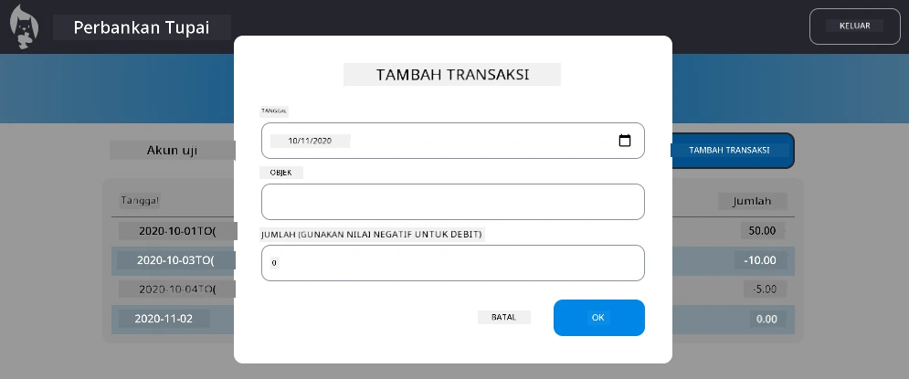

# Implementasi Dialog "Tambah Transaksi"

## Ikhtisar

Aplikasi perbankan Anda sekarang memiliki manajemen state dan penyimpanan data yang solid, tetapi masih kekurangan fitur penting yang dibutuhkan aplikasi perbankan nyata: kemampuan bagi pengguna untuk menambahkan transaksi mereka sendiri. Dalam tugas ini, Anda akan mengimplementasikan dialog "Tambah Transaksi" yang terintegrasi dengan sistem manajemen state yang sudah ada.

Tugas ini menggabungkan semua yang telah Anda pelajari dalam empat pelajaran perbankan: templating HTML, penanganan formulir, integrasi API, dan manajemen state.

## Tujuan Pembelajaran

Dengan menyelesaikan tugas ini, Anda akan:
- **Membuat** antarmuka dialog yang ramah pengguna untuk entri data
- **Mengimplementasikan** desain formulir yang aksesibel dengan dukungan keyboard dan pembaca layar
- **Mengintegrasikan** fitur baru dengan sistem manajemen state yang sudah ada
- **Berlatih** komunikasi API dan penanganan kesalahan
- **Menerapkan** pola pengembangan web modern pada fitur dunia nyata

## Instruksi

### Langkah 1: Tombol Tambah Transaksi

**Buat** tombol "Tambah Transaksi" di halaman dashboard Anda yang mudah ditemukan dan diakses oleh pengguna.

**Persyaratan:**
- **Letakkan** tombol di lokasi yang logis di dashboard
- **Gunakan** teks tombol yang jelas dan berorientasi pada tindakan
- **Gaya** tombol agar sesuai dengan desain UI yang sudah ada
- **Pastikan** tombol dapat diakses dengan keyboard

### Langkah 2: Implementasi Dialog

Pilih salah satu dari dua pendekatan berikut untuk mengimplementasikan dialog Anda:

**Opsi A: Halaman Terpisah**
- **Buat** template HTML baru untuk formulir transaksi
- **Tambahkan** rute baru ke sistem routing Anda
- **Implementasikan** navigasi ke dan dari halaman formulir

**Opsi B: Dialog Modal (Direkomendasikan)**
- **Gunakan** JavaScript untuk menampilkan/menyembunyikan dialog tanpa meninggalkan dashboard
- **Implementasikan** menggunakan properti [`hidden`](https://developer.mozilla.org/docs/Web/HTML/Global_attributes/hidden) atau kelas CSS
- **Buat** pengalaman pengguna yang mulus dengan manajemen fokus yang tepat

### Langkah 3: Implementasi Aksesibilitas

**Pastikan** dialog Anda memenuhi [standar aksesibilitas untuk dialog modal](https://developer.paciellogroup.com/blog/2018/06/the-current-state-of-modal-dialog-accessibility/):

**Navigasi Keyboard:**
- **Dukung** tombol Escape untuk menutup dialog
- **Perangkap** fokus di dalam dialog saat terbuka
- **Kembalikan** fokus ke tombol pemicu saat ditutup

**Dukungan Pembaca Layar:**
- **Tambahkan** label dan peran ARIA yang sesuai
- **Umumkan** pembukaan/penutupan dialog ke pembaca layar
- **Sediakan** label bidang formulir yang jelas dan pesan kesalahan

### Langkah 4: Pembuatan Formulir

**Desain** formulir HTML yang mengumpulkan data transaksi:

**Bidang Wajib:**
- **Tanggal**: Kapan transaksi terjadi
- **Deskripsi**: Untuk apa transaksi tersebut
- **Jumlah**: Nilai transaksi (positif untuk pendapatan, negatif untuk pengeluaran)

**Fitur Formulir:**
- **Validasi** input pengguna sebelum pengiriman
- **Sediakan** pesan kesalahan yang jelas untuk data yang tidak valid
- **Tambahkan** teks placeholder dan label yang membantu
- **Gaya** secara konsisten dengan desain yang sudah ada

### Langkah 5: Integrasi API

**Hubungkan** formulir Anda ke API backend:

**Langkah Implementasi:**
- **Tinjau** [spesifikasi API server](../api/README.md) untuk endpoint dan format data yang benar
- **Buat** data JSON dari input formulir Anda
- **Kirimkan** data ke API dengan penanganan kesalahan yang sesuai
- **Tampilkan** pesan keberhasilan/kegagalan kepada pengguna
- **Tangani** kesalahan jaringan dengan baik

### Langkah 6: Integrasi Manajemen State

**Perbarui** dashboard Anda dengan transaksi baru:

**Persyaratan Integrasi:**
- **Segarkan** data akun setelah transaksi berhasil ditambahkan
- **Perbarui** tampilan dashboard tanpa memuat ulang halaman
- **Pastikan** transaksi baru muncul segera
- **Pertahankan** konsistensi state yang tepat selama proses berlangsung

## Spesifikasi Teknis

**Detail Endpoint API:**
Lihat [dokumentasi API server](../api/README.md) untuk:
- Format JSON yang diperlukan untuk data transaksi
- Metode HTTP dan URL endpoint
- Format respons yang diharapkan
- Penanganan respons kesalahan

**Hasil yang Diharapkan:**
Setelah menyelesaikan tugas ini, aplikasi perbankan Anda harus memiliki fitur "Tambah Transaksi" yang berfungsi penuh dan terlihat profesional:

## Pengujian Implementasi Anda

**Pengujian Fungsional:**
1. **Verifikasi** tombol "Tambah Transaksi" terlihat jelas dan dapat diakses
2. **Uji** bahwa dialog terbuka dan tertutup dengan benar
3. **Konfirmasi** validasi formulir berfungsi untuk semua bidang yang diperlukan
4. **Periksa** bahwa transaksi yang berhasil muncul segera di dashboard
5. **Pastikan** penanganan kesalahan berfungsi untuk data yang tidak valid dan masalah jaringan

**Pengujian Aksesibilitas:**
1. **Navigasikan** seluruh alur hanya menggunakan keyboard
2. **Uji** dengan pembaca layar untuk memastikan pengumuman yang tepat
3. **Verifikasi** manajemen fokus berfungsi dengan benar
4. **Periksa** bahwa semua elemen formulir memiliki label yang sesuai

## Rubrik Evaluasi

| Kriteria | Unggul | Memadai | Perlu Perbaikan |
| -------- | ------- | -------- | ---------------- |
| **Fungsionalitas** | Fitur tambah transaksi berfungsi sempurna dengan pengalaman pengguna yang luar biasa dan mengikuti semua praktik terbaik dari pelajaran | Fitur tambah transaksi berfungsi dengan benar tetapi mungkin tidak mengikuti beberapa praktik terbaik atau memiliki masalah kecil dalam kegunaan | Fitur tambah transaksi sebagian berfungsi atau memiliki masalah kegunaan yang signifikan |
| **Kualitas Kode** | Kode terorganisir dengan baik, mengikuti pola yang sudah ditetapkan, mencakup penanganan kesalahan yang tepat, dan terintegrasi dengan baik dengan manajemen state yang ada | Kode berfungsi tetapi mungkin memiliki beberapa masalah organisasi atau pola yang tidak konsisten dengan kode yang ada | Kode memiliki masalah struktural yang signifikan atau tidak terintegrasi dengan baik dengan pola yang ada |
| **Aksesibilitas** | Dukungan navigasi keyboard penuh, kompatibilitas pembaca layar, dan mengikuti pedoman WCAG dengan manajemen fokus yang sangat baik | Fitur aksesibilitas dasar diimplementasikan tetapi mungkin kehilangan beberapa navigasi keyboard atau fitur pembaca layar | Pertimbangan aksesibilitas terbatas atau tidak ada yang diimplementasikan |
| **Pengalaman Pengguna** | Antarmuka yang intuitif, halus, dengan umpan balik yang jelas, interaksi yang lancar, dan tampilan profesional | Pengalaman pengguna yang baik dengan beberapa area untuk perbaikan dalam umpan balik atau desain visual | Pengalaman pengguna yang buruk dengan antarmuka yang membingungkan atau kurangnya umpan balik pengguna |

## Tantangan Tambahan (Opsional)

Setelah Anda menyelesaikan persyaratan dasar, pertimbangkan peningkatan berikut:

**Fitur yang Ditingkatkan:**
- **Tambahkan** kategori transaksi (makanan, transportasi, hiburan, dll.)
- **Implementasikan** validasi input dengan umpan balik waktu nyata
- **Buat** pintasan keyboard untuk pengguna yang mahir
- **Tambahkan** kemampuan pengeditan dan penghapusan transaksi

**Integrasi Lanjutan:**
- **Implementasikan** fungsi undo untuk transaksi yang baru ditambahkan
- **Tambahkan** impor transaksi massal dari file CSV
- **Buat** pencarian dan penyaringan transaksi
- **Implementasikan** fungsi ekspor data

Fitur opsional ini akan membantu Anda berlatih konsep pengembangan web yang lebih maju dan menciptakan aplikasi perbankan yang lebih lengkap!

---

**Penafian**:  
Dokumen ini telah diterjemahkan menggunakan layanan penerjemahan AI [Co-op Translator](https://github.com/Azure/co-op-translator). Meskipun kami berupaya untuk memberikan hasil yang akurat, harap diperhatikan bahwa terjemahan otomatis mungkin mengandung kesalahan atau ketidakakuratan. Dokumen asli dalam bahasa aslinya harus dianggap sebagai sumber yang otoritatif. Untuk informasi yang penting, disarankan menggunakan jasa penerjemahan manusia profesional. Kami tidak bertanggung jawab atas kesalahpahaman atau interpretasi yang keliru yang timbul dari penggunaan terjemahan ini.