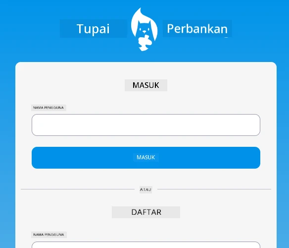

<!--
CO_OP_TRANSLATOR_METADATA:
{
  "original_hash": "830359535306594b448db6575ce5cdee",
  "translation_date": "2025-08-27T22:00:38+00:00",
  "source_file": "7-bank-project/README.md",
  "language_code": "id"
}
-->
# :dollar: Membangun Bank

Dalam proyek ini, Anda akan belajar cara membangun bank fiksi. Pelajaran ini mencakup instruksi tentang cara merancang aplikasi web dan menyediakan rute, membuat formulir, mengelola state, serta mengambil data dari API yang memungkinkan Anda mendapatkan data bank.

|  |  |
|--------------------------------|--------------------------------|

## Pelajaran

1. [Template HTML dan Rute dalam Aplikasi Web](1-template-route/README.md)
2. [Membangun Formulir Login dan Registrasi](2-forms/README.md)
3. [Metode Mengambil dan Menggunakan Data](3-data/README.md)
4. [Konsep Manajemen State](4-state-management/README.md)

### Kredit

Pelajaran ini ditulis dengan :hearts: oleh [Yohan Lasorsa](https://twitter.com/sinedied).

Jika Anda tertarik untuk belajar cara membangun [server API](/7-bank-project/api/README.md) yang digunakan dalam pelajaran ini, Anda dapat mengikuti [seri video ini](https://aka.ms/NodeBeginner) (khususnya video 17 hingga 21).

Anda juga dapat melihat [tutorial interaktif Learn](https://aka.ms/learn/express-api).

---

**Penafian**:  
Dokumen ini telah diterjemahkan menggunakan layanan penerjemahan AI [Co-op Translator](https://github.com/Azure/co-op-translator). Meskipun kami berupaya untuk memberikan hasil yang akurat, harap diperhatikan bahwa terjemahan otomatis mungkin mengandung kesalahan atau ketidakakuratan. Dokumen asli dalam bahasa aslinya harus dianggap sebagai sumber yang berwenang. Untuk informasi yang bersifat kritis, disarankan menggunakan jasa penerjemahan manusia profesional. Kami tidak bertanggung jawab atas kesalahpahaman atau penafsiran yang keliru yang timbul dari penggunaan terjemahan ini.