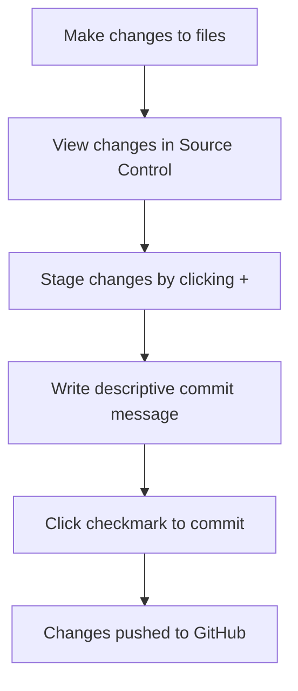

<!--
CO_OP_TRANSLATOR_METADATA:
{
  "original_hash": "cfd4a15974168ca426d50c67682ab9d4",
  "translation_date": "2025-10-24T13:58:18+00:00",
  "source_file": "8-code-editor/1-using-a-code-editor/README.md",
  "language_code": "id"
}
-->
# Menggunakan Editor Kode: Menguasai VSCode.dev

Ingat di *The Matrix* ketika Neo harus terhubung ke terminal komputer besar untuk mengakses dunia digital? Alat pengembangan web saat ini adalah cerita yang berlawanan – kemampuan yang sangat kuat dapat diakses dari mana saja. VSCode.dev adalah editor kode berbasis browser yang membawa alat pengembangan profesional ke perangkat apa pun dengan koneksi internet.

Seperti bagaimana mesin cetak membuat buku dapat diakses oleh semua orang, bukan hanya para penulis di biara, VSCode.dev mendemokratisasi pengkodean. Anda dapat mengerjakan proyek dari komputer perpustakaan, laboratorium sekolah, atau di mana saja Anda memiliki akses browser. Tidak perlu instalasi, tidak ada batasan "saya butuh pengaturan khusus saya".

Pada akhir pelajaran ini, Anda akan memahami cara menavigasi VSCode.dev, membuka repositori GitHub langsung di browser Anda, dan menggunakan Git untuk kontrol versi – semua keterampilan yang diandalkan oleh pengembang profesional setiap hari.

## Apa yang Akan Anda Pelajari

Setelah kita melalui ini bersama, Anda akan dapat:

- Menavigasi VSCode.dev seperti rumah kedua Anda – menemukan semua yang Anda butuhkan tanpa tersesat
- Membuka repositori GitHub langsung di browser Anda dan mulai mengedit segera (yang satu ini cukup ajaib!)
- Menggunakan Git untuk melacak perubahan Anda dan menyimpan kemajuan Anda seperti seorang profesional
- Memperkuat editor Anda dengan ekstensi yang membuat pengkodean lebih cepat dan menyenangkan
- Membuat dan mengatur file proyek dengan percaya diri

## Apa yang Anda Butuhkan

Persyaratannya sederhana:

- Akun [GitHub](https://github.com) gratis (kami akan memandu Anda melalui pembuatan jika diperlukan)
- Pemahaman dasar tentang browser web
- Pelajaran Dasar GitHub memberikan latar belakang yang berguna, meskipun tidak wajib

> 💡 **Baru di GitHub?** Membuat akun gratis dan hanya membutuhkan beberapa menit. Seperti bagaimana kartu perpustakaan memberi Anda akses ke buku di seluruh dunia, akun GitHub membuka pintu ke repositori kode di seluruh internet.

## Mengapa Editor Kode Berbasis Web Penting

Sebelum internet, para ilmuwan di universitas yang berbeda tidak dapat dengan mudah berbagi penelitian. Kemudian datang ARPANET pada tahun 1960-an, menghubungkan komputer di berbagai lokasi. Editor kode berbasis web mengikuti prinsip yang sama – membuat alat yang kuat dapat diakses terlepas dari lokasi fisik atau perangkat Anda.

Editor kode berfungsi sebagai ruang kerja pengembangan Anda, tempat Anda menulis, mengedit, dan mengatur file kode. Tidak seperti editor teks sederhana, editor kode profesional menyediakan penyorotan sintaks, deteksi kesalahan, dan fitur manajemen proyek.

VSCode.dev membawa kemampuan ini ke browser Anda:

**Keuntungan pengeditan berbasis web:**

| Fitur | Deskripsi | Manfaat Praktis |
|-------|-----------|-----------------|
| **Independensi Platform** | Berjalan di perangkat apa pun dengan browser | Bekerja dari komputer yang berbeda dengan lancar |
| **Tidak Perlu Instalasi** | Akses melalui URL web | Lewati pembatasan instalasi perangkat lunak |
| **Pembaruan Otomatis** | Selalu menjalankan versi terbaru | Akses fitur baru tanpa pembaruan manual |
| **Integrasi Repositori** | Koneksi langsung ke GitHub | Edit kode tanpa manajemen file lokal |

**Implikasi praktis:**
- Kelangsungan kerja di berbagai lingkungan
- Antarmuka yang konsisten terlepas dari sistem operasi
- Kemampuan kolaborasi langsung
- Pengurangan kebutuhan penyimpanan lokal

## Menjelajahi VSCode.dev

Seperti laboratorium Marie Curie yang berisi peralatan canggih di ruang yang relatif sederhana, VSCode.dev mengemas alat pengembangan profesional ke dalam antarmuka browser. Aplikasi web ini menyediakan fungsi inti yang sama seperti editor kode desktop.

Mulailah dengan menavigasi ke [vscode.dev](https://vscode.dev) di browser Anda. Antarmuka dimuat tanpa unduhan atau instalasi sistem – penerapan langsung prinsip komputasi awan.

### Menghubungkan Akun GitHub Anda

Seperti bagaimana telepon Alexander Graham Bell menghubungkan lokasi yang jauh, menghubungkan akun GitHub Anda menjembatani VSCode.dev dengan repositori kode Anda. Saat diminta untuk masuk dengan GitHub, disarankan untuk menerima koneksi ini.

**Integrasi GitHub menyediakan:**
- Akses langsung ke repositori Anda dalam editor
- Pengaturan dan ekstensi yang disinkronkan di berbagai perangkat
- Alur kerja penyimpanan yang disederhanakan ke GitHub
- Lingkungan pengembangan yang dipersonalisasi

### Mengenal Ruang Kerja Baru Anda

Setelah semuanya dimuat, Anda akan melihat ruang kerja yang bersih dan indah yang dirancang untuk membuat Anda fokus pada hal yang penting – kode Anda!

**Berikut tur lingkungan Anda:**
- **Activity Bar** (strip di sebelah kiri): Navigasi utama Anda dengan Explorer 📁, Pencarian 🔍, Kontrol Sumber 🌿, Ekstensi 🧩, dan Pengaturan ⚙️
- **Sidebar** (panel di sebelahnya): Berubah untuk menunjukkan informasi relevan berdasarkan apa yang Anda pilih
- **Area Editor** (ruang besar di tengah): Di sinilah keajaiban terjadi – area pengkodean utama Anda

**Luangkan waktu untuk menjelajahi:**
- Klik ikon Activity Bar dan lihat apa yang dilakukan masing-masing
- Perhatikan bagaimana sidebar memperbarui untuk menunjukkan informasi yang berbeda – cukup keren, bukan?
- Tampilan Explorer (📁) mungkin tempat Anda menghabiskan sebagian besar waktu Anda, jadi biasakan diri dengannya

## Membuka Repositori GitHub

Sebelum internet, peneliti harus secara fisik pergi ke perpustakaan untuk mengakses dokumen. Repositori GitHub bekerja dengan cara yang mirip – mereka adalah kumpulan kode yang disimpan secara remote. VSCode.dev menghilangkan langkah tradisional mengunduh repositori ke mesin lokal Anda sebelum mengedit.

Kemampuan ini memungkinkan akses langsung ke repositori publik mana pun untuk melihat, mengedit, atau berkontribusi. Berikut dua metode untuk membuka repositori:

### Metode 1: Cara Klik dan Pilih

Ini sempurna saat Anda memulai dari awal di VSCode.dev dan ingin membuka repositori tertentu. Ini sederhana dan ramah pemula:

**Cara melakukannya:**

1. Pergi ke [vscode.dev](https://vscode.dev) jika Anda belum ada di sana
2. Cari tombol "Open Remote Repository" di layar selamat datang dan klik

   

3. Tempelkan URL repositori GitHub apa pun (coba yang ini: `https://github.com/microsoft/Web-Dev-For-Beginners`)
4. Tekan Enter dan lihat keajaibannya!

**Tip pro - Pintasan Command Palette:**

Ingin merasa seperti penyihir pengkodean? Coba pintasan keyboard ini: Ctrl+Shift+P (atau Cmd+Shift+P di Mac) untuk membuka Command Palette:

**Command Palette seperti mesin pencari untuk semua yang bisa Anda lakukan:**
- Ketik "open remote" dan itu akan menemukan pembuka repositori untuk Anda
- Mengingat repositori yang baru saja Anda buka (sangat berguna!)
- Setelah Anda terbiasa, Anda akan merasa seperti mengkode dengan kecepatan kilat
- Ini pada dasarnya versi VSCode.dev dari "Hey Siri, tapi untuk pengkodean"

### Metode 2: Teknik Modifikasi URL

Seperti bagaimana HTTP dan HTTPS menggunakan protokol yang berbeda sambil mempertahankan struktur domain yang sama, VSCode.dev menggunakan pola URL yang mencerminkan sistem alamat GitHub. URL repositori GitHub mana pun dapat dimodifikasi untuk dibuka langsung di VSCode.dev.

**Pola transformasi URL:**

| Jenis Repositori | URL GitHub | URL VSCode.dev |
|------------------|------------|----------------|
| **Repositori Publik** | `github.com/microsoft/Web-Dev-For-Beginners` | `vscode.dev/github/microsoft/Web-Dev-For-Beginners` |
| **Proyek Pribadi** | `github.com/your-username/my-project` | `vscode.dev/github/your-username/my-project` |
| **Repositori yang Dapat Diakses** | `github.com/their-username/awesome-repo` | `vscode.dev/github/their-username/awesome-repo` |

**Implementasi:**
- Ganti `github.com` dengan `vscode.dev/github`
- Pertahankan semua komponen URL lainnya tidak berubah
- Berfungsi dengan repositori yang dapat diakses secara publik
- Memberikan akses pengeditan langsung

> 💡 **Tip yang mengubah hidup**: Tandai versi VSCode.dev dari repositori favorit Anda. Saya memiliki bookmark seperti "Edit Portofolio Saya" dan "Perbaiki Dokumentasi" yang membawa saya langsung ke mode pengeditan!

**Metode mana yang harus Anda gunakan?**
- **Cara antarmuka**: Bagus saat Anda menjelajah atau tidak ingat nama repositori yang tepat
- **Trik URL**: Sempurna untuk akses cepat saat Anda tahu persis ke mana Anda pergi

## Bekerja dengan File dan Proyek

Sekarang setelah Anda membuka repositori, mari mulai membangun! VSCode.dev memberi Anda semua yang Anda butuhkan untuk membuat, mengedit, dan mengatur file kode Anda. Anggap saja sebagai bengkel digital Anda – setiap alat ada di tempat yang Anda butuhkan.

Mari kita selami tugas sehari-hari yang akan menjadi bagian terbesar dari alur kerja pengkodean Anda.

### Membuat File Baru

Seperti mengatur cetak biru di kantor arsitek, pembuatan file di VSCode.dev mengikuti pendekatan terstruktur. Sistem ini mendukung semua jenis file pengembangan web standar.

**Proses pembuatan file:**

1. Navigasikan ke folder target di sidebar Explorer
2. Arahkan kursor ke nama folder untuk menampilkan ikon "New File" (📄+)
3. Masukkan nama file termasuk ekstensi yang sesuai (`style.css`, `script.js`, `index.html`)
4. Tekan Enter untuk membuat file

**Konvensi penamaan:**
- Gunakan nama deskriptif yang menunjukkan tujuan file
- Sertakan ekstensi file untuk penyorotan sintaks yang tepat
- Ikuti pola penamaan yang konsisten di seluruh proyek
- Gunakan huruf kecil dan tanda hubung daripada spasi

### Mengedit dan Menyimpan File

Di sinilah kesenangan sebenarnya dimulai! Editor VSCode.dev penuh dengan fitur yang membantu membuat pengkodean terasa lancar dan intuitif. Ini seperti memiliki asisten penulisan yang sangat pintar, tetapi untuk kode.

**Alur kerja pengeditan Anda:**

1. Klik file apa pun di Explorer untuk membukanya di area utama
2. Mulai mengetik dan lihat VSCode.dev membantu Anda dengan warna, saran, dan deteksi kesalahan
3. Simpan pekerjaan Anda dengan Ctrl+S (Windows/Linux) atau Cmd+S (Mac) – meskipun itu juga menyimpan secara otomatis!

**Hal keren yang terjadi saat Anda mengkode:**
- Kode Anda diberi warna sehingga mudah dibaca
- VSCode.dev menyarankan penyelesaian saat Anda mengetik (seperti autocorrect, tetapi jauh lebih pintar)
- Menangkap kesalahan dan typo sebelum Anda menyimpan
- Anda dapat memiliki beberapa file terbuka di tab, seperti di browser
- Semuanya disimpan secara otomatis di latar belakang

> ⚠️ **Tip cepat**: Meskipun auto-save sudah membantu Anda, menekan Ctrl+S atau Cmd+S tetap merupakan kebiasaan yang baik. Ini langsung menyimpan semuanya dan memicu beberapa fitur tambahan seperti pemeriksaan kesalahan.

### Kontrol Versi dengan Git

Seperti bagaimana arkeolog membuat catatan rinci tentang lapisan penggalian, Git melacak perubahan dalam kode Anda dari waktu ke waktu. Sistem ini menjaga sejarah proyek dan memungkinkan Anda untuk kembali ke versi sebelumnya jika diperlukan. VSCode.dev mencakup fungsionalitas Git yang terintegrasi.

**Antarmuka Kontrol Sumber:**

1. Akses panel Kontrol Sumber melalui ikon 🌿 di Activity Bar
2. File yang dimodifikasi muncul di bagian "Changes"
3. Kode warna menunjukkan jenis perubahan: hijau untuk penambahan, merah untuk penghapusan

**Menyimpan pekerjaan Anda (alur kerja commit):**

**Berikut langkah-langkahnya:**
- Klik ikon "+" di sebelah file yang ingin Anda simpan (ini "men-stage" mereka)
- Periksa ulang bahwa Anda puas dengan semua perubahan yang telah di-stage
- Tulis catatan singkat menjelaskan apa yang Anda lakukan (ini adalah "commit message" Anda)
- Klik tombol tanda centang untuk menyimpan semuanya ke GitHub
- Jika Anda berubah pikiran tentang sesuatu, ikon undo memungkinkan Anda membatalkan perubahan

**Menulis commit message yang baik (ini lebih mudah dari yang Anda pikirkan!):**
- Cukup jelaskan apa yang Anda lakukan, seperti "Menambahkan formulir kontak" atau "Memperbaiki navigasi yang rusak"
- Tetap singkat dan jelas – pikirkan panjang tweet, bukan esai
- Mulai dengan kata tindakan seperti "Menambahkan", "Memperbaiki", "Memperbarui", atau "Menghapus"
- **Contoh yang baik**: "Menambahkan menu navigasi responsif", "Memperbaiki masalah tata letak seluler", "Memperbarui warna untuk aksesibilitas yang lebih baik"

> 💡 **Tip navigasi cepat**: Gunakan menu hamburger (☰) di kiri atas untuk kembali ke repositori GitHub Anda dan melihat perubahan yang telah Anda commit secara online. Ini seperti portal antara lingkungan pengeditan Anda dan rumah proyek Anda di GitHub!

## Meningkatkan Fungsionalitas dengan Ekstensi

Seperti bengkel pengrajin yang berisi alat khusus untuk berbagai tugas, VSCode.dev dapat disesuaikan dengan ekstensi yang menambahkan kemampuan tertentu. Plugin yang dikembangkan komunitas ini menangani kebutuhan pengembangan umum seperti pemformatan kode, pratinjau langsung, dan integrasi Git yang ditingkatkan.

Marketplace ekstensi menampung ribuan alat gratis yang dibuat oleh pengembang di seluruh dunia. Setiap ekstensi menyelesaikan tantangan alur kerja tertentu, memungkinkan Anda membangun lingkungan pengembangan yang dipersonalisasi sesuai dengan kebutuhan dan preferensi spesifik Anda.

### Menemukan Ekstensi yang Tepat

Marketplace ekstensi sangat terorganisir, jadi Anda tidak akan tersesat mencoba menemukan apa yang Anda butuhkan. Ini dirancang untuk membantu Anda menemukan alat spesifik dan hal-hal keren yang bahkan tidak Anda ketahui sebelumnya!

**Menuju marketplace:**

1. Klik ikon Ekstensi (🧩) di Activity Bar
2. Jelajahi atau cari sesuatu yang spesifik
3. Klik apa pun yang terlihat menarik untuk mempelajari lebih lanjut tentangnya

**Apa yang akan Anda temukan di sana:**

| Bagian | Apa yang Ada di Dalamnya | Mengapa Ini Berguna |
|--------|--------------------------|---------------------|
| **Terinstal** | Ekstensi yang sudah Anda tambahkan | Toolkit pengkodean pribadi Anda |
| **Populer** | Favorit banyak orang | Apa yang paling direkomendasikan oleh pengembang |
| **Direkomendasikan** | Saran cerdas untuk proyek Anda | Rekomendasi berguna dari VSCode.dev |

**Apa yang membuat penjelajahan menjadi mudah:**
- Setiap ekstensi menampilkan penilaian, jumlah unduhan, dan ulasan dari pengguna nyata
- Anda mendapatkan tangkapan layar dan deskripsi jelas tentang apa yang dilakukan masing-masing ekstensi
- Semuanya ditandai dengan informasi kompatibilitas yang jelas
- Ekstensi serupa disarankan sehingga Anda dapat membandingkan opsi

### Menginstal Ekstensi (Sangat Mudah!)

Menambahkan kemampuan baru ke editor Anda semudah mengklik sebuah tombol. Ekstensi terinstal dalam hitungan detik dan langsung bekerja – tanpa restart, tanpa menunggu.

**Berikut langkah-langkahnya:**

1. Cari apa yang Anda inginkan (coba cari "live server" atau "prettier")
2. Klik salah satu yang terlihat bagus untuk melihat detail lebih lanjut
3. Baca apa yang dilakukan dan periksa penilaiannya
4. Tekan tombol biru "Install" dan selesai!

**Apa yang terjadi di balik layar:**
- Ekstensi diunduh dan diatur secara otomatis
- Fitur baru langsung muncul di antarmuka Anda
- Semuanya langsung bekerja (serius, secepat itu!)
- Jika Anda masuk, ekstensi akan disinkronkan ke semua perangkat Anda

**Beberapa ekstensi yang saya rekomendasikan untuk memulai:**
- **Live Server**: Lihat situs web Anda diperbarui secara real-time saat Anda menulis kode (ini luar biasa!)
- **Prettier**: Secara otomatis membuat kode Anda terlihat rapi dan profesional
- **Auto Rename Tag**: Ubah satu tag HTML dan pasangannya juga diperbarui
- **Bracket Pair Colorizer**: Memberi warna pada tanda kurung sehingga Anda tidak bingung
- **GitLens**: Memperkuat fitur Git Anda dengan banyak informasi berguna

### Menyesuaikan Ekstensi Anda

Sebagian besar ekstensi memiliki pengaturan yang dapat Anda sesuaikan agar bekerja sesuai keinginan Anda. Anggap saja seperti mengatur kursi dan kaca spion di mobil – setiap orang memiliki preferensi masing-masing!

**Menyesuaikan pengaturan ekstensi:**

1. Temukan ekstensi yang telah Anda instal di panel Ekstensi
2. Cari ikon roda gigi kecil (⚙️) di sebelah namanya dan klik
3. Pilih "Extension Settings" dari menu dropdown
4. Sesuaikan pengaturan hingga sesuai dengan alur kerja Anda

**Hal-hal umum yang mungkin ingin Anda sesuaikan:**
- Bagaimana kode Anda diformat (tab vs spasi, panjang baris, dll.)
- Kombinasi tombol keyboard untuk berbagai tindakan
- Jenis file yang harus didukung oleh ekstensi
- Mengaktifkan atau menonaktifkan fitur tertentu untuk menjaga kesederhanaan

### Mengatur Ekstensi Anda

Saat Anda menemukan lebih banyak ekstensi keren, Anda pasti ingin menjaga koleksi Anda tetap rapi dan berjalan lancar. VSCode.dev membuat ini sangat mudah untuk dikelola.

**Opsi pengelolaan ekstensi Anda:**

| Apa yang Bisa Dilakukan | Kapan Berguna | Tips |
|--------|---------|----------|
| **Disable** | Menguji apakah ekstensi menyebabkan masalah | Lebih baik daripada menghapus jika Anda mungkin ingin menggunakannya lagi |
| **Uninstall** | Menghapus ekstensi yang tidak Anda perlukan sepenuhnya | Menjaga lingkungan Anda tetap bersih dan cepat |
| **Update** | Mendapatkan fitur terbaru dan perbaikan bug | Biasanya terjadi secara otomatis, tetapi tetap perlu diperiksa |

**Cara saya mengelola ekstensi:**
- Setiap beberapa bulan, saya meninjau apa yang telah saya instal dan menghapus apa pun yang tidak saya gunakan
- Saya menjaga ekstensi tetap diperbarui agar mendapatkan peningkatan dan perbaikan keamanan terbaru
- Jika sesuatu terasa lambat, saya sementara menonaktifkan ekstensi untuk melihat apakah salah satu dari mereka adalah penyebabnya
- Saya membaca catatan pembaruan saat ekstensi mendapatkan pembaruan besar – kadang-kadang ada fitur baru yang keren!

> ⚠️ **Tips kinerja**: Ekstensi itu luar biasa, tetapi memiliki terlalu banyak dapat memperlambat kinerja. Fokuslah pada yang benar-benar membuat hidup Anda lebih mudah dan jangan ragu untuk menghapus yang tidak pernah Anda gunakan.

## Tantangan Agen GitHub Copilot 🚀

Seperti pendekatan terstruktur yang digunakan NASA untuk misi luar angkasa, tantangan ini melibatkan penerapan sistematis keterampilan VSCode.dev dalam skenario alur kerja yang lengkap.

**Tujuan:** Menunjukkan kemampuan dengan VSCode.dev dengan membangun alur kerja pengembangan web yang komprehensif.

**Persyaratan proyek:** Dengan bantuan mode Agen, selesaikan tugas-tugas berikut:
1. Fork repositori yang ada atau buat yang baru
2. Bangun struktur proyek yang fungsional dengan file HTML, CSS, dan JavaScript
3. Instal dan konfigurasikan tiga ekstensi yang meningkatkan pengembangan
4. Latih kontrol versi dengan pesan commit yang deskriptif
5. Bereksperimen dengan pembuatan dan modifikasi cabang fitur
6. Dokumentasikan proses dan pembelajaran dalam file README.md

Latihan ini menggabungkan semua konsep VSCode.dev ke dalam alur kerja praktis yang dapat diterapkan pada proyek pengembangan di masa depan.

Pelajari lebih lanjut tentang [mode agen](https://code.visualstudio.com/blogs/2025/02/24/introducing-copilot-agent-mode) di sini.

## Tugas

Saatnya menguji keterampilan ini secara nyata! Saya punya proyek langsung yang memungkinkan Anda mempraktikkan semua yang telah kita bahas: [Buat situs web resume menggunakan VSCode.dev](./assignment.md)

Tugas ini akan memandu Anda membangun situs web resume profesional sepenuhnya di browser Anda. Anda akan menggunakan semua fitur VSCode.dev yang telah kita eksplorasi, dan pada akhirnya, Anda akan memiliki situs web yang tampak hebat serta kepercayaan diri yang solid dalam alur kerja baru Anda.

## Terus Eksplorasi dan Tingkatkan Keterampilan Anda

Anda sudah memiliki dasar yang kuat sekarang, tetapi masih banyak hal keren lainnya untuk ditemukan! Berikut adalah beberapa sumber daya dan ide untuk membawa keterampilan VSCode.dev Anda ke tingkat berikutnya:

**Dokumentasi resmi yang layak untuk ditandai:**
- [Dokumentasi VSCode Web](https://code.visualstudio.com/docs/editor/vscode-web?WT.mc_id=academic-0000-alfredodeza) – Panduan lengkap untuk pengeditan berbasis browser
- [GitHub Codespaces](https://docs.github.com/en/codespaces) – Untuk saat Anda menginginkan lebih banyak kekuatan di cloud

**Fitur keren untuk dicoba selanjutnya:**
- **Keyboard Shortcuts**: Pelajari kombinasi tombol yang membuat Anda merasa seperti ninja coding
- **Workspace Settings**: Atur lingkungan yang berbeda untuk berbagai jenis proyek
- **Multi-root Workspaces**: Kerjakan beberapa repositori sekaligus (sangat berguna!)
- **Terminal Integration**: Akses alat baris perintah langsung di browser Anda

**Ide untuk berlatih:**
- Bergabunglah dengan beberapa proyek open-source dan berkontribusi menggunakan VSCode.dev – ini cara yang bagus untuk memberi kembali!
- Coba berbagai ekstensi untuk menemukan pengaturan yang sempurna
- Buat template proyek untuk jenis situs yang paling sering Anda bangun
- Latih alur kerja Git seperti branching dan merging – keterampilan ini sangat berharga dalam proyek tim

---

**Anda telah menguasai pengembangan berbasis browser!** 🎉 Seperti bagaimana penemuan instrumen portabel memungkinkan para ilmuwan melakukan penelitian di lokasi terpencil, VSCode.dev memungkinkan pengkodean profesional dari perangkat apa pun yang terhubung ke internet.

Keterampilan ini mencerminkan praktik industri saat ini – banyak pengembang profesional menggunakan lingkungan pengembangan berbasis cloud untuk fleksibilitas dan aksesibilitasnya. Anda telah mempelajari alur kerja yang dapat digunakan untuk proyek individu hingga kolaborasi tim besar.

Terapkan teknik-teknik ini pada proyek pengembangan Anda berikutnya! 🚀

---

**Penafian**:  
Dokumen ini telah diterjemahkan menggunakan layanan penerjemahan AI [Co-op Translator](https://github.com/Azure/co-op-translator). Meskipun kami berupaya untuk memberikan hasil yang akurat, harap diketahui bahwa terjemahan otomatis mungkin mengandung kesalahan atau ketidakakuratan. Dokumen asli dalam bahasa aslinya harus dianggap sebagai sumber yang otoritatif. Untuk informasi yang penting, disarankan menggunakan jasa penerjemahan manusia profesional. Kami tidak bertanggung jawab atas kesalahpahaman atau interpretasi yang keliru yang timbul dari penggunaan terjemahan ini.