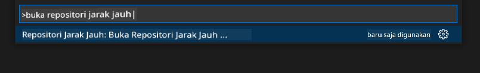
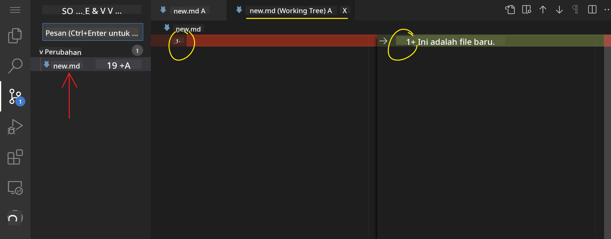
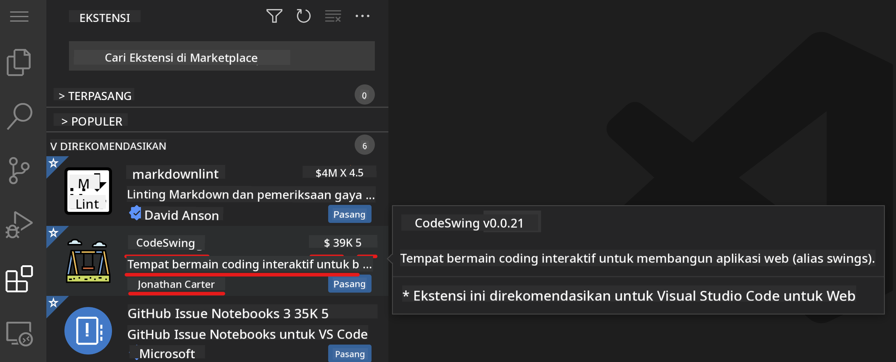

<!--
CO_OP_TRANSLATOR_METADATA:
{
  "original_hash": "1ba61d96a11309a2a6ea507496dcf7e5",
  "translation_date": "2025-08-29T09:16:01+00:00",
  "source_file": "8-code-editor/1-using-a-code-editor/README.md",
  "language_code": "id"
}
-->
# Menggunakan editor kode

Pelajaran ini membahas dasar-dasar penggunaan [VSCode.dev](https://vscode.dev), sebuah editor kode berbasis web, sehingga Anda dapat membuat perubahan pada kode dan berkontribusi pada proyek tanpa perlu menginstal apa pun di komputer Anda.

## Tujuan pembelajaran

Dalam pelajaran ini, Anda akan belajar bagaimana:

- Menggunakan editor kode dalam proyek kode
- Melacak perubahan dengan kontrol versi
- Menyesuaikan editor untuk pengembangan

### Prasyarat

Sebelum memulai, Anda perlu membuat akun di [GitHub](https://github.com). Kunjungi [GitHub](https://github.com/) dan buat akun jika Anda belum memilikinya.

### Pengantar

Editor kode adalah alat penting untuk menulis program dan berkolaborasi dalam proyek coding yang sudah ada. Setelah Anda memahami dasar-dasar editor dan cara memanfaatkan fiturnya, Anda dapat menerapkannya saat menulis kode.

## Memulai dengan VSCode.dev

[VSCode.dev](https://vscode.dev) adalah editor kode berbasis web. Anda tidak perlu menginstal apa pun untuk menggunakannya, seperti membuka situs web lainnya. Untuk memulai dengan editor ini, buka tautan berikut: [https://vscode.dev](https://vscode.dev). Jika Anda belum masuk ke [GitHub](https://github.com/), ikuti petunjuk untuk masuk atau buat akun baru, lalu masuk.

Setelah dimuat, tampilannya akan mirip dengan gambar berikut:


Ada tiga bagian utama, mulai dari kiri ke kanan:

1. _Activity bar_ yang mencakup beberapa ikon, seperti kaca pembesar 🔎, roda gigi ⚙️, dan beberapa lainnya.
2. _Side bar_ yang merupakan bagian yang diperluas dari activity bar, biasanya default ke _Explorer_.
3. Area kode di sebelah kanan.

Klik setiap ikon untuk menampilkan menu yang berbeda. Setelah selesai, klik _Explorer_ untuk kembali ke tempat semula.

Saat Anda mulai membuat kode atau memodifikasi kode yang sudah ada, itu akan terjadi di area terbesar di sebelah kanan. Anda juga akan menggunakan area ini untuk melihat kode yang sudah ada, yang akan Anda lakukan selanjutnya.

## Membuka repositori GitHub

Hal pertama yang perlu Anda lakukan adalah membuka repositori GitHub. Ada beberapa cara untuk membuka repositori. Di bagian ini, Anda akan melihat dua cara berbeda untuk membuka repositori sehingga Anda dapat mulai bekerja pada perubahan.

### 1. Dengan editor

Gunakan editor itu sendiri untuk membuka repositori jarak jauh. Jika Anda pergi ke [VSCode.dev](https://vscode.dev), Anda akan melihat tombol _"Open Remote Repository"_:


Anda juga dapat menggunakan _command palette_. _Command palette_ adalah kotak input tempat Anda dapat mengetik kata apa pun yang merupakan bagian dari perintah atau tindakan untuk menemukan perintah yang tepat untuk dijalankan. Gunakan menu di kiri atas, lalu pilih _View_, dan kemudian pilih _Command Palette_, atau gunakan pintasan keyboard berikut: Ctrl-Shift-P (di MacOS akan menjadi Command-Shift-P).



Setelah menu terbuka, ketik _open remote repository_, lalu pilih opsi pertama. Beberapa repositori yang Anda ikuti atau yang baru saja Anda buka akan muncul. Anda juga dapat menggunakan URL GitHub lengkap untuk memilih satu repositori. Gunakan URL berikut dan tempelkan ke dalam kotak:

```
https://github.com/microsoft/Web-Dev-For-Beginners
```

✅ Jika berhasil, Anda akan melihat semua file untuk repositori ini dimuat di editor teks.

### 2. Menggunakan URL

Anda juga dapat menggunakan URL langsung untuk memuat repositori. Misalnya, URL lengkap untuk repositori saat ini adalah [https://github.com/microsoft/Web-Dev-For-Beginners](https://github.com/microsoft/Web-Dev-For-Beginners), tetapi Anda dapat mengganti domain GitHub dengan `VSCode.dev/github` dan memuat repositori langsung. URL yang dihasilkan akan menjadi [https://vscode.dev/github/microsoft/Web-Dev-For-Beginners](https://vscode.dev/github/microsoft/Web-Dev-For-Beginners).

## Mengedit file

Setelah Anda membuka repositori di browser/vscode.dev, langkah berikutnya adalah membuat pembaruan atau perubahan pada proyek.

### 1. Membuat file baru

Anda dapat membuat file di dalam folder yang sudah ada, atau membuatnya di direktori/folder root. Untuk membuat file baru, buka lokasi/direktori tempat Anda ingin menyimpan file dan pilih ikon _'New file ...'_ di activity bar _(kiri)_, beri nama file tersebut, lalu tekan enter.


### 2. Mengedit dan menyimpan file di repositori

Menggunakan vscode.dev sangat berguna saat Anda ingin membuat pembaruan cepat pada proyek Anda tanpa harus memuat perangkat lunak secara lokal. Untuk memperbarui kode Anda, klik ikon 'Explorer', yang juga terletak di activity bar untuk melihat file & folder di repositori. Pilih file untuk membukanya di area kode, buat perubahan, lalu simpan.


Setelah Anda selesai memperbarui proyek Anda, pilih ikon _`source control`_ yang berisi semua perubahan baru yang telah Anda buat pada repositori Anda.

Untuk melihat perubahan yang Anda buat pada proyek, pilih file di folder `Changes` di _side bar_ yang diperluas. Ini akan membuka 'Working Tree' untuk Anda melihat secara visual perubahan yang Anda buat pada file. Warna merah menunjukkan penghapusan dari proyek, sedangkan warna hijau menunjukkan penambahan.



Jika Anda puas dengan perubahan yang Anda buat, arahkan kursor ke folder `Changes` dan klik tombol `+` untuk _stage_ perubahan. _Staging_ berarti mempersiapkan perubahan Anda untuk dikomit ke GitHub.

Jika Anda tidak nyaman dengan beberapa perubahan dan ingin membatalkannya, arahkan kursor ke folder `Changes` dan pilih ikon `undo`.

Kemudian, ketikkan `commit message` _(Deskripsi perubahan yang telah Anda buat pada proyek)_, klik ikon `check` untuk mengkomit dan mendorong perubahan Anda.

Setelah selesai bekerja pada proyek Anda, pilih ikon `hamburger menu` di kiri atas untuk kembali ke repositori di github.com.


## Menggunakan ekstensi

Menginstal ekstensi di VSCode memungkinkan Anda menambahkan fitur baru dan opsi lingkungan pengembangan yang disesuaikan pada editor Anda untuk meningkatkan alur kerja pengembangan Anda. Ekstensi ini juga membantu Anda menambahkan dukungan untuk berbagai bahasa pemrograman dan sering kali berupa ekstensi generik atau berbasis bahasa.

Untuk menjelajahi daftar semua ekstensi yang tersedia, klik ikon _`Extensions`_ di activity bar dan mulai mengetik nama ekstensi di bidang teks yang diberi label _'Search Extensions in Marketplace'_. Anda akan melihat daftar ekstensi, masing-masing berisi **nama ekstensi, nama penerbit, deskripsi singkat, jumlah unduhan**, dan **rating bintang**.



Anda juga dapat melihat semua ekstensi yang telah diinstal sebelumnya dengan memperluas folder _`Installed`_, ekstensi populer yang digunakan oleh sebagian besar pengembang di folder _`Popular`_, dan ekstensi yang direkomendasikan untuk Anda baik oleh pengguna di workspace yang sama atau berdasarkan file yang baru saja Anda buka di folder _`Recommended`_.


### 1. Menginstal ekstensi

Untuk menginstal ekstensi, ketik nama ekstensi di bidang pencarian dan klik untuk melihat informasi tambahan tentang ekstensi di area kode setelah muncul di _side bar_ yang diperluas.

Anda dapat mengklik tombol _install biru_ di _side bar_ yang diperluas untuk menginstal atau menggunakan tombol install yang muncul di area kode setelah Anda memilih ekstensi untuk memuat informasi tambahan.


### 2. Menyesuaikan ekstensi

Setelah menginstal ekstensi, Anda mungkin perlu memodifikasi perilakunya dan menyesuaikannya berdasarkan preferensi Anda. Untuk melakukannya, pilih ikon Extensions, dan kali ini, ekstensi Anda akan muncul di folder _Installed_, klik ikon _**Gear**_ dan navigasikan ke _Extensions Setting_.


### 3. Mengelola ekstensi

Setelah menginstal dan menggunakan ekstensi Anda, vscode.dev menawarkan opsi untuk mengelola ekstensi Anda berdasarkan kebutuhan yang berbeda. Misalnya, Anda dapat memilih untuk:

- **Menonaktifkan:** _(Anda dapat menonaktifkan ekstensi sementara saat Anda tidak membutuhkannya tetapi tidak ingin menghapusnya sepenuhnya)_

    Pilih ekstensi yang diinstal di _side bar_ yang diperluas > klik ikon Gear > pilih 'Disable' atau 'Disable (Workspace)' **ATAU** buka ekstensi di area kode dan klik tombol biru Disable.

- **Menghapus:** Pilih ekstensi yang diinstal di _side bar_ yang diperluas > klik ikon Gear > pilih 'Uninstall' **ATAU** buka ekstensi di area kode dan klik tombol biru Uninstall.

---

## Tugas

[Buat situs web resume menggunakan vscode.dev](https://github.com/microsoft/Web-Dev-For-Beginners/blob/main/8-code-editor/1-using-a-code-editor/assignment.md)

## Tinjauan & Studi Mandiri

Baca lebih lanjut tentang [VSCode.dev](https://code.visualstudio.com/docs/editor/vscode-web?WT.mc_id=academic-0000-alfredodeza) dan beberapa fitur lainnya.

---

**Penafian**:  
Dokumen ini telah diterjemahkan menggunakan layanan penerjemahan AI [Co-op Translator](https://github.com/Azure/co-op-translator). Meskipun kami berusaha untuk memberikan hasil yang akurat, harap diketahui bahwa terjemahan otomatis mungkin mengandung kesalahan atau ketidakakuratan. Dokumen asli dalam bahasa aslinya harus dianggap sebagai sumber yang otoritatif. Untuk informasi yang bersifat kritis, disarankan menggunakan jasa penerjemahan profesional oleh manusia. Kami tidak bertanggung jawab atas kesalahpahaman atau penafsiran yang keliru yang timbul dari penggunaan terjemahan ini.