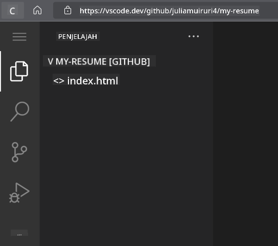
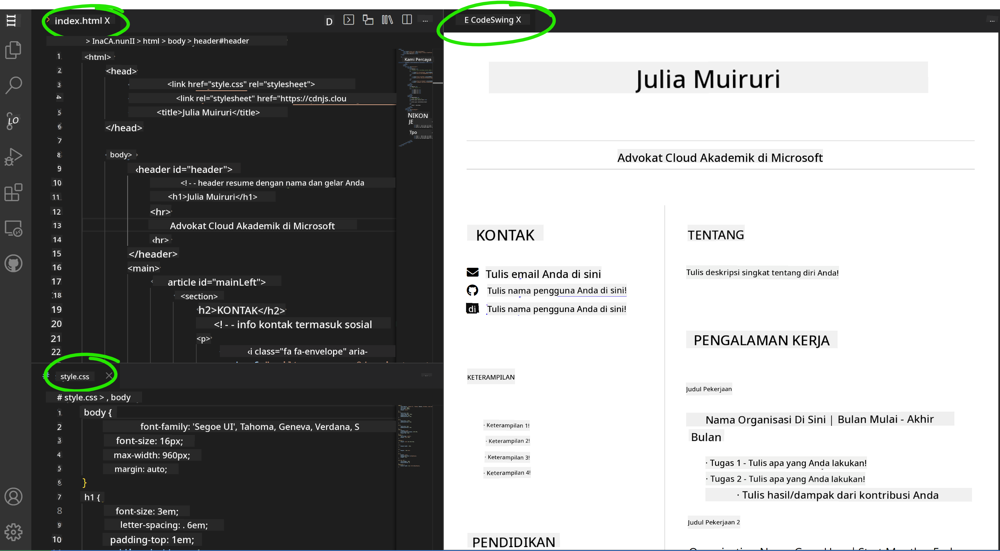

<!--
CO_OP_TRANSLATOR_METADATA:
{
  "original_hash": "bd3aa6d2b879c30ea496c43aec1c49ed",
  "translation_date": "2025-08-29T09:16:31+00:00",
  "source_file": "8-code-editor/1-using-a-code-editor/assignment.md",
  "language_code": "id"
}
-->
# Membuat Website Resume menggunakan vscode.dev

_Betapa kerennya jika seorang perekrut meminta resume Anda dan Anda mengirimkan mereka sebuah URL?_ 😎

## Tujuan

Setelah menyelesaikan tugas ini, Anda akan belajar bagaimana:

- Membuat sebuah website untuk menampilkan resume Anda

### Prasyarat

1. Akun GitHub. Kunjungi [GitHub](https://github.com/) dan buat akun jika Anda belum memilikinya.

## Langkah-langkah

**Langkah 1:** Buat Repository GitHub baru dan beri nama `my-resume`

**Langkah 2:** Buat file `index.html` di repository Anda. Kita akan menambahkan setidaknya satu file saat masih di github.com karena Anda tidak dapat membuka repository kosong di vscode.dev.

Klik tautan `creating a new file`, ketik nama `index.html` dan pilih tombol `Commit new file`.


**Langkah 3:** Buka [VSCode.dev](https://vscode.dev) dan pilih tombol `Open Remote Repository`.

Salin URL repository yang baru saja Anda buat untuk situs resume Anda dan tempelkan di kotak input:

_Ganti `your-username` dengan nama pengguna GitHub Anda_

```
https://github.com/your-username/my-resume
```

✅ Jika berhasil, Anda akan melihat proyek Anda dan file index.html terbuka di editor teks di browser.



**Langkah 4:** Buka file `index.html`, tempelkan kode di bawah ini ke area kode Anda, lalu simpan.

<details>
    <summary><b>Kode HTML yang bertanggung jawab atas konten di situs resume Anda.</b></summary>
    
        <html>

            <head>
                <link href="style.css" rel="stylesheet">
                <link rel="stylesheet" href="https://cdnjs.cloudflare.com/ajax/libs/font-awesome/5.15.4/css/all.min.css">
                <title>Nama Anda di Sini!</title>
            </head>
            <body>
                <header id="header">
                    <!-- header resume dengan nama dan jabatan Anda -->
                    <h1>Nama Anda di Sini!</h1>
                    <hr>
                    Peran Anda!
                    <hr>
                </header>
                <main>
                    <article id="mainLeft">
                        <section>
                            <h2>KONTAK</h2>
                            <!-- informasi kontak termasuk media sosial -->
                            <p>
                                <i class="fa fa-envelope" aria-hidden="true"></i>
                                <a href="mailto:username@domain.top-level domain">Tulis email Anda di sini</a>
                            </p>
                            <p>
                                <i class="fab fa-github" aria-hidden="true"></i>
                                <a href="github.com/yourGitHubUsername">Tulis username Anda di sini!</a>
                            </p>
                            <p>
                                <i class="fab fa-linkedin" aria-hidden="true"></i>
                                <a href="linkedin.com/yourLinkedInUsername">Tulis username Anda di sini!</a>
                            </p>
                        </section>
                        <section>
                            <h2>KEMAMPUAN</h2>
                            <!-- kemampuan Anda -->
                            <ul>
                                <li>Kemampuan 1!</li>
                                <li>Kemampuan 2!</li>
                                <li>Kemampuan 3!</li>
                                <li>Kemampuan 4!</li>
                            </ul>
                        </section>
                        <section>
                            <h2>PENDIDIKAN</h2>
                            <!-- pendidikan Anda -->
                            <h3>Tulis jurusan Anda di sini!</h3>
                            <p>
                                Tulis institusi Anda di sini!
                            </p>
                            <p>
                                Tanggal Mulai - Tanggal Selesai
                            </p>
                        </section>            
                    </article>
                    <article id="mainRight">
                        <section>
                            <h2>TENTANG</h2>
                            <!-- tentang Anda -->
                            <p>Tulis deskripsi singkat tentang diri Anda!</p>
                        </section>
                        <section>
                            <h2>PENGALAMAN KERJA</h2>
                            <!-- pengalaman kerja Anda -->
                            <h3>Judul Pekerjaan</h3>
                            <p>
                                Nama Organisasi di Sini | Bulan Mulai – Bulan Selesai
                            </p>
                            <ul>
                                    <li>Tugas 1 - Tulis apa yang Anda lakukan!</li>
                                    <li>Tugas 2 - Tulis apa yang Anda lakukan!</li>
                                    <li>Tulis hasil/kontribusi dari pekerjaan Anda</li>
                                    
                            </ul>
                            <h3>Judul Pekerjaan 2</h3>
                            <p>
                                Nama Organisasi di Sini | Bulan Mulai – Bulan Selesai
                            </p>
                            <ul>
                                    <li>Tugas 1 - Tulis apa yang Anda lakukan!</li>
                                    <li>Tugas 2 - Tulis apa yang Anda lakukan!</li>
                                    <li>Tulis hasil/kontribusi dari pekerjaan Anda</li>
                                    
                            </ul>
                        </section>
                    </article>
                </main>
            </body>
        </html>
</details>

Tambahkan detail resume Anda untuk menggantikan _teks placeholder_ pada kode HTML.

**Langkah 5:** Arahkan kursor ke folder My-Resume, klik ikon `New File ...` dan buat 2 file baru di proyek Anda: file `style.css` dan `codeswing.json`.

**Langkah 6:** Buka file `style.css`, tempelkan kode di bawah ini, lalu simpan.

<details>
        <summary><b>Kode CSS untuk mengatur tata letak situs.</b></summary>
            
            body {
                font-family: 'Segoe UI', Tahoma, Geneva, Verdana, sans-serif;
                font-size: 16px;
                max-width: 960px;
                margin: auto;
            }
            h1 {
                font-size: 3em;
                letter-spacing: .6em;
                padding-top: 1em;
                padding-bottom: 1em;
            }

            h2 {
                font-size: 1.5em;
                padding-bottom: 1em;
            }

            h3 {
                font-size: 1em;
                padding-bottom: 1em;
            }
            main { 
                display: grid;
                grid-template-columns: 40% 60%;
                margin-top: 3em;
            }
            header {
                text-align: center;
                margin: auto 2em;
            }

            section {
                margin: auto 1em 4em 2em;
            }

            i {
                margin-right: .5em;
            }

            p {
                margin: .2em auto
            }

            hr {
                border: none;
                background-color: lightgray;
                height: 1px;
            }

            h1, h2, h3 {
                font-weight: 100;
                margin-bottom: 0;
            }
            #mainLeft {
                border-right: 1px solid lightgray;
            }
            
</details>

**Langkah 6:** Buka file `codeswing.json`, tempelkan kode di bawah ini, lalu simpan.

    {
    "scripts": [],
    "styles": []
    }

**Langkah 7:** Instal ekstensi `Codeswing` untuk melihat pratinjau situs resume di area kode.

Klik ikon _`Extensions`_ di bilah aktivitas dan ketik Codeswing. Klik tombol _install_ biru di bilah aktivitas yang diperluas untuk menginstal atau gunakan tombol install yang muncul di area kode setelah Anda memilih ekstensi untuk memuat informasi tambahan. Segera setelah menginstal ekstensi, perhatikan perubahan pada proyek Anda di area kode 😃


Inilah yang akan Anda lihat di layar setelah menginstal ekstensi.



Jika Anda puas dengan perubahan yang telah dibuat, arahkan kursor ke folder `Changes` dan klik tombol `+` untuk menandai perubahan.

Ketik pesan commit _(Deskripsi perubahan yang telah Anda buat pada proyek)_ dan commit perubahan Anda dengan mengklik `check`. Setelah selesai mengerjakan proyek Anda, pilih ikon menu hamburger di kiri atas untuk kembali ke repository di GitHub.

Selamat 🎉 Anda baru saja membuat situs resume menggunakan vscode.dev dalam beberapa langkah.

## 🚀 Tantangan

Buka repository jarak jauh yang Anda miliki izin untuk membuat perubahan dan perbarui beberapa file. Selanjutnya, coba buat cabang baru dengan perubahan Anda dan buat Pull Request.

## Tinjauan & Studi Mandiri

Baca lebih lanjut tentang [VSCode.dev](https://code.visualstudio.com/docs/editor/vscode-web?WT.mc_id=academic-0000-alfredodeza) dan beberapa fitur lainnya.

---

**Penafian**:  
Dokumen ini telah diterjemahkan menggunakan layanan terjemahan AI [Co-op Translator](https://github.com/Azure/co-op-translator). Meskipun kami berupaya untuk memberikan hasil yang akurat, harap diperhatikan bahwa terjemahan otomatis mungkin mengandung kesalahan atau ketidakakuratan. Dokumen asli dalam bahasa aslinya harus dianggap sebagai sumber yang berwenang. Untuk informasi yang bersifat kritis, disarankan menggunakan jasa terjemahan manusia profesional. Kami tidak bertanggung jawab atas kesalahpahaman atau penafsiran yang keliru yang timbul dari penggunaan terjemahan ini.