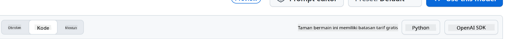
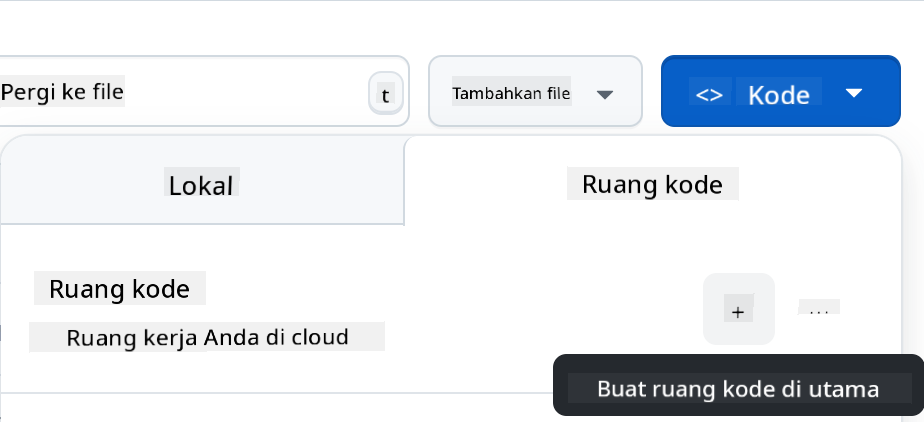

<!--
CO_OP_TRANSLATOR_METADATA:
{
  "original_hash": "11cf36165c243947b6cd85b88cf6faa6",
  "translation_date": "2025-09-01T16:58:51+00:00",
  "source_file": "9-chat-project/README.md",
  "language_code": "id"
}
-->
# Proyek Chat

Proyek chat ini menunjukkan cara membangun Asisten Chat menggunakan GitHub Models.

Berikut adalah tampilan proyek yang sudah selesai:


Sebagai konteks, membangun asisten chat menggunakan AI generatif adalah cara yang bagus untuk mulai belajar tentang AI. Dalam pelajaran ini, Anda akan belajar cara mengintegrasikan AI generatif ke dalam aplikasi web. Mari kita mulai.

## Menghubungkan ke AI Generatif

Untuk backend, kita menggunakan GitHub Models. Ini adalah layanan yang luar biasa yang memungkinkan Anda menggunakan AI secara gratis. Kunjungi playground-nya dan ambil kode yang sesuai dengan bahasa backend pilihan Anda. Berikut adalah tampilan [GitHub Models Playground](https://github.com/marketplace/models/azure-openai/gpt-4o-mini/playground).


Seperti yang disebutkan, pilih tab "Code" dan runtime pilihan Anda.



### Menggunakan Python

Dalam kasus ini, kita memilih Python, yang berarti kita menggunakan kode berikut:

```python
"""Run this model in Python

> pip install openai
"""
import os
from openai import OpenAI

# To authenticate with the model you will need to generate a personal access token (PAT) in your GitHub settings. 
# Create your PAT token by following instructions here: https://docs.github.com/en/authentication/keeping-your-account-and-data-secure/managing-your-personal-access-tokens
client = OpenAI(
    base_url="https://models.github.ai/inference",
    api_key=os.environ["GITHUB_TOKEN"],
)

response = client.chat.completions.create(
    messages=[
        {
            "role": "system",
            "content": "",
        },
        {
            "role": "user",
            "content": "What is the capital of France?",
        }
    ],
    model="openai/gpt-4o-mini",
    temperature=1,
    max_tokens=4096,
    top_p=1
)

print(response.choices[0].message.content)
```

Mari kita bersihkan kode ini agar lebih dapat digunakan kembali:

```python
def call_llm(prompt: str, system_message: str):
    response = client.chat.completions.create(
        messages=[
            {
                "role": "system",
                "content": system_message,
            },
            {
                "role": "user",
                "content": prompt,
            }
        ],
        model="openai/gpt-4o-mini",
        temperature=1,
        max_tokens=4096,
        top_p=1
    )

    return response.choices[0].message.content
```

Dengan fungsi `call_llm` ini, kita dapat mengambil prompt dan sistem prompt, lalu fungsi ini akan mengembalikan hasilnya.

### Kustomisasi Asisten AI

Jika Anda ingin mengkustomisasi asisten AI, Anda dapat menentukan bagaimana Anda ingin asisten tersebut berperilaku dengan mengisi sistem prompt seperti ini:

```python
call_llm("Tell me about you", "You're Albert Einstein, you only know of things in the time you were alive")
```

## Mengeksposnya melalui Web API

Bagus, bagian AI sudah selesai. Sekarang mari kita lihat bagaimana kita dapat mengintegrasikannya ke dalam Web API. Untuk Web API, kita memilih menggunakan Flask, tetapi framework web lainnya juga bisa digunakan. Berikut adalah kode untuk itu:

### Menggunakan Python

```python
# api.py
from flask import Flask, request, jsonify
from llm import call_llm
from flask_cors import CORS

app = Flask(__name__)
CORS(app)   # *   example.com

@app.route("/", methods=["GET"])
def index():
    return "Welcome to this API. Call POST /hello with 'message': 'my message' as JSON payload"


@app.route("/hello", methods=["POST"])
def hello():
    # get message from request body  { "message": "do this taks for me" }
    data = request.get_json()
    message = data.get("message", "")

    response = call_llm(message, "You are a helpful assistant.")
    return jsonify({
        "response": response
    })

if __name__ == "__main__":
    app.run(host="0.0.0.0", port=5000)
```

Di sini, kita membuat API Flask dan mendefinisikan rute default "/" dan "/chat". Rute "/chat" dimaksudkan untuk digunakan oleh frontend kita untuk mengirimkan pertanyaan.

Untuk mengintegrasikan *llm.py*, berikut yang perlu kita lakukan:

- Impor fungsi `call_llm`:

   ```python
   from llm import call_llm
   from flask import Flask, request
   ```

- Panggil fungsi tersebut dari rute "/chat":

   ```python
   @app.route("/hello", methods=["POST"])
   def hello():
      # get message from request body  { "message": "do this taks for me" }
      data = request.get_json()
      message = data.get("message", "")

      response = call_llm(message, "You are a helpful assistant.")
      return jsonify({
         "response": response
      })
   ```

   Di sini kita mem-parsing permintaan yang masuk untuk mengambil properti `message` dari body JSON. Setelah itu, kita memanggil LLM dengan panggilan ini:

   ```python
   response = call_llm(message, "You are a helpful assistant")

   # return the response as JSON
   return jsonify({
      "response": response 
   })
   ```

Bagus, sekarang kita sudah menyelesaikan apa yang diperlukan.

## Konfigurasi Cors

Kita perlu menyebutkan bahwa kita mengatur sesuatu seperti CORS, cross-origin resource sharing. Ini berarti karena backend dan frontend kita akan berjalan di port yang berbeda, kita perlu mengizinkan frontend untuk memanggil backend.

### Menggunakan Python

Ada potongan kode di *api.py* yang mengatur ini:

```python
from flask_cors import CORS

app = Flask(__name__)
CORS(app)   # *   example.com
```

Saat ini, pengaturan ini memungkinkan "*" yang berarti semua asal, dan ini agak tidak aman. Kita harus membatasinya saat masuk ke produksi.

## Menjalankan Proyek Anda

Untuk menjalankan proyek Anda, Anda perlu memulai backend terlebih dahulu, lalu frontend Anda.

### Menggunakan Python

Baik, kita memiliki *llm.py* dan *api.py*. Bagaimana kita membuat ini bekerja dengan backend? Ada dua hal yang perlu kita lakukan:

- Instal dependensi:

   ```sh
   cd backend
   python -m venv venv
   source ./venv/bin/activate

   pip install openai flask flask-cors openai
   ```

- Mulai API

   ```sh
   python api.py
   ```

   Jika Anda menggunakan Codespaces, Anda perlu pergi ke Ports di bagian bawah editor, klik kanan di atasnya, lalu klik "Port Visibility" dan pilih "Public".

### Mengerjakan Frontend

Sekarang kita memiliki API yang berjalan, mari kita buat frontend untuk ini. Frontend minimum yang akan kita tingkatkan secara bertahap. Di folder *frontend*, buat hal berikut:

```text
backend/
frontend/
index.html
app.js
styles.css
```

Mari kita mulai dengan **index.html**:

```html
<html>
    <head>
        <link rel="stylesheet" href="styles.css">
    </head>
    <body>
      <form>
        <textarea id="messages"></textarea>
        <input id="input" type="text" />
        <button type="submit" id="sendBtn">Send</button>  
      </form>  
      <script src="app.js" />
    </body>
</html>    
```

Di atas adalah minimum absolut yang Anda butuhkan untuk mendukung jendela chat, karena terdiri dari textarea tempat pesan akan ditampilkan, input untuk mengetik pesan, dan tombol untuk mengirim pesan Anda ke backend. Selanjutnya, mari kita lihat JavaScript di *app.js*.

**app.js**

```js
// app.js

(function(){
  // 1. set up elements  
  const messages = document.getElementById("messages");
  const form = document.getElementById("form");
  const input = document.getElementById("input");

  const BASE_URL = "change this";
  const API_ENDPOINT = `${BASE_URL}/hello`;

  // 2. create a function that talks to our backend
  async function callApi(text) {
    const response = await fetch(API_ENDPOINT, {
      method: "POST",
      headers: { "Content-Type": "application/json" },
      body: JSON.stringify({ message: text })
    });
    let json = await response.json();
    return json.response;
  }

  // 3. add response to our textarea
  function appendMessage(text, role) {
    const el = document.createElement("div");
    el.className = `message ${role}`;
    el.innerHTML = text;
    messages.appendChild(el);
  }

  // 4. listen to submit events
  form.addEventListener("submit", async(e) => {
    e.preventDefault();
   // someone clicked the button in the form
   
   // get input
   const text = input.value.trim();

   appendMessage(text, "user")

   // reset it
   input.value = '';

   const reply = await callApi(text);

   // add to messages
   appendMessage(reply, "assistant");

  })
})();
```

Mari kita bahas kode per bagian:

- 1) Di sini kita mendapatkan referensi ke semua elemen yang akan kita gunakan nanti dalam kode.
- 2) Di bagian ini, kita membuat fungsi yang menggunakan metode bawaan `fetch` untuk memanggil backend kita.
- 3) `appendMessage` membantu menambahkan respons serta apa yang Anda ketik sebagai pengguna.
- 4) Di sini kita mendengarkan event submit, membaca input field, menempatkan pesan pengguna di textarea, memanggil API, dan menampilkan respons di textarea.

Selanjutnya, mari kita lihat styling. Di sini Anda bisa berkreasi dan membuatnya sesuai keinginan Anda, tetapi berikut adalah beberapa saran:

**styles.css**

```
.message {
    background: #222;
    box-shadow: 0 0 0 10px orange;
    padding: 10px:
    margin: 5px;
}

.message.user {
    background: blue;
}

.message.assistant {
    background: grey;
} 
```

Dengan tiga kelas ini, Anda akan menata pesan secara berbeda tergantung dari mana asalnya, apakah dari asisten atau Anda sebagai pengguna. Jika Anda ingin terinspirasi, lihat folder `solution/frontend/styles.css`.

### Ubah Base Url

Ada satu hal yang belum kita atur, yaitu `BASE_URL`. Ini tidak diketahui sampai backend Anda berjalan. Untuk mengaturnya:

- Jika Anda menjalankan API secara lokal, itu harus diatur ke sesuatu seperti `http://localhost:5000`.
- Jika dijalankan di Codespaces, itu harus terlihat seperti "[name]app.github.dev".

## Tugas

Buat folder Anda sendiri *project* dengan konten seperti ini:

```text
project/
  frontend/
    index.html
    app.js
    styles.css
  backend/
    ...
```

Salin konten dari instruksi di atas, tetapi jangan ragu untuk menyesuaikannya sesuai keinginan Anda.

## Solusi

[Solusi](./solution/README.md)

## Bonus

Cobalah mengubah kepribadian asisten AI.

### Untuk Python

Saat Anda memanggil `call_llm` di *api.py*, Anda dapat mengubah argumen kedua sesuai keinginan Anda, misalnya:

```python
call_llm(message, "You are Captain Picard")
```

### Frontend

Ubah juga CSS dan teks sesuai keinginan Anda, jadi lakukan perubahan di *index.html* dan *styles.css*.

## Ringkasan

Bagus, Anda telah belajar dari awal cara membuat asisten pribadi menggunakan AI. Kita telah melakukannya menggunakan GitHub Models, backend dalam Python, dan frontend dalam HTML, CSS, dan JavaScript.

## Pengaturan dengan Codespaces

- Navigasikan ke: [Repo Web Dev For Beginners](https://github.com/microsoft/Web-Dev-For-Beginners)
- Buat dari template (pastikan Anda sudah login ke GitHub) di pojok kanan atas:

    

- Setelah berada di repo Anda, buat Codespace:

    

    Ini akan memulai lingkungan yang sekarang dapat Anda gunakan.

---

**Penafian**:  
Dokumen ini telah diterjemahkan menggunakan layanan penerjemahan AI [Co-op Translator](https://github.com/Azure/co-op-translator). Meskipun kami berusaha untuk memberikan hasil yang akurat, harap diketahui bahwa terjemahan otomatis mungkin mengandung kesalahan atau ketidakakuratan. Dokumen asli dalam bahasa aslinya harus dianggap sebagai sumber yang otoritatif. Untuk informasi yang bersifat kritis, disarankan menggunakan jasa penerjemahan profesional oleh manusia. Kami tidak bertanggung jawab atas kesalahpahaman atau penafsiran yang keliru yang timbul dari penggunaan terjemahan ini.