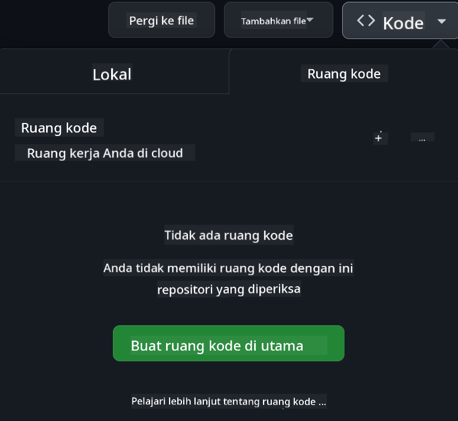

<!--
CO_OP_TRANSLATOR_METADATA:
{
  "original_hash": "63e29f5a308b533df9d70336bbb2e2b8",
  "translation_date": "2025-11-18T17:04:55+00:00",
  "source_file": "README.md",
  "language_code": "id"
}
-->
[](https://github.com/microsoft/Web-Dev-For-Beginners/blob/master/LICENSE)
[](https://GitHub.com/microsoft/Web-Dev-For-Beginners/graphs/contributors/)
[](https://GitHub.com/microsoft/Web-Dev-For-Beginners/issues/)
[](https://GitHub.com/microsoft/Web-Dev-For-Beginners/pulls/)
[](http://makeapullrequest.com)

[](https://GitHub.com/microsoft/Web-Dev-For-Beginners/watchers/)
[](https://GitHub.com/microsoft/Web-Dev-For-Beginners/network/)
[](https://GitHub.com/microsoft/Web-Dev-For-Beginners/stargazers/)

[](https://discord.gg/nTYy5BXMWG)

# Pengembangan Web untuk Pemula - Kurikulum

Pelajari dasar-dasar pengembangan web dengan kursus 12 minggu yang komprehensif dari Microsoft Cloud Advocates. Setiap dari 24 pelajaran membahas JavaScript, CSS, dan HTML melalui proyek langsung seperti terrarium, ekstensi browser, dan permainan luar angkasa. Ikuti kuis, diskusi, dan tugas praktis. Tingkatkan keterampilan Anda dan optimalkan pemahaman Anda dengan pendekatan berbasis proyek yang efektif. Mulailah perjalanan coding Anda hari ini!

Bergabunglah dengan Komunitas Discord Azure AI Foundry

[](https://discord.gg/nTYy5BXMWG)

Ikuti langkah-langkah ini untuk mulai menggunakan sumber daya ini:
1. **Fork Repository**: Klik [](https://GitHub.com/microsoft/Web-Dev-For-Beginners/fork)
2. **Clone Repository**:   `git clone https://github.com/microsoft/Web-Dev-For-Beginners.git`
3. [**Bergabunglah dengan Azure AI Foundry Discord dan temui para ahli serta pengembang lainnya**](https://discord.com/invite/ByRwuEEgH4)

### 🌐 Dukungan Multi-Bahasa

#### Didukung melalui GitHub Action (Otomatis & Selalu Terbaru)

<!-- TABEL BAHASA PENERJEMAH CO-OP MULAI -->
[Arab](../ar/README.md) | [Bengali](../bn/README.md) | [Bulgaria](../bg/README.md) | [Burma (Myanmar)](../my/README.md) | [Cina (Sederhana)](../zh/README.md) | [Cina (Tradisional, Hong Kong)](../hk/README.md) | [Cina (Tradisional, Makau)](../mo/README.md) | [Cina (Tradisional, Taiwan)](../tw/README.md) | [Kroasia](../hr/README.md) | [Ceko](../cs/README.md) | [Denmark](../da/README.md) | [Belanda](../nl/README.md) | [Estonia](../et/README.md) | [Finlandia](../fi/README.md) | [Prancis](../fr/README.md) | [Jerman](../de/README.md) | [Yunani](../el/README.md) | [Ibrani](../he/README.md) | [Hindi](../hi/README.md) | [Hungaria](../hu/README.md) | [Indonesia](./README.md) | [Italia](../it/README.md) | [Jepang](../ja/README.md) | [Korea](../ko/README.md) | [Lituania](../lt/README.md) | [Melayu](../ms/README.md) | [Marathi](../mr/README.md) | [Nepali](../ne/README.md) | [Norwegia](../no/README.md) | [Persia (Farsi)](../fa/README.md) | [Polandia](../pl/README.md) | [Portugis (Brasil)](../br/README.md) | [Portugis (Portugal)](../pt/README.md) | [Punjabi (Gurmukhi)](../pa/README.md) | [Rumania](../ro/README.md) | [Rusia](../ru/README.md) | [Serbia (Kiril)](../sr/README.md) | [Slovakia](../sk/README.md) | [Slovenia](../sl/README.md) | [Spanyol](../es/README.md) | [Swahili](../sw/README.md) | [Swedia](../sv/README.md) | [Tagalog (Filipina)](../tl/README.md) | [Tamil](../ta/README.md) | [Thai](../th/README.md) | [Turki](../tr/README.md) | [Ukraina](../uk/README.md) | [Urdu](../ur/README.md) | [Vietnam](../vi/README.md)
<!-- TABEL BAHASA PENERJEMAH CO-OP SELESAI -->

**Jika Anda ingin menambahkan dukungan bahasa tambahan, bahasa yang didukung tercantum [di sini](https://github.com/Azure/co-op-translator/blob/main/getting_started/supported-languages.md)**

[](https://open.vscode.dev/microsoft/Web-Dev-For-Beginners)

#### 🧑‍🎓 _Apakah Anda seorang pelajar?_

Kunjungi [**Halaman Student Hub**](https://docs.microsoft.com/learn/student-hub/?WT.mc_id=academic-77807-sagibbon) di mana Anda akan menemukan sumber daya untuk pemula, paket pelajar, dan bahkan cara mendapatkan voucher sertifikat gratis. Halaman ini adalah yang perlu Anda tandai dan periksa dari waktu ke waktu karena kami mengganti konten setiap bulan.

### 📣 Pengumuman - Tantangan mode Agen GitHub Copilot baru untuk diselesaikan!

Tantangan baru ditambahkan, cari "Tantangan Agen GitHub Copilot 🚀" di sebagian besar bab. Itu adalah tantangan baru untuk Anda selesaikan menggunakan GitHub Copilot dan mode Agen. Jika Anda belum pernah menggunakan mode Agen sebelumnya, mode ini tidak hanya mampu menghasilkan teks tetapi juga dapat membuat dan mengedit file, menjalankan perintah, dan lainnya.

### 📣 Pengumuman - _Proyek Baru untuk dibangun menggunakan Generative AI_

Proyek Asisten AI baru saja ditambahkan, lihat [proyek](./09-chat-project/README.md)

### 📣 Pengumuman - _Kurikulum Baru_ tentang Generative AI untuk JavaScript baru saja dirilis

Jangan lewatkan kurikulum Generative AI baru kami!

Kunjungi [https://aka.ms/genai-js-course](https://aka.ms/genai-js-course) untuk memulai!


- Pelajaran mencakup segalanya dari dasar hingga RAG.
- Berinteraksi dengan karakter sejarah menggunakan GenAI dan aplikasi pendamping kami.
- Narasi yang menyenangkan dan menarik, Anda akan melakukan perjalanan waktu!


Setiap pelajaran mencakup tugas untuk diselesaikan, pemeriksaan pengetahuan, dan tantangan untuk memandu Anda mempelajari topik seperti:
- Prompting dan rekayasa prompt
- Pembuatan aplikasi teks dan gambar
- Aplikasi pencarian

Kunjungi [https://aka.ms/genai-js-course](../../[https:/aka.ms/genai-js-course) untuk memulai!


## 🌱 Memulai

> **Guru**, kami telah [menyertakan beberapa saran](for-teachers.md) tentang cara menggunakan kurikulum ini. Kami ingin mendengar masukan Anda [di forum diskusi kami](https://github.com/microsoft/Web-Dev-For-Beginners/discussions/categories/teacher-corner)!

**[Pelajar](https://aka.ms/student-page/?WT.mc_id=academic-77807-sagibbon)**, untuk setiap pelajaran, mulailah dengan kuis pra-kuliah dan lanjutkan dengan membaca materi kuliah, menyelesaikan berbagai aktivitas, dan periksa pemahaman Anda dengan kuis pasca-kuliah.

Untuk meningkatkan pengalaman belajar Anda, terhubunglah dengan teman-teman Anda untuk mengerjakan proyek bersama! Diskusi sangat dianjurkan di [forum diskusi kami](https://github.com/microsoft/Web-Dev-For-Beginners/discussions) di mana tim moderator kami akan tersedia untuk menjawab pertanyaan Anda.

Untuk melanjutkan pendidikan Anda, kami sangat merekomendasikan menjelajahi [Microsoft Learn](https://learn.microsoft.com/users/wirelesslife/collections/p1ddcy5jwy0jkm?WT.mc_id=academic-77807-sagibbon) untuk bahan belajar tambahan.

### 📋 Menyiapkan lingkungan Anda

Kurikulum ini memiliki lingkungan pengembangan yang siap digunakan! Saat Anda memulai, Anda dapat memilih untuk menjalankan kurikulum di [Codespace](https://github.com/features/codespaces/) (_lingkungan berbasis browser, tidak perlu instalasi_), atau secara lokal di komputer Anda menggunakan editor teks seperti [Visual Studio Code](https://code.visualstudio.com/?WT.mc_id=academic-77807-sagibbon).

#### Buat repository Anda
Agar Anda dapat dengan mudah menyimpan pekerjaan Anda, disarankan untuk membuat salinan repository ini. Anda dapat melakukannya dengan mengklik tombol **Use this template** di bagian atas halaman. Ini akan membuat repository baru di akun GitHub Anda dengan salinan kurikulum.

Ikuti langkah-langkah ini:
1. **Fork Repository**: Klik tombol "Fork" di sudut kanan atas halaman ini.
2. **Clone Repository**:   `git clone https://github.com/microsoft/Web-Dev-For-Beginners.git`

#### Menjalankan kurikulum di Codespace

Di salinan repository Anda yang telah dibuat, klik tombol **Code** dan pilih **Open with Codespaces**. Ini akan membuat Codespace baru untuk Anda bekerja.



#### Menjalankan kurikulum secara lokal di komputer Anda

Untuk menjalankan kurikulum ini secara lokal di komputer Anda, Anda akan membutuhkan editor teks, browser, dan alat baris perintah. Pelajaran pertama kami, [Pengenalan Bahasa Pemrograman dan Alat yang Digunakan](../../1-getting-started-lessons/1-intro-to-programming-languages), akan memandu Anda melalui berbagai opsi untuk masing-masing alat ini agar Anda dapat memilih yang paling sesuai untuk Anda.

Rekomendasi kami adalah menggunakan [Visual Studio Code](https://code.visualstudio.com/?WT.mc_id=academic-77807-sagibbon) sebagai editor Anda, yang juga memiliki [Terminal](https://code.visualstudio.com/docs/terminal/basics/?WT.mc_id=academic-77807-sagibbon) bawaan. Anda dapat mengunduh Visual Studio Code [di sini](https://code.visualstudio.com/?WT.mc_id=academic-77807-sagibbon).

1. Clone repository Anda ke komputer Anda. Anda dapat melakukannya dengan mengklik tombol **Code** dan menyalin URL:

    [CodeSpace](./images/createcodespace.png)

    Kemudian, buka [Terminal](https://code.visualstudio.com/docs/terminal/basics/?WT.mc_id=academic-77807-sagibbon) di dalam [Visual Studio Code](https://code.visualstudio.com/?WT.mc_id=academic-77807-sagibbon) dan jalankan perintah berikut, mengganti `<your-repository-url>` dengan URL yang baru saja Anda salin:

    ```bash 
    git clone <your-repository-url>
    ```

2. Buka folder di Visual Studio Code. Anda dapat melakukannya dengan mengklik **File** > **Open Folder** dan memilih folder yang baru saja Anda clone.


>  Rekomendasi ekstensi Visual Studio Code:
>
> * [Live Server](https://marketplace.visualstudio.com/items?itemName=ritwickdey.LiveServer&WT.mc_id=academic-77807-sagibbon) - untuk melihat pratinjau halaman HTML di dalam Visual Studio Code
> * [Copilot](https://marketplace.visualstudio.com/items?itemName=GitHub.copilot&WT.mc_id=academic-77807-sagibbon) - untuk membantu Anda menulis kode lebih cepat

## 📂 Setiap pelajaran mencakup:

- sketchnote opsional
- video tambahan opsional
- kuis pemanasan sebelum pelajaran
- pelajaran tertulis
- untuk pelajaran berbasis proyek, panduan langkah demi langkah tentang cara membangun proyek
- pemeriksaan pengetahuan
- tantangan
- bacaan tambahan
- tugas
- [kuis setelah pelajaran](https://ff-quizzes.netlify.app/web/)

> **Catatan tentang kuis**: Semua kuis terdapat di folder Quiz-app, total 48 kuis dengan masing-masing tiga pertanyaan. Kuis tersedia [di sini](https://ff-quizzes.netlify.app/web/) dan aplikasi kuis dapat dijalankan secara lokal atau di-deploy ke Azure; ikuti instruksi di folder `quiz-app`.

## 🗃️ Pelajaran

|     |                       Nama Proyek                       |                            Konsep yang Diajarkan                             | Tujuan Pembelajaran                                                                                                                 |                                                         Tautan Pelajaran                                                          |         Penulis          |
| :-: | :------------------------------------------------------: | :--------------------------------------------------------------------------: | ----------------------------------------------------------------------------------------------------------------------------------- | :-------------------------------------------------------------------------------------------------------------------------------: | :----------------------: |
| 01  |                     Memulai                      |           Pengantar Pemrograman dan Alat yang Digunakan           | Pelajari dasar-dasar di balik sebagian besar bahasa pemrograman dan perangkat lunak yang membantu pengembang profesional bekerja | [Pengantar Bahasa Pemrograman dan Alat yang Digunakan](./1-getting-started-lessons/1-intro-to-programming-languages/README.md) |         Jasmine         |
| 02  |                     Memulai                      |             Dasar-dasar GitHub, termasuk bekerja dalam tim             | Cara menggunakan GitHub dalam proyek Anda, cara berkolaborasi dengan orang lain pada basis kode                                                    |                            [Pengantar GitHub](./1-getting-started-lessons/2-github-basics/README.md)                             |          Floor          |
| 03  |                     Memulai                      |                             Aksesibilitas                              | Pelajari dasar-dasar aksesibilitas web                                                                                               |                       [Dasar-dasar Aksesibilitas](./1-getting-started-lessons/3-accessibility/README.md)                       |       Christopher       |
| 04  |                        Dasar JS                         |                         Tipe Data JavaScript                          | Dasar-dasar tipe data JavaScript                                                                                                 |                                       [Tipe Data](./2-js-basics/1-data-types/README.md)                                        |         Jasmine         |
| 05  |                        Dasar JS                         |                         Fungsi dan Metode                          | Pelajari tentang fungsi dan metode untuk mengelola alur logika aplikasi                                                             |                              [Fungsi dan Metode](./2-js-basics/2-functions-methods/README.md)                               | Jasmine dan Christopher |
| 06  |                        Dasar JS                         |                        Membuat Keputusan dengan JS                        | Pelajari cara membuat kondisi dalam kode Anda menggunakan metode pengambilan keputusan                                                           |                                 [Membuat Keputusan](./2-js-basics/3-making-decisions/README.md)                                  |         Jasmine         |
| 07  |                        Dasar JS                         |                            Array dan Loop                            | Bekerja dengan data menggunakan array dan loop dalam JavaScript                                                                                 |                                   [Array dan Loop](./2-js-basics/4-arrays-loops/README.md)                                    |         Jasmine         |
| 08  |       [Terrarium](./3-terrarium/solution/README.md)       |                            HTML dalam Praktik                            | Bangun HTML untuk membuat terrarium online, dengan fokus pada membangun tata letak                                                         |                                 [Pengantar HTML](./3-terrarium/1-intro-to-html/README.md)                                 |           Jen           |
| 09  |       [Terrarium](./3-terrarium/solution/README.md)       |                            CSS dalam Praktik                             | Bangun CSS untuk menata terrarium online, dengan fokus pada dasar-dasar CSS termasuk membuat halaman responsif                     |                                  [Pengantar CSS](./3-terrarium/2-intro-to-css/README.md)                                  |           Jen           |
| 10  |            [Terrarium](./3-terrarium/solution/README.md)            |                 Penutupan JavaScript, manipulasi DOM                  | Bangun JavaScript untuk membuat terrarium berfungsi sebagai antarmuka seret/lepas, dengan fokus pada penutupan dan manipulasi DOM             |                  [Penutupan JavaScript, manipulasi DOM](./3-terrarium/3-intro-to-DOM-and-closures/README.md)                   |           Jen           |
| 11  |          [Typing Game](./4-typing-game/solution/README.md)          |                          Membangun Game Mengetik                           | Pelajari cara menggunakan peristiwa keyboard untuk menggerakkan logika aplikasi JavaScript Anda                                                          |                                [Pemrograman Berbasis Peristiwa](./4-typing-game/typing-game/README.md)                                |       Christopher       |
| 12  | [Green Browser Extension](./5-browser-extension/solution/README.md) |                         Bekerja dengan Browser                          | Pelajari cara kerja browser, sejarahnya, dan cara membuat elemen pertama dari ekstensi browser                               |                               [Tentang Browser](./5-browser-extension/1-about-browsers/README.md)                                |           Jen           |
| 13  | [Green Browser Extension](./5-browser-extension/solution/README.md) | Membangun formulir, memanggil API, dan menyimpan variabel di penyimpanan lokal | Bangun elemen JavaScript dari ekstensi browser Anda untuk memanggil API menggunakan variabel yang disimpan di penyimpanan lokal                      |                [API, Formulir, dan Penyimpanan Lokal](./5-browser-extension/2-forms-browsers-local-storage/README.md)                 |           Jen           |
| 14  | [Green Browser Extension](./5-browser-extension/solution/README.md) |          Proses latar belakang di browser, kinerja web          | Gunakan proses latar belakang browser untuk mengelola ikon ekstensi; pelajari tentang kinerja web dan beberapa optimasi untuk meningkatkan   |             [Tugas Latar Belakang dan Kinerja](./5-browser-extension/3-background-tasks-and-performance/README.md)              |           Jen           |
| 15  |           [Space Game](./6-space-game/solution/README.md)           |             Pengembangan Game Lanjutan dengan JavaScript             | Pelajari tentang Pewarisan menggunakan Kelas dan Komposisi serta pola Pub/Sub, sebagai persiapan untuk membangun game              |                      [Pengantar Pengembangan Game Lanjutan](./6-space-game/1-introduction/README.md)                       |          Chris          |
| 16  |           [Space Game](./6-space-game/solution/README.md)           |                           Menggambar ke kanvas                            | Pelajari tentang API Kanvas, yang digunakan untuk menggambar elemen ke layar                                                                       |                                [Menggambar ke Kanvas](./6-space-game/2-drawing-to-canvas/README.md)                                |          Chris          |
| 17  |           [Space Game](./6-space-game/solution/README.md)           |                   Memindahkan elemen di layar                    | Temukan cara elemen dapat bergerak menggunakan koordinat kartesian dan API Kanvas                                            |                           [Memindahkan Elemen](./6-space-game/3-moving-elements-around/README.md)                           |          Chris          |
| 18  |           [Space Game](./6-space-game/solution/README.md)           |                          Deteksi tabrakan                           | Buat elemen bertabrakan dan bereaksi satu sama lain menggunakan penekanan tombol dan sediakan fungsi cooldown untuk memastikan kinerja game    |                              [Deteksi Tabrakan](./6-space-game/4-collision-detection/README.md)                              |          Chris          |
| 19  |           [Space Game](./6-space-game/solution/README.md)           |                             Menjaga skor                              | Lakukan perhitungan matematika berdasarkan status dan kinerja game                                                                |                                    [Menjaga Skor](./6-space-game/5-keeping-score/README.md)                                    |          Chris          |
| 20  |           [Space Game](./6-space-game/solution/README.md)           |                     Mengakhiri dan memulai ulang game                     | Pelajari tentang mengakhiri dan memulai ulang game, termasuk membersihkan aset dan mengatur ulang nilai variabel                              |                                [Kondisi Akhir](./6-space-game/6-end-condition/README.md)                                 |          Chris          |
| 21  |         [Banking App](./7-bank-project/solution/README.md)          |                 Template HTML dan Rute dalam Aplikasi Web                 | Pelajari cara membuat kerangka arsitektur situs web multipage menggunakan routing dan template HTML                             |                            [Template HTML dan Rute](./7-bank-project/1-template-route/README.md)                             |          Yohan          |
| 22  |         [Banking App](./7-bank-project/solution/README.md)          |                  Membangun Formulir Login dan Registrasi                   | Pelajari tentang membangun formulir dan menangani rutinitas validasi                                                                          |                                           [Formulir](./7-bank-project/2-forms/README.md)                                           |          Yohan          |
| 23  |         [Banking App](./7-bank-project/solution/README.md)          |                   Metode Mengambil dan Menggunakan Data                   | Bagaimana data mengalir masuk dan keluar dari aplikasi Anda, cara mengambilnya, menyimpannya, dan membuangnya                                                 |                                            [Data](./7-bank-project/3-data/README.md)                                            |          Yohan          |
| 24  |         [Banking App](./7-bank-project/solution/README.md)          |                      Konsep Manajemen Status                      | Pelajari cara aplikasi Anda mempertahankan status dan cara mengelolanya secara programatis                                                              |                                [Manajemen Status](./7-bank-project/4-state-management/README.md)                                |          Yohan          |
| 25 | [Browser/VScode Code](../../8-code-editor) | Bekerja dengan VScode | Pelajari cara menggunakan editor kode | [Gunakan Editor Kode VScode](./8-code-editor/1-using-a-code-editor/README.md) | Chris |
| 26 | [AI Assistants](./9-chat-project/README.md) | Bekerja dengan AI | Pelajari cara membangun asisten AI Anda sendiri | [Proyek Asisten AI](./9-chat-project/README.md) | Chris |

## 🏫 Pedagogi

Kurikulum kami dirancang dengan dua prinsip pedagogi utama:
* pembelajaran berbasis proyek
* kuis yang sering

Program ini mengajarkan dasar-dasar JavaScript, HTML, dan CSS, serta alat dan teknik terbaru yang digunakan oleh pengembang web saat ini. Siswa akan memiliki kesempatan untuk mengembangkan pengalaman langsung dengan membangun game mengetik, terrarium virtual, ekstensi browser ramah lingkungan, game bergaya space-invader, dan aplikasi perbankan untuk bisnis. Pada akhir seri, siswa akan memiliki pemahaman yang solid tentang pengembangan web.

> 🎓 Anda dapat mengikuti beberapa pelajaran pertama dalam kurikulum ini sebagai [Jalur Belajar](https://docs.microsoft.com/learn/paths/web-development-101/?WT.mc_id=academic-77807-sagibbon) di Microsoft Learn!

Dengan memastikan bahwa konten selaras dengan proyek, proses pembelajaran menjadi lebih menarik bagi siswa dan retensi konsep akan meningkat. Kami juga menulis beberapa pelajaran pengantar dalam dasar-dasar JavaScript untuk memperkenalkan konsep, dipasangkan dengan video dari koleksi tutorial video "[Seri Pemula: JavaScript](https://channel9.msdn.com/Series/Beginners-Series-to-JavaScript/?WT.mc_id=academic-77807-sagibbon)", beberapa penulisnya berkontribusi pada kurikulum ini.

Selain itu, kuis dengan risiko rendah sebelum kelas menetapkan niat siswa untuk mempelajari topik, sementara kuis kedua setelah kelas memastikan retensi lebih lanjut. Kurikulum ini dirancang agar fleksibel dan menyenangkan serta dapat diambil secara keseluruhan atau sebagian. Proyek dimulai dari yang kecil dan menjadi semakin kompleks pada akhir siklus 12 minggu.

Meskipun kami sengaja menghindari memperkenalkan kerangka kerja JavaScript untuk berkonsentrasi pada keterampilan dasar yang diperlukan sebagai pengembang web sebelum mengadopsi kerangka kerja, langkah selanjutnya yang baik setelah menyelesaikan kurikulum ini adalah mempelajari tentang Node.js melalui koleksi video lainnya: "[Seri Pemula: Node.js](https://channel9.msdn.com/Series/Beginners-Series-to-Nodejs/?WT.mc_id=academic-77807-sagibbon)".

> Kunjungi [Kode Etik](CODE_OF_CONDUCT.md) dan pedoman [Kontribusi](CONTRIBUTING.md) kami. Kami menyambut umpan balik konstruktif Anda!


## 🧭 Akses offline

Anda dapat menjalankan dokumentasi ini secara offline dengan menggunakan [Docsify](https://docsify.js.org/#/). Fork repositori ini, [instal Docsify](https://docsify.js.org/#/quickstart) di mesin lokal Anda, lalu di folder root repositori ini, ketik `docsify serve`. Situs web akan disajikan di port 3000 di localhost Anda: `localhost:3000`.

## 📘 PDF

PDF dari semua pelajaran dapat ditemukan [di sini](https://microsoft.github.io/Web-Dev-For-Beginners/pdf/readme.pdf).


## 🎒 Kursus Lainnya

Tim kami juga memproduksi kursus lainnya! Lihat:

<!-- CO-OP TRANSLATOR OTHER COURSES START -->
### Azure / Edge / MCP / Agen
[](https://github.com/microsoft/AZD-for-beginners?WT.mc_id=academic-105485-koreyst)
[](https://github.com/microsoft/edgeai-for-beginners?WT.mc_id=academic-105485-koreyst)  
[](https://github.com/microsoft/mcp-for-beginners?WT.mc_id=academic-105485-koreyst)  
[](https://github.com/microsoft/ai-agents-for-beginners?WT.mc_id=academic-105485-koreyst)  

---

### Seri AI Generatif  
[](https://github.com/microsoft/generative-ai-for-beginners?WT.mc_id=academic-105485-koreyst)  
[-9333EA?style=for-the-badge&labelColor=E5E7EB&color=9333EA)](https://github.com/microsoft/Generative-AI-for-beginners-dotnet?WT.mc_id=academic-105485-koreyst)  
[-C084FC?style=for-the-badge&labelColor=E5E7EB&color=C084FC)](https://github.com/microsoft/generative-ai-for-beginners-java?WT.mc_id=academic-105485-koreyst)  
[-E879F9?style=for-the-badge&labelColor=E5E7EB&color=E879F9)](https://github.com/microsoft/generative-ai-with-javascript?WT.mc_id=academic-105485-koreyst)  

---

### Pembelajaran Inti  
[](https://aka.ms/ml-beginners?WT.mc_id=academic-105485-koreyst)  
[](https://aka.ms/datascience-beginners?WT.mc_id=academic-105485-koreyst)  
[](https://aka.ms/ai-beginners?WT.mc_id=academic-105485-koreyst)  
[](https://github.com/microsoft/Security-101?WT.mc_id=academic-96948-sayoung)  
[](https://aka.ms/webdev-beginners?WT.mc_id=academic-105485-koreyst)  
[](https://aka.ms/iot-beginners?WT.mc_id=academic-105485-koreyst)  
[](https://github.com/microsoft/xr-development-for-beginners?WT.mc_id=academic-105485-koreyst)  

---

### Seri Copilot  
[](https://aka.ms/GitHubCopilotAI?WT.mc_id=academic-105485-koreyst)  
[](https://github.com/microsoft/mastering-github-copilot-for-dotnet-csharp-developers?WT.mc_id=academic-105485-koreyst)  
[](https://github.com/microsoft/CopilotAdventures?WT.mc_id=academic-105485-koreyst)  

## Mendapatkan Bantuan  

Jika Anda mengalami kesulitan atau memiliki pertanyaan tentang membangun aplikasi AI, bergabunglah dengan sesama pelajar dan pengembang berpengalaman dalam diskusi tentang MCP. Ini adalah komunitas yang mendukung di mana pertanyaan diterima dan pengetahuan dibagikan secara bebas.  

[](https://discord.gg/nTYy5BXMWG)  

Jika Anda memiliki masukan produk atau menemukan kesalahan saat membangun, kunjungi:  

[](https://aka.ms/foundry/forum)  

## Lisensi  

Repositori ini dilisensikan di bawah lisensi MIT. Lihat file [LICENSE](../../LICENSE) untuk informasi lebih lanjut.  

---

<!-- CO-OP TRANSLATOR DISCLAIMER START -->
**Penafian**:  
Dokumen ini telah diterjemahkan menggunakan layanan penerjemahan AI [Co-op Translator](https://github.com/Azure/co-op-translator). Meskipun kami berupaya untuk memberikan hasil yang akurat, harap diketahui bahwa terjemahan otomatis dapat mengandung kesalahan atau ketidakakuratan. Dokumen asli dalam bahasa aslinya harus dianggap sebagai sumber yang otoritatif. Untuk informasi yang bersifat kritis, disarankan menggunakan jasa penerjemahan manusia profesional. Kami tidak bertanggung jawab atas kesalahpahaman atau penafsiran yang timbul dari penggunaan terjemahan ini.
<!-- CO-OP TRANSLATOR DISCLAIMER END -->