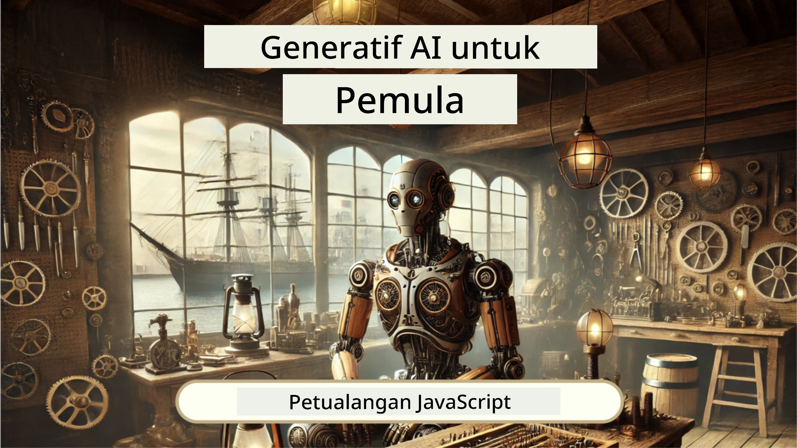
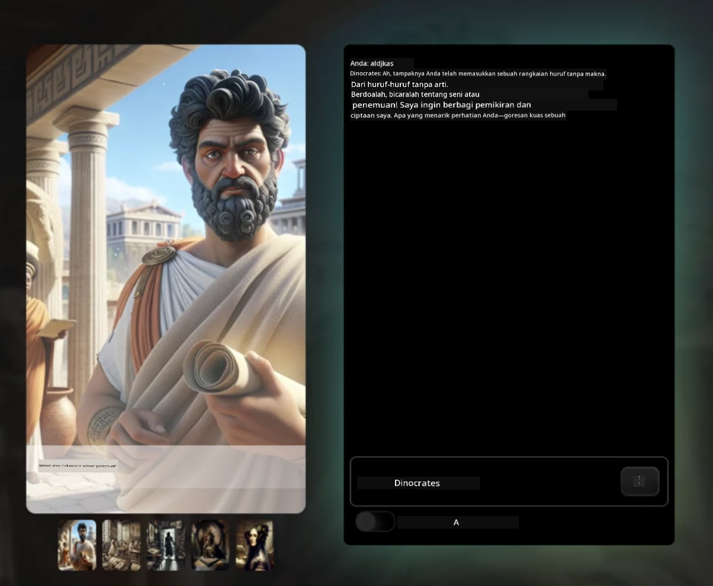
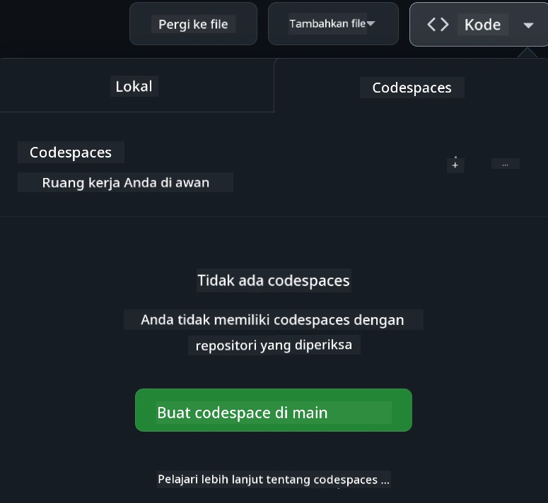

[](https://github.com/microsoft/Web-Dev-For-Beginners/blob/master/LICENSE)
[](https://GitHub.com/microsoft/Web-Dev-For-Beginners/graphs/contributors/)
[](https://GitHub.com/microsoft/Web-Dev-For-Beginners/issues/)
[](https://GitHub.com/microsoft/Web-Dev-For-Beginners/pulls/)
[](http://makeapullrequest.com)

[](https://GitHub.com/microsoft/Web-Dev-For-Beginners/watchers/)
[](https://GitHub.com/microsoft/Web-Dev-For-Beginners/network/)
[](https://GitHub.com/microsoft/Web-Dev-For-Beginners/stargazers/)

[](https://discord.gg/nTYy5BXMWG)

# Pengembangan Web untuk Pemula - Kurikulum

Pelajari dasar-dasar pengembangan web dengan kursus komprehensif selama 12 minggu oleh Microsoft Cloud Advocates. Setiap dari 24 pelajaran mengeksplorasi JavaScript, CSS, dan HTML melalui proyek langsung seperti terarium, ekstensi browser, dan permainan luar angkasa. Ikuti kuis, diskusi, dan tugas praktis. Tingkatkan keterampilan Anda dan optimalkan retensi pengetahuan dengan pedagogi berbasis proyek yang efektif. Mulailah perjalanan coding Anda hari ini!

Bergabunglah dengan Komunitas Discord Azure AI Foundry

[](https://discord.gg/nTYy5BXMWG)

Ikuti langkah-langkah ini untuk memulai menggunakan sumber daya ini:
1. **Fork Repositori**: Klik [](https://GitHub.com/microsoft/Web-Dev-For-Beginners/fork)
2. **Clone Repositori**:   `git clone https://github.com/microsoft/Web-Dev-For-Beginners.git`
3. [**Bergabung dengan Azure AI Foundry Discord dan temui para ahli serta sesama pengembang**](https://discord.com/invite/ByRwuEEgH4)

### 🌐 Dukungan Multi-Bahasa

#### Didukung melalui GitHub Action (Otomatis & Selalu Terbaru)

<!-- CO-OP TRANSLATOR LANGUAGES TABLE START -->
[Arabic](../ar/README.md) | [Bengali](../bn/README.md) | [Bulgarian](../bg/README.md) | [Burmese (Myanmar)](../my/README.md) | [Chinese (Simplified)](../zh-CN/README.md) | [Chinese (Traditional, Hong Kong)](../zh-HK/README.md) | [Chinese (Traditional, Macau)](../zh-MO/README.md) | [Chinese (Traditional, Taiwan)](../zh-TW/README.md) | [Croatian](../hr/README.md) | [Czech](../cs/README.md) | [Danish](../da/README.md) | [Dutch](../nl/README.md) | [Estonian](../et/README.md) | [Finnish](../fi/README.md) | [French](../fr/README.md) | [German](../de/README.md) | [Greek](../el/README.md) | [Hebrew](../he/README.md) | [Hindi](../hi/README.md) | [Hungarian](../hu/README.md) | [Indonesian](./README.md) | [Italian](../it/README.md) | [Japanese](../ja/README.md) | [Kannada](../kn/README.md) | [Korean](../ko/README.md) | [Lithuanian](../lt/README.md) | [Malay](../ms/README.md) | [Malayalam](../ml/README.md) | [Marathi](../mr/README.md) | [Nepali](../ne/README.md) | [Nigerian Pidgin](../pcm/README.md) | [Norwegian](../no/README.md) | [Persian (Farsi)](../fa/README.md) | [Polish](../pl/README.md) | [Portuguese (Brazil)](../pt-BR/README.md) | [Portuguese (Portugal)](../pt-PT/README.md) | [Punjabi (Gurmukhi)](../pa/README.md) | [Romanian](../ro/README.md) | [Russian](../ru/README.md) | [Serbian (Cyrillic)](../sr/README.md) | [Slovak](../sk/README.md) | [Slovenian](../sl/README.md) | [Spanish](../es/README.md) | [Swahili](../sw/README.md) | [Swedish](../sv/README.md) | [Tagalog (Filipino)](../tl/README.md) | [Tamil](../ta/README.md) | [Telugu](../te/README.md) | [Thai](../th/README.md) | [Turkish](../tr/README.md) | [Ukrainian](../uk/README.md) | [Urdu](../ur/README.md) | [Vietnamese](../vi/README.md)

> **Lebih suka Clone secara Lokal?**

> Repositori ini mencakup lebih dari 50 terjemahan bahasa yang secara signifikan meningkatkan ukuran unduhan. Untuk meng-clone tanpa terjemahan, gunakan sparse checkout:
> ```bash
> git clone --filter=blob:none --sparse https://github.com/microsoft/Web-Dev-For-Beginners.git
> cd Web-Dev-For-Beginners
> git sparse-checkout set --no-cone '/*' '!translations' '!translated_images'
> ```
> Ini memberikan semua yang Anda butuhkan untuk menyelesaikan kursus dengan unduhan yang jauh lebih cepat.
<!-- CO-OP TRANSLATOR LANGUAGES TABLE END -->

**Jika Anda ingin dukungan bahasa terjemahan tambahan, daftar bahasa yang didukung terdapat [di sini](https://github.com/Azure/co-op-translator/blob/main/getting_started/supported-languages.md)**

[](https://open.vscode.dev/microsoft/Web-Dev-For-Beginners)

#### 🧑‍🎓 _Apakah Anda seorang pelajar?_

Kunjungi [**halaman Student Hub**](https://docs.microsoft.com/learn/student-hub/?WT.mc_id=academic-77807-sagibbon) di mana Anda akan menemukan sumber daya untuk pemula, paket pelajar, dan bahkan cara mendapat voucher sertifikat gratis. Ini adalah halaman yang ingin Anda favoritkan dan periksa secara berkala karena konten kami akan diperbarui setiap bulan.

### 📣 Pengumuman - Tantangan mode GitHub Copilot Agent baru untuk diselesaikan!

Tantangan baru ditambahkan, cari "GitHub Copilot Agent Challenge 🚀" di sebagian besar bab. Itu adalah tantangan baru untuk Anda selesaikan menggunakan GitHub Copilot dan mode Agen. Jika Anda belum pernah menggunakan mode Agen sebelumnya, mode ini mampu tidak hanya menghasilkan teks tetapi juga dapat membuat dan mengedit file, menjalankan perintah dan lainnya.

### 📣 Pengumuman - _Proyek Baru untuk dibangun menggunakan AI Generatif_

Proyek Asisten AI baru saja ditambahkan, periksa [proyek](./9-chat-project/README.md)

### 📣 Pengumuman - _Kurikulum Baru_ tentang AI Generatif untuk JavaScript baru saja dirilis

Jangan lewatkan kurikulum AI Generatif baru kami!

Kunjungi [https://aka.ms/genai-js-course](https://aka.ms/genai-js-course) untuk mulai!



- Pelajaran mencakup segala sesuatu dari dasar hingga RAG.
- Berinteraksi dengan karakter sejarah menggunakan GenAI dan aplikasi pendamping kami.
- Narasi yang menyenangkan dan menarik, Anda akan melakukan perjalanan waktu!



Setiap pelajaran mencakup tugas untuk diselesaikan, pemeriksaan pengetahuan, dan tantangan untuk membimbing Anda belajar topik seperti:
- Prompting dan rekayasa prompt
- Pembuatan aplikasi teks dan gambar
- Aplikasi pencarian

Kunjungi [https://aka.ms/genai-js-course](../../[https:/aka.ms/genai-js-course) untuk mulai!


## 🌱 Memulai

> **Guru**, kami telah [menyertakan beberapa saran](for-teachers.md) tentang cara menggunakan kurikulum ini. Kami sangat mengharapkan masukan Anda [di forum diskusi kami](https://github.com/microsoft/Web-Dev-For-Beginners/discussions/categories/teacher-corner)!

**[Pelajar](https://aka.ms/student-page/?WT.mc_id=academic-77807-sagibbon)**, untuk setiap pelajaran, mulailah dengan kuis pra-kuliah dan lanjutkan dengan membaca materi kuliah, menyelesaikan berbagai aktivitas, dan periksa pemahaman Anda dengan kuis pasca-kuliah.

Untuk meningkatkan pengalaman belajar Anda, hubungkan dengan teman sebaya Anda untuk mengerjakan proyek bersama! Diskusi sangat dianjurkan di [forum diskusi kami](https://github.com/microsoft/Web-Dev-For-Beginners/discussions) di mana tim moderator kami akan siap menjawab pertanyaan Anda.

Untuk memperdalam pendidikan Anda, kami sangat menyarankan menjelajahi [Microsoft Learn](https://learn.microsoft.com/users/wirelesslife/collections/p1ddcy5jwy0jkm?WT.mc_id=academic-77807-sagibbon) untuk bahan studi tambahan.

### 📋 Menyiapkan lingkungan Anda

Kurikulum ini memiliki lingkungan pengembangan yang siap pakai! Saat Anda memulai, Anda dapat memilih untuk menjalankan kurikulum di [Codespace](https://github.com/features/codespaces/) (_lingkungan berbasis browser, tanpa perlu instalasi_), atau secara lokal di komputer menggunakan editor teks seperti [Visual Studio Code](https://code.visualstudio.com/?WT.mc_id=academic-77807-sagibbon).

#### Buat repositori Anda
Agar Anda mudah menyimpan pekerjaan Anda, disarankan untuk membuat salinan repositori ini. Anda dapat melakukannya dengan mengklik tombol **Use this template** di bagian atas halaman. Ini akan membuat repositori baru di akun GitHub Anda dengan salinan kurikulum.

Ikuti langkah-langkah ini:
1. **Fork Repositori**: Klik tombol "Fork" di pojok kanan atas halaman ini.
2. **Clone Repositori**:   `git clone https://github.com/microsoft/Web-Dev-For-Beginners.git`

#### Menjalankan kurikulum di Codespace

Di salinan repositori yang Anda buat, klik tombol **Code** dan pilih **Open with Codespaces**. Ini akan membuat Codespace baru untuk Anda bekerja di dalamnya.



#### Menjalankan kurikulum secara lokal di komputer Anda

Untuk menjalankan kurikulum ini secara lokal di komputer, Anda memerlukan editor teks, browser, dan alat baris perintah. Pelajaran pertama kami, [Pengenalan Bahasa Pemrograman dan Alat Perdagangan](../../1-getting-started-lessons/1-intro-to-programming-languages), akan memandu Anda melalui berbagai pilihan untuk masing-masing alat ini agar Anda memilih yang paling sesuai dengan kebutuhan.

Rekomendasi kami adalah menggunakan [Visual Studio Code](https://code.visualstudio.com/?WT.mc_id=academic-77807-sagibbon) sebagai editor Anda, yang juga memiliki [Terminal](https://code.visualstudio.com/docs/terminal/basics/?WT.mc_id=academic-77807-sagibbon) bawaan. Anda dapat mengunduh Visual Studio Code [di sini](https://code.visualstudio.com/?WT.mc_id=academic-77807-sagibbon).


1. Clone repositori Anda ke komputer. Anda dapat melakukannya dengan mengklik tombol **Code** dan menyalin URL:

    [CodeSpace](./images/createcodespace.png)
Kemudian, buka [Terminal](https://code.visualstudio.com/docs/terminal/basics/?WT.mc_id=academic-77807-sagibbon) di dalam [Visual Studio Code](https://code.visualstudio.com/?WT.mc_id=academic-77807-sagibbon) dan jalankan perintah berikut, gantikan `<your-repository-url>` dengan URL yang baru saja Anda salin:

    ```bash 
    git clone <your-repository-url>
    ```

2. Buka folder di Visual Studio Code. Anda dapat melakukan ini dengan mengklik **File** > **Open Folder** dan memilih folder yang baru saja Anda kloning.


> Ekstensi Visual Studio Code yang direkomendasikan:
>
> * [Live Server](https://marketplace.visualstudio.com/items?itemName=ritwickdey.LiveServer&WT.mc_id=academic-77807-sagibbon) - untuk mempratinjau halaman HTML di dalam Visual Studio Code
> * [Copilot](https://marketplace.visualstudio.com/items?itemName=GitHub.copilot&WT.mc_id=academic-77807-sagibbon) - untuk membantu Anda menulis kode lebih cepat

## 📂 Setiap pelajaran mencakup:

- sketchnote opsional
- video pelengkap opsional
- kuis pemanasan sebelum pelajaran
- pelajaran tertulis
- untuk pelajaran berbasis proyek, panduan langkah demi langkah tentang cara membangun proyek
- pemeriksaan pengetahuan
- tantangan
- bacaan pelengkap
- tugas
- [kuis pasca-pelajaran](https://ff-quizzes.netlify.app/web/)

> **Catatan tentang kuis**: Semua kuis terdapat dalam folder Quiz-app, total 48 kuis dengan masing-masing tiga pertanyaan. Mereka tersedia [di sini](https://ff-quizzes.netlify.app/web/) aplikasi kuis dapat dijalankan secara lokal atau dideploy ke Azure; ikuti instruksi di folder `quiz-app`.

## 🗃️ Pelajaran

|     |                       Nama Proyek                        |                            Konsep yang Diajarkan                             | Tujuan Pembelajaran                                                                                                                 |                                                         Pelajaran Terkait                                                           |         Penulis         |
| :-: | :------------------------------------------------------: | :--------------------------------------------------------------------------: | ----------------------------------------------------------------------------------------------------------------------------------- | :----------------------------------------------------------------------------------------------------------------------------: | :---------------------: |
| 01  |                     Memulai                              |           Pengenalan Pemrograman dan Alat Kerja                             | Pelajari dasar-dasar yang mendasari sebagian besar bahasa pemrograman dan tentang perangkat lunak yang membantu pengembang profesional menjalankan pekerjaan mereka | [Intro ke Bahasa Pemrograman dan Alat Kerja](./1-getting-started-lessons/1-intro-to-programming-languages/README.md) |         Jasmine         |
| 02  |                     Memulai                              |             Dasar-dasar GitHub, termasuk bekerja dengan tim                  | Cara menggunakan GitHub dalam proyek Anda, bagaimana berkolaborasi dengan orang lain pada basis kode                               |                              [Intro ke GitHub](./1-getting-started-lessons/2-github-basics/README.md)                              |          Floor          |
| 03  |                     Memulai                              |                           Aksesibilitas                                     | Pelajari dasar-dasar aksesibilitas web                                                                                                |                         [Dasar-dasar Aksesibilitas](./1-getting-started-lessons/3-accessibility/README.md)                       |       Christopher       |
| 04  |                        Dasar JS                          |                   Tipe Data JavaScript                                      | Dasar-dasar tipe data JavaScript                                                                                                    |                                  [Tipe Data](./2-js-basics/1-data-types/README.md)                                        |         Jasmine         |
| 05  |                        Dasar JS                          |                  Fungsi dan Metode                                          | Pelajari tentang fungsi dan metode untuk mengelola alur logika aplikasi                                                             |                                [Fungsi dan Metode](./2-js-basics/2-functions-methods/README.md)                               | Jasmine dan Christopher |
| 06  |                        Dasar JS                          |                     Membuat Keputusan dengan JS                             | Pelajari cara membuat kondisi dalam kode Anda menggunakan metode pengambilan keputusan                                               |                                   [Membuat Keputusan](./2-js-basics/3-making-decisions/README.md)                                  |         Jasmine         |
| 07  |                        Dasar JS                          |                         Array dan Loop                                      | Bekerja dengan data menggunakan array dan loop dalam JavaScript                                                                    |                                     [Array dan Loop](./2-js-basics/4-arrays-loops/README.md)                                    |         Jasmine         |
| 08  |       [Terrarium](./3-terrarium/solution/README.md)       |                         HTML dalam Praktek                                 | Bangun HTML untuk membuat terrarium online, fokus pada membangun tata letak                                                        |                                  [Pengenalan ke HTML](./3-terrarium/1-intro-to-html/README.md)                                 |           Jen           |
| 09  |       [Terrarium](./3-terrarium/solution/README.md)       |                          CSS dalam Praktek                                 | Bangun CSS untuk menata terrarium online, fokus pada dasar-dasar CSS termasuk membuat halaman responsif                            |                                    [Pengenalan ke CSS](./3-terrarium/2-intro-to-css/README.md)                                  |           Jen           |
| 10  |            [Terrarium](./3-terrarium/solution/README.md)            |                 Closures JavaScript, manipulasi DOM                        | Bangun JavaScript untuk membuat terrarium berfungsi sebagai antarmuka drag/drop, fokus pada closures dan manipulasi DOM            |                [Closures JavaScript, manipulasi DOM](./3-terrarium/3-intro-to-DOM-and-closures/README.md)                    |           Jen           |
| 11  |          [Typing Game](./4-typing-game/solution/README.md)          |                          Membangun Permainan Mengetik                       | Pelajari cara menggunakan event keyboard untuk menggerakkan logika aplikasi JavaScript Anda                                         |                              [Pemrograman Berbasis Event](./4-typing-game/typing-game/README.md)                                |       Christopher       |
| 12  | [Green Browser Extension](./5-browser-extension/solution/README.md) |                         Bekerja dengan Browser                             | Pelajari cara kerja browser, sejarahnya, dan cara membuat elemen pertama dari ekstensi browser                                       |                              [Tentang Browser](./5-browser-extension/1-about-browsers/README.md)                                |           Jen           |
| 13  | [Green Browser Extension](./5-browser-extension/solution/README.md) | Membangun formulir, memanggil API dan menyimpan variabel di penyimpanan lokal | Bangun elemen JavaScript ekstensi browser Anda untuk memanggil API menggunakan variabel yang disimpan di penyimpanan lokal          |                [API, Formulir, dan Penyimpanan Lokal](./5-browser-extension/2-forms-browsers-local-storage/README.md)           |           Jen           |
| 14  | [Green Browser Extension](./5-browser-extension/solution/README.md) |          Proses latar belakang di browser, performa web                     | Gunakan proses latar belakang browser untuk mengelola ikon ekstensi; pelajari tentang performa web dan beberapa optimisasi untuk membuat |                  [Tugas Latar Belakang dan Performa](./5-browser-extension/3-background-tasks-and-performance/README.md)       |           Jen           |
| 15  |           [Space Game](./6-space-game/solution/README.md)           |             Pengembangan Game Lanjutan dengan JavaScript                   | Pelajari tentang Pewarisan menggunakan Kelas dan Komposisi serta pola Pub/Sub, sebagai persiapan untuk membuat game                 |                      [Pengenalan ke Pengembangan Game Lanjutan](./6-space-game/1-introduction/README.md)                       |          Chris          |
| 16  |           [Space Game](./6-space-game/solution/README.md)           |                          Menggambar ke canvas                              | Pelajari API Canvas, digunakan untuk menggambar elemen ke layar                                                                     |                                 [Menggambar ke Canvas](./6-space-game/2-drawing-to-canvas/README.md)                            |          Chris          |
| 17  |           [Space Game](./6-space-game/solution/README.md)           |                    Memindahkan elemen di layar                            | Temukan bagaimana elemen bisa bergerak menggunakan koordinat kartesius dan API Canvas                                                |                            [Memindahkan Elemen](./6-space-game/3-moving-elements-around/README.md)                              |          Chris          |
| 18  |           [Space Game](./6-space-game/solution/README.md)           |                          Deteksi tabrakan                                | Buat elemen bertabrakan dan bereaksi satu sama lain menggunakan penekanan tombol dan berikan fungsi cooldown untuk memastikan performa game |                              [Deteksi Tabrakan](./6-space-game/4-collision-detection/README.md)                                  |          Chris          |
| 19  |           [Space Game](./6-space-game/solution/README.md)           |                             Menjaga skor                                  | Lakukan perhitungan matematika berdasarkan status dan performa game                                                                 |                                   [Menjaga Skor](./6-space-game/5-keeping-score/README.md)                                    |          Chris          |
| 20  |           [Space Game](./6-space-game/solution/README.md)           |                     Mengakhiri dan memulai ulang game                     | Pelajari tentang mengakhiri dan memulai ulang game, termasuk membersihkan aset dan mereset nilai variabel                           |                                 [Kondisi Akhir](./6-space-game/6-end-condition/README.md)                                   |          Chris          |
| 21  |         [Banking App](./7-bank-project/solution/README.md)          |                Template HTML dan Rute dalam Aplikasi Web                  | Pelajari cara membuat kerangka arsitektur website multipage menggunakan routing dan template HTML                                   |                               [Template HTML dan Rute](./7-bank-project/1-template-route/README.md)                              |          Yohan          |
| 22  |         [Banking App](./7-bank-project/solution/README.md)          |                 Membangun Formulir Login dan Pendaftaran                   | Pelajari tentang membangun formulir dan menangani prosedur validasi                                                                  |                                             [Formulir](./7-bank-project/2-forms/README.md)                                     |          Yohan          |
| 23  |         [Banking App](./7-bank-project/solution/README.md)          |                 Metode Mengambil dan Menggunakan Data                      | Bagaimana data mengalir masuk dan keluar dari aplikasi Anda, cara mengambilnya, menyimpannya, dan membuangnya                       |                                               [Data](./7-bank-project/3-data/README.md)                                      |          Yohan          |
| 24  |         [Banking App](./7-bank-project/solution/README.md)          |                         Konsep Manajemen Status                           | Pelajari bagaimana aplikasi Anda mempertahankan status dan cara mengelolanya secara programatik                                     |                                 [Manajemen Status](./7-bank-project/4-state-management/README.md)                              |          Yohan          |
| 25 | [Browser/VScode Code](../../8-code-editor) | Bekerja dengan VScode | Pelajari cara menggunakan editor kode | [Menggunakan Editor Kode VScode](./8-code-editor/1-using-a-code-editor/README.md) | Chris |
| 26 | [AI Assistants](./9-chat-project/README.md) | Bekerja dengan AI | Pelajari cara membangun asisten AI Anda sendiri | [Proyek Asisten AI](./9-chat-project/README.md) | Chris |

## 🏫 Pedagogi

Kurikulum kami dirancang dengan dua prinsip pedagogis kunci:
* pembelajaran berbasis proyek
* kuis yang sering

Program ini mengajarkan dasar-dasar JavaScript, HTML, dan CSS, serta alat dan teknik terbaru yang digunakan oleh pengembang web saat ini. Siswa akan memiliki kesempatan mengembangkan pengalaman langsung dengan membangun permainan mengetik, terrarium virtual, ekstensi browser ramah lingkungan, permainan ala penyerang luar angkasa, dan aplikasi perbankan untuk bisnis. Pada akhir seri, siswa akan memperoleh pemahaman yang solid tentang pengembangan web.

> 🎓 Anda dapat mengikuti beberapa pelajaran pertama dalam kurikulum ini sebagai [Jalur Belajar](https://docs.microsoft.com/learn/paths/web-development-101/?WT.mc_id=academic-77807-sagibbon) di Microsoft Learn!

Dengan memastikan konten sejalan dengan proyek, proses menjadi lebih menarik bagi siswa dan retensi konsep akan ditingkatkan. Kami juga menulis beberapa pelajaran awal tentang dasar-dasar JavaScript untuk memperkenalkan konsep, dipadukan dengan video dari koleksi tutorial video "[Seri Pemula untuk: JavaScript](https://channel9.msdn.com/Series/Beginners-Series-to-JavaScript/?WT.mc_id=academic-77807-sagibbon)", beberapa penulisnya berkontribusi dalam kurikulum ini.

Selain itu, kuis dengan tingkat kesulitan rendah sebelum kelas menetapkan niat siswa untuk mempelajari topik, sementara kuis kedua setelah kelas memastikan retensi lebih lanjut. Kurikulum ini dirancang agar fleksibel dan menyenangkan dan dapat diambil secara keseluruhan atau sebagian. Proyek dimulai dari kecil dan menjadi semakin kompleks sampai akhir siklus 12 minggu.

Meskipun secara sengaja kami menghindari memperkenalkan framework JavaScript agar fokus pada keterampilan dasar yang dibutuhkan sebagai pengembang web sebelum memakai framework, langkah selanjutnya yang baik setelah menyelesaikan kurikulum ini adalah belajar tentang Node.js lewat koleksi video lain: "[Seri Pemula untuk: Node.js](https://channel9.msdn.com/Series/Beginners-Series-to-Nodejs/?WT.mc_id=academic-77807-sagibbon)".

> Kunjungi pedoman [Kode Etik](CODE_OF_CONDUCT.md) dan [Kontribusi](CONTRIBUTING.md) kami. Kami menyambut umpan balik konstruktif Anda!


## 🧭 Akses Offline

Anda dapat menjalankan dokumentasi ini secara offline dengan menggunakan [Docsify](https://docsify.js.org/#/). Fork repo ini, [pasang Docsify](https://docsify.js.org/#/quickstart) pada mesin lokal Anda, kemudian di folder root repo ini, ketik `docsify serve`. Situs web akan disajikan pada port 3000 di localhost Anda: `localhost:3000`.

## 📘 PDF

PDF dari semua pelajaran dapat ditemukan [di sini](https://microsoft.github.io/Web-Dev-For-Beginners/pdf/readme.pdf).


## 🎒 Kursus Lainnya
Tim kami juga menghasilkan kursus lain! Lihat:

<!-- CO-OP TRANSLATOR OTHER COURSES START -->
### LangChain
[](https://aka.ms/langchain4j-for-beginners)
[](https://aka.ms/langchainjs-for-beginners?WT.mc_id=m365-94501-dwahlin)
[](https://github.com/microsoft/langchain-for-beginners?WT.mc_id=m365-94501-dwahlin)
---

### Azure / Edge / MCP / Agents
[](https://github.com/microsoft/AZD-for-beginners?WT.mc_id=academic-105485-koreyst)
[](https://github.com/microsoft/edgeai-for-beginners?WT.mc_id=academic-105485-koreyst)
[](https://github.com/microsoft/mcp-for-beginners?WT.mc_id=academic-105485-koreyst)
[](https://github.com/microsoft/ai-agents-for-beginners?WT.mc_id=academic-105485-koreyst)

---
 
### Seri AI Generatif
[](https://github.com/microsoft/generative-ai-for-beginners?WT.mc_id=academic-105485-koreyst)
[-9333EA?style=for-the-badge&labelColor=E5E7EB&color=9333EA)](https://github.com/microsoft/Generative-AI-for-beginners-dotnet?WT.mc_id=academic-105485-koreyst)
[-C084FC?style=for-the-badge&labelColor=E5E7EB&color=C084FC)](https://github.com/microsoft/generative-ai-for-beginners-java?WT.mc_id=academic-105485-koreyst)
[-E879F9?style=for-the-badge&labelColor=E5E7EB&color=E879F9)](https://github.com/microsoft/generative-ai-with-javascript?WT.mc_id=academic-105485-koreyst)

---
 
### Pembelajaran Inti
[](https://aka.ms/ml-beginners?WT.mc_id=academic-105485-koreyst)
[](https://aka.ms/datascience-beginners?WT.mc_id=academic-105485-koreyst)
[](https://aka.ms/ai-beginners?WT.mc_id=academic-105485-koreyst)
[](https://github.com/microsoft/Security-101?WT.mc_id=academic-96948-sayoung)
[](https://aka.ms/webdev-beginners?WT.mc_id=academic-105485-koreyst)
[](https://aka.ms/iot-beginners?WT.mc_id=academic-105485-koreyst)
[](https://github.com/microsoft/xr-development-for-beginners?WT.mc_id=academic-105485-koreyst)

---
 
### Seri Copilot
[](https://aka.ms/GitHubCopilotAI?WT.mc_id=academic-105485-koreyst)
[](https://github.com/microsoft/mastering-github-copilot-for-dotnet-csharp-developers?WT.mc_id=academic-105485-koreyst)
[](https://github.com/microsoft/CopilotAdventures?WT.mc_id=academic-105485-koreyst)
<!-- CO-OP TRANSLATOR OTHER COURSES END -->

## Mendapatkan Bantuan

Jika Anda mengalami kesulitan atau memiliki pertanyaan tentang membangun aplikasi AI. Bergabunglah dengan sesama pelajar dan pengembang berpengalaman dalam diskusi tentang MCP. Ini adalah komunitas yang mendukung di mana pertanyaan diterima dan pengetahuan dibagikan dengan bebas.

[](https://discord.gg/nTYy5BXMWG)

Jika Anda memiliki masukan produk atau kesalahan saat membangun kunjungi:

[](https://aka.ms/foundry/forum)

## Lisensi

Repositori ini dilisensikan di bawah lisensi MIT. Lihat file [LICENSE](../../LICENSE) untuk informasi lebih lanjut.

---

<!-- CO-OP TRANSLATOR DISCLAIMER START -->
**Penafian**:  
Dokumen ini telah diterjemahkan menggunakan layanan terjemahan AI [Co-op Translator](https://github.com/Azure/co-op-translator). Meskipun kami berusaha untuk akurasi, harap diketahui bahwa terjemahan otomatis mungkin mengandung kesalahan atau ketidakakuratan. Dokumen asli dalam bahasa aslinya harus dianggap sebagai sumber yang otoritatif. Untuk informasi penting, disarankan menggunakan terjemahan profesional oleh manusia. Kami tidak bertanggung jawab atas kesalahpahaman atau salah tafsir yang timbul dari penggunaan terjemahan ini.
<!-- CO-OP TRANSLATOR DISCLAIMER END -->