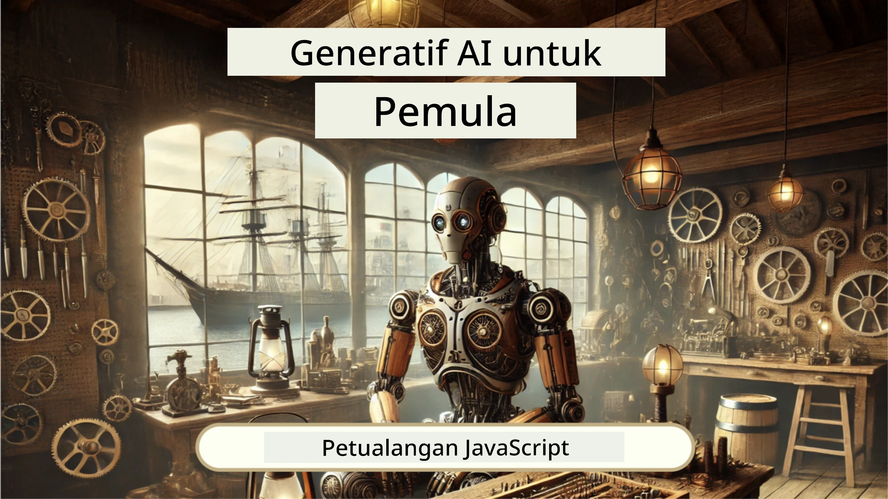
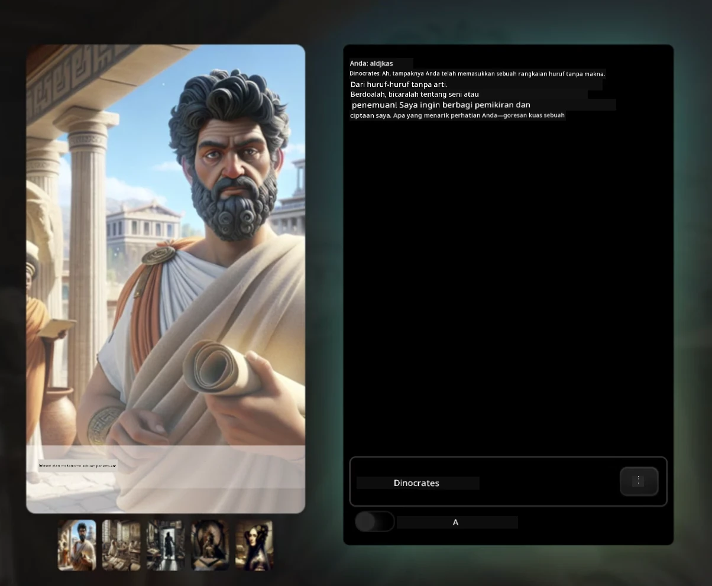
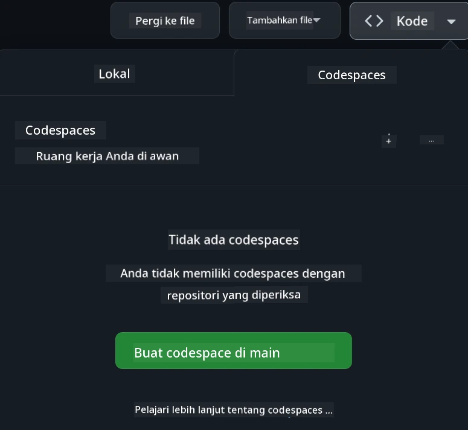

[](https://github.com/microsoft/Web-Dev-For-Beginners/blob/master/LICENSE)
[](https://GitHub.com/microsoft/Web-Dev-For-Beginners/graphs/contributors/)
[](https://GitHub.com/microsoft/Web-Dev-For-Beginners/issues/)
[](https://GitHub.com/microsoft/Web-Dev-For-Beginners/pulls/)
[](http://makeapullrequest.com) 

[](https://GitHub.com/microsoft/Web-Dev-For-Beginners/watchers/)
[](https://GitHub.com/microsoft/Web-Dev-For-Beginners/network/)
[](https://GitHub.com/microsoft/Web-Dev-For-Beginners/stargazers/)

[](https://discord.gg/nTYy5BXMWG)

# Pengembangan Web untuk Pemula - Kurikulum

Pelajari dasar-dasar pengembangan web dengan kursus komprehensif selama 12 minggu oleh Microsoft Cloud Advocates. Setiap dari 24 pelajaran menyelami JavaScript, CSS, dan HTML melalui proyek langsung seperti terrarium, ekstensi browser, dan permainan luar angkasa. Ikuti kuis, diskusi, dan tugas praktis. Tingkatkan keterampilan dan optimalkan retensi pengetahuan Anda dengan pedagogi berbasis proyek kami yang efektif. Mulai perjalanan coding Anda hari ini!

Bergabunglah dengan Komunitas Discord Azure AI Foundry

[](https://discord.gg/nTYy5BXMWG)

Ikuti langkah-langkah berikut untuk mulai menggunakan sumber daya ini:
1. **Fork Repositori**: Klik [](https://GitHub.com/microsoft/Web-Dev-For-Beginners/fork)
2. **Clone Repositori**:   `git clone https://github.com/microsoft/Web-Dev-For-Beginners.git`
3. [**Bergabunglah dengan Azure AI Foundry Discord dan temui para ahli serta sesama pengembang**](https://discord.com/invite/ByRwuEEgH4)

### 🌐 Dukungan Multi-Bahasa

#### Didukung melalui GitHub Action (Otomatis & Selalu Terbaru)

<!-- CO-OP TRANSLATOR LANGUAGES TABLE START -->
[Arabic](../ar/README.md) | [Bengali](../bn/README.md) | [Bulgarian](../bg/README.md) | [Burmese (Myanmar)](../my/README.md) | [Chinese (Simplified)](../zh-CN/README.md) | [Chinese (Traditional, Hong Kong)](../zh-HK/README.md) | [Chinese (Traditional, Macau)](../zh-MO/README.md) | [Chinese (Traditional, Taiwan)](../zh-TW/README.md) | [Croatian](../hr/README.md) | [Czech](../cs/README.md) | [Danish](../da/README.md) | [Dutch](../nl/README.md) | [Estonian](../et/README.md) | [Finnish](../fi/README.md) | [French](../fr/README.md) | [German](../de/README.md) | [Greek](../el/README.md) | [Hebrew](../he/README.md) | [Hindi](../hi/README.md) | [Hungarian](../hu/README.md) | [Indonesian](./README.md) | [Italian](../it/README.md) | [Japanese](../ja/README.md) | [Kannada](../kn/README.md) | [Korean](../ko/README.md) | [Lithuanian](../lt/README.md) | [Malay](../ms/README.md) | [Malayalam](../ml/README.md) | [Marathi](../mr/README.md) | [Nepali](../ne/README.md) | [Nigerian Pidgin](../pcm/README.md) | [Norwegian](../no/README.md) | [Persian (Farsi)](../fa/README.md) | [Polish](../pl/README.md) | [Portuguese (Brazil)](../pt-BR/README.md) | [Portuguese (Portugal)](../pt-PT/README.md) | [Punjabi (Gurmukhi)](../pa/README.md) | [Romanian](../ro/README.md) | [Russian](../ru/README.md) | [Serbian (Cyrillic)](../sr/README.md) | [Slovak](../sk/README.md) | [Slovenian](../sl/README.md) | [Spanish](../es/README.md) | [Swahili](../sw/README.md) | [Swedish](../sv/README.md) | [Tagalog (Filipino)](../tl/README.md) | [Tamil](../ta/README.md) | [Telugu](../te/README.md) | [Thai](../th/README.md) | [Turkish](../tr/README.md) | [Ukrainian](../uk/README.md) | [Urdu](../ur/README.md) | [Vietnamese](../vi/README.md)

> **Lebih suka Clone Lokal?**
>
> Repositori ini mencakup 50+ terjemahan bahasa yang secara signifikan menambah ukuran unduhan. Untuk meng-clone tanpa terjemahan, gunakan sparse checkout:
>
> **Bash / macOS / Linux:**
> ```bash
> git clone --filter=blob:none --sparse https://github.com/microsoft/Web-Dev-For-Beginners.git
> cd Web-Dev-For-Beginners
> git sparse-checkout set --no-cone '/*' '!translations' '!translated_images'
> ```
>
> **CMD (Windows):**
> ```cmd
> git clone --filter=blob:none --sparse https://github.com/microsoft/Web-Dev-For-Beginners.git
> cd Web-Dev-For-Beginners
> git sparse-checkout set --no-cone "/*" "!translations" "!translated_images"
> ```
>
> Ini memberikan Anda semua yang Anda butuhkan untuk menyelesaikan kursus dengan unduhan yang jauh lebih cepat.
<!-- CO-OP TRANSLATOR LANGUAGES TABLE END -->

**Jika Anda ingin bahasa terjemahan tambahan didukung, daftar bahasa tersedia di [sini](https://github.com/Azure/co-op-translator/blob/main/getting_started/supported-languages.md)**

[](https://open.vscode.dev/microsoft/Web-Dev-For-Beginners)

#### 🧑‍🎓 _Apakah kamu seorang pelajar?_

Kunjungi [**halaman Student Hub**](https://docs.microsoft.com/learn/student-hub/?WT.mc_id=academic-77807-sagibbon) dimana kamu akan menemukan sumber daya pemula, paket pelajar hingga cara mendapatkan voucher sertifikat gratis. Ini adalah halaman yang ingin kamu tandai dan periksa secara berkala karena kami akan mengganti konten tiap bulan.

### 📣 Pengumuman - Tantangan mode GitHub Copilot Agent baru untuk diselesaikan!

Tantangan baru ditambahkan, cari "GitHub Copilot Agent Challenge 🚀" di sebagian besar bab. Itu adalah tantangan baru untuk Anda selesaikan menggunakan GitHub Copilot dan mode Agent. Jika Anda belum pernah menggunakan mode Agent sebelumnya, mode ini mampu tidak hanya menghasilkan teks tetapi juga dapat membuat dan mengedit file, menjalankan perintah, dan lainnya.

### 📣 Pengumuman - _Proyek Baru untuk dibangun menggunakan Generative AI_ 

Proyek Asisten AI baru saja ditambahkan, cek [proyek](./9-chat-project/README.md)

### 📣 Pengumuman - _Kurikulum Baru_ tentang Generative AI untuk JavaScript baru saja dirilis

Jangan lewatkan kurikulum Generative AI terbaru kami!

Kunjungi [https://aka.ms/genai-js-course](https://aka.ms/genai-js-course) untuk memulai!



- Pelajaran meliputi semuanya dari dasar hingga RAG.
- Berinteraksi dengan tokoh historis menggunakan GenAI dan aplikasi pendamping kami.
- Narasi yang menyenangkan dan menarik, Anda akan melakukan perjalanan waktu!




Setiap pelajaran termasuk tugas yang harus diselesaikan, pemeriksaan pengetahuan dan tantangan untuk membimbing Anda mempelajari topik seperti:
- Prompt dan rekayasa prompt
- Aplikasi teks dan gambar yang dihasilkan
- Aplikasi pencarian

Kunjungi [https://aka.ms/genai-js-course](https://aka.ms/genai-js-course) untuk memulai!


## 🌱 Memulai

> **Guru**, kami telah [menyediakan beberapa saran](for-teachers.md) tentang cara menggunakan kurikulum ini. Kami sangat menghargai masukan Anda [di forum diskusi kami](https://github.com/microsoft/Web-Dev-For-Beginners/discussions/categories/teacher-corner)!

**[Pelajar](https://aka.ms/student-page/?WT.mc_id=academic-77807-sagibbon)**, untuk setiap pelajaran, mulailah dengan kuis pra-lecture dan lanjutkan dengan membaca materi kuliah, menyelesaikan berbagai aktivitas dan periksa pemahaman Anda dengan kuis pasca-lecture.

Untuk meningkatkan pengalaman belajar Anda, hubungkan dengan rekan sejawat Anda untuk mengerjakan proyek bersama! Diskusi dianjurkan di [forum diskusi kami](https://github.com/microsoft/Web-Dev-For-Beginners/discussions) dimana tim moderator kami akan tersedia menjawab pertanyaan Anda.

Untuk memperdalam pendidikan, kami sangat menyarankan menjelajahi [Microsoft Learn](https://learn.microsoft.com/users/wirelesslife/collections/p1ddcy5jwy0jkm?WT.mc_id=academic-77807-sagibbon) untuk materi studi tambahan.

### 📋 Menyiapkan lingkungan Anda

Kurikulum ini sudah memiliki lingkungan pengembangan siap dipakai! Saat Anda memulai Anda dapat memilih menjalankan kurikulum di [Codespace](https://github.com/features/codespaces/) (_lingkungan berbasis browser tanpa perlu instalasi_), atau secara lokal di komputer Anda menggunakan editor teks seperti [Visual Studio Code](https://code.visualstudio.com/?WT.mc_id=academic-77807-sagibbon).

#### Buat repositori Anda
Agar Anda mudah menyimpan pekerjaan Anda, disarankan membuat salinan sendiri dari repositori ini. Anda dapat melakukannya dengan mengklik tombol **Use this template** di bagian atas halaman ini. Ini akan membuat repositori baru di akun GitHub Anda dengan salinan kurikulum.

Ikuti langkah-langkah ini:
1. **Fork Repositori**: Klik tombol "Fork" di pojok kanan atas halaman ini.
2. **Clone Repositori**:   `git clone https://github.com/microsoft/Web-Dev-For-Beginners.git`

#### Menjalankan kurikulum di Codespace

Di salinan repositori yang Anda buat, klik tombol **Code** dan pilih **Open with Codespaces**. Ini akan membuat Codespace baru untuk Anda kerjakan.



#### Menjalankan kurikulum secara lokal di komputer Anda

Untuk menjalankan kurikulum ini secara lokal di komputer Anda, Anda membutuhkan editor teks, browser dan alat baris perintah. Pelajaran pertama kami, [Pengenalan Bahasa Pemrograman dan Alat Perdagangan](../../1-getting-started-lessons/1-intro-to-programming-languages), akan memandu Anda melalui berbagai opsi masing-masing alat agar Anda dapat memilih yang paling cocok.

Rekomendasi kami adalah menggunakan [Visual Studio Code](https://code.visualstudio.com/?WT.mc_id=academic-77807-sagibbon) sebagai editor Anda, yang juga dilengkapi dengan [Terminal](https://code.visualstudio.com/docs/terminal/basics/?WT.mc_id=academic-77807-sagibbon). Anda dapat mengunduh Visual Studio Code [di sini](https://code.visualstudio.com/?WT.mc_id=academic-77807-sagibbon).
1. Kloning repositori Anda ke komputer Anda. Anda dapat melakukannya dengan mengklik tombol **Code** dan menyalin URL:

    [CodeSpace](./images/createcodespace.png)

    Kemudian, buka [Terminal](https://code.visualstudio.com/docs/terminal/basics/?WT.mc_id=academic-77807-sagibbon) dalam [Visual Studio Code](https://code.visualstudio.com/?WT.mc_id=academic-77807-sagibbon) dan jalankan perintah berikut, ganti `<your-repository-url>` dengan URL yang baru saja Anda salin:

    ```bash 
    git clone <your-repository-url>
    ```

2. Buka folder tersebut di Visual Studio Code. Anda dapat melakukannya dengan mengklik **File** > **Open Folder** dan memilih folder yang baru saja Anda kloning.


>  Ekstensi Visual Studio Code yang direkomendasikan:
>
> * [Live Server](https://marketplace.visualstudio.com/items?itemName=ritwickdey.LiveServer&WT.mc_id=academic-77807-sagibbon) - untuk melihat pratinjau halaman HTML dalam Visual Studio Code
> * [Copilot](https://marketplace.visualstudio.com/items?itemName=GitHub.copilot&WT.mc_id=academic-77807-sagibbon) - untuk membantu Anda menulis kode lebih cepat

## 📂 Setiap pelajaran mencakup:

- sketchnote opsional
- video pelengkap opsional
- kuis pemanasan sebelum pelajaran
- pelajaran tertulis
- untuk pelajaran berbasis proyek, panduan langkah demi langkah cara membangun proyek
- pemeriksaan pengetahuan
- tantangan
- bacaan pelengkap
- penugasan
- [kuis pasca-pelajaran](https://ff-quizzes.netlify.app/web/)

> **Catatan tentang kuis**: Semua kuis terdapat di folder Quiz-app, total 48 kuis dengan tiga pertanyaan setiapnya. Mereka tersedia [di sini](https://ff-quizzes.netlify.app/web/) aplikasi kuis dapat dijalankan secara lokal atau diterapkan ke Azure; ikuti instruksi di folder `quiz-app`.

## 🗃️ Pelajaran

|     |                       Nama Proyek                       |                            Konsep yang Diajarkan                            | Tujuan Pembelajaran                                                                                                                  |                                                         Pelajaran Terkait                                                          |         Penulis         |
| :-: | :------------------------------------------------------: | :--------------------------------------------------------------------: | ----------------------------------------------------------------------------------------------------------------------------------- | :----------------------------------------------------------------------------------------------------------------------------: | :---------------------: |
| 01  |                     Memulai                               |           Pengenalan Pemrograman dan Alat Kerja           | Pelajari dasar-dasar yang mendasari sebagian besar bahasa pemrograman dan perangkat lunak yang membantu pengembang profesional melakukan pekerjaan mereka | [Intro to Programming Languages and Tools of the Trade](./1-getting-started-lessons/1-intro-to-programming-languages/README.md) |         Jasmine         |
| 02  |                     Memulai                               |             Dasar GitHub, termasuk bekerja dengan tim             | Cara menggunakan GitHub dalam proyek Anda, cara berkolaborasi dengan orang lain pada basis kode                                                    |                            [Intro to GitHub](./1-getting-started-lessons/2-github-basics/README.md)                             |          Floor          |
| 03  |                     Memulai                               |                             Aksesibilitas                              | Pelajari dasar-dasar aksesibilitas web                                                                                               |                       [Accessibility Fundamentals](./1-getting-started-lessons/3-accessibility/README.md)                       |       Christopher       |
| 04  |                        Dasar JS                          |                         Tipe Data JavaScript                          | Dasar-dasar tipe data JavaScript                                                                                                 |                                       [Data Types](./2-js-basics/1-data-types/README.md)                                        |         Jasmine         |
| 05  |                        Dasar JS                          |                         Fungsi dan Metode                          | Pelajari tentang fungsi dan metode untuk mengelola alur logika aplikasi                                                             |                              [Functions and Methods](./2-js-basics/2-functions-methods/README.md)                               | Jasmine and Christopher |
| 06  |                        Dasar JS                          |                        Membuat Keputusan dengan JS                        | Pelajari cara membuat kondisi dalam kode Anda menggunakan metode pengambilan keputusan                                                           |                                 [Making Decisions](./2-js-basics/3-making-decisions/README.md)                                  |         Jasmine         |
| 07  |                        Dasar JS                          |                            Array dan Loop                            | Bekerja dengan data menggunakan array dan loop di JavaScript                                                                                 |                                   [Arrays and Loops](./2-js-basics/4-arrays-loops/README.md)                                    |         Jasmine         |
| 08  |       [Terrarium](./3-terrarium/solution/README.md)       |                            HTML dalam Praktek                            | Bangun HTML untuk membuat terrarium online, fokus pada membangun tata letak                                                         |                                 [Introduction to HTML](./3-terrarium/1-intro-to-html/README.md)                                 |           Jen           |
| 09  |       [Terrarium](./3-terrarium/solution/README.md)       |                            CSS dalam Praktek                             | Bangun CSS untuk menata terrarium online, fokus pada dasar-dasar CSS termasuk membuat halaman responsif                     |                                  [Introduction to CSS](./3-terrarium/2-intro-to-css/README.md)                                  |           Jen           |
| 10  |            [Terrarium](./3-terrarium/solution/README.md)            |                 Penutupan JavaScript, manipulasi DOM                  | Bangun JavaScript untuk membuat terrarium berfungsi sebagai antarmuka drag/drop, fokus pada closure dan manipulasi DOM             |                  [JavaScript Closures, DOM manipulation](./3-terrarium/3-intro-to-DOM-and-closures/README.md)                   |           Jen           |
| 11  |          [Typing Game](./4-typing-game/solution/README.md)          |                          Membangun Game Mengetik                           | Pelajari cara menggunakan event keyboard untuk menggerakkan logika aplikasi JavaScript Anda                                                          |                                [Event-Driven Programming](./4-typing-game/typing-game/README.md)                                |       Christopher       |
| 12  | [Green Browser Extension](./5-browser-extension/solution/README.md) |                         Bekerja dengan Browser                          | Pelajari bagaimana browser bekerja, sejarahnya, dan cara membuat elemen pertama dari ekstensi browser                               |                               [About Browsers](./5-browser-extension/1-about-browsers/README.md)                                |           Jen           |
| 13  | [Green Browser Extension](./5-browser-extension/solution/README.md) | Membangun form, memanggil API dan menyimpan variabel di penyimpanan lokal | Bangun elemen JavaScript dari ekstensi browser Anda untuk memanggil API menggunakan variabel yang disimpan di penyimpanan lokal                      |                [APIs, Forms, and Local Storage](./5-browser-extension/2-forms-browsers-local-storage/README.md)                 |           Jen           |
| 14  | [Green Browser Extension](./5-browser-extension/solution/README.md) |          Proses latar belakang di browser, performa web          | Gunakan proses latar belakang browser untuk mengelola ikon ekstensi; pelajari tentang performa web dan beberapa optimasi untuk membuat   |             [Background Tasks and Performance](./5-browser-extension/3-background-tasks-and-performance/README.md)              |           Jen           |
| 15  |           [Space Game](./6-space-game/solution/README.md)           |             Pengembangan Game Lanjutan dengan JavaScript             | Pelajari tentang Pewarisan menggunakan baik Kelas maupun Komposisi dan pola Pub/Sub, sebagai persiapan untuk membangun sebuah game              |                      [Introduction to Advanced Game Development](./6-space-game/1-introduction/README.md)                       |          Chris          |
| 16  |           [Space Game](./6-space-game/solution/README.md)           |                           Menggambar ke kanvas                            | Pelajari tentang Canvas API, yang digunakan untuk menggambar elemen ke layar                                                                       |                                [Drawing to Canvas](./6-space-game/2-drawing-to-canvas/README.md)                                |          Chris          |
| 17  |           [Space Game](./6-space-game/solution/README.md)           |                   Memindahkan elemen di sekitar layar                    | Temukan bagaimana elemen bisa bergerak menggunakan koordinat kartesian dan Canvas API                                            |                           [Moving Elements Around](./6-space-game/3-moving-elements-around/README.md)                           |          Chris          |
| 18  |           [Space Game](./6-space-game/solution/README.md)           |                          Deteksi tabrakan                           | Buat elemen bertabrakan dan bereaksi satu sama lain menggunakan penekanan tombol dan menyediakan fungsi cooldown untuk memastikan performa game    |                              [Collision Detection](./6-space-game/4-collision-detection/README.md)                              |          Chris          |
| 19  |           [Space Game](./6-space-game/solution/README.md)           |                             Menjaga skor                              | Lakukan perhitungan matematika berdasarkan status dan performa permainan                                                                |                                    [Keeping Score](./6-space-game/5-keeping-score/README.md)                                    |          Chris          |
| 20  |           [Space Game](./6-space-game/solution/README.md)           |                     Mengakhiri dan memulai ulang game                     | Pelajari tentang mengakhiri dan memulai ulang game, termasuk membersihkan aset dan mereset nilai variabel                              |                                [The Ending Condition](./6-space-game/6-end-condition/README.md)                                 |          Chris          |
| 21  |         [Banking App](./7-bank-project/solution/README.md)          |                 Template HTML dan Routing dalam Aplikasi Web                 | Pelajari cara membuat kerangka arsitektur situs web multipage menggunakan routing dan template HTML                             |                            [HTML Templates and Routes](./7-bank-project/1-template-route/README.md)                             |          Yohan          |
| 22  |         [Banking App](./7-bank-project/solution/README.md)          |                  Membangun Form Login dan Registrasi                   | Pelajari tentang membangun form dan menangani rutin validasi                                                                          |                                           [Forms](./7-bank-project/2-forms/README.md)                                           |          Yohan          |
| 23  |         [Banking App](./7-bank-project/solution/README.md)          |                   Metode Mengambil dan Menggunakan Data                   | Bagaimana data mengalir masuk dan keluar dari aplikasi Anda, cara mengambilnya, menyimpannya, dan membuangnya                                                 |                                            [Data](./7-bank-project/3-data/README.md)                                            |          Yohan          |
| 24  |         [Banking App](./7-bank-project/solution/README.md)          |                      Konsep Manajemen State                      | Pelajari bagaimana aplikasi Anda mempertahankan state dan cara mengelolanya secara programatis                                                              |                                [State Management](./7-bank-project/4-state-management/README.md)                                |          Yohan          |
| 25 | [Browser/VScode Code](../../8-code-editor) | Bekerja dengan VScode | Pelajari cara menggunakan editor kode| [Use VScode Code Editor](./8-code-editor/1-using-a-code-editor/README.md) | Chris |
| 26 | [AI Assistants](./9-chat-project/README.md) | Bekerja dengan AI | Pelajari cara membangun asisten AI Anda sendiri | [AI Assistant project](./9-chat-project/README.md) | Chris |

## 🏫 Pedagogi

Kurikulum kami dirancang dengan dua prinsip pedagogis utama:
* pembelajaran berbasis proyek
* kuis yang sering

Program ini mengajarkan dasar-dasar JavaScript, HTML, dan CSS, serta alat dan teknik terbaru yang digunakan oleh pengembang web saat ini. Siswa akan memiliki kesempatan untuk mengembangkan pengalaman langsung dengan membangun game mengetik, terrarium virtual, ekstensi browser ramah lingkungan, game gaya penyerang luar angkasa, dan aplikasi perbankan untuk bisnis. Pada akhir seri, siswa akan memiliki pemahaman mendalam tentang pengembangan web.

> 🎓 Anda dapat mengikuti beberapa pelajaran pertama dalam kurikulum ini sebagai [Learn Path](https://docs.microsoft.com/learn/paths/web-development-101/?WT.mc_id=academic-77807-sagibbon) di Microsoft Learn!

Dengan memastikan bahwa konten selaras dengan proyek, proses menjadi lebih menarik bagi siswa dan retensi konsep akan meningkat. Kami juga menulis beberapa pelajaran pengantar dasar JavaScript untuk memperkenalkan konsep, dipasangkan dengan video dari koleksi tutorial video "[Beginners Series to: JavaScript](https://channel9.msdn.com/Series/Beginners-Series-to-JavaScript/?WT.mc_id=academic-77807-sagibbon)", beberapa penulisnya berkontribusi untuk kurikulum ini.

Selain itu, kuis berkategori rendah sebelum kelas menetapkan niat siswa untuk mempelajari topik, sementara kuis kedua setelah kelas memastikan retensi lebih lanjut. Kurikulum ini dirancang agar fleksibel dan menyenangkan dan dapat diikuti secara keseluruhan atau sebagian. Proyek dimulai kecil dan menjadi semakin kompleks pada akhir siklus 12 minggu.

Meskipun kami sengaja menghindari memperkenalkan framework JavaScript untuk berkonsentrasi pada keterampilan dasar yang dibutuhkan sebagai pengembang web sebelum mengadopsi framework, langkah selanjutnya yang baik untuk menyelesaikan kurikulum ini adalah mempelajari Node.js melalui koleksi video lain: "[Beginner Series to: Node.js](https://channel9.msdn.com/Series/Beginners-Series-to-Nodejs/?WT.mc_id=academic-77807-sagibbon)".

> Kunjungi [Kode Etik](CODE_OF_CONDUCT.md) dan panduan [Kontribusi](CONTRIBUTING.md) kami. Kami menyambut masukan konstruktif Anda!


## 🧭 Akses Offline

Anda dapat menjalankan dokumentasi ini secara offline dengan menggunakan [Docsify](https://docsify.js.org/#/). Fork repo ini, [pasang Docsify](https://docsify.js.org/#/quickstart) di mesin lokal Anda, lalu di folder root repo ini, ketik `docsify serve`. Situs web akan dilayani pada port 3000 di localhost Anda: `localhost:3000`.

## 📘 PDF
PDF dari semua pelajaran dapat ditemukan [di sini](https://microsoft.github.io/Web-Dev-For-Beginners/pdf/readme.pdf).


## 🎒 Kursus Lainnya

Tim kami menghasilkan kursus lain! Cek:

<!-- CO-OP TRANSLATOR OTHER COURSES START -->
### LangChain
[](https://aka.ms/langchain4j-for-beginners)
[](https://aka.ms/langchainjs-for-beginners?WT.mc_id=m365-94501-dwahlin)
[](https://github.com/microsoft/langchain-for-beginners?WT.mc_id=m365-94501-dwahlin)
---

### Azure / Edge / MCP / Agen
[](https://github.com/microsoft/AZD-for-beginners?WT.mc_id=academic-105485-koreyst)
[](https://github.com/microsoft/edgeai-for-beginners?WT.mc_id=academic-105485-koreyst)
[](https://github.com/microsoft/mcp-for-beginners?WT.mc_id=academic-105485-koreyst)
[](https://github.com/microsoft/ai-agents-for-beginners?WT.mc_id=academic-105485-koreyst)

---
 
### Seri AI Generatif
[](https://github.com/microsoft/generative-ai-for-beginners?WT.mc_id=academic-105485-koreyst)
[-9333EA?style=for-the-badge&labelColor=E5E7EB&color=9333EA)](https://github.com/microsoft/Generative-AI-for-beginners-dotnet?WT.mc_id=academic-105485-koreyst)
[-C084FC?style=for-the-badge&labelColor=E5E7EB&color=C084FC)](https://github.com/microsoft/generative-ai-for-beginners-java?WT.mc_id=academic-105485-koreyst)
[-E879F9?style=for-the-badge&labelColor=E5E7EB&color=E879F9)](https://github.com/microsoft/generative-ai-with-javascript?WT.mc_id=academic-105485-koreyst)

---
 
### Pembelajaran Inti
[](https://aka.ms/ml-beginners?WT.mc_id=academic-105485-koreyst)
[](https://aka.ms/datascience-beginners?WT.mc_id=academic-105485-koreyst)
[](https://aka.ms/ai-beginners?WT.mc_id=academic-105485-koreyst)
[](https://github.com/microsoft/Security-101?WT.mc_id=academic-96948-sayoung)
[](https://aka.ms/webdev-beginners?WT.mc_id=academic-105485-koreyst)
[](https://aka.ms/iot-beginners?WT.mc_id=academic-105485-koreyst)
[](https://github.com/microsoft/xr-development-for-beginners?WT.mc_id=academic-105485-koreyst)

---
 
### Seri Copilot
[](https://aka.ms/GitHubCopilotAI?WT.mc_id=academic-105485-koreyst)
[](https://github.com/microsoft/mastering-github-copilot-for-dotnet-csharp-developers?WT.mc_id=academic-105485-koreyst)
[](https://github.com/microsoft/CopilotAdventures?WT.mc_id=academic-105485-koreyst)
<!-- CO-OP TRANSLATOR OTHER COURSES END -->

## Mendapatkan Bantuan

Jika Anda mengalami kesulitan atau memiliki pertanyaan tentang membangun aplikasi AI. Bergabunglah dengan sesama pembelajar dan pengembang berpengalaman dalam diskusi tentang MCP. Ini adalah komunitas yang mendukung di mana pertanyaan diterima dan pengetahuan dibagikan dengan bebas.

[](https://discord.gg/nTYy5BXMWG)

Jika Anda memiliki umpan balik produk atau menemui kesalahan saat membangun, kunjungi:

[](https://aka.ms/foundry/forum)

## Lisensi

Repositori ini dilisensikan di bawah lisensi MIT. Lihat file [LICENSE](../../LICENSE) untuk informasi lebih lanjut.

---

<!-- CO-OP TRANSLATOR DISCLAIMER START -->
**Penafian**:  
Dokumen ini telah diterjemahkan menggunakan layanan terjemahan AI [Co-op Translator](https://github.com/Azure/co-op-translator). Meskipun kami berupaya mencapai akurasi, harap diperhatikan bahwa terjemahan otomatis mungkin mengandung kesalahan atau ketidakakuratan. Dokumen asli dalam bahasa aslinya harus dianggap sebagai sumber yang sahih. Untuk informasi penting, disarankan menggunakan jasa terjemahan profesional oleh manusia. Kami tidak bertanggung jawab atas kesalahpahaman atau salah tafsir yang timbul dari penggunaan terjemahan ini.
<!-- CO-OP TRANSLATOR DISCLAIMER END -->