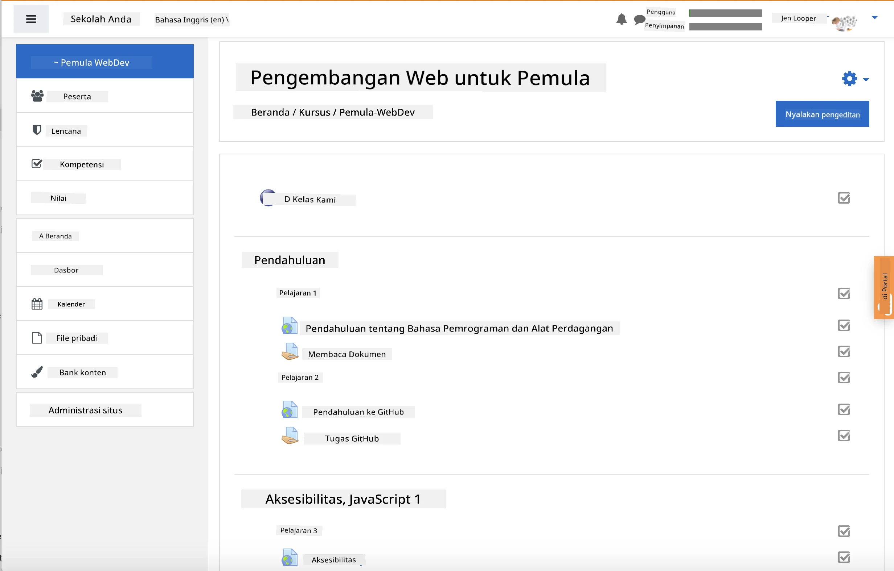
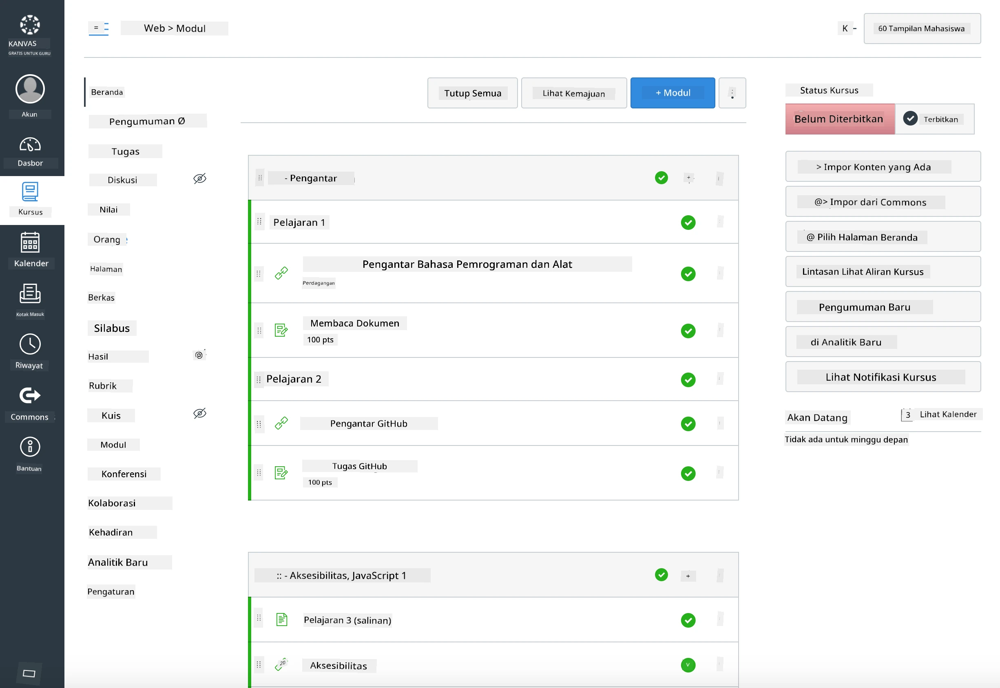

### Untuk Pendidik

Anda dipersilakan menggunakan kurikulum ini di kelas Anda. Kurikulum ini bekerja dengan lancar menggunakan GitHub Classroom dan platform LMS terkemuka, serta dapat digunakan sebagai repositori mandiri bersama siswa Anda.

### Penggunaan dengan GitHub Classroom

Untuk mengelola pelajaran dan tugas per kelompok, buat satu repositori per pelajaran sehingga GitHub Classroom dapat menghubungkan setiap tugas secara independen.

- Fork repositori ini ke organisasi Anda.
- Buat repositori terpisah untuk setiap pelajaran dengan mengekstrak folder pelajaran ke repositori masing-masing.
  - Opsi A: Buat repositori kosong (satu per pelajaran) dan salin isi folder pelajaran ke masing-masing repositori.
  - Opsi B: Gunakan pendekatan yang mempertahankan riwayat Git (misalnya, memisahkan folder ke repositori baru) jika Anda memerlukan asal-usul.
- Di GitHub Classroom, buat tugas per pelajaran dan arahkan ke repositori pelajaran yang sesuai.
- Pengaturan yang direkomendasikan:
  - Visibilitas repositori: privat untuk pekerjaan siswa.
  - Gunakan kode awal dari cabang default repositori pelajaran.
  - Tambahkan template issue dan pull request untuk kuis dan pengumpulan tugas.
  - Opsional: konfigurasikan autograding dan tes jika pelajaran Anda menyertakannya.
- Konvensi yang membantu:
  - Nama repositori seperti lesson-01-intro, lesson-02-html, dll.
  - Label: quiz, assignment, needs-review, late, resubmission.
  - Tag/rilis per kelompok (misalnya, v2025-term1).

Tip: Hindari menyimpan repositori di dalam folder yang disinkronkan (misalnya, OneDrive/Google Drive) untuk mencegah konflik Git di Windows.

### Penggunaan dengan Moodle, Canvas, atau Blackboard

Kurikulum ini mencakup paket yang dapat diimpor untuk alur kerja LMS umum.

- Moodle: Gunakan file unggahan Moodle [Moodle upload file](../../../../../../../teaching-files/webdev-moodle.mbz) untuk memuat seluruh kursus.
- Common Cartridge: Gunakan file Common Cartridge [Common Cartridge file](../../../../../../../teaching-files/webdev-common-cartridge.imscc) untuk kompatibilitas LMS yang lebih luas.
- Catatan:
  - Moodle Cloud memiliki dukungan Common Cartridge yang terbatas. Lebih baik gunakan file Moodle di atas, yang juga dapat diunggah ke Canvas.
  - Setelah diimpor, tinjau modul, tanggal jatuh tempo, dan pengaturan kuis agar sesuai dengan jadwal semester Anda.

> Kurikulum di kelas Moodle

> Kurikulum di Canvas

### Penggunaan repositori secara langsung (tanpa Classroom)

Jika Anda lebih memilih untuk tidak menggunakan GitHub Classroom, Anda dapat menjalankan kursus langsung dari repositori ini.

- Format sinkron/daring (Zoom/Teams):
  - Jalankan pemanasan singkat yang dipandu mentor; gunakan breakout room untuk kuis.
  - Umumkan jendela waktu untuk kuis; siswa mengirimkan jawaban sebagai GitHub Issues.
  - Untuk tugas kolaboratif, siswa bekerja di repositori pelajaran publik dan membuka pull request.
- Format privat/asinkron:
  - Siswa fork setiap pelajaran ke repositori **privat** mereka sendiri dan menambahkan Anda sebagai kolaborator.
  - Mereka mengirimkan melalui Issues (kuis) dan Pull Requests (tugas) di repositori kelas Anda atau fork privat mereka.

### Praktik terbaik

- Berikan pelajaran orientasi tentang dasar-dasar Git/GitHub, Issues, dan PRs.
- Gunakan daftar periksa di Issues untuk kuis/tugas yang memiliki beberapa langkah.
- Tambahkan CONTRIBUTING.md dan CODE_OF_CONDUCT.md untuk menetapkan norma kelas.
- Tambahkan catatan aksesibilitas (teks alt, caption) dan tawarkan PDF yang dapat dicetak.
- Versikan konten Anda per semester dan bekukan repositori pelajaran setelah dipublikasikan.

### Umpan balik dan dukungan

Kami ingin kurikulum ini bekerja untuk Anda dan siswa Anda. Silakan buka Issue baru di repositori ini untuk melaporkan bug, permintaan, atau perbaikan, atau mulai diskusi di Teacher Corner.

---

**Penafian**:  
Dokumen ini telah diterjemahkan menggunakan layanan penerjemahan AI [Co-op Translator](https://github.com/Azure/co-op-translator). Meskipun kami berupaya untuk memberikan hasil yang akurat, harap diperhatikan bahwa terjemahan otomatis dapat mengandung kesalahan atau ketidakakuratan. Dokumen asli dalam bahasa aslinya harus dianggap sebagai sumber yang otoritatif. Untuk informasi yang bersifat kritis, disarankan menggunakan jasa penerjemahan profesional oleh manusia. Kami tidak bertanggung jawab atas kesalahpahaman atau penafsiran yang keliru yang timbul dari penggunaan terjemahan ini.