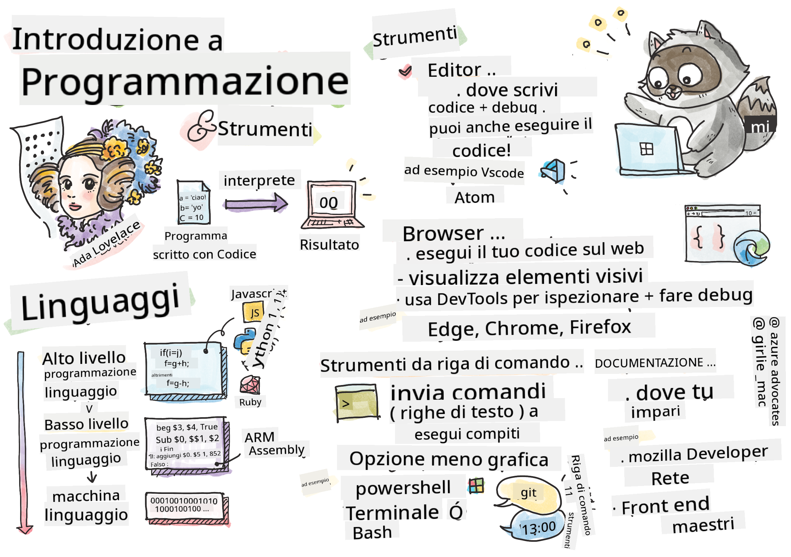

<!--
CO_OP_TRANSLATOR_METADATA:
{
  "original_hash": "2581528206a2a01c3a0b9c88e039b7bc",
  "translation_date": "2025-10-03T09:37:27+00:00",
  "source_file": "1-getting-started-lessons/1-intro-to-programming-languages/README.md",
  "language_code": "it"
}
-->
# Introduzione ai Linguaggi di Programmazione e agli Strumenti del Mestiere

Questa lezione copre le basi dei linguaggi di programmazione. Gli argomenti trattati qui si applicano alla maggior parte dei linguaggi di programmazione moderni. Nella sezione "Strumenti del Mestiere", imparerai a conoscere software utili che ti aiuteranno come sviluppatore.


> Sketchnote di [Tomomi Imura](https://twitter.com/girlie_mac)

## Quiz Pre-Lezione
[Quiz pre-lezione](https://forms.office.com/r/dru4TE0U9n?origin=lprLink)

## Introduzione

In questa lezione, tratteremo:

- Cos'è la programmazione?
- Tipi di linguaggi di programmazione
- Elementi di base di un programma
- Software e strumenti utili per lo sviluppatore professionista

> Puoi seguire questa lezione su [Microsoft Learn](https://docs.microsoft.com/learn/modules/web-development-101/introduction-programming/?WT.mc_id=academic-77807-sagibbon)!

## Cos'è la Programmazione?

La programmazione (nota anche come coding) è il processo di scrittura di istruzioni per un dispositivo, come un computer o un dispositivo mobile. Scriviamo queste istruzioni utilizzando un linguaggio di programmazione, che viene poi interpretato dal dispositivo. Questi insiemi di istruzioni possono essere chiamati in vari modi, ma *programma*, *programma per computer*, *applicazione (app)* e *eseguibile* sono alcuni dei nomi più comuni.

Un *programma* può essere qualsiasi cosa scritta con codice: siti web, giochi e app per telefoni sono programmi. Sebbene sia possibile creare un programma senza scrivere codice, la logica sottostante viene interpretata dal dispositivo e quella logica è stata quasi certamente scritta con codice. Un programma che *esegue* o *interpreta* codice sta eseguendo istruzioni. Il dispositivo con cui stai leggendo questa lezione sta eseguendo un programma per visualizzarla sullo schermo.

✅ Fai una piccola ricerca: chi è considerato il primo programmatore di computer al mondo?

## Linguaggi di Programmazione

I linguaggi di programmazione permettono agli sviluppatori di scrivere istruzioni per un dispositivo. I dispositivi possono comprendere solo il linguaggio binario (1 e 0), e per *la maggior parte* degli sviluppatori non è un modo molto efficiente di comunicare. I linguaggi di programmazione sono il mezzo di comunicazione tra esseri umani e computer.

I linguaggi di programmazione hanno formati diversi e possono servire a scopi differenti. Ad esempio, JavaScript è utilizzato principalmente per applicazioni web, mentre Bash è usato principalmente per sistemi operativi.

I linguaggi *di basso livello* richiedono generalmente meno passaggi rispetto ai linguaggi *di alto livello* per interpretare le istruzioni. Tuttavia, ciò che rende i linguaggi di alto livello popolari è la loro leggibilità e il supporto che offrono. JavaScript è considerato un linguaggio di alto livello.

Il seguente codice illustra la differenza tra un linguaggio di alto livello, come JavaScript, e un linguaggio di basso livello, come il codice assembly ARM.

```javascript
let number = 10
let n1 = 0, n2 = 1, nextTerm;

for (let i = 1; i <= number; i++) {
    console.log(n1);
    nextTerm = n1 + n2;
    n1 = n2;
    n2 = nextTerm;
}
```

```c
 area ascen,code,readonly
 entry
 code32
 adr r0,thumb+1
 bx r0
 code16
thumb
 mov r0,#00
 sub r0,r0,#01
 mov r1,#01
 mov r4,#10
 ldr r2,=0x40000000
back add r0,r1
 str r0,[r2]
 add r2,#04
 mov r3,r0
 mov r0,r1
 mov r1,r3
 sub r4,#01
 cmp r4,#00
 bne back
 end
```

Credici o no, *entrambi fanno la stessa cosa*: stampano una sequenza di Fibonacci fino a 10.

✅ Una sequenza di Fibonacci è [definita](https://en.wikipedia.org/wiki/Fibonacci_number) come un insieme di numeri in cui ogni numero è la somma dei due precedenti, a partire da 0 e 1. I primi 10 numeri della sequenza di Fibonacci sono 0, 1, 1, 2, 3, 5, 8, 13, 21 e 34.

## Elementi di un Programma

Una singola istruzione in un programma è chiamata *statement* e di solito ha un carattere o uno spazio che indica dove termina l'istruzione, o *termina*. Il modo in cui un programma termina varia a seconda del linguaggio.

Gli statement in un programma possono dipendere da dati forniti da un utente o da altre fonti per eseguire le istruzioni. I dati possono influenzare il comportamento di un programma, quindi i linguaggi di programmazione includono un modo per memorizzare temporaneamente i dati per un uso successivo. Questi sono chiamati *variabili*. Le variabili sono istruzioni che indicano a un dispositivo di salvare i dati nella sua memoria. Le variabili nei programmi sono simili alle variabili in algebra, dove hanno un nome unico e il loro valore può cambiare nel tempo.

C'è la possibilità che alcune istruzioni non vengano eseguite da un dispositivo. Questo di solito accade per scelta dello sviluppatore o per errore quando si verifica un problema imprevisto. Questo tipo di controllo su un'applicazione la rende più robusta e manutenibile. Tipicamente, questi cambiamenti di controllo avvengono quando vengono soddisfatte determinate condizioni. Un'istruzione comune utilizzata nella programmazione moderna per controllare il funzionamento di un programma è l'istruzione `if..else`.

✅ Imparerai di più su questo tipo di istruzione nelle lezioni successive.

## Strumenti del Mestiere

[](https://youtube.com/watch?v=69WJeXGBdxg "Tools of the Trade")

> 🎥 Clicca sull'immagine sopra per un video sugli strumenti

In questa sezione, imparerai a conoscere alcuni software che potrebbero esserti molto utili mentre inizi il tuo percorso di sviluppo professionale.

Un **ambiente di sviluppo** è un insieme unico di strumenti e funzionalità che uno sviluppatore utilizza spesso quando scrive software. Alcuni di questi strumenti sono stati personalizzati per le esigenze specifiche dello sviluppatore e possono cambiare nel tempo se lo sviluppatore modifica le priorità nel lavoro, nei progetti personali o quando utilizza un linguaggio di programmazione diverso. Gli ambienti di sviluppo sono unici quanto gli sviluppatori che li utilizzano.

### Editor

Uno degli strumenti più cruciali per lo sviluppo software è l'editor. Gli editor sono il luogo in cui scrivi il tuo codice e, a volte, dove lo esegui.

Gli sviluppatori si affidano agli editor per diversi motivi aggiuntivi:

- Il *debugging* aiuta a scoprire bug ed errori analizzando il codice, riga per riga. Alcuni editor hanno funzionalità di debugging; possono essere personalizzati e aggiunti per linguaggi di programmazione specifici.
- L'*evidenziazione della sintassi* aggiunge colori e formattazione al testo del codice, rendendolo più facile da leggere. La maggior parte degli editor consente di personalizzare l'evidenziazione della sintassi.
- Le *estensioni e integrazioni* sono strumenti specializzati per sviluppatori, creati da sviluppatori. Questi strumenti non sono inclusi nell'editor di base. Ad esempio, molti sviluppatori documentano il loro codice per spiegare come funziona. Possono installare un'estensione per il controllo ortografico per individuare errori di battitura nella documentazione. La maggior parte delle estensioni è destinata a un editor specifico, e la maggior parte degli editor include un modo per cercare le estensioni disponibili.
- La *personalizzazione* consente agli sviluppatori di creare un ambiente di sviluppo unico per soddisfare le loro esigenze. La maggior parte degli editor è estremamente personalizzabile e può anche permettere agli sviluppatori di creare estensioni personalizzate.

#### Editor Popolari ed Estensioni per lo Sviluppo Web

- [Visual Studio Code](https://code.visualstudio.com/?WT.mc_id=academic-77807-sagibbon)
  - [Code Spell Checker](https://marketplace.visualstudio.com/items?itemName=streetsidesoftware.code-spell-checker)
  - [Live Share](https://marketplace.visualstudio.com/items?itemName=MS-vsliveshare.vsliveshare)
  - [Prettier - Code formatter](https://marketplace.visualstudio.com/items?itemName=esbenp.prettier-vscode)
- [Atom](https://atom.io/)
  - [spell-check](https://atom.io/packages/spell-check)
  - [teletype](https://atom.io/packages/teletype)
  - [atom-beautify](https://atom.io/packages/atom-beautify)
  
- [Sublimetext](https://www.sublimetext.com/)
  - [emmet](https://emmet.io/)
  - [SublimeLinter](http://www.sublimelinter.com/en/stable/)

### Browser

Un altro strumento cruciale è il browser. Gli sviluppatori web si affidano al browser per vedere come il loro codice viene eseguito sul web. È anche utilizzato per visualizzare gli elementi visivi di una pagina web scritti nell'editor, come HTML.

Molti browser includono *strumenti per sviluppatori* (DevTools) che contengono un insieme di funzionalità utili e informazioni per aiutare gli sviluppatori a raccogliere e catturare informazioni importanti sulla loro applicazione. Ad esempio: se una pagina web presenta errori, a volte è utile sapere quando si sono verificati. I DevTools di un browser possono essere configurati per catturare queste informazioni.

#### Browser Popolari e DevTools

- [Edge](https://docs.microsoft.com/microsoft-edge/devtools-guide-chromium/?WT.mc_id=academic-77807-sagibbon)
- [Chrome](https://developers.google.com/web/tools/chrome-devtools/)
- [Firefox](https://developer.mozilla.org/docs/Tools)

### Strumenti da Linea di Comando

Alcuni sviluppatori preferiscono una visualizzazione meno grafica per le loro attività quotidiane e si affidano alla linea di comando per raggiungere questo obiettivo. Scrivere codice richiede una quantità significativa di digitazione e alcuni sviluppatori preferiscono non interrompere il loro flusso sulla tastiera. Utilizzano scorciatoie da tastiera per passare tra finestre del desktop, lavorare su file diversi e utilizzare strumenti. La maggior parte delle attività può essere completata con un mouse, ma uno dei vantaggi della linea di comando è che molte operazioni possono essere eseguite con strumenti da linea di comando senza la necessità di passare tra mouse e tastiera. Un altro vantaggio della linea di comando è che è configurabile: puoi salvare una configurazione personalizzata, modificarla in seguito e importarla su altre macchine di sviluppo. Poiché gli ambienti di sviluppo sono così unici per ogni sviluppatore, alcuni eviteranno di usare la linea di comando, altri si affideranno completamente ad essa, e altri preferiranno un mix delle due.

### Opzioni Popolari per la Linea di Comando

Le opzioni per la linea di comando variano in base al sistema operativo utilizzato.

*💻 = preinstallato sul sistema operativo.*

#### Windows

- [Powershell](https://docs.microsoft.com/powershell/scripting/overview?view=powershell-7/?WT.mc_id=academic-77807-sagibbon) 💻
- [Command Line](https://docs.microsoft.com/windows-server/administration/windows-commands/windows-commands/?WT.mc_id=academic-77807-sagibbon) (nota anche come CMD) 💻
- [Windows Terminal](https://docs.microsoft.com/windows/terminal/?WT.mc_id=academic-77807-sagibbon)
- [mintty](https://mintty.github.io/)
  
#### MacOS

- [Terminal](https://support.apple.com/guide/terminal/open-or-quit-terminal-apd5265185d-f365-44cb-8b09-71a064a42125/mac) 💻
- [iTerm](https://iterm2.com/)
- [Powershell](https://docs.microsoft.com/powershell/scripting/install/installing-powershell-core-on-macos?view=powershell-7/?WT.mc_id=academic-77807-sagibbon)

#### Linux

- [Bash](https://www.gnu.org/software/bash/manual/html_node/index.html) 💻
- [KDE Konsole](https://docs.kde.org/trunk5/en/konsole/konsole/index.html)
- [Powershell](https://docs.microsoft.com/powershell/scripting/install/installing-powershell-core-on-linux?view=powershell-7/?WT.mc_id=academic-77807-sagibbon)

#### Strumenti Popolari da Linea di Comando

- [Git](https://git-scm.com/) (💻 sulla maggior parte dei sistemi operativi)
- [NPM](https://www.npmjs.com/)
- [Yarn](https://classic.yarnpkg.com/en/docs/cli/)

### Documentazione

Quando uno sviluppatore vuole imparare qualcosa di nuovo, probabilmente si rivolgerà alla documentazione per capire come utilizzarlo. Gli sviluppatori spesso si affidano alla documentazione per guidarli su come utilizzare correttamente strumenti e linguaggi, e anche per approfondire la loro conoscenza su come funzionano.

#### Documentazione Popolare sullo Sviluppo Web

- [Mozilla Developer Network (MDN)](https://developer.mozilla.org/docs/Web), da Mozilla, gli editori del browser [Firefox](https://www.mozilla.org/firefox/)
- [Frontend Masters](https://frontendmasters.com/learn/)
- [Web.dev](https://web.dev), da Google, editori di [Chrome](https://www.google.com/chrome/)
- [Documentazione per sviluppatori di Microsoft](https://docs.microsoft.com/microsoft-edge/#microsoft-edge-for-developers), per [Microsoft Edge](https://www.microsoft.com/edge)
- [W3 Schools](https://www.w3schools.com/where_to_start.asp)

✅ Fai una ricerca: Ora che conosci le basi dell'ambiente di uno sviluppatore web, confrontalo con l'ambiente di un designer web.

---

## 🚀 Sfida

Confronta alcuni linguaggi di programmazione. Quali sono alcune delle caratteristiche uniche di JavaScript rispetto a Java? E di COBOL rispetto a Go?

## Quiz Post-Lezione
[Quiz post-lezione](https://ff-quizzes.netlify.app/web/)

## Revisione e Studio Autonomo

Studia un po' i diversi linguaggi disponibili per il programmatore. Prova a scrivere una riga in un linguaggio e poi riscrivila in altri due. Cosa hai imparato?

## Compito

[Leggere la Documentazione](assignment.md)

> Nota: Quando selezioni gli strumenti per il tuo compito, non scegliere editor, browser o strumenti da linea di comando già elencati sopra.

---

**Disclaimer**:  
Questo documento è stato tradotto utilizzando il servizio di traduzione automatica [Co-op Translator](https://github.com/Azure/co-op-translator). Sebbene ci impegniamo per garantire l'accuratezza, si prega di notare che le traduzioni automatiche possono contenere errori o imprecisioni. Il documento originale nella sua lingua nativa dovrebbe essere considerato la fonte autorevole. Per informazioni critiche, si raccomanda una traduzione professionale effettuata da un traduttore umano. Non siamo responsabili per eventuali incomprensioni o interpretazioni errate derivanti dall'uso di questa traduzione.