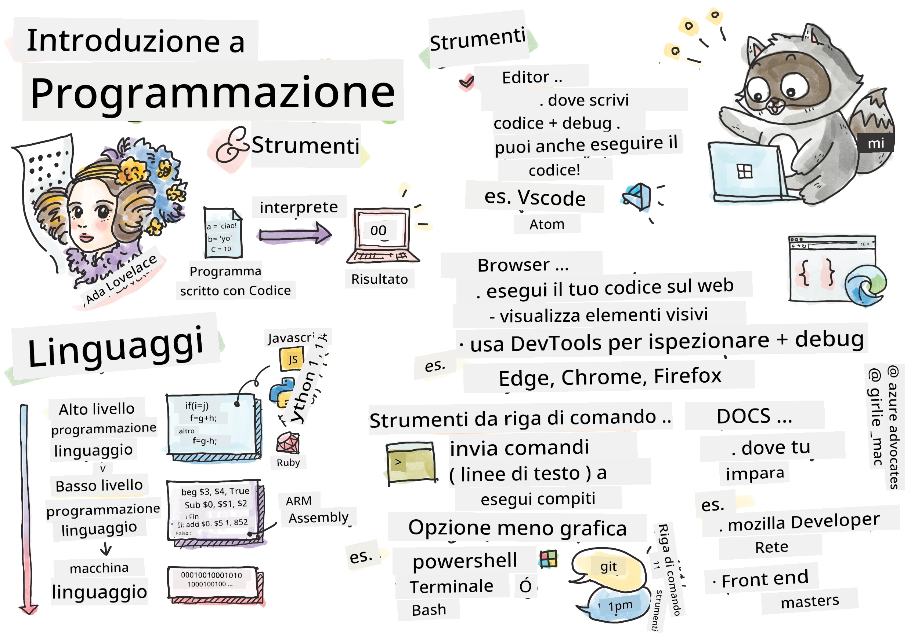
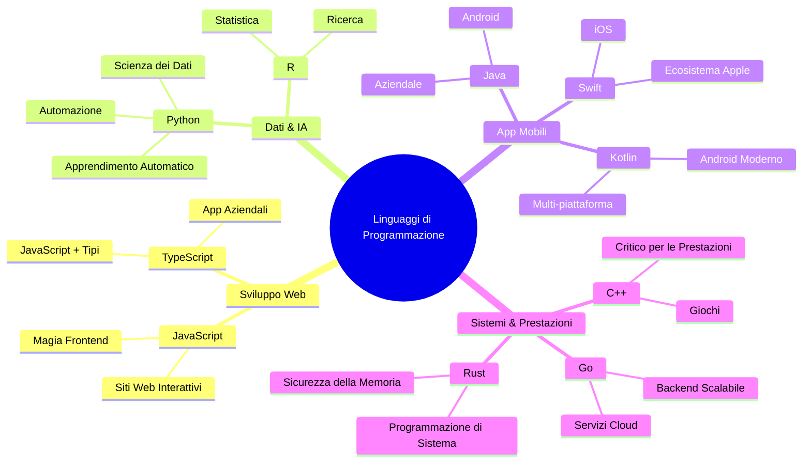
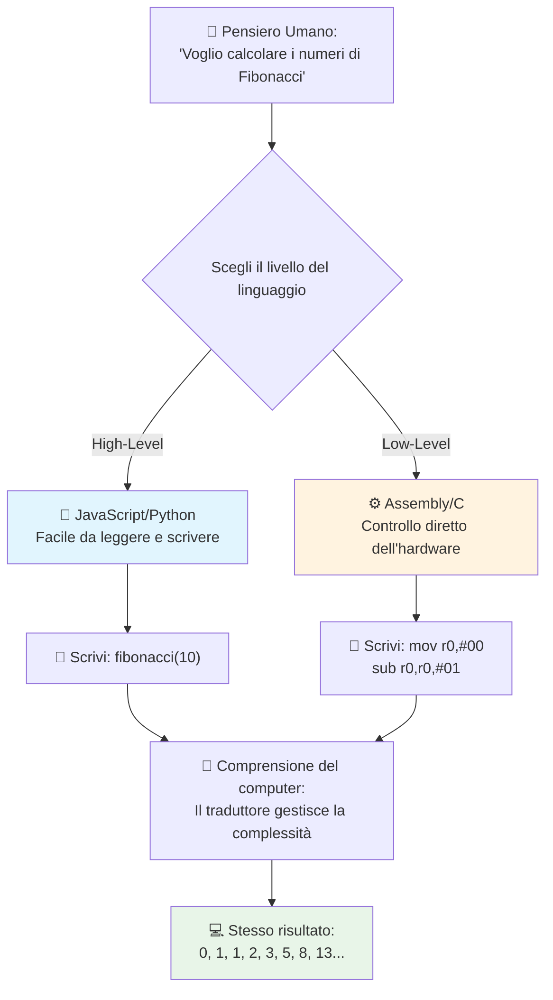
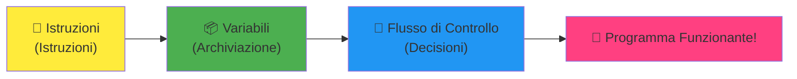
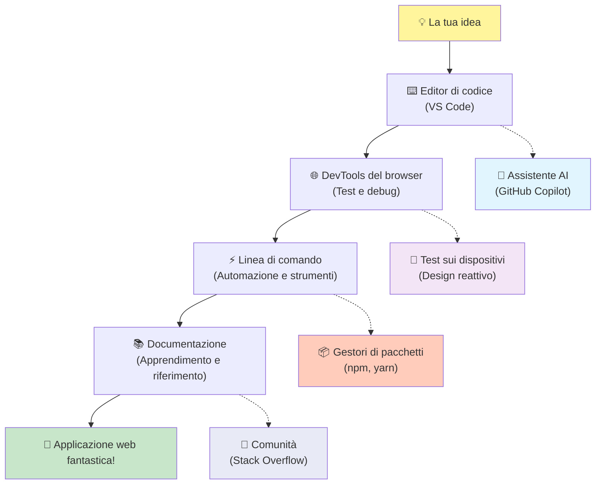
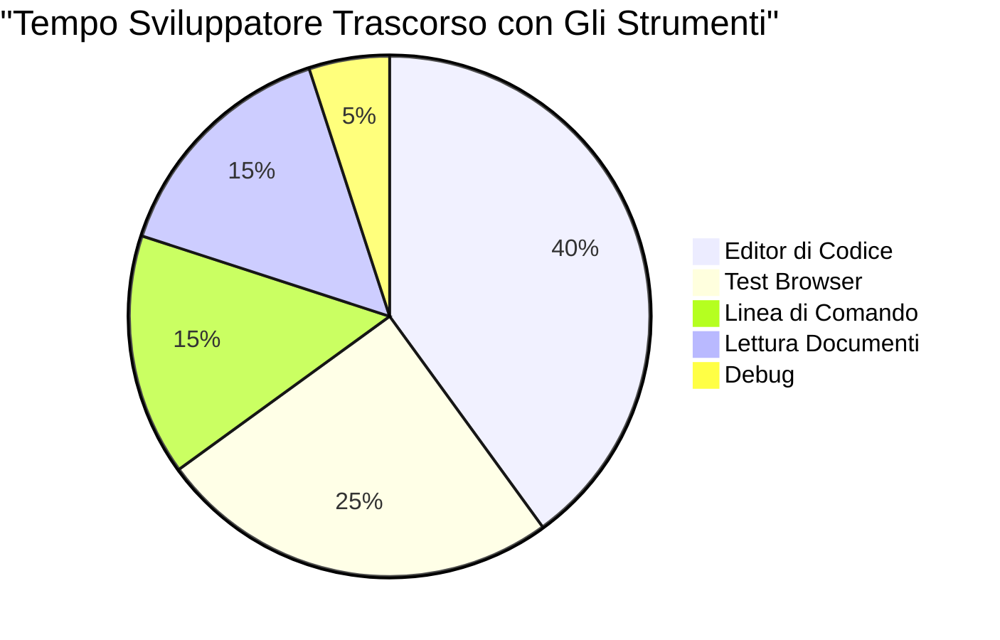
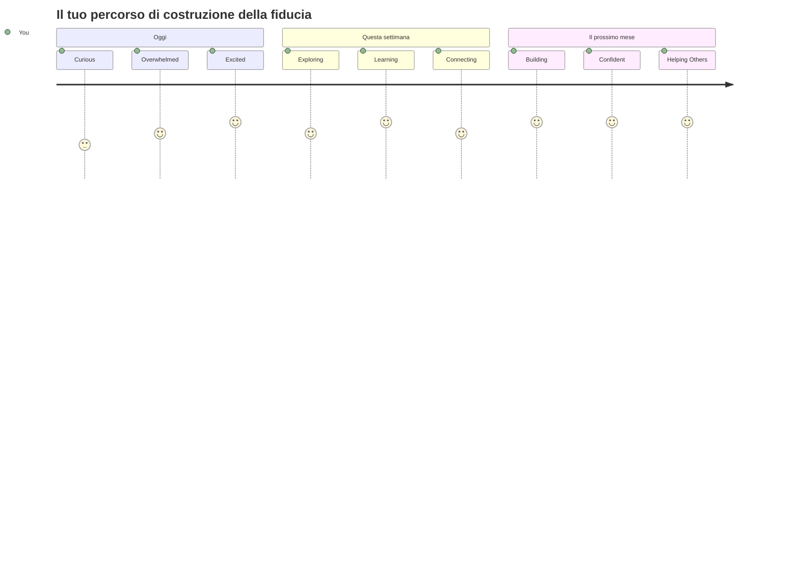

# Introduzione ai Linguaggi di Programmazione e agli Strumenti Moderni per Sviluppatori
 
Ciao, futuro sviluppatore! 👋 Posso dirti qualcosa che ancora mi fa venire i brividi ogni singolo giorno? Stai per scoprire che programmare non riguarda solo i computer – è avere veri superpoteri per dare vita alle tue idee più folli!

Sai quel momento in cui usi la tua app preferita e tutto funziona perfettamente? Quando premi un pulsante e succede qualcosa di assolutamente magico che ti fa dire "wow, come hanno FATTO?" Beh, qualcuno proprio come te – probabilmente seduto nel suo bar preferito alle 2 di notte con il suo terzo espresso – ha scritto il codice che ha creato quella magia. Ecco cosa ti stupirà: alla fine di questa lezione, non solo capirai come hanno fatto, ma sarai ansioso di provarci tu stesso!

Guarda, capisco benissimo se ora la programmazione ti sembra intimidatoria. Quando ho iniziato, pensavo davvero che servisse essere un genio della matematica o aver programmato da quando avevi cinque anni. Ma ecco cosa ha cambiato completamente la mia prospettiva: programmare è esattamente come imparare a conversare in una nuova lingua. Inizi con "ciao" e "grazie", poi arrivano gli ordini per il caffè, e prima che te ne accorga, stai discutendo di filosofia profonda! Solo che in questo caso, stai conversando con i computer, e sinceramente? Sono i compagni di conversazione più pazienti che tu possa mai avere – non giudicano mai i tuoi errori e sono sempre entusiasti di riprovare!

Oggi esploreremo gli incredibili strumenti che rendono lo sviluppo web moderno non solo possibile, ma davvero coinvolgente. Sto parlando degli stessi editor, browser e flussi di lavoro che gli sviluppatori di Netflix, Spotify e del tuo studio indie preferito usano ogni giorno. Ecco la parte che ti farà fare un salto di gioia: la maggior parte di questi strumenti professionali e di livello industriale sono completamente gratuiti!


> Sketchnote di [Tomomi Imura](https://twitter.com/girlie_mac)


```mermaid
journey
    title Il Tuo Viaggio di Programmazione Oggi
    section Scoprire
      Cos'è la Programmazione: 5: You
      Linguaggi di Programmazione: 4: You
      Panoramica Strumenti: 5: You
    section Esplorare
      Editor di Codice: 4: You
      Browser & DevTools: 5: You
      Linea di Comando: 3: You
    section Praticare
      Detective del Linguaggio: 4: You
      Esplorazione Strumenti: 5: You
      Connessione con la Comunità: 5: You
```
## Vediamo Cosa Sai Già!

Prima di tuffarci nelle cose divertenti, sono curioso – cosa sai già di questo mondo della programmazione? E ascolta, se stai guardando queste domande pensando "non ho proprio idea di niente," non è solo ok, è perfetto! Questo significa che sei nel posto giusto. Pensa a questo quiz come a uno stretching prima di un allenamento – stiamo solo riscaldando quei muscoli cerebrali!

[Partecipa al quiz pre-lezione](https://ff-quizzes.netlify.app/web/)


## L'Avventura che Stiamo per Intraprendere Insieme

Ok, sono davvero emozionato per quello che esploreremo oggi! Davvero, vorrei vedere la tua faccia quando alcuni concetti ti scattano. Ecco il fantastico viaggio che faremo insieme:

- **Cos'è davvero la programmazione (e perché è la cosa più figa in assoluto!)** – Scopriremo come il codice sia letteralmente la magia invisibile che alimenta tutto ciò che ti circonda, dalla sveglia che in qualche modo sa che è lunedì mattina all’algoritmo che cura perfettamente le tue raccomandazioni su Netflix
- **I linguaggi di programmazione e le loro personalità straordinarie** – Immagina di entrare in una festa dove ogni persona ha superpoteri e modi di risolvere problemi completamente diversi. Ecco com’è il mondo dei linguaggi di programmazione, e li adorerai!
- **I mattoncini fondamentali che fanno succedere la magia digitale** – Pensali come il set LEGO creativo definitivo. Una volta capito come si incastrano, ti renderai conto di poter costruire letteralmente qualsiasi cosa la tua immaginazione sogni
- **Strumenti professionali che ti faranno sentire come se ti avessero appena dato la bacchetta di un mago** – Non sto esagerando – questi strumenti ti faranno davvero sentire come se avessi superpoteri, e la parte migliore? Sono gli stessi che usano i professionisti!

> 💡 **Ecco la cosa**: Non pensare nemmeno di dover memorizzare tutto oggi! Ora voglio solo che tu senta quella scintilla di entusiasmo per quello che è possibile fare. I dettagli verranno da soli mentre esercitiamo insieme – è così che si impara davvero!

> Puoi seguire questa lezione su [Microsoft Learn](https://learn.microsoft.com/en-us/learn/modules/web-development-101/introduction-programming/?WT.mc_id=academic-77807-sagibbon)!

## Quindi, Cos'è Esattamente la Programmazione?

Ok, affrontiamo la domanda da un milione di dollari: cos’è davvero la programmazione?

Ti racconterò una storia che ha cambiato completamente il mio modo di vedere le cose. La settimana scorsa stavo cercando di spiegare a mia mamma come usare il nostro nuovo telecomando smart per la TV. Mi sono ritrovato a dire cose come "Premi il bottone rosso, ma non il grande rosso, il piccolo rosso a sinistra... no, l’altro sinistro... ok, ora tienilo premuto per due secondi, non uno, non tre..." Ti suona familiare? 😅

Questa è la programmazione! È l’arte di dare istruzioni dettagliatissime, passo dopo passo, a qualcosa di potentissimo ma che ha bisogno che tutto sia spiegato perfettamente. Solo che invece di spiegare a tua mamma (che può chiedere "quale bottone rosso?!"), stai spiegando a un computer (che fa esattamente quello che dici, anche se quello che hai detto non è proprio quello che intendevi).

Ecco cosa mi ha lasciato a bocca aperta quando ho imparato questa cosa: i computer sono in realtà molto semplici nella loro essenza. Capiscono letteralmente solo due cose – 1 e 0, che è praticamente solo "sì" e "no" o "acceso" e "spento." Tutto qui! Ma ecco dove succede la magia – non dobbiamo parlare in 1 e 0 come se fossimo in Matrix. Qui entrano in gioco i **linguaggi di programmazione**. Sono come avere il traduttore migliore del mondo che prende i tuoi pensieri umani e li trasforma in linguaggio del computer.

Ecco cosa ancora mi fa venire i brividi tutti i giorni appena mi sveglio: letteralmente *tutto* ciò che è digitale nella tua vita è iniziato con qualcuno proprio come te, probabilmente in pigiama con una tazza di caffè, che digitava codice sul suo portatile. Quel filtro Instagram che ti fa sembrare perfetto? Qualcuno l’ha programmato. La raccomandazione che ti ha portato alla tua nuova canzone preferita? Un sviluppatore ha costruito quell’algoritmo. L’app che ti aiuta a dividere i conti della cena con gli amici? Sì, qualcuno ha pensato "questa cosa è fastidiosa, posso sistemarla" e poi... l’ha fatto!

Quando impari a programmare, non stai solo acquisendo una nuova abilità – stai diventando parte di una comunità incredibile di risolutori di problemi che ogni giorno pensano: "E se potessi costruire qualcosa che renda il giorno di qualcuno un po’ migliore?" Davvero, c’è qualcosa di più figo di questo?

✅ **Caccia al fatto curioso**: Ecco una cosa super interessante da cercare quando hai un momento libero – chi pensi sia stato il primo programmatore del mondo? Ti do un indizio: potrebbe non essere chi aspetti! La storia di questa persona è assolutamente affascinante e dimostra che la programmazione è sempre stata questione di pensiero creativo e problem solving fuori dagli schemi.

### 🧠 **Momento di Verifica: Come Ti Senti?**

**Prenditi un momento per riflettere:**
- Ora ha senso l’idea di "dare istruzioni ai computer"?
- Riesci a pensare a un compito quotidiano che vorresti automatizzare con la programmazione?
- Quali domande ti stanno venendo in mente su questo mondo della programmazione?

> **Ricorda**: È completamente normale se alcuni concetti ora ti sembrano confusi. Imparare a programmare è come imparare una nuova lingua – ci vuole tempo perché il cervello costruisca quei collegamenti neurali. Stai andando alla grande!

## I Linguaggi di Programmazione Sono Come Diversi Gusti di Magia

Ok, può sembrare strano, ma seguimi – i linguaggi di programmazione sono molto simili a diversi tipi di musica. Pensaci: hai il jazz, che è fluido e improvvisato, il rock potente e diretto, la classica elegante e strutturata, e l’hip-hop creativo ed espressivo. Ogni stile ha il suo mood, la sua comunità di fan appassionati, e ognuno è perfetto per occasioni e stati d’animo diversi.

I linguaggi di programmazione funzionano esattamente allo stesso modo! Non useresti lo stesso linguaggio per costruire un gioco mobile divertente che per elaborare enormi quantità di dati climatici, proprio come non suoneresti death metal a una lezione di yoga (beh, quasi sempre! 😄).

Ma ecco cosa mi stupisce ogni volta che ci penso: questi linguaggi sono come avere il traduttore più paziente e brillante del mondo seduto proprio accanto a te. Puoi esprimere le tue idee in un modo che è naturale per il tuo cervello umano, e loro si occupano di tutto quel lavoro incredibilmente complesso di traduzione in 1 e 0 che i computer parlano davvero. È come avere un amico che parla perfettamente sia la "creatività umana" che la "logica del computer" – e non si stanca mai, non ha bisogno di pause caffè, e non ti giudica se fai la stessa domanda due volte!

### Linguaggi di Programmazione Popolari e i Loro Usi


```mermaid
mindmap
  root((Linguaggi di Programmazione))
    Sviluppo Web
      JavaScript
        Magia Frontend
        Siti Web Interattivi
      TypeScript
        JavaScript + Tipi
        App Aziendali
    Dati & IA
      Python
        Scienza dei Dati
        Apprendimento Automatico
        Automazione
      R
        Statistica
        Ricerca
    App Mobili
      Java
        Android
        Aziendale
      Swift
        iOS
        Ecosistema Apple
      Kotlin
        Android Moderno
        Multi-piattaforma
    Sistemi & Prestazioni
      C++
        Giochi
        Critico per le Prestazioni
      Rust
        Sicurezza della Memoria
        Programmazione di Sistema
      Go
        Servizi Cloud
        Backend Scalabile
```
| Language | Ideale Per | Perché è Popolare |
|----------|----------|------------------|
| **JavaScript** | Sviluppo web, interfacce utente | Funziona nei browser e alimenta siti interattivi |
| **Python** | Data science, automazione, AI | Facile da leggere e imparare, librerie potenti |
| **Java** | Applicazioni enterprise, app Android | Indipendente dalla piattaforma, robusto per grandi sistemi |
| **C#** | Applicazioni Windows, sviluppo giochi | Forte supporto dall’ecosistema Microsoft |
| **Go** | Servizi cloud, sistemi backend | Veloce, semplice, progettato per il computing moderno |

### Linguaggi di Alto Livello vs. Basso Livello

Ok, questo è stato davvero il concetto che mi ha mandato in tilt quando ho iniziato, quindi ti condivido l’analogia che alla fine mi ha fatto capire tutto – e spero davvero aiuti anche te!

Immagina di visitare un paese dove non parli la lingua e hai disperatamente bisogno di trovare il bagno più vicino (ci siamo passati tutti, giusto? 😅):

- **La programmazione a basso livello** è come imparare il dialetto locale così bene da poter parlare con la nonna che vende la frutta all’angolo usando riferimenti culturali, slang locale e battute interne che solo chi è cresciuto lì capirebbe. Super impressionante e incredibilmente efficiente... se sei fluente! Ma un po’ opprimente se stai solo cercando un bagno.

- **La programmazione ad alto livello** è come avere quell’amico del posto incredibile che ti capisce subito. Puoi dire "Ho proprio bisogno di trovare un bagno" in inglese semplice, e lui si occupa di tutta la traduzione culturale e ti dà indicazioni che hanno senso per il tuo cervello da turista.

In termini di programmazione:
- **I linguaggi a basso livello** (come Assembly o C) ti permettono di avere conversazioni incredibilmente dettagliate con l’hardware reale del computer, ma devi pensare come una macchina, il che è… beh, diciamo che è un gran salto mentale!
- **I linguaggi ad alto livello** (come JavaScript, Python o C#) ti permettono di pensare come un umano mentre loro gestiscono tutto il linguaggio macchina dietro le quinte. In più hanno comunità incredibilmente accoglienti piene di persone che ricordano cosa vuol dire essere nuovi e che vogliono davvero aiutarti!

Indovina con quali ti suggerirò di iniziare? 😉 I linguaggi ad alto livello sono come le rotelle di supporto che probabilmente non vorrai mai togliere perché rendono l’esperienza molto più piacevole!


```mermaid
flowchart TB
    A["👤 Pensiero Umano:<br/>'Voglio calcolare i numeri di Fibonacci'"] --> B{Scegli il livello del linguaggio}
    
    B -->|High-Level| C["🌟 JavaScript/Python<br/>Facile da leggere e scrivere"]
    B -->|Low-Level| D["⚙️ Assembly/C<br/>Controllo diretto dell'hardware"]
    
    C --> E["📝 Scrivi: fibonacci(10)"]
    D --> F["📝 Scrivi: mov r0,#00<br/>sub r0,r0,#01"]
    
    E --> G["🤖 Comprensione del computer:<br/>Il traduttore gestisce la complessità"]
    F --> G
    
    G --> H["💻 Stesso risultato:<br/>0, 1, 1, 2, 3, 5, 8, 13..."]
    
    style C fill:#e1f5fe
    style D fill:#fff3e0
    style H fill:#e8f5e8
```
### Ti Mostro Perché i Linguaggi ad Alto Livello Sono Molto Più Amichevoli

Ok, sto per mostrarti qualcosa che dimostra perfettamente perché mi sono innamorato dei linguaggi ad alto livello, ma prima – devi promettermi una cosa. Quando vedrai il primo esempio di codice, non andare nel panico! È fatto apposta per sembrare intimidatorio. Esattamente il punto che voglio sottolineare!

Esamineremo lo stesso compito scritto in due stili completamente diversi. Entrambi creano quella che si chiama sequenza di Fibonacci – è un bellissimo pattern matematico dove ogni numero è la somma dei due precedenti: 0, 1, 1, 2, 3, 5, 8, 13... (Curiosità: trovi questo pattern ovunque in natura – le spirali dei semi di girasole, i modelli delle pigne, persino la formazione delle galassie!)

Pronto a vedere la differenza? Andiamo!

**Linguaggio ad alto livello (JavaScript) – Amichevole per gli umani:**

```javascript
// Passo 1: Configurazione base di Fibonacci
const fibonacciCount = 10;
let current = 0;
let next = 1;

console.log('Fibonacci sequence:');
```

**Ecco cosa fa questo codice:**
- **Dichiara** una costante per specificare quanti numeri di Fibonacci vogliamo generare
- **Inizializza** due variabili per tracciare il numero attuale e il successivo nella sequenza
- **Imposta** i valori iniziali (0 e 1) che definiscono il pattern di Fibonacci
- **Mostra** un messaggio di intestazione per identificare il nostro output

```javascript
// Passo 2: Genera la sequenza con un ciclo
for (let i = 0; i < fibonacciCount; i++) {
  console.log(`Position ${i + 1}: ${current}`);
  
  // Calcola il numero successivo nella sequenza
  const sum = current + next;
  current = next;
  next = sum;
}
```

**Analisi di quello che succede qui:**
- **Ciclo** attraverso ogni posizione nella nostra sequenza usando un ciclo `for`
- **Mostra** ogni numero con la sua posizione usando la formattazione template literal
- **Calcola** il prossimo numero di Fibonacci sommando i valori attuale e successivo
- **Aggiorna** le variabili di tracciamento per passare all’iterazione successiva

```javascript
// Passo 3: Approccio funzionale moderno
const generateFibonacci = (count) => {
  const sequence = [0, 1];
  
  for (let i = 2; i < count; i++) {
    sequence[i] = sequence[i - 1] + sequence[i - 2];
  }
  
  return sequence;
};

// Esempio d'uso
const fibSequence = generateFibonacci(10);
console.log(fibSequence);
```

**Nel codice sopra, abbiamo:**
- **Creato** una funzione riutilizzabile usando la sintassi moderna delle arrow function
- **Costruito** un array per memorizzare la sequenza completa invece di mostrarla uno per uno
- **Usato** l’indicizzazione degli array per calcolare ogni nuovo numero dai valori precedenti
- **Restituito** la sequenza completa per un uso flessibile in altre parti del programma

**Linguaggio a basso livello (ARM Assembly) – Amichevole per il computer:**

```assembly
 area ascen,code,readonly
 entry
 code32
 adr r0,thumb+1
 bx r0
 code16
thumb
 mov r0,#00
 sub r0,r0,#01
 mov r1,#01
 mov r4,#10
 ldr r2,=0x40000000
back add r0,r1
 str r0,[r2]
 add r2,#04
 mov r3,r0
 mov r0,r1
 mov r1,r3
 sub r4,#01
 cmp r4,#00
 bne back
 end
```

Nota come la versione JavaScript legge quasi come istruzioni in inglese, mentre quella Assembly usa comandi criptici che controllano direttamente il processore del computer. Entrambe realizzano lo stesso compito, ma il linguaggio ad alto livello è molto più facile da capire, scrivere e mantenere per gli umani.

**Differenze chiave che noterai:**
- **Leggibilità**: JavaScript usa nomi descrittivi come `fibonacciCount` mentre Assembly usa etichette criptiche come `r0`, `r1`
- **Commenti**: I linguaggi di alto livello incoraggiano commenti esplicativi che rendono il codice auto-documentante
- **Struttura**: Il flusso logico di JavaScript corrisponde a come gli umani pensano ai problemi passo dopo passo
- **Manutenzione**: Aggiornare la versione JavaScript per requisiti diversi è semplice e chiaro

✅ **Sulla sequenza di Fibonacci**: Questo schema numerico assolutamente stupendo (dove ogni numero è la somma dei due precedenti: 0, 1, 1, 2, 3, 5, 8...) compare letteralmente *ovunque* in natura! Lo troverai nelle spirali dei girasoli, nei modelli delle pigne, nel modo in cui si curvano le conchiglie di nautilus, e persino nella crescita dei rami degli alberi. È davvero incredibile come matematica e codice possano aiutarci a comprendere e ricreare i modelli che la natura usa per creare bellezza!


## I Mattoni Che Creano la Magia

Bene, ora che hai visto come appaiono in azione i linguaggi di programmazione, scomponiamo i pezzi fondamentali che costituiscono letteralmente ogni programma mai scritto. Pensali come gli ingredienti essenziali nella tua ricetta preferita – una volta che capisci cosa fa ciascuno, potrai leggere e scrivere codice praticamente in qualsiasi linguaggio!

È un po' come imparare la grammatica della programmazione. Ricordi a scuola quando hai imparato i sostantivi, i verbi e come mettere insieme le frasi? La programmazione ha la sua versione di grammatica, e onestamente, è molto più logica e indulgente di quella inglese di una volta! 😄

### Istruzioni: Le Direzioni Passo-Passo

Iniziamo con le **istruzioni** – sono come singole frasi in una conversazione con il tuo computer. Ogni istruzione dice al computer di fare una cosa specifica, un po’ come dare indicazioni: "Gira a sinistra qui," "Fermati al semaforo rosso," "Parcheggia in quel posto."

Quello che adoro delle istruzioni è quanto di solito siano leggibili. Guarda questo:

```javascript
// Istruzioni di base che eseguono azioni singole
const userName = "Alex";                    
console.log("Hello, world!");              
const sum = 5 + 3;                         
```

**Ecco cosa fa questo codice:**
- **Dichiarare** una variabile costante per memorizzare il nome di un utente
- **Visualizzare** un messaggio di saluto nell'output della console
- **Calcolare** e memorizzare il risultato di un’operazione matematica

```javascript
// Istruzioni che interagiscono con le pagine web
document.title = "My Awesome Website";      
document.body.style.backgroundColor = "lightblue";
```

**Passo dopo passo, ecco cosa succede:**
- **Modificare** il titolo della pagina che appare nella scheda del browser
- **Cambiare** il colore di sfondo dell’intero corpo della pagina

### Variabili: La Memoria del Tuo Programma

Ok, le **variabili** sono onestamente uno dei miei concetti preferiti da insegnare perché sono molto simili a cose che usi già ogni singolo giorno!

Pensa per un attimo alla lista contatti del tuo telefono. Non memorizzi il numero di telefono di tutti – invece salvi "Mamma," "Migliore Amico," o "Pizzeria che consegna fino alle 2 di notte," e lasci che il telefono ricordi i numeri reali. Le variabili funzionano esattamente allo stesso modo! Sono come contenitori etichettati dove il tuo programma può memorizzare informazioni e recuperarle dopo usando un nome che ha senso.

E sai cosa è davvero bello: le variabili possono cambiare mentre il programma gira (da qui il nome “variabile” – hai visto cosa hanno fatto?). Proprio come potresti aggiornare quel contatto della pizzeria quando ne trovi una ancora migliore, le variabili possono essere aggiornate mentre il programma apprende nuove informazioni o le situazioni cambiano!

Lascia che ti mostri quanto può essere semplicissimo:

```javascript
// Passo 1: Creazione di variabili di base
const siteName = "Weather Dashboard";        
let currentWeather = "sunny";               
let temperature = 75;                       
let isRaining = false;                      
```

**Capire questi concetti:**
- **Memorizzare** valori invariati in variabili `const` (come il nome del sito)
- **Usare** `let` per valori che possono cambiare durante il programma
- **Assegnare** tipi di dati diversi: stringhe (testo), numeri, e booleani (vero/falso)
- **Scegliere** nomi descrittivi che spiegano cosa contiene ogni variabile

```javascript
// Fase 2: Lavorare con oggetti per raggruppare dati correlati
const weatherData = {                       
  location: "San Francisco",
  humidity: 65,
  windSpeed: 12
};
```

**Nel codice sopra, abbiamo:**
- **Creato** un oggetto per raggruppare insieme informazioni meteorologiche correlate
- **Organizzato** più dati sotto un unico nome di variabile
- **Usato** coppie chiave-valore per etichettare chiaramente ogni pezzo di informazione

```javascript
// Passo 3: Utilizzo e aggiornamento delle variabili
console.log(`${siteName}: Today is ${currentWeather} and ${temperature}°F`);
console.log(`Wind speed: ${weatherData.windSpeed} mph`);

// Aggiornamento delle variabili modificabili
currentWeather = "cloudy";                  
temperature = 68;                          
```

**Capire ogni parte:**
- **Visualizzare** informazioni usando template literal con la sintassi `${}`
- **Accedere** alle proprietà dell’oggetto usando la notazione a punto (`weatherData.windSpeed`)
- **Aggiornare** variabili dichiarate con `let` per riflettere condizioni in cambiamento
- **Combinare** più variabili per creare messaggi significativi

```javascript
// Passaggio 4: Distrutturazione moderna per un codice più pulito
const { location, humidity } = weatherData; 
console.log(`${location} humidity: ${humidity}%`);
```

**Cosa devi sapere:**
- **Estrarre** proprietà specifiche dagli oggetti usando assegnazione tramite destrutturazione
- **Creare** nuove variabili automaticamente con gli stessi nomi delle chiavi dell’oggetto
- **Semplificare** il codice evitando ripetute notazioni a punto

### Controllo di Flusso: Insegnare al Programma a Pensare

Ok, qui la programmazione diventa assolutamente stupefacente! Il **controllo di flusso** è sostanzialmente insegnare al tuo programma come prendere decisioni intelligenti, proprio come fai tu ogni singolo giorno senza nemmeno pensarci.

Immagina: stamattina probabilmente hai fatto qualcosa tipo "Se piove, prendo l’ombrello. Se fa freddo, metto la giacca. Se sono in ritardo, salto la colazione e prendo il caffè al volo." Il tuo cervello segue naturalmente questa logica if-then dozzine di volte ogni giorno!

Questo è ciò che fa sentire i programmi intelligenti e vivi invece di semplicemente seguire uno script noioso e prevedibile. Possono guardare una situazione, valutarla e rispondere di conseguenza. È come dare al tuo programma un cervello che può adattarsi e fare scelte!

Vuoi vedere quanto funziona bene? Lascia che ti mostri:

```javascript
// Passo 1: Logica condizionale di base
const userAge = 17;

if (userAge >= 18) {
  console.log("You can vote!");
} else {
  const yearsToWait = 18 - userAge;
  console.log(`You'll be able to vote in ${yearsToWait} year(s).`);
}
```

**Ecco cosa fa questo codice:**
- **Controlla** se l’età dell’utente soddisfa il requisito per votare
- **Esegue** diversi blocchi di codice basandosi sul risultato della condizione
- **Calcola** e mostra quanto manca all’idoneità al voto se sotto i 18 anni
- **Fornisce** feedback specifici e utili per ogni scenario

```javascript
// Passo 2: Molteplici condizioni con operatori logici
const userAge = 17;
const hasPermission = true;

if (userAge >= 18 && hasPermission) {
  console.log("Access granted: You can enter the venue.");
} else if (userAge >= 16) {
  console.log("You need parent permission to enter.");
} else {
  console.log("Sorry, you must be at least 16 years old.");
}
```

**Spieghiamo cosa succede qui:**
- **Combina** più condizioni usando l’operatore `&&` (e)
- **Crea** una gerarchia di condizioni usando `else if` per più scenari
- **Gestisce** tutti i casi possibili con una dichiarazione finale `else`
- **Fornisce** feedback chiari e azionabili per ogni situazione differente

```javascript
// Passo 3: Condizionale conciso con operatore ternario
const votingStatus = userAge >= 18 ? "Can vote" : "Cannot vote yet";
console.log(`Status: ${votingStatus}`);
```

**Cosa devi ricordare:**
- **Usa** l’operatore ternario (`? :`) per condizioni semplici a due opzioni
- **Scrivi** prima la condizione, seguita da `?`, poi il risultato vero, poi `:`, poi il risultato falso
- **Applica** questo modello quando devi assegnare valori basati su condizioni

```javascript
// Passo 4: Gestione di più casi specifici
const dayOfWeek = "Tuesday";

switch (dayOfWeek) {
  case "Monday":
  case "Tuesday":
  case "Wednesday":
  case "Thursday":
  case "Friday":
    console.log("It's a weekday - time to work!");
    break;
  case "Saturday":
  case "Sunday":
    console.log("It's the weekend - time to relax!");
    break;
  default:
    console.log("Invalid day of the week");
}
```

**Questo codice fa le seguenti cose:**
- **Confronta** il valore di una variabile con casi specifici multipli
- **Raggruppa** casi simili insieme (giorni feriali vs. fine settimana)
- **Esegue** il blocco di codice appropriato quando trova una corrispondenza
- **Include** un caso `default` per gestire valori inattesi
- **Usa** istruzioni `break` per evitare che il codice prosegua al caso successivo

> 💡 **Analogia reale**: Pensa al controllo di flusso come ad avere il GPS più paziente del mondo che ti dà le indicazioni. Potrebbe dire "Se c’è traffico in Via Principale, prendi invece l’autostrada. Se i lavori bloccano l’autostrada, prova la strada panoramica." I programmi usano esattamente lo stesso tipo di logica condizionale per rispondere in modo intelligente a situazioni diverse e dare sempre agli utenti la migliore esperienza possibile.

### 🎯 **Controllo Concettuale: Padronanza dei Mattoni**

**Vediamo come te la cavi con i fondamentali:**
- Riesci a spiegare la differenza tra una variabile e un’istruzione con parole tue?
- Pensa a uno scenario reale dove useresti una decisione if-then (come nel nostro esempio del voto)
- Qual è una cosa della logica di programmazione che ti ha sorpreso?

**Piccolo aumento di fiducia:**

```mermaid
flowchart LR
    A["📝 Istruzioni<br/>(Istruzioni)"] --> B["📦 Variabili<br/>(Archiviazione)"] --> C["🔀 Flusso di Controllo<br/>(Decisioni)"] --> D["🎉 Programma Funzionante!"]
    
    style A fill:#ffeb3b
    style B fill:#4caf50
    style C fill:#2196f3
    style D fill:#ff4081
```
✅ **Cosa verrà dopo**: Ci divertiremo un sacco ad approfondire questi concetti mentre continuiamo questo incredibile viaggio insieme! Per ora, concentrati solo sul sentire l’eccitazione per tutte le straordinarie possibilità che ti aspettano. Le competenze e le tecniche specifiche ti resteranno naturali man mano che praticheremo insieme – prometto che sarà molto più divertente di quanto ti aspetti!

## Strumenti del Mestiere

Ok, questa è davvero la parte in cui mi emoziono così tanto che a malapena riesco a contenermi! 🚀 Stiamo per parlare degli incredibili strumenti che ti faranno sentire come se ti avessero appena consegnato le chiavi di un’astronave digitale.

Sai come uno chef ha quei coltelli perfettamente bilanciati che sembrano un’estensione delle sue mani? O come un musicista ha quella chitarra che sembra cantare nel momento in cui la tocca? Bene, gli sviluppatori hanno la nostra versione di questi strumenti magici, e ecco cosa ti lascerà a bocca aperta – la maggior parte di essi è completamente gratuita!

Sto praticamente saltellando sulla sedia al solo pensiero di condividerli con te perché hanno completamente rivoluzionato il modo in cui costruiamo software. Stiamo parlando di assistenti di codifica alimentati dall’IA che possono aiutarti a scrivere il codice (non sto scherzando!), ambienti cloud dove puoi costruire applicazioni intere da letteralmente ovunque con una connessione Wi-Fi, e strumenti di debug così sofisticati che sono come avere la vista a raggi X per i tuoi programmi.

E questa è la parte che ancora mi fa venire i brividi: non sono “strumenti per principianti” da cui poi crescerai. Sono gli stessi strumenti professionali di alto livello che gli sviluppatori di Google, Netflix, e quello studio indie di app che adori stanno usando proprio in questo momento. Ti sentirai un vero professionista usandoli!


```mermaid
graph TD
    A["💡 La tua idea"] --> B["⌨️ Editor di codice<br/>(VS Code)"] 
    B --> C["🌐 DevTools del browser<br/>(Test e debug)"]
    C --> D["⚡ Linea di comando<br/>(Automazione e strumenti)"]
    D --> E["📚 Documentazione<br/>(Apprendimento e riferimento)"]
    E --> F["🚀 Applicazione web fantastica!"]
    
    B -.-> G["🤖 Assistente AI<br/>(GitHub Copilot)"]
    C -.-> H["📱 Test sui dispositivi<br/>(Design reattivo)"]
    D -.-> I["📦 Gestori di pacchetti<br/>(npm, yarn)"]
    E -.-> J["👥 Comunità<br/>(Stack Overflow)"]
    
    style A fill:#fff59d
    style F fill:#c8e6c9
    style G fill:#e1f5fe
    style H fill:#f3e5f5
    style I fill:#ffccbc
    style J fill:#e8eaf6
```
### Editor di Codice e IDE: I Tuoi Nuovi Migliori Amici Digitali

Parliamo degli editor di codice – stanno per diventare seriamente i tuoi posti preferiti dove passare il tempo! Pensali come il tuo santuario personale di codifica dove passerai la maggior parte del tempo a creare e perfezionare le tue creazioni digitali.

Ma ecco cosa è assolutamente magico negli editor moderni: non sono solo editor di testo sofisticati. Sono come avere il mentore di programmazione più brillante e di supporto seduto accanto a te 24/7. Ti correggono gli errori di battitura prima ancora che tu li noti, suggeriscono miglioramenti che ti fanno sembrare un genio, ti aiutano a capire cosa fa ogni pezzo di codice, e alcuni di loro possono persino prevedere cosa stai per digitare e offrirti di completare i tuoi pensieri!

Ricordo quando ho scoperto per la prima volta l’auto-completamento – mi sembrava di vivere nel futuro. Inizi a digitare qualcosa, e il tuo editor ti dice: "Ehi, pensavi a questa funzione che fa esattamente quello di cui hai bisogno?" È come avere un lettore del pensiero come compagno di codifica!

**Cosa rende questi editor così incredibili?**

Gli editor di codice moderni offrono una vasta gamma di funzionalità progettate per aumentare la tua produttività:

| Funzionalità | Cosa Fa | Perché Aiuta |
|--------------|---------|--------------|
| **Evidenziazione della sintassi** | Colora le parti diverse del codice | Rende il codice più facile da leggere e individuare errori |
| **Auto-completamento** | Suggerisce il codice mentre digiti | Accelera la scrittura e riduce gli errori di battitura |
| **Strumenti di Debug** | Aiuta a trovare e correggere errori | Fa risparmiare ore di tempo in troubleshooting |
| **Estensioni** | Aggiungono funzionalità specializzate | Personalizza il tuo editor per qualsiasi tecnologia |
| **Assistenti AI** | Suggeriscono codice e spiegazioni | Accelerano l’apprendimento e la produttività |

> 🎥 **Risorsa Video**: Vuoi vedere questi strumenti in azione? Dai un’occhiata a questo [video Tools of the Trade](https://youtube.com/watch?v=69WJeXGBdxg) per una panoramica completa.

#### Editor Raccomandati per lo Sviluppo Web

**[Visual Studio Code](https://code.visualstudio.com/?WT.mc_id=academic-77807-sagibbon)** (Gratis)
- Il più popolare tra gli sviluppatori web
- Ecosistema eccellente di estensioni
- Terminale integrato e integrazione Git
- **Estensioni indispensabili**:
  - [GitHub Copilot](https://marketplace.visualstudio.com/items?itemName=GitHub.copilot) - Suggerimenti di codice alimentati dall’IA
  - [Live Share](https://marketplace.visualstudio.com/items?itemName=MS-vsliveshare.vsliveshare) - Collaborazione in tempo reale
  - [Prettier](https://marketplace.visualstudio.com/items?itemName=esbenp.prettier-vscode) - Formattazione automatica del codice
  - [Code Spell Checker](https://marketplace.visualstudio.com/items?itemName=streetsidesoftware.code-spell-checker) - Corregge errori di battitura nel codice

**[JetBrains WebStorm](https://www.jetbrains.com/webstorm/)** (A pagamento, gratuito per studenti)
- Strumenti avanzati di debug e testing
- Completamento intelligente del codice
- Controllo versione integrato

**IDE Basati su Cloud** (Prezzi vari)
- [GitHub Codespaces](https://github.com/features/codespaces) - VS Code completo nel browser
- [Replit](https://replit.com/) - Ottimo per imparare e condividere codice
- [StackBlitz](https://stackblitz.com/) - Sviluppo web full-stack istantaneo

> 💡 **Consiglio per iniziare**: Parti con Visual Studio Code – è gratuito, molto usato nell’industria, e ha una comunità enorme che crea tutorial e estensioni utili.


### Browser Web: Il Tuo Laboratorio di Sviluppo Segreto

Ok, preparati a rimanere totalmente sbalordito! Sai come hai usato i browser per scorrere i social media e guardare video? Beh, si scopre che per tutto questo tempo hanno nascosto un incredibile laboratorio di sviluppo segreto, solo in attesa che tu lo scopra!

Ogni volta che fai clic destro su una pagina web e selezioni "Ispeziona elemento," stai aprendo un mondo nascosto di strumenti per sviluppatori che sono onestamente più potenti di alcuni software costosi per cui ho pagato centinaia di dollari. È come scoprire che la tua cucina di tutti i giorni nascondeva un laboratorio da chef professionista dietro un pannello segreto!
La prima volta che qualcuno mi ha mostrato i DevTools del browser, ho passato tipo tre ore a cliccare qua e là dicendo "ASPETTA, FA ANCHE QUESTO?!" Puoi letteralmente modificare qualsiasi sito web in tempo reale, vedere esattamente quanto velocemente tutto si carica, testare come appare il tuo sito su dispositivi diversi, e persino fare il debug di JavaScript come un vero professionista. È assolutamente stupefacente!

**Ecco perché i browser sono la tua arma segreta:**

Quando crei un sito web o un'applicazione web, devi vedere come appare e si comporta nel mondo reale. I browser non solo mostrano il tuo lavoro, ma offrono anche feedback dettagliati su prestazioni, accessibilità e possibili problemi.

#### Browser Developer Tools (DevTools)

I browser moderni includono suite di sviluppo complete:

| Categoria Strumento | Cosa Fa | Esempio di Uso |
|---------------------|---------|----------------|
| **Element Inspector** | Visualizza e modifica HTML/CSS in tempo reale | Regola lo stile per vedere risultati immediati |
| **Console** | Visualizza messaggi di errore e testa JavaScript | Debugga problemi e sperimenta con il codice |
| **Network Monitor** | Monitora come si caricano le risorse | Ottimizza prestazioni e tempi di caricamento |
| **Accessibility Checker** | Testa il design inclusivo | Assicura che il sito funzioni per tutti gli utenti |
| **Device Simulator** | Visualizza anteprime su diverse dimensioni schermo | Testa il design responsive senza più dispositivi |

#### Browser Raccomandati per lo Sviluppo

- **[Chrome](https://developers.google.com/web/tools/chrome-devtools/)** - DevTools standard del settore con documentazione estesa
- **[Firefox](https://developer.mozilla.org/docs/Tools)** - Eccellenti strumenti per CSS Grid e accessibilità
- **[Edge](https://docs.microsoft.com/microsoft-edge/devtools-guide-chromium/?WT.mc_id=academic-77807-sagibbon)** - Basato su Chromium con risorse per sviluppatori di Microsoft

> ⚠️ **Importante consiglio di test:** Testa sempre i tuoi siti su più browser! Ciò che funziona perfettamente su Chrome potrebbe apparire diverso su Safari o Firefox. Gli sviluppatori professionisti testano su tutti i principali browser per garantire un’esperienza utente coerente.


### Strumenti da Linea di Comando: La Tua Porta a Superpoteri da Sviluppatore

Ok, facciamo un momento di onestà totale sulla linea di comando, perché voglio che tu senta questo da qualcuno che la conosce davvero. Quando l’ho vista per la prima volta – solo quella schermata nera spaventosa con il testo lampeggiante – ho letteralmente pensato, "No, assolutamente no! Sembra qualcosa di un film di hacker degli anni ’80, e non sono sicuramente abbastanza smart per questa cosa!" 😅

Ma ecco cosa avrei voluto che qualcuno mi dicesse allora, e cosa ti dico adesso: la linea di comando non fa paura – è come avere una conversazione diretta con il tuo computer. Pensala come la differenza tra ordinare cibo tramite un’app figa con immagini e menu (che è comodo e facile) e entrare nel tuo ristorante locale preferito dove lo chef sa esattamente cosa ti piace e può creare qualcosa di perfetto semplicemente dicendo "sorpresa con qualcosa di fantastico."

La linea di comando è il posto dove gli sviluppatori si sentono maghi assoluti. Digiti qualche parola apparentemente magica (ok, sono solo comandi, ma sembrano magici!), premi invio, e BOOM – hai creato intere strutture di progetto, installato strumenti potenti da tutto il mondo, o distribuito la tua app su internet per milioni di persone da vedere. Una volta che assaggi quel potere, diventa davvero una dipendenza!

**Perché la linea di comando diventerà il tuo strumento preferito:**

Mentre le interfacce grafiche sono ottime per molti compiti, la linea di comando eccelle in automazione, precisione e velocità. Molti strumenti di sviluppo funzionano principalmente tramite CLI, e imparare a usarli efficacemente può migliorare moltissimo la tua produttività.

```bash
# Passo 1: Crea e naviga nella directory del progetto
mkdir my-awesome-website
cd my-awesome-website
```

**Ecco cosa fa questo codice:**
- **Crea** una nuova directory chiamata "my-awesome-website" per il tuo progetto
- **Naviga** nella nuova directory creata per iniziare a lavorare

```bash
# Passo 2: Inizializza il progetto con package.json
npm init -y

# Installa strumenti di sviluppo moderni
npm install --save-dev vite prettier eslint
npm install --save-dev @eslint/js
```

**Passo dopo passo, questo è ciò che succede:**
- **Inizializza** un nuovo progetto Node.js con impostazioni predefinite usando `npm init -y`
- **Installa** Vite come moderno strumento di build per sviluppo rapido e build di produzione
- **Aggiunge** Prettier per il formato automatico del codice e ESLint per i controlli di qualità
- **Usa** il flag `--save-dev` per marcare queste dipendenze come solo per lo sviluppo

```bash
# Passo 3: Crea la struttura del progetto e i file
mkdir src assets
echo '<!DOCTYPE html><html><head><title>My Site</title></head><body><h1>Hello World</h1></body></html>' > index.html

# Avvia il server di sviluppo
npx vite
```

**Nel sopra, abbiamo:**
- **Organizzato** il progetto creando cartelle separate per codice sorgente e risorse
- **Generato** un file HTML base con struttura corretta del documento
- **Avviato** il server di sviluppo Vite per reload live e hot module replacement

#### Strumenti Essenziali da Linea di Comando per lo Sviluppo Web

| Strumento | Scopo | Perché Ti Serve |
|-----------|--------|-----------------|
| **[Git](https://git-scm.com/)** | Controllo versione | Traccia le modifiche, collabora con altri, fai backup del lavoro |
| **[Node.js & npm](https://nodejs.org/)** | Runtime JavaScript e gestionale pacchetti | Esegui JavaScript fuori dal browser, installa strumenti moderni |
| **[Vite](https://vitejs.dev/)** | Strumento di build e server di sviluppo | Sviluppo ultra veloce con hot module replacement |
| **[ESLint](https://eslint.org/)** | Qualità del codice | Trova e correggi automaticamente problemi nel tuo JavaScript |
| **[Prettier](https://prettier.io/)** | Formattazione del codice | Mantieni il codice coerente e leggibile |

#### Opzioni Specifiche per Piattaforma

**Windows:**
- **[Windows Terminal](https://docs.microsoft.com/windows/terminal/?WT.mc_id=academic-77807-sagibbon)** - Terminale moderno, ricco di funzionalità
- **[PowerShell](https://docs.microsoft.com/powershell/?WT.mc_id=academic-77807-sagibbon)** 💻 - Ambiente di scripting potente
- **[Command Prompt](https://docs.microsoft.com/windows-server/administration/windows-commands/?WT.mc_id=academic-77807-sagibbon)** 💻 - Tradizionale linea di comando di Windows

**macOS:**
- **[Terminal](https://support.apple.com/guide/terminal/)** 💻 - Applicazione terminale integrata
- **[iTerm2](https://iterm2.com/)** - Terminale potenziato con funzioni avanzate

**Linux:**
- **[Bash](https://www.gnu.org/software/bash/)** 💻 - Shell standard di Linux
- **[KDE Konsole](https://docs.kde.org/trunk5/en/konsole/konsole/index.html)** - Emulatore terminale avanzato

> 💻 = Preinstallato nel sistema operativo

> 🎯 **Percorso di apprendimento**: Inizia con comandi base come `cd` (cambia directory), `ls` o `dir` (lista file), e `mkdir` (crea cartella). Pratica con comandi moderni di workflow come `npm install`, `git status`, e `code .` (apre la directory corrente in VS Code). Man mano che ti senti più a tuo agio, acquisirai naturalmente comandi più avanzati e tecniche di automazione.


### Documentazione: Il Tuo Mentore di Apprendimento Sempre Disponibile

Ok, ti racconto un piccolo segreto che ti farà sentire molto meglio sul fatto di essere un principiante: anche gli sviluppatori più esperti passano tantissimo tempo a leggere la documentazione. E non perché non sappiano cosa stanno facendo – in realtà è un segno di saggezza!

Pensala come avere accesso ai docenti più pazienti e competenti del mondo, disponibili 24/7. Bloccato su un problema alle 2 di notte? La documentazione è lì con un caldo abbraccio virtuale e esattamente la risposta di cui hai bisogno. Vuoi imparare una nuova funzione di cui si parla tanto? La documentazione ti copre con esempi passo a passo. Cerchi di capire perché qualcosa funziona come funziona? Hai indovinato – la documentazione è pronta a spiegartelo in modo che finalmente ti si accenda la lampadina!

Ecco qualcosa che ha completamente cambiato la mia prospettiva: il mondo dello sviluppo web si muove incredibilmente veloce, e nessuno (intendo assolutamente nessuno!) tiene tutto a memoria. Ho visto sviluppatori senior con 15+ anni di esperienza cercare sintassi base, e sai una cosa? Non è imbarazzante – è intelligente! Non si tratta di avere una memoria perfetta; si tratta di sapere dove trovare risposte affidabili in fretta e di capire come applicarle.

**Qui avviene la vera magia:**

Gli sviluppatori professionisti passano una parte significativa del loro tempo a leggere la documentazione – non perché non sappiano fare il loro lavoro, ma perché il panorama dello sviluppo web cambia così rapidamente che per restare aggiornati serve apprendimento continuo. Una buona documentazione ti aiuta a capire non solo *come* usare qualcosa, ma *perché* e *quando* usarlo.

#### Risorse di Documentazione Essenziali

**[Mozilla Developer Network (MDN)](https://developer.mozilla.org/docs/Web)**
- Lo standard d’oro per la documentazione delle tecnologie web
- Guide complete per HTML, CSS e JavaScript
- Include informazioni di compatibilità browser
- Presenta esempi pratici e demo interattive

**[Web.dev](https://web.dev)** (di Google)
- Best practice moderne per lo sviluppo web
- Guide all’ottimizzazione delle prestazioni
- Principi di accessibilità e design inclusivo
- Case study da progetti reali

**[Microsoft Developer Documentation](https://docs.microsoft.com/microsoft-edge/#microsoft-edge-for-developers)**
- Risorse per sviluppo su browser Edge
- Guide per Progressive Web App
- Approfondimenti sullo sviluppo cross-platform

**[Frontend Masters Learning Paths](https://frontendmasters.com/learn/)**
- Curricula di apprendimento strutturati
- Corsi video da esperti del settore
- Esercizi pratici di programmazione

> 📚 **Strategia di studio**: Non cercare di memorizzare la documentazione – invece, impara a navigarla efficacemente. Salva come preferiti riferimenti usati frequentemente e pratica l’uso delle funzioni di ricerca per trovare info specifiche rapidamente.

### 🔧 **Verifica della Padronanza Strumenti: Cosa Ti Rispecchia?**

**Prenditi un momento per riflettere:**
- Quale strumento ti emoziona di più provare per primo? (Non c’è una risposta sbagliata!)
- La linea di comando ti sembra ancora intimidatoria o ti incuriosisce?
- Riesci a immaginare di usare i DevTools del browser per dare un’occhiata dietro le quinte dei tuoi siti preferiti?


```mermaid
pie title "Tempo Sviluppatore Trascorso con Gli Strumenti"
    "Editor di Codice" : 40
    "Test Browser" : 25
    "Linea di Comando" : 15
    "Lettura Documenti" : 15
    "Debug" : 5
```
> **Curiosità divertente**: La maggior parte degli sviluppatori passa circa il 40% del proprio tempo nell’editor di codice, ma nota quanto tempo va in test, apprendimento e risoluzione problemi. Programmare non significa solo scrivere codice – è creare esperienze!

✅ **Spunto di riflessione**: Ecco qualcosa interessante su cui riflettere – come pensi che gli strumenti per costruire siti (sviluppo) possano essere diversi da quelli per progettare come appaiono (design)? È come la differenza tra un architetto che progetta una casa bellissima e l’impresario che la costruisce realmente. Entrambi sono cruciali, ma hanno toolbox diversi! Questo tipo di pensiero ti aiuterà davvero a vedere il quadro più ampio di come i siti web prendono vita.

## Sfida GitHub Copilot Agent 🚀

Usa la modalità Agent per completare la seguente sfida:

**Descrizione:** Esplora le funzionalità di un editor di codice moderno o IDE e dimostra come può migliorare il tuo workflow come sviluppatore web.

**Prompt:** Scegli un editor di codice o IDE (come Visual Studio Code, WebStorm, o un IDE cloud-based). Elenca tre funzionalità o estensioni che ti aiutano a scrivere, fare debug, o mantenere il codice in modo più efficiente. Per ciascuna, fornisci una breve spiegazione di come beneficia il tuo workflow.

---

## 🚀 Sfida

**Bene, detective, pronto per il tuo primo caso?**

Ora che hai questa fantastica base, ho un’avventura che ti aiuterà a vedere quanto è incredibilmente vario e affascinante il mondo della programmazione. E ascolta – non si tratta ancora di scrivere codice, quindi niente pressione! Pensati come un detective di linguaggi di programmazione al tuo primo emozionante caso!

**La tua missione, se decidi di accettarla:**
1. **Diventa un esploratore di linguaggi**: Scegli tre linguaggi di programmazione provenienti da universi completamente diversi – magari uno per costruire siti web, uno per creare app mobili, e uno che elabora dati per scienziati. Trova esempi dello stesso semplice compito scritto in ciascun linguaggio. Ti prometto che sarai assolutamente stupito di quanto possano sembrare diversi pur facendo esattamente la stessa cosa!

2. **Scopri le loro storie di origine**: Cosa rende speciale ciascun linguaggio? Ecco un fatto interessante – ogni singolo linguaggio di programmazione è stato creato perché qualcuno ha pensato, "Sai che c’è? Deve esserci un modo migliore per risolvere questo problema specifico." Riesci a scoprire quali erano quei problemi? Alcune di queste storie sono davvero affascinanti!

3. **Incontra le comunità**: Dai un’occhiata a quanto sono accoglienti e appassionate le comunità di ciascun linguaggio. Alcune hanno milioni di sviluppatori che condividono conoscenza e si aiutano a vicenda, altre sono più piccole ma incredibilmente unite e supportive. Ti piacerà vedere le diverse personalità di queste comunità!

4. **Segui il tuo istinto**: Quale linguaggio ti sembra più accessibile al momento? Non stressarti per fare la scelta "perfetta" – ascolta semplicemente il tuo istinto! Non c’è davvero una risposta sbagliata qui, e puoi sempre esplorarne altri più avanti.

**Bonus da detective**: Vedi se riesci a scoprire quali importanti siti web o app sono costruiti con ciascun linguaggio. Ti garantisco che rimarrai scioccato scoprendo cosa alimenta Instagram, Netflix, o quel gioco mobile che non riesci a smettere di giocare!

> 💡 **Ricorda**: Non stai cercando di diventare un esperto di uno di questi linguaggi oggi. Stai solo conoscendo il quartiere prima di decidere dove vuoi stabilirti. Prenditi il tuo tempo, divertiti, e lascia che sia la tua curiosità a guidarti!

## Festeggiamo Ciò che Hai Scoperto!

Accidenti, hai assorbito un sacco di informazioni incredibili oggi! Sono davvero entusiasta di vedere quanto di questo fantastico viaggio ti sia rimasto impresso. E ricorda – non è un test in cui devi fare tutto perfetto. È più una celebrazione di tutte le cose interessanti che hai imparato su questo mondo affascinante in cui stai per immergerti!

[Fai il quiz post-lezione](https://ff-quizzes.netlify.app/web/)

## Revisione & Studio Autonomo

**Prenditi il tempo per esplorare e divertirti!**
Hai coperto molta strada oggi, ed è qualcosa di cui essere orgogliosi! Ora arriva la parte divertente – esplorare gli argomenti che hanno acceso la tua curiosità. Ricorda, questo non è un compito – è un’avventura!

**Approfondisci ciò che ti entusiasma:**

**Metti le mani sui linguaggi di programmazione:**
- Visita i siti ufficiali di 2-3 linguaggi che hanno catturato la tua attenzione. Ognuno ha la propria personalità e storia!
- Prova qualche playground di programmazione online come [CodePen](https://codepen.io/), [JSFiddle](https://jsfiddle.net/), o [Replit](https://replit.com/). Non aver paura di sperimentare – non puoi rompere nulla!
- Leggi di come è nato il tuo linguaggio preferito. Sul serio, alcune di queste storie di origine sono affascinanti e ti aiuteranno a capire perché i linguaggi funzionano nel modo in cui lo fanno.

**Familiarizza con i tuoi nuovi strumenti:**
- Scarica Visual Studio Code se non l’hai già fatto – è gratuito e ti piacerà un sacco!
- Trascorri qualche minuto a curiosare nel marketplace delle Estensioni. È come un app store per il tuo editor di codice!
- Apri gli Strumenti per sviluppatori del tuo browser e clicca un po’ in giro. Non preoccuparti di capire tutto – familiarizza semplicemente con ciò che c’è.

**Unisciti alla community:**
- Segui alcune comunità di sviluppatori su [Dev.to](https://dev.to/), [Stack Overflow](https://stackoverflow.com/), o [GitHub](https://github.com/). La community della programmazione è incredibilmente accogliente con i principianti!
- Guarda qualche video di programmazione per principianti su YouTube. Ci sono tantissimi creatori fantastici che ricordano com’è stato iniziare.
- Considera di unirti a meetup locali o a comunità online. Fidati, agli sviluppatori piace aiutare i nuovi arrivati!

> 🎯 **Ascolta, ecco cosa voglio che tu ricordi**: Non ti si chiede di diventare un mago del codice da un giorno all’altro! Ora stai solo iniziando a conoscere questo incredibile nuovo mondo di cui farai parte. Prenditi il tuo tempo, goditi il viaggio e ricorda – ogni singolo sviluppatore che ammiri è stato una volta esattamente dove sei tu ora, emozionato e magari un po’ sopraffatto. È del tutto normale, e significa che stai facendo la cosa giusta!


## Compito

[Reading the Docs](assignment.md)

> 💡 **Un piccolo incoraggiamento per il tuo compito**: Mi piacerebbe davvero vederti esplorare qualche strumento che non abbiamo ancora trattato! Salta gli editor, i browser e gli strumenti da riga di comando di cui abbiamo già parlato – c’è un intero universo incredibile di fantastici strumenti di sviluppo che aspettano solo di essere scoperti. Cerca quelli attivamente mantenuti e con comunità vivaci e disponibili (questi tendono ad avere i migliori tutorial e le persone più gentili quando inevitabilmente ti bloccherai e avrai bisogno di una mano amichevole).

---

## 🚀 La tua Timeline di Viaggio nella Programmazione

### ⚡ **Cosa puoi fare nei prossimi 5 minuti**
- [ ] Aggiungi ai preferiti 2-3 siti web di linguaggi di programmazione che ti hanno colpito
- [ ] Scarica Visual Studio Code se non l’hai già fatto
- [ ] Apri gli Strumenti per sviluppatori del browser (F12) e clicca in giro su qualsiasi sito
- [ ] Unisciti a una community di programmatori (Dev.to, Reddit r/webdev o Stack Overflow)

### ⏰ **Cosa puoi realizzare in quest’ora**
- [ ] Completa il quiz post-lezione e rifletti sulle tue risposte
- [ ] Configura VS Code con l’estensione GitHub Copilot
- [ ] Prova un esempio "Hello World" in 2 diversi linguaggi di programmazione online
- [ ] Guarda un video “Un giorno nella vita di uno sviluppatore” su YouTube
- [ ] Inizia il tuo lavoro da detective sui linguaggi di programmazione (dalla sfida)

### 📅 **La tua avventura settimanale**
- [ ] Completa il compito ed esplora 3 nuovi strumenti di sviluppo
- [ ] Segui 5 sviluppatori o account di programmazione sui social media
- [ ] Prova a costruire qualcosa di piccolo su CodePen o Replit (anche solo “Hello, [Il tuo nome]!”)
- [ ] Leggi un post di un blog sviluppatore su un viaggio nella programmazione
- [ ] Partecipa a un meetup virtuale o guarda un talk sulla programmazione
- [ ] Inizia a imparare il linguaggio scelto con tutorial online

### 🗓️ **La tua trasformazione mensile**
- [ ] Costruisci il tuo primo piccolo progetto (anche una semplice pagina web conta!)
- [ ] Contribuisci a un progetto open-source (inizia con correzioni alla documentazione)
- [ ] Fai da mentore a qualcuno che sta appena iniziando il suo percorso di programmazione
- [ ] Crea il tuo sito portfolio da sviluppatore
- [ ] Connettiti con comunità di sviluppatori locali o gruppi di studio
- [ ] Inizia a pianificare il tuo prossimo traguardo di apprendimento

### 🎯 **Riflessione finale**

**Prima di andare avanti, prenditi un momento per celebrare:**
- Qual è la cosa che oggi ti ha entusiasmato della programmazione?
- Quale strumento o concetto vuoi esplorare per primo?
- Come ti senti riguardo all’inizio di questo viaggio nella programmazione?
- Qual è una domanda che vorresti fare a uno sviluppatore proprio ora?


```mermaid
journey
    title Il tuo percorso di costruzione della fiducia
    section Oggi
      Curious: 3: You
      Overwhelmed: 4: You
      Excited: 5: You
    section Questa settimana
      Exploring: 4: You
      Learning: 5: You
      Connecting: 4: You
    section Il prossimo mese
      Building: 5: You
      Confident: 5: You
      Helping Others: 5: You
```
> 🌟 **Ricorda**: Ogni esperto è stato una volta un principiante. Ogni sviluppatore senior ha provato esattamente quello che provi tu ora – entusiasmo, forse un po’ di confusione, e sicuramente curiosità su ciò che è possibile. Sei in ottima compagnia, e questo viaggio sarà incredibile. Benvenuto nel meraviglioso mondo della programmazione! 🎉

---

<!-- CO-OP TRANSLATOR DISCLAIMER START -->
**Disclaimer**:  
Questo documento è stato tradotto utilizzando il servizio di traduzione automatica AI [Co-op Translator](https://github.com/Azure/co-op-translator). Pur impegnandoci a garantire l’accuratezza, si prega di notare che le traduzioni automatiche possono contenere errori o imprecisioni. Il documento originale nella lingua nativa dovrebbe essere considerato la fonte autorevole. Per informazioni critiche, si raccomanda una traduzione professionale effettuata da un traduttore umano. Non ci assumiamo alcuna responsabilità per eventuali incomprensioni o interpretazioni errate derivanti dall’uso di questa traduzione.
<!-- CO-OP TRANSLATOR DISCLAIMER END -->