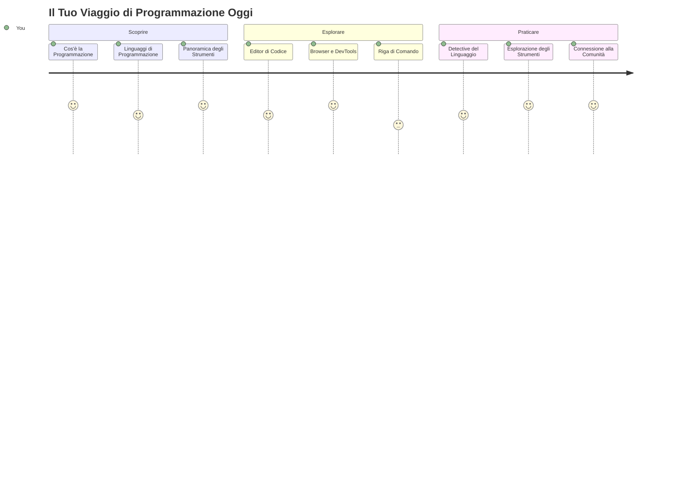
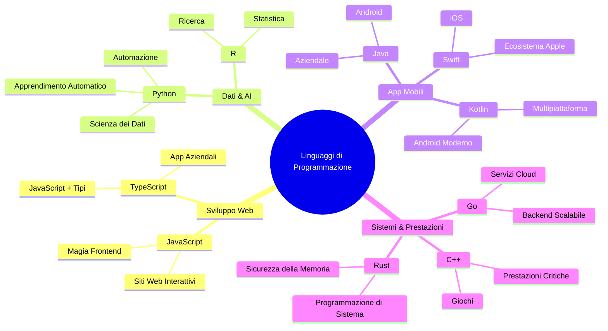
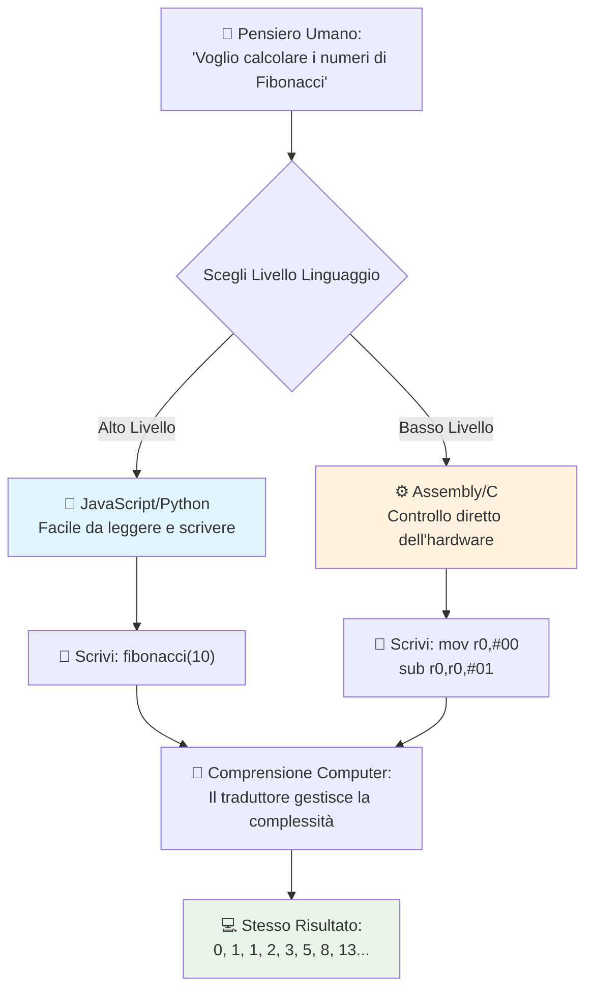
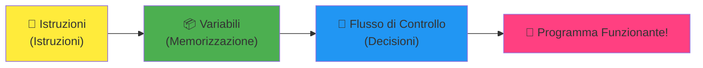
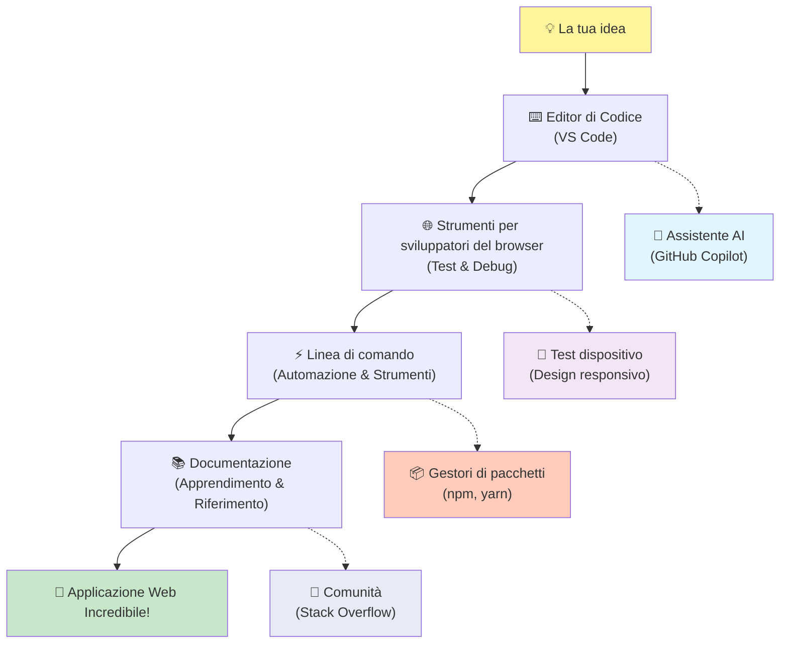
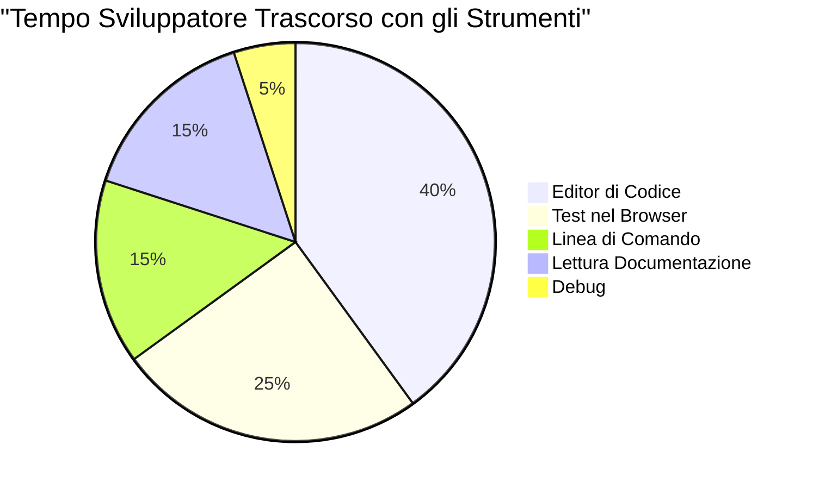
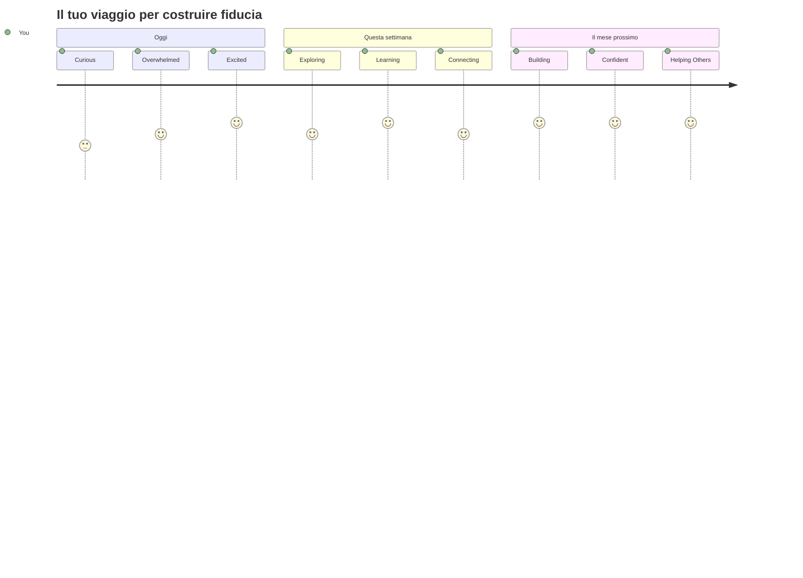

# Introduzione ai Linguaggi di Programmazione e agli Strumenti Moderni per Sviluppatori
 
Ciao, futuro sviluppatore! 👋 Posso dirti qualcosa che ancora mi emoziona ogni singolo giorno? Stai per scoprire che programmare non riguarda solo i computer – riguarda avere veri superpoteri per dare vita alle tue idee più selvagge!

Sai quel momento in cui usi la tua app preferita e tutto funziona perfettamente? Quando tocchi un pulsante e succede qualcosa di assolutamente magico che ti fa dire "wow, ma come hanno fatto?" Beh, qualcuno proprio come te – probabilmente seduto nel suo bar preferito alle 2 di notte con il terzo espresso – ha scritto il codice che ha creato quella magia. Ecco cosa ti stupirà: alla fine di questa lezione, non solo capirai come hanno fatto, ma sarai impaziente di provarci da solo!

Guarda, capisco perfettamente se programmare ti sembra intimidatorio ora. Quando ho iniziato, pensavo davvero che servisse essere un genio della matematica o aver programmato da quando avevi cinque anni. Ma ecco cosa ha cambiato completamente il mio punto di vista: programmare è esattamente come imparare a conversare in una nuova lingua. Si comincia con "ciao" e "grazie", poi si arriva a ordinare un caffè e prima che tu te ne accorga stai avendo discussioni filosofiche profonde! Solo che in questo caso, parli con i computer, e onestamente? Sono gli interlocutori più pazienti che tu possa avere – non giudicano mai i tuoi errori e sono sempre entusiasti di riprovare!

Oggi esploreremo gli incredibili strumenti che rendono lo sviluppo web moderno non solo possibile, ma seriamente coinvolgente. Sto parlando esattamente degli stessi editor, browser e flussi di lavoro che gli sviluppatori di Netflix, Spotify e del tuo studio indie preferito usano ogni giorno. Ecco la parte che ti farà fare un ballo di gioia: la maggior parte di questi strumenti professionali, usati dall’industria, sono completamente gratuiti!


> Sketchnote di [Tomomi Imura](https://twitter.com/girlie_mac)


```mermaid
journey
    title Il Tuo Viaggio di Programmazione Oggi
    section Scoprire
      Cos'è la Programmazione: 5: You
      Linguaggi di Programmazione: 4: You
      Panoramica degli Strumenti: 5: You
    section Esplorare
      Editor di Codice: 4: You
      Browser e DevTools: 5: You
      Riga di Comando: 3: You
    section Praticare
      Detective del Linguaggio: 4: You
      Esplorazione degli Strumenti: 5: You
      Connessione alla Comunità: 5: You
```
## Vediamo Cosa Sai Già!

Prima di tuffarci nelle cose divertenti, sono curioso – cosa sai già di questo mondo della programmazione? E ascolta, se guardando queste domande pensi "onestamente non ho proprio idea di nulla," non solo va bene, è perfetto! Significa che sei nel posto giusto. Considera questo quiz come un riscaldamento prima dell’allenamento – stiamo solo scaldando quei muscoli cerebrali!

[Partecipa al quiz pre-lezione](https://ff-quizzes.netlify.app/web/)


## L’Avventura Che Stiamo Per Intraprendere Insieme

Ok, sono davvero entusiasta di quello che esploreremo oggi! Seriamente, vorrei vedere la tua faccia quando alcuni di questi concetti si chiariranno. Ecco l’incredibile viaggio che faremo insieme:

- **Cos’è realmente la programmazione (e perché è la cosa più figa di sempre!)** – Scopriremo come il codice sia letteralmente la magia invisibile che alimenta tutto ciò che ti circonda, da quell’allarme che in qualche modo sa che è lunedì mattina all’algoritmo che cura perfettamente le tue raccomandazioni Netflix
- **I linguaggi di programmazione e le loro incredibili personalità** – Immagina di entrare a una festa dove ogni persona ha superpoteri completamente diversi e modi diversi di risolvere problemi. È così che funziona il mondo dei linguaggi di programmazione, e adorerai conoscerli!
- **I mattoncini fondamentali che fanno succedere la magia digitale** – Pensali come il set LEGO creativo definitivo. Una volta capito come si incastrano, ti renderai conto che puoi costruire letteralmente qualsiasi cosa la tua immaginazione sogni
- **Gli strumenti professionali che ti faranno sentire come se ti avessero appena consegnato una bacchetta magica** – Non sto esagerando – questi strumenti ti faranno veramente sentire dei supereroi, e la parte migliore? Sono gli stessi che usano i professionisti!

> 💡 **Ecco il punto**: Non pensare nemmeno di dover memorizzare tutto oggi! Per ora voglio solo che tu senta quella scintilla di entusiasmo per ciò che è possibile. I dettagli si fisseranno naturalmente mentre pratichiamo insieme – è così che avviene il vero apprendimento!

> Puoi seguire questa lezione su [Microsoft Learn](https://learn.microsoft.com/en-us/learn/modules/web-development-101/introduction-programming/?WT.mc_id=academic-77807-sagibbon)!

## Quindi Cos’è Esattamente *La* Programmazione?

Va bene, affrontiamo la domanda da un milione di dollari: cos’è davvero la programmazione?

Ti racconterò una storia che ha cambiato completamente il mio modo di pensare a questo. La settimana scorsa stavo cercando di spiegare a mia mamma come usare il nostro nuovo telecomando smart per la TV. Mi sono sorpreso a dire cose tipo "Premi il pulsante rosso, ma non il grande pulsante rosso, il piccolo pulsante rosso a sinistra... no, l’altro sinistro... ok, ora tienilo premuto per due secondi, non uno, non tre..." Ti suona familiare? 😅

Questa è la programmazione! È l’arte di dare istruzioni estremamente dettagliate, passo dopo passo, a qualcosa che è molto potente ma ha bisogno che tutto venga spiegato perfettamente. Solo che invece di spiegare a tua mamma (che può chiedere "quale pulsante rosso?!"), stai spiegando a un computer (che fa esattamente quello che gli dici, anche se quello che hai detto non è proprio quello che volevi dire).

Ecco cosa mi ha stupito quando ho imparato: i computer sono in realtà piuttosto semplici nella loro essenza. Capiscono letteralmente solo due cose – 1 e 0, che è praticamente "sì" e "no" o "acceso" e "spento." Fine! Ma qui succede la magia – non dobbiamo parlare in 1 e 0 come se fossimo in Matrix. È qui che entrano in gioco i **linguaggi di programmazione**. Sono come avere il miglior traduttore al mondo che prende i tuoi pensieri umani e normali e li converte nella lingua dei computer.

Ecco cosa ancora mi fa venire i brividi ogni mattina quando mi sveglio: letteralmente *tutto* quello che è digitale nella tua vita è iniziato con qualcuno proprio come te, probabilmente in pigiama con una tazza di caffè, che digitava codice sul portatile. Quel filtro Instagram che ti fa sembrare impeccabile? Qualcuno l’ha programmato. La raccomandazione che ti ha portato alla tua nuova canzone preferita? Uno sviluppatore ha costruito quell’algoritmo. L’app che ti aiuta a dividere il conto della cena con gli amici? Sì, qualcuno ha pensato "che seccatura, potrei sistemarla" e poi... l’ha fatto!

Quando impari a programmare, non stai solo acquisendo una nuova competenza – stai diventando parte di questa incredibile comunità di risolutori di problemi che passano le giornate a pensare: "E se potessi costruire qualcosa che renda la giornata di qualcuno un po’ migliore?" Davvero, c’è qualcosa di più fantastico?

✅ **Curiosità Divertente**: Ecco qualcosa di super interessante da cercare quando hai un momento libero – chi pensi sia stato il primo programmatore al mondo? Ti do un indizio: potrebbe non essere chi ti aspetti! La storia di questa persona è assolutamente affascinante e dimostra che la programmazione è sempre stata creatività e pensare fuori dagli schemi.

### 🧠 **Momento di Verifica: Come Ti Senti?**

**Prenditi un attimo per riflettere:**
- Ora ha senso l’idea di "dare istruzioni ai computer"?
- Riesci a pensare a un’attività quotidiana che vorresti automatizzare con la programmazione?
- Quali domande ti stanno venendo in mente su questa cosa della programmazione?

> **Ricorda**: È assolutamente normale se alcuni concetti ti sembrano confusi ora. Imparare a programmare è come imparare una nuova lingua – ci vuole tempo per costruire quei percorsi neurali nel cervello. Stai andando alla grande!

## I Linguaggi di Programmazione Sono Come Diversi Sapori di Magia

Ok, sembrerà strano, ma seguimi – i linguaggi di programmazione sono molto simili a diversi tipi di musica. Pensa un po’: c’è il jazz, che è morbido e improvvisato, il rock che è potente e diretto, la classica che è elegante e strutturata, e l’hip-hop che è creativo ed espressivo. Ogni stile ha la sua atmosfera, la sua comunità di fan appassionati, e ognuno è perfetto per diversi stati d’animo e occasioni.

I linguaggi di programmazione funzionano allo stesso modo! Non useresti lo stesso linguaggio per costruire un gioco mobile divertente che useresti per elaborare enormi quantità di dati sul clima, proprio come non metteresti death metal a una lezione di yoga (beh, almeno nella maggior parte delle lezioni di yoga! 😄).

Ma ecco cosa ogni volta mi lascia a bocca aperta quando ci penso: questi linguaggi sono come avere l’interprete più paziente e brillante del mondo seduto accanto a te. Puoi esprimere le tue idee in un modo naturale al tuo cervello umano, e loro fanno tutto il lavoro incredibilmente complesso di tradurre tutto questo nei 1 e 0 che i computer effettivamente capiscono. È come avere un amico che parla perfettamente sia "creatività umana" che "logica del computer" – e non si stanca mai, non ha bisogno di pause caffè, e non ti giudica mai se fai la stessa domanda due volte!

### Linguaggi Popolari e I Loro Utilizzi


```mermaid
mindmap
  root((Linguaggi di Programmazione))
    Sviluppo Web
      JavaScript
        Magia Frontend
        Siti Web Interattivi
      TypeScript
        JavaScript + Tipi
        App Aziendali
    Dati & AI
      Python
        Scienza dei Dati
        Apprendimento Automatico
        Automazione
      R
        Statistica
        Ricerca
    App Mobili
      Java
        Android
        Aziendale
      Swift
        iOS
        Ecosistema Apple
      Kotlin
        Android Moderno
        Multipiattaforma
    Sistemi & Prestazioni
      C++
        Giochi
        Prestazioni Critiche
      Rust
        Sicurezza della Memoria
        Programmazione di Sistema
      Go
        Servizi Cloud
        Backend Scalabile
```
| Language | Migliore per | Perché è Popolare |
|----------|--------------|-------------------|
| **JavaScript** | Sviluppo web, interfacce utente | Funziona nei browser e alimenta siti web interattivi |
| **Python** | Data science, automazione, AI | Facile da leggere e imparare, librerie potenti |
| **Java** | Applicazioni enterprise, app Android | Indipendente dalla piattaforma, robusto per sistemi grandi |
| **C#** | Applicazioni Windows, sviluppo giochi | Forte supporto dall’ecosistema Microsoft |
| **Go** | Servizi cloud, sistemi backend | Veloce, semplice, progettato per il computing moderno |

### Linguaggi di Alto Livello vs. Basso Livello

Ok, onestamente questo è stato il concetto che mi ha fatto impazzire quando ho iniziato, quindi condivido l’analogia che finalmente mi ha fatto capire – e spero che ti aiuti anche te!

Immagina di visitare un paese dove non parli la lingua e hai disperatamente bisogno di trovare il bagno più vicino (ci siamo passati tutti, vero? 😅):

- **Programmazione a basso livello** è come imparare così bene il dialetto locale da poter parlare con la nonna che vende la frutta all’angolo usando riferimenti culturali, slang locale e battute interne che solo chi è cresciuto lì può capire. Super impressionante e incredibilmente efficiente... se sei fluente! Ma abbastanza schiacciante quando stai solo cercando un bagno.

- **Programmazione ad alto livello** è come avere quell’amico locale fantastico che ti capisce al volo. Puoi dire "Ho davvero bisogno di trovare un bagno" in inglese semplice, e lui si occupa di tutta la traduzione culturale e ti dà le indicazioni in modo comprensibile per il tuo cervello da straniero.

In termini di programmazione:
- I **linguaggi di basso livello** (come Assembly o C) ti permettono di avere conversazioni estremamente dettagliate con l’hardware reale del computer, ma devi pensare come una macchina, il che è... beh, diciamo che è un bel salto mentale!
- I **linguaggi di alto livello** (come JavaScript, Python o C#) ti permettono di pensare come un umano mentre loro gestiscono tutto il linguaggio macchina dietro le quinte. Inoltre, hanno comunità incredibilmente accoglienti piene di persone che ricordano cosa vuol dire essere principianti e vogliono davvero aiutarti!

Indovina quali ti suggerirò di iniziare a usare? 😉 I linguaggi di alto livello sono come le rotelle di allenamento che non vorresti mai togliere perché rendono l’esperienza molto più piacevole!


```mermaid
flowchart TB
    A["👤 Pensiero Umano:<br/>'Voglio calcolare i numeri di Fibonacci'"] --> B{Scegli Livello Linguaggio}
    
    B -->|Alto Livello| C["🌟 JavaScript/Python<br/>Facile da leggere e scrivere"]
    B -->|Basso Livello| D["⚙️ Assembly/C<br/>Controllo diretto dell'hardware"]
    
    C --> E["📝 Scrivi: fibonacci(10)"]
    D --> F["📝 Scrivi: mov r0,#00<br/>sub r0,r0,#01"]
    
    E --> G["🤖 Comprensione Computer:<br/>Il traduttore gestisce la complessità"]
    F --> G
    
    G --> H["💻 Stesso Risultato:<br/>0, 1, 1, 2, 3, 5, 8, 13..."]
    
    style C fill:#e1f5fe
    style D fill:#fff3e0
    style H fill:#e8f5e8
```
### Ti Mostro Perché i Linguaggi di Alto Livello Sono Così Più Amichevoli

Ok, sto per mostrarti qualcosa che dimostra perfettamente perché mi sono innamorato dei linguaggi di alto livello, ma prima – devi promettermi una cosa. Quando vedrai il primo esempio di codice, non farti prendere dal panico! È fatto per sembrare intimidatorio. Questo è esattamente il punto che voglio farti capire!

Vedremo la stessa identica attività scritta in due stili completamente diversi. Entrambi creano quella che si chiama la sequenza di Fibonacci – un bellissimo schema matematico dove ogni numero è la somma dei due precedenti: 0, 1, 1, 2, 3, 5, 8, 13... (Curiosità: troverai questo schema ovunque in natura – spirali di semi di girasole, disegni di pigne, perfino nel modo in cui si formano le galassie!)

Pronto a vedere la differenza? Andiamo!

**Linguaggio di alto livello (JavaScript) – Facile per gli umani:**

```javascript
// Passo 1: Configurazione di base di Fibonacci
const fibonacciCount = 10;
let current = 0;
let next = 1;

console.log('Fibonacci sequence:');
```

**Ecco cosa fa questo codice:**
- **Dichiara** una costante per specificare quanti numeri di Fibonacci vogliamo generare
- **Inizializza** due variabili per tenere traccia dei numeri correnti e successivi nella sequenza
- **Imposta** i valori iniziali (0 e 1) che definiscono il modello di Fibonacci
- **Mostra** un messaggio header per identificare il nostro output

```javascript
// Passo 2: Genera la sequenza con un ciclo
for (let i = 0; i < fibonacciCount; i++) {
  console.log(`Position ${i + 1}: ${current}`);
  
  // Calcola il numero successivo nella sequenza
  const sum = current + next;
  current = next;
  next = sum;
}
```

**Spieghiamo cosa succede qui:**
- **Cicla** attraverso ogni posizione nella nostra sequenza usando un ciclo `for`
- **Visualizza** ogni numero con la sua posizione utilizzando la formattazione con template literal
- **Calcola** il prossimo numero di Fibonacci sommando i valori corrente e successivo
- **Aggiorna** le nostre variabili di controllo per procedere all’iterazione successiva

```javascript
// Passo 3: Approccio funzionale moderno
const generateFibonacci = (count) => {
  const sequence = [0, 1];
  
  for (let i = 2; i < count; i++) {
    sequence[i] = sequence[i - 1] + sequence[i - 2];
  }
  
  return sequence;
};

// Esempio di utilizzo
const fibSequence = generateFibonacci(10);
console.log(fibSequence);
```

**Nel codice sopra abbiamo:**
- **Creato** una funzione riutilizzabile con la moderna sintassi delle arrow function
- **Costruito** un array per memorizzare la sequenza completa invece di mostrare i numeri uno a uno
- **Usato** gli indici dell’array per calcolare ogni numero nuovo in base ai valori precedenti
- **Restituito** la sequenza completa per usarla in modo flessibile in altre parti del programma

**Linguaggio di basso livello (ARM Assembly) – A misura di computer:**

```assembly
 area ascen,code,readonly
 entry
 code32
 adr r0,thumb+1
 bx r0
 code16
thumb
 mov r0,#00
 sub r0,r0,#01
 mov r1,#01
 mov r4,#10
 ldr r2,=0x40000000
back add r0,r1
 str r0,[r2]
 add r2,#04
 mov r3,r0
 mov r0,r1
 mov r1,r3
 sub r4,#01
 cmp r4,#00
 bne back
 end
```

Nota come la versione JavaScript sembri quasi istruzioni in inglese, mentre quella in Assembly usa comandi criptici che controllano direttamente il processore del computer. Entrambe svolgono l’identico compito, ma il linguaggio di alto livello è molto più facile da capire, scrivere e mantenere per gli umani.

**Le principali differenze che noterai:**
- **Leggibilità**: JavaScript usa nomi descrittivi come `fibonacciCount` mentre Assembly usa etichette criptiche come `r0`, `r1`
- **Commenti**: I linguaggi di alto livello incoraggiano commenti esplicativi che rendono il codice auto-documentante
- **Struttura**: Il flusso logico di JavaScript corrisponde a come gli esseri umani pensano ai problemi passo dopo passo
- **Manutenzione**: Aggiornare la versione JavaScript per requisiti diversi è semplice e chiaro

✅ **Sulla sequenza di Fibonacci**: Questo numero assolutamente affascinante (dove ogni numero è la somma dei due precedenti: 0, 1, 1, 2, 3, 5, 8...) compare letteralmente *ovunque* in natura! Lo troverai nelle spirali dei girasoli, nei pattern delle pigne, nel modo in cui si curvano le conchiglie di nautilus, e persino nella crescita dei rami degli alberi. È davvero sorprendente come la matematica e il codice possano aiutarci a comprendere e ricreare i pattern che la natura usa per creare bellezza!

## I Mattoni Fondamentali che Fanno Accadere la Magia

Bene, ora che hai visto come appaiono i linguaggi di programmazione in azione, suddividiamo i pezzi fondamentali che compongono letteralmente ogni programma mai scritto. Pensali come gli ingredienti essenziali della tua ricetta preferita – una volta capito cosa fa ciascuno, sarai in grado di leggere e scrivere codice in praticamente qualsiasi linguaggio!

È un po’ come imparare la grammatica della programmazione. Ricordi a scuola quando imparavi i nomi, i verbi e come mettere insieme le frasi? La programmazione ha una sua versione di grammatica ed è onestamente molto più logica e indulgente della grammatica inglese! 😄

### Istruzioni: Le Indicazioni Passo-Passo

Iniziamo con le **istruzioni** – sono come frasi individuali in una conversazione con il tuo computer. Ogni istruzione dice al computer di fare una cosa specifica, un po’ come dare indicazioni: "Gira a sinistra qui," "Fermati al semaforo rosso," "Parcheggia in quel posto."

Quello che amo delle istruzioni è quanto siano generalmente leggibili. Guarda questo:

```javascript
// Istruzioni di base che eseguono singole azioni
const userName = "Alex";                    
console.log("Hello, world!");              
const sum = 5 + 3;                         
```

**Ecco cosa fa questo codice:**
- **Dichiarare** una variabile costante per memorizzare il nome di un utente
- **Mostrare** un messaggio di saluto nell’output della console
- **Calcolare** e memorizzare il risultato di un’operazione matematica

```javascript
// Istruzioni che interagiscono con le pagine web
document.title = "My Awesome Website";      
document.body.style.backgroundColor = "lightblue";
```

**Passo passo, ecco cosa succede:**
- **Modificare** il titolo della pagina web che appare nella scheda del browser
- **Cambiare** il colore di sfondo dell’intero corpo della pagina

### Variabili: Il Sistema di Memoria del Tuo Programma

Okay, le **variabili** sono onestamente uno dei miei concetti preferiti da insegnare perché sono molto simili alle cose che usi ogni giorno!

Pensa alla lista contatti del tuo telefono per un momento. Non memorizzi il numero di telefono di tutti – invece salvi "Mamma," "Migliore Amico," o "Pizzeria che consegna fino alle 2 di notte" e lasci che il tuo telefono ricordi i numeri effettivi. Le variabili funzionano esattamente allo stesso modo! Sono come contenitori etichettati dove il tuo programma può conservare informazioni e recuperarle più tardi usando un nome che ha senso.

Ecco cosa è davvero fantastico: le variabili possono cambiare mentre il tuo programma gira (da qui il nome "variabile" – capito il gioco di parole?). Proprio come potresti aggiornare il contatto della pizzeria quando ne trovi una ancora migliore, le variabili possono essere aggiornate mentre il tuo programma impara nuove informazioni o le situazioni cambiano!

Lasciami mostrarti quanto può essere semplicemente bello:

```javascript
// Passo 1: Creazione delle variabili di base
const siteName = "Weather Dashboard";        
let currentWeather = "sunny";               
let temperature = 75;                       
let isRaining = false;                      
```

**Capire questi concetti:**
- **Conservare** valori immutabili in variabili `const` (come il nome del sito)
- **Usare** `let` per valori che possono cambiare durante il programma
- **Assegnare** diversi tipi di dati: stringhe (testo), numeri e booleani (vero/falso)
- **Scegliere** nomi descrittivi che spiegano cosa contiene ogni variabile

```javascript
// Passo 2: Lavorare con gli oggetti per raggruppare dati correlati
const weatherData = {                       
  location: "San Francisco",
  humidity: 65,
  windSpeed: 12
};
```

**Nel codice sopra, abbiamo:**
- **Creato** un oggetto per raggruppare informazioni meteo correlate
- **Organizzato** più dati sotto un unico nome di variabile
- **Usato** coppie chiave-valore per etichettare chiaramente ogni informazione

```javascript
// Passo 3: Utilizzo e aggiornamento delle variabili
console.log(`${siteName}: Today is ${currentWeather} and ${temperature}°F`);
console.log(`Wind speed: ${weatherData.windSpeed} mph`);

// Aggiornamento delle variabili modificabili
currentWeather = "cloudy";                  
temperature = 68;                          
```

**Capire ogni parte:**
- **Mostrare** le informazioni usando template literal con la sintassi `${}`
- **Accedere** alle proprietà dell’oggetto usando la notazione a punto (`weatherData.windSpeed`)
- **Aggiornare** variabili dichiarate con `let` per riflettere condizioni che cambiano
- **Combinare** più variabili per creare messaggi significativi

```javascript
// Passo 4: Destrutturazione moderna per un codice più pulito
const { location, humidity } = weatherData; 
console.log(`${location} humidity: ${humidity}%`);
```

**Cosa devi sapere:**
- **Estrarre** proprietà specifiche dagli oggetti usando assegnamento destrutturante
- **Creare** nuove variabili automaticamente con gli stessi nomi delle chiavi dell’oggetto
- **Semplificare** il codice evitando ripetizioni della notazione a punto

### Flusso di Controllo: Insegnare al Tuo Programma a Pensare

Okay, qui la programmazione diventa assolutamente stupefacente! Il **flusso di controllo** è fondamentalmente insegnare al tuo programma come prendere decisioni intelligenti, proprio come fai tu ogni giorno senza nemmeno pensarci.

Immagina: stamattina probabilmente hai fatto qualcosa tipo "Se piove, prendo l’ombrello. Se fa freddo, indosso la giacca. Se sono in ritardo, salto la colazione e prendo un caffè per strada." Il tuo cervello segue naturalmente questa logica if-then decine di volte al giorno!

Questo è ciò che rende i programmi intelligenti e vivaci invece di fare solo uno script noioso e prevedibile. Possono guardare una situazione, valutarla e rispondere in modo appropriato. È come dare un cervello al tuo programma che può adattarsi e fare scelte!

Vuoi vedere quanto è bello? Eccoti:

```javascript
// Passo 1: Logica condizionale di base
const userAge = 17;

if (userAge >= 18) {
  console.log("You can vote!");
} else {
  const yearsToWait = 18 - userAge;
  console.log(`You'll be able to vote in ${yearsToWait} year(s).`);
}
```

**Ecco cosa fa questo codice:**
- **Controlla** se l’età dell’utente soddisfa il requisito per votare
- **Esegue** blocchi di codice diversi in base al risultato della condizione
- **Calcola** e mostra da quanto manca alla possibilità di votare se sotto i 18 anni
- **Fornisce** feedback specifici e utili per ogni scenario

```javascript
// Passo 2: Condizioni multiple con operatori logici
const userAge = 17;
const hasPermission = true;

if (userAge >= 18 && hasPermission) {
  console.log("Access granted: You can enter the venue.");
} else if (userAge >= 16) {
  console.log("You need parent permission to enter.");
} else {
  console.log("Sorry, you must be at least 16 years old.");
}
```

**Decostruendo cosa succede qui:**
- **Combina** più condizioni usando l’operatore `&&` (e)
- **Crea** una gerarchia di condizioni con `else if` per più scenari
- **Gestisce** tutti i casi possibili con un’istruzione finale `else`
- **Fornisce** feedback chiari e pratici per ogni diversa situazione

```javascript
// Passaggio 3: Condizionale conciso con operatore ternario
const votingStatus = userAge >= 18 ? "Can vote" : "Cannot vote yet";
console.log(`Status: ${votingStatus}`);
```

**Cosa devi ricordare:**
- **Usa** l’operatore ternario (`? :`) per condizioni semplici a due opzioni
- **Scrivi** prima la condizione, seguita da `?`, poi il risultato true, poi `:`, poi il risultato false
- **Applica** questo schema quando devi assegnare valori basati su condizioni

```javascript
// Passo 4: Gestire più casi specifici
const dayOfWeek = "Tuesday";

switch (dayOfWeek) {
  case "Monday":
  case "Tuesday":
  case "Wednesday":
  case "Thursday":
  case "Friday":
    console.log("It's a weekday - time to work!");
    break;
  case "Saturday":
  case "Sunday":
    console.log("It's the weekend - time to relax!");
    break;
  default:
    console.log("Invalid day of the week");
}
```

**Questo codice realizza quanto segue:**
- **Confronta** il valore di una variabile con diversi casi specifici
- **Raggruppa** casi simili insieme (giorni feriali vs. fine settimana)
- **Esegue** il blocco di codice appropriato quando c’è una corrispondenza
- **Include** un caso `default` per gestire valori inattesi
- **Usa** istruzioni `break` per evitare che il codice prosegua oltre il caso corrente

> 💡 **Analogia reale**: Pensa al flusso di controllo come al GPS più paziente del mondo che ti dà indicazioni. Potrebbe dire: "Se c’è traffico in Via Principale, prendi l’autostrada. Se un cantiere blocca l’autostrada, prova il percorso panoramico." I programmi usano lo stesso tipo di logica condizionale per rispondere in modo intelligente a diverse situazioni e dare sempre agli utenti la migliore esperienza possibile.

### 🎯 **Verifica di Comprensione: Padroneggiare i Mattoni Fondamentali**

**Vediamo come va con i fondamentali:**
- Riesci a spiegare la differenza tra una variabile e un’istruzione con parole tue?
- Pensa a uno scenario reale in cui useresti una decisione if-then (come il nostro esempio del voto)
- Qual è una cosa della logica di programmazione che ti ha sorpreso?

**Un rapido booster di fiducia:**

```mermaid
flowchart LR
    A["📝 Istruzioni<br/>(Istruzioni)"] --> B["📦 Variabili<br/>(Memorizzazione)"] --> C["🔀 Flusso di Controllo<br/>(Decisioni)"] --> D["🎉 Programma Funzionante!"]
    
    style A fill:#ffeb3b
    style B fill:#4caf50
    style C fill:#2196f3
    style D fill:#ff4081
```
✅ **Cosa verrà dopo**: Ci divertiremo un mondo approfondendo questi concetti mentre continuiamo questo incredibile viaggio insieme! Per ora, concentrati solo sull’entusiasmo per tutte le fantastiche possibilità che ti aspettano. Le abilità specifiche e le tecniche si fisseranno naturalmente mentre pratichiamo insieme – ti prometto che sarà molto più divertente di quanto ti aspetti!

## Gli Strumenti del Mestiere

Okay, qui mi si accende il cuore dall’emozione! 🚀 Stiamo per parlare di strumenti incredibili che ti faranno sentire come se ti avessero appena consegnato le chiavi di un’astronave digitale.

Sai come uno chef ha quei coltelli perfettamente bilanciati che sembrano un’estensione delle mani? O come un musicista ha quella chitarra che sembra cantare appena la tocca? Bene, gli sviluppatori hanno la nostra versione di questi strumenti magici, e qui viene il bello – la maggior parte sono completamente gratuiti!

Sto quasi saltellando sulla sedia pensando di condividerli con te perché hanno completamente rivoluzionato il modo in cui costruiamo il software. Parliamo di assistenti di codifica alimentati da AI che possono aiutarti a scrivere codice (non sto scherzando!), ambienti cloud dove puoi costruire intere app da qualunque posto con Wi-Fi, e strumenti di debugging così sofisticati da essere come avere la vista a raggi X per i tuoi programmi.

E questa è la parte che mi fa ancora venire i brividi: questi non sono strumenti da "principiante" da cui ti stancherai presto. Sono gli stessi strumenti professionali che usano sviluppatori in Google, Netflix, e quello studio indie che ami, in questo preciso momento. Ti sentirai un vero professionista usandoli!


```mermaid
graph TD
    A["💡 La tua idea"] --> B["⌨️ Editor di Codice<br/>(VS Code)"] 
    B --> C["🌐 Strumenti per sviluppatori del browser<br/>(Test & Debug)"]
    C --> D["⚡ Linea di comando<br/>(Automazione & Strumenti)"]
    D --> E["📚 Documentazione<br/>(Apprendimento & Riferimento)"]
    E --> F["🚀 Applicazione Web Incredibile!"]
    
    B -.-> G["🤖 Assistente AI<br/>(GitHub Copilot)"]
    C -.-> H["📱 Test dispositivo<br/>(Design responsivo)"]
    D -.-> I["📦 Gestori di pacchetti<br/>(npm, yarn)"]
    E -.-> J["👥 Comunità<br/>(Stack Overflow)"]
    
    style A fill:#fff59d
    style F fill:#c8e6c9
    style G fill:#e1f5fe
    style H fill:#f3e5f5
    style I fill:#ffccbc
    style J fill:#e8eaf6
```
### Editor di Codice e IDE: I Tuoi Nuovi Migliori Amici Digitali

Parliamo degli editor di codice – stanno per diventare i tuoi posti preferiti dove passare il tempo! Pensali come il tuo santuario personale di coding dove passerai la maggior parte del tempo a creare e perfezionare le tue creazioni digitali.

Ma ecco cosa è assolutamente magico negli editor moderni: non sono solo sofisticati editor di testo. Sono come avere il mentore di coding più brillante e supportivo seduto accanto a te 24 ore su 24, 7 giorni su 7. Ti correggono i refusi prima che li noti, suggeriscono miglioramenti che ti fanno sembrare un genio, ti aiutano a capire cosa fa ogni pezzo di codice, e alcuni di loro possono persino prevedere cosa stai per scrivere e offrirsi di completare i tuoi pensieri!

Ricordo quando ho scoperto l’auto-completamento per la prima volta – mi sembrava di vivere nel futuro. Inizi a scrivere qualcosa e l’editor ti dice: "Ehi, stavi pensando a questa funzione che fa esattamente quello che ti serve?" È come avere un lettore di mente come compagno di coding!

**Cosa rende questi editor così incredibili?**

Gli editor di codice moderni offrono un’impressionante gamma di funzionalità progettate per aumentare la tua produttività:

| Funzionalità | Cosa Fa | Perché Aiuta |
|--------------|---------|--------------|
| **Evidenziazione della sintassi** | Colora diverse parti del codice | Rende il codice più facile da leggere e individuare errori |
| **Auto-completamento** | Suggerisce codice mentre scrivi | Velocizza la scrittura del codice e riduce i refusi |
| **Strumenti di debugging** | Aiuta a trovare e correggere errori | Fa risparmiare ore di risoluzione problemi |
| **Estensioni** | Aggiunge funzionalità specializzate | Personalizza il tuo editor per qualsiasi tecnologia |
| **Assistenti AI** | Suggerisce codice e spiegazioni | Accelera apprendimento e produttività |

> 🎥 **Risorsa video**: Vuoi vedere questi strumenti in azione? Dai un’occhiata a questo [video Tools of the Trade](https://youtube.com/watch?v=69WJeXGBdxg) per una panoramica completa.

#### Editor Consigliati per lo Sviluppo Web

**[Visual Studio Code](https://code.visualstudio.com/?WT.mc_id=academic-77807-sagibbon)** (Gratuito)
- Il più popolare tra gli sviluppatori web
- Ottimo ecosistema di estensioni
- Terminale integrato e integrazione Git
- **Estensioni indispensabili**:
  - [GitHub Copilot](https://marketplace.visualstudio.com/items?itemName=GitHub.copilot) - Suggerimenti di codice alimentati da AI
  - [Live Share](https://marketplace.visualstudio.com/items?itemName=MS-vsliveshare.vsliveshare) - Collaborazione in tempo reale
  - [Prettier](https://marketplace.visualstudio.com/items?itemName=esbenp.prettier-vscode) - Formattazione automatica del codice
  - [Code Spell Checker](https://marketplace.visualstudio.com/items?itemName=streetsidesoftware.code-spell-checker) - Individua errori di battitura nel codice

**[JetBrains WebStorm](https://www.jetbrains.com/webstorm/)** (A pagamento, gratuito per studenti)
- Strumenti avanzati di debug e test
- Completamento intelligente del codice
- Controllo versione integrato

**IDE Basati su Cloud** (Varie tariffe)
- [GitHub Codespaces](https://github.com/features/codespaces) - VS Code completo direttamente nel browser
- [Replit](https://replit.com/) - Ottimo per imparare e condividere codice
- [StackBlitz](https://stackblitz.com/) - Sviluppo web full-stack istantaneo

> 💡 **Consiglio per iniziare**: Parti con Visual Studio Code – è gratuito, molto usato nel settore e ha una comunità enorme che crea tutorial ed estensioni utili.


### Browser Web: Il Tuo Laboratorio Segreto di Sviluppo

Okay, preparati a rimanere completamente sbalordito! Sai come usi i browser per scorrere i social media e guardare video? Bene, si scopre che hanno nascosto questo incredibile laboratorio di sviluppo tutto il tempo, solo in attesa che tu lo scopra!

Ogni volta che fai clic con il tasto destro su una pagina web e selezioni "Ispeziona elemento", stai aprendo un mondo nascosto di strumenti per sviluppatori che sono onestamente più potenti di qualche software costoso per il quale pagavo centinaia di euro. È come scoprire che la tua vecchia cucina ha nascosto dietro un pannello segreto un laboratorio professionale da chef!
La prima volta che qualcuno mi ha mostrato gli strumenti di sviluppo del browser, ho passato tipo tre ore solo a cliccare in giro e a dire "ASPETTA, LO PUÒ FARE ANCHE QUELLO?!" Puoi letteralmente modificare qualsiasi sito web in tempo reale, vedere esattamente quanto velocemente si carica tutto, testare come appare il tuo sito su dispositivi diversi e perfino fare il debug di JavaScript come un vero professionista. È assolutamente incredibile!

**Ecco perché i browser sono la tua arma segreta:**

Quando crei un sito web o un'applicazione web, devi vedere come appare e si comporta nel mondo reale. I browser non solo mostrano il tuo lavoro, ma forniscono anche feedback dettagliati sulle prestazioni, l'accessibilità e i potenziali problemi.

#### Strumenti per sviluppatori del browser (DevTools)

I browser moderni includono suite di sviluppo complete:

| Categoria dello Strumento | Cosa fa | Esempio di utilizzo |
|---------------|--------------|------------------|
| **Ispezione elemento** | Visualizza e modifica HTML/CSS in tempo reale | Modifica lo stile per vedere risultati immediati |
| **Console** | Visualizza messaggi di errore e testa JavaScript | Debug dei problemi e sperimentazione con il codice |
| **Monitoraggio rete** | Monitora il caricamento delle risorse | Ottimizza prestazioni e tempi di caricamento |
| **Controllo accessibilità** | Test per design inclusivo | Assicura che il sito funzioni per tutti gli utenti |
| **Simulatore dispositivi** | Anteprima su diverse dimensioni di schermo | Testa il design responsivo senza dispositivi multipli |

#### Browser consigliati per lo sviluppo

- **[Chrome](https://developers.google.com/web/tools/chrome-devtools/)** - Strumenti di sviluppo standard del settore con ampia documentazione
- **[Firefox](https://developer.mozilla.org/docs/Tools)** - Eccellenti strumenti per CSS Grid e accessibilità
- **[Edge](https://docs.microsoft.com/microsoft-edge/devtools-guide-chromium/?WT.mc_id=academic-77807-sagibbon)** - Basato su Chromium con risorse per sviluppatori Microsoft

> ⚠️ **Suggerimento importante per i test**: Testa sempre i tuoi siti web su più browser! Ciò che funziona perfettamente su Chrome potrebbe apparire diverso su Safari o Firefox. Gli sviluppatori professionisti testano su tutti i browser principali per garantire un'esperienza utente coerente.


### Strumenti da linea di comando: la tua porta verso superpoteri da sviluppatore

Ok, facciamo un momento di totale onestà sulla linea di comando, perché voglio che tu lo senta da qualcuno che ci è passato davvero. Quando l'ho vista per la prima volta – solo quella spaventosa schermata nera con testo lampeggiante – ho letteralmente pensato: "No, assolutamente no! Sembra qualcosa di un film di hacker degli anni '80, e non sono sicuramente abbastanza intelligente per questo!" 😅

Ma ecco cosa avrei voluto che qualcuno mi dicesse allora, e cosa ti dico ora: la linea di comando non è spaventosa – è in realtà come avere una conversazione diretta con il tuo computer. Pensala come la differenza tra ordinare cibo tramite un'app elegante con immagini e menù (che è comodo e semplice) rispetto a entrare nel tuo ristorante locale preferito dove lo chef sa esattamente cosa ti piace e può prepararti qualcosa di perfetto solo con un "sorpresa, fammi qualcosa di fantastico".

La linea di comando è il posto dove gli sviluppatori si sentono come veri maghi. Digiti alcune parole apparentemente magiche (ok, sono solo comandi, ma sembrano magici!), premi invio e BOOM – hai creato intere strutture di progetto, installato strumenti potenti da tutto il mondo, o distribuito la tua app su internet per milioni di persone. Una volta che assaggi quel potere, è davvero piuttosto coinvolgente!

**Perché la linea di comando diventerà il tuo strumento preferito:**

Mentre le interfacce grafiche sono ottime per molti compiti, la linea di comando eccelle in automazione, precisione e velocità. Molti strumenti di sviluppo funzionano principalmente tramite interfacce da linea di comando, e imparare a usarli in modo efficiente può migliorare drasticamente la tua produttività.

```bash
# Passo 1: Crea e naviga nella directory del progetto
mkdir my-awesome-website
cd my-awesome-website
```

**Ecco cosa fa questo codice:**
- **Crea** una nuova directory chiamata "my-awesome-website" per il tuo progetto
- **Entra** nella directory appena creata per iniziare a lavorare

```bash
# Passo 2: Inizializza il progetto con package.json
npm init -y

# Installa gli strumenti di sviluppo moderni
npm install --save-dev vite prettier eslint
npm install --save-dev @eslint/js
```

**Passo dopo passo, ecco cosa sta succedendo:**
- **Inizializza** un nuovo progetto Node.js con impostazioni predefinite usando `npm init -y`
- **Installa** Vite come moderno strumento di build per sviluppo veloce e build di produzione
- **Aggiungi** Prettier per la formattazione automatica del codice e ESLint per controlli di qualità
- **Usa** il flag `--save-dev` per segnare queste dipendenze come solo di sviluppo

```bash
# Passo 3: Crea la struttura del progetto e i file
mkdir src assets
echo '<!DOCTYPE html><html><head><title>My Site</title></head><body><h1>Hello World</h1></body></html>' > index.html

# Avvia il server di sviluppo
npx vite
```

**Nel precedente, abbiamo:**
- **Organizzato** il progetto creando cartelle separate per il codice sorgente e le risorse
- **Generato** un file HTML di base con struttura corretta del documento
- **Avviato** il server di sviluppo di Vite per ricaricamento live e hot module replacement

#### Strumenti essenziali da linea di comando per lo sviluppo web

| Strumento | Scopo | Perché ti serve |
|------|---------|-----------------|
| **[Git](https://git-scm.com/)** | Controllo di versione | Traccia le modifiche, collabora con altri, fai backup del tuo lavoro |
| **[Node.js & npm](https://nodejs.org/)** | Runtime JavaScript & gestione pacchetti | Esegui JavaScript fuori dai browser, installa strumenti di sviluppo moderni |
| **[Vite](https://vitejs.dev/)** | Strumento di build & server di sviluppo | Sviluppo rapidissimo con hot module replacement |
| **[ESLint](https://eslint.org/)** | Qualità del codice | Trova e correggi automaticamente problemi nel tuo JavaScript |
| **[Prettier](https://prettier.io/)** | Formattazione del codice | Mantieni il tuo codice costantemente formattato e leggibile |

#### Opzioni specifiche per piattaforma

**Windows:**
- **[Windows Terminal](https://docs.microsoft.com/windows/terminal/?WT.mc_id=academic-77807-sagibbon)** - Terminale moderno e ricco di funzionalità
- **[PowerShell](https://docs.microsoft.com/powershell/?WT.mc_id=academic-77807-sagibbon)** 💻 - Ambiente di scripting potente
- **[Command Prompt](https://learn.microsoft.com/windows-server/administration/windows-commands/windows-commands)** 💻 - Linea di comando tradizionale di Windows

**macOS:**
- **[Terminal](https://support.apple.com/guide/terminal/)** 💻 - Applicazione terminale integrata
- **[iTerm2](https://iterm2.com/)** - Terminale avanzato con funzionalità estese

**Linux:**
- **[Bash](https://www.gnu.org/software/bash/)** 💻 - Shell standard di Linux
- **[KDE Konsole](https://docs.kde.org/trunk5/en/konsole/konsole/index.html)** - Emulatore terminale avanzato

> 💻 = Preinstallato nel sistema operativo

> 🎯 **Percorso di apprendimento**: Inizia con comandi base come `cd` (cambia directory), `ls` o `dir` (elenca file) e `mkdir` (crea cartella). Esegui esercizi con comandi di workflow moderni come `npm install`, `git status` e `code .` (apre la directory corrente in VS Code). Quando ti sentirai più a tuo agio, acquisirai naturalmente comandi più avanzati e tecniche di automazione.


### Documentazione: il tuo mentore di apprendimento sempre disponibile

Ok, lascia che ti sveli un piccolo segreto che ti farà sentire molto meglio per essere un principiante: anche gli sviluppatori più esperti passano una gran parte del loro tempo a leggere la documentazione. E non è perché non sappiano cosa stanno facendo – è in realtà un segno di saggezza!

Considera la documentazione come l’accesso ai migliori insegnanti del mondo, pazienti e competenti, disponibili 24/7. Bloccato su un problema alle 2 di notte? La documentazione è lì con un caldo abbraccio virtuale e la risposta esatta che ti serve. Vuoi imparare una nuova funzionalità di cui tutti parlano? La documentazione ti supporta con esempi passo passo. Cerchi di capire perché qualcosa funziona in un certo modo? Indovina un po' – la documentazione è pronta a spiegartelo in modo che finalmente capisci!

Ecco qualcosa che ha completamente cambiato il mio punto di vista: il mondo dello sviluppo web si muove incredibilmente velocemente, e nessuno (dico proprio nessuno!) ha tutto memorizzato. Ho visto sviluppatori senior con più di 15 anni di esperienza cercare la sintassi base, e sai una cosa? Non è imbarazzante – è intelligente! Non si tratta di avere una memoria perfetta; si tratta di sapere dove trovare risposte affidabili velocemente e come applicarle.

**E qui avviene la vera magia:**

Gli sviluppatori professionisti dedicano una parte significativa del loro tempo a leggere documentazione – non perché non sappiano cosa fanno, ma perché il paesaggio dello sviluppo web evolve così rapidamente che rimanere aggiornati richiede apprendimento continuo. La buona documentazione ti aiuta a capire non solo *come* usare qualcosa, ma *perché* e *quando* usarlo.

#### Risorse di documentazione essenziali

**[Mozilla Developer Network (MDN)](https://developer.mozilla.org/docs/Web)**
- Lo standard d’oro per la documentazione sulle tecnologie web
- Guide complete per HTML, CSS e JavaScript
- Include informazioni sulla compatibilità tra browser
- Presenta esempi pratici e demo interattive

**[Web.dev](https://web.dev)** (di Google)
- Best practices moderne per lo sviluppo web
- Guide all’ottimizzazione delle prestazioni
- Principi di accessibilità e design inclusivo
- Studi di caso da progetti reali

**[Microsoft Developer Documentation](https://docs.microsoft.com/microsoft-edge/#microsoft-edge-for-developers)**
- Risorse per lo sviluppo con il browser Edge
- Guide alle Progressive Web App
- Approfondimenti sullo sviluppo cross-platform

**[Frontend Masters Learning Paths](https://frontendmasters.com/learn/)**
- Curricula di apprendimento strutturati
- Corsi video da esperti del settore
- Esercizi pratici di coding

> 📚 **Strategia di studio**: Non cercare di memorizzare la documentazione – impara invece come navigarla in modo efficiente. Metti nei preferiti i riferimenti che usi spesso e esercitati a usare le funzioni di ricerca per trovare rapidamente informazioni specifiche.

### 🔧 **Verifica la padronanza degli strumenti: cosa ti risuona di più?**

**Prenditi un momento per riflettere:**
- Quale strumento ti entusiasma di più provare per primo? (Non c’è risposta sbagliata!)
- La linea di comando ti sembra ancora intimidatoria o sei curioso?
- Riesci a immaginare di usare i DevTools del browser per dare un’occhiata dietro le quinte dei tuoi siti web preferiti?


```mermaid
pie title "Tempo Sviluppatore Trascorso con gli Strumenti"
    "Editor di Codice" : 40
    "Test nel Browser" : 25
    "Linea di Comando" : 15
    "Lettura Documentazione" : 15
    "Debug" : 5
```
> **Curiosità divertente**: La maggior parte degli sviluppatori passa circa il 40% del tempo nel loro editor di codice, ma nota quanto tempo è dedicato a testare, imparare e risolvere problemi. Programmare non è solo scrivere codice – è creare esperienze!

✅ **Spunto di riflessione**: Ecco qualcosa di interessante da ponderare – come pensi che gli strumenti per costruire siti web (sviluppo) possano essere diversi dagli strumenti per progettare il loro aspetto (design)? È come la differenza tra un architetto che progetta una bella casa e l’impresario che la costruisce realmente. Entrambi sono cruciali, ma hanno portafogli di strumenti differenti! Questo tipo di pensiero ti aiuterà davvero a vedere il quadro più ampio di come nascono i siti web.

## Sfida GitHub Copilot Agent 🚀

Usa la modalità Agent per completare la seguente sfida:

**Descrizione:** Esplora le funzionalità di un editor di codice moderno o IDE e dimostra come può migliorare il tuo flusso di lavoro come sviluppatore web.

**Prompt:** Scegli un editor di codice o IDE (come Visual Studio Code, WebStorm o un IDE basato su cloud). Elenca tre funzionalità o estensioni che ti aiutano a scrivere, fare il debug o mantenere il codice in modo più efficiente. Per ciascuna, fornisci una breve spiegazione su come migliora il tuo flusso di lavoro.

---

## 🚀 Sfida

**Va bene, detective, pronto per il tuo primo caso?**

Ora che hai questa fantastica base, ho un’avventura che ti aiuterà a vedere quanto sia incredibilmente vario e affascinante il mondo della programmazione. E ascolta – non si tratta ancora di scrivere codice, quindi niente pressione! Pensati come un detective di linguaggi di programmazione al tuo primo emozionante caso!

**La tua missione, se decidi di accettarla:**
1. **Diventa un esploratore di linguaggi**: Scegli tre linguaggi di programmazione da universi completamente diversi – magari uno che costruisce siti web, uno che crea app mobili, e uno che elabora dati per scienziati. Trova esempi dello stesso semplice task scritto in ogni linguaggio. Ti prometto che resterai assolutamente stupito di quanto possano essere diversi pur facendo la stessa cosa esatta!

2. **Scopri le loro storie di origine**: Cosa rende ogni linguaggio speciale? Ecco un fatto interessante – ogni singolo linguaggio di programmazione è stato creato perché qualcuno ha pensato: "Sai che c’è? Ci deve essere un modo migliore per risolvere questo specifico problema." Riesci a scoprire quali erano quei problemi? Alcune di queste storie sono davvero affascinanti!

3. **Incontra le comunità**: Dai un’occhiata a quanto siano accoglienti e appassionate le comunità di ogni linguaggio. Alcune hanno milioni di sviluppatori che condividono conoscenze e si aiutano a vicenda, altre sono più piccole ma incredibilmente unite e di supporto. Ti piacerà vedere le diverse personalità di queste comunità!

4. **Segui il tuo istinto**: Quale linguaggio ti sembra più accessibile in questo momento? Non stressarti per fare la scelta “perfetta” – ascolta semplicemente il tuo istinto! Davvero non c’è risposta sbagliata qui, e potrai sempre esplorare gli altri in seguito.

**Bonus da detective**: Prova a scoprire quali siti web o app importanti sono costruiti con ogni linguaggio. Ti garantisco che rimarrai sorpreso di sapere cosa alimenta Instagram, Netflix o quel gioco mobile che non smetti di giocare!

> 💡 **Ricorda**: Non stai cercando di diventare un esperto in uno di questi linguaggi oggi. Stai solo esplorando il quartiere prima di decidere dove vuoi stabilirti. Prenditi il tuo tempo, divertiti e lascia che la curiosità ti guidi!

## Celebriamo ciò che hai scoperto!

Accidenti, hai assorbito un sacco di informazioni incredibili oggi! Sono davvero entusiasta di vedere quanto di questo fantastico viaggio ti sia rimasto impresso. E ricorda – questa non è una prova in cui devi essere perfetto. È più una celebrazione di tutte le cose interessanti che hai imparato su questo mondo affascinante in cui stai per immergerti!

[Partecipa al quiz post-lezione](https://ff-quizzes.netlify.app/web/)

## Revisione & Studio autonomo

**Prenditi tutto il tempo per esplorare e divertirti!**
Hai coperto un sacco di argomenti oggi, ed è qualcosa di cui essere orgogliosi! Ora arriva la parte divertente: esplorare gli argomenti che hanno suscitato la tua curiosità. Ricorda, questo non è un compito – è un'avventura!

**Approfondisci ciò che ti entusiasma:**

**Metti le mani sui linguaggi di programmazione:**
- Visita i siti ufficiali di 2-3 linguaggi che ti hanno colpito. Ognuno ha la sua personalità e la sua storia!
- Prova qualche playground di programmazione online come [CodePen](https://codepen.io/), [JSFiddle](https://jsfiddle.net/), o [Replit](https://replit.com/). Non aver paura di sperimentare – non puoi rompere nulla!
- Leggi di come è nato il tuo linguaggio preferito. Sul serio, alcune di queste storie d'origine sono affascinanti e ti aiuteranno a capire perché i linguaggi funzionano come funzionano.

**Fatti prendere confidenza con i tuoi nuovi strumenti:**
- Scarica Visual Studio Code se non l'hai già fatto – è gratuito e ti piacerà tantissimo!
- Passa qualche minuto a navigare nel marketplace delle Estensioni. È come un app store per il tuo editor di codice!
- Apri gli Strumenti per sviluppatori del tuo browser e clicca un po’ in giro. Non preoccuparti di capire tutto – familiarizza solo con quello che c’è.

**Entra nella community:**
- Segui alcune community di sviluppatori su [Dev.to](https://dev.to/), [Stack Overflow](https://stackoverflow.com/), o [GitHub](https://github.com/). La comunità di programmatori è incredibilmente accogliente con i nuovi arrivati!
- Guarda qualche video di programmazione per principianti su YouTube. Ci sono tantissimi creatori fantastici che ricordano cosa significa essere all’inizio.
- Considera di partecipare a meetup locali o community online. Fidati, agli sviluppatori piace aiutare i principianti!

> 🎯 **Ascolta, ecco cosa voglio che tu ricordi**: non ci si aspetta che tu diventi un mago della programmazione da un giorno all’altro! Adesso stai solo conoscendo questo mondo incredibile di cui farai parte. Prenditi il tuo tempo, goditi il viaggio e ricorda – ogni singolo sviluppatore che ammiri è stato una volta seduto esattamente dove sei tu ora, emozionato e forse un po’ sopraffatto. È assolutamente normale, e significa che stai facendo tutto nel modo giusto!


## Assignment

[Reading the Docs](assignment.md)

> 💡 **Un piccolo incoraggiamento per il tuo compito**: Mi piacerebbe davvero vederti esplorare qualche strumento che non abbiamo ancora trattato! Salta gli editor, i browser e gli strumenti da riga di comando di cui abbiamo già parlato – esiste un intero universo incredibile di strumenti di sviluppo fantastici che aspettano solo di essere scoperti. Cerca quelli che sono attivamente mantenuti e hanno community vivaci e disponibili (di solito hanno i migliori tutorial e le persone più supportive quando inevitabilmente resti bloccato e hai bisogno di una mano amichevole).

---

## 🚀 La tua timeline nel viaggio nella programmazione

### ⚡ **Cosa puoi fare nei prossimi 5 minuti**
- [ ] Aggiungi ai preferiti 2-3 siti di linguaggi di programmazione che ti hanno colpito
- [ ] Scarica Visual Studio Code se non l'hai ancora fatto
- [ ] Apri gli Strumenti per sviluppatori del browser (F12) e clicca un po’ su qualsiasi sito
- [ ] Iscriviti a una community di programmatori (Dev.to, Reddit r/webdev o Stack Overflow)

### ⏰ **Cosa puoi ottenere in questa ora**
- [ ] Completa il quiz post-lezione e rifletti sulle tue risposte
- [ ] Configura VS Code con l’estensione GitHub Copilot
- [ ] Prova un esempio "Hello World" in 2 diversi linguaggi di programmazione online
- [ ] Guarda un video "Una giornata nella vita di uno sviluppatore" su YouTube
- [ ] Inizia la tua indagine sul linguaggio di programmazione (dal challenge)

### 📅 **La tua avventura di una settimana**
- [ ] Completa il compito ed esplora 3 nuovi strumenti di sviluppo
- [ ] Segui 5 sviluppatori o account di programmazione sui social media
- [ ] Prova a costruire qualcosa di piccolo su CodePen o Replit (anche solo "Ciao, [Il Tuo Nome]!")
- [ ] Leggi un post sul blog di uno sviluppatore riguardo il suo percorso di programmazione
- [ ] Partecipa a un meetup virtuale o guarda una conferenza sulla programmazione
- [ ] Inizia a imparare il linguaggio scelto con tutorial online

### 🗓️ **La tua trasformazione mensile**
- [ ] Costruisci il tuo primo piccolo progetto (anche una semplice pagina web va bene!)
- [ ] Contribuisci a un progetto open-source (inizia con correzioni alla documentazione)
- [ ] Fai da mentore a qualcuno che sta appena iniziando il suo percorso di programmazione
- [ ] Crea il tuo sito portfolio da sviluppatore
- [ ] Connettiti con community locali di sviluppatori o gruppi di studio
- [ ] Inizia a pianificare il tuo prossimo traguardo di apprendimento

### 🎯 **Check-in finale di riflessione**

**Prima di andare avanti, prenditi un momento per festeggiare:**
- Qual è una cosa della programmazione che ti ha entusiasmato oggi?
- Quale strumento o concetto vorresti esplorare per primo?
- Come ti senti all’inizio di questo percorso di programmazione?
- Qual è una domanda che vorresti fare a uno sviluppatore in questo momento?


```mermaid
journey
    title Il tuo viaggio per costruire fiducia
    section Oggi
      Curious: 3: You
      Overwhelmed: 4: You
      Excited: 5: You
    section Questa settimana
      Exploring: 4: You
      Learning: 5: You
      Connecting: 4: You
    section Il mese prossimo
      Building: 5: You
      Confident: 5: You
      Helping Others: 5: You
```
> 🌟 **Ricorda**: ogni esperto è stato una volta un principiante. Ogni sviluppatore senior si è sentito esattamente come te ora – entusiasta, forse un po’ sopraffatto e sicuramente curioso di sapere cosa è possibile. Sei in ottima compagnia e questo percorso sarà incredibile. Benvenuto nel meraviglioso mondo della programmazione! 🎉

---

<!-- CO-OP TRANSLATOR DISCLAIMER START -->
**Disclaimer**:  
Questo documento è stato tradotto utilizzando il servizio di traduzione AI [Co-op Translator](https://github.com/Azure/co-op-translator). Sebbene ci impegniamo per l’accuratezza, si prega di notare che le traduzioni automatiche possono contenere errori o inesattezze. Il documento originale nella sua lingua nativa deve essere considerato la fonte autorevole. Per informazioni critiche, si raccomanda una traduzione professionale umana. Non siamo responsabili per eventuali incomprensioni o interpretazioni errate derivanti dall’uso di questa traduzione.
<!-- CO-OP TRANSLATOR DISCLAIMER END -->