<!--
CO_OP_TRANSLATOR_METADATA:
{
  "original_hash": "d45ddcc54eb9232a76d08328b09d792e",
  "translation_date": "2025-11-04T00:21:41+00:00",
  "source_file": "1-getting-started-lessons/1-intro-to-programming-languages/README.md",
  "language_code": "it"
}
-->
# Introduzione ai Linguaggi di Programmazione e agli Strumenti Moderni per Sviluppatori

Ciao futuro sviluppatore! 👋 Posso dirti qualcosa che mi emoziona ogni giorno? Stai per scoprire che programmare non riguarda solo i computer – è come avere superpoteri per dare vita alle tue idee più folli!

Sai quel momento in cui usi la tua app preferita e tutto funziona perfettamente? Quando premi un pulsante e succede qualcosa di assolutamente magico che ti fa pensare "wow, come hanno fatto a farlo?" Beh, qualcuno proprio come te – probabilmente seduto nel suo caffè preferito alle 2 di notte con il terzo espresso – ha scritto il codice che ha creato quella magia. E sai cosa ti lascerà a bocca aperta? Alla fine di questa lezione, non solo capirai come l'hanno fatto, ma avrai una voglia matta di provarci anche tu!

Ascolta, capisco perfettamente se la programmazione ti sembra intimidatoria in questo momento. Quando ho iniziato, pensavo sinceramente che fosse necessario essere un genio della matematica o aver iniziato a programmare a cinque anni. Ma ecco cosa ha completamente cambiato la mia prospettiva: programmare è esattamente come imparare a conversare in una nuova lingua. Si inizia con "ciao" e "grazie", poi si arriva a ordinare un caffè, e prima che te ne accorga, stai facendo discussioni filosofiche profonde! Solo che in questo caso, stai conversando con i computer, e onestamente? Sono i partner di conversazione più pazienti che tu possa mai avere – non giudicano mai i tuoi errori e sono sempre pronti a riprovare!

Oggi esploreremo gli incredibili strumenti che rendono possibile, e seriamente coinvolgente, lo sviluppo web moderno. Sto parlando degli stessi editor, browser e flussi di lavoro che gli sviluppatori di Netflix, Spotify e del tuo studio di app indie preferito usano ogni giorno. Ecco la parte che ti farà ballare dalla gioia: la maggior parte di questi strumenti professionali e standard del settore sono completamente gratuiti!


> Sketchnote di [Tomomi Imura](https://twitter.com/girlie_mac)


## Vediamo Cosa Sai Già!

Prima di tuffarci nel divertimento, sono curioso – cosa sai già di questo mondo della programmazione? E ascolta, se stai guardando queste domande pensando "Non ho letteralmente idea di nulla", non solo va bene, è perfetto! Significa che sei esattamente nel posto giusto. Pensa a questo quiz come a uno stretching prima di un allenamento – stiamo solo riscaldando i muscoli del cervello!

[Fai il quiz preliminare alla lezione](https://forms.office.com/r/dru4TE0U9n?origin=lprLink)

## L'Avventura Che Stiamo Per Intraprendere Insieme

Ok, sono davvero entusiasta di ciò che esploreremo oggi! Seriamente, vorrei poter vedere la tua faccia quando alcuni di questi concetti ti saranno chiari. Ecco l'incredibile viaggio che faremo insieme:

- **Cos'è davvero la programmazione (e perché è la cosa più cool di sempre!)** – Scopriremo come il codice sia letteralmente la magia invisibile che alimenta tutto ciò che ti circonda, dalla sveglia che sa che è lunedì mattina all'algoritmo che seleziona perfettamente le tue raccomandazioni su Netflix.
- **I linguaggi di programmazione e le loro personalità straordinarie** – Immagina di entrare in una festa dove ogni persona ha superpoteri completamente diversi e modi unici di risolvere i problemi. Questo è il mondo dei linguaggi di programmazione, e ti piacerà conoscerli!
- **I mattoni fondamentali che fanno accadere la magia digitale** – Pensali come il set LEGO creativo definitivo. Una volta che capisci come questi pezzi si incastrano, ti renderai conto che puoi costruire letteralmente qualsiasi cosa la tua immaginazione sogni.
- **Strumenti professionali che ti faranno sentire come se ti avessero consegnato una bacchetta magica** – Non sto esagerando – questi strumenti ti faranno davvero sentire come se avessi superpoteri, e la parte migliore? Sono gli stessi che usano i professionisti!

> 💡 **Ecco il punto**: Non pensare nemmeno di cercare di memorizzare tutto oggi! In questo momento, voglio solo che tu senta quella scintilla di entusiasmo per ciò che è possibile. I dettagli si fisseranno naturalmente mentre pratichiamo insieme – è così che avviene l'apprendimento reale!

> Puoi seguire questa lezione su [Microsoft Learn](https://docs.microsoft.com/learn/modules/web-development-101/introduction-programming/?WT.mc_id=academic-77807-sagibbon)!

## Quindi, Cos'è Esattamente *La Programmazione*?

Ok, affrontiamo la domanda da un milione di dollari: cos'è davvero la programmazione?

Ti racconto una storia che ha completamente cambiato il mio modo di pensarci. La settimana scorsa stavo cercando di spiegare a mia madre come usare il nuovo telecomando della nostra smart TV. Mi sono ritrovato a dire cose tipo "Premi il pulsante rosso, ma non il grande pulsante rosso, il piccolo pulsante rosso a sinistra... no, la tua altra sinistra... ok, ora tienilo premuto per due secondi, non uno, non tre..." Ti suona familiare? 😅

Questa è programmazione! È l'arte di dare istruzioni incredibilmente dettagliate, passo dopo passo, a qualcosa di molto potente ma che ha bisogno che tutto sia spiegato perfettamente. Solo che invece di spiegare a tua madre (che può chiedere "quale pulsante rosso?!"), stai spiegando a un computer (che fa esattamente ciò che dici, anche se ciò che hai detto non è esattamente ciò che intendevi).

Ecco cosa mi ha lasciato a bocca aperta quando l'ho scoperto: i computer sono in realtà piuttosto semplici alla base. Capiscono letteralmente solo due cose – 1 e 0, che sono fondamentalmente "sì" e "no" o "acceso" e "spento". Tutto qui! Ma ecco dove diventa magico – non dobbiamo parlare in 1 e 0 come se fossimo in Matrix. È qui che entrano in gioco i **linguaggi di programmazione**. Sono come avere il miglior traduttore del mondo che prende i tuoi pensieri umani perfettamente normali e li converte in linguaggio informatico.

Ecco cosa mi emoziona ancora ogni mattina quando mi sveglio: letteralmente *tutto* ciò che è digitale nella tua vita è iniziato con qualcuno proprio come te, probabilmente seduto in pigiama con una tazza di caffè, a scrivere codice sul suo laptop. Quel filtro Instagram che ti fa sembrare impeccabile? Qualcuno l'ha programmato. La raccomandazione che ti ha portato alla tua nuova canzone preferita? Un sviluppatore ha costruito quell'algoritmo. L'app che ti aiuta a dividere il conto della cena con gli amici? Sì, qualcuno ha pensato "questo è fastidioso, scommetto che potrei risolverlo" e poi... l'ha fatto!

Quando impari a programmare, non stai solo acquisendo una nuova abilità – stai entrando a far parte di questa incredibile comunità di risolutori di problemi che passano le loro giornate a pensare: "E se potessi costruire qualcosa che renda la giornata di qualcuno un po' migliore?" Onestamente, c'è qualcosa di più bello di questo?

✅ **Caccia al Fatto Divertente**: Ecco qualcosa di super interessante da cercare quando hai un momento libero – chi pensi sia stato il primo programmatore al mondo? Ti do un indizio: potrebbe non essere chi ti aspetti! La storia dietro questa persona è assolutamente affascinante e dimostra che la programmazione è sempre stata una questione di risoluzione creativa dei problemi e pensiero fuori dagli schemi.

### 🧠 **Momento di Riflessione: Come Ti Senti?**

**Prenditi un momento per riflettere:**
- L'idea di "dare istruzioni ai computer" ti sembra più chiara ora?
- Riesci a pensare a un compito quotidiano che vorresti automatizzare con la programmazione?
- Quali domande ti stanno venendo in mente su tutto questo mondo della programmazione?

> **Ricorda**: È assolutamente normale se alcuni concetti ti sembrano ancora confusi. Imparare a programmare è come imparare una nuova lingua – ci vuole tempo affinché il cervello costruisca quei percorsi neurali. Stai andando alla grande!

## I Linguaggi di Programmazione Sono Come Diversi Gusti di Magia

Ok, questo potrebbe sembrare strano, ma seguimi – i linguaggi di programmazione sono un po' come i diversi tipi di musica. Pensaci: hai il jazz, che è fluido e improvvisato, il rock che è potente e diretto, la musica classica che è elegante e strutturata, e l'hip-hop che è creativo ed espressivo. Ogni stile ha la sua atmosfera, la sua comunità di fan appassionati, e ognuno è perfetto per diversi stati d'animo e occasioni.

I linguaggi di programmazione funzionano esattamente allo stesso modo! Non useresti lo stesso linguaggio per creare un divertente gioco mobile che useresti per analizzare enormi quantità di dati climatici, proprio come non suoneresti death metal in una lezione di yoga (beh, nella maggior parte delle lezioni di yoga! 😄).

Ma ecco cosa mi lascia sempre a bocca aperta ogni volta che ci penso: questi linguaggi sono come avere l'interprete più paziente e brillante del mondo seduto accanto a te. Puoi esprimere le tue idee in un modo che sembra naturale per il tuo cervello umano, e loro si occupano di tutto il lavoro incredibilmente complesso di tradurle nel linguaggio dei computer. È come avere un amico perfettamente fluente sia in "creatività umana" che in "logica informatica" – e non si stanca mai, non ha bisogno di pause caffè e non ti giudica mai per aver fatto la stessa domanda due volte!

### Linguaggi di Programmazione Popolari e i Loro Usi


| Linguaggio | Migliore per | Perché è popolare |
|------------|--------------|-------------------|
| **JavaScript** | Sviluppo web, interfacce utente | Funziona nei browser e alimenta siti web interattivi |
| **Python** | Data science, automazione, AI | Facile da leggere e imparare, librerie potenti |
| **Java** | Applicazioni aziendali, app Android | Indipendente dalla piattaforma, robusto per sistemi grandi |
| **C#** | Applicazioni Windows, sviluppo di giochi | Forte supporto nell'ecosistema Microsoft |
| **Go** | Servizi cloud, sistemi backend | Veloce, semplice, progettato per il computing moderno |

### Linguaggi di Alto Livello vs. Basso Livello

Ok, questo è stato onestamente il concetto che mi ha mandato in tilt quando ho iniziato a imparare, quindi condividerò l'analogia che finalmente me l'ha fatto capire – e spero davvero che aiuti anche te!

Immagina di visitare un paese dove non parli la lingua e hai disperatamente bisogno di trovare il bagno (ci siamo passati tutti, vero? 😅):

- **Programmazione di basso livello** è come imparare il dialetto locale così bene da poter parlare con la nonna che vende frutta all'angolo usando riferimenti culturali, slang locale e battute interne che solo qualcuno cresciuto lì capirebbe. Super impressionante e incredibilmente efficiente... se per caso sei fluente! Ma piuttosto opprimente quando stai solo cercando di trovare un bagno.

- **Programmazione di alto livello** è come avere quell'amico locale fantastico che ti capisce. Puoi dire "Ho davvero bisogno di trovare un bagno" in italiano semplice, e lui si occupa di tutta la traduzione culturale e ti dà indicazioni in un modo che ha perfettamente senso per il tuo cervello non locale.

In termini di programmazione:
- **Linguaggi di basso livello** (come Assembly o C) ti permettono di avere conversazioni incredibilmente dettagliate con l'hardware effettivo del computer, ma devi pensare come una macchina, il che è... beh, diciamo che è un bel cambiamento mentale!
- **Linguaggi di alto livello** (come JavaScript, Python o C#) ti permettono di pensare come un essere umano mentre loro si occupano di tutto il linguaggio delle macchine dietro le quinte. Inoltre, hanno comunità incredibilmente accoglienti piene di persone che ricordano com'era essere nuovi e vogliono davvero aiutarti!

Indovina quali ti suggerirò di iniziare a usare? 😉 I linguaggi di alto livello sono come avere le rotelle che non vorrai mai togliere perché rendono l'intera esperienza molto più piacevole!

```mermaid
flowchart TB
    A["👤 Human Thought:<br/>'I want to calculate Fibonacci numbers'"] --> B{Choose Language Level}
    
    B -->|High-Level| C["🌟 JavaScript/Python<br/>Easy to read and write"]
    B -->|Low-Level| D["⚙️ Assembly/C<br/>Direct hardware control"]
    
    C --> E["📝 Write: fibonacci(10)"]
    D --> F["📝 Write: mov r0,#00<br/>sub r0,r0,#01"]
    
    E --> G["🤖 Computer Understanding:<br/>Translator handles complexity"]
    F --> G
    
    G --> H["💻 Same Result:<br/>0, 1, 1, 2, 3, 5, 8, 13..."]
    
    style C fill:#e1f5fe
    style D fill:#fff3e0
    style H fill:#e8f5e8
```



### Ti Mostro Perché i Linguaggi di Alto Livello Sono Molto Più Amichevoli

Ok, sto per mostrarti qualcosa che dimostra perfettamente perché mi sono innamorato dei linguaggi di alto livello, ma prima – ho bisogno che tu mi prometta una cosa. Quando vedrai il primo esempio di codice, non andare nel panico! Deve sembrare intimidatorio. È proprio questo il punto che voglio dimostrare!

Guarderemo lo stesso compito scritto in due stili completamente diversi. Entrambi creano quella che si chiama sequenza di Fibonacci – è questo bellissimo schema matematico in cui ogni numero è la somma dei due precedenti: 0, 1, 1, 2, 3, 5, 8, 13... (Curiosità: troverai questo schema letteralmente ovunque in natura – spirali di semi di girasole, schemi di pigne, persino il modo in cui si formano le galassie!)

Pronto a vedere la differenza? Andiamo!

**Linguaggio di alto livello (JavaScript) – Amichevole per gli umani:**

```javascript
// Step 1: Basic Fibonacci setup
const fibonacciCount = 10;
let current = 0;
let next = 1;

console.log('Fibonacci sequence:');
```

**Ecco cosa fa questo codice:**
- **Dichiara** una costante per specificare quanti numeri di Fibonacci vogliamo generare
- **Inizializza** due variabili per tenere traccia dei numeri attuali e successivi nella sequenza
- **Imposta** i valori iniziali (0 e 1) che definiscono il modello Fibonacci
- **Mostra** un messaggio di intestazione per identificare il nostro output

```javascript
// Step 2: Generate the sequence with a loop
for (let i = 0; i < fibonacciCount; i++) {
  console.log(`Position ${i + 1}: ${current}`);
  
  // Calculate next number in sequence
  const sum = current + next;
  current = next;
  next = sum;
}
```

**Analisi di ciò che accade qui:**
- **Itera** attraverso ogni posizione nella nostra sequenza usando un ciclo `for`
- **Mostra** ogni numero con la sua posizione usando la formattazione dei template literal
- **Calcola** il prossimo numero di Fibonacci sommando i valori attuali e successivi
- **Aggiorna** le nostre variabili di tracciamento per passare alla prossima iterazione

```javascript
// Step 3: Modern functional approach
const generateFibonacci = (count) => {
  const sequence = [0, 1];
  
  for (let i = 2; i < count; i++) {
    sequence[i] = sequence[i - 1] + sequence[i - 2];
  }
  
  return sequence;
};

// Usage example
const fibSequence = generateFibonacci(10);
console.log(fibSequence);
```

**Nel codice sopra, abbiamo:**
- **Creato** una funzione riutilizzabile usando la moderna sintassi delle funzioni freccia
- **Costruito** un array per memorizzare l'intera sequenza invece di mostrarla uno per uno
- **Usato** l'indicizzazione degli array per calcolare ogni nuovo numero dai valori precedenti
- **Restituito** la sequenza completa per un uso flessibile in altre parti del nostro programma

**Linguaggio di basso livello (ARM Assembly) – Amichevole per i computer:**

```assembly
 area ascen,code,readonly
 entry
 code32
 adr r0,thumb+1
 bx r0
 code16
thumb
 mov r0,#00
 sub r0,r0,#01
 mov r1,#01
 mov r4,#10
 ldr r2,=0x40000000
back add r0,r1
 str r0,[r2]
 add r2,#04
 mov r3,r0
 mov r0,r1
 mov r1,r3
 sub r4,#01
 cmp r4,#00
 bne back
 end
```

Nota come la versione JavaScript si legge quasi come istruzioni in inglese, mentre la versione Assembly utilizza comandi criptici che controllano direttamente il processore del computer. Entrambi svolgono esattamente lo stesso compito, ma il linguaggio di alto livello è molto più facile da comprendere, scrivere e mantenere.

**Differenze principali che noterai:**
- **Leggibilità**: JavaScript utilizza nomi descrittivi come `fibonacciCount`, mentre Assembly usa etichette criptiche come `r0`, `r1`.
- **Commenti**: I linguaggi di alto livello incoraggiano commenti esplicativi che rendono il codice autoesplicativo
- **Struttura**: Il flusso logico di JavaScript corrisponde al modo in cui gli esseri umani pensano ai problemi passo dopo passo
- **Manutenzione**: Aggiornare la versione di JavaScript per soddisfare requisiti diversi è semplice e chiaro

✅ **A proposito della sequenza di Fibonacci**: Questo schema numerico assolutamente affascinante (dove ogni numero è la somma dei due precedenti: 0, 1, 1, 2, 3, 5, 8...) si trova letteralmente *ovunque* in natura! Lo puoi vedere nelle spirali dei girasoli, nei motivi delle pigne, nella curva delle conchiglie di nautilus e persino nel modo in cui crescono i rami degli alberi. È davvero incredibile come la matematica e il codice possano aiutarci a comprendere e ricreare i modelli che la natura utilizza per creare bellezza!


## I Mattoni Che Fanno Accadere la Magia

Bene, ora che hai visto come appaiono i linguaggi di programmazione in azione, analizziamo i pezzi fondamentali che compongono praticamente ogni programma mai scritto. Pensali come gli ingredienti essenziali della tua ricetta preferita – una volta che capisci cosa fa ciascuno, sarai in grado di leggere e scrivere codice praticamente in qualsiasi linguaggio!

È un po' come imparare la grammatica della programmazione. Ricordi a scuola quando hai imparato i nomi, i verbi e come costruire le frasi? La programmazione ha la sua versione della grammatica, e onestamente, è molto più logica e indulgente della grammatica inglese! 😄

### Istruzioni: Le Indicazioni Passo Dopo Passo

Iniziamo con le **istruzioni** – sono come frasi individuali in una conversazione con il tuo computer. Ogni istruzione dice al computer di fare una cosa specifica, un po' come dare indicazioni: "Gira a sinistra qui", "Fermati al semaforo rosso", "Parcheggia in quel posto."

Quello che adoro delle istruzioni è quanto siano leggibili di solito. Guarda qui:

```javascript
// Basic statements that perform single actions
const userName = "Alex";                    
console.log("Hello, world!");              
const sum = 5 + 3;                         
```

**Ecco cosa fa questo codice:**
- **Dichiara** una variabile costante per memorizzare il nome di un utente
- **Mostra** un messaggio di saluto nell'output della console
- **Calcola** e memorizza il risultato di un'operazione matematica

```javascript
// Statements that interact with web pages
document.title = "My Awesome Website";      
document.body.style.backgroundColor = "lightblue";
```

**Passo dopo passo, ecco cosa succede:**
- **Modifica** il titolo della pagina web che appare nella scheda del browser
- **Cambia** il colore di sfondo dell'intera pagina

### Variabili: Il Sistema di Memoria del Tuo Programma

Ok, le **variabili** sono onestamente uno dei miei concetti preferiti da insegnare perché sono così simili a cose che usi già ogni giorno!

Pensa alla rubrica del tuo telefono per un momento. Non memorizzi il numero di telefono di tutti – invece, salvi "Mamma", "Migliore Amico" o "Pizzeria che consegna fino alle 2 di notte" e lasci che il tuo telefono ricordi i numeri effettivi. Le variabili funzionano esattamente allo stesso modo! Sono come contenitori etichettati dove il tuo programma può memorizzare informazioni e recuperarle più tardi usando un nome che ha senso.

Ecco cosa è davvero interessante: le variabili possono cambiare mentre il tuo programma è in esecuzione (da qui il nome "variabile" – capito il gioco di parole?). Proprio come potresti aggiornare il contatto della pizzeria quando ne trovi una ancora migliore, le variabili possono essere aggiornate mentre il tuo programma apprende nuove informazioni o mentre le situazioni cambiano!

Lascia che ti mostri quanto può essere semplice e bello:

```javascript
// Step 1: Creating basic variables
const siteName = "Weather Dashboard";        
let currentWeather = "sunny";               
let temperature = 75;                       
let isRaining = false;                      
```

**Capire questi concetti:**
- **Memorizza** valori immutabili in variabili `const` (come il nome del sito)
- **Usa** `let` per valori che possono cambiare durante il programma
- **Assegna** diversi tipi di dati: stringhe (testo), numeri e booleani (vero/falso)
- **Scegli** nomi descrittivi che spiegano cosa contiene ogni variabile

```javascript
// Step 2: Working with objects to group related data
const weatherData = {                       
  location: "San Francisco",
  humidity: 65,
  windSpeed: 12
};
```

**In questo esempio, abbiamo:**
- **Creato** un oggetto per raggruppare insieme informazioni meteo correlate
- **Organizzato** più pezzi di dati sotto un unico nome di variabile
- **Usato** coppie chiave-valore per etichettare chiaramente ogni pezzo di informazione

```javascript
// Step 3: Using and updating variables
console.log(`${siteName}: Today is ${currentWeather} and ${temperature}°F`);
console.log(`Wind speed: ${weatherData.windSpeed} mph`);

// Updating changeable variables
currentWeather = "cloudy";                  
temperature = 68;                          
```

**Capire ogni parte:**
- **Mostra** informazioni usando i template literals con la sintassi `${}`
- **Accedi** alle proprietà degli oggetti usando la notazione a punto (`weatherData.windSpeed`)
- **Aggiorna** variabili dichiarate con `let` per riflettere condizioni in cambiamento
- **Combina** più variabili per creare messaggi significativi

```javascript
// Step 4: Modern destructuring for cleaner code
const { location, humidity } = weatherData; 
console.log(`${location} humidity: ${humidity}%`);
```

**Cosa devi sapere:**
- **Estrai** proprietà specifiche dagli oggetti usando l'assegnazione destrutturante
- **Crea** nuove variabili automaticamente con gli stessi nomi delle chiavi degli oggetti
- **Semplifica** il codice evitando la notazione a punto ripetitiva

### Flusso di Controllo: Insegnare al Tuo Programma a Pensare

Ok, qui è dove la programmazione diventa assolutamente incredibile! **Flusso di controllo** significa insegnare al tuo programma come prendere decisioni intelligenti, esattamente come fai tu ogni giorno senza nemmeno pensarci.

Immagina questo: stamattina probabilmente hai pensato qualcosa come "Se piove, prendo un ombrello. Se fa freddo, indosso una giacca. Se sono in ritardo, salto la colazione e prendo un caffè lungo la strada." Il tuo cervello segue naturalmente questa logica if-then decine di volte ogni giorno!

Questo è ciò che rende i programmi intelligenti e vivi invece di seguire semplicemente uno script noioso e prevedibile. Possono effettivamente osservare una situazione, valutare cosa sta accadendo e rispondere di conseguenza. È come dare al tuo programma un cervello che può adattarsi e fare scelte!

Vuoi vedere quanto funziona bene tutto questo? Lascia che ti mostri:

```javascript
// Step 1: Basic conditional logic
const userAge = 17;

if (userAge >= 18) {
  console.log("You can vote!");
} else {
  const yearsToWait = 18 - userAge;
  console.log(`You'll be able to vote in ${yearsToWait} year(s).`);
}
```

**Ecco cosa fa questo codice:**
- **Controlla** se l'età dell'utente soddisfa il requisito per votare
- **Esegue** diversi blocchi di codice in base al risultato della condizione
- **Calcola** e mostra quanto manca per l'idoneità al voto se sotto i 18 anni
- **Fornisce** feedback specifici e utili per ogni scenario

```javascript
// Step 2: Multiple conditions with logical operators
const userAge = 17;
const hasPermission = true;

if (userAge >= 18 && hasPermission) {
  console.log("Access granted: You can enter the venue.");
} else if (userAge >= 16) {
  console.log("You need parent permission to enter.");
} else {
  console.log("Sorry, you must be at least 16 years old.");
}
```

**Analizziamo cosa succede qui:**
- **Combina** più condizioni usando l'operatore `&&` (e)
- **Crea** una gerarchia di condizioni usando `else if` per scenari multipli
- **Gestisce** tutti i casi possibili con una dichiarazione finale `else`
- **Fornisce** feedback chiari e pratici per ogni situazione diversa

```javascript
// Step 3: Concise conditional with ternary operator
const votingStatus = userAge >= 18 ? "Can vote" : "Cannot vote yet";
console.log(`Status: ${votingStatus}`);
```

**Cosa devi ricordare:**
- **Usa** l'operatore ternario (`? :`) per condizioni semplici a due opzioni
- **Scrivi** prima la condizione, seguita da `?`, poi il risultato vero, poi `:`, poi il risultato falso
- **Applica** questo schema quando devi assegnare valori basati su condizioni

```javascript
// Step 4: Handling multiple specific cases
const dayOfWeek = "Tuesday";

switch (dayOfWeek) {
  case "Monday":
  case "Tuesday":
  case "Wednesday":
  case "Thursday":
  case "Friday":
    console.log("It's a weekday - time to work!");
    break;
  case "Saturday":
  case "Sunday":
    console.log("It's the weekend - time to relax!");
    break;
  default:
    console.log("Invalid day of the week");
}
```

**Questo codice realizza quanto segue:**
- **Confronta** il valore della variabile con più casi specifici
- **Raggruppa** casi simili insieme (giorni feriali vs. fine settimana)
- **Esegue** il blocco di codice appropriato quando viene trovato un corrispondenza
- **Include** un caso `default` per gestire valori inaspettati
- **Usa** dichiarazioni `break` per impedire al codice di continuare al caso successivo

> 💡 **Analogia nel mondo reale**: Pensa al flusso di controllo come avere il GPS più paziente del mondo che ti dà indicazioni. Potrebbe dire "Se c'è traffico su Main Street, prendi l'autostrada. Se i lavori bloccano l'autostrada, prova il percorso panoramico." I programmi usano esattamente lo stesso tipo di logica condizionale per rispondere in modo intelligente a situazioni diverse e offrire sempre agli utenti la migliore esperienza possibile.

### 🎯 **Verifica dei Concetti: Padronanza dei Mattoni Fondamentali**

**Vediamo come te la cavi con i fondamentali:**
- Riesci a spiegare la differenza tra una variabile e un'istruzione con parole tue?
- Pensa a uno scenario reale in cui useresti una decisione if-then (come il nostro esempio sul voto)
- Qual è una cosa sulla logica di programmazione che ti ha sorpreso?

**Piccolo incoraggiamento:**

```mermaid
flowchart LR
    A["📝 Statements<br/>(Instructions)"] --> B["📦 Variables<br/>(Storage)"] --> C["🔀 Control Flow<br/>(Decisions)"] --> D["🎉 Working Program!"]
    
    style A fill:#ffeb3b
    style B fill:#4caf50
    style C fill:#2196f3
    style D fill:#ff4081
```


✅ **Cosa ci aspetta**: Ci divertiremo tantissimo approfondendo questi concetti mentre continuiamo questo incredibile viaggio insieme! Per ora, concentrati solo sull'entusiasmo per tutte le incredibili possibilità che ti aspettano. Le competenze e le tecniche specifiche si fisseranno naturalmente mentre pratichiamo insieme – ti prometto che sarà molto più divertente di quanto ti aspetti!

## Strumenti del Mestiere

Bene, questo è davvero il momento in cui mi emoziono così tanto che a malapena riesco a contenermi! 🚀 Stiamo per parlare degli strumenti incredibili che ti faranno sentire come se ti avessero appena consegnato le chiavi di un'astronave digitale.

Sai come uno chef ha quei coltelli perfettamente bilanciati che sembrano un'estensione delle sue mani? O come un musicista ha quella chitarra che sembra cantare nel momento in cui la tocca? Bene, gli sviluppatori hanno la nostra versione di questi strumenti magici, e ecco cosa ti lascerà a bocca aperta – la maggior parte di essi è completamente gratuita!

Sto praticamente saltando sulla sedia pensando di condividerli con te perché hanno completamente rivoluzionato il modo in cui creiamo software. Stiamo parlando di assistenti di codifica alimentati dall'intelligenza artificiale che possono aiutarti a scrivere il tuo codice (non sto scherzando!), ambienti cloud in cui puoi costruire intere applicazioni da letteralmente ovunque ci sia il Wi-Fi, e strumenti di debug così sofisticati che sembrano avere una visione a raggi X per i tuoi programmi.

Ecco la parte che mi dà ancora i brividi: questi non sono "strumenti per principianti" che supererai. Questi sono gli stessi strumenti di livello professionale che gli sviluppatori di Google, Netflix e quel studio di app indie che ami stanno usando proprio in questo momento. Ti sentirai un vero professionista usandoli!

```mermaid
graph TD
    A["💡 Your Idea"] --> B["⌨️ Code Editor<br/>(VS Code)"] 
    B --> C["🌐 Browser DevTools<br/>(Testing & Debugging)"]
    C --> D["⚡ Command Line<br/>(Automation & Tools)"]
    D --> E["📚 Documentation<br/>(Learning & Reference)"]
    E --> F["🚀 Amazing Web App!"]
    
    B -.-> G["🤖 AI Assistant<br/>(GitHub Copilot)"]
    C -.-> H["📱 Device Testing<br/>(Responsive Design)"]
    D -.-> I["📦 Package Managers<br/>(npm, yarn)"]
    E -.-> J["👥 Community<br/>(Stack Overflow)"]
    
    style A fill:#fff59d
    style F fill:#c8e6c9
    style G fill:#e1f5fe
    style H fill:#f3e5f5
    style I fill:#ffccbc
    style J fill:#e8eaf6
```



### Editor di Codice e IDE: I Tuoi Nuovi Migliori Amici Digitali

Parliamo degli editor di codice – questi diventeranno seriamente i tuoi nuovi posti preferiti dove passare il tempo! Pensali come il tuo santuario personale di codifica dove trascorrerai la maggior parte del tuo tempo a creare e perfezionare le tue creazioni digitali.

Ma ecco cosa è assolutamente magico degli editor moderni: non sono solo editor di testo eleganti. Sono come avere il mentore di codifica più brillante e di supporto seduto accanto a te 24/7. Correggono i tuoi errori di battitura prima che tu li noti, suggeriscono miglioramenti che ti fanno sembrare un genio, ti aiutano a capire cosa fa ogni pezzo di codice, e alcuni di loro possono persino prevedere cosa stai per digitare e offrirsi di completare i tuoi pensieri!

Ricordo quando ho scoperto per la prima volta l'auto-completamento – mi sono letteralmente sentito come se stessi vivendo nel futuro. Inizi a digitare qualcosa, e il tuo editor dice: "Ehi, stavi pensando a questa funzione che fa esattamente ciò di cui hai bisogno?" È come avere un lettore di mente come compagno di codifica!

**Cosa rende questi editor così incredibili?**

Gli editor di codice moderni offrono una gamma impressionante di funzionalità progettate per aumentare la tua produttività:

| Funzionalità | Cosa Fa | Perché Aiuta |
|--------------|---------|--------------|
| **Evidenziazione della Sintassi** | Colora diverse parti del codice | Rende il codice più facile da leggere e individuare errori |
| **Auto-completamento** | Suggerisce codice mentre digiti | Velocizza la codifica e riduce gli errori |
| **Strumenti di Debug** | Aiuta a trovare e correggere errori | Risparmia ore di tempo per la risoluzione dei problemi |
| **Estensioni** | Aggiunge funzionalità specializzate | Personalizza il tuo editor per qualsiasi tecnologia |
| **Assistenti AI** | Suggerisce codice e spiegazioni | Accelera l'apprendimento e la produttività |

> 🎥 **Risorsa Video**: Vuoi vedere questi strumenti in azione? Dai un'occhiata a questo [video sugli Strumenti del Mestiere](https://youtube.com/watch?v=69WJeXGBdxg) per una panoramica completa.

#### Editor Consigliati per lo Sviluppo Web

**[Visual Studio Code](https://code.visualstudio.com/?WT.mc_id=academic-77807-sagibbon)** (Gratis)
- Il più popolare tra gli sviluppatori web
- Ecosistema di estensioni eccellente
- Terminale integrato e integrazione con Git
- **Estensioni indispensabili**:
  - [GitHub Copilot](https://marketplace.visualstudio.com/items?itemName=GitHub.copilot) - Suggerimenti di codice alimentati dall'AI
  - [Live Share](https://marketplace.visualstudio.com/items?itemName=MS-vsliveshare.vsliveshare) - Collaborazione in tempo reale
  - [Prettier](https://marketplace.visualstudio.com/items?itemName=esbenp.prettier-vscode) - Formattazione automatica del codice
  - [Code Spell Checker](https://marketplace.visualstudio.com/items?itemName=streetsidesoftware.code-spell-checker) - Individua errori di battitura nel codice

**[JetBrains WebStorm](https://www.jetbrains.com/webstorm/)** (A pagamento, gratuito per studenti)
- Strumenti avanzati di debug e test
- Completamento intelligente del codice
- Controllo di versione integrato

**IDE Basati su Cloud** (Prezzi vari)
- [GitHub Codespaces](https://github.com/features/codespaces) - VS Code completo nel browser
- [Replit](https://replit.com/) - Ottimo per imparare e condividere codice
- [StackBlitz](https://stackblitz.com/) - Sviluppo web full-stack istantaneo

> 💡 **Consiglio per Iniziare**: Inizia con Visual Studio Code – è gratuito, ampiamente utilizzato nel settore e ha una comunità enorme che crea tutorial e estensioni utili.


### Browser Web: Il Tuo Laboratorio Segreto di Sviluppo

Ok, preparati a rimanere completamente sbalordito! Sai come hai usato i browser per scorrere i social media e guardare video? Bene, si scopre che hanno nascosto questo incredibile laboratorio segreto per sviluppatori per tutto questo tempo, aspettando solo che tu lo scopra!

Ogni volta che fai clic con il tasto destro su una pagina web e selezioni "Ispeziona elemento", stai aprendo un mondo nascosto di strumenti per sviluppatori che sono onestamente più potenti di alcuni software costosi per cui una volta pagavo centinaia di euro. È come scoprire che la tua vecchia cucina nasconde un laboratorio di chef professionisti dietro un pannello segreto!
La prima volta che qualcuno mi ha mostrato gli strumenti di sviluppo del browser, ho passato tipo tre ore a cliccare ovunque dicendo: "ASPETTA, PUÒ FARE ANCHE QUESTO?!" Puoi letteralmente modificare qualsiasi sito web in tempo reale, vedere esattamente quanto velocemente si carica tutto, testare come appare il tuo sito su dispositivi diversi e persino fare il debug di JavaScript come un vero professionista. È assolutamente incredibile!

**Ecco perché i browser sono la tua arma segreta:**

Quando crei un sito web o un'applicazione web, devi vedere come appare e si comporta nel mondo reale. I browser non solo mostrano il tuo lavoro, ma forniscono anche feedback dettagliati su prestazioni, accessibilità e potenziali problemi.

#### Strumenti per sviluppatori del browser (DevTools)

I browser moderni includono suite di sviluppo complete:

| Categoria di strumenti | Cosa fa | Esempio di utilizzo |
|-------------------------|---------|---------------------|
| **Inspector degli elementi** | Visualizza e modifica HTML/CSS in tempo reale | Modifica lo stile per vedere risultati immediati |
| **Console** | Visualizza messaggi di errore e testa JavaScript | Risolvi problemi e sperimenta con il codice |
| **Monitor di rete** | Traccia il caricamento delle risorse | Ottimizza le prestazioni e i tempi di caricamento |
| **Controllo accessibilità** | Testa il design inclusivo | Assicurati che il tuo sito funzioni per tutti gli utenti |
| **Simulatore di dispositivi** | Anteprima su diverse dimensioni dello schermo | Testa il design responsivo senza dispositivi multipli |

#### Browser consigliati per lo sviluppo

- **[Chrome](https://developers.google.com/web/tools/chrome-devtools/)** - DevTools standard del settore con documentazione estesa
- **[Firefox](https://developer.mozilla.org/docs/Tools)** - Ottimi strumenti per CSS Grid e accessibilità
- **[Edge](https://docs.microsoft.com/microsoft-edge/devtools-guide-chromium/?WT.mc_id=academic-77807-sagibbon)** - Basato su Chromium con risorse per sviluppatori di Microsoft

> ⚠️ **Suggerimento importante per i test**: Testa sempre i tuoi siti web su più browser! Ciò che funziona perfettamente su Chrome potrebbe apparire diverso su Safari o Firefox. Gli sviluppatori professionisti testano su tutti i principali browser per garantire esperienze utente coerenti.

### Strumenti da riga di comando: il tuo accesso ai superpoteri da sviluppatore

Ok, parliamo onestamente della riga di comando, perché voglio che tu lo senta da qualcuno che ci è passato. Quando l'ho vista per la prima volta – solo questo schermo nero spaventoso con testo lampeggiante – ho letteralmente pensato: "No, assolutamente no! Sembra qualcosa da un film di hacker degli anni '80, e sicuramente non sono abbastanza intelligente per questo!" 😅

Ma ecco cosa avrei voluto che qualcuno mi dicesse allora, e che ti sto dicendo ora: la riga di comando non è spaventosa – è in realtà come avere una conversazione diretta con il tuo computer. Pensala come la differenza tra ordinare cibo tramite un'app elegante con immagini e menu (che è carino e facile) rispetto a entrare nel tuo ristorante locale preferito dove lo chef sa esattamente cosa ti piace e può preparare qualcosa di perfetto solo dicendo "sorprendimi con qualcosa di fantastico."

La riga di comando è il luogo dove gli sviluppatori si sentono dei veri maghi. Scrivi alcune parole apparentemente magiche (ok, sono solo comandi, ma sembrano magiche!), premi invio, e BOOM – hai creato intere strutture di progetto, installato strumenti potenti da tutto il mondo, o distribuito la tua app su internet per milioni di persone. Una volta che assapori quel potere, è davvero piuttosto coinvolgente!

**Perché la riga di comando diventerà il tuo strumento preferito:**

Mentre le interfacce grafiche sono ottime per molti compiti, la riga di comando eccelle in automazione, precisione e velocità. Molti strumenti di sviluppo funzionano principalmente tramite interfacce da riga di comando, e imparare a usarle in modo efficiente può migliorare notevolmente la tua produttività.

```bash
# Step 1: Create and navigate to project directory
mkdir my-awesome-website
cd my-awesome-website
```

**Cosa fa questo codice:**
- **Crea** una nuova directory chiamata "my-awesome-website" per il tuo progetto
- **Naviga** nella directory appena creata per iniziare a lavorare

```bash
# Step 2: Initialize project with package.json
npm init -y

# Install modern development tools
npm install --save-dev vite prettier eslint
npm install --save-dev @eslint/js
```

**Passo dopo passo, ecco cosa sta succedendo:**
- **Inizializza** un nuovo progetto Node.js con impostazioni predefinite usando `npm init -y`
- **Installa** Vite come strumento di build moderno per sviluppo rapido e build di produzione
- **Aggiungi** Prettier per la formattazione automatica del codice e ESLint per controlli di qualità del codice
- **Usa** il flag `--save-dev` per segnare queste dipendenze come solo per lo sviluppo

```bash
# Step 3: Create project structure and files
mkdir src assets
echo '<!DOCTYPE html><html><head><title>My Site</title></head><body><h1>Hello World</h1></body></html>' > index.html

# Start development server
npx vite
```

**Nel codice sopra, abbiamo:**
- **Organizzato** il nostro progetto creando cartelle separate per il codice sorgente e le risorse
- **Generato** un file HTML di base con una struttura del documento corretta
- **Avviato** il server di sviluppo Vite per il ricaricamento live e la sostituzione dei moduli a caldo

#### Strumenti essenziali da riga di comando per lo sviluppo web

| Strumento | Scopo | Perché è utile |
|-----------|-------|----------------|
| **[Git](https://git-scm.com/)** | Controllo di versione | Tieni traccia delle modifiche, collabora con altri, fai il backup del tuo lavoro |
| **[Node.js & npm](https://nodejs.org/)** | Runtime JavaScript & gestione pacchetti | Esegui JavaScript fuori dai browser, installa strumenti di sviluppo moderni |
| **[Vite](https://vitejs.dev/)** | Strumento di build & server di sviluppo | Sviluppo ultra rapido con sostituzione dei moduli a caldo |
| **[ESLint](https://eslint.org/)** | Qualità del codice | Trova e correggi automaticamente i problemi nel tuo JavaScript |
| **[Prettier](https://prettier.io/)** | Formattazione del codice | Mantieni il tuo codice formattato e leggibile in modo coerente |

#### Opzioni specifiche per piattaforma

**Windows:**
- **[Windows Terminal](https://docs.microsoft.com/windows/terminal/?WT.mc_id=academic-77807-sagibbon)** - Terminale moderno e ricco di funzionalità
- **[PowerShell](https://docs.microsoft.com/powershell/?WT.mc_id=academic-77807-sagibbon)** 💻 - Ambiente di scripting potente
- **[Command Prompt](https://docs.microsoft.com/windows-server/administration/windows-commands/?WT.mc_id=academic-77807-sagibbon)** 💻 - Tradizionale riga di comando di Windows

**macOS:**
- **[Terminal](https://support.apple.com/guide/terminal/)** 💻 - Applicazione terminale integrata
- **[iTerm2](https://iterm2.com/)** - Terminale avanzato con funzionalità aggiuntive

**Linux:**
- **[Bash](https://www.gnu.org/software/bash/)** 💻 - Shell standard di Linux
- **[KDE Konsole](https://docs.kde.org/trunk5/en/konsole/konsole/index.html)** - Emulatore di terminale avanzato

> 💻 = Preinstallato sul sistema operativo

> 🎯 **Percorso di apprendimento**: Inizia con comandi base come `cd` (cambia directory), `ls` o `dir` (elenca file), e `mkdir` (crea cartella). Esercitati con comandi di flusso di lavoro moderni come `npm install`, `git status` e `code .` (apre la directory corrente in VS Code). Man mano che ti sentirai più a tuo agio, acquisirai naturalmente comandi più avanzati e tecniche di automazione.

### Documentazione: il tuo mentore di apprendimento sempre disponibile

Ok, lascia che ti condivida un piccolo segreto che ti farà sentire molto meglio riguardo all'essere un principiante: anche gli sviluppatori più esperti trascorrono una grande parte del loro tempo leggendo la documentazione. E non è perché non sanno cosa stanno facendo – è in realtà un segno di saggezza!

Pensa alla documentazione come avere accesso agli insegnanti più pazienti e competenti del mondo, disponibili 24/7. Bloccato su un problema alle 2 di notte? La documentazione è lì con un caldo abbraccio virtuale e la risposta esatta di cui hai bisogno. Vuoi imparare una nuova funzionalità interessante di cui tutti parlano? La documentazione ti supporta con esempi passo-passo. Stai cercando di capire perché qualcosa funziona in un certo modo? Esatto – la documentazione è pronta a spiegartelo in modo che finalmente ti sia chiaro!

Ecco qualcosa che ha completamente cambiato la mia prospettiva: il mondo dello sviluppo web si muove incredibilmente veloce, e nessuno (intendo assolutamente nessuno!) tiene tutto a mente. Ho visto sviluppatori senior con oltre 15 anni di esperienza cercare sintassi di base, e sai una cosa? Non è imbarazzante – è intelligente! Non si tratta di avere una memoria perfetta; si tratta di sapere dove trovare risposte affidabili rapidamente e capire come applicarle.

**Ecco dove avviene la vera magia:**

Gli sviluppatori professionisti trascorrono una parte significativa del loro tempo leggendo la documentazione – non perché non sanno cosa stanno facendo, ma perché il panorama dello sviluppo web evolve così rapidamente che rimanere aggiornati richiede un apprendimento continuo. Una buona documentazione ti aiuta a capire non solo *come* usare qualcosa, ma anche *perché* e *quando* usarlo.

#### Risorse essenziali di documentazione

**[Mozilla Developer Network (MDN)](https://developer.mozilla.org/docs/Web)**
- Lo standard d'oro per la documentazione delle tecnologie web
- Guide complete per HTML, CSS e JavaScript
- Include informazioni sulla compatibilità dei browser
- Presenta esempi pratici e demo interattive

**[Web.dev](https://web.dev)** (di Google)
- Best practice per lo sviluppo web moderno
- Guide per l'ottimizzazione delle prestazioni
- Principi di accessibilità e design inclusivo
- Studi di caso da progetti reali

**[Microsoft Developer Documentation](https://docs.microsoft.com/microsoft-edge/#microsoft-edge-for-developers)**
- Risorse per lo sviluppo con il browser Edge
- Guide per Progressive Web App
- Approfondimenti sullo sviluppo cross-platform

**[Frontend Masters Learning Paths](https://frontendmasters.com/learn/)**
- Curricula di apprendimento strutturati
- Corsi video da esperti del settore
- Esercizi pratici di programmazione

> 📚 **Strategia di studio**: Non cercare di memorizzare la documentazione – invece, impara a navigarla in modo efficiente. Salva nei segnalibri i riferimenti usati frequentemente e pratica l'uso delle funzioni di ricerca per trovare rapidamente informazioni specifiche.

### 🔧 **Controllo della padronanza degli strumenti: cosa ti entusiasma?**

**Prenditi un momento per riflettere:**
- Quale strumento sei più entusiasta di provare per primo? (Non c'è una risposta sbagliata!)
- La riga di comando ti sembra ancora intimidatoria, o ti incuriosisce?
- Riesci a immaginare di usare i DevTools del browser per sbirciare dietro le quinte dei tuoi siti preferiti?


> **Curiosità divertente**: La maggior parte degli sviluppatori trascorre circa il 40% del proprio tempo nel proprio editor di codice, ma nota quanto tempo viene dedicato ai test, all'apprendimento e alla risoluzione dei problemi. La programmazione non riguarda solo scrivere codice – si tratta di creare esperienze!

✅ **Spunto di riflessione**: Ecco qualcosa di interessante da considerare – secondo te, in che modo gli strumenti per costruire siti web (sviluppo) potrebbero essere diversi dagli strumenti per progettare il loro aspetto (design)? È come la differenza tra essere un architetto che progetta una casa bellissima e il costruttore che la realizza effettivamente. Entrambi sono cruciali, ma hanno bisogno di cassette degli attrezzi diverse! Questo tipo di pensiero ti aiuterà davvero a vedere il quadro generale di come i siti web prendono vita.

## Sfida GitHub Copilot Agent 🚀

Usa la modalità Agent per completare la seguente sfida:

**Descrizione:** Esplora le funzionalità di un editor di codice moderno o IDE e dimostra come può migliorare il tuo flusso di lavoro come sviluppatore web.

**Prompt:** Scegli un editor di codice o IDE (come Visual Studio Code, WebStorm o un IDE basato su cloud). Elenca tre funzionalità o estensioni che ti aiutano a scrivere, fare debug o mantenere il codice in modo più efficiente. Per ciascuna, fornisci una breve spiegazione di come migliora il tuo flusso di lavoro.

---

## 🚀 Sfida

**Ok, detective, pronto per il tuo primo caso?**

Ora che hai questa fantastica base, ho un'avventura che ti aiuterà a vedere quanto sia incredibilmente diversificato e affascinante il mondo della programmazione. E ascolta – non si tratta ancora di scrivere codice, quindi niente pressione! Pensati come un detective dei linguaggi di programmazione al tuo primo caso emozionante!

**La tua missione, se decidi di accettarla:**
1. **Diventa un esploratore di linguaggi**: Scegli tre linguaggi di programmazione provenienti da universi completamente diversi – magari uno che costruisce siti web, uno che crea app mobili e uno che analizza dati per gli scienziati. Trova esempi dello stesso compito semplice scritto in ciascun linguaggio. Ti prometto che rimarrai assolutamente stupito da quanto possano essere diversi mentre fanno esattamente la stessa cosa!

2. **Scopri le loro storie di origine**: Cosa rende speciale ogni linguaggio? Ecco un fatto interessante – ogni singolo linguaggio di programmazione è stato creato perché qualcuno ha pensato: "Sai una cosa? Deve esserci un modo migliore per risolvere questo problema specifico." Riesci a capire quali erano quei problemi? Alcune di queste storie sono davvero affascinanti!

3. **Incontra le comunità**: Scopri quanto sono accoglienti e appassionate le comunità di ciascun linguaggio. Alcune hanno milioni di sviluppatori che condividono conoscenze e si aiutano a vicenda, altre sono più piccole ma incredibilmente unite e solidali. Ti piacerà vedere le diverse personalità che queste comunità hanno!

4. **Segui il tuo istinto**: Quale linguaggio ti sembra più accessibile in questo momento? Non stressarti per fare la scelta "perfetta" – ascolta semplicemente il tuo istinto! Non c'è davvero una risposta sbagliata qui, e puoi sempre esplorarne altri in seguito.

**Lavoro investigativo bonus**: Scopri quali grandi siti web o app sono costruiti con ciascun linguaggio. Ti garantisco che rimarrai sorpreso nel sapere cosa alimenta Instagram, Netflix o quel gioco mobile a cui non riesci a smettere di giocare!

> 💡 **Ricorda**: Non stai cercando di diventare un esperto in nessuno di questi linguaggi oggi. Stai solo conoscendo il quartiere prima di decidere dove vuoi stabilirti. Prenditi il tuo tempo, divertiti e lascia che la tua curiosità ti guidi!

## Celebriamo ciò che hai scoperto!

Accidenti, hai assorbito così tante informazioni incredibili oggi! Sono davvero entusiasta di vedere quanto di questo fantastico viaggio ti sia rimasto impresso. E ricorda – questo non è un test in cui devi ottenere tutto perfetto. È più una celebrazione di tutte le cose interessanti che hai imparato su questo mondo affascinante in cui stai per immergerti!

[Partecipa al quiz post-lezione](https://ff-quizzes.netlify.app/web/)
## Revisione e Studio Autonomo

**Prenditi il tuo tempo per esplorare e divertirti!**

Hai fatto molta strada oggi, e questo è qualcosa di cui essere orgogliosi! Ora arriva la parte divertente: esplorare gli argomenti che hanno acceso la tua curiosità. Ricorda, non è un compito – è un'avventura!

**Approfondisci ciò che ti entusiasma:**

**Sperimenta con i linguaggi di programmazione:**
- Visita i siti ufficiali di 2-3 linguaggi che hanno catturato la tua attenzione. Ognuno ha la sua personalità e storia!
- Prova alcuni ambienti di programmazione online come [CodePen](https://codepen.io/), [JSFiddle](https://jsfiddle.net/) o [Replit](https://replit.com/). Non aver paura di sperimentare – non puoi rompere nulla!
- Leggi come è nato il tuo linguaggio preferito. Seriamente, alcune di queste storie sono affascinanti e ti aiuteranno a capire perché i linguaggi funzionano nel modo in cui lo fanno.

**Familiarizza con i tuoi nuovi strumenti:**
- Scarica Visual Studio Code se non l'hai già fatto – è gratuito e te ne innamorerai!
- Dedica qualche minuto a esplorare il marketplace delle estensioni. È come un app store per il tuo editor di codice!
- Apri gli strumenti per sviluppatori del tuo browser e clicca un po' ovunque. Non preoccuparti di capire tutto – basta familiarizzare con ciò che c'è.

**Unisciti alla comunità:**
- Segui alcune comunità di sviluppatori su [Dev.to](https://dev.to/), [Stack Overflow](https://stackoverflow.com/) o [GitHub](https://github.com/). La comunità di programmazione è incredibilmente accogliente per i nuovi arrivati!
- Guarda alcuni video di programmazione per principianti su YouTube. Ci sono tantissimi creatori fantastici che ricordano com'è iniziare.
- Considera di partecipare a meetup locali o comunità online. Fidati, gli sviluppatori adorano aiutare i nuovi arrivati!

> 🎯 **Ascolta, ecco cosa voglio che tu ricordi**: Non ci si aspetta che tu diventi un mago della programmazione da un giorno all'altro! In questo momento, stai solo iniziando a conoscere questo fantastico nuovo mondo di cui stai per far parte. Prenditi il tuo tempo, goditi il viaggio e ricorda – ogni singolo sviluppatore che ammiri è stato una volta seduto esattamente dove sei tu ora, sentendosi entusiasta e forse un po' sopraffatto. È assolutamente normale, e significa che stai facendo le cose nel modo giusto!


## Compito

[Leggere la documentazione](assignment.md)

> 💡 **Un piccolo incoraggiamento per il tuo compito**: Mi piacerebbe davvero vederti esplorare alcuni strumenti che non abbiamo ancora trattato! Salta gli editor, i browser e gli strumenti da riga di comando di cui abbiamo già parlato – c'è un intero incredibile universo di strumenti di sviluppo straordinari là fuori che aspettano solo di essere scoperti. Cerca quelli che sono attivamente mantenuti e hanno comunità vivaci e disponibili (questi tendono ad avere i migliori tutorial e le persone più disponibili quando inevitabilmente ti blocchi e hai bisogno di una mano amica).

---

## 🚀 La tua Timeline del Viaggio nella Programmazione

### ⚡ **Cosa puoi fare nei prossimi 5 minuti**
- [ ] Aggiungi ai segnalibri 2-3 siti web di linguaggi di programmazione che hanno catturato la tua attenzione
- [ ] Scarica Visual Studio Code se non l'hai già fatto
- [ ] Apri gli strumenti per sviluppatori del tuo browser (F12) e clicca un po' ovunque su un sito web
- [ ] Unisciti a una comunità di programmazione (Dev.to, Reddit r/webdev o Stack Overflow)

### ⏰ **Cosa puoi realizzare in quest'ora**
- [ ] Completa il quiz post-lezione e rifletti sulle tue risposte
- [ ] Configura VS Code con l'estensione GitHub Copilot
- [ ] Prova un esempio "Hello World" in 2 diversi linguaggi di programmazione online
- [ ] Guarda un video "Una giornata nella vita di uno sviluppatore" su YouTube
- [ ] Inizia il tuo lavoro da detective sui linguaggi di programmazione (dalla sfida)

### 📅 **La tua avventura di una settimana**
- [ ] Completa il compito e esplora 3 nuovi strumenti di sviluppo
- [ ] Segui 5 sviluppatori o account di programmazione sui social media
- [ ] Prova a costruire qualcosa di piccolo su CodePen o Replit (anche solo "Ciao, [Il tuo nome]!")
- [ ] Leggi un post sul blog di uno sviluppatore riguardo al suo percorso nella programmazione
- [ ] Partecipa a un meetup virtuale o guarda una conferenza sulla programmazione
- [ ] Inizia a imparare il linguaggio che hai scelto con tutorial online

### 🗓️ **La tua trasformazione di un mese**
- [ ] Crea il tuo primo piccolo progetto (anche una semplice pagina web va bene!)
- [ ] Contribuisci a un progetto open-source (inizia con correzioni alla documentazione)
- [ ] Fai da mentore a qualcuno che sta appena iniziando il suo percorso nella programmazione
- [ ] Crea il tuo sito web portfolio da sviluppatore
- [ ] Connettiti con comunità locali di sviluppatori o gruppi di studio
- [ ] Inizia a pianificare il tuo prossimo traguardo di apprendimento

### 🎯 **Riflessione finale**

**Prima di andare avanti, prenditi un momento per festeggiare:**
- Qual è una cosa della programmazione che ti ha entusiasmato oggi?
- Quale strumento o concetto vuoi esplorare per primo?
- Come ti senti riguardo all'inizio di questo viaggio nella programmazione?
- Qual è una domanda che vorresti fare a uno sviluppatore in questo momento?


> 🌟 **Ricorda**: Ogni esperto è stato un principiante. Ogni sviluppatore senior si è sentito esattamente come ti senti tu ora – entusiasta, forse un po' sopraffatto, e sicuramente curioso di sapere cosa è possibile. Sei in ottima compagnia, e questo viaggio sarà incredibile. Benvenuto nel meraviglioso mondo della programmazione! 🎉

---

**Disclaimer**:  
Questo documento è stato tradotto utilizzando il servizio di traduzione AI [Co-op Translator](https://github.com/Azure/co-op-translator). Sebbene ci impegniamo per garantire l'accuratezza, si prega di notare che le traduzioni automatiche potrebbero contenere errori o imprecisioni. Il documento originale nella sua lingua nativa dovrebbe essere considerato la fonte autorevole. Per informazioni critiche, si consiglia una traduzione professionale umana. Non siamo responsabili per eventuali incomprensioni o interpretazioni errate derivanti dall'uso di questa traduzione.