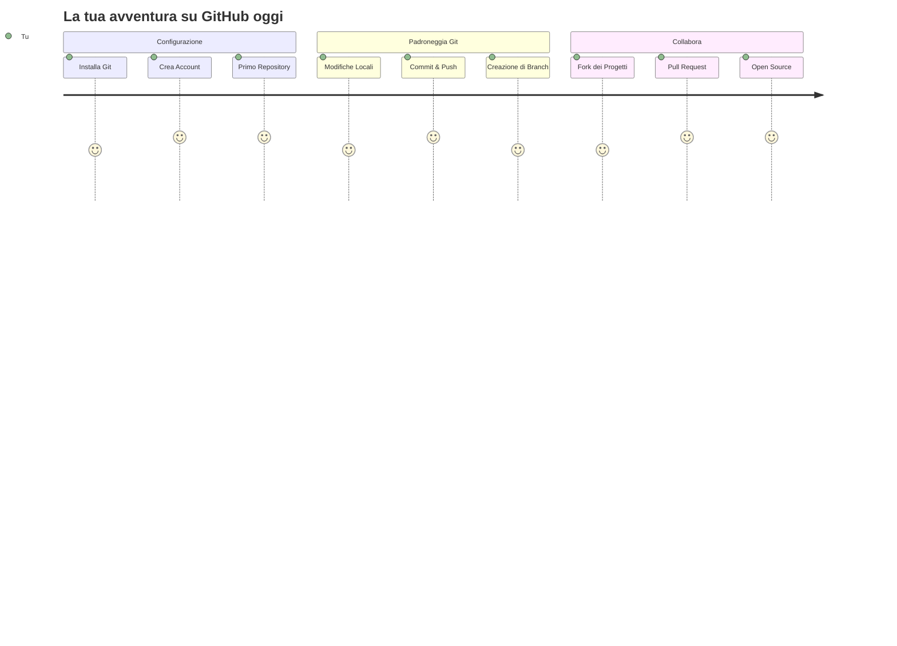
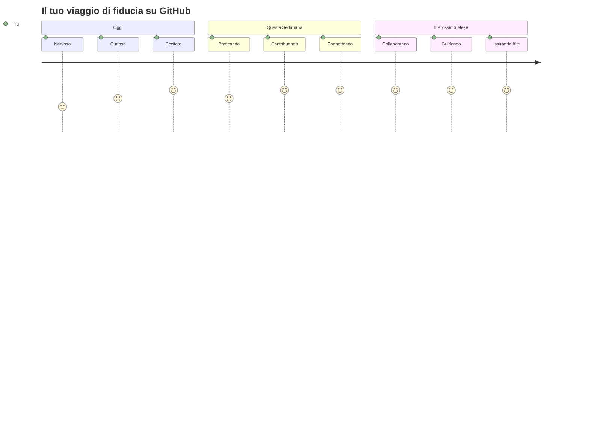

# Introduzione a GitHub

Ciao, futuro sviluppatore! 👋 Pronto a unirti a milioni di programmatori in tutto il mondo? Sono davvero entusiasta di presentarti GitHub – pensalo come un social network per programmatori, ma invece di condividere foto del tuo pranzo, condividiamo codice e costruiamo cose incredibili insieme!

Ecco cosa mi lascia sempre a bocca aperta: ogni app sul tuo telefono, ogni sito web che visiti e la maggior parte degli strumenti che imparerai a usare sono stati creati da team di sviluppatori che collaborano su piattaforme come GitHub. Quell'app musicale che ami? Qualcuno come te ha contribuito a crearla. Quel gioco a cui non riesci a smettere di giocare? Sì, probabilmente è stato costruito con la collaborazione su GitHub. E ora TU stai per imparare come far parte di questa straordinaria comunità!

So che all'inizio potrebbe sembrare tutto un po' complicato – ricordo ancora quando ho guardato la mia prima pagina su GitHub pensando "Ma cosa significa tutto questo?". Ma ecco il punto: ogni singolo sviluppatore è partito esattamente da dove sei tu ora. Alla fine di questa lezione, avrai il tuo repository GitHub personale (pensalo come il tuo spazio per mostrare i tuoi progetti nel cloud) e saprai come salvare il tuo lavoro, condividerlo con gli altri e persino contribuire a progetti utilizzati da milioni di persone.

Faremo questo viaggio insieme, un passo alla volta. Niente fretta, niente pressione – solo tu, io e alcuni strumenti davvero fantastici che stanno per diventare i tuoi nuovi migliori amici!


> Sketchnote di [Tomomi Imura](https://twitter.com/girlie_mac)


## Quiz Pre-Lezione
[Quiz pre-lezione](https://ff-quizzes.netlify.app)

## Introduzione

Prima di immergerci nelle cose davvero entusiasmanti, prepariamo il tuo computer per un po' di magia con GitHub! Pensalo come organizzare i tuoi materiali artistici prima di creare un capolavoro – avere gli strumenti giusti pronti rende tutto più fluido e molto più divertente.

Ti guiderò personalmente attraverso ogni passaggio di configurazione, e ti prometto che non è così intimidatorio come potrebbe sembrare a prima vista. Se qualcosa non ti è chiaro subito, è del tutto normale! Ricordo quando ho configurato il mio primo ambiente di sviluppo e mi sembrava di cercare di decifrare geroglifici antichi. Ogni singolo sviluppatore è stato esattamente dove sei tu ora, chiedendosi se stava facendo tutto nel modo giusto. Spoiler: se sei qui a imparare, stai già facendo tutto nel modo giusto! 🌟

In questa lezione, vedremo:

- come tracciare il lavoro che fai sul tuo computer
- come lavorare su progetti con altre persone
- come contribuire al software open source

### Prerequisiti

Prepariamo il tuo computer per un po' di magia con GitHub! Non preoccuparti – questa configurazione è qualcosa che devi fare solo una volta, e poi sarai pronto per tutto il tuo viaggio nel mondo del coding.

Bene, iniziamo con le basi! Prima di tutto, dobbiamo verificare se Git è già installato sul tuo computer. Git è praticamente come avere un assistente super-intelligente che ricorda ogni singola modifica che fai al tuo codice – molto meglio che premere freneticamente Ctrl+S ogni due secondi (ci siamo passati tutti!).

Vediamo se Git è già installato digitando questo comando magico nel tuo terminale:
`git --version`

Se Git non è ancora installato, nessun problema! Vai su [download Git](https://git-scm.com/downloads) e scaricalo. Una volta installato, dobbiamo presentarti ufficialmente a Git:

> 💡 **Prima Configurazione**: Questi comandi dicono a Git chi sei. Queste informazioni saranno associate a ogni commit che fai, quindi scegli un nome e un'email che ti senti a tuo agio a condividere pubblicamente.

```bash
git config --global user.name "your-name"
git config --global user.email "your-email"
```

Per verificare se Git è già configurato, puoi digitare:
```bash
git config --list
```

Avrai anche bisogno di un account GitHub, un editor di codice (come Visual Studio Code) e dovrai aprire il tuo terminale (o: prompt dei comandi).

Vai su [github.com](https://github.com/) e crea un account se non l'hai già fatto, oppure accedi e completa il tuo profilo.

💡 **Consiglio moderno**: Considera di configurare [chiavi SSH](https://docs.github.com/en/authentication/connecting-to-github-with-ssh) o di utilizzare [GitHub CLI](https://cli.github.com/) per un'autenticazione più semplice senza password.

✅ GitHub non è l'unico repository di codice al mondo; ce ne sono altri, ma GitHub è il più conosciuto.

### Preparazione

Avrai bisogno di una cartella con un progetto di codice sul tuo computer locale (laptop o PC) e di un repository pubblico su GitHub, che servirà come esempio per imparare a contribuire ai progetti degli altri.

### Proteggere il Tuo Codice

Parliamo un momento di sicurezza – ma non preoccuparti, non ti sommergeremo con cose spaventose! Pensa a queste pratiche di sicurezza come chiudere a chiave la tua auto o la tua casa. Sono abitudini semplici che diventano naturali e proteggono il tuo duro lavoro.

Ti mostreremo i modi moderni e sicuri per lavorare con GitHub fin dall'inizio. In questo modo, svilupperai buone abitudini che ti serviranno per tutta la tua carriera di programmatore.

Quando lavori con GitHub, è importante seguire le migliori pratiche di sicurezza:

| Area di Sicurezza | Migliore Pratica | Perché è Importante |
|-------------------|------------------|---------------------|
| **Autenticazione** | Usa chiavi SSH o Token di Accesso Personale | Le password sono meno sicure e stanno per essere eliminate |
| **Autenticazione a Due Fattori** | Abilita 2FA sul tuo account GitHub | Aggiunge un ulteriore livello di protezione all'account |
| **Sicurezza del Repository** | Non commettere mai informazioni sensibili | Le chiavi API e le password non dovrebbero mai essere nei repository pubblici |
| **Gestione delle Dipendenze** | Abilita Dependabot per gli aggiornamenti | Mantiene le tue dipendenze sicure e aggiornate |

> ⚠️ **Promemoria Critico di Sicurezza**: Non commettere mai chiavi API, password o altre informazioni sensibili in un repository. Usa variabili d'ambiente e file `.gitignore` per proteggere i dati sensibili.

**Configurazione Moderna dell'Autenticazione:**

```bash
# Genera chiave SSH (algoritmo moderno ed25519)
ssh-keygen -t ed25519 -C "your_email@example.com"

# Configura Git per utilizzare SSH
git remote set-url origin git@github.com:username/repository.git
```

> 💡 **Consiglio Pro**: Le chiavi SSH eliminano la necessità di inserire ripetutamente le password e sono più sicure dei metodi di autenticazione tradizionali.

---

## Gestire il Tuo Codice Come un Professionista

Ok, QUI è dove le cose diventano davvero entusiasmanti! 🎉 Stiamo per imparare come tracciare e gestire il tuo codice come fanno i professionisti, e onestamente, questa è una delle mie cose preferite da insegnare perché è una vera svolta.

Immagina questo: stai scrivendo una storia incredibile e vuoi tenere traccia di ogni bozza, ogni brillante modifica e ogni momento "aspetta, è geniale!" lungo il percorso. Questo è esattamente ciò che Git fa per il tuo codice! È come avere il taccuino più incredibile che viaggia nel tempo e ricorda TUTTO – ogni battitura, ogni modifica, ogni momento "oops, ho rotto tutto" che puoi annullare all'istante.

Sarò onesto – all'inizio potrebbe sembrare travolgente. Quando ho iniziato, pensavo "Perché non posso semplicemente salvare i miei file come al solito?". Ma fidati di me: una volta che Git ti sarà chiaro (e lo sarà!), avrai uno di quei momenti di illuminazione in cui penserai "Come ho fatto a programmare senza questo?". È come scoprire di poter volare dopo aver camminato ovunque per tutta la vita!

Supponiamo che tu abbia una cartella locale con un progetto di codice e voglia iniziare a tracciare i tuoi progressi usando git – il sistema di controllo delle versioni. Alcuni paragonano l'uso di git a scrivere una lettera d'amore al tuo futuro io. Leggendo i tuoi messaggi di commit giorni, settimane o mesi dopo, sarai in grado di ricordare perché hai preso una decisione o "annullare" una modifica – ovviamente, quando scrivi buoni "messaggi di commit".

```mermaid
flowchart TD
    A[📁 I file del tuo progetto] --> B{È un repository Git?}
    B -->|No| C[git init]
    B -->|Sì| D[Apporta modifiche]
    C --> D
    D --> E[git add .]
    E --> F["git commit -m 'messaggio'"]
    F --> G[git push]
    G --> H[🌟 Codice su GitHub!]
    
    H --> I{Vuoi collaborare?}
    I -->|Sì| J[Fork & Clone]
    I -->|No| D
    J --> K[Crea Branch]
    K --> L[Apporta modifiche]
    L --> M[Pull Request]
    M --> N[🎉 Contribuendo!]
    
    style A fill:#fff59d
    style H fill:#c8e6c9
    style N fill:#ff4081,color:#fff
```


### Compito: Crea il Tuo Primo Repository!

> 🎯 **La Tua Missione (e sono così entusiasta per te!)**: Creeremo insieme il tuo primo repository GitHub! Quando avremo finito, avrai il tuo piccolo angolo di internet dove vive il tuo codice e avrai fatto il tuo primo "commit" (nel linguaggio degli sviluppatori, significa salvare il tuo lavoro in un modo davvero intelligente).
>
> Questo è davvero un momento speciale – stai per unirti ufficialmente alla comunità globale degli sviluppatori! Ricordo ancora l'emozione di creare il mio primo repository e pensare "Wow, lo sto davvero facendo!"

Facciamo questa avventura insieme, passo dopo passo. Prenditi il tuo tempo per ogni parte – non c'è un premio per chi corre, e ti prometto che ogni singolo passaggio avrà senso. Ricorda, ogni superstar del coding che ammiri è stata una volta esattamente dove sei tu, pronta a creare il suo primo repository. Non è fantastico?

> Guarda il video
> 
> [](https://www.youtube.com/watch?v=9R31OUPpxU4)

**Facciamolo Insieme:**

1. **Crea il tuo repository su GitHub**. Vai su GitHub.com e cerca quel pulsante verde brillante **New** (o il segno **+** in alto a destra). Cliccaci sopra e seleziona **New repository**.

   Ecco cosa fare:
   1. Dai un nome al tuo repository – scegline uno che abbia significato per te!
   1. Aggiungi una descrizione se vuoi (aiuta gli altri a capire di cosa tratta il tuo progetto)
   1. Decidi se vuoi che sia pubblico (visibile a tutti) o privato (solo per te)
   1. Ti consiglio di selezionare la casella per aggiungere un file README – è come la prima pagina del tuo progetto
   1. Clicca su **Create repository** e festeggia – hai appena creato il tuo primo repository! 🎉

2. **Vai alla tua cartella del progetto**. Ora apriamo il terminale (non preoccuparti, non è così spaventoso come sembra!). Dobbiamo dire al tuo computer dove si trovano i file del tuo progetto. Digita questo comando:

   ```bash
   cd [name of your folder]
   ```

   **Cosa stiamo facendo qui:**
   - Stiamo praticamente dicendo "Ehi computer, portami alla mia cartella del progetto"
   - È come aprire una cartella specifica sul desktop, ma lo facciamo con comandi testuali
   - Sostituisci `[name of your folder]` con il nome effettivo della tua cartella del progetto

3. **Trasforma la tua cartella in un repository Git**. Qui avviene la magia! Digita:

   ```bash
   git init
   ```

   **Ecco cosa è appena successo (cose davvero fighe!):**
   - Git ha appena creato una cartella nascosta `.git` nel tuo progetto – non la vedrai, ma è lì!
   - La tua cartella normale è ora un "repository" che può tracciare ogni modifica che fai
   - Pensalo come dare superpoteri alla tua cartella per ricordare tutto

4. **Controlla cosa sta succedendo**. Vediamo cosa pensa Git del tuo progetto in questo momento:

   ```bash
   git status
   ```

   **Capire cosa ti sta dicendo Git:**
   
   Potresti vedere qualcosa che assomiglia a questo:

   ```output
   Changes not staged for commit:
   (use "git add <file>..." to update what will be committed)
   (use "git restore <file>..." to discard changes in working directory)

        modified:   file.txt
        modified:   file2.txt
   ```

   **Non farti prendere dal panico! Ecco cosa significa:**
   - I file in **rosso** sono file che hanno modifiche ma non sono ancora pronti per essere salvati
   - I file in **verde** (quando li vedrai) sono pronti per essere salvati
   - Git è utile e ti dice esattamente cosa puoi fare dopo

   > 💡 **Consiglio pro**: Il comando `git status` è il tuo migliore amico! Usalo ogni volta che sei confuso su cosa sta succedendo. È come chiedere a Git "Ehi, qual è la situazione in questo momento?"

5. **Prepara i tuoi file per essere salvati** (questo si chiama "staging"):

   ```bash
   git add .
   ```

   **Cosa abbiamo appena fatto:**
   - Abbiamo detto a Git "Ehi, voglio includere TUTTI i miei file nel prossimo salvataggio"
   - Il `.` è come dire "tutto in questa cartella"
   - Ora i tuoi file sono "in stage" e pronti per il prossimo passaggio

   **Vuoi essere più selettivo?** Puoi aggiungere solo file specifici:

   ```bash
   git add [file or folder name]
   ```

   **Perché potresti volerlo fare?**
   - A volte vuoi salvare modifiche correlate insieme
   - Ti aiuta a organizzare il tuo lavoro in blocchi logici
   - Rende più facile capire cosa è cambiato e quando

   **Hai cambiato idea?** Nessun problema! Puoi rimuovere i file dallo stage così:

   ```bash
   # Rimuovi tutto dalla fase di staging
   git reset
   
   # Rimuovi dalla fase di staging solo un file
   git reset [file name]
   ```

   Non preoccuparti – questo non elimina il tuo lavoro, semplicemente toglie i file dalla "pila pronta per il salvataggio".

6. **Salva il tuo lavoro in modo permanente** (facendo il tuo primo commit!):

   ```bash
   git commit -m "first commit"
   ```

   **🎉 Congratulazioni! Hai appena fatto il tuo primo commit!**
   
   **Ecco cosa è appena successo:**
   - Git ha scattato una "istantanea" di tutti i file in stage in questo momento esatto
   - Il tuo messaggio di commit "first commit" spiega di cosa tratta questo punto di salvataggio
   - Git ha assegnato a questa istantanea un ID unico, così puoi sempre trovarla in seguito
   - Hai ufficialmente iniziato a tracciare la cronologia del tuo progetto!

   > 💡 **Messaggi di commit futuri**: Per i tuoi prossimi commit, sii più descrittivo! Invece di "aggiornato roba", prova "Aggiunto modulo di contatto alla homepage" o "Risolto bug nel menu di navigazione". Il tuo futuro io ti ringrazierà!

7. **Collega il tuo progetto locale a GitHub**. Al momento, il tuo progetto esiste solo sul tuo computer. Colleghiamolo al tuo repository GitHub così puoi condividerlo con il mondo!

   Prima, vai alla pagina del tuo repository GitHub e copia l'URL. Poi torna qui e digita:

   ```bash
   git remote add origin https://github.com/username/repository_name.git
   ```
   
   (Sostituisci quell'URL con l'URL effettivo del tuo repository!)

   **Cosa abbiamo appena fatto:**
   - Abbiamo creato una connessione tra il tuo progetto locale e il tuo repository GitHub
   - "Origin" è solo un soprannome per il tuo repository GitHub – è come aggiungere un contatto al tuo telefono
   - Ora il tuo Git locale sa dove inviare il tuo codice quando sei pronto a condividerlo

   💡 **Metodo più semplice**: Se hai installato GitHub CLI, puoi fare tutto questo con un solo comando:
   ```bash
   gh repo create my-repo --public --push --source=.
   ```

8. **Invia il tuo codice su GitHub** (il grande momento!):

   ```bash
   git push -u origin main
   ```

   **🚀 Ecco fatto! Stai caricando il tuo codice su GitHub!**
   
   **Cosa sta succedendo:**
   - I tuoi commit stanno viaggiando dal tuo computer a GitHub
   - Il flag `-u` stabilisce una connessione permanente, rendendo più facili i futuri push
   - "main" è il nome del tuo branch principale (come la cartella principale)
   - Dopo questo, per i futuri upload ti basterà digitare `git push`!

   💡 **Nota veloce**: Se il tuo branch si chiama diversamente (come "master"), usa quel nome. Puoi verificarlo con `git branch --show-current`.

9. **Il tuo nuovo ritmo quotidiano di coding** (qui diventa coinvolgente!):

   Da ora in poi, ogni volta che apporti modifiche al tuo progetto, segui questa semplice routine in tre passaggi:

   ```bash
   git add .
   git commit -m "describe what you changed"
   git push
   ```

   **Questo diventa il tuo battito cardiaco da programmatore:**
   - Apporta modifiche straordinarie al tuo codice ✨
   - Metti in stage con `git add` ("Ehi Git, presta attenzione a queste modifiche!")
   - Salva con `git commit` e un messaggio descrittivo (il te del futuro ti ringrazierà!)
   - Condividi con il mondo usando `git push` 🚀
   - Ripeti – davvero, diventa naturale come respirare!

   Amo questo workflow perché è come avere più punti di salvataggio in un videogioco. Hai fatto una modifica che ti piace? Commit! Vuoi provare qualcosa di rischioso? Nessun problema – puoi sempre tornare al tuo ultimo commit se le cose vanno male!

   > 💡 **Consiglio**: Potresti anche voler adottare un file `.gitignore` per evitare che file che non vuoi tracciare compaiano su GitHub - come quel file di appunti che conservi nella stessa cartella ma che non ha posto in un repository pubblico. Puoi trovare modelli per file `.gitignore` su [.gitignore templates](https://github.com/github/gitignore) o crearne uno usando [gitignore.io](https://www.toptal.com/developers/gitignore).

### 🧠 **Primo check-in del repository: Come ti sei sentito?**

**Prenditi un momento per festeggiare e riflettere:**
- Come ti sei sentito nel vedere il tuo codice apparire su GitHub per la prima volta?
- Quale passaggio ti è sembrato più confuso e quale sorprendentemente facile?
- Riesci a spiegare la differenza tra `git add`, `git commit` e `git push` con parole tue?

```mermaid
stateDiagram-v2
    [*] --> LocalFiles: Crea progetto
    LocalFiles --> Staged: git add .
    Staged --> Committed: git commit
    Committed --> GitHub: git push
    GitHub --> [*]: Successo! 🎉
    
    note right of Staged
        File pronti per essere salvati
    end note
    
    note right of Committed
        Snapshot creato
    end note
```


> **Ricorda**: Anche gli sviluppatori esperti a volte dimenticano i comandi esatti. Far diventare questo workflow un'abitudine richiede pratica - stai andando alla grande!

#### Workflow Git moderni

Considera di adottare queste pratiche moderne:

- **Conventional Commits**: Usa un formato standardizzato per i messaggi di commit come `feat:`, `fix:`, `docs:`, ecc. Scopri di più su [conventionalcommits.org](https://www.conventionalcommits.org/)
- **Commit atomici**: Fai in modo che ogni commit rappresenti un singolo cambiamento logico
- **Commit frequenti**: Effettua commit frequenti con messaggi descrittivi piuttosto che commit grandi e poco frequenti

#### Messaggi di commit

Una grande riga di soggetto per un commit Git completa la seguente frase:
Se applicato, questo commit <la tua riga di soggetto qui>

Per il soggetto usa l'imperativo, tempo presente: "modifica" non "modificato" né "modifiche". 
Come nel soggetto, anche nel corpo (opzionale) usa l'imperativo, tempo presente. Il corpo dovrebbe includere la motivazione del cambiamento e confrontarla con il comportamento precedente. Stai spiegando il `perché`, non il `come`.

✅ Prenditi qualche minuto per navigare su GitHub. Riesci a trovare un messaggio di commit davvero ben fatto? Riesci a trovarne uno molto minimale? Quali informazioni pensi siano le più importanti e utili da trasmettere in un messaggio di commit?

## Lavorare con gli altri (La parte divertente!)

Preparati perché QUI è dove GitHub diventa assolutamente magico! 🪄 Hai imparato a gestire il tuo codice, ma ora stiamo entrando nella mia parte preferita – collaborare con persone straordinarie da tutto il mondo.

Immagina questo: ti svegli domani e scopri che qualcuno a Tokyo ha migliorato il tuo codice mentre dormivi. Poi qualcuno a Berlino risolve un bug su cui eri bloccato. Nel pomeriggio, uno sviluppatore a São Paulo aggiunge una funzionalità a cui non avevi nemmeno pensato. Non è fantascienza – è solo un normale martedì nell'universo di GitHub!

Quello che mi entusiasma davvero è che le competenze di collaborazione che stai per imparare? Sono gli STESSI workflow che i team di Google, Microsoft e le tue startup preferite usano ogni singolo giorno. Non stai solo imparando uno strumento interessante – stai imparando il linguaggio segreto che fa funzionare insieme l'intero mondo del software. 

Seriamente, una volta che provi l'emozione di vedere qualcuno unire la tua prima pull request, capirai perché gli sviluppatori si appassionano così tanto all'open source. È come far parte del più grande e creativo progetto di squadra del mondo!

> Guarda il video
>
> [](https://www.youtube.com/watch?v=bFCM-PC3cu8)

Il motivo principale per mettere le cose su GitHub era rendere possibile collaborare con altri sviluppatori.

```mermaid
flowchart LR
    A[🔍 Trova Progetto] --> B[🍴 Fork Repository]
    B --> C[📥 Clona in Locale]
    C --> D[🌿 Crea Branch]
    D --> E[✏️ Apporta Modifiche]
    E --> F[💾 Commit Modifiche]
    F --> G[📤 Push Branch]
    G --> H[🔄 Crea Pull Request]
    H --> I{Revisione del Maintainer}
    I -->|✅ Approvato| J[🎉 Merge!]
    I -->|❓ Modifiche Richieste| K[📝 Apporta Aggiornamenti]
    K --> F
    J --> L[🧹 Pulisci Branch]
    
    style A fill:#e3f2fd
    style J fill:#e8f5e8
    style L fill:#fff3e0
```


Nel tuo repository, vai su `Insights > Community` per vedere come il tuo progetto si confronta con gli standard di comunità raccomandati.

Vuoi rendere il tuo repository professionale e accogliente? Vai al tuo repository e clicca su `Insights > Community`. Questa funzione interessante ti mostra come il tuo progetto si confronta con ciò che la comunità GitHub considera "buone pratiche per i repository".

> 🎯 **Fai brillare il tuo progetto**: Un repository ben organizzato con una buona documentazione è come avere una vetrina pulita e accogliente. Dice alle persone che tieni al tuo lavoro e le invoglia a contribuire!

**Ecco cosa rende un repository fantastico:**

| Cosa aggiungere | Perché è importante | Cosa fa per te |
|------------------|---------------------|----------------|
| **Descrizione** | La prima impressione conta! | Le persone capiscono subito cosa fa il tuo progetto |
| **README** | La pagina principale del tuo progetto | Come una guida turistica amichevole per i nuovi visitatori |
| **Linee guida per contribuire** | Mostra che accetti aiuto | Le persone sanno esattamente come possono aiutarti |
| **Codice di condotta** | Crea uno spazio amichevole | Tutti si sentono benvenuti a partecipare |
| **Licenza** | Chiarezza legale | Gli altri sanno come possono usare il tuo codice |
| **Politica di sicurezza** | Mostra che sei responsabile | Dimostra pratiche professionali |

> 💡 **Consiglio Pro**: GitHub fornisce modelli per tutti questi file. Quando crei un nuovo repository, seleziona le caselle per generare automaticamente questi file.

**Funzionalità moderne di GitHub da esplorare:**

🤖 **Automazione & CI/CD:**
- **GitHub Actions** per test e deployment automatici
- **Dependabot** per aggiornamenti automatici delle dipendenze

💬 **Comunità & Gestione Progetti:**
- **GitHub Discussions** per conversazioni comunitarie oltre ai problemi
- **GitHub Projects** per gestione di progetti in stile kanban
- **Regole di protezione dei branch** per garantire standard di qualità del codice

Tutte queste risorse saranno utili per integrare nuovi membri del team. E sono tipicamente le cose che i nuovi collaboratori guardano prima ancora di esaminare il tuo codice, per capire se il tuo progetto è il posto giusto dove investire il loro tempo.

✅ I file README, anche se richiedono tempo per essere preparati, sono spesso trascurati dai manutentori impegnati. Riesci a trovare un esempio di uno particolarmente descrittivo? Nota: ci sono alcuni [strumenti per creare buoni README](https://www.makeareadme.com/) che potresti voler provare.

### Compito: Unire del codice

I documenti per contribuire aiutano le persone a contribuire al progetto. Spiegano quali tipi di contributi stai cercando e come funziona il processo. I collaboratori dovranno seguire una serie di passaggi per poter contribuire al tuo repository su GitHub:

1. **Fork del tuo repository** Probabilmente vorrai che le persone _forkino_ il tuo progetto. Forkare significa creare una replica del tuo repository sul loro profilo GitHub.
1. **Clone**. Da lì cloneranno il progetto sulla loro macchina locale. 
1. **Creare un branch**. Vorrai chiedere loro di creare un _branch_ per il loro lavoro. 
1. **Concentrarsi su un'area**. Chiedi ai collaboratori di concentrarsi su un contributo alla volta - in questo modo le probabilità che tu possa _unire_ il loro lavoro sono più alte. Immagina che scrivano una correzione di bug, aggiungano una nuova funzionalità e aggiornino diversi test - cosa succede se vuoi, o puoi implementare solo 2 su 3, o 1 su 3 modifiche?

✅ Immagina una situazione in cui i branch sono particolarmente critici per scrivere e distribuire buon codice. Quali casi d'uso ti vengono in mente?

> Nota, sii il cambiamento che vuoi vedere nel mondo e crea branch anche per il tuo lavoro. Qualsiasi commit che fai sarà fatto sul branch su cui sei attualmente "checkout". Usa `git status` per vedere quale branch è.

Passiamo attraverso un workflow per i collaboratori. Supponiamo che il collaboratore abbia già _forkato_ e _clonato_ il repository, quindi ha un repository Git pronto per essere lavorato sulla sua macchina locale:

1. **Creare un branch**. Usa il comando `git branch` per creare un branch che conterrà le modifiche che intendono contribuire:

   ```bash
   git branch [branch-name]
   ```

   > 💡 **Approccio moderno**: Puoi anche creare e passare al nuovo branch con un solo comando:
   ```bash
   git switch -c [branch-name]
   ```

1. **Passare al branch di lavoro**. Passa al branch specificato e aggiorna la directory di lavoro con `git switch`:

   ```bash
   git switch [branch-name]
   ```

   > 💡 **Nota moderna**: `git switch` è il sostituto moderno di `git checkout` per cambiare branch. È più chiaro e sicuro per i principianti.

1. **Fare il lavoro**. A questo punto vuoi aggiungere le tue modifiche. Non dimenticare di dirlo a Git con i seguenti comandi:

   ```bash
   git add .
   git commit -m "my changes"
   ```

   > ⚠️ **Qualità del messaggio di commit**: Assicurati di dare al tuo commit un buon nome, sia per te che per il manutentore del repository su cui stai lavorando. Sii specifico su ciò che hai cambiato!

1. **Unire il tuo lavoro con il branch `main`**. A un certo punto hai finito di lavorare e vuoi unire il tuo lavoro con quello del branch `main`. Il branch `main` potrebbe essere cambiato nel frattempo, quindi assicurati di aggiornarlo prima con i seguenti comandi:

   ```bash
   git switch main
   git pull
   ```

   A questo punto vuoi assicurarti che eventuali _conflitti_, situazioni in cui Git non riesce facilmente a _unire_ le modifiche, si verifichino nel tuo branch di lavoro. Pertanto esegui i seguenti comandi:

   ```bash
   git switch [branch_name]
   git merge main
   ```

   Il comando `git merge main` porterà tutte le modifiche da `main` nel tuo branch. Si spera che tu possa semplicemente continuare. Se no, VS Code ti dirà dove Git è _confuso_ e tu modifichi i file interessati per indicare quale contenuto è più accurato.

   💡 **Alternativa moderna**: Considera di usare `git rebase` per una cronologia più pulita:
   ```bash
   git rebase main
   ```
   Questo riproduce i tuoi commit sopra l'ultimo branch main, creando una cronologia lineare.

1. **Invia il tuo lavoro su GitHub**. Inviare il tuo lavoro su GitHub significa due cose. Fare il push del tuo branch sul tuo repository e poi aprire una PR, Pull Request.

   ```bash
   git push --set-upstream origin [branch-name]
   ```

   Il comando sopra crea il branch sul tuo repository forkato.

### 🤝 **Verifica delle competenze di collaborazione: Pronto a lavorare con gli altri?**

**Vediamo come ti senti riguardo alla collaborazione:**
- L'idea di fork e pull request ti è chiara ora?
- Qual è una cosa sul lavoro con i branch che vuoi praticare di più?
- Quanto ti senti a tuo agio nel contribuire al progetto di qualcun altro?

```mermaid
mindmap
  root((Collaborazione Git))
    Branching
      Rami delle funzionalità
      Rami di correzione bug
      Lavoro sperimentale
    Pull Requests
      Revisione del codice
      Discussione
      Test
    Migliori Pratiche
      Messaggi di commit chiari
      Modifiche piccole e mirate
      Buona documentazione
```


> **Incoraggiamento**: Ogni singolo sviluppatore che ammiri era una volta nervoso per la sua prima pull request. La comunità GitHub è incredibilmente accogliente per i nuovi arrivati!

1. **Apri una PR**. Successivamente, vuoi aprire una PR. Lo fai navigando nel repository forkato su GitHub. Vedrai un'indicazione su GitHub dove ti chiede se vuoi creare una nuova PR, clicchi lì e vieni portato a un'interfaccia dove puoi modificare il titolo del messaggio di commit, dare una descrizione più adatta. Ora il manutentore del repository che hai forkato vedrà questa PR e _incrociamo le dita_ apprezzerà e _unirà_ la tua PR. Ora sei un collaboratore, evviva :)

   💡 **Consiglio moderno**: Puoi anche creare PR usando GitHub CLI:
   ```bash
   gh pr create --title "Your PR title" --body "Description of changes"
   ```

   🔧 **Best practices per le PR**:
   - Collega problemi correlati usando parole chiave come "Fixes #123"
   - Aggiungi screenshot per modifiche all'interfaccia utente
   - Richiedi revisori specifici
   - Usa PR in bozza per lavori in corso
   - Assicurati che tutti i controlli CI siano superati prima di richiedere la revisione
1. **Pulizia**. È considerata una buona pratica _fare pulizia_ dopo aver unito con successo una PR. Vuoi ripulire sia il tuo branch locale che il branch che hai caricato su GitHub. Per prima cosa, eliminiamolo localmente con il seguente comando:

   ```bash
   git branch -d [branch-name]
   ```

   Assicurati di andare sulla pagina GitHub del repository forkato e rimuovere il branch remoto che hai appena caricato.

`Pull request` sembra un termine strano perché in realtà vuoi spingere le tue modifiche nel progetto. Ma il maintainer (proprietario del progetto) o il team principale deve valutare le tue modifiche prima di unirle al branch "main" del progetto, quindi stai davvero richiedendo una decisione di modifica da parte di un maintainer.

Una pull request è il luogo in cui confrontare e discutere le differenze introdotte in un branch con revisioni, commenti, test integrati e altro. Una buona pull request segue più o meno le stesse regole di un messaggio di commit. Puoi aggiungere un riferimento a un problema nel tracker delle issue, ad esempio quando il tuo lavoro risolve un problema. Questo si fa usando un `#` seguito dal numero del problema. Ad esempio `#97`.

🤞Incrociamo le dita che tutti i controlli passino e che il proprietario del progetto unisca le tue modifiche al progetto🤞

Aggiorna il tuo branch di lavoro locale corrente con tutti i nuovi commit dal branch remoto corrispondente su GitHub:

`git pull`

## Contribuire all'Open Source (La tua occasione per fare la differenza!)

Sei pronto per qualcosa che ti lascerà a bocca aperta? 🤯 Parliamo di contribuire ai progetti open source – e mi vengono i brividi solo a pensare di condividere questo con te!

Questa è la tua occasione per far parte di qualcosa di veramente straordinario. Immagina di migliorare gli strumenti che milioni di sviluppatori usano ogni giorno o di correggere un bug in un'app che i tuoi amici adorano. Non è solo un sogno – è proprio questo che significa contribuire all'open source!

Ecco cosa mi emoziona ogni volta che ci penso: ogni singolo strumento con cui hai imparato – il tuo editor di codice, i framework che esploreremo, persino il browser che stai usando per leggere questo – è iniziato con qualcuno esattamente come te che ha fatto il suo primo contributo. Quello sviluppatore brillante che ha creato la tua estensione preferita per VS Code? Una volta era un principiante che cliccava su "crea pull request" con le mani tremanti, proprio come stai per fare tu.

E la parte più bella è questa: la comunità open source è come il più grande abbraccio collettivo di internet. La maggior parte dei progetti cerca attivamente nuovi arrivati e ha issue etichettate "good first issue" appositamente per persone come te! I maintainer si entusiasmano davvero quando vedono nuovi contributori perché ricordano i loro primi passi.

```mermaid
flowchart TD
    A[🔍 Esplora GitHub] --> B[🏷️ Trova "good first issue"]
    B --> C[📖 Leggi Linee Guida per Contribuire]
    C --> D[🍴 Fai il Fork del Repository]
    D --> E[💻 Configura Ambiente Locale]
    E --> F[🌿 Crea Branch per la Funzionalità]
    F --> G[✨ Fai il Tuo Contributo]
    G --> H[🧪 Testa le Tue Modifiche]
    H --> I[📝 Scrivi un Commit Chiaro]
    I --> J[📤 Fai Push & Crea PR]
    J --> K[💬 Interagisci con il Feedback]
    K --> L[🎉 Unito! Sei un Contributore!]
    L --> M[🌟 Trova il Prossimo Problema]
    
    style A fill:#e1f5fe
    style L fill:#c8e6c9
    style M fill:#fff59d
```
Non stai solo imparando a programmare qui – ti stai preparando a unirti a una famiglia globale di costruttori che si svegliano ogni giorno pensando "Come possiamo rendere il mondo digitale un po' migliore?" Benvenuto nel club! 🌟

Per prima cosa, troviamo un repository (o **repo**) su GitHub che ti interessa e a cui vorresti contribuire con una modifica. Vorrai copiarne i contenuti sul tuo computer.

✅ Un buon modo per trovare repository 'adatti ai principianti' è [cercare con il tag 'good-first-issue'](https://github.blog/2020-01-22-browse-good-first-issues-to-start-contributing-to-open-source/).


Ci sono diversi modi per copiare il codice. Uno di questi è "clonare" i contenuti del repository, utilizzando HTTPS, SSH o il GitHub CLI (Command Line Interface).

Apri il terminale e clona il repository in questo modo:
```bash
# Utilizzando HTTPS
git clone https://github.com/ProjectURL

# Utilizzando SSH (richiede la configurazione della chiave SSH)
git clone git@github.com:username/repository.git

# Utilizzando GitHub CLI
gh repo clone username/repository
```

Per lavorare sul progetto, spostati nella cartella corretta:
`cd ProjectURL`

Puoi anche aprire l'intero progetto utilizzando:
- **[GitHub Codespaces](https://github.com/features/codespaces)** - L'ambiente di sviluppo cloud di GitHub con VS Code nel browser
- **[GitHub Desktop](https://desktop.github.com/)** - Un'applicazione GUI per le operazioni Git  
- **[GitHub.dev](https://github.dev)** - Premi il tasto `.` su qualsiasi repo GitHub per aprire VS Code nel browser
- **VS Code** con l'estensione GitHub Pull Requests

Infine, puoi scaricare il codice in una cartella compressa.

### Alcune cose interessanti su GitHub

Puoi mettere una stella, seguire e/o "forkare" qualsiasi repository pubblico su GitHub. Puoi trovare i tuoi repository con stella nel menu a tendina in alto a destra. È come aggiungere ai segnalibri, ma per il codice.

I progetti hanno un tracker delle issue, per lo più su GitHub nella scheda "Issues" a meno che non sia indicato diversamente, dove le persone discutono dei problemi relativi al progetto. E la scheda Pull Requests è dove le persone discutono e revisionano le modifiche in corso.

I progetti potrebbero anche avere discussioni in forum, mailing list o canali di chat come Slack, Discord o IRC.

🔧 **Funzionalità moderne di GitHub**:
- **GitHub Discussions** - Forum integrato per conversazioni della comunità
- **GitHub Sponsors** - Supporta finanziariamente i maintainer  
- **Scheda Security** - Rapporti sulle vulnerabilità e avvisi di sicurezza
- **Scheda Actions** - Visualizza i flussi di lavoro automatizzati e le pipeline CI/CD
- **Scheda Insights** - Analisi su contributori, commit e salute del progetto
- **Scheda Projects** - Strumenti di gestione dei progetti integrati di GitHub

✅ Esplora il tuo nuovo repository GitHub e prova alcune cose, come modificare le impostazioni, aggiungere informazioni al tuo repo, creare un progetto (come una bacheca Kanban) e configurare GitHub Actions per l'automazione. C'è molto da fare!

---

## 🚀 Sfida

Bene, è ora di mettere alla prova i tuoi nuovi superpoteri GitHub! 🚀 Ecco una sfida che renderà tutto più chiaro nel modo più soddisfacente:

Coinvolgi un amico (o quel familiare che ti chiede sempre cosa stai facendo con tutto questo "roba da computer") e intraprendi insieme un'avventura di codifica collaborativa! Qui è dove accade la vera magia – crea un progetto, faglielo forkare, crea dei branch e unisci le modifiche come i professionisti che stai diventando.

Non ti mentirò – probabilmente riderai a un certo punto (soprattutto quando entrambi proverete a modificare la stessa riga), forse vi gratterete la testa per la confusione, ma avrete sicuramente quei momenti "aha!" incredibili che rendono tutto l'apprendimento degno di essere vissuto. Inoltre, c'è qualcosa di speciale nel condividere quella prima unione riuscita con qualcun altro – è come una piccola celebrazione di quanto sei arrivato lontano!

Non hai ancora un compagno di codifica? Nessun problema! La comunità GitHub è piena di persone incredibilmente accoglienti che ricordano com'era essere nuovi. Cerca repository con etichette "good first issue" – stanno praticamente dicendo "Ehi principianti, venite a imparare con noi!" Non è fantastico?

## Quiz post-lezione
[Quiz post-lezione](https://ff-quizzes.netlify.app/web/en/)

## Revisione e continua a imparare

Wow! 🎉 Guarda te – hai appena conquistato le basi di GitHub come un vero campione! Se la tua mente si sente un po' piena in questo momento, è del tutto normale e onestamente un buon segno. Hai appena imparato strumenti che mi hanno richiesto settimane per sentirmi a mio agio quando ho iniziato.

Git e GitHub sono incredibilmente potenti (davvero potenti), e ogni sviluppatore che conosco – inclusi quelli che ora sembrano maghi – ha dovuto esercitarsi e inciampare un po' prima che tutto facesse clic. Il fatto che tu abbia completato questa lezione significa che sei già sulla buona strada per padroneggiare alcuni degli strumenti più importanti nel kit di uno sviluppatore.

Ecco alcune risorse assolutamente fantastiche per aiutarti a esercitarti e diventare ancora più straordinario:

- [Guida al contributo al software open source](https://opensource.guide/how-to-contribute/#how-to-submit-a-contribution) – La tua mappa per fare la differenza
- [Cheatsheet di Git](https://training.github.com/downloads/github-git-cheat-sheet/) – Tienilo a portata di mano per un rapido riferimento!

E ricorda: la pratica porta al progresso, non alla perfezione! Più usi Git e GitHub, più diventerà naturale. GitHub ha creato alcuni corsi interattivi straordinari che ti permettono di esercitarti in un ambiente sicuro:

- [Introduzione a GitHub](https://github.com/skills/introduction-to-github)
- [Comunicare usando Markdown](https://github.com/skills/communicate-using-markdown)  
- [GitHub Pages](https://github.com/skills/github-pages)
- [Gestione dei conflitti di merge](https://github.com/skills/resolve-merge-conflicts)

**Ti senti avventuroso? Dai un'occhiata a questi strumenti moderni:**
- [Documentazione GitHub CLI](https://cli.github.com/manual/) – Per quando vuoi sentirti un mago della riga di comando
- [Documentazione GitHub Codespaces](https://docs.github.com/en/codespaces) – Codifica nel cloud!
- [Documentazione GitHub Actions](https://docs.github.com/en/actions) – Automatizza tutto
- [Best practice di Git](https://www.atlassian.com/git/tutorials/comparing-workflows) – Migliora il tuo flusso di lavoro

## Sfida GitHub Copilot Agent 🚀

Usa la modalità Agent per completare la seguente sfida:

**Descrizione:** Crea un progetto di sviluppo web collaborativo che dimostri il flusso di lavoro GitHub completo che hai imparato in questa lezione. Questa sfida ti aiuterà a esercitarti nella creazione di repository, nelle funzionalità di collaborazione e nei flussi di lavoro Git moderni in uno scenario reale.

**Prompt:** Crea un nuovo repository pubblico GitHub per un semplice progetto "Risorse per lo sviluppo web". Il repository dovrebbe includere un file README.md ben strutturato che elenchi strumenti e risorse utili per lo sviluppo web, organizzati per categorie (HTML, CSS, JavaScript, ecc.). Configura il repository con standard di comunità adeguati, inclusi una licenza, linee guida per i contributi e un codice di condotta. Crea almeno due branch di funzionalità: uno per aggiungere risorse CSS e un altro per risorse JavaScript. Fai commit su ciascun branch con messaggi di commit descrittivi, quindi crea pull request per unire le modifiche al branch principale. Abilita funzionalità GitHub come Issues, Discussions e configura un flusso di lavoro base di GitHub Actions per controlli automatizzati.

## Compito

La tua missione, se decidi di accettarla: Completa il corso [Introduzione a GitHub](https://github.com/skills/introduction-to-github) su GitHub Skills. Questo corso interattivo ti permetterà di esercitarti in tutto ciò che hai imparato in un ambiente sicuro e guidato. Inoltre, otterrai un fantastico badge quando lo completi! 🏅

**Ti senti pronto per altre sfide?**
- Configura l'autenticazione SSH per il tuo account GitHub (niente più password!)
- Prova a usare GitHub CLI per le tue operazioni Git quotidiane
- Crea un repository con un flusso di lavoro GitHub Actions
- Esplora GitHub Codespaces aprendo proprio questo repository in un editor basato sul cloud

---

## 🚀 La tua timeline per padroneggiare GitHub

### ⚡ **Cosa puoi fare nei prossimi 5 minuti**
- [ ] Metti una stella a questo repository e ad altri 3 progetti che ti interessano
- [ ] Configura l'autenticazione a due fattori sul tuo account GitHub
- [ ] Crea un semplice README per il tuo primo repository
- [ ] Segui 5 sviluppatori il cui lavoro ti ispira

### 🎯 **Cosa puoi realizzare in quest'ora**
- [ ] Completa il quiz post-lezione e rifletti sul tuo percorso GitHub
- [ ] Configura le chiavi SSH per un'autenticazione GitHub senza password
- [ ] Crea il tuo primo commit significativo con un ottimo messaggio di commit
- [ ] Esplora la scheda "Esplora" di GitHub per scoprire progetti di tendenza
- [ ] Esercitati a forkare un repository e a fare una piccola modifica

### 📅 **La tua avventura GitHub di una settimana**
- [ ] Completa i corsi GitHub Skills (Introduzione a GitHub, Markdown)
- [ ] Fai la tua prima pull request a un progetto open source
- [ ] Configura un sito GitHub Pages per mostrare il tuo lavoro
- [ ] Partecipa alle discussioni GitHub sui progetti che ti interessano
- [ ] Crea un repository con standard di comunità adeguati (README, Licenza, ecc.)
- [ ] Prova GitHub Codespaces per lo sviluppo basato sul cloud

### 🌟 **La tua trasformazione in un mese**
- [ ] Contribuisci a 3 diversi progetti open source
- [ ] Fai da mentore a qualcuno nuovo su GitHub (restituisci il favore!)
- [ ] Configura flussi di lavoro automatizzati con GitHub Actions
- [ ] Costruisci un portfolio che mostri i tuoi contributi su GitHub
- [ ] Partecipa a Hacktoberfest o eventi simili della comunità
- [ ] Diventa un maintainer del tuo progetto a cui altri contribuiscono

### 🎓 **Check-in finale sulla padronanza di GitHub**

**Celebra quanto sei arrivato lontano:**
- Qual è la tua cosa preferita nell'usare GitHub?
- Quale funzionalità di collaborazione ti entusiasma di più?
- Quanto ti senti sicuro nel contribuire all'open source ora?
- Qual è il primo progetto a cui vuoi contribuire?


> 🌍 **Benvenuto nella comunità globale degli sviluppatori!** Ora hai gli strumenti per collaborare con milioni di sviluppatori in tutto il mondo. Il tuo primo contributo potrebbe sembrare piccolo, ma ricorda - ogni grande progetto open source è iniziato con qualcuno che ha fatto il suo primo commit. La domanda non è se farai un impatto, ma quale progetto straordinario beneficerà per primo della tua prospettiva unica! 🚀

Ricorda: ogni esperto è stato un principiante. Ce la puoi fare! 💪

---

<!-- CO-OP TRANSLATOR DISCLAIMER START -->
**Disclaimer (Avvertenza)**:  
Questo documento è stato tradotto utilizzando il servizio di traduzione automatica [Co-op Translator](https://github.com/Azure/co-op-translator). Sebbene ci impegniamo per garantire l'accuratezza, si prega di notare che le traduzioni automatiche possono contenere errori o imprecisioni. Il documento originale nella sua lingua nativa dovrebbe essere considerato la fonte autorevole. Per informazioni critiche, si raccomanda una traduzione professionale umana. Non siamo responsabili per eventuali incomprensioni o interpretazioni errate derivanti dall'uso di questa traduzione.
<!-- CO-OP TRANSLATOR DISCLAIMER END -->