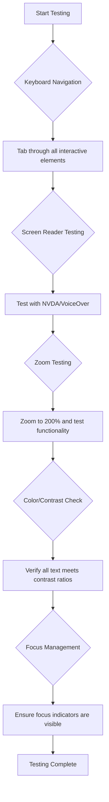
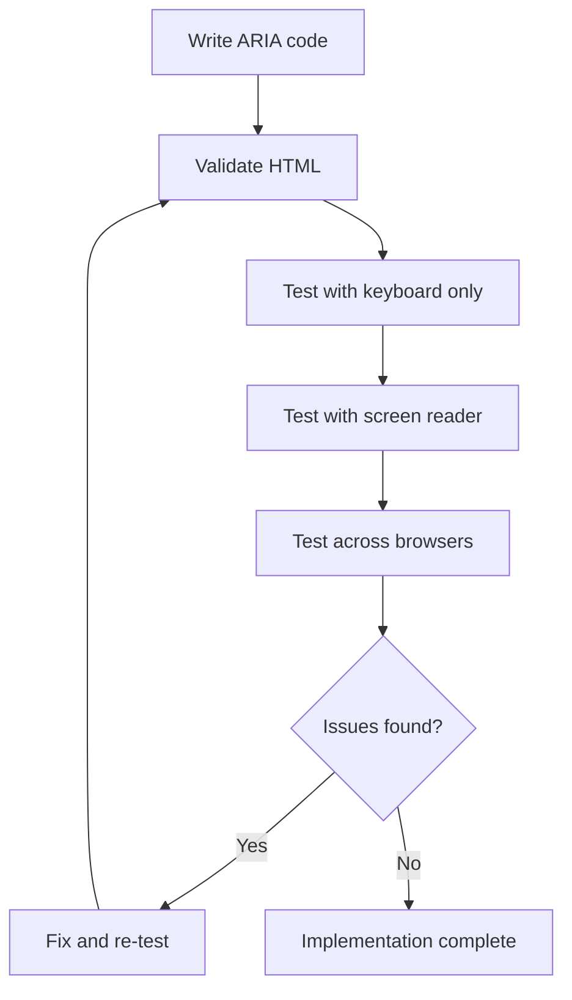

<!--
CO_OP_TRANSLATOR_METADATA:
{
  "original_hash": "90b19cde5b79b29e91babd3138cd8035",
  "translation_date": "2025-10-22T23:23:47+00:00",
  "source_file": "1-getting-started-lessons/3-accessibility/README.md",
  "language_code": "it"
}
-->
# Creare Pagine Web Accessibili


> Sketchnote di [Tomomi Imura](https://twitter.com/girlie_mac)

## Quiz Pre-Lettura
[Quiz pre-lettura](https://ff-quizzes.netlify.app/web/)

> La forza del Web sta nella sua universalità. L'accesso per tutti, indipendentemente dalla disabilità, è un aspetto essenziale.
>
> \- Sir Timothy Berners-Lee, Direttore del W3C e inventore del World Wide Web

Ecco qualcosa che potrebbe sorprenderti: quando crei siti web accessibili, non stai solo aiutando le persone con disabilità—stai effettivamente migliorando il web per tutti!

Hai mai notato quelle rampe sui marciapiedi agli angoli delle strade? Originariamente sono state progettate per le sedie a rotelle, ma ora aiutano anche le persone con passeggini, i corrieri con carrelli, i viaggiatori con bagagli a rotelle e persino i ciclisti. È esattamente così che funziona il design web accessibile—soluzioni che aiutano un gruppo spesso finiscono per beneficiare tutti. Fantastico, vero?

In questa lezione, esploreremo come creare siti web che funzionino davvero per tutti, indipendentemente da come navigano sul web. Scoprirai tecniche pratiche già integrate negli standard web, potrai sperimentare strumenti di test e vedrai come l'accessibilità renda i tuoi siti più utilizzabili per tutti gli utenti.

Alla fine di questa lezione, avrai la sicurezza di rendere l'accessibilità una parte naturale del tuo flusso di lavoro di sviluppo. Pronto a scoprire come scelte di design ponderate possano aprire il web a miliardi di utenti? Iniziamo!

> Puoi seguire questa lezione su [Microsoft Learn](https://docs.microsoft.com/learn/modules/web-development-101/accessibility/?WT.mc_id=academic-77807-sagibbon)!

## Comprendere le Tecnologie Assistive

Prima di iniziare a programmare, prendiamoci un momento per capire come le persone con diverse abilità vivono effettivamente il web. Non è solo teoria—comprendere questi modelli di navigazione reali ti renderà un programmatore molto migliore!

Le tecnologie assistive sono strumenti straordinari che aiutano le persone con disabilità a interagire con i siti web in modi che potrebbero sorprenderti. Una volta che capisci come funzionano queste tecnologie, creare esperienze web accessibili diventa molto più intuitivo. È come imparare a vedere il tuo codice attraverso gli occhi di qualcun altro.

### Screen reader

I [screen reader](https://en.wikipedia.org/wiki/Screen_reader) sono strumenti tecnologici piuttosto sofisticati che convertono il testo digitale in output vocale o braille. Sebbene siano utilizzati principalmente da persone con disabilità visive, sono anche molto utili per utenti con difficoltà di apprendimento come la dislessia.

Mi piace pensare a un screen reader come a un narratore molto intelligente che ti legge un libro. Legge il contenuto ad alta voce in ordine logico, annuncia elementi interattivi come "pulsante" o "link" e fornisce scorciatoie da tastiera per navigare rapidamente in una pagina. Ma ecco il punto—i screen reader possono fare la loro magia solo se costruiamo siti web con una struttura adeguata e contenuti significativi. Ed è qui che entri in gioco tu come sviluppatore!

**Screen reader popolari su diverse piattaforme:**
- **Windows**: [NVDA](https://www.nvaccess.org/about-nvda/) (gratuito e molto popolare), [JAWS](https://webaim.org/articles/jaws/), [Narrator](https://support.microsoft.com/windows/complete-guide-to-narrator-e4397a0d-ef4f-b386-d8ae-c172f109bdb1/?WT.mc_id=academic-77807-sagibbon) (integrato)
- **macOS/iOS**: [VoiceOver](https://support.apple.com/guide/voiceover/welcome/10) (integrato e molto capace)
- **Android**: [TalkBack](https://support.google.com/accessibility/android/answer/6283677) (integrato)
- **Linux**: [Orca](https://wiki.gnome.org/Projects/Orca) (gratuito e open-source)

**Come i screen reader navigano il contenuto web:**

I screen reader offrono diversi metodi di navigazione che rendono la navigazione efficiente per gli utenti esperti:
- **Lettura sequenziale**: Legge il contenuto dall'alto verso il basso, come seguendo un libro
- **Navigazione per punti di riferimento**: Salta tra le sezioni della pagina (header, nav, main, footer)
- **Navigazione per intestazioni**: Salta tra le intestazioni per comprendere la struttura della pagina
- **Liste di link**: Genera un elenco di tutti i link per un accesso rapido
- **Controlli dei moduli**: Naviga direttamente tra i campi di input e i pulsanti

> 💡 **Ecco qualcosa che mi ha sorpreso**: il 68% degli utenti di screen reader naviga principalmente tramite le intestazioni ([WebAIM Survey](https://webaim.org/projects/screenreadersurvey9/#finding)). Questo significa che la struttura delle tue intestazioni è come una mappa per gli utenti—quando la fai bene, stai letteralmente aiutando le persone a orientarsi più velocemente nel tuo contenuto!

### Creare il tuo flusso di lavoro di test

Ecco una buona notizia—testare l'accessibilità in modo efficace non deve essere complicato! Dovresti combinare strumenti automatici (sono fantastici per individuare problemi evidenti) con alcuni test manuali. Ecco un approccio sistematico che, secondo me, individua la maggior parte dei problemi senza occupare tutta la giornata:

**Flusso di lavoro essenziale per i test manuali:**



**Checklist passo-passo per i test:**
1. **Navigazione con tastiera**: Usa solo Tab, Shift+Tab, Enter, Space e i tasti freccia
2. **Test con screen reader**: Attiva NVDA, VoiceOver o Narrator e naviga a occhi chiusi
3. **Test di zoom**: Prova a livelli di zoom del 200% e 400%
4. **Verifica del contrasto dei colori**: Controlla tutto il testo e i componenti dell'interfaccia utente
5. **Test degli indicatori di focus**: Assicurati che tutti gli elementi interattivi abbiano stati di focus visibili

✅ **Inizia con Lighthouse**: Apri gli strumenti per sviluppatori del tuo browser, esegui un audit di accessibilità con Lighthouse e utilizza i risultati per guidare le aree di focus dei tuoi test manuali.

### Strumenti di zoom e ingrandimento

Sai quando pizzichi per ingrandire sul tuo telefono perché il testo è troppo piccolo o strizzi gli occhi davanti allo schermo del laptop sotto la luce del sole? Molti utenti si affidano agli strumenti di ingrandimento per rendere leggibile il contenuto ogni giorno. Questo include persone con problemi di vista, anziani e chiunque abbia mai cercato di leggere un sito web all'aperto.

Le tecnologie moderne di zoom si sono evolute oltre il semplice ingrandimento. Comprendere come funzionano questi strumenti ti aiuterà a creare design responsivi che rimangano funzionali e attraenti a qualsiasi livello di ingrandimento.

**Capacità moderne di zoom nei browser:**
- **Zoom della pagina**: Scala proporzionalmente tutto il contenuto (testo, immagini, layout) - questo è il metodo preferito
- **Zoom solo testo**: Aumenta la dimensione del carattere mantenendo il layout originale
- **Pinch-to-zoom**: Supporto per gesti mobili per ingrandimenti temporanei
- **Supporto del browser**: Tutti i browser moderni supportano lo zoom fino al 500% senza compromettere la funzionalità

**Software di ingrandimento specializzato:**
- **Windows**: [Magnifier](https://support.microsoft.com/windows/use-magnifier-to-make-things-on-the-screen-easier-to-see-414948ba-8b1c-d3bd-8615-0e5e32204198) (integrato), [ZoomText](https://www.freedomscientific.com/training/zoomtext/getting-started/)
- **macOS/iOS**: [Zoom](https://www.apple.com/accessibility/mac/vision/) (integrato con funzionalità avanzate)

> ⚠️ **Considerazione di design**: Le linee guida WCAG richiedono che il contenuto rimanga funzionale quando ingrandito al 200%. A questo livello, lo scorrimento orizzontale dovrebbe essere minimo e tutti gli elementi interattivi dovrebbero rimanere accessibili.

✅ **Testa il tuo design responsivo**: Ingrandisci il tuo browser al 200% e al 400%. Il tuo layout si adatta in modo elegante? Puoi ancora accedere a tutte le funzionalità senza scorrimenti eccessivi?

## Strumenti Moderni per il Test dell'Accessibilità

Ora che hai capito come le persone navigano sul web con le tecnologie assistive, esploriamo gli strumenti che ti aiutano a costruire e testare siti web accessibili.

Pensala così: gli strumenti automatici sono ottimi per individuare problemi evidenti (come la mancanza di testo alternativo), mentre i test manuali ti aiutano a garantire che il tuo sito sia piacevole da usare nel mondo reale. Insieme, ti danno la sicurezza che i tuoi siti funzionino per tutti.

### Test del contrasto dei colori

Ecco una buona notizia: il contrasto dei colori è uno dei problemi di accessibilità più comuni, ma è anche uno dei più facili da risolvere. Un buon contrasto è utile per tutti—dalle persone con problemi di vista a chi cerca di leggere il telefono in spiaggia.

**Requisiti di contrasto WCAG:**

| Tipo di testo | WCAG AA (Minimo) | WCAG AAA (Avanzato) |
|---------------|------------------|---------------------|
| **Testo normale** (sotto i 18pt) | Rapporto di contrasto 4.5:1 | Rapporto di contrasto 7:1 |
| **Testo grande** (18pt+ o 14pt+ grassetto) | Rapporto di contrasto 3:1 | Rapporto di contrasto 4.5:1 |
| **Componenti UI** (pulsanti, bordi dei moduli) | Rapporto di contrasto 3:1 | Rapporto di contrasto 3:1 |

**Strumenti essenziali per il test:**
- [Colour Contrast Analyser](https://www.tpgi.com/color-contrast-checker/) - App desktop con selettore di colori
- [WebAIM Contrast Checker](https://webaim.org/resources/contrastchecker/) - Basato sul web con feedback immediato
- [Stark](https://www.getstark.co/) - Plugin per strumenti di design come Figma, Sketch, Adobe XD
- [Accessible Colors](https://accessible-colors.com/) - Trova palette di colori accessibili

✅ **Crea palette di colori migliori**: Parti dai colori del tuo brand e usa i controlli di contrasto per creare varianti accessibili. Documenta questi colori come token accessibili nel sistema di design.

### Audit completo dell'accessibilità

Il test di accessibilità più efficace combina approcci multipli. Nessun singolo strumento rileva tutto, quindi costruire una routine di test con metodi diversi garantisce una copertura completa.

**Test basati su browser (integrati negli strumenti per sviluppatori):**
- **Chrome/Edge**: Audit di accessibilità con Lighthouse + pannello Accessibilità
- **Firefox**: Inspector di accessibilità con vista dettagliata ad albero
- **Safari**: Scheda Audit in Web Inspector con simulazione VoiceOver

**Estensioni professionali per il test:**
- [axe DevTools](https://www.deque.com/axe/devtools/) - Test automatico standard del settore
- [WAVE](https://wave.webaim.org/extension/) - Feedback visivo con evidenziazione degli errori
- [Accessibility Insights](https://accessibilityinsights.io/) - Suite di test completa di Microsoft

**Integrazione con linea di comando e CI/CD:**
- [axe-core](https://github.com/dequelabs/axe-core) - Libreria JavaScript per test automatici
- [Pa11y](https://pa11y.org/) - Strumento di test di accessibilità da linea di comando
- [Lighthouse CI](https://github.com/GoogleChrome/lighthouse-ci) - Valutazione automatica dell'accessibilità

> 🎯 **Obiettivo del test**: Punta a un punteggio di accessibilità Lighthouse di almeno 95 come base. Ricorda, gli strumenti automatici rilevano solo circa il 30-40% dei problemi di accessibilità—i test manuali sono ancora essenziali!

## Costruire l'Accessibilità dalle Basi

La chiave per il successo nell'accessibilità è integrarla fin dall'inizio. So che è allettante pensare "aggiungerò l'accessibilità più tardi," ma è come cercare di aggiungere una rampa a una casa dopo che è già stata costruita. Possibile? Sì. Facile? Non proprio.

Pensa all'accessibilità come alla pianificazione di una casa—è molto più semplice includere l'accessibilità per le sedie a rotelle nei tuoi piani architettonici iniziali che adattare tutto in seguito.

### I principi POUR: La tua base per l'accessibilità

Le Linee Guida per l'Accessibilità dei Contenuti Web (WCAG) si basano su quattro principi fondamentali che formano l'acronimo POUR. Non preoccuparti—non sono concetti accademici noiosi! Sono in realtà linee guida pratiche per creare contenuti che funzionano per tutti.

Una volta che hai assimilato i principi POUR, prendere decisioni sull'accessibilità diventa molto più intuitivo. È come avere una lista mentale che guida le tue scelte di design. Vediamoli nel dettaglio:

**🔍 Percepibile**: Le informazioni devono essere presentate in modi che gli utenti possano percepire attraverso i sensi disponibili

- Fornisci alternative testuali per contenuti non testuali (immagini, video, audio)
- Garantisci un contrasto di colore sufficiente per tutto il testo e i componenti dell'interfaccia utente
- Offri sottotitoli e trascrizioni per i contenuti multimediali
- Progetta contenuti che rimangano funzionali quando ridimensionati fino al 200%
- Usa caratteristiche sensoriali multiple (non solo il colore) per trasmettere informazioni

**🎮 Operabile**: Tutti i componenti dell'interfaccia devono essere operabili attraverso i metodi di input disponibili

- Rendi tutte le funzionalità accessibili tramite navigazione con tastiera
- Fornisci agli utenti tempo sufficiente per leggere e interagire con il contenuto
- Evita contenuti che causano crisi epilettiche o disturbi vestibolari
- Aiuta gli utenti a navigare in modo efficiente con una struttura chiara e punti di riferimento
- Assicurati che gli elementi interattivi abbiano dimensioni adeguate (minimo 44px)

**📖 Comprensibile**: Le informazioni e l'operazione dell'interfaccia devono essere chiare e comprensibili

- Usa un linguaggio chiaro e semplice adatto al tuo pubblico
- Assicurati che il contenuto appaia e operi in modi prevedibili e coerenti
- Fornisci istruzioni chiare e messaggi di errore per l'input dell'utente
- Aiuta gli utenti a comprendere e correggere gli errori nei moduli
- Organizza il contenuto con un ordine di lettura logico e una gerarchia informativa

**💪 Robusto**: Il contenuto deve funzionare in modo affidabile su diverse tecnologie e dispositivi assistivi

- Usa HTML valido e semantico come base
- Assicurati la compatibilità con le tecnologie assistive attuali e future
- Segui gli standard web e le migliori pratiche per il markup
- Testa su diversi browser, dispositivi e strumenti assistivi
- Struttura il contenuto in modo che si degradi elegantemente quando le funzionalità avanzate non sono supportate

## Creare Design Visivi Accessibili

Un buon design visivo e l'accessibilità vanno di pari passo. Quando progetti con l'accessibilità in mente, spesso scopri che questi vincoli portano a soluzioni più pulite ed eleganti che beneficiano tutti gli utenti.

Esploriamo come creare design visivamente accattivanti che funzionino per tutti, indipendentemente dalle loro capacità visive o dalle condizioni in cui stanno visualizzando il tuo contenuto.

### Strategie di colore e accessibilità visiva
Il colore è uno strumento potente per la comunicazione, ma non dovrebbe mai essere l'unico modo per trasmettere informazioni importanti. Progettare oltre il colore crea esperienze più robuste e inclusive che funzionano in più situazioni.

**Progettare per le differenze nella visione dei colori:**

Circa l'8% degli uomini e lo 0,5% delle donne hanno qualche forma di differenza nella visione dei colori (spesso chiamata "daltonismo"). I tipi più comuni sono:
- **Deuteranopia**: Difficoltà nel distinguere rosso e verde
- **Protanopia**: Il rosso appare più opaco
- **Tritanopia**: Difficoltà con blu e giallo (raro)

**Strategie inclusive per il colore:**

```css
/* ❌ Bad: Using only color to indicate status */
.error { color: red; }
.success { color: green; }

/* ✅ Good: Color plus icons and context */
.error {
  color: #d32f2f;
  border-left: 4px solid #d32f2f;
}
.error::before {
  content: "⚠️";
  margin-right: 8px;
}

.success {
  color: #2e7d32;
  border-left: 4px solid #2e7d32;
}
.success::before {
  content: "✅";
  margin-right: 8px;
}
```

**Oltre ai requisiti di contrasto di base:**
- Testa le tue scelte di colore con simulatori per daltonismo
- Usa pattern, texture o forme insieme alla codifica dei colori
- Assicurati che gli stati interattivi siano distinguibili anche senza colore
- Considera come il tuo design appare in modalità ad alto contrasto

✅ **Testa l'accessibilità dei tuoi colori**: Usa strumenti come [Coblis](https://www.color-blindness.com/coblis-color-blindness-simulator/) per vedere come appare il tuo sito agli utenti con diversi tipi di visione dei colori.

### Indicatori di focus e design dell'interazione

Gli indicatori di focus sono l'equivalente digitale di un cursore: mostrano agli utenti che utilizzano la tastiera dove si trovano sulla pagina. Indicatori di focus ben progettati migliorano l'esperienza per tutti rendendo le interazioni chiare e prevedibili.

**Migliori pratiche per gli indicatori di focus moderni:**

```css
/* Enhanced focus styles that work across browsers */
button:focus-visible {
  outline: 2px solid #0066cc;
  outline-offset: 2px;
  box-shadow: 0 0 0 4px rgba(0, 102, 204, 0.25);
}

/* Remove focus outline for mouse users, preserve for keyboard users */
button:focus:not(:focus-visible) {
  outline: none;
}

/* Focus-within for complex components */
.card:focus-within {
  box-shadow: 0 0 0 3px rgba(74, 144, 164, 0.5);
  border-color: #4A90A4;
}

/* Ensure focus indicators meet contrast requirements */
.custom-focus:focus-visible {
  outline: 3px solid #ffffff;
  outline-offset: 2px;
  box-shadow: 0 0 0 6px #000000;
}
```

**Requisiti per gli indicatori di focus:**
- **Visibilità**: Devono avere un rapporto di contrasto di almeno 3:1 con gli elementi circostanti
- **Larghezza**: Spessore minimo di 2px intorno all'intero elemento
- **Persistenza**: Devono rimanere visibili finché il focus non si sposta altrove
- **Distinzione**: Devono essere visivamente diversi dagli altri stati dell'interfaccia utente

> 💡 **Consiglio di design**: I migliori indicatori di focus spesso utilizzano una combinazione di contorno, ombreggiatura e cambiamenti di colore per garantire la visibilità su diversi sfondi e contesti.

✅ **Verifica gli indicatori di focus**: Naviga con il tasto Tab sul tuo sito web e nota quali elementi hanno indicatori di focus chiari. Ce ne sono alcuni difficili da vedere o completamente assenti?

### HTML semantico: la base dell'accessibilità

L'HTML semantico è come fornire alle tecnologie assistive un sistema GPS per il tuo sito web. Quando utilizzi gli elementi HTML corretti per il loro scopo previsto, stai praticamente fornendo ai lettori di schermo, alle tastiere e ad altri strumenti una mappa dettagliata per aiutare gli utenti a navigare efficacemente.

Ecco un'analogia che mi ha davvero colpito: l'HTML semantico è la differenza tra una biblioteca ben organizzata con categorie chiare e segnaletica utile rispetto a un magazzino dove i libri sono sparsi casualmente. Entrambi i luoghi hanno gli stessi libri, ma in quale preferiresti cercare qualcosa? Esattamente!

**Elementi fondamentali per una struttura di pagina accessibile:**

```html
<!-- Landmark elements provide page navigation structure -->
<header>
  <h1>Your Site Name</h1>
  <nav aria-label="Main navigation">
    <ul>
      <li><a href="/home">Home</a></li>
      <li><a href="/about">About</a></li>
      <li><a href="/services">Services</a></li>
    </ul>
  </nav>
</header>

<main>
  <article>
    <header>
      <h1>Article Title</h1>
      <p>Published on <time datetime="2024-10-14">October 14, 2024</time></p>
    </header>
    
    <section>
      <h2>First Section</h2>
      <p>Content that relates to this section...</p>
    </section>
    
    <section>
      <h2>Second Section</h2>
      <p>More related content...</p>
    </section>
  </article>
  
  <aside>
    <h2>Related Links</h2>
    <nav aria-label="Related articles">
      <ul>
        <li><a href="/related-1">First related article</a></li>
        <li><a href="/related-2">Second related article</a></li>
      </ul>
    </nav>
  </aside>
</main>

<footer>
  <p>&copy; 2024 Your Site Name. All rights reserved.</p>
  <nav aria-label="Footer links">
    <ul>
      <li><a href="/privacy">Privacy Policy</a></li>
      <li><a href="/contact">Contact Us</a></li>
    </ul>
  </nav>
</footer>
```

**Perché l'HTML semantico trasforma l'accessibilità:**

| Elemento Semantico | Scopo | Beneficio per il lettore di schermo |
|--------------------|-------|------------------------------------|
| `<header>` | Intestazione della pagina o sezione | "Landmark banner" - navigazione rapida verso l'inizio |
| `<nav>` | Link di navigazione | "Landmark navigazione" - elenco delle sezioni di navigazione |
| `<main>` | Contenuto principale della pagina | "Landmark principale" - accesso diretto al contenuto |
| `<article>` | Contenuto autonomo | Annuncia i confini dell'articolo |
| `<section>` | Gruppi di contenuti tematici | Fornisce struttura al contenuto |
| `<aside>` | Contenuto correlato nella barra laterale | "Landmark complementare" |
| `<footer>` | Piè di pagina della pagina o sezione | "Landmark informazioni sul contenuto" |

**Superpoteri dei lettori di schermo con HTML semantico:**
- **Navigazione tra landmark**: Passa istantaneamente tra le principali sezioni della pagina
- **Outline dei titoli**: Genera un indice dei contenuti dalla struttura dei titoli
- **Elenco degli elementi**: Crea elenchi di tutti i link, pulsanti o controlli del modulo
- **Consapevolezza del contesto**: Comprendi le relazioni tra le sezioni del contenuto

> 🎯 **Test rapido**: Prova a navigare nel tuo sito con un lettore di schermo utilizzando i collegamenti rapidi ai landmark (D per landmark, H per titolo, K per link in NVDA/JAWS). La navigazione ha senso?

✅ **Verifica la tua struttura semantica**: Usa il pannello Accessibilità negli strumenti di sviluppo del tuo browser per visualizzare l'albero dell'accessibilità e assicurarti che il tuo markup crei una struttura logica.

### Gerarchia dei titoli: creare un outline logico del contenuto

I titoli sono assolutamente cruciali per un contenuto accessibile: sono come la spina dorsale che tiene tutto insieme. Gli utenti di lettori di schermo si affidano molto ai titoli per comprendere e navigare nel contenuto. Pensalo come fornire un indice per la tua pagina.

**Ecco la regola d'oro per i titoli:**
Non saltare i livelli. Procedi sempre logicamente da `<h1>` a `<h2>` a `<h3>` e così via. Ricordi quando facevi gli schemi a scuola? È esattamente lo stesso principio: non salteresti da "I. Punto principale" direttamente a "C. Sotto-sotto-punto" senza un "A. Sotto-punto" nel mezzo, giusto?

**Esempio di struttura perfetta dei titoli:**

```html
<!-- ✅ Excellent: Logical, hierarchical progression -->
<main>
  <h1>Complete Guide to Web Accessibility</h1>
  
  <section>
    <h2>Understanding Screen Readers</h2>
    <p>Introduction to screen reader technology...</p>
    
    <h3>Popular Screen Reader Software</h3>
    <p>NVDA, JAWS, and VoiceOver comparison...</p>
    
    <h3>Testing with Screen Readers</h3>
    <p>Step-by-step testing instructions...</p>
  </section>
  
  <section>
    <h2>Color and Contrast Guidelines</h2>
    <p>Designing with sufficient contrast...</p>
    
    <h3>WCAG Contrast Requirements</h3>
    <p>Understanding the different contrast levels...</p>
    
    <h3>Testing Tools and Techniques</h3>
    <p>Tools for verifying contrast ratios...</p>
  </section>
</main>
```

```html
<!-- ❌ Problematic: Skipping levels, inconsistent structure -->
<h1>Page Title</h1>
<h3>Subsection</h3> <!-- Skipped h2 -->
<h2>This should come before h3</h2>
<h1>Another main heading?</h1> <!-- Multiple h1s -->
```

**Migliori pratiche per i titoli:**
- **Un solo `<h1>` per pagina**: Tipicamente il titolo principale della pagina o del contenuto primario
- **Progressione logica**: Non saltare i livelli (h1 → h2 → h3, non h1 → h3)
- **Contenuto descrittivo**: Rendi i titoli significativi anche se letti fuori contesto
- **Stile visivo con CSS**: Usa CSS per l'aspetto, i livelli HTML per la struttura

**Statistiche sulla navigazione dei lettori di schermo:**
- Il 68% degli utenti di lettori di schermo naviga tramite i titoli ([WebAIM Survey](https://webaim.org/projects/screenreadersurvey9/#finding))
- Gli utenti si aspettano di trovare un outline logico dei titoli
- I titoli forniscono il modo più veloce per comprendere la struttura della pagina

> 💡 **Consiglio Pro**: Usa estensioni del browser come "HeadingsMap" per visualizzare la struttura dei tuoi titoli. Dovrebbe sembrare un indice ben organizzato.

✅ **Testa la struttura dei tuoi titoli**: Usa la navigazione dei titoli di un lettore di schermo (tasto H in NVDA) per passare tra i tuoi titoli. La progressione racconta la storia del tuo contenuto in modo logico?

### Tecniche avanzate di accessibilità visiva

Oltre ai principi di base di contrasto e colore, ci sono tecniche sofisticate che aiutano a creare esperienze visive veramente inclusive. Questi metodi garantiscono che il tuo contenuto funzioni in diverse condizioni di visualizzazione e con tecnologie assistive.

**Strategie essenziali di comunicazione visiva:**

- **Feedback multimodale**: Combina segnali visivi, testuali e talvolta audio
- **Divulgazione progressiva**: Presenta le informazioni in porzioni digeribili
- **Pattern di interazione coerenti**: Usa convenzioni familiari dell'interfaccia utente
- **Tipografia responsiva**: Scala il testo in modo appropriato su diversi dispositivi
- **Stati di caricamento e errore**: Fornisci feedback chiaro per tutte le azioni dell'utente

**Utilità CSS per migliorare l'accessibilità:**

```css
/* Screen reader only text - visually hidden but accessible */
.sr-only {
  position: absolute;
  width: 1px;
  height: 1px;
  padding: 0;
  margin: -1px;
  overflow: hidden;
  clip: rect(0, 0, 0, 0);
  white-space: nowrap;
  border: 0;
}

/* Skip link for keyboard navigation */
.skip-link {
  position: absolute;
  top: -40px;
  left: 6px;
  background: #000000;
  color: #ffffff;
  padding: 8px 16px;
  text-decoration: none;
  border-radius: 4px;
  font-weight: bold;
  transition: top 0.3s ease;
  z-index: 1000;
}

.skip-link:focus {
  top: 6px;
}

/* Reduced motion respect */
@media (prefers-reduced-motion: reduce) {
  .skip-link {
    transition: none;
  }
  
  * {
    animation-duration: 0.01ms !important;
    animation-iteration-count: 1 !important;
    transition-duration: 0.01ms !important;
  }
}

/* High contrast mode support */
@media (prefers-contrast: high) {
  .button {
    border: 2px solid;
  }
}
```

> 🎯 **Pattern di accessibilità**: Il "link di salto" è essenziale per gli utenti della tastiera. Dovrebbe essere il primo elemento focalizzabile sulla tua pagina e saltare direttamente all'area del contenuto principale.

✅ **Implementa la navigazione di salto**: Aggiungi link di salto alle tue pagine e testali premendo Tab appena la pagina si carica. Dovrebbero apparire e permetterti di saltare al contenuto principale.

## Creare testi significativi per i link

I link sono fondamentalmente le autostrade del web, ma testi di link scritti male sono come avere segnali stradali che dicono solo "Luogo" invece di "Centro di Chicago". Non molto utile, vero?

Ecco qualcosa che mi ha sorpreso quando l'ho scoperto: i lettori di schermo possono estrarre tutti i link da una pagina e mostrarli come un unico grande elenco. Immagina se qualcuno ti consegnasse una directory di ogni link sulla tua pagina. Ogni link avrebbe senso da solo? Questo è il test che il testo del tuo link deve superare!

### Comprendere i pattern di navigazione dei link

I lettori di schermo offrono potenti funzionalità di navigazione dei link che si basano su testi di link ben scritti:

**Metodi di navigazione dei link:**
- **Lettura sequenziale**: I link vengono letti nel contesto come parte del flusso di contenuto
- **Generazione di elenchi di link**: Tutti i link della pagina compilati in una directory ricercabile
- **Navigazione rapida**: Passa tra i link usando scorciatoie da tastiera (K in NVDA)
- **Funzionalità di ricerca**: Trova link specifici digitando testo parziale

**Perché il contesto è importante:**
Quando gli utenti di lettori di schermo generano un elenco di link, vedono qualcosa del genere:
- "Scarica il report"
- "Scopri di più"
- "Clicca qui"
- "Politica sulla privacy"
- "Clicca qui"

Solo due di questi link forniscono informazioni utili se letti fuori contesto!

> 📊 **Impatto sull'utente**: Gli utenti di lettori di schermo esaminano gli elenchi di link per comprendere rapidamente il contenuto della pagina. Testi di link generici li costringono a tornare al contesto di ciascun link, rallentando significativamente la loro esperienza di navigazione.

### Errori comuni nei testi dei link da evitare

Comprendere ciò che non funziona aiuta a riconoscere e correggere i problemi di accessibilità nei contenuti esistenti.

**❌ Testi di link generici che non forniscono contesto:**

```html
<!-- Meaningless when read from a link list -->
<p>Our sustainability efforts are detailed in our recent report. 
   <a href="/sustainability-2024.pdf">Click here</a> to view it.</p>

<!-- Repeated generic text throughout the page -->
<div class="article-card">
  <h3>Web Accessibility Guide</h3>
  <p>Learn the fundamentals...</p>
  <a href="/accessibility-guide">Read more</a>
</div>
<div class="article-card">
  <h3>Color Contrast Tips</h3>
  <p>Improve your design...</p>
  <a href="/color-contrast">Read more</a>
</div>

<!-- URLs as link text (difficult for screen readers to announce) -->
<p>Visit https://www.w3.org/WAI/WCAG21/quickref/ for WCAG guidelines.</p>

<!-- Vague action words -->
<a href="/contact">Go</a> | <a href="/about">See</a> | <a href="/help">View</a>
```

**Perché questi pattern falliscono:**
- **"Clicca qui"** non dice nulla agli utenti sulla destinazione
- **"Leggi di più"** ripetuto più volte crea confusione
- **URL grezzi** sono difficili da pronunciare chiaramente per i lettori di schermo
- **Singole parole** come "Vai" o "Vedi" mancano di contesto descrittivo

### Scrivere testi eccellenti per i link

Testi di link descrittivi sono utili per tutti: gli utenti vedenti possono scansionare rapidamente i link e gli utenti di lettori di schermo comprendono immediatamente le destinazioni.

**✅ Esempi di testi di link chiari e descrittivi:**

```html
<!-- Descriptive text that explains the destination -->
<p>Our comprehensive <a href="/sustainability-2024.pdf">2024 sustainability report (PDF, 2.1MB)</a> details our environmental initiatives.</p>

<!-- Specific, unique link text for each card -->
<div class="article-card">
  <h3>Web Accessibility Guide</h3>
  <p>Learn the fundamentals of inclusive design...</p>
  <a href="/accessibility-guide">Read our complete web accessibility guide</a>
</div>
<div class="article-card">
  <h3>Color Contrast Tips</h3>
  <p>Improve your design with better color choices...</p>
  <a href="/color-contrast">Explore color contrast best practices</a>
</div>

<!-- Meaningful text instead of raw URLs -->
<p>The <a href="https://www.w3.org/WAI/WCAG21/quickref/">WCAG 2.1 Quick Reference guide</a> provides comprehensive accessibility guidelines.</p>

<!-- Descriptive action links -->
<a href="/contact">Contact our support team</a> | 
<a href="/about">About our company</a> | 
<a href="/help">Get help with your account</a>
```

**Migliori pratiche per i testi dei link:**
- **Essere specifici**: "Scarica il report finanziario trimestrale" vs. "Scarica"
- **Includere tipo e dimensione del file**: "(PDF, 1.2MB)" per file scaricabili
- **Indicare se i link si aprono esternamente**: "(si apre in una nuova finestra)" quando appropriato
- **Usare linguaggio attivo**: "Contattaci" vs. "Pagina di contatto"
- **Essere concisi**: Cerca di mantenere tra 2 e 8 parole quando possibile

### Pattern avanzati di accessibilità per i link

A volte i vincoli di design visivo o i requisiti tecnici necessitano di soluzioni speciali. Ecco tecniche sofisticate per scenari comuni e difficili:

**Utilizzo di ARIA per un contesto migliorato:**

```html
<!-- When button text must be short but needs more context -->
<a href="/report.pdf" 
   aria-label="Download 2024 annual financial report, PDF format, 2.3MB">
  Download Report
</a>

<!-- When the full context comes from surrounding content -->
<h3 id="sustainability-heading">Sustainability Initiative</h3>
<p>Our efforts to reduce environmental impact...</p>
<a href="/sustainability-details" 
   aria-labelledby="sustainability-heading"
   aria-describedby="sustainability-summary">
  Learn more
</a>
<p id="sustainability-summary">Detailed breakdown of our 2024 environmental goals and achievements</p>
```

**Indicazione di tipi di file e destinazioni esterne:**

```html
<!-- Method 1: Include information in visible link text -->
<a href="/annual-report.pdf">
  Download our 2024 annual report (PDF, 2.3MB)
</a>

<!-- Method 2: Use screen reader-only text for file details -->
<a href="/annual-report.pdf">
  Download our 2024 annual report
  <span class="sr-only">(PDF format, 2.3MB)</span>
</a>

<!-- Method 3: External link indication -->
<a href="https://example.com" 
   target="_blank" 
   aria-describedby="external-link-warning">
  Visit external resource
</a>
<span id="external-link-warning" class="sr-only">
  (opens in new window)
</span>

<!-- Method 4: Using CSS for visual indicators -->
<a href="https://example.com" class="external-link">
  External resource
</a>
```

```css
/* Visual indicator for external links */
.external-link::after {
  content: " ↗";
  font-size: 0.8em;
  color: #666;
}

/* Screen reader announcement for external links */
.external-link::before {
  content: "External link: ";
  position: absolute;
  left: -10000px;
  width: 1px;
  height: 1px;
  overflow: hidden;
}
```

> ⚠️ **Importante**: Quando utilizzi `target="_blank"`, informa sempre gli utenti che il link si apre in una nuova finestra o scheda. Cambiamenti di navigazione inaspettati possono essere disorientanti.

✅ **Testa il contesto dei tuoi link**: Usa gli strumenti per sviluppatori del tuo browser per generare un elenco di tutti i link sulla tua pagina. Riesci a comprendere lo scopo di ogni link senza alcun contesto circostante?

## ARIA: potenziare l'accessibilità dell'HTML

[Accessible Rich Internet Applications (ARIA)](https://developer.mozilla.org/docs/Web/Accessibility/ARIA) è come avere un traduttore universale tra le tue applicazioni web complesse e le tecnologie assistive. Quando l'HTML da solo non può esprimere tutto ciò che i tuoi componenti interattivi stanno facendo, ARIA interviene per colmare queste lacune.

Mi piace pensare ad ARIA come aggiungere annotazioni utili al tuo HTML, un po' come le indicazioni di scena in un copione teatrale che aiutano gli attori a comprendere i loro ruoli e le loro relazioni.

**Ecco la regola più importante su ARIA**: Usa sempre prima l'HTML semantico, poi aggiungi ARIA per migliorarlo. Pensa ad ARIA come un condimento, non il piatto principale. Dovrebbe chiarire e migliorare la struttura HTML, mai sostituirla. Prima assicurati che la base sia corretta!

### Implementazione strategica di ARIA

ARIA è potente, ma con il potere arriva la responsabilità. Un ARIA errato può rendere l'accessibilità peggiore rispetto a non avere ARIA. Ecco quando e come usarlo efficacemente:

**✅ Usa ARIA quando:**
- Crei widget interattivi personalizzati (accordion, tab, caroselli)
- Costruisci contenuti dinamici che cambiano senza ricaricare la pagina
- Fornisci contesto aggiuntivo per relazioni complesse dell'interfaccia utente
- Indichi stati di caricamento o aggiornamenti di contenuti live
- Crei interfacce simili ad app con controlli personalizzati

**❌ Evita ARIA quando:**
- Gli elementi HTML standard forniscono già la semantica necessaria
- Non sei sicuro di come implementarlo correttamente
- Duplica informazioni già fornite dall'HTML semantico
- Non hai testato con tecnologie assistive reali

> 🎯 **Regola d'oro di ARIA**: "Non cambiare la semantica a meno che non sia assolutamente necessario, garantisci sempre l'accessibilità tramite tastiera e testa con tecnologie assistive reali."

**Le cinque categorie di ARIA:**

1. **Ruoli**: Cos'è questo elemento? (`button`, `tab`, `dialog`)
2. **Proprietà**: Quali sono le sue caratteristiche? (`aria-required`, `aria-haspopup`)
3. **Stati**: Qual è la sua condizione attuale? (`aria-expanded`, `aria-checked`)
4. **Landmark**: Dove si trova nella struttura della pagina? (`banner`, `navigation`, `main`)
5. **Regioni live**: Come devono essere annunciati i cambiamenti? (`aria-live`, `aria-atomic`)

### Pattern essenziali di ARIA per app web moderne

Questi pattern risolvono le sfide di accessibilità più comuni nelle applicazioni web interattive:

**Nominare e descrivere gli elementi:**

```html
<!-- aria-label: Provides accessible name when visible text isn't sufficient -->
<button aria-label="Close newsletter subscription dialog">×</button>

<!-- aria-labelledby: References existing text as the accessible name -->
<section aria-labelledby="news-heading">
  <h2 id="news-heading">Latest News</h2>
  <!-- news content -->
</section>

<!-- aria-describedby: Links to additional descriptive text -->
<input type="password" 
       aria-describedby="pwd-requirements pwd-strength"
       required>
<div id="pwd-requirements">
  Password must contain at least 8 characters, including uppercase, lowercase, and numbers.
</div>
<div id="pwd-strength" aria-live="polite">
  <!-- Dynamic password strength indicator -->
</div>
```

**Regioni live per contenuti dinamici:**

```html
<!-- Polite announcements (don't interrupt current speech) -->
<div aria-live="polite" id="status-updates">
  <!-- Status messages appear here -->
</div>

<!-- Assertive announcements (interrupt and announce immediately) -->
<div aria-live="assertive" id="urgent-alerts">
  <!-- Error messages and critical alerts -->
</div>

<!-- Loading states with live regions -->
<button id="submit-btn" aria-describedby="loading-status">
  Submit Application
</button>
<div id="loading-status" aria-live="polite" aria-atomic="true">
  <!-- "Processing your application..." appears here -->
</div>
```

**Esempio di widget interattivo (accordion):**

```html
<div class="accordion">
  <h3>
    <button aria-expanded="false" 
            aria-controls="panel-1" 
            id="accordion-trigger-1"
            class="accordion-trigger">
      Accessibility Guidelines
    </button>
  </h3>
  <div id="panel-1" 
       role="region"
       aria-labelledby="accordion-trigger-1" 
       hidden>
    <p>WCAG 2.1 provides comprehensive guidelines...</p>
  </div>
</div>
```

```javascript
// JavaScript to manage accordion state
function toggleAccordion(trigger) {
  const panel = document.getElementById(trigger.getAttribute('aria-controls'));
  const isExpanded = trigger.getAttribute('aria-expanded') === 'true';
  
  // Toggle states
  trigger.setAttribute('aria-expanded', !isExpanded);
  panel.hidden = isExpanded;
  
  // Announce change to screen readers
  const status = document.getElementById('status-updates');
  status.textContent = isExpanded ? 'Section collapsed' : 'Section expanded';
}
```

### Migliori pratiche per l'implementazione di ARIA

ARIA è potente ma richiede un'implementazione attenta. Seguire queste linee guida aiuta a garantire che ARIA migliori piuttosto che ostacolare l'accessibilità:

**🛡️ Principi fondamentali:**

1. **HTML semantico prima di tutto**: Preferisci sempre `<button>` rispetto a `<div role="button">`
2. **Non rompere la semantica**: Non sovrascrivere mai il significato esistente dell'HTML (evita `<h1 role="button">`)
3. **Mantieni l'accessibilità tramite tastiera**: Tutti gli elementi ARIA interattivi devono essere completamente accessibili tramite tastiera
4. **Testa con utenti reali**: Il supporto ARIA varia significativamente tra le tecnologie assistive
5. **Inizia con semplicità**: Implementazioni ARIA complesse sono più soggette a errori

**🔍 Flusso di test:**



**🚫 Errori comuni da evitare con ARIA:**

- **Informazioni in conflitto**: Non contraddire la semantica HTML
- **Eccesso di etichette**: Troppe informazioni ARIA possono confondere gli utenti
- **ARIA statica**: Dimenticare di aggiornare gli stati ARIA quando il contenuto cambia
- **Implementazioni non testate**: ARIA che funziona in teoria ma fallisce nella pratica
- **Supporto tastiera mancante**: Ruoli ARIA senza interazioni corrispondenti con la tastiera

> 💡 **Risorse per il test**: Usa strumenti come [accessibility-checker](https://www.npmjs.com/package/accessibility-checker) per la validazione automatica di ARIA, ma testa sempre con lettori di schermo reali per un'esperienza completa.

✅ **Impara dagli esperti**: Studia la [ARIA Authoring Practices Guide](https://w3c.github.io/aria-practices/) per modelli collaudati e implementazioni di widget interattivi complessi.

## Rendere accessibili immagini e contenuti multimediali

I contenuti visivi e audio sono parti essenziali delle esperienze web moderne, ma possono creare barriere se non implementati con attenzione. L'obiettivo è garantire che le informazioni e l'impatto emotivo dei tuoi media raggiungano ogni utente. Una volta acquisita la pratica, diventa una seconda natura.

Tipi diversi di media richiedono approcci di accessibilità differenti. È come cucinare—non tratteresti un pesce delicato allo stesso modo di una bistecca robusta. Comprendere queste differenze ti aiuta a scegliere la soluzione giusta per ogni situazione.

### Accessibilità strategica delle immagini

Ogni immagine sul tuo sito web ha uno scopo. Comprendere quello scopo ti aiuta a scrivere testi alternativi migliori e a creare esperienze più inclusive.

**I quattro tipi di immagini e le loro strategie per il testo alternativo:**

**Immagini informative** - trasmettono informazioni importanti:
```html

```

**Immagini decorative** - puramente visive senza valore informativo:
```html

```

**Immagini funzionali** - servono come pulsanti o controlli:
```html
<button>
  
</button>
```

**Immagini complesse** - grafici, diagrammi, infografiche:
```html

<div id="chart-description">
  <p>Detailed description: Sales data shows a steady increase across all quarters...</p>
</div>
```

### Accessibilità di video e audio

**Requisiti per i video:**
- **Sottotitoli**: Versione testuale del contenuto parlato e degli effetti sonori
- **Descrizioni audio**: Narrazione degli elementi visivi per utenti non vedenti
- **Trascrizioni**: Versione testuale completa di tutti i contenuti audio e visivi

```html
<video controls>
  <source src="video.mp4" type="video/mp4">
  <track kind="captions" src="captions.vtt" srclang="en" label="English">
  <track kind="descriptions" src="descriptions.vtt" srclang="en" label="Audio descriptions">
</video>
```

**Requisiti per l'audio:**
- **Trascrizioni**: Versione testuale di tutti i contenuti parlati
- **Indicatori visivi**: Per contenuti solo audio, fornire segnali visivi

### Tecniche moderne per le immagini

**Utilizzo di CSS per immagini decorative:**
```css
.hero-section {
  background-image: url('decorative-hero.jpg');
  /* Decorative images in CSS don't need alt text */
}
```

**Immagini responsive con accessibilità:**
```html
<picture>
  <source media="(min-width: 800px)" srcset="large-chart.png">
  <source media="(min-width: 400px)" srcset="medium-chart.png">
  
</picture>
```

✅ **Testa l'accessibilità delle immagini**: Usa un lettore di schermo per navigare una pagina con immagini. Ricevi abbastanza informazioni per comprendere il contenuto?

## Navigazione con tastiera e gestione del focus

Molti utenti navigano sul web esclusivamente con la tastiera. Questo include persone con disabilità motorie, utenti esperti che trovano la tastiera più veloce del mouse e chiunque abbia un mouse non funzionante. Assicurarsi che il tuo sito funzioni bene con l'input da tastiera è essenziale e spesso rende il sito più efficiente per tutti.

### Modelli essenziali di navigazione con tastiera

**Interazioni standard con tastiera:**
- **Tab**: Sposta il focus in avanti tra gli elementi interattivi
- **Shift + Tab**: Sposta il focus indietro
- **Enter**: Attiva pulsanti e link
- **Spazio**: Attiva pulsanti, seleziona caselle di controllo
- **Tasti freccia**: Naviga all'interno di gruppi di componenti (pulsanti radio, menu)
- **Escape**: Chiudi modali, menu a tendina o annulla operazioni

### Migliori pratiche per la gestione del focus

**Indicatori di focus visibili:**
```css
/* Ensure focus is always visible */
button:focus-visible {
  outline: 2px solid #4A90A4;
  outline-offset: 2px;
}

/* Custom focus styles for different components */
.card:focus-within {
  box-shadow: 0 0 0 3px rgba(74, 144, 164, 0.5);
}
```

**Link di salto per una navigazione efficiente:**
```html
<a href="#main-content" class="skip-link">Skip to main content</a>
<a href="#navigation" class="skip-link">Skip to navigation</a>

<nav id="navigation">
  <!-- navigation content -->
</nav>
<main id="main-content">
  <!-- main content -->
</main>
```

**Ordine corretto dei tab:**
```html
<!-- Use semantic HTML for natural tab order -->
<form>
  <label for="name">Name:</label>
  <input type="text" id="name" tabindex="0">
  
  <label for="email">Email:</label>
  <input type="email" id="email" tabindex="0">
  
  <button type="submit" tabindex="0">Submit</button>
</form>
```

### Intrappolamento del focus nei modali

Quando si aprono finestre di dialogo modali, il focus dovrebbe essere intrappolato all'interno del modale:

```javascript
// Modern focus trap implementation
function trapFocus(element) {
  const focusableElements = element.querySelectorAll(
    'button, [href], input, select, textarea, [tabindex]:not([tabindex="-1"])'
  );
  
  const firstElement = focusableElements[0];
  const lastElement = focusableElements[focusableElements.length - 1];

  element.addEventListener('keydown', (e) => {
    if (e.key === 'Tab') {
      if (e.shiftKey && document.activeElement === firstElement) {
        e.preventDefault();
        lastElement.focus();
      } else if (!e.shiftKey && document.activeElement === lastElement) {
        e.preventDefault();
        firstElement.focus();
      }
    }
    
    if (e.key === 'Escape') {
      closeModal();
    }
  });
  
  // Focus first element when modal opens
  firstElement.focus();
}
```

✅ **Testa la navigazione con tastiera**: Prova a navigare il tuo sito web usando solo il tasto Tab. Puoi raggiungere tutti gli elementi interattivi? L'ordine del focus è logico? Gli indicatori di focus sono chiaramente visibili?

## Accessibilità dei moduli

I moduli sono fondamentali per l'interazione degli utenti e richiedono particolare attenzione all'accessibilità.

### Associazione tra etichette e controlli del modulo

**Ogni controllo del modulo necessita di un'etichetta:**
```html
<!-- Explicit labeling (preferred) -->
<label for="username">Username:</label>
<input type="text" id="username" name="username" required>

<!-- Implicit labeling -->
<label>
  Password:
  <input type="password" name="password" required>
</label>

<!-- Using aria-label when visual label isn't desired -->
<input type="search" aria-label="Search products" placeholder="Search...">
```

### Gestione degli errori e validazione

**Messaggi di errore accessibili:**
```html
<label for="email">Email Address:</label>
<input type="email" id="email" name="email" 
       aria-describedby="email-error" 
       aria-invalid="true" required>
<div id="email-error" role="alert">
  Please enter a valid email address
</div>
```

**Migliori pratiche per la validazione dei moduli:**
- Usa `aria-invalid` per indicare campi non validi
- Fornisci messaggi di errore chiari e specifici
- Usa `role="alert"` per annunci importanti di errore
- Mostra gli errori sia immediatamente che al momento dell'invio del modulo

### Fieldset e raggruppamento

**Raggruppa controlli del modulo correlati:**
```html
<fieldset>
  <legend>Shipping Address</legend>
  <label for="street">Street Address:</label>
  <input type="text" id="street" name="street">
  
  <label for="city">City:</label>
  <input type="text" id="city" name="city">
</fieldset>

<fieldset>
  <legend>Preferred Contact Method</legend>
  <input type="radio" id="contact-email" name="contact" value="email">
  <label for="contact-email">Email</label>
  
  <input type="radio" id="contact-phone" name="contact" value="phone">
  <label for="contact-phone">Phone</label>
</fieldset>
```

## Il tuo percorso verso l'accessibilità: punti chiave

Congratulazioni! Hai appena acquisito le conoscenze fondamentali per creare esperienze web veramente inclusive. È davvero entusiasmante! L'accessibilità web non riguarda solo il rispetto delle normative—si tratta di riconoscere i diversi modi in cui le persone interagiscono con i contenuti digitali e progettare per quella straordinaria complessità.

Ora fai parte di una comunità crescente di sviluppatori che comprendono che un buon design funziona per tutti. Benvenuto nel club!

**🎯 La tua cassetta degli attrezzi per l'accessibilità ora include:**

| Principio fondamentale | Implementazione | Impatto |
|------------------------|----------------|---------|
| **Fondamenti di HTML semantico** | Usa gli elementi HTML corretti per il loro scopo | I lettori di schermo possono navigare efficacemente, le tastiere funzionano automaticamente |
| **Design visivo inclusivo** | Contrasto sufficiente, uso significativo dei colori, indicatori di focus visibili | Chiaro per tutti in qualsiasi condizione di illuminazione |
| **Contenuto descrittivo** | Testo dei link significativo, testo alternativo, intestazioni | Gli utenti comprendono il contenuto senza contesto visivo |
| **Accessibilità con tastiera** | Ordine dei tab, scorciatoie da tastiera, gestione del focus | Accessibilità motoria ed efficienza per utenti esperti |
| **Miglioramenti ARIA** | Uso strategico per colmare lacune semantiche | Applicazioni complesse funzionano con tecnologie assistive |
| **Test completi** | Strumenti automatizzati + verifica manuale + test con utenti reali | Individua i problemi prima che impattino gli utenti |

**🚀 I tuoi prossimi passi:**

1. **Integra l'accessibilità nel tuo flusso di lavoro**: Rendi il test una parte naturale del tuo processo di sviluppo
2. **Impara dagli utenti reali**: Cerca feedback da persone che utilizzano tecnologie assistive
3. **Rimani aggiornato**: Le tecniche di accessibilità evolvono con nuove tecnologie e standard
4. **Promuovi l'inclusione**: Condividi le tue conoscenze e rendi l'accessibilità una priorità del team

> 💡 **Ricorda**: Le limitazioni dell'accessibilità spesso portano a soluzioni innovative ed eleganti che beneficiano tutti. Le rampe per disabili, i sottotitoli e i controlli vocali sono iniziati come funzionalità di accessibilità e sono diventati miglioramenti mainstream.

**Il caso aziendale è chiarissimo**: I siti web accessibili raggiungono più utenti, ottengono un miglior posizionamento nei motori di ricerca, hanno costi di manutenzione inferiori e evitano rischi legali. Ma onestamente? La vera ragione per cui preoccuparsi dell'accessibilità va molto più in profondità. I siti web accessibili incarnano i migliori valori del web—apertura, inclusività e l'idea che tutti meritano pari accesso alle informazioni.

Ora sei pronto per costruire il web inclusivo del futuro. Ogni sito accessibile che crei rende Internet un luogo più accogliente per tutti. È davvero straordinario se ci pensi!

## Risorse aggiuntive

Continua il tuo percorso di apprendimento sull'accessibilità con queste risorse essenziali:

**📚 Standard e linee guida ufficiali:**
- [Linee guida WCAG 2.1](https://www.w3.org/WAI/WCAG21/quickref/) - Lo standard ufficiale di accessibilità con riferimento rapido
- [ARIA Authoring Practices Guide](https://w3c.github.io/aria-practices/) - Modelli completi per widget interattivi
- [Linee guida WebAIM](https://webaim.org/) - Indicazioni pratiche e accessibili per principianti

**🛠️ Strumenti e risorse per il test:**
- [axe DevTools](https://www.deque.com/axe/devtools/) - Test di accessibilità standard del settore
- [A11y Project Checklist](https://www.a11yproject.com/checklist/) - Verifica dell'accessibilità passo dopo passo
- [Accessibility Insights](https://accessibilityinsights.io/) - Suite di test completa di Microsoft
- [Color Oracle](https://colororacle.org/) - Simulatore di daltonismo per test di design

**🎓 Apprendimento e comunità:**
- [WebAIM Screen Reader Survey](https://webaim.org/projects/screenreadersurvey9/) - Preferenze e comportamenti degli utenti reali
- [Inclusive Components](https://inclusive-components.design/) - Modelli moderni di componenti accessibili
- [A11y Coffee](https://a11y.coffee/) - Consigli e approfondimenti rapidi sull'accessibilità
- [Web Accessibility Initiative (WAI)](https://www.w3.org/WAI/) - Risorse complete sull'accessibilità del W3C

**🎥 Apprendimento pratico:**
- [Accessibility Developer Guide](https://www.accessibility-developer-guide.com/) - Guida pratica all'implementazione
- [Deque University](https://dequeuniversity.com/) - Corsi professionali di formazione sull'accessibilità

## Sfida GitHub Copilot Agent 🚀

Usa la modalità Agent per completare la seguente sfida:

**Descrizione:** Crea un componente di finestra di dialogo modale accessibile che dimostri una corretta gestione del focus, attributi ARIA e modelli di navigazione con tastiera.

**Prompt:** Costruisci un componente completo di finestra di dialogo modale con HTML, CSS e JavaScript che includa: intrappolamento corretto del focus, tasto ESC per chiudere, clic esterno per chiudere, attributi ARIA per lettori di schermo e indicatori di focus visibili. La finestra modale dovrebbe contenere un modulo con etichette corrette e gestione degli errori. Assicurati che il componente soddisfi gli standard WCAG 2.1 AA.


## 🚀 Sfida

Prendi questo HTML e riscrivilo per renderlo il più accessibile possibile, seguendo le strategie che hai appreso.

```html
<!DOCTYPE html>
<html lang="en">
  <head>
    <meta charset="UTF-8">
    <meta name="viewport" content="width=device-width, initial-scale=1.0">
    <title>Turtle Ipsum - The World's Premier Turtle Fan Club</title>
    <link href='../assets/style.css' rel='stylesheet' type='text/css'>
  </head>
  <body>
    <header class="site-header">
      <h1 class="site-title">Turtle Ipsum</h1>
      <p class="site-subtitle">The World's Premier Turtle Fan Club</p>
    </header>
    
    <nav class="main-nav" aria-label="Main navigation">
      <h2 class="nav-header">Resources</h2>
      <ul class="nav-list">
        <li><a href="https://www.youtube.com/watch?v=CMNry4PE93Y">"I like turtles" video</a></li>
        <li><a href="https://en.wikipedia.org/wiki/Turtle">Basic turtle information</a></li>
        <li><a href="https://en.wikipedia.org/wiki/Turtles_(chocolate)">Chocolate turtles candy</a></li>
      </ul>
    </nav>
    
    <main class="main-content">
      <article>
        <h1>Welcome to Turtle Ipsum</h1>
        <p class="intro">
          <a href="/about">Learn more about our turtle community</a> and discover fascinating facts about these amazing creatures.
        </p>
        <p class="article-text">
          Turtle ipsum dolor sit amet, consectetur adipiscing elit, sed do eiusmod tempor incididunt ut labore et dolore magna aliqua. Ut enim ad minim veniam, quis nostrud exercitation ullamco laboris nisi ut aliquip ex ea commodo consequat. Duis aute irure dolor in reprehenderit in voluptate velit esse cillum dolore eu fugiat nulla pariatur. Excepteur sint occaecat cupidatat non proident, sunt in culpa qui officia deserunt mollit anim id est laborum.
        </p>
      </article>
    </main>
    
    <footer class="footer">
      <section class="newsletter-signup">
        <h2>Stay Updated</h2>
        <button type="button" onclick="showNewsletterForm()">Sign up for turtle news</button>
      </section>
      
      <nav class="footer-nav" aria-label="Footer navigation">
        <h2>Site Pages</h2>
        <ul>
          <li><a href="../">Home</a></li>
          <li><a href="../semantic">Semantic HTML example</a></li>
        </ul>
      </nav>
      
      <p class="footer-copyright">&copy; 2024 Instrument. All rights reserved.</p>
    </footer>
  </body>
</html>
```

**Miglioramenti apportati:**
- Aggiunta una struttura HTML semantica corretta
- Corretto ordine gerarchico delle intestazioni (un solo h1, progressione logica)
- Sostituito il testo dei link generico con uno significativo
- Inclusi etichette ARIA appropriate per la navigazione
- Aggiunto attributo lang e meta tag corretti
- Utilizzato l'elemento button per gli elementi interattivi
- Strutturato il contenuto del footer con landmark appropriati

## Quiz post-lezione
[Quiz post-lezione](https://ff-quizzes.netlify.app/web/en/)

## Revisione e studio autonomo

Molti governi hanno leggi riguardanti i requisiti di accessibilità. Informati sulle leggi di accessibilità del tuo paese. Cosa è coperto e cosa no? Un esempio è [questo sito web governativo](https://accessibility.blog.gov.uk/).

## Compito

[Analizza un sito web non accessibile](assignment.md)

Crediti: [Turtle Ipsum](https://github.com/Instrument/semantic-html-sample) di Instrument

---

**Disclaimer**:  
Questo documento è stato tradotto utilizzando il servizio di traduzione AI [Co-op Translator](https://github.com/Azure/co-op-translator). Sebbene ci impegniamo per garantire l'accuratezza, si prega di notare che le traduzioni automatiche potrebbero contenere errori o imprecisioni. Il documento originale nella sua lingua nativa dovrebbe essere considerato la fonte autorevole. Per informazioni critiche, si raccomanda una traduzione professionale umana. Non siamo responsabili per eventuali incomprensioni o interpretazioni errate derivanti dall'uso di questa traduzione.