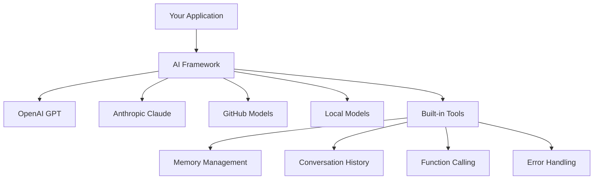
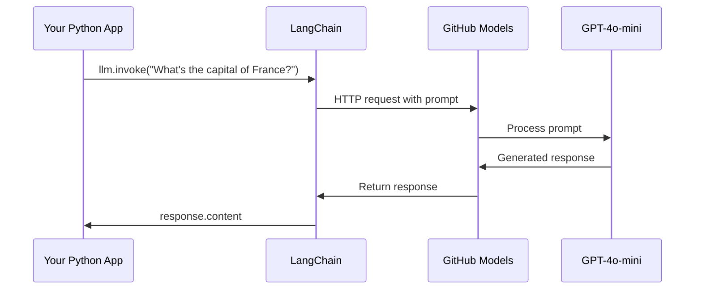
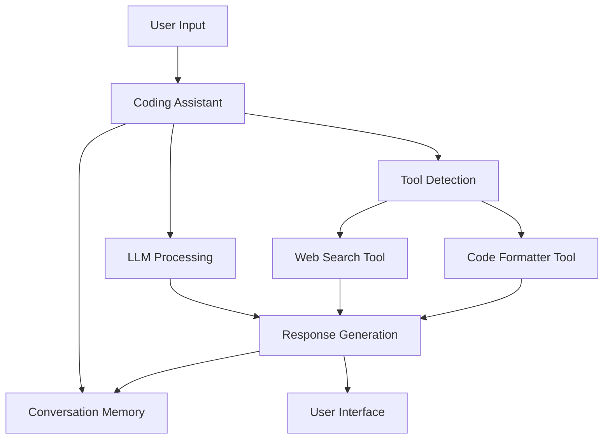
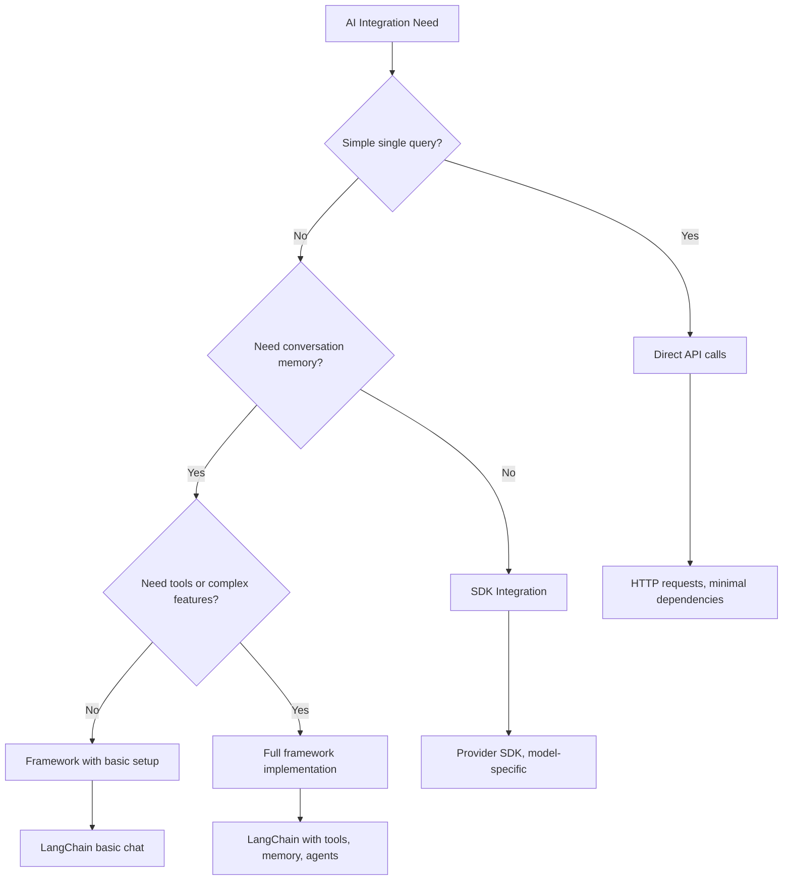

<!--
CO_OP_TRANSLATOR_METADATA:
{
  "original_hash": "e2c4ae5688e34b4b8b09d52aec56c79e",
  "translation_date": "2025-10-22T23:26:22+00:00",
  "source_file": "10-ai-framework-project/README.md",
  "language_code": "it"
}
-->
# Framework AI

Ti sei mai sentito sopraffatto cercando di costruire applicazioni AI da zero? Non sei il solo! I framework AI sono come un coltellino svizzero per lo sviluppo di intelligenza artificiale: strumenti potenti che possono farti risparmiare tempo e mal di testa quando costruisci applicazioni intelligenti. Pensa a un framework AI come a una libreria ben organizzata: fornisce componenti predefiniti, API standardizzate e astrazioni intelligenti, così puoi concentrarti sulla risoluzione dei problemi invece di lottare con i dettagli dell'implementazione.

In questa lezione, esploreremo come framework come LangChain possono trasformare compiti complessi di integrazione AI in codice pulito e leggibile. Scoprirai come affrontare sfide del mondo reale come tenere traccia delle conversazioni, implementare chiamate a strumenti e gestire diversi modelli AI attraverso un'unica interfaccia unificata.

Alla fine, saprai quando utilizzare i framework invece delle chiamate API dirette, come sfruttare efficacemente le loro astrazioni e come costruire applicazioni AI pronte per l'uso nel mondo reale. Esploriamo cosa possono fare i framework AI per i tuoi progetti.

## Perché scegliere un framework?

Sei pronto a costruire un'app AI - fantastico! Ma ecco il punto: hai diverse strade che puoi percorrere, e ognuna ha i suoi pro e contro. È un po' come scegliere tra camminare, andare in bicicletta o guidare per arrivare da qualche parte: tutti ti porteranno a destinazione, ma l'esperienza (e lo sforzo) sarà completamente diversa.

Analizziamo i tre principali modi in cui puoi integrare l'AI nei tuoi progetti:

| Approccio | Vantaggi | Ideale per | Considerazioni |
|-----------|----------|------------|----------------|
| **Richieste HTTP dirette** | Controllo totale, nessuna dipendenza | Query semplici, apprendimento dei fondamenti | Codice più verboso, gestione manuale degli errori |
| **Integrazione SDK** | Meno boilerplate, ottimizzazione specifica per il modello | Applicazioni con un solo modello | Limitato a fornitori specifici |
| **Framework AI** | API unificata, astrazioni integrate | App multi-modello, flussi di lavoro complessi | Curva di apprendimento, potenziale sovra-astrazione |

### Vantaggi pratici dei framework



**Perché i framework sono importanti:**
- **Unificano** più fornitori di AI sotto un'unica interfaccia
- **Gestiscono** automaticamente la memoria delle conversazioni
- **Forniscono** strumenti predefiniti per compiti comuni come embeddings e chiamate a funzioni
- **Gestiscono** la gestione degli errori e la logica di ripetizione
- **Trasformano** flussi di lavoro complessi in chiamate di metodo leggibili

> 💡 **Suggerimento Pro**: Usa i framework quando devi passare da un modello AI all'altro o costruire funzionalità complesse come agenti, memoria o chiamate a strumenti. Usa le API dirette quando stai imparando le basi o costruendo applicazioni semplici e mirate.

**In sintesi**: Come scegliere tra gli strumenti specializzati di un artigiano e un laboratorio completo, si tratta di abbinare lo strumento al compito. I framework eccellono per applicazioni complesse e ricche di funzionalità, mentre le API dirette funzionano bene per casi d'uso semplici.

## Introduzione

In questa lezione, impareremo a:

- Usare un framework AI comune.
- Affrontare problemi comuni come conversazioni, utilizzo di strumenti, memoria e contesto.
- Sfruttare tutto questo per costruire app AI.

## Il tuo primo prompt AI

Iniziamo con le basi creando la tua prima applicazione AI che invia una domanda e riceve una risposta. Come Archimede che scopre il principio di Archimede nella sua vasca da bagno, a volte le osservazioni più semplici portano alle intuizioni più potenti - e i framework rendono queste intuizioni accessibili.

### Configurare LangChain con i modelli GitHub

Utilizzeremo LangChain per connetterci ai modelli GitHub, il che è fantastico perché ti dà accesso gratuito a vari modelli AI. La parte migliore? Ti servono solo pochi semplici parametri di configurazione per iniziare:

```python
from langchain_openai import ChatOpenAI
import os

llm = ChatOpenAI(
    api_key=os.environ["GITHUB_TOKEN"],
    base_url="https://models.github.ai/inference",
    model="openai/gpt-4o-mini",
)

# Send a simple prompt
response = llm.invoke("What's the capital of France?")
print(response.content)
```

**Ecco cosa sta succedendo qui:**
- **Crea** un client LangChain utilizzando la classe `ChatOpenAI` - questa è la tua porta d'accesso all'AI!
- **Configura** la connessione ai modelli GitHub con il tuo token di autenticazione
- **Specifica** quale modello AI utilizzare (`gpt-4o-mini`) - pensalo come scegliere il tuo assistente AI
- **Invia** la tua domanda utilizzando il metodo `invoke()` - qui avviene la magia
- **Estrae** e visualizza la risposta - ed ecco fatto, stai chattando con l'AI!

> 🔧 **Nota di configurazione**: Se stai usando GitHub Codespaces, sei fortunato - il `GITHUB_TOKEN` è già configurato per te! Lavori in locale? Nessun problema, dovrai solo creare un token di accesso personale con le autorizzazioni corrette.

**Output previsto:**
```text
The capital of France is Paris.
```



## Creare un'AI conversazionale

Il primo esempio dimostra le basi, ma è solo uno scambio singolo: fai una domanda, ottieni una risposta, e basta. Nelle applicazioni reali, vuoi che la tua AI ricordi ciò di cui hai parlato, proprio come Watson e Holmes costruivano le loro conversazioni investigative nel tempo.

Qui LangChain diventa particolarmente utile. Fornisce diversi tipi di messaggi che aiutano a strutturare le conversazioni e ti permettono di dare alla tua AI una personalità. Costruirai esperienze di chat che mantengono il contesto e il carattere.

### Comprendere i tipi di messaggi

Pensa a questi tipi di messaggi come a diversi "ruoli" che i partecipanti indossano in una conversazione. LangChain utilizza diverse classi di messaggi per tenere traccia di chi dice cosa:

| Tipo di Messaggio | Scopo | Esempio d'Uso |
|--------------------|-------|---------------|
| `SystemMessage` | Definisce la personalità e il comportamento dell'AI | "Sei un assistente di codifica utile" |
| `HumanMessage` | Rappresenta l'input dell'utente | "Spiega come funzionano le funzioni" |
| `AIMessage` | Memorizza le risposte dell'AI | Risposte precedenti dell'AI nella conversazione |

### Creare la tua prima conversazione

Creiamo una conversazione in cui la nostra AI assume un ruolo specifico. La faremo impersonare il Capitano Picard - un personaggio noto per la sua saggezza diplomatica e leadership:

```python
messages = [
    SystemMessage(content="You are Captain Picard of the Starship Enterprise"),
    HumanMessage(content="Tell me about you"),
]
```

**Analisi di questa configurazione della conversazione:**
- **Stabilisce** il ruolo e la personalità dell'AI tramite `SystemMessage`
- **Fornisce** la domanda iniziale dell'utente tramite `HumanMessage`
- **Crea** una base per una conversazione a più turni

Il codice completo per questo esempio è il seguente:

```python
from langchain_core.messages import HumanMessage, SystemMessage
from langchain_openai import ChatOpenAI
import os

llm = ChatOpenAI(
    api_key=os.environ["GITHUB_TOKEN"],
    base_url="https://models.github.ai/inference",
    model="openai/gpt-4o-mini",
)

messages = [
    SystemMessage(content="You are Captain Picard of the Starship Enterprise"),
    HumanMessage(content="Tell me about you"),
]


# works
response  = llm.invoke(messages)
print(response.content)
```

Dovresti vedere un risultato simile a:

```text
I am Captain Jean-Luc Picard, the commanding officer of the USS Enterprise (NCC-1701-D), a starship in the United Federation of Planets. My primary mission is to explore new worlds, seek out new life and new civilizations, and boldly go where no one has gone before. 

I believe in the importance of diplomacy, reason, and the pursuit of knowledge. My crew is diverse and skilled, and we often face challenges that test our resolve, ethics, and ingenuity. Throughout my career, I have encountered numerous species, grappled with complex moral dilemmas, and have consistently sought peaceful solutions to conflicts.

I hold the ideals of the Federation close to my heart, believing in the importance of cooperation, understanding, and respect for all sentient beings. My experiences have shaped my leadership style, and I strive to be a thoughtful and just captain. How may I assist you further?
```

Per mantenere la continuità della conversazione (invece di reimpostare il contesto ogni volta), devi continuare ad aggiungere risposte alla tua lista di messaggi. Come le tradizioni orali che hanno preservato storie attraverso le generazioni, questo approccio costruisce una memoria duratura:

```python
from langchain_core.messages import HumanMessage, SystemMessage
from langchain_openai import ChatOpenAI
import os

llm = ChatOpenAI(
    api_key=os.environ["GITHUB_TOKEN"],
    base_url="https://models.github.ai/inference",
    model="openai/gpt-4o-mini",
)

messages = [
    SystemMessage(content="You are Captain Picard of the Starship Enterprise"),
    HumanMessage(content="Tell me about you"),
]


# works
response  = llm.invoke(messages)

print(response.content)

print("---- Next ----")

messages.append(response)
messages.append(HumanMessage(content="Now that I know about you, I'm Chris, can I be in your crew?"))

response  = llm.invoke(messages)

print(response.content)

```

Abbastanza interessante, vero? Quello che sta succedendo qui è che stiamo chiamando il LLM due volte - prima con solo i nostri primi due messaggi, ma poi di nuovo con l'intera cronologia della conversazione. È come se l'AI stesse effettivamente seguendo la nostra chat!

Quando esegui questo codice, otterrai una seconda risposta che suona più o meno così:

```text
Welcome aboard, Chris! It's always a pleasure to meet those who share a passion for exploration and discovery. While I cannot formally offer you a position on the Enterprise right now, I encourage you to pursue your aspirations. We are always in need of talented individuals with diverse skills and backgrounds. 

If you are interested in space exploration, consider education and training in the sciences, engineering, or diplomacy. The values of curiosity, resilience, and teamwork are crucial in Starfleet. Should you ever find yourself on a starship, remember to uphold the principles of the Federation: peace, understanding, and respect for all beings. Your journey can lead you to remarkable adventures, whether in the stars or on the ground. Engage!
```

Lo prendo come un forse ;)

## Risposte in streaming

Hai mai notato come ChatGPT sembri "digitare" le sue risposte in tempo reale? Questo è lo streaming in azione. Come guardare un abile calligrafo al lavoro - vedere i caratteri apparire tratto dopo tratto piuttosto che materializzarsi istantaneamente - lo streaming rende l'interazione più naturale e fornisce un feedback immediato.

### Implementare lo streaming con LangChain

```python
from langchain_openai import ChatOpenAI
import os

llm = ChatOpenAI(
    api_key=os.environ["GITHUB_TOKEN"],
    base_url="https://models.github.ai/inference",
    model="openai/gpt-4o-mini",
    streaming=True
)

# Stream the response
for chunk in llm.stream("Write a short story about a robot learning to code"):
    print(chunk.content, end="", flush=True)
```

**Perché lo streaming è fantastico:**
- **Mostra** il contenuto mentre viene creato - niente più attese imbarazzanti!
- **Fa sentire** agli utenti che qualcosa sta effettivamente accadendo
- **Sembra** più veloce, anche quando tecnicamente non lo è
- **Permette** agli utenti di iniziare a leggere mentre l'AI sta ancora "pensando"

> 💡 **Suggerimento per l'Esperienza Utente**: Lo streaming brilla davvero quando si tratta di risposte più lunghe come spiegazioni di codice, scrittura creativa o tutorial dettagliati. I tuoi utenti adoreranno vedere i progressi invece di fissare uno schermo vuoto!

## Template per i prompt

I template per i prompt funzionano come le strutture retoriche utilizzate nell'oratoria classica - pensa a come Cicerone adattava i suoi schemi di discorso per diversi pubblici mantenendo la stessa struttura persuasiva. Ti permettono di creare prompt riutilizzabili in cui puoi sostituire diverse informazioni senza riscrivere tutto da capo. Una volta impostato il template, basta riempire le variabili con i valori necessari.

### Creare template riutilizzabili

```python
from langchain_core.prompts import ChatPromptTemplate

# Define a template for code explanations
template = ChatPromptTemplate.from_messages([
    ("system", "You are an expert programming instructor. Explain concepts clearly with examples."),
    ("human", "Explain {concept} in {language} with a practical example for {skill_level} developers")
])

# Use the template with different values
questions = [
    {"concept": "functions", "language": "JavaScript", "skill_level": "beginner"},
    {"concept": "classes", "language": "Python", "skill_level": "intermediate"},
    {"concept": "async/await", "language": "JavaScript", "skill_level": "advanced"}
]

for question in questions:
    prompt = template.format_messages(**question)
    response = llm.invoke(prompt)
    print(f"Topic: {question['concept']}\n{response.content}\n---\n")
```

**Perché amerai usare i template:**
- **Mantiene** i tuoi prompt coerenti in tutta l'app
- **Niente più** concatenazioni di stringhe disordinate - solo variabili pulite e semplici
- **Il tuo AI** si comporta in modo prevedibile perché la struttura rimane la stessa
- **Gli aggiornamenti** sono semplici - cambia il template una volta e sarà aggiornato ovunque

## Output strutturato

Ti sei mai sentito frustrato cercando di interpretare risposte AI che tornano come testo non strutturato? L'output strutturato è come insegnare alla tua AI a seguire un approccio sistematico, organizzato, prevedibile e facile da gestire. Puoi richiedere JSON, strutture di dati specifiche o qualsiasi formato di cui hai bisogno.

### Definire schemi di output

```python
from langchain_core.prompts import ChatPromptTemplate
from langchain_core.output_parsers import JsonOutputParser
from pydantic import BaseModel, Field

class CodeReview(BaseModel):
    score: int = Field(description="Code quality score from 1-10")
    strengths: list[str] = Field(description="List of code strengths")
    improvements: list[str] = Field(description="List of suggested improvements")
    overall_feedback: str = Field(description="Summary feedback")

# Set up the parser
parser = JsonOutputParser(pydantic_object=CodeReview)

# Create prompt with format instructions
prompt = ChatPromptTemplate.from_messages([
    ("system", "You are a code reviewer. {format_instructions}"),
    ("human", "Review this code: {code}")
])

# Format the prompt with instructions
chain = prompt | llm | parser

# Get structured response
code_sample = """
def calculate_average(numbers):
    return sum(numbers) / len(numbers)
"""

result = chain.invoke({
    "code": code_sample,
    "format_instructions": parser.get_format_instructions()
})

print(f"Score: {result['score']}")
print(f"Strengths: {', '.join(result['strengths'])}")
```

**Perché l'output strutturato è rivoluzionario:**
- **Niente più** dubbi sul formato che riceverai - è sempre coerente
- **Si integra** direttamente nei tuoi database e API senza lavoro extra
- **Individua** risposte strane dell'AI prima che rompano la tua app
- **Rende** il tuo codice più pulito perché sai esattamente con cosa stai lavorando

## Chiamata agli strumenti

Ora arriviamo a una delle funzionalità più potenti: gli strumenti. Questo è il modo in cui dai alla tua AI capacità pratiche oltre la conversazione. Come le corporazioni medievali sviluppavano strumenti specializzati per mestieri specifici, puoi dotare la tua AI di strumenti mirati. Descrivi quali strumenti sono disponibili e, quando qualcuno richiede qualcosa di corrispondente, la tua AI può agire.

### Usare Python

Aggiungiamo alcuni strumenti in questo modo:

```python
from typing_extensions import Annotated, TypedDict

class add(TypedDict):
    """Add two integers."""

    # Annotations must have the type and can optionally include a default value and description (in that order).
    a: Annotated[int, ..., "First integer"]
    b: Annotated[int, ..., "Second integer"]

tools = [add]

functions = {
    "add": lambda a, b: a + b
}
```

Cosa sta succedendo qui? Stiamo creando un progetto per uno strumento chiamato `add`. Ereditando da `TypedDict` e utilizzando quei tipi eleganti `Annotated` per `a` e `b`, stiamo dando al LLM un quadro chiaro di cosa fa questo strumento e di cosa ha bisogno. Il dizionario `functions` è come la nostra cassetta degli attrezzi - dice al nostro codice esattamente cosa fare quando l'AI decide di usare uno strumento specifico.

Vediamo come chiamiamo il LLM con questo strumento:

```python
llm = ChatOpenAI(
    api_key=os.environ["GITHUB_TOKEN"],
    base_url="https://models.github.ai/inference",
    model="openai/gpt-4o-mini",
)

llm_with_tools = llm.bind_tools(tools)
```

Qui chiamiamo `bind_tools` con il nostro array `tools` e in questo modo il LLM `llm_with_tools` ora ha conoscenza di questo strumento.

Per utilizzare questo nuovo LLM, possiamo digitare il seguente codice:

```python
query = "What is 3 + 12?"

res = llm_with_tools.invoke(query)
if(res.tool_calls):
    for tool in res.tool_calls:
        print("TOOL CALL: ", functions[tool["name"]](../../../10-ai-framework-project/**tool["args"]))
print("CONTENT: ",res.content)
```

Ora, quando chiamiamo `invoke` su questo nuovo LLM, che ha strumenti, potremmo vedere la proprietà `tool_calls` popolata. Se sì, qualsiasi strumento identificato avrà una proprietà `name` e `args` che identifica quale strumento dovrebbe essere chiamato e con quali argomenti. Il codice completo è il seguente:

```python
from langchain_core.messages import HumanMessage, SystemMessage
from langchain_openai import ChatOpenAI
import os
from typing_extensions import Annotated, TypedDict

class add(TypedDict):
    """Add two integers."""

    # Annotations must have the type and can optionally include a default value and description (in that order).
    a: Annotated[int, ..., "First integer"]
    b: Annotated[int, ..., "Second integer"]

tools = [add]

functions = {
    "add": lambda a, b: a + b
}

llm = ChatOpenAI(
    api_key=os.environ["GITHUB_TOKEN"],
    base_url="https://models.github.ai/inference",
    model="openai/gpt-4o-mini",
)

llm_with_tools = llm.bind_tools(tools)

query = "What is 3 + 12?"

res = llm_with_tools.invoke(query)
if(res.tool_calls):
    for tool in res.tool_calls:
        print("TOOL CALL: ", functions[tool["name"]](../../../10-ai-framework-project/**tool["args"]))
print("CONTENT: ",res.content)
```

Eseguendo questo codice, dovresti vedere un output simile a:

```text
TOOL CALL:  15
CONTENT: 
```

L'AI ha esaminato "Quanto fa 3 + 12" e lo ha riconosciuto come un compito per lo strumento `add`. Come un abile bibliotecario sa quale riferimento consultare in base al tipo di domanda posta, ha fatto questa determinazione dal nome dello strumento, dalla descrizione e dalle specifiche dei campi. Il risultato di 15 proviene dal nostro dizionario `functions` che esegue lo strumento:

```python
print("TOOL CALL: ", functions[tool["name"]](../../../10-ai-framework-project/**tool["args"]))
```

### Uno strumento più interessante che chiama un'API web

Sommare numeri dimostra il concetto, ma gli strumenti reali eseguono tipicamente operazioni più complesse, come chiamare API web. Estendiamo il nostro esempio per far sì che l'AI recuperi contenuti da internet - simile a come gli operatori telegrafici una volta collegavano località distanti:

```python
class joke(TypedDict):
    """Tell a joke."""

    # Annotations must have the type and can optionally include a default value and description (in that order).
    category: Annotated[str, ..., "The joke category"]

def get_joke(category: str) -> str:
    response = requests.get(f"https://api.chucknorris.io/jokes/random?category={category}", headers={"Accept": "application/json"})
    if response.status_code == 200:
        return response.json().get("value", f"Here's a {category} joke!")
    return f"Here's a {category} joke!"

functions = {
    "add": lambda a, b: a + b,
    "joke": lambda category: get_joke(category)
}

query = "Tell me a joke about animals"

# the rest of the code is the same
```

Ora, se esegui questo codice, otterrai una risposta simile a:

```text
TOOL CALL:  Chuck Norris once rode a nine foot grizzly bear through an automatic car wash, instead of taking a shower.
CONTENT:  
```

Ecco il codice nella sua interezza:

```python
from langchain_openai import ChatOpenAI
import requests
import os
from typing_extensions import Annotated, TypedDict

class add(TypedDict):
    """Add two integers."""

    # Annotations must have the type and can optionally include a default value and description (in that order).
    a: Annotated[int, ..., "First integer"]
    b: Annotated[int, ..., "Second integer"]

class joke(TypedDict):
    """Tell a joke."""

    # Annotations must have the type and can optionally include a default value and description (in that order).
    category: Annotated[str, ..., "The joke category"]

tools = [add, joke]

def get_joke(category: str) -> str:
    response = requests.get(f"https://api.chucknorris.io/jokes/random?category={category}", headers={"Accept": "application/json"})
    if response.status_code == 200:
        return response.json().get("value", f"Here's a {category} joke!")
    return f"Here's a {category} joke!"

functions = {
    "add": lambda a, b: a + b,
    "joke": lambda category: get_joke(category)
}

llm = ChatOpenAI(
    api_key=os.environ["GITHUB_TOKEN"],
    base_url="https://models.github.ai/inference",
    model="openai/gpt-4o-mini",
)

llm_with_tools = llm.bind_tools(tools)

query = "Tell me a joke about animals"

res = llm_with_tools.invoke(query)
if(res.tool_calls):
    for tool in res.tool_calls:
        # print("TOOL CALL: ", tool)
        print("TOOL CALL: ", functions[tool["name"]](../../../10-ai-framework-project/**tool["args"]))
print("CONTENT: ",res.content)
```

## Embedding e elaborazione dei documenti

Gli embedding rappresentano una delle soluzioni più eleganti nell'AI moderna. Immagina di poter prendere qualsiasi pezzo di testo e convertirlo in coordinate numeriche che catturano il suo significato. È esattamente ciò che fanno gli embedding: trasformano il testo in punti in uno spazio multidimensionale dove i concetti simili si raggruppano insieme. È come avere un sistema di coordinate per le idee, simile a come Mendeleev organizzò la tavola periodica in base alle proprietà atomiche.

### Creare e utilizzare gli embedding

```python
from langchain_openai import OpenAIEmbeddings
from langchain_community.vectorstores import FAISS
from langchain_community.document_loaders import TextLoader
from langchain.text_splitter import CharacterTextSplitter

# Initialize embeddings
embeddings = OpenAIEmbeddings(
    api_key=os.environ["GITHUB_TOKEN"],
    base_url="https://models.github.ai/inference",
    model="text-embedding-3-small"
)

# Load and split documents
loader = TextLoader("documentation.txt")
documents = loader.load()

text_splitter = CharacterTextSplitter(chunk_size=1000, chunk_overlap=0)
texts = text_splitter.split_documents(documents)

# Create vector store
vectorstore = FAISS.from_documents(texts, embeddings)

# Perform similarity search
query = "How do I handle user authentication?"
similar_docs = vectorstore.similarity_search(query, k=3)

for doc in similar_docs:
    print(f"Relevant content: {doc.page_content[:200]}...")
```

### Caricamento di documenti in vari formati

```python
from langchain_community.document_loaders import (
    PyPDFLoader,
    CSVLoader,
    JSONLoader,
    WebBaseLoader
)

# Load different document types
pdf_loader = PyPDFLoader("manual.pdf")
csv_loader = CSVLoader("data.csv")
json_loader = JSONLoader("config.json")
web_loader = WebBaseLoader("https://example.com/docs")

# Process all documents
all_documents = []
for loader in [pdf_loader, csv_loader, json_loader, web_loader]:
    docs = loader.load()
    all_documents.extend(docs)
```

**Cosa puoi fare con gli embedding:**
- **Costruire** ricerche che capiscono davvero cosa intendi, non solo il matching delle parole chiave
- **Creare** AI che possono rispondere a domande sui tuoi documenti
- **Realizzare** sistemi di raccomandazione che suggeriscono contenuti davvero rilevanti
- **Organizzare e categorizzare automaticamente** i tuoi contenuti

## Costruire un'applicazione AI completa

Ora integreremo tutto ciò che hai imparato in un'applicazione completa: un assistente di codifica che può rispondere a domande, usare strumenti e mantenere la memoria delle conversazioni. Come la stampa che ha combinato tecnologie esistenti (caratteri mobili, inchiostro, carta e pressione) in qualcosa di trasformativo, combineremo i nostri componenti AI in qualcosa di pratico e utile.

### Esempio di applicazione completa

```python
from langchain_openai import ChatOpenAI, OpenAIEmbeddings
from langchain_core.prompts import ChatPromptTemplate
from langchain_core.messages import HumanMessage, SystemMessage, AIMessage
from langchain_community.vectorstores import FAISS
from typing_extensions import Annotated, TypedDict
import os
import requests

class CodingAssistant:
    def __init__(self):
        self.llm = ChatOpenAI(
            api_key=os.environ["GITHUB_TOKEN"],
            base_url="https://models.github.ai/inference",
            model="openai/gpt-4o-mini"
        )
        
        self.conversation_history = [
            SystemMessage(content="""You are an expert coding assistant. 
            Help users learn programming concepts, debug code, and write better software.
            Use tools when needed and maintain a helpful, encouraging tone.""")
        ]
        
        # Define tools
        self.setup_tools()
    
    def setup_tools(self):
        class web_search(TypedDict):
            """Search for programming documentation or examples."""
            query: Annotated[str, "Search query for programming help"]
        
        class code_formatter(TypedDict):
            """Format and validate code snippets."""
            code: Annotated[str, "Code to format"]
            language: Annotated[str, "Programming language"]
        
        self.tools = [web_search, code_formatter]
        self.llm_with_tools = self.llm.bind_tools(self.tools)
    
    def chat(self, user_input: str):
        # Add user message to conversation
        self.conversation_history.append(HumanMessage(content=user_input))
        
        # Get AI response
        response = self.llm_with_tools.invoke(self.conversation_history)
        
        # Handle tool calls if any
        if response.tool_calls:
            for tool_call in response.tool_calls:
                tool_result = self.execute_tool(tool_call)
                print(f"🔧 Tool used: {tool_call['name']}")
                print(f"📊 Result: {tool_result}")
        
        # Add AI response to conversation
        self.conversation_history.append(response)
        
        return response.content
    
    def execute_tool(self, tool_call):
        tool_name = tool_call['name']
        args = tool_call['args']
        
        if tool_name == 'web_search':
            return f"Found documentation for: {args['query']}"
        elif tool_name == 'code_formatter':
            return f"Formatted {args['language']} code: {args['code'][:50]}..."
        
        return "Tool execution completed"

# Usage example
assistant = CodingAssistant()

print("🤖 Coding Assistant Ready! Type 'quit' to exit.\n")

while True:
    user_input = input("You: ")
    if user_input.lower() == 'quit':
        break
    
    response = assistant.chat(user_input)
    print(f"🤖 Assistant: {response}\n")
```

**Architettura dell'applicazione:**



**Caratteristiche principali che abbiamo implementato:**
- **Ricorda** l'intera conversazione per mantenere la continuità del contesto
- **Esegue azioni** tramite chiamate a strumenti, non solo conversazioni
- **Segue** schemi di interazione prevedibili
- **Gestisce** automaticamente la gestione degli errori e flussi di lavoro complessi

## Compito: Costruisci il tuo assistente di studio alimentato da AI

**Obiettivo**: Crea un'applicazione AI che aiuti gli studenti a imparare concetti di programmazione fornendo spiegazioni, esempi di codice e quiz interattivi.

### Requisiti

**Funzionalità principali (Obbligatorie):**
1. **Interfaccia Conversazionale**: Implementa un sistema di chat che mantenga il contesto tra più domande
2. **Strumenti Educativi**: Crea almeno due strumenti che aiutino nell'apprendimento:
   - Strumento di spiegazione del codice
   - Generatore di quiz sui concetti
3. **Apprendimento personalizzato**: Utilizza messaggi di sistema per adattare le risposte a diversi livelli di competenza
4. **Formattazione delle risposte**: Implementa output strutturati per domande di quiz

### Passaggi di implementazione

**Passaggio 1: Configura il tuo ambiente**
```bash
pip install langchain langchain-openai
```

**Passaggio 2: Funzionalità di chat di base**
- Crea una classe `StudyAssistant`
- Implementa la memoria della conversazione
- Aggiungi una configurazione di personalità per il supporto educativo

**Passaggio 3: Aggiungi strumenti educativi**
- **Spiegatore di codice**: Suddivide il codice in parti comprensibili
- **Generatore di quiz**: Crea domande sui concetti di programmazione
- **Tracker di progresso**: Tiene traccia degli argomenti trattati

**Passaggio 4: Funzionalità avanzate (Opzionale)**
- Implementa risposte in streaming per migliorare l'esperienza utente
- Aggiungi il caricamento di documenti per incorporare materiali del corso
- Crea embeddings per il recupero di contenuti basato sulla somiglianza

### Criteri di valutazione

| Funzionalità | Eccellente (4) | Buono (3) | Soddisfacente (2) | Da migliorare (1) |
|--------------|----------------|-----------|-------------------|-------------------|
| **Flusso della conversazione** | Risposte naturali e consapevoli del contesto | Buona conservazione del contesto | Conversazione di base | Nessuna memoria tra gli scambi |
| **Integrazione degli strumenti** | Molti strumenti utili che funzionano senza problemi | 2+ strumenti implementati correttamente | 1-2 strumenti di base | Strumenti non funzionanti |
| **Qualità del codice** | Pulito, ben documentato, gestione degli errori | Buona struttura, qualche documentazione | Funzionalità di base funzionante | Struttura scadente, nessuna gestione degli errori |
| **Valore educativo** | Veramente utile per l'apprendimento, adattivo | Buon supporto all'apprendimento | Spiegazioni di base | Beneficio educativo limitato |

### Struttura del codice di esempio

```python
class StudyAssistant:
    def __init__(self, skill_level="beginner"):
        # Initialize LLM, tools, and conversation memory
        pass
    
    def explain_code(self, code, language):
        # Tool: Explain how code works
        pass
    
    def generate_quiz(self, topic, difficulty):
        # Tool: Create practice questions
        pass
    
    def chat(self, user_input):
        # Main conversation interface
        pass

# Example usage
assistant = StudyAssistant(skill_level="intermediate")
response = assistant.chat("Explain how Python functions work")
```

**Sfide bonus:**
- Aggiungi input/output vocale
- Implementa un'interfaccia web utilizzando Streamlit o Flask
- Crea una base di conoscenza dai materiali del corso utilizzando embeddings
- Aggiungi tracciamento del progresso e percorsi di apprendimento personalizzati

## Riepilogo

🎉 Ora hai padroneggiato i fondamenti dello sviluppo di framework AI e hai imparato a costruire applicazioni AI sofisticate utilizzando LangChain. Come completare un apprendistato completo, hai acquisito un ampio set di competenze. Rivediamo ciò che hai realizzato.

### Cosa hai imparato

**Concetti fondamentali del framework:**
- **Vantaggi del framework**: Comprendere quando scegliere i framework rispetto alle chiamate API dirette
- **Basi di LangChain**: Configurare e configurare connessioni ai modelli AI
- **Tipi di messaggi**: Utilizzare `SystemMessage`, `HumanMessage` e `AIMessage` per conversazioni strutturate

**Funzionalità avanzate:**
- **Chiamata agli strumenti**: Creare e integrare strumenti personalizzati per migliorare le capacità AI
- **Memoria della conversazione**: Mantenere il contesto attraverso più turni di conversazione
- **Risposte in streaming**: Implementare la consegna delle risposte in tempo reale
- **Template di prompt**: Costruire prompt riutilizzabili e dinamici
- **Output strutturato**: Garantire risposte AI coerenti e analizzabili
- **Embeddings**: Creare capacità di ricerca semantica e elaborazione di documenti

**Applicazioni pratiche:**
- **Costruire app complete**: Combinare più funzionalità in applicazioni pronte per la produzione
- **Gestione degli errori**: Implementare una gestione degli errori robusta e una validazione
- **Integrazione degli strumenti**: Creare strumenti personalizzati che estendono le capacità AI

### Punti chiave

> 🎯 **Ricorda**: I framework AI come LangChain sono fondamentalmente i tuoi migliori amici ricchi di funzionalità che nascondono la complessità. Sono perfetti quando hai bisogno di memoria della conversazione, chiamata agli strumenti o vuoi lavorare con più modelli AI senza perdere la testa.

**Framework decisionale per l'integrazione AI:**



### Dove andare da qui?

**Inizia a costruire subito:**
- Prendi questi concetti e costruisci qualcosa che ti entusiasmi!
- Sperimenta con diversi modelli AI tramite LangChain - è come avere un parco giochi di modelli AI
- Crea strumenti che risolvano problemi reali che affronti nel tuo lavoro o nei tuoi progetti

**Pronto per il livello successivo?**
- **Agenti AI**: Costruisci sistemi AI che possono pianificare ed eseguire compiti complessi autonomamente
- **RAG (Generazione Augmentata dal Recupero)**: Combina AI con le tue basi di conoscenza per applicazioni superpotenti
- **AI Multi-Modale**: Lavora con testo, immagini e audio insieme - le possibilità sono infinite!
- **Distribuzione in produzione**: Impara come scalare le tue app AI e monitorarle nel mondo reale

**Unisciti alla comunità:**
- La comunità LangChain è fantastica per rimanere aggiornati e imparare le migliori pratiche
- GitHub Models ti dà accesso a capacità AI all'avanguardia - perfetto per sperimentare
- Continua a praticare con diversi casi d'uso - ogni progetto ti insegnerà qualcosa di nuovo

Ora hai le conoscenze per costruire applicazioni conversazionali intelligenti che possono aiutare le persone a risolvere problemi reali. Come gli artigiani del Rinascimento che combinavano visione artistica con abilità tecnica, ora puoi unire le capacità AI con l'applicazione pratica. La domanda è: cosa creerai? 🚀

## Sfida GitHub Copilot Agent 🚀

Utilizza la modalità Agent per completare la seguente sfida:

**Descrizione:** Costruisci un assistente avanzato per la revisione del codice alimentato da AI che combina molteplici funzionalità di LangChain, inclusi chiamata agli strumenti, output strutturato e memoria della conversazione per fornire feedback completo sulle submission di codice.

**Prompt:** Crea una classe CodeReviewAssistant che implementi:
1. Uno strumento per analizzare la complessità del codice e suggerire miglioramenti
2. Uno strumento per verificare il codice rispetto alle migliori pratiche
3. Output strutturato utilizzando modelli Pydantic per un formato di revisione coerente
4. Memoria della conversazione per tracciare le sessioni di revisione
5. Un'interfaccia principale di chat che possa gestire submission di codice e fornire feedback dettagliato e attuabile

L'assistente dovrebbe essere in grado di revisionare codice in più linguaggi di programmazione, mantenere il contesto tra più submission di codice in una sessione e fornire sia punteggi riassuntivi che suggerimenti dettagliati per miglioramenti.

Scopri di più sulla [modalità agent](https://code.visualstudio.com/blogs/2025/02/24/introducing-copilot-agent-mode) qui.

---

**Disclaimer**:  
Questo documento è stato tradotto utilizzando il servizio di traduzione AI [Co-op Translator](https://github.com/Azure/co-op-translator). Sebbene ci impegniamo per garantire l'accuratezza, si prega di notare che le traduzioni automatiche possono contenere errori o imprecisioni. Il documento originale nella sua lingua nativa dovrebbe essere considerato la fonte autorevole. Per informazioni critiche, si raccomanda una traduzione professionale umana. Non siamo responsabili per eventuali incomprensioni o interpretazioni errate derivanti dall'uso di questa traduzione.