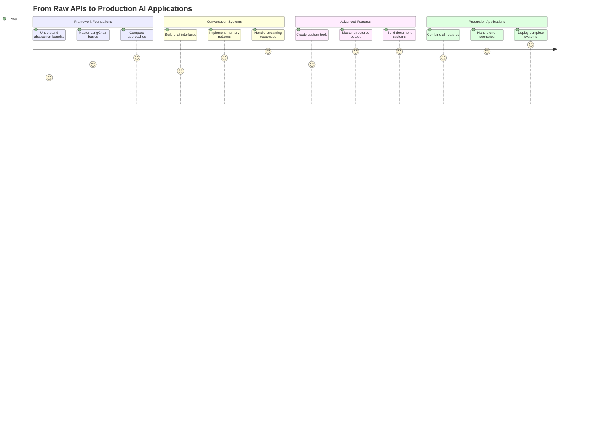
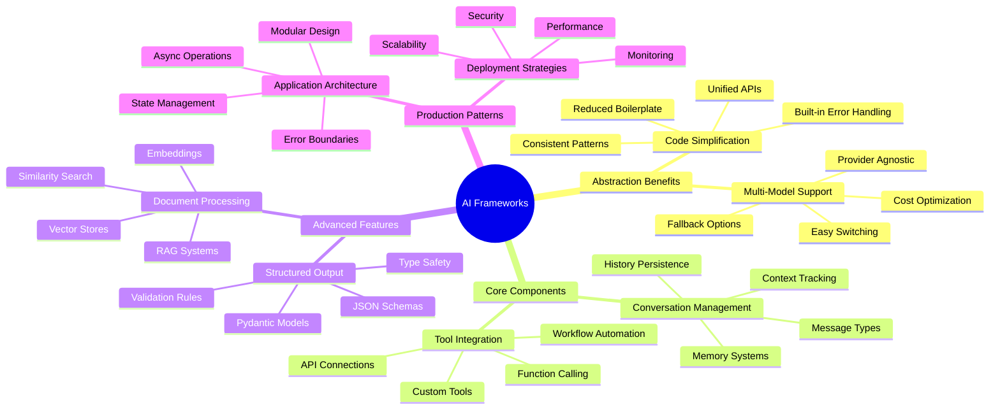
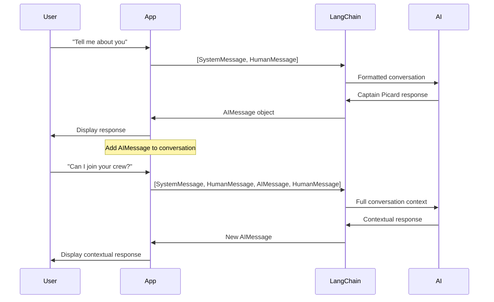
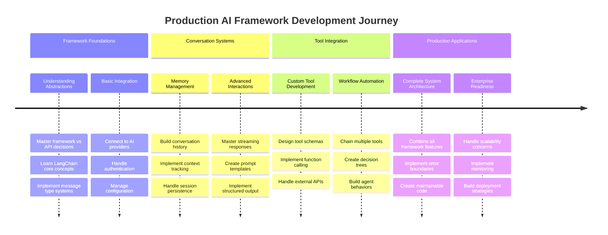

# Framework AI

Ti sei mai sentito sopraffatto nel tentativo di costruire applicazioni AI da zero? Non sei il solo! I framework AI sono come un coltellino svizzero per lo sviluppo di applicazioni intelligenti: strumenti potenti che ti fanno risparmiare tempo e mal di testa. Pensa a un framework AI come a una libreria ben organizzata: offre componenti pre-costruiti, API standardizzate e astrazioni intelligenti, permettendoti di concentrarti sulla risoluzione dei problemi invece di lottare con i dettagli di implementazione.

In questa lezione, esploreremo come framework come LangChain possano trasformare compiti complessi di integrazione AI in codice pulito e leggibile. Scoprirai come affrontare sfide reali come tenere traccia delle conversazioni, implementare chiamate a strumenti e gestire diversi modelli AI attraverso un'unica interfaccia unificata.

Alla fine della lezione, saprai quando utilizzare i framework invece delle chiamate API dirette, come sfruttare efficacemente le loro astrazioni e come costruire applicazioni AI pronte per l'uso nel mondo reale. Esploriamo insieme cosa possono fare i framework AI per i tuoi progetti.

## ⚡ Cosa puoi fare nei prossimi 5 minuti

**Percorso rapido per sviluppatori impegnati**

```mermaid
flowchart LR
    A[⚡ 5 minutes] --> B[Install LangChain]
    B --> C[Create ChatOpenAI client]
    C --> D[Send first prompt]
    D --> E[See framework power]
```



- **Minuto 1**: Installa LangChain: `pip install langchain langchain-openai`
- **Minuto 2**: Configura il tuo token GitHub e importa il client ChatOpenAI
- **Minuto 3**: Crea una semplice conversazione con messaggi di sistema e umani
- **Minuto 4**: Aggiungi uno strumento di base (come una funzione di somma) e osserva la chiamata dello strumento AI
- **Minuto 5**: Sperimenta la differenza tra chiamate API dirette e astrazioni del framework

**Codice di test rapido**:
```python
from langchain_openai import ChatOpenAI
from langchain_core.messages import SystemMessage, HumanMessage

llm = ChatOpenAI(
    api_key=os.environ["GITHUB_TOKEN"],
    base_url="https://models.github.ai/inference",
    model="openai/gpt-4o-mini"
)

response = llm.invoke([
    SystemMessage(content="You are a helpful coding assistant"),
    HumanMessage(content="Explain Python functions briefly")
])
print(response.content)
```

**Perché è importante**: In 5 minuti, sperimenterai come i framework AI trasformano l'integrazione complessa dell'AI in semplici chiamate di metodo. Questa è la base che alimenta le applicazioni AI in produzione.

## Perché scegliere un framework?

Sei pronto a costruire un'app AI - fantastico! Ma ecco il punto: hai diverse strade che puoi percorrere, e ognuna ha i suoi pro e contro. È un po' come scegliere tra camminare, andare in bicicletta o guidare per arrivare da qualche parte: tutte ti porteranno a destinazione, ma l'esperienza (e lo sforzo) sarà completamente diversa.

Analizziamo i tre principali modi per integrare l'AI nei tuoi progetti:

| Approccio | Vantaggi | Ideale per | Considerazioni |
|-----------|----------|------------|----------------|
| **Richieste HTTP dirette** | Controllo completo, nessuna dipendenza | Query semplici, apprendimento dei fondamentali | Codice più verboso, gestione manuale degli errori |
| **Integrazione SDK** | Meno boilerplate, ottimizzazione specifica per il modello | Applicazioni con un singolo modello | Limitato a fornitori specifici |
| **Framework AI** | API unificata, astrazioni integrate | App multi-modello, flussi di lavoro complessi | Curva di apprendimento, possibile sovra-astrazione |

### Vantaggi dei framework nella pratica


**Perché i framework sono importanti:**
- **Unificano** più fornitori AI sotto un'unica interfaccia
- **Gestiscono** automaticamente la memoria delle conversazioni
- **Offrono** strumenti pronti per attività comuni come embedding e chiamate a funzioni
- **Gestiscono** la gestione degli errori e la logica di retry
- **Trasformano** flussi di lavoro complessi in chiamate di metodo leggibili

> 💡 **Consiglio Pro**: Usa i framework quando devi passare tra diversi modelli AI o costruire funzionalità complesse come agenti, memoria o chiamate a strumenti. Utilizza le API dirette quando stai imparando le basi o costruendo applicazioni semplici e mirate.

**Conclusione**: Come scegliere tra gli strumenti specializzati di un artigiano e un laboratorio completo, si tratta di abbinare lo strumento al compito. I framework eccellono per applicazioni complesse e ricche di funzionalità, mentre le API dirette funzionano bene per casi d'uso semplici.

## 🗺️ Il tuo percorso di apprendimento verso la padronanza dei framework AI



**Destinazione del tuo percorso**: Alla fine di questa lezione, avrai padroneggiato lo sviluppo di framework AI e sarai in grado di costruire applicazioni AI sofisticate e pronte per la produzione che rivaleggiano con gli assistenti AI commerciali.

## Introduzione

In questa lezione, impareremo a:

- Utilizzare un framework AI comune.
- Affrontare problemi comuni come conversazioni chat, utilizzo di strumenti, memoria e contesto.
- Sfruttare tutto ciò per costruire applicazioni AI.

## 🧠 Ecosistema di sviluppo dei framework AI



**Principio fondamentale**: I framework AI astraggono la complessità fornendo potenti astrazioni per la gestione delle conversazioni, l'integrazione degli strumenti e l'elaborazione dei documenti, consentendo agli sviluppatori di costruire applicazioni AI sofisticate con codice pulito e manutenibile.

## Il tuo primo prompt AI

Iniziamo con le basi creando la tua prima applicazione AI che invia una domanda e riceve una risposta. Come Archimede che scopre il principio di spostamento nella sua vasca da bagno, a volte le osservazioni più semplici portano alle intuizioni più potenti - e i framework rendono queste intuizioni accessibili.

### Configurare LangChain con i modelli GitHub

Utilizzeremo LangChain per connetterci ai modelli GitHub, il che è fantastico perché ti offre accesso gratuito a vari modelli AI. La parte migliore? Ti servono solo pochi semplici parametri di configurazione per iniziare:

```python
from langchain_openai import ChatOpenAI
import os

llm = ChatOpenAI(
    api_key=os.environ["GITHUB_TOKEN"],
    base_url="https://models.github.ai/inference",
    model="openai/gpt-4o-mini",
)

# Send a simple prompt
response = llm.invoke("What's the capital of France?")
print(response.content)
```

**Analizziamo cosa sta succedendo qui:**
- **Crea** un client LangChain utilizzando la classe `ChatOpenAI` - questa è la tua porta d'accesso all'AI!
- **Configura** la connessione ai modelli GitHub con il tuo token di autenticazione
- **Specifica** quale modello AI utilizzare (`gpt-4o-mini`) - pensa a questo come scegliere il tuo assistente AI
- **Invia** la tua domanda utilizzando il metodo `invoke()` - qui avviene la magia
- **Estrae** e visualizza la risposta - ed ecco fatto, stai conversando con l'AI!

> 🔧 **Nota di configurazione**: Se stai utilizzando GitHub Codespaces, sei fortunato - il `GITHUB_TOKEN` è già configurato per te! Lavori in locale? Nessun problema, dovrai solo creare un token di accesso personale con le autorizzazioni corrette.

**Output previsto:**
```text
The capital of France is Paris.
```


## Costruire un'AI conversazionale

Il primo esempio dimostra le basi, ma è solo uno scambio singolo: fai una domanda, ottieni una risposta e basta. Nelle applicazioni reali, vuoi che la tua AI ricordi di cosa hai parlato, proprio come Watson e Holmes costruivano le loro conversazioni investigative nel tempo.

Ecco dove LangChain diventa particolarmente utile. Fornisce diversi tipi di messaggi che aiutano a strutturare le conversazioni e ti permettono di dare alla tua AI una personalità. Costruirai esperienze di chat che mantengono il contesto e il carattere.

### Comprendere i tipi di messaggi

Pensa a questi tipi di messaggi come a diversi "ruoli" che i partecipanti assumono in una conversazione. LangChain utilizza diverse classi di messaggi per tenere traccia di chi dice cosa:

| Tipo di messaggio | Scopo | Esempio di utilizzo |
|--------------------|-------|---------------------|
| `SystemMessage` | Definisce la personalità e il comportamento dell'AI | "Sei un assistente di codifica utile" |
| `HumanMessage` | Rappresenta l'input dell'utente | "Spiega come funzionano le funzioni" |
| `AIMessage` | Memorizza le risposte dell'AI | Risposte precedenti dell'AI nella conversazione |

### Creare la tua prima conversazione

Creiamo una conversazione in cui la nostra AI assume un ruolo specifico. Le faremo incarnare il Capitano Picard - un personaggio noto per la sua saggezza diplomatica e leadership:

```python
messages = [
    SystemMessage(content="You are Captain Picard of the Starship Enterprise"),
    HumanMessage(content="Tell me about you"),
]
```

**Analisi di questa configurazione della conversazione:**
- **Stabilisce** il ruolo e la personalità dell'AI tramite `SystemMessage`
- **Fornisce** la query iniziale dell'utente tramite `HumanMessage`
- **Crea** una base per una conversazione multi-turno

Il codice completo per questo esempio è il seguente:

```python
from langchain_core.messages import HumanMessage, SystemMessage
from langchain_openai import ChatOpenAI
import os

llm = ChatOpenAI(
    api_key=os.environ["GITHUB_TOKEN"],
    base_url="https://models.github.ai/inference",
    model="openai/gpt-4o-mini",
)

messages = [
    SystemMessage(content="You are Captain Picard of the Starship Enterprise"),
    HumanMessage(content="Tell me about you"),
]


# works
response  = llm.invoke(messages)
print(response.content)
```

Dovresti vedere un risultato simile a:

```text
I am Captain Jean-Luc Picard, the commanding officer of the USS Enterprise (NCC-1701-D), a starship in the United Federation of Planets. My primary mission is to explore new worlds, seek out new life and new civilizations, and boldly go where no one has gone before. 

I believe in the importance of diplomacy, reason, and the pursuit of knowledge. My crew is diverse and skilled, and we often face challenges that test our resolve, ethics, and ingenuity. Throughout my career, I have encountered numerous species, grappled with complex moral dilemmas, and have consistently sought peaceful solutions to conflicts.

I hold the ideals of the Federation close to my heart, believing in the importance of cooperation, understanding, and respect for all sentient beings. My experiences have shaped my leadership style, and I strive to be a thoughtful and just captain. How may I assist you further?
```

Per mantenere la continuità della conversazione (invece di resettare il contesto ogni volta), devi continuare ad aggiungere risposte alla tua lista di messaggi. Come le tradizioni orali che hanno preservato storie attraverso generazioni, questo approccio costruisce una memoria duratura:

```python
from langchain_core.messages import HumanMessage, SystemMessage
from langchain_openai import ChatOpenAI
import os

llm = ChatOpenAI(
    api_key=os.environ["GITHUB_TOKEN"],
    base_url="https://models.github.ai/inference",
    model="openai/gpt-4o-mini",
)

messages = [
    SystemMessage(content="You are Captain Picard of the Starship Enterprise"),
    HumanMessage(content="Tell me about you"),
]


# works
response  = llm.invoke(messages)

print(response.content)

print("---- Next ----")

messages.append(response)
messages.append(HumanMessage(content="Now that I know about you, I'm Chris, can I be in your crew?"))

response  = llm.invoke(messages)

print(response.content)

```

Abbastanza interessante, vero? Quello che sta succedendo qui è che stiamo chiamando il LLM due volte - prima con solo i nostri due messaggi iniziali, ma poi di nuovo con l'intera cronologia della conversazione. È come se l'AI stesse effettivamente seguendo la nostra chat!

Quando esegui questo codice, otterrai una seconda risposta che suona qualcosa come:

```text
Welcome aboard, Chris! It's always a pleasure to meet those who share a passion for exploration and discovery. While I cannot formally offer you a position on the Enterprise right now, I encourage you to pursue your aspirations. We are always in need of talented individuals with diverse skills and backgrounds. 

If you are interested in space exploration, consider education and training in the sciences, engineering, or diplomacy. The values of curiosity, resilience, and teamwork are crucial in Starfleet. Should you ever find yourself on a starship, remember to uphold the principles of the Federation: peace, understanding, and respect for all beings. Your journey can lead you to remarkable adventures, whether in the stars or on the ground. Engage!
```



Lo prendo come un forse ;)

## Risposte in streaming

Hai mai notato come ChatGPT sembri "digitare" le sue risposte in tempo reale? Questo è lo streaming in azione. Come guardare un abile calligrafo al lavoro - vedere i caratteri apparire tratto dopo tratto piuttosto che materializzarsi istantaneamente - lo streaming rende l'interazione più naturale e fornisce un feedback immediato.

### Implementare lo streaming con LangChain

```python
from langchain_openai import ChatOpenAI
import os

llm = ChatOpenAI(
    api_key=os.environ["GITHUB_TOKEN"],
    base_url="https://models.github.ai/inference",
    model="openai/gpt-4o-mini",
    streaming=True
)

# Stream the response
for chunk in llm.stream("Write a short story about a robot learning to code"):
    print(chunk.content, end="", flush=True)
```

**Perché lo streaming è fantastico:**
- **Mostra** il contenuto mentre viene creato - niente più attese imbarazzanti!
- **Fa sentire** agli utenti che qualcosa sta effettivamente accadendo
- **Sembra** più veloce, anche quando tecnicamente non lo è
- **Permette** agli utenti di iniziare a leggere mentre l'AI sta ancora "pensando"

> 💡 **Consiglio sull'esperienza utente**: Lo streaming brilla davvero quando si tratta di risposte più lunghe come spiegazioni di codice, scrittura creativa o tutorial dettagliati. Gli utenti ameranno vedere i progressi invece di fissare uno schermo vuoto!

### 🎯 Verifica pedagogica: Benefici delle astrazioni del framework

**Pausa e riflessione**: Hai appena sperimentato la potenza delle astrazioni dei framework AI. Confronta ciò che hai imparato con le chiamate API dirette delle lezioni precedenti.

**Auto-valutazione rapida**:
- Sai spiegare come LangChain semplifica la gestione delle conversazioni rispetto al tracciamento manuale dei messaggi?
- Qual è la differenza tra i metodi `invoke()` e `stream()`, e quando useresti ciascuno?
- Come il sistema di tipi di messaggi del framework migliora l'organizzazione del codice?

**Connessione al mondo reale**: I pattern di astrazione che hai imparato (tipi di messaggi, interfacce di streaming, memoria delle conversazioni) sono utilizzati in ogni grande applicazione AI - dall'interfaccia di ChatGPT all'assistenza al codice di GitHub Copilot. Stai padroneggiando gli stessi pattern architetturali utilizzati dai team di sviluppo AI professionali.

**Domanda di sfida**: Come progetteresti un'astrazione di framework per gestire diversi fornitori di modelli AI (OpenAI, Anthropic, Google) con un'unica interfaccia? Considera i benefici e i compromessi.

## Template di prompt

I template di prompt funzionano come le strutture retoriche utilizzate nell'oratoria classica - pensa a come Cicerone adattava i suoi schemi di discorso per diversi pubblici mantenendo lo stesso framework persuasivo. Ti permettono di creare prompt riutilizzabili dove puoi sostituire diversi pezzi di informazioni senza riscrivere tutto da zero. Una volta impostato il template, devi solo riempire le variabili con i valori necessari.

### Creare prompt riutilizzabili

```python
from langchain_core.prompts import ChatPromptTemplate

# Define a template for code explanations
template = ChatPromptTemplate.from_messages([
    ("system", "You are an expert programming instructor. Explain concepts clearly with examples."),
    ("human", "Explain {concept} in {language} with a practical example for {skill_level} developers")
])

# Use the template with different values
questions = [
    {"concept": "functions", "language": "JavaScript", "skill_level": "beginner"},
    {"concept": "classes", "language": "Python", "skill_level": "intermediate"},
    {"concept": "async/await", "language": "JavaScript", "skill_level": "advanced"}
]

for question in questions:
    prompt = template.format_messages(**question)
    response = llm.invoke(prompt)
    print(f"Topic: {question['concept']}\n{response.content}\n---\n")
```

**Perché amerai usare i template:**
- **Mantiene** i tuoi prompt coerenti in tutta l'app
- **Niente più** concatenazioni di stringhe disordinate - solo variabili pulite e semplici
- **La tua AI** si comporta in modo prevedibile perché la struttura rimane la stessa
- **Gli aggiornamenti** sono semplici - cambia il template una volta e sarà corretto ovunque

## Output strutturato

Ti sei mai frustrato cercando di analizzare risposte AI che tornano come testo non strutturato? L'output strutturato è come insegnare alla tua AI a seguire l'approccio sistematico che Linneo usava per la classificazione biologica - organizzato, prevedibile e facile da lavorare. Puoi richiedere JSON, strutture di dati specifiche o qualsiasi formato di cui hai bisogno.

### Definire schemi di output

```python
from langchain_core.prompts import ChatPromptTemplate
from langchain_core.output_parsers import JsonOutputParser
from pydantic import BaseModel, Field

class CodeReview(BaseModel):
    score: int = Field(description="Code quality score from 1-10")
    strengths: list[str] = Field(description="List of code strengths")
    improvements: list[str] = Field(description="List of suggested improvements")
    overall_feedback: str = Field(description="Summary feedback")

# Set up the parser
parser = JsonOutputParser(pydantic_object=CodeReview)

# Create prompt with format instructions
prompt = ChatPromptTemplate.from_messages([
    ("system", "You are a code reviewer. {format_instructions}"),
    ("human", "Review this code: {code}")
])

# Format the prompt with instructions
chain = prompt | llm | parser

# Get structured response
code_sample = """
def calculate_average(numbers):
    return sum(numbers) / len(numbers)
"""

result = chain.invoke({
    "code": code_sample,
    "format_instructions": parser.get_format_instructions()
})

print(f"Score: {result['score']}")
print(f"Strengths: {', '.join(result['strengths'])}")
```

**Perché l'output strutturato è rivoluzionario:**
- **Niente più** indovinare quale formato riceverai - è sempre coerente
- **Si integra** direttamente nei tuoi database e API senza lavoro extra
- **Intercetta** risposte AI strane prima che rompano la tua app
- **Rende** il tuo codice più pulito perché sai esattamente con cosa stai lavorando

## Chiamata agli strumenti

Ora arriviamo a una delle funzionalità più potenti: gli strumenti. Questo è il modo in cui dai alla tua AI capacità pratiche oltre la conversazione. Come le corporazioni medievali sviluppavano strumenti specializzati per mestieri specifici, puoi equipaggiare la tua AI con strumenti mirati. Descrivi quali strumenti sono disponibili e, quando qualcuno richiede qualcosa che corrisponde, la tua AI può agire.

### Utilizzare Python

Aggiungiamo alcuni strumenti in questo modo:

```python
from typing_extensions import Annotated, TypedDict

class add(TypedDict):
    """Add two integers."""

    # Annotations must have the type and can optionally include a default value and description (in that order).
    a: Annotated[int, ..., "First integer"]
    b: Annotated[int, ..., "Second integer"]

tools = [add]

functions = {
    "add": lambda a, b: a + b
}
```

Cosa sta succedendo qui? Stiamo creando un blueprint per uno strumento chiamato `add`. Ereditando da `TypedDict` e utilizzando quei tipi `Annotated` per `a` e `b`, stiamo dando al LLM un quadro chiaro di cosa fa questo strumento e di cosa ha bisogno. Il dizionario `functions` è come la nostra cassetta degli attrezzi - dice al nostro codice esattamente cosa fare quando l'AI decide di utilizzare uno strumento specifico.

Vediamo come chiamare il LLM con questo strumento:

```python
llm = ChatOpenAI(
    api_key=os.environ["GITHUB_TOKEN"],
    base_url="https://models.github.ai/inference",
    model="openai/gpt-4o-mini",
)

llm_with_tools = llm.bind_tools(tools)
```

Qui chiamiamo `bind_tools` con il nostro array `tools` e quindi il LLM `llm_with_tools` ora ha conoscenza di questo strumento.

Per utilizzare questo nuovo LLM, possiamo digitare il seguente codice:

```python
query = "What is 3 + 12?"

res = llm_with_tools.invoke(query)
if(res.tool_calls):
    for tool in res.tool_calls:
        print("TOOL CALL: ", functions[tool["name"]](../../../10-ai-framework-project/**tool["args"]))
print("CONTENT: ",res.content)
```

Ora che chiamiamo `invoke` su questo nuovo llm, che ha strumenti, potremmo vedere la proprietà `tool_calls` popolata. Se sì, qualsiasi strumento identificato ha una proprietà `name` e `args` che identifica quale strumento dovrebbe essere chiamato e con quali argomenti. Il codice completo è il seguente:

```python
from langchain_core.messages import HumanMessage, SystemMessage
from langchain_openai import ChatOpenAI
import os
from typing_extensions import Annotated, TypedDict

class add(TypedDict):
    """Add two integers."""

    # Annotations must have the type and can optionally include a default value and description (in that order).
    a: Annotated[int, ..., "First integer"]
    b: Annotated[int, ..., "Second integer"]

tools = [add]

functions = {
    "add": lambda a, b: a + b
}

llm = ChatOpenAI(
    api_key=os.environ["GITHUB_TOKEN"],
    base_url="https://models.github.ai/inference",
    model="openai/gpt-4o-mini",
)

llm_with_tools = llm.bind_tools(tools)

query = "What is 3 + 12?"

res = llm_with_tools.invoke(query)
if(res.tool_calls):
    for tool in res.tool_calls:
        print("TOOL CALL: ", functions[tool["name"]](../../../10-ai-framework-project/**tool["args"]))
print("CONTENT: ",res.content)
```

Eseguendo questo codice, dovresti vedere un output simile a:

```text
TOOL CALL:  15
CONTENT: 
```

L'AI ha esaminato "Qual è 3 + 12" e ha riconosciuto questo come un compito per lo strumento `add`. Come un abile bibliotecario sa quale riferimento consultare in base al tipo di domanda posta, ha fatto questa determinazione dal nome dello strumento, dalla descrizione e dalle specifiche dei campi. Il risultato di 15 proviene dal nostro dizionario `functions` che esegue lo strumento:

```python
print("TOOL CALL: ", functions[tool["name"]](../../../10-ai-framework-project/**tool["args"]))
```

### Uno strumento più interessante che chiama un'API web
Aggiungere numeri dimostra il concetto, ma gli strumenti reali solitamente eseguono operazioni più complesse, come chiamare API web. Espandiamo il nostro esempio per far sì che l'IA recuperi contenuti da internet - simile a come gli operatori telegrafici una volta collegavano località distanti:

```python
class joke(TypedDict):
    """Tell a joke."""

    # Annotations must have the type and can optionally include a default value and description (in that order).
    category: Annotated[str, ..., "The joke category"]

def get_joke(category: str) -> str:
    response = requests.get(f"https://api.chucknorris.io/jokes/random?category={category}", headers={"Accept": "application/json"})
    if response.status_code == 200:
        return response.json().get("value", f"Here's a {category} joke!")
    return f"Here's a {category} joke!"

functions = {
    "add": lambda a, b: a + b,
    "joke": lambda category: get_joke(category)
}

query = "Tell me a joke about animals"

# the rest of the code is the same
```

Ora, se esegui questo codice, otterrai una risposta simile a:

```text
TOOL CALL:  Chuck Norris once rode a nine foot grizzly bear through an automatic car wash, instead of taking a shower.
CONTENT:  
```

```mermaid
flowchart TD
    A[User Query: "Tell me a joke about animals"] --> B[LangChain Analysis]
    B --> C{Tool Available?}
    C -->|Yes| D[Select joke tool]
    C -->|No| E[Generate direct response]
    
    D --> F[Extract Parameters]
    F --> G[Call joke(category="animals")]
    G --> H[API Request to chucknorris.io]
    H --> I[Return joke content]
    I --> J[Display to user]
    
    E --> K[AI-generated response]
    K --> J
    
    subgraph "Tool Definition Layer"
        L[TypedDict Schema]
        M[Function Implementation]
        N[Parameter Validation]
    end
    
    D --> L
    F --> N
    G --> M
```

Ecco il codice completo:

```python
from langchain_openai import ChatOpenAI
import requests
import os
from typing_extensions import Annotated, TypedDict

class add(TypedDict):
    """Add two integers."""

    # Annotations must have the type and can optionally include a default value and description (in that order).
    a: Annotated[int, ..., "First integer"]
    b: Annotated[int, ..., "Second integer"]

class joke(TypedDict):
    """Tell a joke."""

    # Annotations must have the type and can optionally include a default value and description (in that order).
    category: Annotated[str, ..., "The joke category"]

tools = [add, joke]

def get_joke(category: str) -> str:
    response = requests.get(f"https://api.chucknorris.io/jokes/random?category={category}", headers={"Accept": "application/json"})
    if response.status_code == 200:
        return response.json().get("value", f"Here's a {category} joke!")
    return f"Here's a {category} joke!"

functions = {
    "add": lambda a, b: a + b,
    "joke": lambda category: get_joke(category)
}

llm = ChatOpenAI(
    api_key=os.environ["GITHUB_TOKEN"],
    base_url="https://models.github.ai/inference",
    model="openai/gpt-4o-mini",
)

llm_with_tools = llm.bind_tools(tools)

query = "Tell me a joke about animals"

res = llm_with_tools.invoke(query)
if(res.tool_calls):
    for tool in res.tool_calls:
        # print("TOOL CALL: ", tool)
        print("TOOL CALL: ", functions[tool["name"]](../../../10-ai-framework-project/**tool["args"]))
print("CONTENT: ",res.content)
```

## Embedding e elaborazione dei documenti

Gli embedding rappresentano una delle soluzioni più eleganti nell'IA moderna. Immagina di poter prendere qualsiasi testo e convertirlo in coordinate numeriche che ne catturano il significato. È esattamente ciò che fanno gli embedding: trasformano il testo in punti in uno spazio multidimensionale dove concetti simili si raggruppano. È come avere un sistema di coordinate per le idee, simile a come Mendeleev organizzò la tavola periodica in base alle proprietà atomiche.

### Creare e utilizzare gli embedding

```python
from langchain_openai import OpenAIEmbeddings
from langchain_community.vectorstores import FAISS
from langchain_community.document_loaders import TextLoader
from langchain.text_splitter import CharacterTextSplitter

# Initialize embeddings
embeddings = OpenAIEmbeddings(
    api_key=os.environ["GITHUB_TOKEN"],
    base_url="https://models.github.ai/inference",
    model="text-embedding-3-small"
)

# Load and split documents
loader = TextLoader("documentation.txt")
documents = loader.load()

text_splitter = CharacterTextSplitter(chunk_size=1000, chunk_overlap=0)
texts = text_splitter.split_documents(documents)

# Create vector store
vectorstore = FAISS.from_documents(texts, embeddings)

# Perform similarity search
query = "How do I handle user authentication?"
similar_docs = vectorstore.similarity_search(query, k=3)

for doc in similar_docs:
    print(f"Relevant content: {doc.page_content[:200]}...")
```

### Caricamento di documenti in vari formati

```python
from langchain_community.document_loaders import (
    PyPDFLoader,
    CSVLoader,
    JSONLoader,
    WebBaseLoader
)

# Load different document types
pdf_loader = PyPDFLoader("manual.pdf")
csv_loader = CSVLoader("data.csv")
json_loader = JSONLoader("config.json")
web_loader = WebBaseLoader("https://example.com/docs")

# Process all documents
all_documents = []
for loader in [pdf_loader, csv_loader, json_loader, web_loader]:
    docs = loader.load()
    all_documents.extend(docs)
```

**Cosa puoi fare con gli embedding:**
- **Creare** una ricerca che comprenda realmente ciò che intendi, non solo il matching delle parole chiave
- **Sviluppare** un'IA che possa rispondere a domande sui tuoi documenti
- **Realizzare** sistemi di raccomandazione che suggeriscano contenuti davvero pertinenti
- **Organizzare e categorizzare automaticamente** i tuoi contenuti

```mermaid
flowchart LR
    A[Documents] --> B[Text Splitter]
    B --> C[Create Embeddings]
    C --> D[Vector Store]
    
    E[User Query] --> F[Query Embedding]
    F --> G[Similarity Search]
    G --> D
    D --> H[Relevant Documents]
    H --> I[AI Response]
    
    subgraph "Vector Space"
        J[Document A: [0.1, 0.8, 0.3...]]
        K[Document B: [0.2, 0.7, 0.4...]]
        L[Query: [0.15, 0.75, 0.35...]]
    end
    
    C --> J
    C --> K
    F --> L
    G --> J
    G --> K
```

## Creare un'applicazione IA completa

Ora integreremo tutto ciò che hai imparato in un'applicazione completa: un assistente di programmazione che può rispondere a domande, utilizzare strumenti e mantenere la memoria della conversazione. Come la stampa che combinava tecnologie esistenti (caratteri mobili, inchiostro, carta e pressione) in qualcosa di trasformativo, combineremo i nostri componenti IA in qualcosa di pratico e utile.

### Esempio di applicazione completa

```python
from langchain_openai import ChatOpenAI, OpenAIEmbeddings
from langchain_core.prompts import ChatPromptTemplate
from langchain_core.messages import HumanMessage, SystemMessage, AIMessage
from langchain_community.vectorstores import FAISS
from typing_extensions import Annotated, TypedDict
import os
import requests

class CodingAssistant:
    def __init__(self):
        self.llm = ChatOpenAI(
            api_key=os.environ["GITHUB_TOKEN"],
            base_url="https://models.github.ai/inference",
            model="openai/gpt-4o-mini"
        )
        
        self.conversation_history = [
            SystemMessage(content="""You are an expert coding assistant. 
            Help users learn programming concepts, debug code, and write better software.
            Use tools when needed and maintain a helpful, encouraging tone.""")
        ]
        
        # Define tools
        self.setup_tools()
    
    def setup_tools(self):
        class web_search(TypedDict):
            """Search for programming documentation or examples."""
            query: Annotated[str, "Search query for programming help"]
        
        class code_formatter(TypedDict):
            """Format and validate code snippets."""
            code: Annotated[str, "Code to format"]
            language: Annotated[str, "Programming language"]
        
        self.tools = [web_search, code_formatter]
        self.llm_with_tools = self.llm.bind_tools(self.tools)
    
    def chat(self, user_input: str):
        # Add user message to conversation
        self.conversation_history.append(HumanMessage(content=user_input))
        
        # Get AI response
        response = self.llm_with_tools.invoke(self.conversation_history)
        
        # Handle tool calls if any
        if response.tool_calls:
            for tool_call in response.tool_calls:
                tool_result = self.execute_tool(tool_call)
                print(f"🔧 Tool used: {tool_call['name']}")
                print(f"📊 Result: {tool_result}")
        
        # Add AI response to conversation
        self.conversation_history.append(response)
        
        return response.content
    
    def execute_tool(self, tool_call):
        tool_name = tool_call['name']
        args = tool_call['args']
        
        if tool_name == 'web_search':
            return f"Found documentation for: {args['query']}"
        elif tool_name == 'code_formatter':
            return f"Formatted {args['language']} code: {args['code'][:50]}..."
        
        return "Tool execution completed"

# Usage example
assistant = CodingAssistant()

print("🤖 Coding Assistant Ready! Type 'quit' to exit.\n")

while True:
    user_input = input("You: ")
    if user_input.lower() == 'quit':
        break
    
    response = assistant.chat(user_input)
    print(f"🤖 Assistant: {response}\n")
```

**Architettura dell'applicazione:**


**Caratteristiche principali implementate:**
- **Ricorda** l'intera conversazione per garantire continuità contestuale
- **Esegue azioni** attraverso la chiamata di strumenti, non solo conversazioni
- **Segue** modelli di interazione prevedibili
- **Gestisce** automaticamente la gestione degli errori e i flussi di lavoro complessi

### 🎯 Verifica pedagogica: Architettura IA per la produzione

**Comprensione dell'architettura**: Hai costruito un'applicazione IA completa che combina gestione delle conversazioni, chiamata di strumenti e flussi di lavoro strutturati. Questo rappresenta lo sviluppo di applicazioni IA a livello di produzione.

**Concetti chiave acquisiti**:
- **Architettura basata su classi**: Struttura organizzata e manutenibile per applicazioni IA
- **Integrazione di strumenti**: Funzionalità personalizzate oltre la conversazione
- **Gestione della memoria**: Contesto persistente della conversazione
- **Gestione degli errori**: Comportamento robusto dell'applicazione

**Connessione con l'industria**: I modelli di architettura che hai implementato (classi di conversazione, sistemi di strumenti, gestione della memoria) sono gli stessi utilizzati in applicazioni IA aziendali come l'assistente IA di Slack, GitHub Copilot e Microsoft Copilot. Stai costruendo con un pensiero architettonico di livello professionale.

**Domanda di riflessione**: Come estenderesti questa applicazione per gestire più utenti, archiviazione persistente o integrazione con database esterni? Considera le sfide di scalabilità e gestione dello stato.

## Compito: Crea il tuo assistente di studio basato sull'IA

**Obiettivo**: Crea un'applicazione IA che aiuti gli studenti a imparare i concetti di programmazione fornendo spiegazioni, esempi di codice e quiz interattivi.

### Requisiti

**Caratteristiche principali (richieste):**
1. **Interfaccia conversazionale**: Implementa un sistema di chat che mantenga il contesto tra più domande
2. **Strumenti educativi**: Crea almeno due strumenti utili per l'apprendimento:
   - Strumento di spiegazione del codice
   - Generatore di quiz sui concetti
3. **Apprendimento personalizzato**: Utilizza messaggi di sistema per adattare le risposte a diversi livelli di competenza
4. **Formattazione delle risposte**: Implementa un output strutturato per le domande del quiz

### Passaggi di implementazione

**Passaggio 1: Configura il tuo ambiente**
```bash
pip install langchain langchain-openai
```

**Passaggio 2: Funzionalità di chat di base**
- Crea una classe `StudyAssistant`
- Implementa la memoria della conversazione
- Aggiungi una configurazione di personalità per il supporto educativo

**Passaggio 3: Aggiungi strumenti educativi**
- **Spiegazione del codice**: Scompone il codice in parti comprensibili
- **Generatore di quiz**: Crea domande sui concetti di programmazione
- **Tracciatore di progressi**: Tiene traccia degli argomenti trattati

**Passaggio 4: Funzionalità avanzate (opzionale)**
- Implementa risposte in streaming per una migliore esperienza utente
- Aggiungi il caricamento di documenti per incorporare materiali del corso
- Crea embedding per il recupero di contenuti basato sulla somiglianza

### Criteri di valutazione

| Caratteristica | Eccellente (4) | Buono (3) | Soddisfacente (2) | Da migliorare (1) |
|----------------|----------------|-----------|-------------------|-------------------|
| **Flusso della conversazione** | Risposte naturali e consapevoli del contesto | Buona conservazione del contesto | Conversazione di base | Nessuna memoria tra gli scambi |
| **Integrazione degli strumenti** | Più strumenti utili che funzionano senza problemi | 2+ strumenti implementati correttamente | 1-2 strumenti di base | Strumenti non funzionanti |
| **Qualità del codice** | Pulito, ben documentato, gestione degli errori | Buona struttura, qualche documentazione | Funzionalità di base funzionante | Struttura scadente, nessuna gestione degli errori |
| **Valore educativo** | Veramente utile per l'apprendimento, adattivo | Buon supporto all'apprendimento | Spiegazioni di base | Beneficio educativo limitato |

### Struttura del codice di esempio

```python
class StudyAssistant:
    def __init__(self, skill_level="beginner"):
        # Initialize LLM, tools, and conversation memory
        pass
    
    def explain_code(self, code, language):
        # Tool: Explain how code works
        pass
    
    def generate_quiz(self, topic, difficulty):
        # Tool: Create practice questions
        pass
    
    def chat(self, user_input):
        # Main conversation interface
        pass

# Example usage
assistant = StudyAssistant(skill_level="intermediate")
response = assistant.chat("Explain how Python functions work")
```

**Sfide bonus:**
- Aggiungi funzionalità di input/output vocale
- Implementa un'interfaccia web utilizzando Streamlit o Flask
- Crea una base di conoscenza dai materiali del corso utilizzando embedding
- Aggiungi tracciamento dei progressi e percorsi di apprendimento personalizzati

## 📈 Timeline di padronanza dello sviluppo del framework IA



**🎓 Traguardo di laurea**: Hai padroneggiato con successo lo sviluppo del framework IA utilizzando gli stessi strumenti e modelli che alimentano le applicazioni IA moderne. Queste competenze rappresentano l'avanguardia dello sviluppo di applicazioni IA e ti preparano a costruire sistemi intelligenti di livello aziendale.

**🔄 Capacità di livello successivo**:
- Pronto per esplorare architetture IA avanzate (agenti, sistemi multi-agente)
- Preparato per costruire sistemi RAG con database vettoriali
- Equipaggiato per creare applicazioni IA multimodali
- Fondazione impostata per la scalabilità e l'ottimizzazione delle applicazioni IA

## Riepilogo

🎉 Ora hai padroneggiato i fondamenti dello sviluppo del framework IA e hai imparato a costruire applicazioni IA sofisticate utilizzando LangChain. Come completare un apprendistato completo, hai acquisito un ampio set di competenze. Rivediamo ciò che hai realizzato.

### Cosa hai imparato

**Concetti fondamentali del framework:**
- **Vantaggi del framework**: Comprendere quando scegliere i framework rispetto alle chiamate API dirette
- **Nozioni di base su LangChain**: Configurare e configurare connessioni ai modelli IA
- **Tipi di messaggi**: Utilizzare `SystemMessage`, `HumanMessage` e `AIMessage` per conversazioni strutturate

**Funzionalità avanzate:**
- **Chiamata di strumenti**: Creare e integrare strumenti personalizzati per capacità IA migliorate
- **Memoria della conversazione**: Mantenere il contesto tra più turni di conversazione
- **Risposte in streaming**: Implementare la consegna delle risposte in tempo reale
- **Template di prompt**: Costruire prompt riutilizzabili e dinamici
- **Output strutturato**: Garantire risposte IA coerenti e analizzabili
- **Embedding**: Creare capacità di ricerca semantica e elaborazione dei documenti

**Applicazioni pratiche:**
- **Creare app complete**: Combinare più funzionalità in applicazioni pronte per la produzione
- **Gestione degli errori**: Implementare una gestione degli errori robusta e validazione
- **Integrazione degli strumenti**: Creare strumenti personalizzati che estendano le capacità dell'IA

### Punti chiave

> 🎯 **Ricorda**: I framework IA come LangChain sono fondamentalmente i tuoi migliori amici che nascondono la complessità e offrono funzionalità ricche. Sono perfetti quando hai bisogno di memoria della conversazione, chiamata di strumenti o vuoi lavorare con più modelli IA senza perdere la testa.

**Framework decisionale per l'integrazione IA:**


### Dove andare da qui?

**Inizia a costruire subito:**
- Prendi questi concetti e costruisci qualcosa che ti entusiasmi!
- Sperimenta con diversi modelli IA attraverso LangChain - è come avere un parco giochi di modelli IA
- Crea strumenti che risolvano problemi reali che affronti nel tuo lavoro o nei tuoi progetti

**Pronto per il livello successivo?**
- **Agenti IA**: Costruisci sistemi IA che possano pianificare ed eseguire compiti complessi autonomamente
- **RAG (Generazione Augmentata dal Recupero)**: Combina l'IA con le tue basi di conoscenza per applicazioni superpotenti
- **IA Multimodale**: Lavora con testo, immagini e audio insieme - le possibilità sono infinite!
- **Distribuzione in produzione**: Impara a scalare le tue app IA e monitorarle nel mondo reale

**Unisciti alla comunità:**
- La comunità LangChain è fantastica per rimanere aggiornati e imparare le migliori pratiche
- GitHub Models ti dà accesso a capacità IA all'avanguardia - perfetto per sperimentare
- Continua a praticare con diversi casi d'uso - ogni progetto ti insegnerà qualcosa di nuovo

Ora hai le conoscenze per costruire applicazioni conversazionali intelligenti che possono aiutare le persone a risolvere problemi reali. Come gli artigiani del Rinascimento che combinavano visione artistica con abilità tecnica, ora puoi unire capacità IA con applicazioni pratiche. La domanda è: cosa creerai? 🚀

## Sfida GitHub Copilot Agent 🚀

Usa la modalità Agent per completare la seguente sfida:

**Descrizione:** Costruisci un assistente avanzato per la revisione del codice alimentato dall'IA che combina molteplici funzionalità di LangChain, inclusa la chiamata di strumenti, output strutturato e memoria della conversazione per fornire feedback completo sulle submission di codice.

**Prompt:** Crea una classe CodeReviewAssistant che implementi:
1. Uno strumento per analizzare la complessità del codice e suggerire miglioramenti
2. Uno strumento per verificare il codice rispetto alle migliori pratiche
3. Output strutturato utilizzando modelli Pydantic per un formato di revisione coerente
4. Memoria della conversazione per tracciare le sessioni di revisione
5. Un'interfaccia principale di chat che possa gestire submission di codice e fornire feedback dettagliato e attuabile

L'assistente dovrebbe essere in grado di revisionare codice in più linguaggi di programmazione, mantenere il contesto tra più submission di codice in una sessione e fornire sia punteggi riassuntivi che suggerimenti dettagliati di miglioramento.

Scopri di più sulla [modalità agent](https://code.visualstudio.com/blogs/2025/02/24/introducing-copilot-agent-mode) qui.

---

**Disclaimer**:  
Questo documento è stato tradotto utilizzando il servizio di traduzione AI [Co-op Translator](https://github.com/Azure/co-op-translator). Sebbene ci impegniamo per garantire l'accuratezza, si prega di notare che le traduzioni automatiche potrebbero contenere errori o imprecisioni. Il documento originale nella sua lingua nativa dovrebbe essere considerato la fonte autorevole. Per informazioni critiche, si raccomanda una traduzione professionale umana. Non siamo responsabili per eventuali incomprensioni o interpretazioni errate derivanti dall'uso di questa traduzione.