<!--
CO_OP_TRANSLATOR_METADATA:
{
  "original_hash": "672b0bb6e8b431075f3bdb7130590d2d",
  "translation_date": "2025-11-04T00:18:43+00:00",
  "source_file": "2-js-basics/1-data-types/README.md",
  "language_code": "it"
}
-->
# Nozioni di base su JavaScript: Tipi di dati


> Sketchnote di [Tomomi Imura](https://twitter.com/girlie_mac)


I tipi di dati sono uno dei concetti fondamentali in JavaScript che incontrerai in ogni programma che scriverai. Pensa ai tipi di dati come al sistema di archiviazione usato dagli antichi bibliotecari di Alessandria: avevano luoghi specifici per i rotoli contenenti poesia, matematica e documenti storici. JavaScript organizza le informazioni in modo simile, con categorie diverse per diversi tipi di dati.

In questa lezione, esploreremo i tipi di dati principali che fanno funzionare JavaScript. Imparerai a gestire numeri, testo, valori vero/falso e a capire perché scegliere il tipo corretto è essenziale per i tuoi programmi. Questi concetti potrebbero sembrare astratti all'inizio, ma con la pratica diventeranno naturali.

Comprendere i tipi di dati renderà tutto il resto in JavaScript molto più chiaro. Proprio come gli architetti devono conoscere i diversi materiali da costruzione prima di progettare una cattedrale, questi fondamentali supporteranno tutto ciò che costruirai in futuro.

## Quiz Pre-Lettura
[Quiz pre-lettura](https://ff-quizzes.netlify.app/web/)

Questa lezione copre le basi di JavaScript, il linguaggio che fornisce interattività sul web.

> Puoi seguire questa lezione su [Microsoft Learn](https://docs.microsoft.com/learn/modules/web-development-101-variables/?WT.mc_id=academic-77807-sagibbon)!

[](https://youtube.com/watch?v=JNIXfGiDWM8 "Variabili in JavaScript")

[](https://youtube.com/watch?v=AWfA95eLdq8 "Tipi di dati in JavaScript")

> 🎥 Clicca sulle immagini sopra per i video su variabili e tipi di dati

Iniziamo con le variabili e i tipi di dati che le popolano!


## Variabili

Le variabili sono elementi fondamentali nella programmazione. Come i barattoli etichettati che gli alchimisti medievali usavano per conservare diverse sostanze, le variabili ti permettono di memorizzare informazioni e di assegnare loro un nome descrittivo per poterle richiamare in seguito. Hai bisogno di ricordare l'età di qualcuno? Memorizzala in una variabile chiamata `age`. Vuoi tenere traccia del nome di un utente? Conservalo in una variabile chiamata `userName`.

Ci concentreremo sull'approccio moderno per creare variabili in JavaScript. Le tecniche che imparerai qui rappresentano anni di evoluzione del linguaggio e migliori pratiche sviluppate dalla comunità di programmatori.

Creare e **dichiarare** una variabile ha la seguente sintassi **[keyword] [name]**. È composta da due parti:

- **Parola chiave**. Usa `let` per variabili che possono cambiare, o `const` per valori che rimangono invariati.
- **Il nome della variabile**, un nome descrittivo che scegli tu.

✅ La parola chiave `let` è stata introdotta in ES6 e conferisce alla tua variabile un cosiddetto _block scope_. È consigliato usare `let` o `const` invece della vecchia parola chiave `var`. Approfondiremo gli ambiti di blocco nelle parti successive.

### Compito - lavorare con le variabili

1. **Dichiara una variabile**. Iniziamo creando la nostra prima variabile:

    ```javascript
    let myVariable;
    ```

   **Cosa si ottiene:**
   - Questo dice a JavaScript di creare una posizione di archiviazione chiamata `myVariable`
   - JavaScript alloca spazio in memoria per questa variabile
   - La variabile attualmente non ha valore (undefined)

2. **Assegna un valore**. Ora mettiamo qualcosa nella nostra variabile:

    ```javascript
    myVariable = 123;
    ```

   **Come funziona l'assegnazione:**
   - L'operatore `=` assegna il valore 123 alla nostra variabile
   - La variabile ora contiene questo valore invece di essere undefined
   - Puoi fare riferimento a questo valore in tutto il tuo codice usando `myVariable`

   > Nota: l'uso di `=` in questa lezione significa che utilizziamo un "operatore di assegnazione", usato per impostare un valore a una variabile. Non denota uguaglianza.

3. **Fallo nel modo intelligente**. In realtà, combiniamo questi due passaggi:

    ```javascript
    let myVariable = 123;
    ```

    **Questo approccio è più efficiente:**
    - Stai dichiarando la variabile e assegnando un valore in un'unica istruzione
    - Questa è la pratica standard tra gli sviluppatori
    - Riduce la lunghezza del codice mantenendo la chiarezza

4. **Cambia idea**. E se volessimo memorizzare un numero diverso?

   ```javascript
   myVariable = 321;
   ```

   **Comprendere la riassegnazione:**
   - La variabile ora contiene 321 invece di 123
   - Il valore precedente viene sostituito: le variabili memorizzano solo un valore alla volta
   - Questa mutabilità è la caratteristica chiave delle variabili dichiarate con `let`

   ✅ Provalo! Puoi scrivere JavaScript direttamente nel tuo browser. Apri una finestra del browser e vai agli Strumenti per sviluppatori. Nella console troverai un prompt; digita `let myVariable = 123`, premi invio, poi digita `myVariable`. Cosa succede? Nota, imparerai di più su questi concetti nelle lezioni successive.

### 🧠 **Controllo di padronanza delle variabili: sentirsi a proprio agio**

**Vediamo come ti senti riguardo alle variabili:**
- Puoi spiegare la differenza tra dichiarare e assegnare una variabile?
- Cosa succede se provi a usare una variabile prima di dichiararla?
- Quando sceglieresti `let` invece di `const` per una variabile?


> **Suggerimento rapido**: Pensa alle variabili come a scatole di immagazzinamento etichettate. Crei la scatola (`let`), ci metti qualcosa dentro (`=`) e puoi successivamente sostituire il contenuto se necessario!

## Costanti

A volte hai bisogno di memorizzare informazioni che non devono mai cambiare durante l'esecuzione del programma. Pensa alle costanti come ai principi matematici che Euclide stabilì nell'antica Grecia: una volta dimostrati e documentati, rimasero fissi per tutte le future consultazioni.

Le costanti funzionano in modo simile alle variabili, ma con una restrizione importante: una volta assegnato il loro valore, non può essere modificato. Questa immutabilità aiuta a prevenire modifiche accidentali a valori critici nel tuo programma.

La dichiarazione e l'inizializzazione di una costante seguono gli stessi concetti di una variabile, con l'eccezione della parola chiave `const`. Le costanti sono solitamente dichiarate con lettere maiuscole.

```javascript
const MY_VARIABLE = 123;
```

**Ecco cosa fa questo codice:**
- **Crea** una costante chiamata `MY_VARIABLE` con il valore 123
- **Utilizza** la convenzione di denominazione in maiuscolo per le costanti
- **Impedisce** qualsiasi modifica futura a questo valore

Le costanti hanno due regole principali:

- **Devi assegnare loro un valore subito**: non sono consentite costanti vuote!
- **Non puoi mai cambiare quel valore**: JavaScript genererà un errore se ci provi. Vediamo cosa intendo:

   **Valore semplice** - Il seguente NON è consentito:
   
      ```javascript
      const PI = 3;
      PI = 4; // non consentito
      ```

   **Cosa devi ricordare:**
   - **Tentativi** di riassegnare una costante causeranno un errore
   - **Protegge** valori importanti da modifiche accidentali
   - **Garantisce** che il valore rimanga costante durante il programma
 
   **Il riferimento all'oggetto è protetto** - Il seguente NON è consentito:
   
      ```javascript
      const obj = { a: 3 };
      obj = { b: 5 } // non consentito
      ```

   **Comprendere questi concetti:**
   - **Impedisce** di sostituire l'intero oggetto con uno nuovo
   - **Protegge** il riferimento all'oggetto originale
   - **Mantiene** l'identità dell'oggetto in memoria

    **Il valore dell'oggetto non è protetto** - Il seguente È consentito:
    
      ```javascript
      const obj = { a: 3 };
      obj.a = 5;  // consentito
      ```

      **Analisi di ciò che accade qui:**
      - **Modifica** il valore della proprietà all'interno dell'oggetto
      - **Mantiene** lo stesso riferimento all'oggetto
      - **Dimostra** che i contenuti dell'oggetto possono cambiare mentre il riferimento rimane costante

   > Nota, un `const` significa che il riferimento è protetto dalla riassegnazione. Il valore non è _immutabile_ però e può cambiare, specialmente se è una struttura complessa come un oggetto.

## Tipi di dati

JavaScript organizza le informazioni in diverse categorie chiamate tipi di dati. Questo concetto rispecchia il modo in cui gli studiosi antichi categorizzavano la conoscenza: Aristotele distingueva tra diversi tipi di ragionamento, sapendo che i principi logici non potevano essere applicati uniformemente alla poesia, alla matematica e alla filosofia naturale.

I tipi di dati sono importanti perché operazioni diverse funzionano con tipi di informazioni diversi. Proprio come non puoi eseguire calcoli su un nome o alfabetizzare un'equazione matematica, JavaScript richiede il tipo di dato appropriato per ogni operazione. Comprenderlo previene errori e rende il tuo codice più affidabile.

Le variabili possono memorizzare molti tipi diversi di valori, come numeri e testo. Questi vari tipi di valori sono conosciuti come **tipi di dati**. I tipi di dati sono una parte importante dello sviluppo software perché aiutano gli sviluppatori a prendere decisioni su come il codice dovrebbe essere scritto e su come il software dovrebbe funzionare. Inoltre, alcuni tipi di dati hanno caratteristiche uniche che aiutano a trasformare o estrarre ulteriori informazioni da un valore.

✅ I tipi di dati sono anche chiamati primitive di dati di JavaScript, poiché sono i tipi di dati di livello più basso forniti dal linguaggio. Ci sono 7 tipi di dati primitivi: string, number, bigint, boolean, undefined, null e symbol. Prenditi un minuto per visualizzare cosa potrebbe rappresentare ciascuna di queste primitive. Cos'è una `zebra`? E `0`? `true`?

### Numeri

I numeri sono il tipo di dato più semplice in JavaScript. Che tu stia lavorando con numeri interi come 42, decimali come 3.14 o numeri negativi come -5, JavaScript li gestisce in modo uniforme.

Ricordi la nostra variabile di prima? Quel 123 che abbiamo memorizzato era in realtà un tipo di dato numerico:

```javascript
let myVariable = 123;
```

**Caratteristiche principali:**
- JavaScript riconosce automaticamente i valori numerici
- Puoi eseguire operazioni matematiche con queste variabili
- Non è richiesta una dichiarazione esplicita del tipo

Le variabili possono memorizzare tutti i tipi di numeri, inclusi decimali o numeri negativi. I numeri possono anche essere utilizzati con operatori aritmetici, trattati nella [sezione successiva](../../../../2-js-basics/1-data-types).

```mermaid
flowchart LR
    A["🔢 Numbers"] --> B["➕ Addition"]
    A --> C["➖ Subtraction"]
    A --> D["✖️ Multiplication"]
    A --> E["➗ Division"]
    A --> F["📊 Remainder %"]
    
    B --> B1["1 + 2 = 3"]
    C --> C1["5 - 3 = 2"]
    D --> D1["4 * 3 = 12"]
    E --> E1["10 / 2 = 5"]
    F --> F1["7 % 3 = 1"]
    
    style A fill:#e3f2fd
    style B fill:#e8f5e8
    style C fill:#fff3e0
    style D fill:#f3e5f5
    style E fill:#e0f2f1
    style F fill:#fce4ec
```



### Operatori aritmetici

Gli operatori aritmetici ti permettono di eseguire calcoli matematici in JavaScript. Questi operatori seguono gli stessi principi usati dai matematici per secoli: gli stessi simboli che apparivano nei lavori di studiosi come Al-Khwarizmi, che sviluppò la notazione algebrica.

Gli operatori funzionano come ti aspetteresti dalla matematica tradizionale: il segno più per l'addizione, il meno per la sottrazione e così via.

Ci sono diversi tipi di operatori da utilizzare per eseguire funzioni aritmetiche, e alcuni sono elencati qui:

| Simbolo | Descrizione                                                              | Esempio                          |
| ------ | ------------------------------------------------------------------------ | -------------------------------- |
| `+`    | **Addizione**: Calcola la somma di due numeri                            | `1 + 2 //risultato previsto è 3`   |
| `-`    | **Sottrazione**: Calcola la differenza tra due numeri                    | `1 - 2 //risultato previsto è -1`  |
| `*`    | **Moltiplicazione**: Calcola il prodotto di due numeri                   | `1 * 2 //risultato previsto è 2`   |
| `/`    | **Divisione**: Calcola il quoziente di due numeri                        | `1 / 2 //risultato previsto è 0.5` |
| `%`    | **Resto**: Calcola il resto della divisione tra due numeri               | `1 % 2 //risultato previsto è 1`   |

✅ Provalo! Prova un'operazione aritmetica nella console del tuo browser. I risultati ti sorprendono?

### 🧮 **Controllo delle competenze matematiche: calcolare con sicurezza**

**Metti alla prova la tua comprensione dell'aritmetica:**
- Qual è la differenza tra `/` (divisione) e `%` (resto)?
- Riesci a prevedere quanto fa `10 % 3`? (Suggerimento: non è 3.33...)
- Perché l'operatore del resto potrebbe essere utile nella programmazione?


> **Approfondimento pratico**: L'operatore del resto (%) è molto utile per controllare se i numeri sono pari/dispari, creare schemi o scorrere gli array!

### Stringhe

In JavaScript, i dati testuali sono rappresentati come stringhe. Il termine "stringa" deriva dal concetto di caratteri concatenati in sequenza, proprio come gli scribi nei monasteri medievali collegavano lettere per formare parole e frasi nei loro manoscritti.

Le stringhe sono fondamentali per lo sviluppo web. Ogni pezzo di testo visualizzato su un sito web – nomi utente, etichette dei pulsanti, messaggi di errore, contenuti – è gestito come dati di tipo stringa. Comprendere le stringhe è essenziale per creare interfacce utente funzionali.

Le stringhe sono insiemi di caratteri racchiusi tra virgolette singole o doppie.

```javascript
'This is a string'
"This is also a string"
let myString = 'This is a string value stored in a variable';
```

**Comprendere questi concetti:**
- **Utilizza** virgolette singole `'` o doppie `"` per definire le stringhe
- **Memorizza** dati testuali che possono includere lettere, numeri e simboli
- **Assegna** valori di stringa alle variabili per un uso successivo
- **Richiede** virgolette per distinguere il testo dai nomi delle variabili

Ricorda di usare le virgolette quando scrivi una stringa, altrimenti JavaScript presumerà che sia un nome di variabile.

```mermaid
flowchart TD
    A["📝 Strings"] --> B["Single Quotes"]
    A --> C["Double Quotes"]
    A --> D["Template Literals"]
    
    B --> B1["'Hello World'"]
    C --> C1["\"Hello World\""]
    D --> D1["`Hello \${name}`"]
    
    E["String Operations"] --> F["Concatenation"]
    E --> G["Template Insertion"]
    E --> H["Length & Methods"]
    
    F --> F1["'Hello' + ' ' + 'World'"]
    G --> G1["`Hello \${firstName} \${lastName}`"]
    H --> H1["myString.length"]
    
    style A fill:#e3f2fd
    style E fill:#fff3e0
    style D fill:#e8f5e8
    style G fill:#e8f5e8
```



### Formattazione delle stringhe

La manipolazione delle stringhe ti consente di combinare elementi di testo, incorporare variabili e creare contenuti dinamici che rispondono allo stato del programma. Questa tecnica ti permette di costruire testo in modo programmatico.

Spesso hai bisogno di unire più stringhe insieme: questo processo si chiama concatenazione.
Per **concatenare** due o più stringhe, o unirle insieme, usa l'operatore `+`.

```javascript
let myString1 = "Hello";
let myString2 = "World";

myString1 + myString2 + "!"; //HelloWorld!
myString1 + " " + myString2 + "!"; //Hello World!
myString1 + ", " + myString2 + "!"; //Hello, World!
```

**Passo dopo passo, ecco cosa succede:**
- **Combina** più stringhe utilizzando l'operatore `+`
- **Unisce** direttamente le stringhe senza spazi nel primo esempio
- **Aggiunge** caratteri di spazio `" "` tra le stringhe per migliorare la leggibilità
- **Inserisce** punteggiatura come virgole per creare una formattazione corretta

✅ Perché `1 + 1 = 2` in JavaScript, ma `'1' + '1' = 11?` Pensaci. E cosa succede con `'1' + 1`?

**I template literals** sono un altro modo per formattare le stringhe, ma invece delle virgolette si usano gli apici inversi. Qualsiasi cosa che non sia testo semplice deve essere inserita nei segnaposto `${ }`. Questo include tutte le variabili che possono essere stringhe.

```javascript
let myString1 = "Hello";
let myString2 = "World";

`${myString1} ${myString2}!` //Hello World!
`${myString1}, ${myString2}!` //Hello, World!
```

**Capire ogni parte:**
- **Usa** gli apici inversi `` ` `` invece delle virgolette normali per creare i template literals
- **Incorpora** direttamente le variabili utilizzando la sintassi del segnaposto `${}`
- **Preserva** spazi e formattazione esattamente come scritto
- **Fornisce** un modo più pulito per creare stringhe complesse con variabili

Puoi raggiungere i tuoi obiettivi di formattazione con entrambi i metodi, ma i template literals rispettano spazi e interruzioni di riga.

✅ Quando useresti un template literal rispetto a una stringa normale?

### 🔤 **Controllo di Maestria delle Stringhe: Fiducia nella Manipolazione del Testo**

**Valuta le tue competenze con le stringhe:**
- Sai spiegare perché `'1' + '1'` equivale a `'11'` invece di `2`?
- Quale metodo per le stringhe trovi più leggibile: concatenazione o template literals?
- Cosa succede se dimentichi le virgolette attorno a una stringa?


> **Consiglio utile**: I template literals sono generalmente preferiti per la costruzione di stringhe complesse perché sono più leggibili e gestiscono magnificamente le stringhe su più righe!

### Booleani

I booleani rappresentano la forma più semplice di dati: possono contenere solo uno dei due valori – `true` o `false`. Questo sistema di logica binaria risale al lavoro di George Boole, un matematico del XIX secolo che ha sviluppato l'algebra booleana.

Nonostante la loro semplicità, i booleani sono essenziali per la logica dei programmi. Permettono al tuo codice di prendere decisioni basate su condizioni – se un utente è loggato, se un pulsante è stato cliccato o se determinati criteri sono soddisfatti.

I booleani possono avere solo due valori: `true` o `false`. I booleani aiutano a decidere quali righe di codice devono essere eseguite quando vengono soddisfatte determinate condizioni. In molti casi, [gli operatori](../../../../2-js-basics/1-data-types) aiutano a impostare il valore di un booleano e spesso noterai e scriverai variabili che vengono inizializzate o i cui valori vengono aggiornati con un operatore.

```javascript
let myTrueBool = true;
let myFalseBool = false;
```

**Nel codice sopra, abbiamo:**
- **Creato** una variabile che memorizza il valore booleano `true`
- **Dimostrato** come memorizzare il valore booleano `false`
- **Usato** le parole chiave esatte `true` e `false` (senza virgolette)
- **Preparato** queste variabili per l'uso in dichiarazioni condizionali

✅ Una variabile può essere considerata 'truthy' se viene valutata come booleano `true`. Curiosamente, in JavaScript, [tutti i valori sono truthy a meno che non siano definiti come falsy](https://developer.mozilla.org/docs/Glossary/Truthy).

```mermaid
flowchart LR
    A["🔘 Boolean Values"] --> B["true"]
    A --> C["false"]
    
    D["Truthy Values"] --> D1["'hello'"]
    D --> D2["42"]
    D --> D3["[]"]
    D --> D4["{}"]
    
    E["Falsy Values"] --> E1["false"]
    E --> E2["0"]
    E --> E3["''"]
    E --> E4["null"]
    E --> E5["undefined"]
    E --> E6["NaN"]
    
    style B fill:#e8f5e8
    style C fill:#ffebee
    style D fill:#e3f2fd
    style E fill:#fff3e0
```



### 🎯 **Controllo della Logica Booleana: Competenze di Decisione**

**Metti alla prova la tua comprensione dei booleani:**
- Perché pensi che JavaScript abbia valori "truthy" e "falsy" oltre a `true` e `false`?
- Riesci a prevedere quale di questi è falsy: `0`, `"0"`, `[]`, `"false"`?
- In che modo i booleani possono essere utili per controllare il flusso del programma?


> **Ricorda**: In JavaScript, solo 6 valori sono falsy: `false`, `0`, `""`, `null`, `undefined` e `NaN`. Tutto il resto è truthy!

---

## 📊 **Riepilogo del Toolkit sui Tipi di Dati**

```mermaid
graph TD
    A["🎯 JavaScript Data Types"] --> B["📦 Variables"]
    A --> C["🔢 Numbers"]
    A --> D["📝 Strings"]
    A --> E["🔘 Booleans"]
    
    B --> B1["let mutable"]
    B --> B2["const immutable"]
    
    C --> C1["42, 3.14, -5"]
    C --> C2["+ - * / %"]
    
    D --> D1["'quotes' or \\\"quotes\\\""]
    D --> D2["`template literals`"]
    
    E --> E1["true or false"]
    E --> E2["truthy vs falsy"]
    
    F["⚡ Key Concepts"] --> F1["Type matters for operations"]
    F --> F2["JavaScript is dynamically typed"]
    F --> F3["Variables can change types"]
    F --> F4["Naming is case-sensitive"]
    
    style A fill:#e3f2fd
    style B fill:#e8f5e8
    style C fill:#fff3e0
    style D fill:#f3e5f5
    style E fill:#e0f2f1
    style F fill:#fce4ec
```



## Sfida GitHub Copilot Agent 🚀

Usa la modalità Agent per completare la seguente sfida:

**Descrizione:** Crea un gestore di informazioni personali che dimostri tutti i tipi di dati JavaScript che hai imparato in questa lezione, gestendo scenari di dati reali.

**Prompt:** Crea un programma JavaScript che crei un oggetto profilo utente contenente: il nome di una persona (stringa), età (numero), stato di studente (booleano), colori preferiti come array e un oggetto indirizzo con proprietà di via, città e codice postale. Includi funzioni per visualizzare le informazioni del profilo e aggiornare i singoli campi. Assicurati di dimostrare la concatenazione di stringhe, i template literals, le operazioni aritmetiche con l'età e la logica booleana per lo stato di studente.

Scopri di più sulla [modalità agent](https://code.visualstudio.com/blogs/2025/02/24/introducing-copilot-agent-mode) qui.

## 🚀 Sfida

JavaScript ha alcuni comportamenti che possono sorprendere gli sviluppatori. Ecco un esempio classico da esplorare: prova a digitare questo nel console del tuo browser: `let age = 1; let Age = 2; age == Age` e osserva il risultato. Restituisce `false` – riesci a capire perché?

Questo rappresenta uno dei tanti comportamenti di JavaScript che vale la pena comprendere. Familiarizzare con queste particolarità ti aiuterà a scrivere codice più affidabile e a risolvere i problemi in modo più efficace.

## Quiz post-lezione
[Quiz post-lezione](https://ff-quizzes.netlify.app)

## Revisione e Studio Autonomo

Dai un'occhiata a [questa lista di esercizi JavaScript](https://css-tricks.com/snippets/javascript/) e prova a farne uno. Cosa hai imparato?

## Compito

[Pratica sui Tipi di Dati](assignment.md)

## 🚀 La tua Timeline di Maestria sui Tipi di Dati in JavaScript

### ⚡ **Cosa puoi fare nei prossimi 5 minuti**
- [ ] Apri la console del tuo browser e crea 3 variabili con tipi di dati diversi
- [ ] Prova la sfida: `let age = 1; let Age = 2; age == Age` e scopri perché è false
- [ ] Pratica la concatenazione di stringhe con il tuo nome e il tuo numero preferito
- [ ] Testa cosa succede quando aggiungi un numero a una stringa

### 🎯 **Cosa puoi realizzare in un'ora**
- [ ] Completa il quiz post-lezione e rivedi i concetti che ti risultano poco chiari
- [ ] Crea un mini calcolatore che sommi, sottragga, moltiplichi e divida due numeri
- [ ] Costruisci un semplice formattatore di nomi usando i template literals
- [ ] Esplora le differenze tra gli operatori di confronto `==` e `===`
- [ ] Pratica la conversione tra diversi tipi di dati

### 📅 **La tua Fondazione JavaScript per una Settimana**
- [ ] Completa il compito con sicurezza e creatività
- [ ] Crea un oggetto profilo personale utilizzando tutti i tipi di dati appresi
- [ ] Pratica con [esercizi JavaScript da CSS-Tricks](https://css-tricks.com/snippets/javascript/)
- [ ] Costruisci un semplice validatore di form usando la logica booleana
- [ ] Sperimenta con tipi di dati array e oggetto (anticipazione delle prossime lezioni)
- [ ] Unisciti a una comunità JavaScript e fai domande sui tipi di dati

### 🌟 **La tua Trasformazione in un Mese**
- [ ] Integra la conoscenza dei tipi di dati in progetti di programmazione più grandi
- [ ] Comprendi quando e perché utilizzare ogni tipo di dato nelle applicazioni reali
- [ ] Aiuta altri principianti a comprendere i fondamenti di JavaScript
- [ ] Costruisci una piccola applicazione che gestisca diversi tipi di dati utente
- [ ] Esplora concetti avanzati sui tipi di dati come coercizione di tipo e uguaglianza stretta
- [ ] Contribuisci a progetti open source JavaScript migliorando la documentazione

### 🧠 **Check-in Finale sulla Maestria dei Tipi di Dati**

**Celebra la tua base di JavaScript:**
- Quale tipo di dato ti ha sorpreso di più per il suo comportamento?
- Quanto ti senti a tuo agio nel spiegare variabili vs. costanti a un amico?
- Qual è la cosa più interessante che hai scoperto sul sistema di tipi di JavaScript?
- Quale applicazione reale puoi immaginare di costruire con questi fondamenti?


> 💡 **Hai costruito le basi!** Comprendere i tipi di dati è come imparare l'alfabeto prima di scrivere storie. Ogni programma JavaScript che scriverai utilizzerà questi concetti fondamentali. Ora hai i mattoni per creare siti web interattivi, applicazioni dinamiche e risolvere problemi reali con il codice. Benvenuto nel meraviglioso mondo di JavaScript! 🎉

---

**Disclaimer**:  
Questo documento è stato tradotto utilizzando il servizio di traduzione AI [Co-op Translator](https://github.com/Azure/co-op-translator). Sebbene ci impegniamo per garantire l'accuratezza, si prega di notare che le traduzioni automatiche potrebbero contenere errori o imprecisioni. Il documento originale nella sua lingua nativa dovrebbe essere considerato la fonte autorevole. Per informazioni critiche, si raccomanda una traduzione professionale umana. Non siamo responsabili per eventuali incomprensioni o interpretazioni errate derivanti dall'uso di questa traduzione.