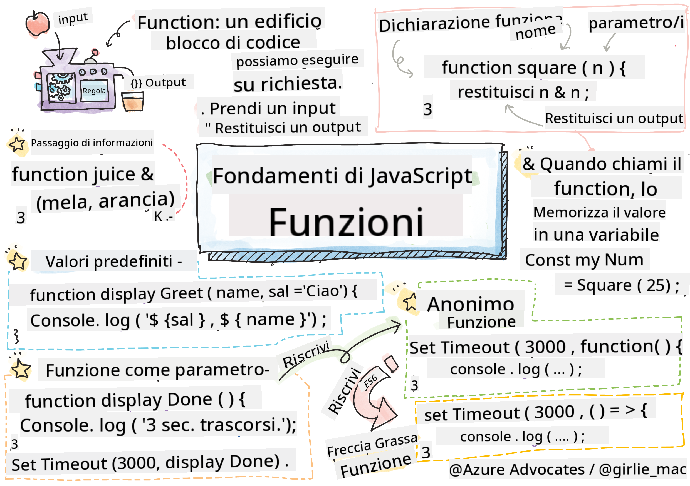

<!--
CO_OP_TRANSLATOR_METADATA:
{
  "original_hash": "ec43b53e8e015cdabfd3ad877b3c28e5",
  "translation_date": "2025-10-22T23:19:40+00:00",
  "source_file": "2-js-basics/2-functions-methods/README.md",
  "language_code": "it"
}
-->
# Fondamenti di JavaScript: Metodi e Funzioni


> Sketchnote di [Tomomi Imura](https://twitter.com/girlie_mac)

## Quiz Pre-Lettura
[Quiz pre-lettura](https://ff-quizzes.netlify.app)

Scrivere lo stesso codice ripetutamente è una delle frustrazioni più comuni nella programmazione. Le funzioni risolvono questo problema permettendoti di racchiudere il codice in blocchi riutilizzabili. Pensa alle funzioni come ai componenti standardizzati che hanno reso rivoluzionaria la catena di montaggio di Henry Ford – una volta creato un componente affidabile, puoi usarlo ovunque sia necessario senza doverlo ricostruire da zero.

Le funzioni ti consentono di raggruppare pezzi di codice per riutilizzarli in tutto il tuo programma. Invece di copiare e incollare la stessa logica ovunque, puoi creare una funzione una volta e chiamarla ogni volta che ne hai bisogno. Questo approccio mantiene il tuo codice organizzato e rende gli aggiornamenti molto più semplici.

In questa lezione, imparerai a creare le tue funzioni, a passare informazioni a esse e a ottenere risultati utili. Scoprirai la differenza tra funzioni e metodi, apprenderai approcci sintattici moderni e vedrai come le funzioni possono lavorare con altre funzioni. Costruiremo questi concetti passo dopo passo.

[](https://youtube.com/watch?v=XgKsD6Zwvlc "Metodi e Funzioni")

> 🎥 Clicca sull'immagine sopra per un video sui metodi e le funzioni.

> Puoi seguire questa lezione su [Microsoft Learn](https://docs.microsoft.com/learn/modules/web-development-101-functions/?WT.mc_id=academic-77807-sagibbon)!

## Funzioni

Una funzione è un blocco di codice autonomo che esegue un compito specifico. Incapsula una logica che puoi eseguire ogni volta che ne hai bisogno.

Invece di scrivere lo stesso codice più volte nel tuo programma, puoi racchiuderlo in una funzione e chiamare quella funzione ogni volta che ti serve. Questo approccio mantiene il tuo codice pulito e rende gli aggiornamenti molto più semplici. Pensa alla difficoltà di manutenzione se dovessi cambiare una logica sparsa in 20 posizioni diverse nel tuo codice.

Dare nomi descrittivi alle tue funzioni è essenziale. Una funzione ben nominata comunica chiaramente il suo scopo – quando vedi `cancelTimer()`, capisci immediatamente cosa fa, proprio come un pulsante chiaramente etichettato ti dice esattamente cosa accadrà quando lo clicchi.

## Creare e chiamare una funzione

Esaminiamo come creare una funzione. La sintassi segue un modello coerente:

```javascript
function nameOfFunction() { // function definition
 // function definition/body
}
```

Analizziamo questo codice:
- La parola chiave `function` dice a JavaScript "Ehi, sto creando una funzione!"
- `nameOfFunction` è dove dai un nome descrittivo alla tua funzione
- Le parentesi `()` sono dove puoi aggiungere parametri (ci arriveremo presto)
- Le parentesi graffe `{}` contengono il codice effettivo che viene eseguito quando chiami la funzione

Creiamo una semplice funzione di saluto per vedere come funziona:

```javascript
function displayGreeting() {
  console.log('Hello, world!');
}
```

Questa funzione stampa "Hello, world!" nella console. Una volta definita, puoi usarla tutte le volte che vuoi.

Per eseguire (o "chiamare") la tua funzione, scrivi il suo nome seguito da parentesi. JavaScript ti consente di definire la tua funzione prima o dopo averla chiamata – il motore JavaScript gestirà l'ordine di esecuzione.

```javascript
// calling our function
displayGreeting();
```

Quando esegui questa riga, viene eseguito tutto il codice all'interno della tua funzione `displayGreeting`, mostrando "Hello, world!" nella console del browser. Puoi chiamare questa funzione ripetutamente.

> **Nota:** Hai utilizzato **metodi** durante queste lezioni. `console.log()` è un metodo – essenzialmente una funzione che appartiene all'oggetto `console`. La differenza principale è che i metodi sono associati agli oggetti, mentre le funzioni sono indipendenti. Molti sviluppatori usano questi termini in modo intercambiabile in conversazioni informali.

### Buone pratiche per le funzioni

Ecco alcuni consigli per aiutarti a scrivere ottime funzioni:

- Dai alle tue funzioni nomi chiari e descrittivi – il tuo futuro te stesso ti ringrazierà!
- Usa **camelCase** per i nomi composti (come `calculateTotal` invece di `calculate_total`)
- Mantieni ogni funzione focalizzata su un unico compito

## Passare informazioni a una funzione

La nostra funzione `displayGreeting` è limitata – può solo mostrare "Hello, world!" per tutti. I parametri ci permettono di rendere le funzioni più flessibili e utili.

I **parametri** agiscono come segnaposto dove puoi inserire valori diversi ogni volta che usi la funzione. In questo modo, la stessa funzione può lavorare con informazioni diverse a ogni chiamata.

Elenca i parametri all'interno delle parentesi quando definisci la tua funzione, separando più parametri con delle virgole:

```javascript
function name(param, param2, param3) {

}
```

Ogni parametro agisce come un segnaposto – quando qualcuno chiama la tua funzione, fornirà valori reali che verranno inseriti in questi spazi.

Aggiorniamo la nostra funzione di saluto per accettare il nome di qualcuno:

```javascript
function displayGreeting(name) {
  const message = `Hello, ${name}!`;
  console.log(message);
}
```

Nota come stiamo usando gli apici inversi (`` ` ``) e `${}` per inserire il nome direttamente nel nostro messaggio – questo si chiama template literal, ed è un modo davvero utile per costruire stringhe con variabili mescolate.

Ora, quando chiamiamo la nostra funzione, possiamo passare qualsiasi nome:

```javascript
displayGreeting('Christopher');
// displays "Hello, Christopher!" when run
```

JavaScript prende la stringa `'Christopher'`, la assegna al parametro `name` e crea il messaggio personalizzato "Hello, Christopher!"

## Valori predefiniti

E se volessimo rendere alcuni parametri opzionali? È qui che i valori predefiniti tornano utili!

Supponiamo di voler permettere alle persone di personalizzare la parola di saluto, ma se non ne specificano una, useremo semplicemente "Hello" come valore predefinito. Puoi impostare valori predefiniti usando il segno uguale, proprio come si fa con una variabile:

```javascript
function displayGreeting(name, salutation='Hello') {
  console.log(`${salutation}, ${name}`);
}
```

Qui, `name` è ancora obbligatorio, ma `salutation` ha un valore di riserva di `'Hello'` se nessuno fornisce un saluto diverso.

Ora possiamo chiamare questa funzione in due modi diversi:

```javascript
displayGreeting('Christopher');
// displays "Hello, Christopher"

displayGreeting('Christopher', 'Hi');
// displays "Hi, Christopher"
```

Nella prima chiamata, JavaScript utilizza il valore predefinito "Hello" poiché non abbiamo specificato un saluto. Nella seconda chiamata, utilizza il nostro "Hi" personalizzato. Questa flessibilità rende le funzioni adattabili a diversi scenari.

## Valori di ritorno

Le nostre funzioni finora si sono limitate a stampare messaggi nella console, ma cosa succede se vuoi che una funzione calcoli qualcosa e ti restituisca il risultato?

È qui che entrano in gioco i **valori di ritorno**. Invece di limitarsi a mostrare qualcosa, una funzione può restituirti un valore che puoi memorizzare in una variabile o utilizzare in altre parti del tuo codice.

Per inviare un valore indietro, utilizzi la parola chiave `return` seguita da ciò che vuoi restituire:

```javascript
return myVariable;
```

Ecco qualcosa di importante: quando una funzione raggiunge un'istruzione `return`, smette immediatamente di funzionare e invia quel valore a chi l'ha chiamata.

Modifichiamo la nostra funzione di saluto per restituire il messaggio invece di stamparlo:

```javascript
function createGreetingMessage(name) {
  const message = `Hello, ${name}`;
  return message;
}
```

Ora, invece di stampare il saluto, questa funzione crea il messaggio e ce lo restituisce.

Per utilizzare il valore restituito, possiamo memorizzarlo in una variabile proprio come qualsiasi altro valore:

```javascript
const greetingMessage = createGreetingMessage('Christopher');
```

Ora `greetingMessage` contiene "Hello, Christopher" e possiamo usarlo ovunque nel nostro codice – per mostrarlo su una pagina web, includerlo in un'email o passarlo a un'altra funzione.

## Funzioni come parametri per altre funzioni

Le funzioni possono essere passate come parametri ad altre funzioni. Sebbene questo concetto possa sembrare complesso inizialmente, è una caratteristica potente che consente modelli di programmazione flessibili.

Questo schema è molto comune quando vuoi dire "quando succede qualcosa, fai quest'altra cosa." Ad esempio, "quando il timer finisce, esegui questo codice" o "quando l'utente clicca sul pulsante, chiama questa funzione."

Vediamo `setTimeout`, che è una funzione integrata che aspetta un certo periodo di tempo e poi esegue del codice. Dobbiamo dirle quale codice eseguire – caso perfetto per passare una funzione!

Prova questo codice – dopo 3 secondi, vedrai un messaggio:

```javascript
function displayDone() {
  console.log('3 seconds has elapsed');
}
// timer value is in milliseconds
setTimeout(displayDone, 3000);
```

Nota come passiamo `displayDone` (senza parentesi) a `setTimeout`. Non stiamo chiamando la funzione noi stessi – la stiamo consegnando a `setTimeout` dicendo "chiamala tra 3 secondi."

### Funzioni anonime

A volte hai bisogno di una funzione per una sola cosa e non vuoi darle un nome. Pensaci – se usi una funzione solo una volta, perché appesantire il tuo codice con un nome in più?

JavaScript ti permette di creare **funzioni anonime** – funzioni senza nome che puoi definire direttamente dove ti servono.

Ecco come possiamo riscrivere il nostro esempio del timer usando una funzione anonima:

```javascript
setTimeout(function() {
  console.log('3 seconds has elapsed');
}, 3000);
```

Questo ottiene lo stesso risultato, ma la funzione è definita direttamente all'interno della chiamata a `setTimeout`, eliminando la necessità di una dichiarazione separata.

### Funzioni a freccia

Il JavaScript moderno ha un modo ancora più breve per scrivere le funzioni, chiamato **funzioni a freccia**. Usano `=>` (che sembra una freccia – capito?) e sono molto popolari tra gli sviluppatori.

Le funzioni a freccia ti permettono di saltare la parola chiave `function` e scrivere codice più conciso.

Ecco il nostro esempio del timer usando una funzione a freccia:

```javascript
setTimeout(() => {
  console.log('3 seconds has elapsed');
}, 3000);
```

Le `()` sono dove andrebbero i parametri (vuote in questo caso), poi arriva la freccia `=>`, e infine il corpo della funzione tra parentesi graffe. Questo fornisce la stessa funzionalità con una sintassi più concisa.

### Quando usare ogni strategia

Quando dovresti usare ciascun approccio? Una linea guida pratica: se utilizzerai la funzione più volte, assegnale un nome e definiscila separatamente. Se è per un uso specifico, considera una funzione anonima. Sia le funzioni a freccia che la sintassi tradizionale sono scelte valide, anche se le funzioni a freccia sono prevalenti nei moderni progetti JavaScript.

---


## 🚀 Sfida

Riesci a spiegare in una frase la differenza tra funzioni e metodi? Prova!

## Sfida GitHub Copilot Agent 🚀

Usa la modalità Agent per completare la seguente sfida:

**Descrizione:** Crea una libreria di utilità matematica che dimostri i diversi concetti di funzione trattati in questa lezione, inclusi parametri, valori predefiniti, valori di ritorno e funzioni a freccia.

**Prompt:** Crea un file JavaScript chiamato `mathUtils.js` che contenga le seguenti funzioni:
1. Una funzione `add` che prende due parametri e restituisce la loro somma
2. Una funzione `multiply` con valori predefiniti per i parametri (il secondo parametro predefinito è 1)
3. Una funzione a freccia `square` che prende un numero e restituisce il suo quadrato
4. Una funzione `calculate` che accetta un'altra funzione come parametro e due numeri, quindi applica la funzione a quei numeri
5. Dimostra la chiamata di ciascuna funzione con casi di test appropriati

Scopri di più sulla [modalità agent](https://code.visualstudio.com/blogs/2025/02/24/introducing-copilot-agent-mode) qui.

## Quiz Post-Lettura
[Quiz post-lettura](https://ff-quizzes.netlify.app)

## Revisione e Studio Autonomo

Vale la pena [approfondire un po' di più le funzioni a freccia](https://developer.mozilla.org/docs/Web/JavaScript/Reference/Functions/Arrow_functions), poiché sono sempre più utilizzate nei progetti. Pratica scrivendo una funzione e poi riscrivendola con questa sintassi.

## Compito

[Divertiti con le Funzioni](assignment.md)

---

**Disclaimer**:  
Questo documento è stato tradotto utilizzando il servizio di traduzione AI [Co-op Translator](https://github.com/Azure/co-op-translator). Sebbene ci impegniamo per garantire l'accuratezza, si prega di notare che le traduzioni automatiche possono contenere errori o imprecisioni. Il documento originale nella sua lingua nativa dovrebbe essere considerato la fonte autorevole. Per informazioni critiche, si raccomanda una traduzione professionale umana. Non siamo responsabili per eventuali incomprensioni o interpretazioni errate derivanti dall'uso di questa traduzione.