<!--
CO_OP_TRANSLATOR_METADATA:
{
  "original_hash": "71f7d7dafa1c7194d79ddac87f669ff9",
  "translation_date": "2025-11-04T00:19:20+00:00",
  "source_file": "2-js-basics/2-functions-methods/README.md",
  "language_code": "it"
}
-->
# Fondamenti di JavaScript: Metodi e Funzioni


> Sketchnote di [Tomomi Imura](https://twitter.com/girlie_mac)


## Quiz Pre-Lettura
[Quiz pre-lettura](https://ff-quizzes.netlify.app)

Scrivere lo stesso codice ripetutamente è una delle frustrazioni più comuni nella programmazione. Le funzioni risolvono questo problema permettendoti di racchiudere il codice in blocchi riutilizzabili. Pensa alle funzioni come ai componenti standardizzati che hanno reso rivoluzionaria la catena di montaggio di Henry Ford: una volta creato un componente affidabile, puoi usarlo ovunque sia necessario senza doverlo ricostruire da zero.

Le funzioni ti consentono di raggruppare pezzi di codice per riutilizzarli in tutto il programma. Invece di copiare e incollare la stessa logica ovunque, puoi creare una funzione una volta e chiamarla ogni volta che serve. Questo approccio mantiene il codice organizzato e rende gli aggiornamenti molto più semplici.

In questa lezione, imparerai a creare le tue funzioni, a passare informazioni a esse e a ottenere risultati utili. Scoprirai la differenza tra funzioni e metodi, apprenderai approcci sintattici moderni e vedrai come le funzioni possono lavorare con altre funzioni. Costruiremo questi concetti passo dopo passo.

[](https://youtube.com/watch?v=XgKsD6Zwvlc "Metodi e Funzioni")

> 🎥 Clicca sull'immagine sopra per un video sui metodi e le funzioni.

> Puoi seguire questa lezione su [Microsoft Learn](https://docs.microsoft.com/learn/modules/web-development-101-functions/?WT.mc_id=academic-77807-sagibbon)!


## Funzioni

Una funzione è un blocco di codice autonomo che svolge un compito specifico. Incapsula la logica che puoi eseguire ogni volta che ne hai bisogno.

Invece di scrivere lo stesso codice più volte nel tuo programma, puoi racchiuderlo in una funzione e chiamare quella funzione ogni volta che ti serve. Questo approccio mantiene il codice pulito e rende gli aggiornamenti molto più semplici. Pensa alla sfida di manutenzione se dovessi cambiare una logica sparsa in 20 posizioni diverse nel tuo codice.

Dare nomi descrittivi alle tue funzioni è essenziale. Una funzione ben nominata comunica chiaramente il suo scopo – quando vedi `cancelTimer()`, capisci immediatamente cosa fa, proprio come un pulsante chiaramente etichettato ti dice esattamente cosa accadrà quando lo clicchi.

## Creare e chiamare una funzione

Esaminiamo come creare una funzione. La sintassi segue uno schema coerente:

```javascript
function nameOfFunction() { // function definition
 // function definition/body
}
```

Analizziamo questo codice:
- La parola chiave `function` dice a JavaScript "Ehi, sto creando una funzione!"
- `nameOfFunction` è dove dai alla tua funzione un nome descrittivo
- Le parentesi `()` sono dove puoi aggiungere parametri (ci arriveremo presto)
- Le parentesi graffe `{}` contengono il codice effettivo che viene eseguito quando chiami la funzione

Creiamo una semplice funzione di saluto per vedere come funziona:

```javascript
function displayGreeting() {
  console.log('Hello, world!');
}
```

Questa funzione stampa "Hello, world!" nella console. Una volta definita, puoi usarla tutte le volte che vuoi.

Per eseguire (o "chiamare") la tua funzione, scrivi il suo nome seguito da parentesi. JavaScript ti permette di definire la tua funzione prima o dopo averla chiamata – il motore JavaScript gestirà l'ordine di esecuzione.

```javascript
// calling our function
displayGreeting();
```

Quando esegui questa riga, esegue tutto il codice all'interno della tua funzione `displayGreeting`, mostrando "Hello, world!" nella console del browser. Puoi chiamare questa funzione ripetutamente.

### 🧠 **Verifica Fondamenti delle Funzioni: Costruire le Tue Prime Funzioni**

**Vediamo come ti senti riguardo alle funzioni di base:**
- Puoi spiegare perché usiamo le parentesi graffe `{}` nelle definizioni di funzione?
- Cosa succede se scrivi `displayGreeting` senza le parentesi?
- Perché potresti voler chiamare la stessa funzione più volte?

```mermaid
flowchart TD
    A["✏️ Define Function"] --> B["📦 Package Code"]
    B --> C["🏷️ Give it a Name"]
    C --> D["📞 Call When Needed"]
    D --> E["🔄 Reuse Anywhere"]
    
    F["💡 Benefits"] --> F1["No code repetition"]
    F --> F2["Easy to maintain"]
    F --> F3["Clear organization"]
    F --> F4["Easier testing"]
    
    style A fill:#e3f2fd
    style E fill:#e8f5e8
    style F fill:#fff3e0
```



> **Nota:** Hai usato **metodi** durante queste lezioni. `console.log()` è un metodo – essenzialmente una funzione che appartiene all'oggetto `console`. La differenza principale è che i metodi sono collegati agli oggetti, mentre le funzioni sono indipendenti. Molti sviluppatori usano questi termini in modo intercambiabile nelle conversazioni informali.

### Buone pratiche per le funzioni

Ecco alcuni consigli per scrivere ottime funzioni:

- Dai alle tue funzioni nomi chiari e descrittivi – il tuo futuro te stesso ti ringrazierà!
- Usa **camelCasing** per i nomi composti (come `calculateTotal` invece di `calculate_total`)
- Mantieni ogni funzione focalizzata su un unico compito

## Passare informazioni a una funzione

La nostra funzione `displayGreeting` è limitata – può solo mostrare "Hello, world!" per tutti. I parametri ci permettono di rendere le funzioni più flessibili e utili.

I **parametri** agiscono come segnaposto dove puoi inserire valori diversi ogni volta che usi la funzione. In questo modo, la stessa funzione può lavorare con informazioni diverse a ogni chiamata.

Elenca i parametri all'interno delle parentesi quando definisci la funzione, separando più parametri con delle virgole:

```javascript
function name(param, param2, param3) {

}
```

Ogni parametro agisce come un segnaposto – quando qualcuno chiama la tua funzione, fornirà valori reali che verranno inseriti in questi spazi.

Aggiorniamo la nostra funzione di saluto per accettare il nome di qualcuno:

```javascript
function displayGreeting(name) {
  const message = `Hello, ${name}!`;
  console.log(message);
}
```

Nota come stiamo usando gli apici inversi (`` ` ``) e `${}` per inserire direttamente il nome nel messaggio – questo si chiama template literal, ed è un modo davvero utile per costruire stringhe con variabili mescolate.

Ora, quando chiamiamo la nostra funzione, possiamo passare qualsiasi nome:

```javascript
displayGreeting('Christopher');
// displays "Hello, Christopher!" when run
```

JavaScript prende la stringa `'Christopher'`, la assegna al parametro `name` e crea il messaggio personalizzato "Hello, Christopher!"

```mermaid
flowchart LR
    A["🎯 Function Call"] --> B["📥 Parameters"]
    B --> C["⚙️ Function Body"]
    C --> D["📤 Result"]
    
    A1["displayGreeting('Alice')"] --> A
    B1["name = 'Alice'"] --> B
    C1["Template literal\n\`Hello, \${name}!\`"] --> C
    D1["'Hello, Alice!'"] --> D
    
    E["🔄 Parameter Types"] --> E1["Strings"]
    E --> E2["Numbers"]
    E --> E3["Booleans"]
    E --> E4["Objects"]
    E --> E5["Functions"]
    
    style A fill:#e3f2fd
    style C fill:#e8f5e8
    style D fill:#fff3e0
    style E fill:#f3e5f5
```



## Valori predefiniti

E se volessimo rendere alcuni parametri opzionali? È qui che i valori predefiniti tornano utili!

Supponiamo di voler permettere alle persone di personalizzare la parola di saluto, ma se non ne specificano una, useremo semplicemente "Hello" come valore predefinito. Puoi impostare valori predefiniti usando il segno di uguale, proprio come si fa con una variabile:

```javascript
function displayGreeting(name, salutation='Hello') {
  console.log(`${salutation}, ${name}`);
}
```

Qui, `name` è ancora obbligatorio, ma `salutation` ha un valore di riserva di `'Hello'` se nessuno fornisce un saluto diverso.

Ora possiamo chiamare questa funzione in due modi diversi:

```javascript
displayGreeting('Christopher');
// displays "Hello, Christopher"

displayGreeting('Christopher', 'Hi');
// displays "Hi, Christopher"
```

Nella prima chiamata, JavaScript usa il valore predefinito "Hello" poiché non abbiamo specificato un saluto. Nella seconda chiamata, usa il nostro "Hi" personalizzato. Questa flessibilità rende le funzioni adattabili a diversi scenari.

### 🎛️ **Verifica Parametri: Rendere le Funzioni Flessibili**

**Metti alla prova la tua comprensione dei parametri:**
- Qual è la differenza tra un parametro e un argomento?
- Perché i valori predefiniti sono utili nella programmazione reale?
- Riesci a prevedere cosa succede se passi più argomenti rispetto ai parametri?


> **Suggerimento utile**: I parametri predefiniti rendono le tue funzioni più user-friendly. Gli utenti possono iniziare rapidamente con valori predefiniti sensati, ma possono comunque personalizzare quando necessario!

## Valori di ritorno

Le nostre funzioni finora hanno solo stampato messaggi nella console, ma cosa succede se vuoi che una funzione calcoli qualcosa e ti restituisca il risultato?

È qui che entrano in gioco i **valori di ritorno**. Invece di limitarsi a mostrare qualcosa, una funzione può restituire un valore che puoi memorizzare in una variabile o utilizzare in altre parti del tuo codice.

Per inviare un valore indietro, usi la parola chiave `return` seguita da ciò che vuoi restituire:

```javascript
return myVariable;
```

Ecco qualcosa di importante: quando una funzione raggiunge un'istruzione `return`, smette immediatamente di funzionare e invia quel valore a chi l'ha chiamata.

Modifichiamo la nostra funzione di saluto per restituire il messaggio invece di stamparlo:

```javascript
function createGreetingMessage(name) {
  const message = `Hello, ${name}`;
  return message;
}
```

Ora, invece di stampare il saluto, questa funzione crea il messaggio e ce lo restituisce.

Per utilizzare il valore restituito, possiamo memorizzarlo in una variabile proprio come qualsiasi altro valore:

```javascript
const greetingMessage = createGreetingMessage('Christopher');
```

Ora `greetingMessage` contiene "Hello, Christopher" e possiamo usarlo ovunque nel nostro codice – per mostrarlo su una pagina web, includerlo in un'email o passarlo a un'altra funzione.

```mermaid
flowchart TD
    A["🔧 Function Processing"] --> B{"return statement?"}
    B -->|Yes| C["📤 Return Value"]
    B -->|No| D["📭 Return undefined"]
    
    C --> E["💾 Store in Variable"]
    C --> F["🔗 Use in Expression"]
    C --> G["📞 Pass to Function"]
    
    D --> H["⚠️ Usually not useful"]
    
    I["📋 Return Value Uses"] --> I1["Calculate results"]
    I --> I2["Validate input"]
    I --> I3["Transform data"]
    I --> I4["Create objects"]
    
    style C fill:#e8f5e8
    style D fill:#ffebee
    style I fill:#e3f2fd
```



### 🔄 **Verifica Valori di Ritorno: Ottenere Risultati**

**Valuta la tua comprensione dei valori di ritorno:**
- Cosa succede al codice dopo un'istruzione `return` in una funzione?
- Perché restituire valori è spesso meglio che limitarsi a stampare nella console?
- Una funzione può restituire tipi di valori diversi (stringa, numero, booleano)?


> **Insight chiave**: Le funzioni che restituiscono valori sono più versatili perché chi le chiama decide cosa fare con il risultato. Questo rende il tuo codice più modulare e riutilizzabile!

## Funzioni come parametri per altre funzioni

Le funzioni possono essere passate come parametri ad altre funzioni. Sebbene questo concetto possa sembrare complesso inizialmente, è una caratteristica potente che consente modelli di programmazione flessibili.

Questo schema è molto comune quando vuoi dire "quando succede qualcosa, fai quest'altra cosa". Ad esempio, "quando il timer finisce, esegui questo codice" o "quando l'utente clicca il pulsante, chiama questa funzione."

Vediamo `setTimeout`, che è una funzione integrata che aspetta un certo periodo di tempo e poi esegue del codice. Dobbiamo dirle quale codice eseguire – caso perfetto per passare una funzione!

Prova questo codice – dopo 3 secondi, vedrai un messaggio:

```javascript
function displayDone() {
  console.log('3 seconds has elapsed');
}
// timer value is in milliseconds
setTimeout(displayDone, 3000);
```

Nota come passiamo `displayDone` (senza parentesi) a `setTimeout`. Non stiamo chiamando la funzione noi stessi – la stiamo passando a `setTimeout` dicendo "chiamala tra 3 secondi."

### Funzioni anonime

A volte hai bisogno di una funzione per una sola cosa e non vuoi darle un nome. Pensaci – se usi una funzione solo una volta, perché appesantire il tuo codice con un nome extra?

JavaScript ti permette di creare **funzioni anonime** – funzioni senza nome che puoi definire direttamente dove ti servono.

Ecco come possiamo riscrivere il nostro esempio del timer usando una funzione anonima:

```javascript
setTimeout(function() {
  console.log('3 seconds has elapsed');
}, 3000);
```

Questo ottiene lo stesso risultato, ma la funzione è definita direttamente all'interno della chiamata `setTimeout`, eliminando la necessità di una dichiarazione di funzione separata.

### Funzioni freccia

Il JavaScript moderno ha un modo ancora più breve per scrivere funzioni chiamato **funzioni freccia**. Usano `=>` (che sembra una freccia – capito?) e sono molto popolari tra gli sviluppatori.

Le funzioni freccia ti permettono di saltare la parola chiave `function` e scrivere codice più conciso.

Ecco il nostro esempio del timer usando una funzione freccia:

```javascript
setTimeout(() => {
  console.log('3 seconds has elapsed');
}, 3000);
```

Le `()` sono dove andrebbero i parametri (vuote in questo caso), poi arriva la freccia `=>`, e infine il corpo della funzione tra parentesi graffe. Questo fornisce la stessa funzionalità con una sintassi più concisa.

```mermaid
flowchart LR
    A["📝 Function Styles"] --> B["Traditional"]
    A --> C["Arrow"]
    A --> D["Anonymous"]
    
    B --> B1["function name() {}"]
    B --> B2["Hoisted"]
    B --> B3["Named"]
    
    C --> C1["const name = () => {}"]
    C --> C2["Concise syntax"]
    C --> C3["Modern style"]
    
    D --> D1["function() {}"]
    D --> D2["No name"]
    D --> D3["One-time use"]
    
    E["⏰ When to Use"] --> E1["Traditional: Reusable functions"]
    E --> E2["Arrow: Short callbacks"]
    E --> E3["Anonymous: Event handlers"]
    
    style A fill:#e3f2fd
    style B fill:#e8f5e8
    style C fill:#fff3e0
    style D fill:#f3e5f5
    style E fill:#e0f2f1
```



### Quando usare ogni strategia

Quando dovresti usare ciascun approccio? Una linea guida pratica: se utilizzerai la funzione più volte, dagli un nome e definiscila separatamente. Se è per un uso specifico, considera una funzione anonima. Sia le funzioni freccia che la sintassi tradizionale sono scelte valide, anche se le funzioni freccia sono prevalenti nei moderni codici JavaScript.

### 🎨 **Verifica Stili di Funzione: Scegliere la Sintassi Giusta**

**Metti alla prova la tua comprensione della sintassi:**
- Quando potresti preferire le funzioni freccia rispetto alla sintassi tradizionale?
- Qual è il principale vantaggio delle funzioni anonime?
- Riesci a pensare a una situazione in cui una funzione con nome è migliore di una anonima?


> **Tendenza moderna**: Le funzioni freccia stanno diventando la scelta predefinita per molti sviluppatori grazie alla loro sintassi concisa, ma le funzioni tradizionali hanno ancora il loro posto!

---


## 🚀 Sfida

Riesci a spiegare in una frase la differenza tra funzioni e metodi? Prova!

## Sfida GitHub Copilot Agent 🚀

Usa la modalità Agent per completare la seguente sfida:

**Descrizione:** Crea una libreria di utilità matematica che dimostri i diversi concetti di funzione trattati in questa lezione, inclusi parametri, valori predefiniti, valori di ritorno e funzioni freccia.

**Prompt:** Crea un file JavaScript chiamato `mathUtils.js` che contenga le seguenti funzioni:
1. Una funzione `add` che prende due parametri e restituisce la loro somma
2. Una funzione `multiply` con valori predefiniti per i parametri (il secondo parametro predefinito è 1)
3. Una funzione freccia `square` che prende un numero e restituisce il suo quadrato
4. Una funzione `calculate` che accetta un'altra funzione come parametro e due numeri, quindi applica la funzione a quei numeri
5. Dimostra la chiamata di ciascuna funzione con casi di test appropriati

Scopri di più sulla [modalità agent](https://code.visualstudio.com/blogs/2025/02/24/introducing-copilot-agent-mode) qui.

## Quiz Post-Lettura
[Quiz post-lettura](https://ff-quizzes.netlify.app)

## Revisione e Studio Autonomo

Vale la pena [approfondire un po' di più le funzioni freccia](https://developer.mozilla.org/docs/Web/JavaScript/Reference/Functions/Arrow_functions), poiché sono sempre più utilizzate nei codici. Prova a scrivere una funzione e poi a riscriverla con questa sintassi.

## Compito

[Divertiti con le Funzioni](assignment.md)

---

## 🧰 **Riepilogo degli Strumenti per le Funzioni JavaScript**

```mermaid
graph TD
    A["🎯 JavaScript Functions"] --> B["📋 Function Declaration"]
    A --> C["📥 Parameters"]
    A --> D["📤 Return Values"]
    A --> E["🎨 Modern Syntax"]
    
    B --> B1["function name() {}"]
    B --> B2["Descriptive naming"]
    B --> B3["Reusable code blocks"]
    
    C --> C1["Input data"]
    C --> C2["Default values"]
    C --> C3["Multiple parameters"]
    
    D --> D1["return statement"]
    D --> D2["Exit function"]
    D --> D3["Pass data back"]
    
    E --> E1["Arrow functions: () =>"]
    E --> E2["Anonymous functions"]
    E --> E3["Higher-order functions"]
    
    F["⚡ Key Benefits"] --> F1["Code reusability"]
    F --> F2["Better organization"]
    F --> F3["Easier testing"]
    F --> F4["Modular design"]
    
    style A fill:#e3f2fd
    style B fill:#e8f5e8
    style C fill:#fff3e0
    style D fill:#f3e5f5
    style E fill:#e0f2f1
    style F fill:#fce4ec
```



---

## 🚀 Cronologia di Padronanza delle Funzioni JavaScript

### ⚡ **Cosa Puoi Fare nei Prossimi 5 Minuti**
- [ ] Scrivi una semplice funzione che restituisca il tuo numero preferito
- [ ] Crea una funzione con due parametri che li sommi insieme
- [ ] Prova a convertire una funzione tradizionale in sintassi a freccia
- [ ] Esercitati con la sfida: spiega la differenza tra funzioni e metodi

### 🎯 **Cosa Puoi Realizzare in Quest'ora**
- [ ] Completa il quiz post-lezione e rivedi i concetti che ti risultano poco chiari
- [ ] Crea la libreria di utilità matematiche dalla sfida di GitHub Copilot
- [ ] Scrivi una funzione che utilizza un'altra funzione come parametro
- [ ] Esercitati a scrivere funzioni con parametri di default
- [ ] Sperimenta con i template literals nei valori di ritorno delle funzioni

### 📅 **La Tua Padronanza delle Funzioni per la Settimana**
- [ ] Completa l'assegnazione "Divertiti con le Funzioni" con creatività
- [ ] Refattorizza del codice ripetitivo che hai scritto trasformandolo in funzioni riutilizzabili
- [ ] Crea un piccolo calcolatore utilizzando solo funzioni (senza variabili globali)
- [ ] Esercitati con le funzioni a freccia usando metodi di array come `map()` e `filter()`
- [ ] Crea una raccolta di funzioni utili per compiti comuni
- [ ] Studia le funzioni di ordine superiore e i concetti di programmazione funzionale

### 🌟 **La Tua Trasformazione Mensile**
- [ ] Padroneggia concetti avanzati sulle funzioni come chiusure e ambiti
- [ ] Crea un progetto che utilizza ampiamente la composizione di funzioni
- [ ] Contribuisci al codice open source migliorando la documentazione delle funzioni
- [ ] Insegna a qualcun altro le funzioni e i diversi stili di sintassi
- [ ] Esplora i paradigmi di programmazione funzionale in JavaScript
- [ ] Crea una libreria personale di funzioni riutilizzabili per progetti futuri

### 🏆 **Check-in Finale del Campione delle Funzioni**

**Festeggia la tua padronanza delle funzioni:**
- Qual è la funzione più utile che hai creato finora?
- In che modo imparare sulle funzioni ha cambiato il tuo modo di pensare all'organizzazione del codice?
- Quale sintassi delle funzioni preferisci e perché?
- Quale problema reale risolveresti scrivendo una funzione?


> 🎉 **Hai padroneggiato uno dei concetti più potenti della programmazione!** Le funzioni sono i mattoni fondamentali dei programmi più grandi. Ogni applicazione che costruirai utilizzerà le funzioni per organizzare, riutilizzare e strutturare il codice. Ora comprendi come confezionare la logica in componenti riutilizzabili, diventando un programmatore più efficiente ed efficace. Benvenuto nel mondo della programmazione modulare! 🚀

---

**Disclaimer**:  
Questo documento è stato tradotto utilizzando il servizio di traduzione AI [Co-op Translator](https://github.com/Azure/co-op-translator). Sebbene ci impegniamo per garantire l'accuratezza, si prega di notare che le traduzioni automatiche potrebbero contenere errori o imprecisioni. Il documento originale nella sua lingua nativa dovrebbe essere considerato la fonte autorevole. Per informazioni critiche, si consiglia una traduzione professionale umana. Non siamo responsabili per eventuali incomprensioni o interpretazioni errate derivanti dall'uso di questa traduzione.