# Fondamenti di JavaScript: Prendere decisioni

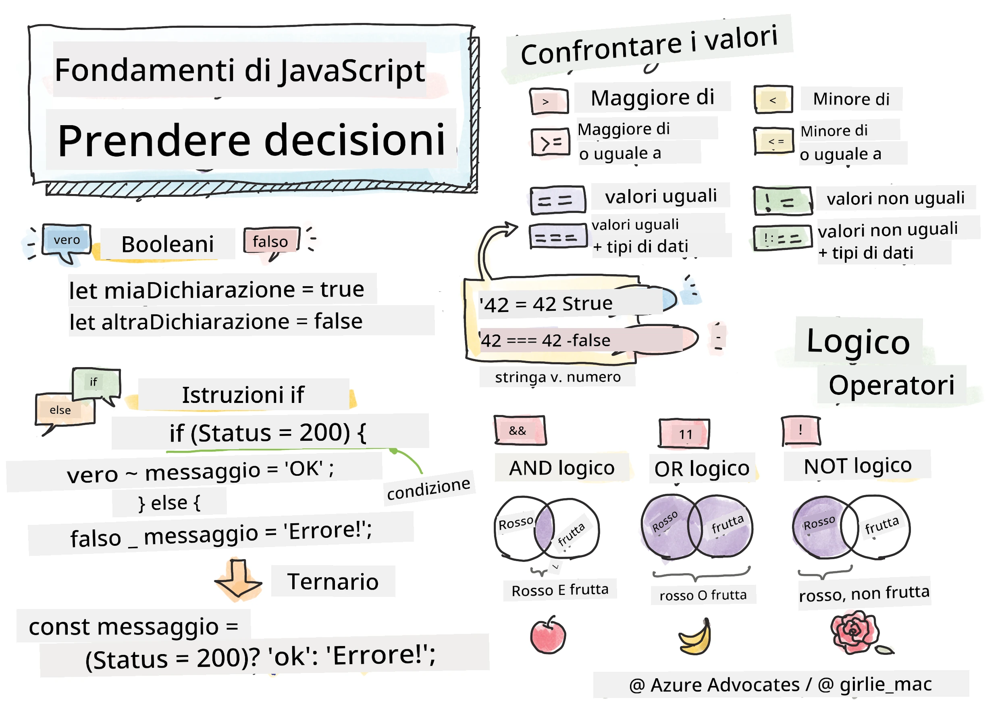

> Sketchnote di [Tomomi Imura](https://twitter.com/girlie_mac)

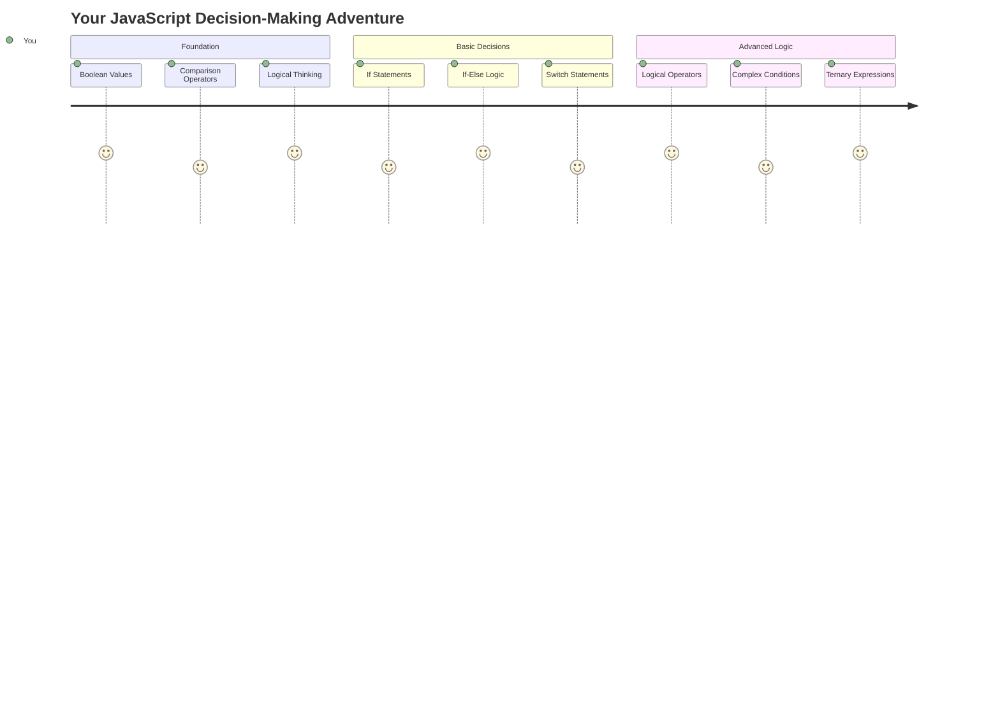

Ti sei mai chiesto come le applicazioni prendano decisioni intelligenti? Come un sistema di navigazione scelga il percorso più veloce, o come un termostato decida quando accendere il riscaldamento? Questo è il concetto fondamentale del prendere decisioni nella programmazione.

Proprio come il motore analitico di Charles Babbage era progettato per seguire diverse sequenze di operazioni basate su condizioni, i moderni programmi JavaScript devono fare scelte basate su circostanze variabili. Questa capacità di ramificarsi e prendere decisioni è ciò che trasforma il codice statico in applicazioni reattive e intelligenti.

In questa lezione, imparerai come implementare la logica condizionale nei tuoi programmi. Esploreremo le istruzioni condizionali, gli operatori di confronto e le espressioni logiche che permettono al tuo codice di valutare situazioni e rispondere in modo appropriato.

## Quiz Pre-Lezione

[Quiz pre-lezione](https://ff-quizzes.netlify.app/web/quiz/11)

La capacità di prendere decisioni e controllare il flusso del programma è un aspetto fondamentale della programmazione. Questa sezione copre come controllare il percorso di esecuzione dei tuoi programmi JavaScript utilizzando valori Booleani e logica condizionale.

[](https://youtube.com/watch?v=SxTp8j-fMMY "Prendere decisioni")

> 🎥 Clicca sull'immagine sopra per un video sul prendere decisioni.

> Puoi seguire questa lezione su [Microsoft Learn](https://docs.microsoft.com/learn/modules/web-development-101-if-else/?WT.mc_id=academic-77807-sagibbon)!

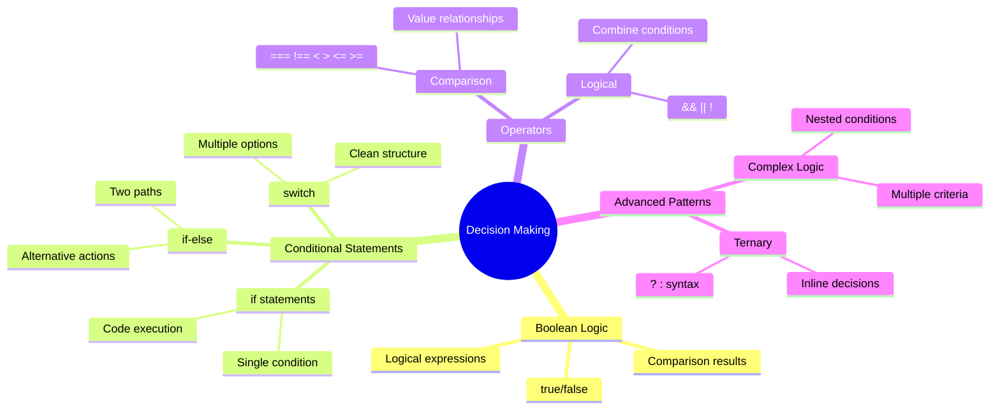

## Breve Ripasso sui Booleani

Prima di esplorare il processo decisionale, ripassiamo i valori Booleani dalla lezione precedente. Nominati in onore del matematico George Boole, questi valori rappresentano stati binari – `true` o `false`. Non c'è ambiguità, né vie di mezzo.

Questi valori binari formano la base di tutta la logica computazionale. Ogni decisione che il tuo programma prende si riduce, in ultima analisi, a una valutazione booleana.

Creare variabili booleane è semplice:

```javascript
let myTrueBool = true;
let myFalseBool = false;
```

Questo crea due variabili con valori booleani espliciti.

✅ I Booleani prendono il nome dal matematico, filosofo e logico inglese George Boole (1815–1864).

## Operatori di confronto e Booleani

Nella pratica, raramente imposterai manualmente valori booleani. Piuttosto, li genererai valutando condizioni: "Questo numero è maggiore di quell'altro?" o "Questi valori sono uguali?"

Gli operatori di confronto permettono queste valutazioni. Confrontano valori e restituiscono risultati booleani basati sulla relazione tra gli operandi.

| Simbolo | Descrizione                                                                                                                                                   | Esempio            |
| ------ | ------------------------------------------------------------------------------------------------------------------------------------------------------------- | ------------------ |
| `<`    | **Minore di**: Confronta due valori e restituisce il tipo di dato booleano `true` se il valore a sinistra è minore di quello a destra                          | `5 < 6 // true`    |
| `<=`   | **Minore o uguale a**: Confronta due valori e restituisce il tipo di dato booleano `true` se il valore a sinistra è minore o uguale a quello a destra          | `5 <= 6 // true`   |
| `>`    | **Maggiore di**: Confronta due valori e restituisce il tipo di dato booleano `true` se il valore a sinistra è maggiore di quello a destra                     | `5 > 6 // false`   |
| `>=`   | **Maggiore o uguale a**: Confronta due valori e restituisce il tipo di dato booleano `true` se il valore a sinistra è maggiore o uguale a quello a destra     | `5 >= 6 // false`  |
| `===`  | **Uguaglianza stretta**: Confronta due valori e restituisce il tipo di dato booleano `true` se i valori a destra e sinistra sono uguali E dello stesso tipo.   | `5 === 6 // false` |
| `!==`  | **Disuguaglianza**: Confronta due valori e restituisce il valore booleano opposto a quello che restituirebbe un operatore di uguaglianza stretta               | `5 !== 6 // true`  |

✅ Verifica la tua conoscenza scrivendo alcuni confronti nella console del browser. Ti sorprende qualche dato restituito?

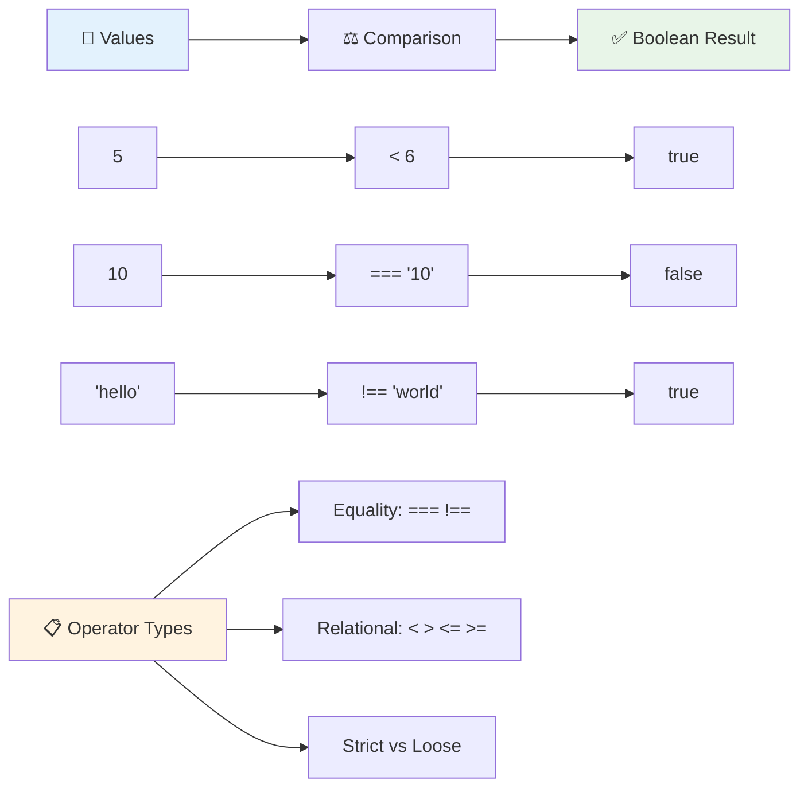

### 🧠 **Controllo della padronanza dei confronti: Comprendere la logica booleana**

**Metti alla prova la tua comprensione dei confronti:**
- Perché pensi che `===` (uguaglianza stretta) sia generalmente preferito rispetto a `==` (uguaglianza debole)?
- Riesci a prevedere cosa restituisce `5 === '5'`? E `5 == '5'`?
- Qual è la differenza tra `!==` e `!=`?

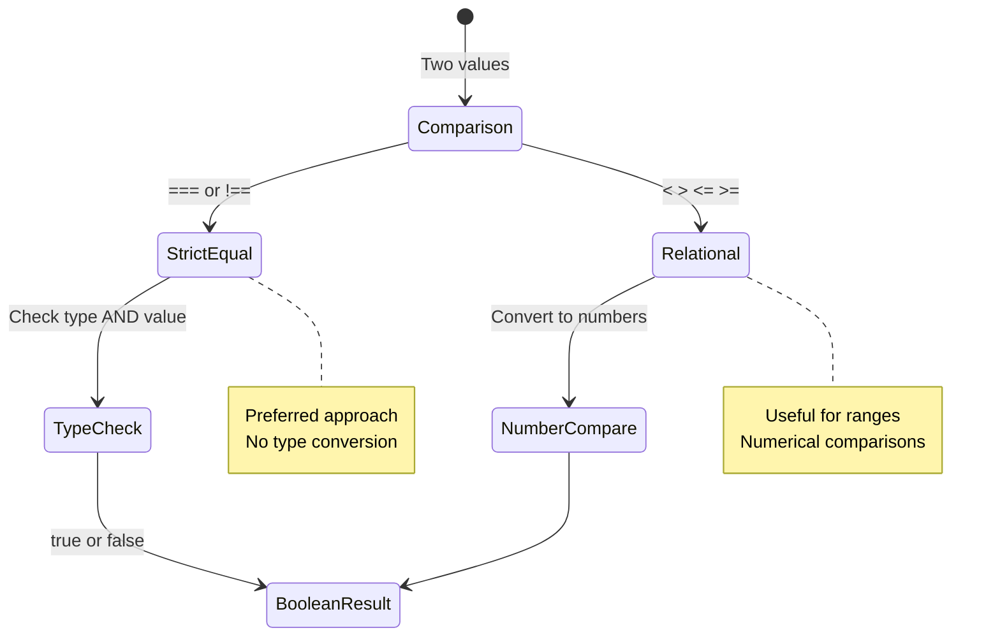

> **Suggerimento professionale**: Usa sempre `===` e `!==` per i controlli di uguaglianza, a meno che tu non abbia bisogno specificamente della conversione di tipo. Questo previene comportamenti inattesi!

## Istruzione If

L'istruzione `if` è come fare una domanda nel tuo codice. "Se questa condizione è vera, allora fai questa cosa." È probabilmente lo strumento più importante che userai per prendere decisioni in JavaScript.

Ecco come funziona:

```javascript
if (condition) {
  // Condition is true. Code in this block will run.
}
```

La condizione va dentro le parentesi, e se è `true`, JavaScript esegue il codice dentro le parentesi graffe. Se è `false`, JavaScript salta semplicemente tutto quel blocco.

Spesso userai operatori di confronto per creare queste condizioni. Vediamo un esempio pratico:

```javascript
let currentMoney = 1000;
let laptopPrice = 800;

if (currentMoney >= laptopPrice) {
  // Condition is true. Code in this block will run.
  console.log("Getting a new laptop!");
}
```

Poiché `1000 >= 800` si valuta come `true`, il codice dentro il blocco viene eseguito, mostrando "Sto comprando un nuovo laptop!" nella console.

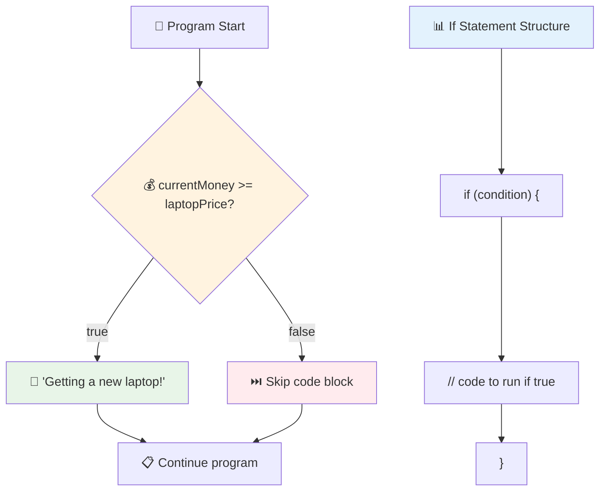

## Istruzione If..Else

Ma cosa succede se vuoi che il tuo programma faccia qualcosa di diverso quando la condizione è falsa? È qui che entra in gioco `else` – è come avere un piano di riserva.

L'istruzione `else` ti dà un modo per dire "se questa condizione non è vera, fai invece quest'altra cosa."

```javascript
let currentMoney = 500;
let laptopPrice = 800;

if (currentMoney >= laptopPrice) {
  // Condition is true. Code in this block will run.
  console.log("Getting a new laptop!");
} else {
  // Condition is false. Code in this block will run.
  console.log("Can't afford a new laptop, yet!");
}
```

Ora, poiché `500 >= 800` è `false`, JavaScript salta il primo blocco ed esegue invece il blocco `else`. Vedrai "Non posso permettermi un nuovo laptop, per ora!" nella console.

✅ Metti alla prova la tua comprensione di questo codice e del codice seguente eseguendolo nella console del browser. Cambia i valori delle variabili currentMoney e laptopPrice per modificare il risultato di `console.log()`.

### 🎯 **Controllo della logica If-Else: Percorsi ramificati**

**Valuta la tua comprensione della logica condizionale:**
- Cosa succede se `currentMoney` è esattamente uguale a `laptopPrice`?
- Riesci a pensare a uno scenario reale in cui la logica if-else sarebbe utile?
- Come potresti estendere questo per gestire più fasce di prezzo?

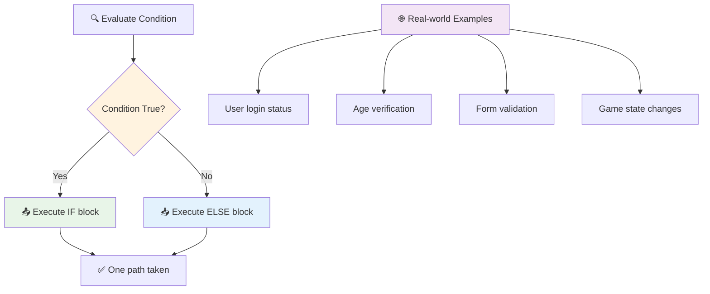

> **Insight chiave**: If-else garantisce che venga intrapreso esattamente un percorso. Questo garantisce che il tuo programma abbia sempre una risposta a qualsiasi condizione!

## Istruzione Switch

A volte hai bisogno di confrontare un valore con più opzioni. Anche se potresti concatenare diverse istruzioni `if..else`, questo approccio diventa poco pratico. L'istruzione `switch` offre una struttura più pulita per gestire più valori discreti.

Il concetto ricorda i sistemi di commutazione meccanica utilizzati nei primi centralini telefonici – un valore di input determina quale percorso specifico segue l'esecuzione.

```javascript
switch (expression) {
  case x:
    // code block
    break;
  case y:
    // code block
    break;
  default:
    // code block
}
```

Ecco come è strutturato:
- JavaScript valuta l'espressione una volta
- Scorre ogni `case` per trovare una corrispondenza
- Quando trova una corrispondenza, esegue quel blocco di codice
- Il `break` dice a JavaScript di fermarsi ed uscire dal switch
- Se nessun case corrisponde, esegue il blocco `default` (se presente)

```javascript
// Program using switch statement for day of week
let dayNumber = 2;
let dayName;

switch (dayNumber) {
  case 1:
    dayName = "Monday";
    break;
  case 2:
    dayName = "Tuesday";
    break;
  case 3:
    dayName = "Wednesday";
    break;
  default:
    dayName = "Unknown day";
    break;
}
console.log(`Today is ${dayName}`);
```

In questo esempio, JavaScript vede che `dayNumber` è `2`, trova il `case 2` corrispondente, imposta `dayName` su "Martedì", e poi esce dal switch. Il risultato? "Oggi è Martedì" viene registrato nella console.

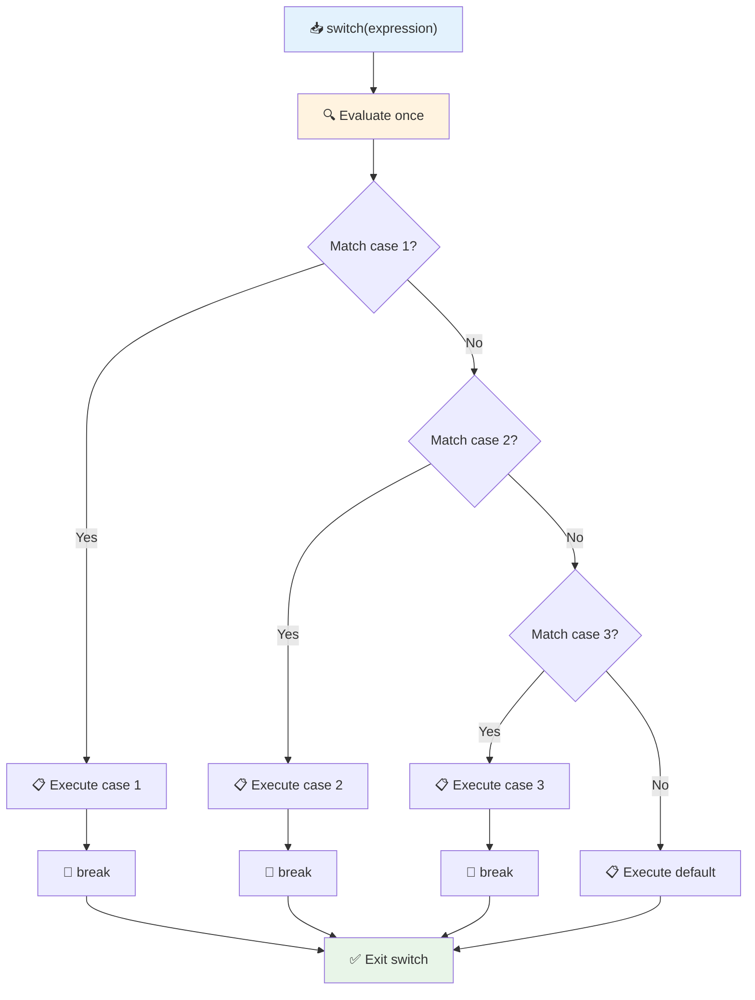

✅ Metti alla prova la tua comprensione di questo codice e del codice seguente eseguendolo nella console del browser. Cambia i valori della variabile a per modificare il risultato di `console.log()`.

### 🔄 **Padronanza del Switch: Opzioni multiple**

**Metti alla prova la tua comprensione del switch:**
- Cosa succede se dimentichi un'istruzione `break`?
- Quando useresti `switch` invece di più istruzioni `if-else`?
- Perché il caso `default` è utile anche se pensi di aver coperto tutte le possibilità?

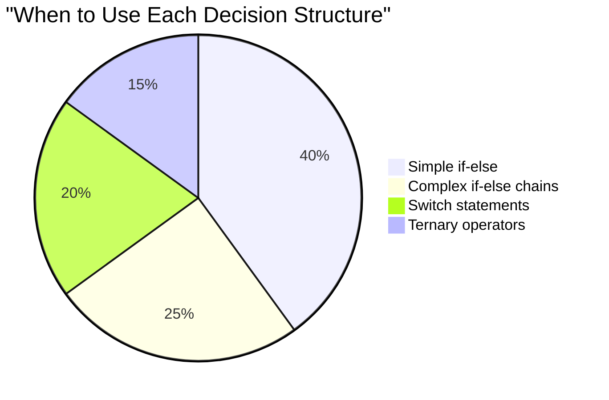

> **Migliore pratica**: Usa `switch` quando confronti una variabile con più valori specifici. Usa `if-else` per controlli di intervallo o condizioni complesse!

## Operatori Logici e Booleani

Le decisioni complesse spesso richiedono la valutazione simultanea di più condizioni. Proprio come l'algebra booleana permette ai matematici di combinare espressioni logiche, la programmazione fornisce operatori logici per collegare più condizioni booleane.

Questi operatori permettono una logica condizionale sofisticata combinando semplici valutazioni true/false.

| Simbolo | Descrizione                                                                                     | Esempio                                                                 |
| ------ | ----------------------------------------------------------------------------------------------- | ----------------------------------------------------------------------- |
| `&&`   | **AND logico**: Confronta due espressioni booleane. Restituisce true **solo** se entrambe le parti sono vere | `(5 > 3) && (5 < 10) // Entrambe le parti sono vere. Restituisce true` |
| `\|\|` | **OR logico**: Confronta due espressioni booleane. Restituisce true se almeno una parte è vera     | `(5 > 10) \|\| (5 < 10) // Una parte è falsa, l'altra è vera. Restituisce true` |
| `!`    | **NOT logico**: Restituisce il valore opposto di un'espressione booleana                             | `!(5 > 10) // 5 non è maggiore di 10, quindi "!" lo rende vero`         |

Questi operatori ti permettono di combinare condizioni in modi utili:
- AND (`&&`) significa che entrambe le condizioni devono essere vere
- OR (`||`) significa che almeno una condizione deve essere vera  
- NOT (`!`) inverte true in false (e viceversa)

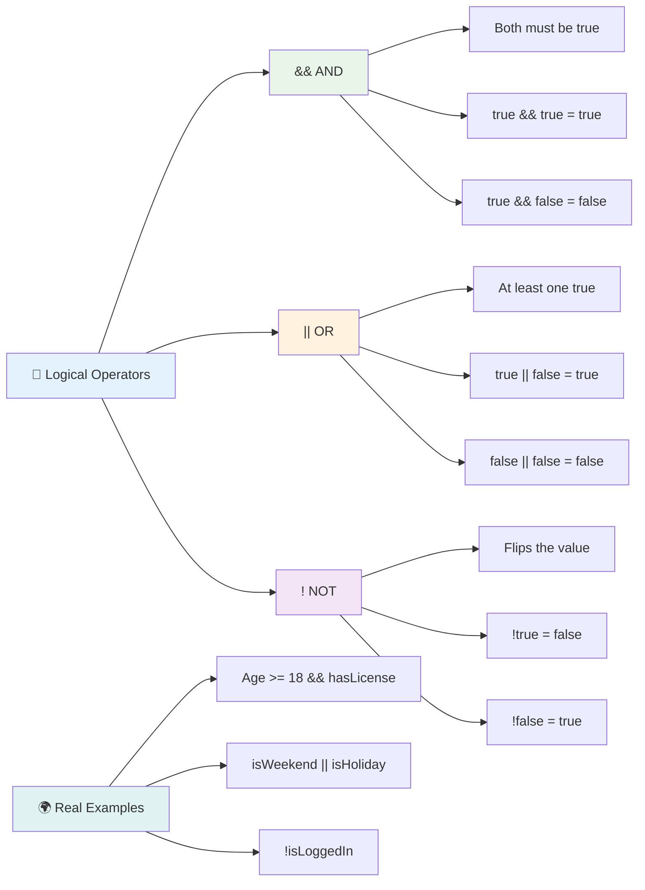

## Condizioni e decisioni con operatori logici

Vediamo questi operatori logici in azione con un esempio più realistico:

```javascript
let currentMoney = 600;
let laptopPrice = 800;
let laptopDiscountPrice = laptopPrice - (laptopPrice * 0.2); // Laptop price at 20 percent off

if (currentMoney >= laptopPrice || currentMoney >= laptopDiscountPrice) {
  // Condition is true. Code in this block will run.
  console.log("Getting a new laptop!");
} else {
  // Condition is false. Code in this block will run.
  console.log("Can't afford a new laptop, yet!");
}
```

In questo esempio: calcoliamo un prezzo scontato del 20% (640), quindi valutiamo se i nostri fondi disponibili coprono il prezzo pieno O il prezzo scontato. Poiché 600 soddisfa la soglia del prezzo scontato di 640, la condizione si valuta come vera.

### 🧮 **Controllo degli operatori logici: Combinare le condizioni**

**Metti alla prova la tua comprensione degli operatori logici:**
- Nell'espressione `A && B`, cosa succede se A è falso? B viene comunque valutato?
- Riesci a pensare a una situazione in cui avresti bisogno di tutti e tre gli operatori (&&, ||, !)?
- Qual è la differenza tra `!user.isActive` e `user.isActive !== true`?

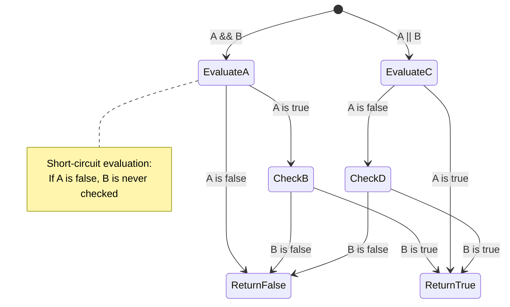

> **Suggerimento sulle prestazioni**: JavaScript utilizza la "valutazione a corto circuito" - in `A && B`, se A è falso, B non viene nemmeno valutato. Usa questo a tuo vantaggio!

### Operatore di Negazione

A volte è più facile pensare a quando qualcosa NON è vero. Ad esempio, invece di chiedere "L'utente è connesso?", potresti voler chiedere "L'utente NON è connesso?" L'operatore punto esclamativo (`!`) inverte la logica per te.

```javascript
if (!condition) {
  // runs if condition is false
} else {
  // runs if condition is true
}
```

L'operatore `!` è come dire "il contrario di..." – se qualcosa è `true`, `!` lo rende `false`, e viceversa.

### Espressioni Ternarie

Per assegnazioni condizionali semplici, JavaScript fornisce l'**operatore ternario**. Questa sintassi concisa ti permette di scrivere un'espressione condizionale in una sola riga, utile quando devi assegnare uno di due valori basandoti su una condizione.

```javascript
let variable = condition ? returnThisIfTrue : returnThisIfFalse;
```

Si legge come una domanda: "Questa condizione è vera? Se sì, usa questo valore. Se no, usa quell'altro valore."

Ecco un esempio più concreto:

```javascript
let firstNumber = 20;
let secondNumber = 10;
let biggestNumber = firstNumber > secondNumber ? firstNumber : secondNumber;
```

✅ Prenditi un minuto per leggere questo codice alcune volte. Capisci come funzionano questi operatori?

Ecco cosa dice questa riga: "Il `firstNumber` è maggiore del `secondNumber`? Se sì, metti `firstNumber` in `biggestNumber`. Se no, metti `secondNumber` in `biggestNumber`."

L'operatore ternario è solo un modo più breve per scrivere questa tradizionale istruzione `if..else`:

```javascript
let biggestNumber;
if (firstNumber > secondNumber) {
  biggestNumber = firstNumber;
} else {
  biggestNumber = secondNumber;
}
```

Entrambi gli approcci producono risultati identici. L'operatore ternario offre concisione, mentre la struttura tradizionale if-else può essere più leggibile per condizioni complesse.

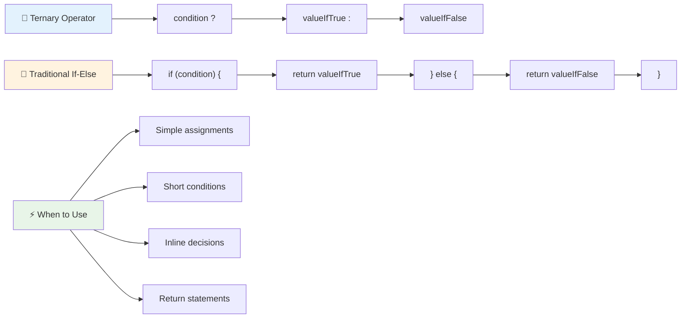

---

## 🚀 Sfida

Crea un programma scritto prima con operatori logici, e poi riscrivilo usando un'espressione ternaria. Qual è la tua sintassi preferita?

---

## Sfida GitHub Copilot Agent 🚀

Usa la modalità Agent per completare la seguente sfida:

**Descrizione:** Crea un calcolatore di voti completo che dimostri diversi concetti di decision-making da questa lezione, inclusi if-else statements, switch statements, operatori logici ed espressioni ternarie.

**Prompt:** Scrivi un programma JavaScript che prenda il punteggio numerico di uno studente (0-100) e determini il voto letterale usando i seguenti criteri:
- A: 90-100
- B: 80-89  
- C: 70-79
- D: 60-69
- F: Inferiore a 60

Requisiti:
1. Usa un'istruzione if-else per determinare il voto letterale
2. Usa operatori logici per verificare se lo studente supera (voto >= 60) E ha lode (voto >= 90)
3. Usa un'istruzione switch per fornire un feedback specifico per ogni voto letterale
4. Usa un operatore ternario per determinare se lo studente è idoneo per il corso successivo (voto >= 70)
5. Includi la validazione dell'input per assicurarti che il punteggio sia compreso tra 0 e 100

Testa il tuo programma con vari punteggi, inclusi casi limite come 59, 60, 89, 90 e input non validi.

Scopri di più su [agent mode](https://code.visualstudio.com/blogs/2025/02/24/introducing-copilot-agent-mode) qui.


## Quiz post-lezione

[Quiz post-lezione](https://ff-quizzes.netlify.app/web/quiz/12)

## Revisione e studio autonomo

Leggi di più sui numerosi operatori disponibili per l'utente [su MDN](https://developer.mozilla.org/docs/Web/JavaScript/Reference/Operators).

Consulta il fantastico [operator lookup](https://joshwcomeau.com/operator-lookup/) di Josh Comeau!

## Compito

[Operatori](assignment.md)

---

## 🧠 **Riepilogo del tuo kit di strumenti per il processo decisionale**

```mermaid
graph TD
    A["🎯 JavaScript Decisions"] --> B["🔍 Boolean Logic"]
    A --> C["📊 Conditional Statements"]
    A --> D["🔗 Logical Operators"]
    A --> E["⚡ Advanced Patterns"]
    
    B --> B1["true/false values"]
    B --> B2["Comparison operators"]
    B --> B3["Truthiness concepts"]
    
    C --> C1["if statements"]
    C --> C2["if-else chains"]
    C --> C3["switch statements"]
    
    D --> D1["&& (AND)"]
    D --> D2["|| (OR)"]
    D --> D3["! (NOT)"]
    
    E --> E1["Ternary operator"]
    E --> E2["Short-circuit evaluation"]
    E --> E3["Complex conditions"]
    
    F["💡 Key Principles"] --> F1["Clear readable conditions"]
    F --> F2["Consistent comparison style"]
    F --> F3["Proper operator precedence"]
    F --> F4["Efficient evaluation order"]
    
    style A fill:#e3f2fd
    style B fill:#e8f5e8
    style C fill:#fff3e0
    style D fill:#f3e5f5
    style E fill:#e0f2f1
    style F fill:#fce4ec
```

---

## 🚀 La tua timeline per padroneggiare il processo decisionale in JavaScript

### ⚡ **Cosa puoi fare nei prossimi 5 minuti**
- [ ] Pratica gli operatori di confronto nella console del browser
- [ ] Scrivi una semplice istruzione if-else che controlla la tua età
- [ ] Prova la sfida: riscrivi un if-else usando un operatore ternario
- [ ] Testa cosa succede con diversi valori "truthy" e "falsy"

### 🎯 **Cosa puoi realizzare in quest'ora**
- [ ] Completa il quiz post-lezione e rivedi eventuali concetti poco chiari
- [ ] Crea il calcolatore di voti completo dalla sfida di GitHub Copilot
- [ ] Crea un semplice albero decisionale per uno scenario reale (come scegliere cosa indossare)
- [ ] Pratica la combinazione di più condizioni con operatori logici
- [ ] Sperimenta con le istruzioni switch per diversi casi d'uso

### 📅 **La tua padronanza della logica in una settimana**
- [ ] Completa il compito sugli operatori con esempi creativi
- [ ] Crea un'applicazione di mini quiz utilizzando varie strutture condizionali
- [ ] Crea un validatore di moduli che controlla più condizioni di input
- [ ] Pratica gli esercizi di [operator lookup](https://joshwcomeau.com/operator-lookup/) di Josh Comeau
- [ ] Rifattorizza il codice esistente per utilizzare strutture condizionali più appropriate
- [ ] Studia la valutazione a corto circuito e le implicazioni sulle prestazioni

### 🌟 **La tua trasformazione in un mese**
- [ ] Padroneggia condizioni nidificate complesse mantenendo la leggibilità del codice
- [ ] Crea un'applicazione con logica decisionale sofisticata
- [ ] Contribuisci al codice open source migliorando la logica condizionale in progetti esistenti
- [ ] Insegna a qualcun altro le diverse strutture condizionali e quando usarle
- [ ] Esplora approcci di programmazione funzionale alla logica condizionale
- [ ] Crea una guida di riferimento personale per le migliori pratiche condizionali

### 🏆 **Check-in finale per il campione del processo decisionale**

**Celebra la tua padronanza del pensiero logico:**
- Qual è la logica decisionale più complessa che hai implementato con successo?
- Quale struttura condizionale ti sembra più naturale e perché?
- In che modo imparare sugli operatori logici ha cambiato il tuo approccio alla risoluzione dei problemi?
- Quale applicazione reale trarrebbe beneficio da una logica decisionale sofisticata?

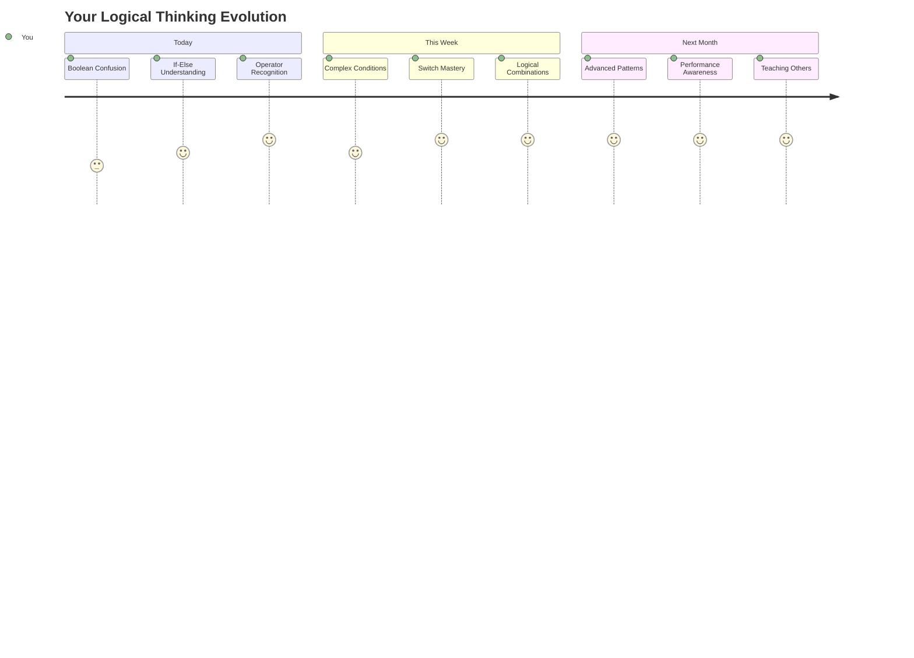

> 🧠 **Hai padroneggiato l'arte del processo decisionale digitale!** Ogni applicazione interattiva si basa sulla logica condizionale per rispondere in modo intelligente alle azioni degli utenti e alle condizioni che cambiano. Ora comprendi come far pensare, valutare e scegliere risposte appropriate ai tuoi programmi. Questa base logica alimenterà ogni applicazione dinamica che costruirai! 🎉

---

**Disclaimer**:  
Questo documento è stato tradotto utilizzando il servizio di traduzione AI [Co-op Translator](https://github.com/Azure/co-op-translator). Sebbene ci impegniamo per garantire l'accuratezza, si prega di notare che le traduzioni automatiche potrebbero contenere errori o imprecisioni. Il documento originale nella sua lingua nativa dovrebbe essere considerato la fonte autorevole. Per informazioni critiche, si raccomanda una traduzione professionale umana. Non siamo responsabili per eventuali incomprensioni o interpretazioni errate derivanti dall'uso di questa traduzione.