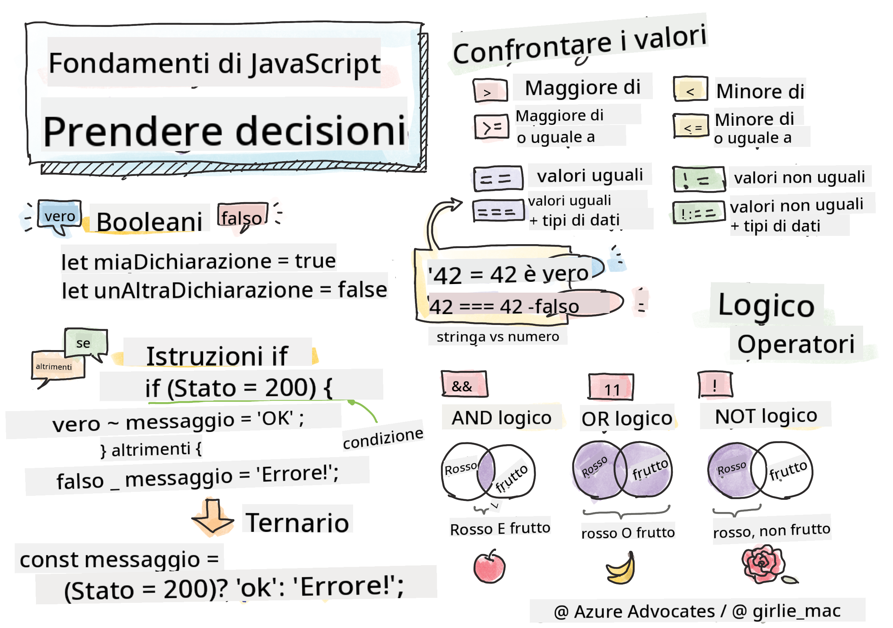

<!--
CO_OP_TRANSLATOR_METADATA:
{
  "original_hash": "888609c48329c280ca2477d2df40f2e5",
  "translation_date": "2025-08-25T21:36:42+00:00",
  "source_file": "2-js-basics/3-making-decisions/README.md",
  "language_code": "it"
}
-->
# Concetti di base di JavaScript: Prendere decisioni



> Sketchnote di [Tomomi Imura](https://twitter.com/girlie_mac)

## Quiz Pre-Lezione

[Quiz pre-lezione](https://ashy-river-0debb7803.1.azurestaticapps.net/quiz/11)

Prendere decisioni e controllare l'ordine in cui il tuo codice viene eseguito rende il codice riutilizzabile e robusto. Questa sezione copre la sintassi per controllare il flusso dei dati in JavaScript e la sua importanza quando viene utilizzata con i tipi di dati Booleani.

[](https://youtube.com/watch?v=SxTp8j-fMMY "Prendere decisioni")

> 🎥 Clicca sull'immagine sopra per un video su come prendere decisioni.

> Puoi seguire questa lezione su [Microsoft Learn](https://docs.microsoft.com/learn/modules/web-development-101-if-else/?WT.mc_id=academic-77807-sagibbon)!

## Un breve riepilogo sui Booleani

I Booleani possono avere solo due valori: `true` o `false`. I Booleani aiutano a decidere quali righe di codice devono essere eseguite quando vengono soddisfatte determinate condizioni.

Imposta il tuo booleano su true o false in questo modo:

`let myTrueBool = true`  
`let myFalseBool = false`

✅ I Booleani prendono il nome dal matematico, filosofo e logico inglese George Boole (1815–1864).

## Operatori di confronto e Booleani

Gli operatori vengono utilizzati per valutare condizioni facendo confronti che generano un valore Booleano. Di seguito è riportato un elenco di operatori frequentemente utilizzati.

| Simbolo | Descrizione                                                                                                                                                   | Esempio            |
| ------- | ------------------------------------------------------------------------------------------------------------------------------------------------------------- | ------------------ |
| `<`     | **Minore di**: Confronta due valori e restituisce il valore Booleano `true` se il valore a sinistra è minore di quello a destra                               | `5 < 6 // true`    |
| `<=`    | **Minore o uguale a**: Confronta due valori e restituisce il valore Booleano `true` se il valore a sinistra è minore o uguale a quello a destra               | `5 <= 6 // true`   |
| `>`     | **Maggiore di**: Confronta due valori e restituisce il valore Booleano `true` se il valore a sinistra è maggiore di quello a destra                          | `5 > 6 // false`   |
| `>=`    | **Maggiore o uguale a**: Confronta due valori e restituisce il valore Booleano `true` se il valore a sinistra è maggiore o uguale a quello a destra          | `5 >= 6 // false`  |
| `===`   | **Uguaglianza stretta**: Confronta due valori e restituisce il valore Booleano `true` se i valori a destra e a sinistra sono uguali E dello stesso tipo       | `5 === 6 // false` |
| `!==`   | **Diversità**: Confronta due valori e restituisce il valore Booleano opposto a quello che restituirebbe un operatore di uguaglianza stretta                   | `5 !== 6 // true`  |

✅ Metti alla prova le tue conoscenze scrivendo alcuni confronti nella console del tuo browser. Qualche dato restituito ti sorprende?

## Istruzione If

L'istruzione `if` eseguirà il codice tra i suoi blocchi se la condizione è vera.

```javascript
if (condition) {
  //Condition is true. Code in this block will run.
}
```

Gli operatori logici vengono spesso utilizzati per formare la condizione.

```javascript
let currentMoney;
let laptopPrice;

if (currentMoney >= laptopPrice) {
  //Condition is true. Code in this block will run.
  console.log("Getting a new laptop!");
}
```

## Istruzione If..Else

L'istruzione `else` eseguirà il codice tra i suoi blocchi quando la condizione è falsa. È opzionale con un'istruzione `if`.

```javascript
let currentMoney;
let laptopPrice;

if (currentMoney >= laptopPrice) {
  //Condition is true. Code in this block will run.
  console.log("Getting a new laptop!");
} else {
  //Condition is false. Code in this block will run.
  console.log("Can't afford a new laptop, yet!");
}
```

✅ Metti alla prova la tua comprensione di questo codice e del codice seguente eseguendolo nella console di un browser. Cambia i valori delle variabili `currentMoney` e `laptopPrice` per modificare il risultato di `console.log()`.

## Istruzione Switch

L'istruzione `switch` viene utilizzata per eseguire azioni diverse in base a condizioni diverse. Usa l'istruzione `switch` per selezionare uno dei tanti blocchi di codice da eseguire.

```javascript
switch (expression) {
  case x:
    // code block
    break;
  case y:
    // code block
    break;
  default:
  // code block
}
```

```javascript
// program using switch statement
let a = 2;

switch (a) {
  case 1:
    a = "one";
    break;
  case 2:
    a = "two";
    break;
  default:
    a = "not found";
    break;
}
console.log(`The value is ${a}`);
```

✅ Metti alla prova la tua comprensione di questo codice e del codice seguente eseguendolo nella console di un browser. Cambia i valori della variabile `a` per modificare il risultato di `console.log()`.

## Operatori logici e Booleani

Le decisioni potrebbero richiedere più di un confronto e possono essere concatenate con operatori logici per produrre un valore Booleano.

| Simbolo | Descrizione                                                                                     | Esempio                                                                 |
| ------- | ----------------------------------------------------------------------------------------------- | ----------------------------------------------------------------------- |
| `&&`    | **AND logico**: Confronta due espressioni Booleane. Restituisce true **solo** se entrambe sono vere | `(5 > 6) && (5 < 6 ) //Una parte è falsa, l'altra è vera. Restituisce false` |
| `\|\|`  | **OR logico**: Confronta due espressioni Booleane. Restituisce true se almeno una parte è vera     | `(5 > 6) \|\| (5 < 6) //Una parte è falsa, l'altra è vera. Restituisce true` |
| `!`     | **NOT logico**: Restituisce il valore opposto di un'espressione Booleana                          | `!(5 > 6) // 5 non è maggiore di 6, ma "!" restituirà true`             |

## Condizioni e decisioni con operatori logici

Gli operatori logici possono essere utilizzati per formare condizioni in istruzioni if..else.

```javascript
let currentMoney;
let laptopPrice;
let laptopDiscountPrice = laptopPrice - laptopPrice * 0.2; //Laptop price at 20 percent off

if (currentMoney >= laptopPrice || currentMoney >= laptopDiscountPrice) {
  //Condition is true. Code in this block will run.
  console.log("Getting a new laptop!");
} else {
  //Condition is true. Code in this block will run.
  console.log("Can't afford a new laptop, yet!");
}
```

### Operatore di negazione

Finora hai visto come puoi usare un'istruzione `if...else` per creare logica condizionale. Qualsiasi cosa inserita in un `if` deve valutarsi come true/false. Utilizzando l'operatore `!` puoi _negare_ l'espressione. Sarebbe così:

```javascript
if (!condition) {
  // runs if condition is false
} else {
  // runs if condition is true
}
```

### Espressioni ternarie

`if...else` non è l'unico modo per esprimere la logica decisionale. Puoi anche utilizzare qualcosa chiamato operatore ternario. La sintassi è la seguente:

```javascript
let variable = condition ? <return this if true> : <return this if false>
```

Di seguito un esempio più concreto:

```javascript
let firstNumber = 20;
let secondNumber = 10;
let biggestNumber = firstNumber > secondNumber ? firstNumber : secondNumber;
```

✅ Prenditi un minuto per leggere questo codice alcune volte. Capisci come funzionano questi operatori?

Il codice sopra afferma che:

- se `firstNumber` è maggiore di `secondNumber`
- allora assegna `firstNumber` a `biggestNumber`
- altrimenti assegna `secondNumber`.

L'espressione ternaria è solo un modo compatto di scrivere il codice seguente:

```javascript
let biggestNumber;
if (firstNumber > secondNumber) {
  biggestNumber = firstNumber;
} else {
  biggestNumber = secondNumber;
}
```

---

## 🚀 Sfida

Crea un programma scritto prima con operatori logici, e poi riscrivilo utilizzando un'espressione ternaria. Qual è la tua sintassi preferita?

---

## Quiz Post-Lezione

[Quiz post-lezione](https://ashy-river-0debb7803.1.azurestaticapps.net/quiz/12)

## Revisione e studio autonomo

Leggi di più sui numerosi operatori disponibili per l'utente [su MDN](https://developer.mozilla.org/docs/Web/JavaScript/Reference/Operators).

Consulta il fantastico [operator lookup](https://joshwcomeau.com/operator-lookup/) di Josh Comeau!

## Compito

[Operatori](assignment.md)

**Disclaimer**:  
Questo documento è stato tradotto utilizzando il servizio di traduzione automatica [Co-op Translator](https://github.com/Azure/co-op-translator). Sebbene ci impegniamo per garantire l'accuratezza, si prega di notare che le traduzioni automatiche possono contenere errori o imprecisioni. Il documento originale nella sua lingua nativa dovrebbe essere considerato la fonte autorevole. Per informazioni critiche, si raccomanda una traduzione professionale effettuata da un traduttore umano. Non siamo responsabili per eventuali incomprensioni o interpretazioni errate derivanti dall'uso di questa traduzione.