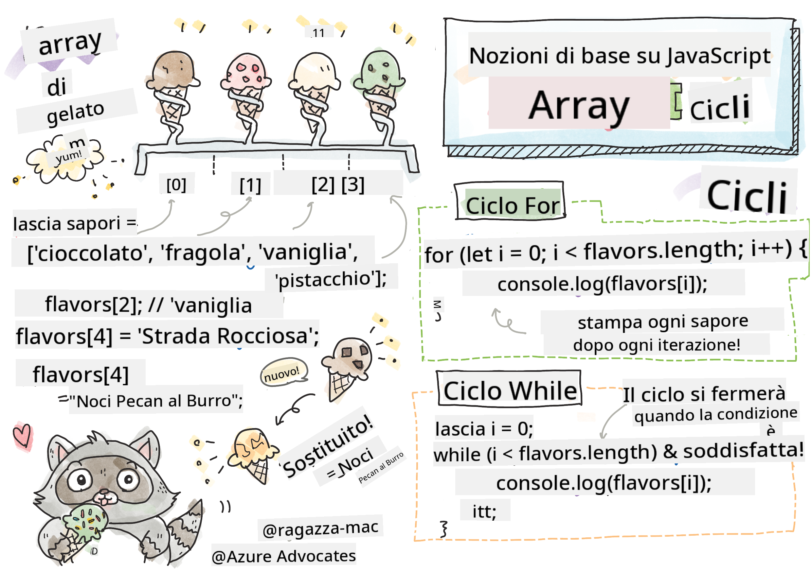

<!--
CO_OP_TRANSLATOR_METADATA:
{
  "original_hash": "3f7f87871312cf6cc12662da7d973182",
  "translation_date": "2025-08-25T21:49:33+00:00",
  "source_file": "2-js-basics/4-arrays-loops/README.md",
  "language_code": "it"
}
-->
# Fondamenti di JavaScript: Array e Cicli


> Sketchnote di [Tomomi Imura](https://twitter.com/girlie_mac)

## Quiz Pre-Lezione
[Quiz pre-lezione](https://ashy-river-0debb7803.1.azurestaticapps.net/quiz/13)

Questa lezione copre i fondamenti di JavaScript, il linguaggio che fornisce interattività sul web. In questa lezione imparerai gli array e i cicli, che vengono utilizzati per manipolare i dati.

[](https://youtube.com/watch?v=1U4qTyq02Xw "Array")

[](https://www.youtube.com/watch?v=Eeh7pxtTZ3k "Cicli")

> 🎥 Clicca sulle immagini sopra per guardare i video su array e cicli.

> Puoi seguire questa lezione su [Microsoft Learn](https://docs.microsoft.com/learn/modules/web-development-101-arrays/?WT.mc_id=academic-77807-sagibbon)!

## Array

Lavorare con i dati è un compito comune in qualsiasi linguaggio, ed è molto più semplice quando i dati sono organizzati in un formato strutturato, come gli array. Con gli array, i dati vengono memorizzati in una struttura simile a una lista. Uno dei principali vantaggi degli array è che puoi memorizzare diversi tipi di dati in un unico array.

✅ Gli array sono ovunque intorno a noi! Riesci a pensare a un esempio reale di un array, come un array di pannelli solari?

La sintassi per un array è una coppia di parentesi quadre.

```javascript
let myArray = [];
```

Questo è un array vuoto, ma gli array possono essere dichiarati già popolati con dati. I valori multipli in un array sono separati da una virgola.

```javascript
let iceCreamFlavors = ["Chocolate", "Strawberry", "Vanilla", "Pistachio", "Rocky Road"];
```

I valori dell'array sono assegnati a un valore unico chiamato **indice**, un numero intero assegnato in base alla distanza dall'inizio dell'array. Nell'esempio sopra, il valore stringa "Chocolate" ha un indice di 0, e l'indice di "Rocky Road" è 4. Usa l'indice con le parentesi quadre per recuperare, modificare o inserire valori nell'array.

✅ Ti sorprende che gli array inizino dall'indice zero? In alcuni linguaggi di programmazione, gli indici iniziano da 1. C'è una storia interessante su questo, che puoi [leggere su Wikipedia](https://en.wikipedia.org/wiki/Zero-based_numbering).

```javascript
let iceCreamFlavors = ["Chocolate", "Strawberry", "Vanilla", "Pistachio", "Rocky Road"];
iceCreamFlavors[2]; //"Vanilla"
```

Puoi utilizzare l'indice per cambiare un valore, come in questo esempio:

```javascript
iceCreamFlavors[4] = "Butter Pecan"; //Changed "Rocky Road" to "Butter Pecan"
```

E puoi inserire un nuovo valore in un determinato indice in questo modo:

```javascript
iceCreamFlavors[5] = "Cookie Dough"; //Added "Cookie Dough"
```

✅ Un modo più comune per aggiungere valori a un array è utilizzare operatori come array.push()

Per scoprire quanti elementi ci sono in un array, usa la proprietà `length`.

```javascript
let iceCreamFlavors = ["Chocolate", "Strawberry", "Vanilla", "Pistachio", "Rocky Road"];
iceCreamFlavors.length; //5
```

✅ Prova tu stesso! Usa la console del tuo browser per creare e manipolare un array di tua creazione.

## Cicli

I cicli ci permettono di eseguire compiti ripetitivi o **iterativi**, e possono far risparmiare molto tempo e codice. Ogni iterazione può variare nei suoi valori, variabili e condizioni. Esistono diversi tipi di cicli in JavaScript, e tutti hanno piccole differenze, ma essenzialmente fanno la stessa cosa: iterare sui dati.

### Ciclo For

Il ciclo `for` richiede 3 parti per iterare:
- `counter` Una variabile che di solito viene inizializzata con un numero che conta il numero di iterazioni
- `condition` Un'espressione che utilizza operatori di confronto per far terminare il ciclo quando risulta `false`
- `iteration-expression` Eseguita alla fine di ogni iterazione, di solito utilizzata per modificare il valore del contatore
  
```javascript
// Counting up to 10
for (let i = 0; i < 10; i++) {
  console.log(i);
}
```

✅ Esegui questo codice nella console del browser. Cosa succede se apporti piccole modifiche al contatore, alla condizione o all'espressione di iterazione? Riesci a farlo funzionare al contrario, creando un conto alla rovescia?

### Ciclo While

A differenza della sintassi del ciclo `for`, i cicli `while` richiedono solo una condizione che fermerà il ciclo quando la condizione diventa `false`. Le condizioni nei cicli di solito si basano su altri valori come i contatori, e devono essere gestite durante il ciclo. I valori iniziali per i contatori devono essere creati al di fuori del ciclo, e qualsiasi espressione per soddisfare una condizione, incluso il cambiamento del contatore, deve essere mantenuta all'interno del ciclo.

```javascript
//Counting up to 10
let i = 0;
while (i < 10) {
 console.log(i);
 i++;
}
```

✅ Perché sceglieresti un ciclo for rispetto a un ciclo while? 17.000 utenti avevano la stessa domanda su StackOverflow, e alcune delle opinioni [potrebbero interessarti](https://stackoverflow.com/questions/39969145/while-loops-vs-for-loops-in-javascript).

## Cicli e Array

Gli array vengono spesso utilizzati con i cicli perché la maggior parte delle condizioni richiede la lunghezza dell'array per fermare il ciclo, e l'indice può anche essere il valore del contatore.

```javascript
let iceCreamFlavors = ["Chocolate", "Strawberry", "Vanilla", "Pistachio", "Rocky Road"];

for (let i = 0; i < iceCreamFlavors.length; i++) {
  console.log(iceCreamFlavors[i]);
} //Ends when all flavors are printed
```

✅ Sperimenta con l'iterazione su un array di tua creazione nella console del browser. 

---

## 🚀 Sfida

Esistono altri modi per iterare sugli array oltre ai cicli for e while. Ci sono [forEach](https://developer.mozilla.org/docs/Web/JavaScript/Reference/Global_Objects/Array/forEach), [for-of](https://developer.mozilla.org/docs/Web/JavaScript/Reference/Statements/for...of), e [map](https://developer.mozilla.org/docs/Web/JavaScript/Reference/Global_Objects/Array/map). Riscrivi il tuo ciclo sull'array utilizzando una di queste tecniche.

## Quiz Post-Lezione
[Quiz post-lezione](https://ashy-river-0debb7803.1.azurestaticapps.net/quiz/14)

## Revisione e Studio Autonomo

Gli array in JavaScript hanno molti metodi associati, estremamente utili per la manipolazione dei dati. [Leggi questi metodi](https://developer.mozilla.org/docs/Web/JavaScript/Reference/Global_Objects/Array) e provali su un array di tua creazione (come push, pop, slice e splice).

## Compito

[Iterare un Array](assignment.md)

**Disclaimer**:  
Questo documento è stato tradotto utilizzando il servizio di traduzione automatica [Co-op Translator](https://github.com/Azure/co-op-translator). Sebbene ci impegniamo per garantire l'accuratezza, si prega di notare che le traduzioni automatiche potrebbero contenere errori o imprecisioni. Il documento originale nella sua lingua nativa dovrebbe essere considerato la fonte autorevole. Per informazioni critiche, si raccomanda una traduzione professionale effettuata da un traduttore umano. Non siamo responsabili per eventuali incomprensioni o interpretazioni errate derivanti dall'uso di questa traduzione.