<!--
CO_OP_TRANSLATOR_METADATA:
{
  "original_hash": "1710a50a519a6e4a1b40a5638783018d",
  "translation_date": "2025-11-04T00:19:49+00:00",
  "source_file": "2-js-basics/4-arrays-loops/README.md",
  "language_code": "it"
}
-->
# Fondamenti di JavaScript: Array e Cicli


> Sketchnote di [Tomomi Imura](https://twitter.com/girlie_mac)


## Quiz Pre-Lettura
[Quiz pre-lettura](https://ff-quizzes.netlify.app/web/quiz/13)

Ti sei mai chiesto come i siti web tengano traccia degli articoli nel carrello o mostrino la lista dei tuoi amici? Ecco dove entrano in gioco gli array e i cicli. Gli array sono come contenitori digitali che conservano più informazioni, mentre i cicli ti permettono di lavorare con tutti quei dati in modo efficiente senza dover scrivere codice ripetitivo.

Insieme, questi due concetti formano la base per gestire le informazioni nei tuoi programmi. Imparerai a passare dal scrivere manualmente ogni singolo passaggio al creare codice intelligente ed efficiente che può elaborare centinaia o persino migliaia di elementi rapidamente.

Alla fine di questa lezione, capirai come svolgere compiti complessi sui dati con poche righe di codice. Esploriamo questi concetti essenziali di programmazione.

[](https://youtube.com/watch?v=1U4qTyq02Xw "Array")

[](https://www.youtube.com/watch?v=Eeh7pxtTZ3k "Cicli")

> 🎥 Clicca sulle immagini sopra per i video sugli array e sui cicli.

> Puoi seguire questa lezione su [Microsoft Learn](https://docs.microsoft.com/learn/modules/web-development-101-arrays/?WT.mc_id=academic-77807-sagibbon)!

```mermaid
mindmap
  root((Data Processing))
    Arrays
      Structure
        Square brackets syntax
        Zero-based indexing
        Dynamic sizing
      Operations
        push/pop
        shift/unshift
        indexOf/includes
      Types
        Numbers array
        Strings array
        Mixed types
    Loops
      For Loops
        Counting iterations
        Array processing
        Predictable flow
      While Loops
        Condition-based
        Unknown iterations
        User input
      Modern Syntax
        for...of
        forEach
        Functional methods
    Applications
      Data Analysis
        Statistics
        Filtering
        Transformations
      User Interfaces
        Lists
        Menus
        Galleries
```



## Array

Pensa agli array come a un archivio digitale: invece di conservare un documento per cassetto, puoi organizzare più elementi correlati in un unico contenitore strutturato. In termini di programmazione, gli array ti permettono di conservare più informazioni in un unico pacchetto organizzato.

Che tu stia costruendo una galleria fotografica, gestendo una lista di cose da fare o tenendo traccia dei punteggi più alti in un gioco, gli array forniscono la base per l'organizzazione dei dati. Vediamo come funzionano.

✅ Gli array sono ovunque! Riesci a pensare a un esempio reale di un array, come un pannello solare?

### Creare Array

Creare un array è molto semplice: basta usare le parentesi quadre!

```javascript
// Empty array - like an empty shopping cart waiting for items
const myArray = [];
```

**Cosa sta succedendo qui?**
Hai appena creato un contenitore vuoto usando quelle parentesi quadre `[]`. Pensalo come uno scaffale vuoto in una biblioteca: è pronto a contenere qualsiasi libro tu voglia organizzare lì.

Puoi anche riempire il tuo array con valori iniziali fin dall'inizio:

```javascript
// Your ice cream shop's flavor menu
const iceCreamFlavors = ["Chocolate", "Strawberry", "Vanilla", "Pistachio", "Rocky Road"];

// A user's profile info (mixing different types of data)
const userData = ["John", 25, true, "developer"];

// Test scores for your favorite class
const scores = [95, 87, 92, 78, 85];
```

**Cose interessanti da notare:**
- Puoi conservare testo, numeri o persino valori vero/falso nello stesso array
- Basta separare ogni elemento con una virgola - facile!
- Gli array sono perfetti per mantenere insieme informazioni correlate

```mermaid
flowchart LR
    A["📦 Arrays"] --> B["Create [ ]"]
    A --> C["Store Multiple Items"]
    A --> D["Access by Index"]
    
    B --> B1["const arr = []"]
    B --> B2["const arr = [1,2,3]"]
    
    C --> C1["Numbers"]
    C --> C2["Strings"]
    C --> C3["Booleans"]
    C --> C4["Mixed Types"]
    
    D --> D1["arr[0] = first"]
    D --> D2["arr[1] = second"]
    D --> D3["arr[2] = third"]
    
    E["📊 Array Index"] --> E1["Index 0: First"]
    E --> E2["Index 1: Second"]
    E --> E3["Index 2: Third"]
    E --> E4["Index n-1: Last"]
    
    style A fill:#e3f2fd
    style B fill:#e8f5e8
    style C fill:#fff3e0
    style D fill:#f3e5f5
    style E fill:#e0f2f1
```



### Indicizzazione degli Array

Ecco qualcosa che potrebbe sembrare insolito all'inizio: gli array numerano i loro elementi a partire da 0, non da 1. Questa indicizzazione basata su zero ha le sue radici nel funzionamento della memoria del computer - è una convenzione di programmazione dai primi giorni dei linguaggi di programmazione come C. Ogni posizione nell'array ottiene un proprio numero di indirizzo chiamato **indice**.

| Indice | Valore | Descrizione |
|-------|-------|-------------|
| 0 | "Cioccolato" | Primo elemento |
| 1 | "Fragola" | Secondo elemento |
| 2 | "Vaniglia" | Terzo elemento |
| 3 | "Pistacchio" | Quarto elemento |
| 4 | "Rocky Road" | Quinto elemento |

✅ Ti sorprende che gli array inizino dall'indice zero? In alcuni linguaggi di programmazione, gli indici iniziano da 1. C'è una storia interessante su questo, che puoi [leggere su Wikipedia](https://en.wikipedia.org/wiki/Zero-based_numbering).

**Accesso agli Elementi dell'Array:**

```javascript
const iceCreamFlavors = ["Chocolate", "Strawberry", "Vanilla", "Pistachio", "Rocky Road"];

// Access individual elements using bracket notation
console.log(iceCreamFlavors[0]); // "Chocolate" - first element
console.log(iceCreamFlavors[2]); // "Vanilla" - third element
console.log(iceCreamFlavors[4]); // "Rocky Road" - last element
```

**Analisi di ciò che accade qui:**
- **Usa** la notazione con parentesi quadre e il numero dell'indice per accedere agli elementi
- **Restituisce** il valore conservato in quella posizione specifica dell'array
- **Inizia** a contare da 0, rendendo il primo elemento l'indice 0

**Modifica degli Elementi dell'Array:**

```javascript
// Change an existing value
iceCreamFlavors[4] = "Butter Pecan";
console.log(iceCreamFlavors[4]); // "Butter Pecan"

// Add a new element at the end
iceCreamFlavors[5] = "Cookie Dough";
console.log(iceCreamFlavors[5]); // "Cookie Dough"
```

**In quanto sopra, abbiamo:**
- **Modificato** l'elemento all'indice 4 da "Rocky Road" a "Butter Pecan"
- **Aggiunto** un nuovo elemento "Cookie Dough" all'indice 5
- **Espanso** automaticamente la lunghezza dell'array aggiungendo oltre i limiti attuali

### Lunghezza dell'Array e Metodi Comuni

Gli array hanno proprietà e metodi integrati che rendono il lavoro con i dati molto più semplice.

**Trovare la Lunghezza dell'Array:**

```javascript
const iceCreamFlavors = ["Chocolate", "Strawberry", "Vanilla", "Pistachio", "Rocky Road"];
console.log(iceCreamFlavors.length); // 5

// Length updates automatically as array changes
iceCreamFlavors.push("Mint Chip");
console.log(iceCreamFlavors.length); // 6
```

**Punti chiave da ricordare:**
- **Restituisce** il numero totale di elementi nell'array
- **Si aggiorna** automaticamente quando gli elementi vengono aggiunti o rimossi
- **Fornisce** un conteggio dinamico utile per i cicli e la validazione

**Metodi Essenziali degli Array:**

```javascript
const fruits = ["apple", "banana", "orange"];

// Add elements
fruits.push("grape");           // Adds to end: ["apple", "banana", "orange", "grape"]
fruits.unshift("strawberry");   // Adds to beginning: ["strawberry", "apple", "banana", "orange", "grape"]

// Remove elements
const lastFruit = fruits.pop();        // Removes and returns "grape"
const firstFruit = fruits.shift();     // Removes and returns "strawberry"

// Find elements
const index = fruits.indexOf("banana"); // Returns 1 (position of "banana")
const hasApple = fruits.includes("apple"); // Returns true
```

**Comprendere questi metodi:**
- **Aggiunge** elementi con `push()` (fine) e `unshift()` (inizio)
- **Rimuove** elementi con `pop()` (fine) e `shift()` (inizio)
- **Trova** elementi con `indexOf()` e verifica l'esistenza con `includes()`
- **Restituisce** valori utili come elementi rimossi o indici di posizione

✅ Prova tu stesso! Usa la console del tuo browser per creare e manipolare un array di tua creazione.

### 🧠 **Verifica Fondamenti degli Array: Organizzare i Tuoi Dati**

**Metti alla prova la tua comprensione degli array:**
- Perché pensi che gli array inizino a contare da 0 invece che da 1?
- Cosa succede se provi ad accedere a un indice che non esiste (come `arr[100]` in un array di 5 elementi)?
- Riesci a pensare a tre scenari reali in cui gli array sarebbero utili?


> **Insight reale**: Gli array sono ovunque nella programmazione! Feed dei social media, carrelli della spesa, gallerie fotografiche, canzoni delle playlist - dietro le quinte sono tutti array!

## Cicli

Pensa alla famosa punizione nei romanzi di Charles Dickens, dove gli studenti dovevano scrivere ripetutamente frasi su una lavagna. Immagina se potessi semplicemente dire a qualcuno "scrivi questa frase 100 volte" e farlo automaticamente. È esattamente ciò che i cicli fanno per il tuo codice.

I cicli sono come avere un assistente instancabile che può ripetere compiti senza errori. Che tu debba controllare ogni articolo in un carrello della spesa o mostrare tutte le foto in un album, i cicli gestiscono la ripetizione in modo efficiente.

JavaScript offre diversi tipi di cicli tra cui scegliere. Esaminiamoli e capiamo quando usarli.


### Ciclo For

Il ciclo `for` è come impostare un timer - sai esattamente quante volte vuoi che qualcosa accada. È super organizzato e prevedibile, il che lo rende perfetto quando lavori con gli array o devi contare qualcosa.

**Struttura del Ciclo For:**

| Componente | Scopo | Esempio |
|-----------|---------|----------|
| **Inizializzazione** | Imposta il punto di partenza | `let i = 0` |
| **Condizione** | Quando continuare | `i < 10` |
| **Incremento** | Come aggiornare | `i++` |

```javascript
// Counting from 0 to 9
for (let i = 0; i < 10; i++) {
  console.log(`Count: ${i}`);
}

// More practical example: processing scores
const testScores = [85, 92, 78, 96, 88];
for (let i = 0; i < testScores.length; i++) {
  console.log(`Student ${i + 1}: ${testScores[i]}%`);
}
```

**Passo dopo passo, ecco cosa succede:**
- **Inizializza** la variabile contatore `i` a 0 all'inizio
- **Controlla** la condizione `i < 10` prima di ogni iterazione
- **Esegue** il blocco di codice quando la condizione è vera
- **Incrementa** `i` di 1 dopo ogni iterazione con `i++`
- **Si ferma** quando la condizione diventa falsa (quando `i` raggiunge 10)

✅ Esegui questo codice nella console del browser. Cosa succede quando apporti piccole modifiche al contatore, alla condizione o all'espressione di iterazione? Riesci a farlo funzionare al contrario, creando un conto alla rovescia?

### 🗓️ **Verifica Padronanza del Ciclo For: Ripetizione Controllata**

**Valuta la tua comprensione del ciclo for:**
- Quali sono le tre parti di un ciclo for e cosa fa ciascuna?
- Come faresti a scorrere un array al contrario?
- Cosa succede se dimentichi la parte di incremento (`i++`)?

```mermaid
flowchart TD
    A["🚀 Start For Loop"] --> B["Initialize: let i = 0"]
    B --> C{"Condition: i < array.length?"}
    C -->|true| D["Execute code block"]
    D --> E["Increment: i++"]
    E --> C
    C -->|false| F["✅ Exit loop"]
    
    G["📋 Common Patterns"] --> G1["for(let i=0; i<n; i++)"]
    G --> G2["for(let i=n-1; i>=0; i--)"]
    G --> G3["for(let i=0; i<arr.length; i+=2)"]
    
    style A fill:#e3f2fd
    style F fill:#e8f5e8
    style G fill:#fff3e0
```



> **Saggezza sui cicli**: I cicli for sono perfetti quando sai esattamente quante volte devi ripetere qualcosa. Sono la scelta più comune per elaborare gli array!

### Ciclo While

Il ciclo `while` è come dire "continua a fare questo finché..." - potresti non sapere esattamente quante volte verrà eseguito, ma sai quando fermarti. È perfetto per cose come chiedere un input all'utente finché non ti dà ciò di cui hai bisogno, o cercare tra i dati finché non trovi ciò che stai cercando.

**Caratteristiche del Ciclo While:**
- **Continua** a eseguire finché la condizione è vera
- **Richiede** la gestione manuale di eventuali variabili contatore
- **Controlla** la condizione prima di ogni iterazione
- **Rischia** cicli infiniti se la condizione non diventa mai falsa

```javascript
// Basic counting example
let i = 0;
while (i < 10) {
  console.log(`While count: ${i}`);
  i++; // Don't forget to increment!
}

// More practical example: processing user input
let userInput = "";
let attempts = 0;
const maxAttempts = 3;

while (userInput !== "quit" && attempts < maxAttempts) {
  userInput = prompt(`Enter 'quit' to exit (attempt ${attempts + 1}):`);
  attempts++;
}

if (attempts >= maxAttempts) {
  console.log("Maximum attempts reached!");
}
```

**Comprendere questi esempi:**
- **Gestisce** la variabile contatore `i` manualmente all'interno del corpo del ciclo
- **Incrementa** il contatore per prevenire cicli infiniti
- **Dimostra** un caso pratico con input dell'utente e limitazione dei tentativi
- **Include** meccanismi di sicurezza per prevenire esecuzioni infinite

### ♾️ **Verifica Saggezza del Ciclo While: Ripetizione Basata su Condizioni**

**Metti alla prova la tua comprensione del ciclo while:**
- Qual è il principale rischio nell'usare i cicli while?
- Quando sceglieresti un ciclo while rispetto a un ciclo for?
- Come puoi prevenire i cicli infiniti?

```mermaid
flowchart LR
    A["🔄 While vs For"] --> B["While Loop"]
    A --> C["For Loop"]
    
    B --> B1["Unknown iterations"]
    B --> B2["Condition-driven"]
    B --> B3["User input, searching"]
    B --> B4["⚠️ Risk: infinite loops"]
    
    C --> C1["Known iterations"]
    C --> C2["Counter-driven"]
    C --> C3["Array processing"]
    C --> C4["✅ Safe: predictable end"]
    
    D["🛡️ Safety Tips"] --> D1["Always modify condition variable"]
    D --> D2["Include escape conditions"]
    D --> D3["Set maximum iteration limits"]
    
    style A fill:#e3f2fd
    style B fill:#fff3e0
    style C fill:#e8f5e8
    style D fill:#ffebee
```



> **Sicurezza prima di tutto**: I cicli while sono potenti ma richiedono una gestione attenta delle condizioni. Assicurati sempre che la condizione del ciclo diventi falsa!

### Alternative Moderne ai Cicli

JavaScript offre una sintassi moderna per i cicli che può rendere il tuo codice più leggibile e meno soggetto a errori.

**Ciclo For...of (ES6+):**

```javascript
const colors = ["red", "green", "blue", "yellow"];

// Modern approach - cleaner and safer
for (const color of colors) {
  console.log(`Color: ${color}`);
}

// Compare with traditional for loop
for (let i = 0; i < colors.length; i++) {
  console.log(`Color: ${colors[i]}`);
}
```

**Vantaggi principali del for...of:**
- **Elimina** la gestione degli indici e i potenziali errori di conteggio
- **Fornisce** accesso diretto agli elementi dell'array
- **Migliora** la leggibilità del codice e riduce la complessità della sintassi

**Metodo forEach:**

```javascript
const prices = [9.99, 15.50, 22.75, 8.25];

// Using forEach for functional programming style
prices.forEach((price, index) => {
  console.log(`Item ${index + 1}: $${price.toFixed(2)}`);
});

// forEach with arrow functions for simple operations
prices.forEach(price => console.log(`Price: $${price}`));
```

**Cosa devi sapere sul forEach:**
- **Esegue** una funzione per ogni elemento dell'array
- **Fornisce** sia il valore dell'elemento che l'indice come parametri
- **Non può** essere interrotto anticipatamente (a differenza dei cicli tradizionali)
- **Restituisce** undefined (non crea un nuovo array)

✅ Perché sceglieresti un ciclo for rispetto a un ciclo while? 17.000 utenti hanno avuto la stessa domanda su StackOverflow, e alcune delle opinioni [potrebbero interessarti](https://stackoverflow.com/questions/39969145/while-loops-vs-for-loops-in-javascript).

### 🎨 **Verifica Sintassi Moderna dei Cicli: Abbracciare ES6+**

**Valuta la tua comprensione del JavaScript moderno:**
- Quali sono i vantaggi di `for...of` rispetto ai cicli for tradizionali?
- Quando potresti preferire ancora i cicli for tradizionali?
- Qual è la differenza tra `forEach` e `map`?


> **Tendenza moderna**: La sintassi ES6+ come `for...of` e `forEach` sta diventando l'approccio preferito per l'iterazione degli array perché è più pulita e meno soggetta a errori!

## Cicli e Array

Combinare array con cicli crea potenti capacità di elaborazione dei dati. Questa combinazione è fondamentale per molti compiti di programmazione, dal mostrare liste al calcolare statistiche.

**Elaborazione Tradizionale degli Array:**

```javascript
const iceCreamFlavors = ["Chocolate", "Strawberry", "Vanilla", "Pistachio", "Rocky Road"];

// Classic for loop approach
for (let i = 0; i < iceCreamFlavors.length; i++) {
  console.log(`Flavor ${i + 1}: ${iceCreamFlavors[i]}`);
}

// Modern for...of approach
for (const flavor of iceCreamFlavors) {
  console.log(`Available flavor: ${flavor}`);
}
```

**Capire ogni approccio:**
- **Usa** la proprietà di lunghezza dell'array per determinare il limite del ciclo
- **Accede** agli elementi tramite l'indice nei cicli for tradizionali
- **Fornisce** accesso diretto agli elementi nei cicli for...of
- **Elabora** ogni elemento dell'array esattamente una volta

**Esempio Pratico di Elaborazione dei Dati:**

```javascript
const studentGrades = [85, 92, 78, 96, 88, 73, 89];
let total = 0;
let highestGrade = studentGrades[0];
let lowestGrade = studentGrades[0];

// Process all grades with a single loop
for (let i = 0; i < studentGrades.length; i++) {
  const grade = studentGrades[i];
  total += grade;
  
  if (grade > highestGrade) {
    highestGrade = grade;
  }
  
  if (grade < lowestGrade) {
    lowestGrade = grade;
  }
}

const average = total / studentGrades.length;
console.log(`Average: ${average.toFixed(1)}`);
console.log(`Highest: ${highestGrade}`);
console.log(`Lowest: ${lowestGrade}`);
```

**Ecco come funziona questo codice:**
- **Inizializza** variabili di tracciamento per somma ed estremi
- **Elabora** ogni voto con un unico ciclo efficiente
- **Accumula** il totale per il calcolo della media
- **Traccia** i valori più alti e più bassi durante l'iterazione
- **Calcola** le statistiche finali dopo il completamento del ciclo

✅ Prova a iterare su un array di tua creazione nella console del browser.

```mermaid
flowchart TD
    A["📦 Array Data"] --> B["🔄 Loop Processing"]
    B --> C["📈 Results"]
    
    A1["[85, 92, 78, 96, 88]"] --> A
    
    B --> B1["Calculate total"]
    B --> B2["Find min/max"]
    B --> B3["Count conditions"]
    B --> B4["Transform data"]
    
    C --> C1["Average: 87.8"]
    C --> C2["Highest: 96"]
    C --> C3["Passing: 5/5"]
    C --> C4["Letter grades"]
    
    D["⚡ Processing Patterns"] --> D1["Accumulation (sum)"]
    D --> D2["Comparison (min/max)"]
    D --> D3["Filtering (conditions)"]
    D --> D4["Mapping (transformation)"]
    
    style A fill:#e3f2fd
    style B fill:#fff3e0
    style C fill:#e8f5e8
    style D fill:#f3e5f5
```



---

## Sfida GitHub Copilot Agent 🚀

Usa la modalità Agent per completare la seguente sfida:

**Descrizione:** Crea una funzione completa di elaborazione dei dati che combini array e cicli per analizzare un dataset e generare informazioni significative.

**Prompt:** Crea una funzione chiamata `analyzeGrades` che prenda un array di oggetti contenenti i voti degli studenti (ognuno con proprietà nome e punteggio) e restituisca un oggetto con statistiche che includano il punteggio più alto, il punteggio più basso, il punteggio medio, il conteggio degli studenti che hanno superato (punteggio >= 70) e un array di nomi degli studenti che hanno ottenuto un punteggio superiore alla media. Usa almeno due tipi di cicli diversi nella tua soluzione.

Scopri di più sulla [modalità agent](https://code.visualstudio.com/blogs/2025/02/24/introducing-copilot-agent-mode) qui.

## 🚀 Sfida
JavaScript offre diversi metodi moderni per gli array che possono sostituire i cicli tradizionali per compiti specifici. Esplora [forEach](https://developer.mozilla.org/docs/Web/JavaScript/Reference/Global_Objects/Array/forEach), [for-of](https://developer.mozilla.org/docs/Web/JavaScript/Reference/Statements/for...of), [map](https://developer.mozilla.org/docs/Web/JavaScript/Reference/Global_Objects/Array/map), [filter](https://developer.mozilla.org/docs/Web/JavaScript/Reference/Global_Objects/Array/filter) e [reduce](https://developer.mozilla.org/docs/Web/JavaScript/Reference/Global_Objects/Array/reduce).

**La tua sfida:** Refattorizza l'esempio dei voti degli studenti utilizzando almeno tre metodi diversi per gli array. Nota quanto il codice diventa più pulito e leggibile con la sintassi moderna di JavaScript.

## Quiz post-lezione
[Quiz post-lezione](https://ff-quizzes.netlify.app/web/quiz/14)

## Revisione e studio autonomo

Gli array in JavaScript hanno molti metodi associati che sono estremamente utili per la manipolazione dei dati. [Leggi di più su questi metodi](https://developer.mozilla.org/docs/Web/JavaScript/Reference/Global_Objects/Array) e prova alcuni di essi (come push, pop, slice e splice) su un array creato da te.

## Compito

[Iterare un array](assignment.md)

---

## 📊 **Riepilogo del tuo toolkit per array e cicli**

```mermaid
graph TD
    A["🎯 Arrays & Loops Mastery"] --> B["📦 Array Fundamentals"]
    A --> C["🔄 Loop Types"]
    A --> D["🔗 Data Processing"]
    A --> E["🎨 Modern Techniques"]
    
    B --> B1["Creation: [ ]"]
    B --> B2["Indexing: arr[0]"]
    B --> B3["Methods: push, pop"]
    B --> B4["Properties: length"]
    
    C --> C1["For: Known iterations"]
    C --> C2["While: Condition-based"]
    C --> C3["For...of: Direct access"]
    C --> C4["forEach: Functional"]
    
    D --> D1["Statistics calculation"]
    D --> D2["Data transformation"]
    D --> D3["Filtering & searching"]
    D --> D4["Real-time processing"]
    
    E --> E1["Arrow functions"]
    E --> E2["Method chaining"]
    E --> E3["Destructuring"]
    E --> E4["Template literals"]
    
    F["💡 Key Benefits"] --> F1["Efficient data handling"]
    F --> F2["Reduced code repetition"]
    F --> F3["Scalable solutions"]
    F --> F4["Cleaner syntax"]
    
    style A fill:#e3f2fd
    style B fill:#e8f5e8
    style C fill:#fff3e0
    style D fill:#f3e5f5
    style E fill:#e0f2f1
    style F fill:#fce4ec
```



---

## 🚀 Cronologia di padronanza di array e cicli

### ⚡ **Cosa puoi fare nei prossimi 5 minuti**
- [ ] Crea un array dei tuoi film preferiti e accedi a elementi specifici
- [ ] Scrivi un ciclo for che conta da 1 a 10
- [ ] Prova la sfida sui metodi moderni per gli array dalla lezione
- [ ] Esercitati con l'indicizzazione degli array nella console del browser

### 🎯 **Cosa puoi realizzare in quest'ora**
- [ ] Completa il quiz post-lezione e rivedi i concetti difficili
- [ ] Crea un analizzatore completo di voti dal GitHub Copilot challenge
- [ ] Crea un semplice carrello della spesa che aggiunge e rimuove articoli
- [ ] Esercitati a convertire tra diversi tipi di cicli
- [ ] Sperimenta con metodi per gli array come `push`, `pop`, `slice` e `splice`

### 📅 **Il tuo viaggio settimanale nella gestione dei dati**
- [ ] Completa il compito "Iterare un array" con miglioramenti creativi
- [ ] Crea un'applicazione per la lista delle cose da fare utilizzando array e cicli
- [ ] Crea un semplice calcolatore di statistiche per dati numerici
- [ ] Esercitati con i [metodi degli array su MDN](https://developer.mozilla.org/docs/Web/JavaScript/Reference/Global_Objects/Array)
- [ ] Crea un'interfaccia per una galleria fotografica o una playlist musicale
- [ ] Esplora la programmazione funzionale con `map`, `filter` e `reduce`

### 🌟 **La tua trasformazione mensile**
- [ ] Padroneggia operazioni avanzate sugli array e ottimizzazione delle prestazioni
- [ ] Crea un dashboard completo per la visualizzazione dei dati
- [ ] Contribuisci a progetti open source che coinvolgono la gestione dei dati
- [ ] Insegna a qualcun altro gli array e i cicli con esempi pratici
- [ ] Crea una libreria personale di funzioni riutilizzabili per la gestione dei dati
- [ ] Esplora algoritmi e strutture dati basati sugli array

### 🏆 **Check-in finale per il campione della gestione dei dati**

**Celebra la tua padronanza di array e cicli:**
- Qual è l'operazione sugli array più utile che hai imparato per applicazioni reali?
- Quale tipo di ciclo ti sembra più naturale e perché?
- Come ha cambiato la comprensione di array e cicli il tuo approccio all'organizzazione dei dati?
- Quale compito complesso di gestione dei dati vorresti affrontare in seguito?


> 📦 **Hai sbloccato il potere dell'organizzazione e della gestione dei dati!** Gli array e i cicli sono la base di quasi tutte le applicazioni che costruirai. Dai semplici elenchi all'analisi complessa dei dati, ora hai gli strumenti per gestire le informazioni in modo efficiente ed elegante. Ogni sito web dinamico, app mobile e applicazione basata sui dati si basa su questi concetti fondamentali. Benvenuto nel mondo della gestione scalabile dei dati! 🎉

---

**Disclaimer**:  
Questo documento è stato tradotto utilizzando il servizio di traduzione AI [Co-op Translator](https://github.com/Azure/co-op-translator). Sebbene ci impegniamo per garantire l'accuratezza, si prega di notare che le traduzioni automatiche possono contenere errori o imprecisioni. Il documento originale nella sua lingua nativa dovrebbe essere considerato la fonte autorevole. Per informazioni critiche, si raccomanda una traduzione professionale umana. Non siamo responsabili per eventuali incomprensioni o interpretazioni errate derivanti dall'uso di questa traduzione.