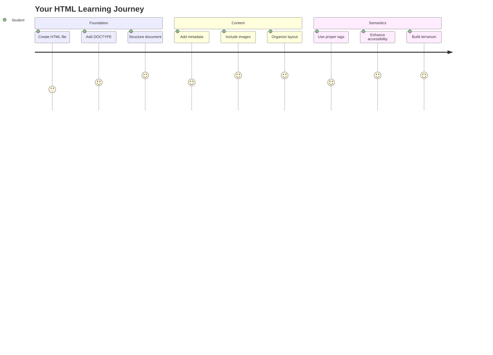
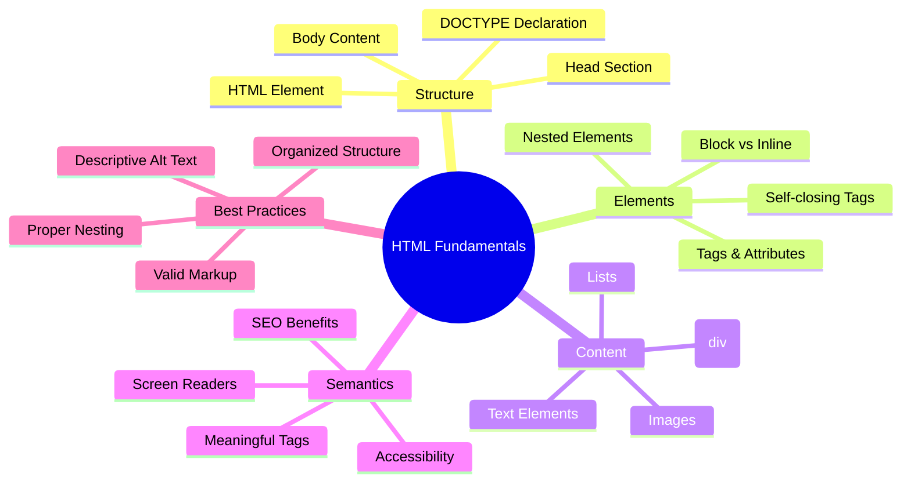
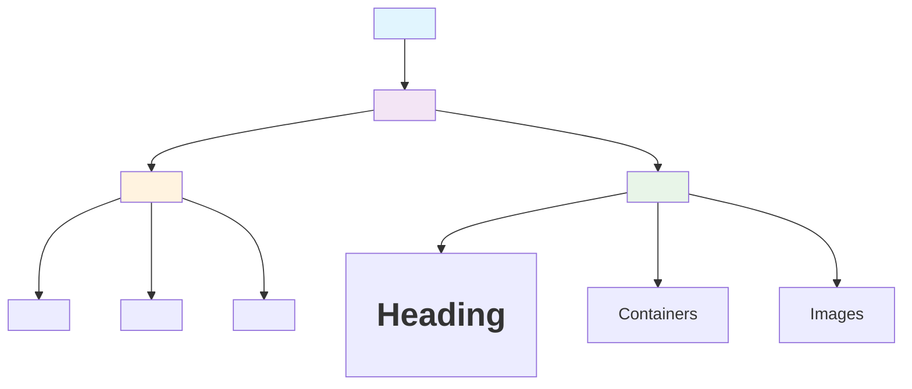
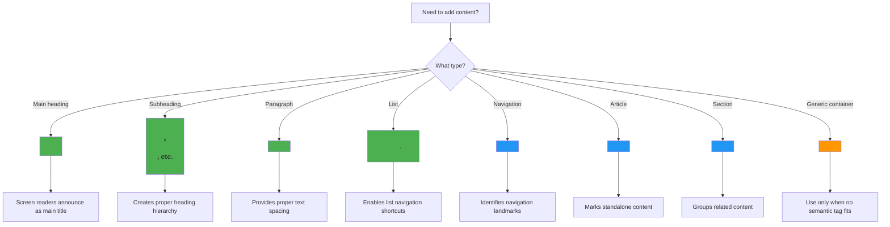
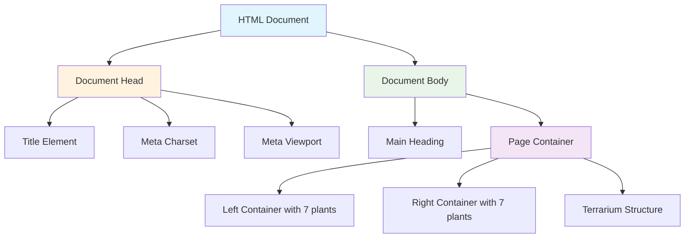
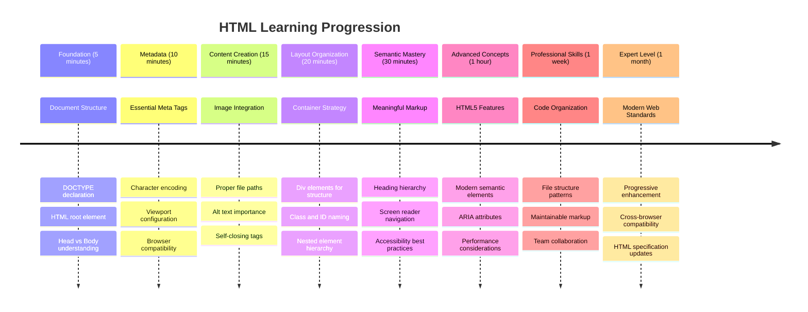

<!--
CO_OP_TRANSLATOR_METADATA:
{
  "original_hash": "3fcfa99c4897e051b558b5eaf1e8cc74",
  "translation_date": "2025-11-04T00:29:36+00:00",
  "source_file": "3-terrarium/1-intro-to-html/README.md",
  "language_code": "it"
}
-->
# Progetto Terrario Parte 1: Introduzione a HTML




> Sketchnote di [Tomomi Imura](https://twitter.com/girlie_mac)

HTML, o HyperText Markup Language, è la base di ogni sito web che tu abbia mai visitato. Pensa a HTML come allo scheletro che dà struttura alle pagine web – definisce dove va il contenuto, come è organizzato e cosa rappresenta ogni elemento. Mentre CSS "vestirà" il tuo HTML con colori e layout, e JavaScript lo animerà con interattività, HTML fornisce la struttura essenziale che rende tutto il resto possibile.

In questa lezione, creerai la struttura HTML per un'interfaccia di terrario virtuale. Questo progetto pratico ti insegnerà i concetti fondamentali di HTML mentre costruisci qualcosa di visivamente accattivante. Imparerai come organizzare il contenuto utilizzando elementi semantici, lavorare con immagini e creare la base per un'applicazione web interattiva.

Alla fine di questa lezione, avrai una pagina HTML funzionante che mostra immagini di piante organizzate in colonne, pronta per essere stilizzata nella prossima lezione. Non preoccuparti se all'inizio sembra semplice – è esattamente ciò che HTML dovrebbe fare prima che CSS aggiunga il tocco visivo.



## Quiz Pre-Lezione

[Quiz pre-lezione](https://ff-quizzes.netlify.app/web/quiz/15)

> 📺 **Guarda e Impara**: Dai un'occhiata a questo utile video introduttivo
> 
> [](https://www.youtube.com/watch?v=1TvxJKBzhyQ)

## Configurare il Progetto

Prima di immergerci nel codice HTML, configuriamo uno spazio di lavoro adeguato per il tuo progetto terrario. Creare una struttura di file organizzata fin dall'inizio è un'abitudine cruciale che ti servirà durante il tuo percorso di sviluppo web.

### Compito: Crea la Struttura del Progetto

Creerai una cartella dedicata per il tuo progetto terrario e aggiungerai il tuo primo file HTML. Ecco due approcci che puoi utilizzare:

**Opzione 1: Usare Visual Studio Code**
1. Apri Visual Studio Code
2. Clicca su "File" → "Apri Cartella" o usa `Ctrl+K, Ctrl+O` (Windows/Linux) o `Cmd+K, Cmd+O` (Mac)
3. Crea una nuova cartella chiamata `terrarium` e selezionala
4. Nel pannello Esplora, clicca sull'icona "Nuovo File"
5. Nomina il file `index.html`


**Opzione 2: Usare Comandi del Terminale**
```bash
mkdir terrarium
cd terrarium
touch index.html
code index.html
```

**Ecco cosa fanno questi comandi:**
- **Creano** una nuova directory chiamata `terrarium` per il tuo progetto
- **Navigano** nella directory del terrario
- **Creano** un file vuoto `index.html`
- **Aprono** il file in Visual Studio Code per la modifica

> 💡 **Suggerimento Pro**: Il nome del file `index.html` è speciale nello sviluppo web. Quando qualcuno visita un sito web, i browser cercano automaticamente `index.html` come pagina predefinita da visualizzare. Questo significa che un URL come `https://mysite.com/projects/` servirà automaticamente il file `index.html` dalla cartella `projects` senza bisogno di specificare il nome del file nell'URL.

## Comprendere la Struttura del Documento HTML

Ogni documento HTML segue una struttura specifica che i browser devono comprendere e visualizzare correttamente. Pensa a questa struttura come a una lettera formale – ha elementi richiesti in un ordine particolare che aiutano il destinatario (in questo caso, il browser) a elaborare correttamente il contenuto.



Iniziamo aggiungendo la base essenziale che ogni documento HTML necessita.

### La Dichiarazione DOCTYPE e l'Elemento Radice

Le prime due righe di qualsiasi file HTML servono come "introduzione" del documento al browser:

```html
<!DOCTYPE html>
<html></html>
```

**Comprendere cosa fa questo codice:**
- **Dichiara** il tipo di documento come HTML5 usando `<!DOCTYPE html>`
- **Crea** l'elemento radice `<html>` che conterrà tutto il contenuto della pagina
- **Stabilisce** standard web moderni per un rendering corretto del browser
- **Garantisce** una visualizzazione coerente su diversi browser e dispositivi

> 💡 **Suggerimento VS Code**: Passa il mouse su qualsiasi tag HTML in VS Code per vedere informazioni utili dai MDN Web Docs, inclusi esempi di utilizzo e dettagli sulla compatibilità dei browser.

> 📚 **Per Saperne di Più**: La dichiarazione DOCTYPE impedisce ai browser di entrare in "quirks mode", che veniva utilizzata per supportare siti web molto vecchi. Lo sviluppo web moderno utilizza la semplice dichiarazione `<!DOCTYPE html>` per garantire un [rendering conforme agli standard](https://developer.mozilla.org/docs/Web/HTML/Quirks_Mode_and_Standards_Mode).

### 🔄 **Verifica Pedagogica**
**Pausa e Riflettici**: Prima di continuare, assicurati di comprendere:
- ✅ Perché ogni documento HTML necessita di una dichiarazione DOCTYPE
- ✅ Cosa contiene l'elemento radice `<html>`
- ✅ Come questa struttura aiuta i browser a rendere correttamente le pagine

**Test Rapido**: Riesci a spiegare con parole tue cosa significa "rendering conforme agli standard"?

## Aggiungere Metadati Essenziali al Documento

La sezione `<head>` di un documento HTML contiene informazioni cruciali che i browser e i motori di ricerca necessitano, ma che i visitatori non vedono direttamente sulla pagina. Pensa a questa sezione come alle "informazioni dietro le quinte" che aiutano la tua pagina web a funzionare correttamente e ad apparire correttamente su diversi dispositivi e piattaforme.

Questi metadati dicono ai browser come visualizzare la tua pagina, quale codifica dei caratteri utilizzare e come gestire diverse dimensioni dello schermo – tutto essenziale per creare pagine web professionali e accessibili.

### Compito: Aggiungi la Sezione Head del Documento

Inserisci questa sezione `<head>` tra i tag di apertura e chiusura `<html>`:

```html
<head>
	<title>Welcome to my Virtual Terrarium</title>
	<meta charset="utf-8" />
	<meta http-equiv="X-UA-Compatible" content="IE=edge" />
	<meta name="viewport" content="width=device-width, initial-scale=1" />
</head>
```

**Analisi di ciò che ogni elemento realizza:**
- **Imposta** il titolo della pagina che appare nelle schede del browser e nei risultati di ricerca
- **Specifica** la codifica dei caratteri UTF-8 per una corretta visualizzazione del testo in tutto il mondo
- **Garantisce** la compatibilità con le versioni moderne di Internet Explorer
- **Configura** il design responsivo impostando il viewport per adattarsi alla larghezza del dispositivo
- **Controlla** il livello di zoom iniziale per visualizzare il contenuto a dimensioni naturali

> 🤔 **Riflettici**: Cosa accadrebbe se impostassi un tag meta viewport come questo: `<meta name="viewport" content="width=600">`? Questo forzerebbe la pagina a essere sempre larga 600 pixel, compromettendo il design responsivo! Scopri di più sulla [configurazione corretta del viewport](https://developer.mozilla.org/docs/Web/HTML/Viewport_meta_tag).

## Costruire il Corpo del Documento

L'elemento `<body>` contiene tutto il contenuto visibile della tua pagina web – tutto ciò che gli utenti vedranno e con cui interagiranno. Mentre la sezione `<head>` forniva istruzioni al browser, la sezione `<body>` contiene il contenuto effettivo: testo, immagini, pulsanti e altri elementi che creano la tua interfaccia utente.

Aggiungiamo la struttura del corpo e comprendiamo come i tag HTML lavorano insieme per creare contenuti significativi.

### Comprendere la Struttura dei Tag HTML

HTML utilizza tag accoppiati per definire gli elementi. La maggior parte dei tag ha un tag di apertura come `<p>` e un tag di chiusura come `</p>`, con il contenuto nel mezzo: `<p>Ciao, mondo!</p>`. Questo crea un elemento paragrafo contenente il testo "Ciao, mondo!".

### Compito: Aggiungi l'Elemento Body

Aggiorna il tuo file HTML per includere l'elemento `<body>`:

```html
<!DOCTYPE html>
<html>
	<head>
		<title>Welcome to my Virtual Terrarium</title>
		<meta charset="utf-8" />
		<meta http-equiv="X-UA-Compatible" content="IE=edge" />
		<meta name="viewport" content="width=device-width, initial-scale=1" />
	</head>
	<body></body>
</html>
```

**Ecco cosa fornisce questa struttura completa:**
- **Stabilisce** il framework di base del documento HTML5
- **Include** metadati essenziali per un rendering corretto del browser
- **Crea** un corpo vuoto pronto per il tuo contenuto visibile
- **Segue** le migliori pratiche dello sviluppo web moderno

Ora sei pronto per aggiungere gli elementi visibili del tuo terrario. Utilizzeremo elementi `<div>` come contenitori per organizzare diverse sezioni di contenuto e `` per visualizzare le immagini delle piante.

### Lavorare con Immagini e Contenitori di Layout

Le immagini sono speciali in HTML perché utilizzano tag "auto-chiudenti". A differenza di elementi come `<p></p>` che avvolgono il contenuto, il tag `` contiene tutte le informazioni necessarie all'interno del tag stesso utilizzando attributi come `src` per il percorso del file immagine e `alt` per l'accessibilità.

Prima di aggiungere immagini al tuo HTML, dovrai organizzare correttamente i file del progetto creando una cartella immagini e aggiungendo le grafiche delle piante.

**Prima, configura le tue immagini:**
1. Crea una cartella chiamata `images` all'interno della cartella del progetto terrario
2. Scarica le immagini delle piante dalla [cartella delle soluzioni](../../../../3-terrarium/solution/images) (14 immagini di piante in totale)
3. Copia tutte le immagini delle piante nella tua nuova cartella `images`

### Compito: Crea il Layout di Visualizzazione delle Piante

Ora aggiungi le immagini delle piante organizzate in due colonne tra i tuoi tag `<body></body>`:

```html
<div id="page">
	<div id="left-container" class="container">
		<div class="plant-holder">
			
		</div>
		<div class="plant-holder">
			
		</div>
		<div class="plant-holder">
			
		</div>
		<div class="plant-holder">
			
		</div>
		<div class="plant-holder">
			
		</div>
		<div class="plant-holder">
			
		</div>
		<div class="plant-holder">
			
		</div>
	</div>
	<div id="right-container" class="container">
		<div class="plant-holder">
			
		</div>
		<div class="plant-holder">
			
		</div>
		<div class="plant-holder">
			
		</div>
		<div class="plant-holder">
			
		</div>
		<div class="plant-holder">
			
		</div>
		<div class="plant-holder">
			
		</div>
		<div class="plant-holder">
			
		</div>
	</div>
</div>
```

**Passo dopo passo, ecco cosa accade in questo codice:**
- **Crea** un contenitore principale della pagina con `id="page"` per contenere tutto il contenuto
- **Stabilisce** due contenitori di colonne: `left-container` e `right-container`
- **Organizza** 7 piante nella colonna sinistra e 7 piante nella colonna destra
- **Avvolge** ogni immagine di pianta in un div `plant-holder` per il posizionamento individuale
- **Applica** nomi di classi coerenti per la stilizzazione CSS nella prossima lezione
- **Assegna** ID univoci a ogni immagine di pianta per l'interazione con JavaScript in seguito
- **Include** percorsi di file corretti che puntano alla cartella immagini

> 🤔 **Considera Questo**: Nota che tutte le immagini attualmente hanno lo stesso testo alternativo "pianta". Questo non è ideale per l'accessibilità. Gli utenti di lettori di schermo sentirebbero "pianta" ripetuto 14 volte senza sapere quale specifica pianta mostra ogni immagine. Riesci a pensare a testi alternativi migliori e più descrittivi per ogni immagine?

> 📝 **Tipi di Elementi HTML**: Gli elementi `<div>` sono "a livello di blocco" e occupano tutta la larghezza, mentre gli elementi `<span>` sono "in linea" e occupano solo la larghezza necessaria. Cosa pensi accadrebbe se cambiassi tutti questi tag `<div>` in tag `<span>`?

### 🔄 **Verifica Pedagogica**
**Comprensione della Struttura**: Prenditi un momento per rivedere la tua struttura HTML:
- ✅ Riesci a identificare i contenitori principali nel tuo layout?
- ✅ Capisci perché ogni immagine ha un ID univoco?
- ✅ Come descriveresti lo scopo dei div `plant-holder`?

**Ispezione Visiva**: Apri il tuo file HTML in un browser. Dovresti vedere:
- Un elenco di immagini di piante
- Immagini organizzate in due colonne
- Layout semplice e non stilizzato

**Ricorda**: Questo aspetto semplice è esattamente ciò che HTML dovrebbe avere prima della stilizzazione CSS!

Con questo markup aggiunto, le piante appariranno sullo schermo, anche se non sembreranno ancora rifinite – per questo ci sarà il CSS nella prossima lezione! Per ora, hai una solida base HTML che organizza correttamente il tuo contenuto e segue le migliori pratiche di accessibilità.

## Usare HTML Semantico per l'Accessibilità

HTML semantico significa scegliere gli elementi HTML in base al loro significato e scopo, non solo al loro aspetto. Quando utilizzi un markup semantico, stai comunicando la struttura e il significato del tuo contenuto ai browser, ai motori di ricerca e alle tecnologie assistive come i lettori di schermo.



Questo approccio rende i tuoi siti web più accessibili agli utenti con disabilità e aiuta i motori di ricerca a comprendere meglio il tuo contenuto. È un principio fondamentale dello sviluppo web moderno che crea esperienze migliori per tutti.

### Aggiungere un Titolo Semantico alla Pagina

Aggiungiamo un titolo adeguato alla tua pagina terrario. Inserisci questa riga subito dopo il tag di apertura `<body>`:

```html
<h1>My Terrarium</h1>
```

**Perché il markup semantico è importante:**
- **Aiuta** i lettori di schermo a navigare e comprendere la struttura della pagina
- **Migliora** l'ottimizzazione per i motori di ricerca (SEO) chiarendo la gerarchia del contenuto
- **Aumenta** l'accessibilità per gli utenti con disabilità visive o differenze cognitive
- **Crea** esperienze utente migliori su tutti i dispositivi e piattaforme
- **Segue** gli standard web e le migliori pratiche per uno sviluppo professionale

**Esempi di scelte semantiche vs. non semantiche:**

| Scopo | ✅ Scelta Semantica | ❌ Scelta Non Semantica |
|-------|---------------------|------------------------|
| Titolo principale | `<h1>Titolo</h1>` | `<div class="big-text">Titolo</div>` |
| Navigazione | `<nav><ul><li></li></ul></nav>` | `<div class="menu"><div></div></div>` |
| Pulsante | `<button>Clicca qui</button>` | `<span onclick="...">Clicca qui</span>` |
| Contenuto articolo | `<article><p></p></article>` | `<div class="content"><div></div></div>` |

> 🎥 **Guarda in Azione**: Guarda [come i lettori di schermo interagiscono con le pagine web](https://www.youtube.com/watch?v=OUDV1gqs9GA) per capire perché il markup semantico è cruciale per l'accessibilità. Nota come la struttura HTML corretta aiuta gli utenti a navigare in modo efficiente.

## Creare il Contenitore del Terrario

Ora aggiungiamo la struttura HTML per il terrario stesso – il contenitore di vetro dove le piante saranno posizionate. Questa sezione dimostra un concetto importante: HTML fornisce la struttura, ma senza la stilizzazione CSS, questi elementi non saranno ancora visibili.

Il markup del terrario utilizza nomi di classi descrittivi che renderanno la stilizzazione CSS intuitiva e facile da mantenere nella prossima lezione.

### Compito: Aggiungi la Struttura del Terrario

Inserisci questo markup sopra l'ultimo tag `</div>` (prima del tag di chiusura del contenitore della pagina):

```html
<div id="terrarium">
	<div class="jar-top"></div>
	<div class="jar-walls">
		<div class="jar-glossy-long"></div>
		<div class="jar-glossy-short"></div>
	</div>
	<div class="dirt"></div>
	<div class="jar-bottom"></div>
</div>
```

**Comprendere questa struttura del terrario:**
- **Crea** un contenitore principale del terrario con un ID univoco per la stilizzazione
- **Definisce** elementi separati per ogni componente visivo (parte superiore, pareti, terra, fondo)
- **Include** elementi annidati per effetti di riflessione del vetro (elementi lucidi)
- **Utilizza** nomi di classi descrittivi che indicano chiaramente lo scopo di ogni elemento
- **Prepara** la struttura per lo stile CSS che creerà l'aspetto del terrario in vetro

> 🤔 **Notato qualcosa?**: Anche se hai aggiunto questo markup, non vedi nulla di nuovo sulla pagina! Questo illustra perfettamente come l'HTML fornisca la struttura mentre il CSS fornisce l'aspetto. Questi elementi `<div>` esistono ma non hanno ancora uno stile visivo – arriverà nella prossima lezione!



### 🔄 **Verifica Pedagogica**
**Padronanza della Struttura HTML**: Prima di procedere, assicurati di poter:
- ✅ Spiegare la differenza tra struttura HTML e aspetto visivo
- ✅ Identificare gli elementi HTML semantici rispetto a quelli non semantici
- ✅ Descrivere come un markup corretto migliori l'accessibilità
- ✅ Riconoscere la struttura completa dell'albero del documento

**Testa la tua comprensione**: Prova ad aprire il tuo file HTML in un browser con JavaScript disabilitato e CSS rimosso. Questo ti mostrerà la struttura semantica pura che hai creato!

---

## Sfida dell'Agente GitHub Copilot

Usa la modalità Agente per completare la seguente sfida:

**Descrizione:** Crea una struttura HTML semantica per una sezione di guida alla cura delle piante che potrebbe essere aggiunta al progetto del terrario.

**Prompt:** Crea una sezione HTML semantica che includa un'intestazione principale "Guida alla Cura delle Piante", tre sottosezioni con intestazioni "Irrigazione", "Requisiti di Luce" e "Cura del Terreno", ciascuna contenente un paragrafo di informazioni sulla cura delle piante. Usa tag HTML semantici appropriati come `<section>`, `<h2>`, `<h3>` e `<p>` per strutturare il contenuto correttamente.

Scopri di più sulla [modalità agente](https://code.visualstudio.com/blogs/2025/02/24/introducing-copilot-agent-mode) qui.

## Sfida sulla Storia dell'HTML

**Imparare sull'Evoluzione del Web**

L'HTML si è evoluto significativamente da quando Tim Berners-Lee ha creato il primo browser web al CERN nel 1990. Alcuni tag più vecchi come `<marquee>` sono ora deprecati perché non funzionano bene con gli standard moderni di accessibilità e design responsivo.

**Prova Questo Esperimento:**
1. Avvolgi temporaneamente il tuo titolo `<h1>` in un tag `<marquee>`: `<marquee><h1>Il Mio Terrario</h1></marquee>`
2. Apri la tua pagina in un browser e osserva l'effetto di scorrimento
3. Considera perché questo tag è stato deprecato (suggerimento: pensa all'esperienza utente e all'accessibilità)
4. Rimuovi il tag `<marquee>` e torna al markup semantico

**Domande di Riflessione:**
- Come potrebbe un titolo scorrevole influenzare gli utenti con disabilità visive o sensibilità al movimento?
- Quali tecniche moderne di CSS potrebbero ottenere effetti visivi simili in modo più accessibile?
- Perché è importante utilizzare gli standard web attuali invece di elementi deprecati?

Scopri di più sugli [elementi HTML obsoleti e deprecati](https://developer.mozilla.org/docs/Web/HTML/Element#Obsolete_and_deprecated_elements) per capire come gli standard web si evolvono per migliorare l'esperienza utente.


## Quiz Post-Lezione

[Quiz post-lezione](https://ff-quizzes.netlify.app/web/quiz/16)

## Revisione e Studio Autonomo

**Approfondisci la tua conoscenza dell'HTML**

L'HTML è stato il fondamento del web per oltre 30 anni, evolvendosi da un semplice linguaggio di markup per documenti a una piattaforma sofisticata per costruire applicazioni interattive. Comprendere questa evoluzione ti aiuta ad apprezzare gli standard web moderni e a prendere decisioni di sviluppo migliori.

**Percorsi di Apprendimento Consigliati:**

1. **Storia ed Evoluzione dell'HTML**
   - Ricerca la timeline da HTML 1.0 a HTML5
   - Esplora perché alcuni tag sono stati deprecati (accessibilità, compatibilità mobile, manutenibilità)
   - Indaga sulle nuove funzionalità HTML emergenti e sulle proposte

2. **Approfondimento sull'HTML Semantico**
   - Studia l'elenco completo degli [elementi semantici HTML5](https://developer.mozilla.org/docs/Web/HTML/Element)
   - Pratica l'identificazione di quando utilizzare `<article>`, `<section>`, `<aside>` e `<main>`
   - Impara gli attributi ARIA per migliorare l'accessibilità

3. **Sviluppo Web Moderno**
   - Esplora [la creazione di siti web responsivi](https://docs.microsoft.com/learn/modules/build-simple-website/?WT.mc_id=academic-77807-sagibbon) su Microsoft Learn
   - Comprendi come l'HTML si integra con CSS e JavaScript
   - Impara le migliori pratiche per le prestazioni web e la SEO

**Domande di Riflessione:**
- Quali tag HTML deprecati hai scoperto e perché sono stati rimossi?
- Quali nuove funzionalità HTML sono proposte per le versioni future?
- Come contribuisce l'HTML semantico all'accessibilità web e alla SEO?

### ⚡ **Cosa Puoi Fare nei Prossimi 5 Minuti**
- [ ] Apri DevTools (F12) e ispeziona la struttura HTML del tuo sito web preferito
- [ ] Crea un semplice file HTML con tag di base: `<h1>`, `<p>` e ``
- [ ] Valida il tuo HTML utilizzando il Validatore HTML W3C online
- [ ] Prova ad aggiungere un commento al tuo HTML usando `<!-- commento -->`

### 🎯 **Cosa Puoi Realizzare in Quest'ora**
- [ ] Completa il quiz post-lezione e rivedi i concetti di HTML semantico
- [ ] Costruisci una semplice pagina web su di te utilizzando una struttura HTML corretta
- [ ] Sperimenta con diversi livelli di intestazione e tag di formattazione del testo
- [ ] Aggiungi immagini e link per praticare l'integrazione multimediale
- [ ] Ricerca funzionalità HTML5 che non hai ancora provato

### 📅 **Il Tuo Viaggio HTML di Una Settimana**
- [ ] Completa l'assegnazione del progetto terrario con markup semantico
- [ ] Crea una pagina web accessibile utilizzando etichette e ruoli ARIA
- [ ] Pratica la creazione di moduli con vari tipi di input
- [ ] Esplora le API HTML5 come localStorage o geolocalizzazione
- [ ] Studia modelli HTML responsivi e design mobile-first
- [ ] Rivedi il codice HTML di altri sviluppatori per le migliori pratiche

### 🌟 **Il Tuo Mese di Fondamenti Web**
- [ ] Costruisci un sito web portfolio che mostri la tua padronanza dell'HTML
- [ ] Impara il templating HTML con un framework come Handlebars
- [ ] Contribuisci a progetti open source migliorando la documentazione HTML
- [ ] Padroneggia concetti HTML avanzati come gli elementi personalizzati
- [ ] Integra l'HTML con framework CSS e librerie JavaScript
- [ ] Mentora altri che stanno imparando i fondamenti dell'HTML

## 🎯 La Tua Timeline di Padronanza HTML



### 🛠️ Riepilogo del Tuo Toolkit HTML

Dopo aver completato questa lezione, ora hai:
- **Struttura del Documento**: Fondazione completa HTML5 con DOCTYPE corretto
- **Markup Semantico**: Tag significativi che migliorano l'accessibilità e la SEO
- **Integrazione Immagini**: Pratiche corrette di organizzazione file e testo alternativo
- **Contenitori di Layout**: Uso strategico di div con nomi di classe descrittivi
- **Consapevolezza dell'Accessibilità**: Comprensione della navigazione con screen reader
- **Standard Moderni**: Pratiche HTML5 attuali e conoscenza dei tag deprecati
- **Fondazione del Progetto**: Base solida per lo stile CSS e l'interattività JavaScript

**Prossimi Passi**: La tua struttura HTML è pronta per lo stile CSS! La fondazione semantica che hai costruito renderà la prossima lezione molto più facile da comprendere.


## Compito

[Pratica il tuo HTML: Crea un mockup di blog](assignment.md)

---

**Disclaimer**:  
Questo documento è stato tradotto utilizzando il servizio di traduzione AI [Co-op Translator](https://github.com/Azure/co-op-translator). Sebbene ci impegniamo per garantire l'accuratezza, si prega di notare che le traduzioni automatiche possono contenere errori o imprecisioni. Il documento originale nella sua lingua nativa dovrebbe essere considerato la fonte autorevole. Per informazioni critiche, si raccomanda una traduzione professionale umana. Non siamo responsabili per eventuali incomprensioni o interpretazioni errate derivanti dall'uso di questa traduzione.