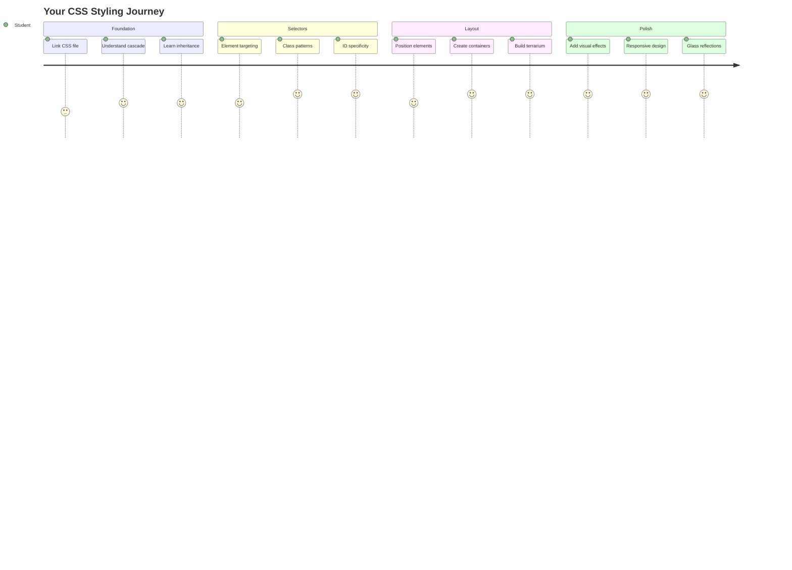
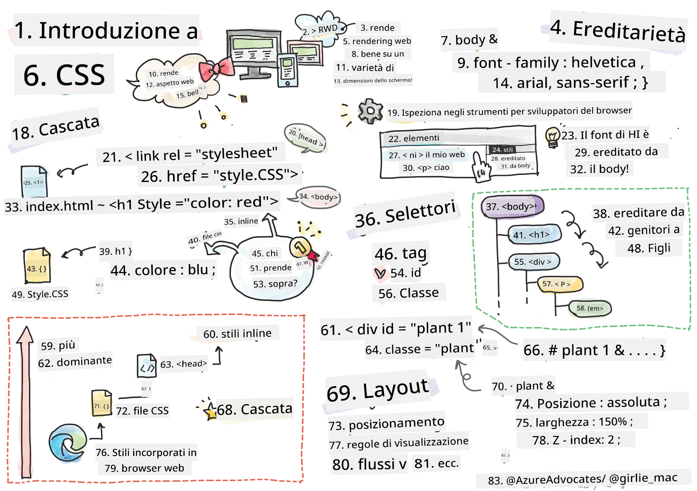
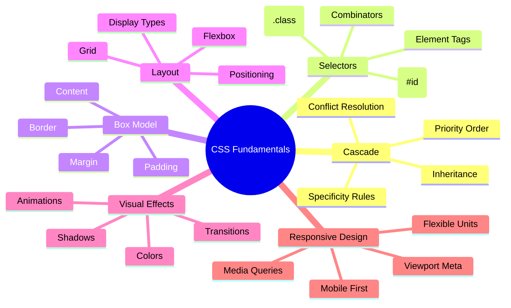
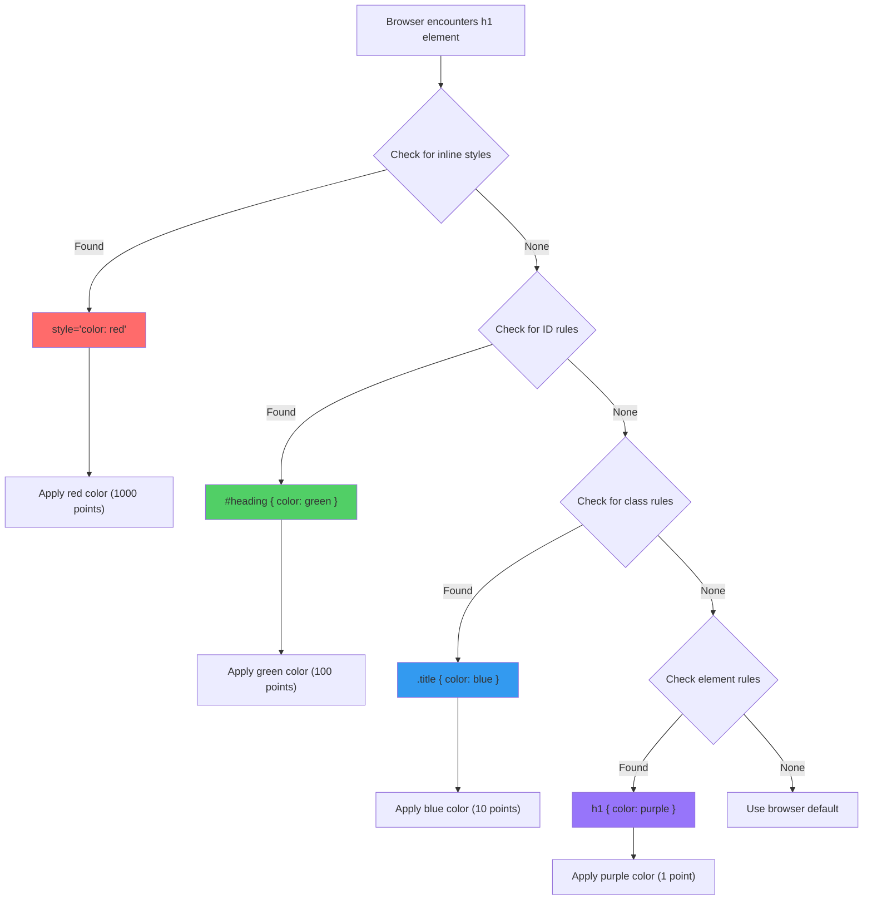
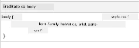
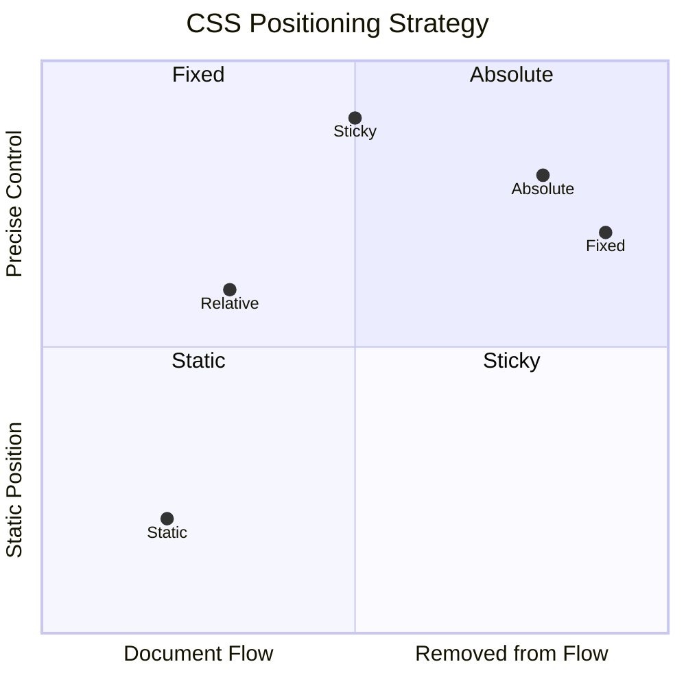
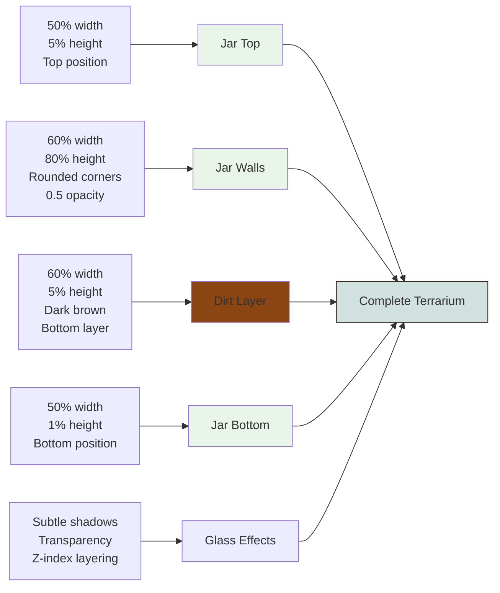
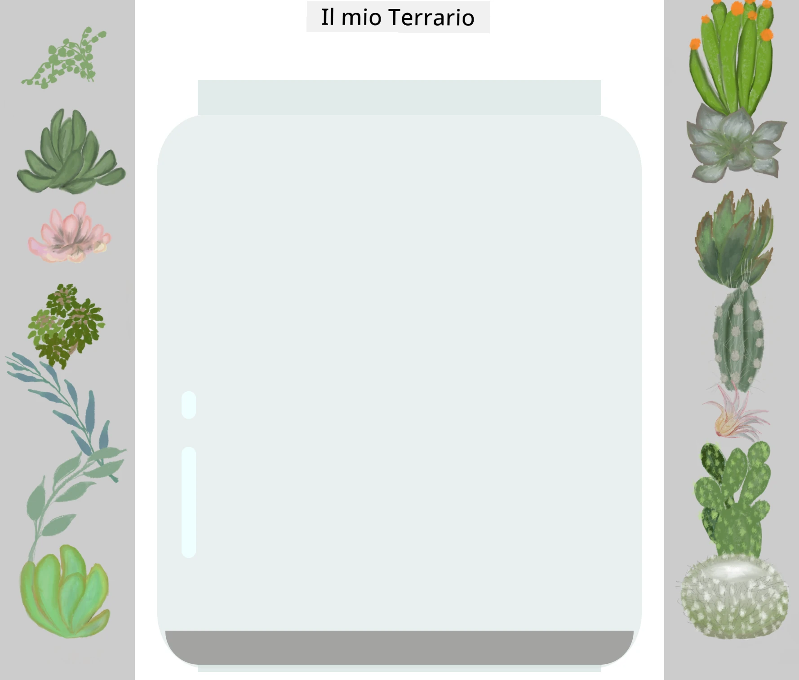
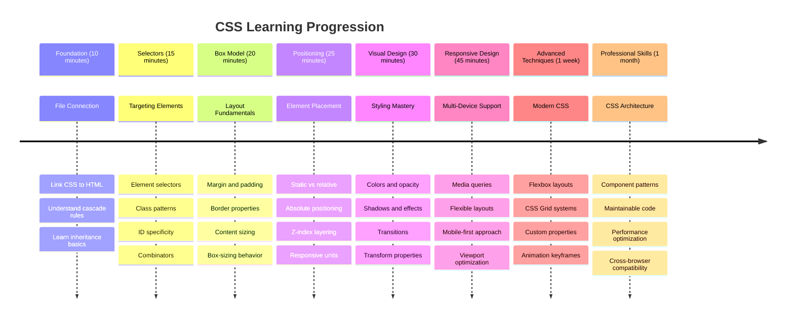

# Progetto Terrarium Parte 2: Introduzione al CSS




> Sketchnote di [Tomomi Imura](https://twitter.com/girlie_mac)

Ricordi com'era il tuo terrarium HTML, piuttosto semplice? Con il CSS possiamo trasformare quella struttura essenziale in qualcosa di visivamente accattivante.

Se l'HTML è come costruire la struttura di una casa, allora il CSS è tutto ciò che la rende accogliente: i colori delle pareti, la disposizione dei mobili, l'illuminazione e il modo in cui le stanze si collegano tra loro. Pensa a come il Palazzo di Versailles è passato da un semplice padiglione di caccia a uno degli edifici più magnifici del mondo grazie alla cura per la decorazione e il layout.

Oggi trasformeremo il tuo terrarium da funzionale a raffinato. Imparerai a posizionare gli elementi con precisione, a creare layout che si adattano a diverse dimensioni dello schermo e a creare un'attrattiva visiva che rende i siti web coinvolgenti.

Alla fine di questa lezione, vedrai come uno stile CSS strategico può migliorare notevolmente il tuo progetto. Aggiungiamo un po' di stile al tuo terrarium.



## Quiz Pre-Lettura

[Quiz pre-lettura](https://ff-quizzes.netlify.app/web/quiz/17)

## Introduzione al CSS

Il CSS viene spesso considerato solo come un modo per "rendere le cose belle", ma ha uno scopo molto più ampio. Il CSS è come essere il regista di un film: controlli non solo l'aspetto di tutto, ma anche il movimento, la risposta all'interazione e l'adattamento a diverse situazioni.

Il CSS moderno è incredibilmente potente. Puoi scrivere codice che adatta automaticamente i layout per telefoni, tablet e computer desktop. Puoi creare animazioni fluide che guidano l'attenzione degli utenti dove necessario. I risultati possono essere davvero impressionanti quando tutto funziona insieme.

> 💡 **Consiglio Pro**: Il CSS è in continua evoluzione con nuove funzionalità e capacità. Controlla sempre [CanIUse.com](https://caniuse.com) per verificare il supporto dei browser per le nuove funzionalità CSS prima di utilizzarle nei progetti di produzione.

**Ecco cosa realizzeremo in questa lezione:**
- **Creare** un design visivo completo per il tuo terrarium utilizzando tecniche CSS moderne
- **Esplorare** concetti fondamentali come la cascata, l'ereditarietà e i selettori CSS
- **Implementare** strategie di posizionamento e layout responsive
- **Costruire** il contenitore del terrarium utilizzando forme e stili CSS

### Prerequisiti

Dovresti aver completato la struttura HTML del tuo terrarium dalla lezione precedente e averla pronta per essere stilizzata.

> 📺 **Risorsa Video**: Dai un'occhiata a questo utile video tutorial
>
> [](https://www.youtube.com/watch?v=6yIdOIV9p1I)

### Configurare il File CSS

Prima di iniziare a stilizzare, dobbiamo collegare il CSS al nostro HTML. Questo collegamento indica al browser dove trovare le istruzioni di stile per il nostro terrarium.

Nella cartella del tuo terrarium, crea un nuovo file chiamato `style.css`, quindi collegalo nella sezione `<head>` del tuo documento HTML:

```html
<link rel="stylesheet" href="./style.css" />
```

**Ecco cosa fa questo codice:**
- **Crea** un collegamento tra i file HTML e CSS
- **Indica** al browser di caricare e applicare gli stili da `style.css`
- **Utilizza** l'attributo `rel="stylesheet"` per specificare che si tratta di un file CSS
- **Riferisce** il percorso del file con `href="./style.css"`

## Comprendere la Cascata del CSS

Ti sei mai chiesto perché il CSS si chiama "Cascading" Style Sheets? Gli stili si propagano come una cascata e a volte entrano in conflitto tra loro.

Pensa a come funzionano le strutture di comando militari: un ordine generale potrebbe dire "tutte le truppe indossano il verde", ma un ordine specifico per la tua unità potrebbe dire "indossate l'uniforme blu per la cerimonia". L'istruzione più specifica ha la precedenza. Il CSS segue una logica simile, e comprendere questa gerarchia rende il debug molto più gestibile.

### Sperimentare con la Priorità della Cascata

Vediamo la cascata in azione creando un conflitto di stile. Per prima cosa, aggiungi uno stile inline al tuo tag `<h1>`:

```html
<h1 style="color: red">My Terrarium</h1>
```

**Cosa fa questo codice:**
- **Applica** un colore rosso direttamente all'elemento `<h1>` utilizzando lo stile inline
- **Utilizza** l'attributo `style` per incorporare il CSS direttamente nell'HTML
- **Crea** la regola di stile con la priorità più alta per questo specifico elemento

Successivamente, aggiungi questa regola al tuo file `style.css`:

```css
h1 {
  color: blue;
}
```

**Nel codice sopra, abbiamo:**
- **Definito** una regola CSS che prende di mira tutti gli elementi `<h1>`
- **Impostato** il colore del testo su blu utilizzando un foglio di stile esterno
- **Creato** una regola di priorità inferiore rispetto agli stili inline

✅ **Verifica della Conoscenza**: Quale colore viene visualizzato nella tua app web? Perché quel colore ha la precedenza? Riesci a pensare a scenari in cui potresti voler sovrascrivere gli stili?



> 💡 **Ordine di Priorità CSS (dal più alto al più basso):**
> 1. **Stili inline** (attributo style)
> 2. **ID** (#myId)
> 3. **Classi** (.myClass) e attributi
> 4. **Selettori di elementi** (h1, div, p)
> 5. **Valori predefiniti del browser**

## L'Ereditarietà del CSS in Azione

L'ereditarietà del CSS funziona come la genetica: gli elementi ereditano alcune proprietà dai loro elementi genitori. Se imposti la famiglia di font sull'elemento body, tutto il testo all'interno utilizzerà automaticamente lo stesso font. È simile a come la caratteristica distintiva della mascella della famiglia degli Asburgo è apparsa attraverso le generazioni senza essere specificata per ogni individuo.

Tuttavia, non tutto viene ereditato. Gli stili di testo come i font e i colori vengono ereditati, ma le proprietà di layout come margini e bordi no. Proprio come i figli possono ereditare tratti fisici ma non le scelte di moda dei genitori.

### Osservare l'Ereditarietà dei Font

Vediamo l'ereditarietà in azione impostando una famiglia di font sull'elemento `<body>`:

```css
body {
  font-family: 'Segoe UI', Tahoma, Geneva, Verdana, sans-serif;
}
```

**Analisi di ciò che accade qui:**
- **Imposta** la famiglia di font per l'intera pagina prendendo di mira l'elemento `<body>`
- **Utilizza** uno stack di font con opzioni di fallback per una migliore compatibilità tra browser
- **Applica** font di sistema moderni che appaiono ottimi su diversi sistemi operativi
- **Garantisce** che tutti gli elementi figli ereditino questo font a meno che non venga specificamente sovrascritto

Apri gli strumenti per sviluppatori del tuo browser (F12), vai alla scheda Elementi e ispeziona il tuo elemento `<h1>`. Vedrai che eredita la famiglia di font dal body:



✅ **Tempo di Esperimento**: Prova a impostare altre proprietà ereditabili sul `<body>` come `color`, `line-height` o `text-align`. Cosa succede al tuo titolo e agli altri elementi?

> 📝 **Proprietà Ereditabili Includono**: `color`, `font-family`, `font-size`, `line-height`, `text-align`, `visibility`
>
> **Proprietà Non Ereditabili Includono**: `margin`, `padding`, `border`, `width`, `height`, `position`

### 🔄 **Verifica Pedagogica**
**Comprensione delle Basi del CSS**: Prima di passare ai selettori, assicurati di poter:
- ✅ Spiegare la differenza tra cascata ed ereditarietà
- ✅ Prevedere quale stile vincerà in un conflitto di specificità
- ✅ Identificare quali proprietà vengono ereditate dagli elementi genitori
- ✅ Collegare correttamente i file CSS all'HTML

**Test Rapido**: Se hai questi stili, di che colore sarà un `<h1>` all'interno di un `<div class="special">`?
```css
div { color: blue; }
.special { color: green; }
h1 { color: red; }
```
*Risposta: Rosso (il selettore dell'elemento prende direttamente di mira h1)*

## Padroneggiare i Selettori CSS

I selettori CSS sono il tuo modo per prendere di mira specifici elementi da stilizzare. Funzionano come dare indicazioni precise: invece di dire "la casa", potresti dire "la casa blu con la porta rossa in via Maple".

Il CSS offre diversi modi per essere specifici, e scegliere il selettore giusto è come scegliere lo strumento appropriato per il compito. A volte devi stilizzare ogni porta del quartiere, altre volte solo una porta specifica.

### Selettori di Elementi (Tag)

I selettori di elementi prendono di mira gli elementi HTML in base al loro nome di tag. Sono perfetti per impostare stili di base che si applicano ampiamente alla tua pagina:

```css
body {
  font-family: 'Segoe UI', Tahoma, Geneva, Verdana, sans-serif;
  margin: 0;
  padding: 0;
}

h1 {
  color: #3a241d;
  text-align: center;
  font-size: 2.5rem;
  margin-bottom: 1rem;
}
```

**Comprendere questi stili:**
- **Imposta** una tipografia coerente su tutta la pagina con il selettore `body`
- **Rimuove** i margini e i padding predefiniti del browser per un controllo migliore
- **Stilizza** tutti gli elementi di intestazione con colore, allineamento e spaziatura
- **Utilizza** unità `rem` per dimensioni dei font scalabili e accessibili

Mentre i selettori di elementi funzionano bene per lo stile generale, avrai bisogno di selettori più specifici per stilizzare componenti individuali come le piante nel tuo terrarium.

### Selettori ID per Elementi Unici

I selettori ID utilizzano il simbolo `#` e prendono di mira elementi con attributi `id` specifici. Poiché gli ID devono essere unici in una pagina, sono perfetti per stilizzare elementi individuali e speciali come i contenitori delle piante a sinistra e a destra.

Creiamo lo stile per i contenitori laterali del nostro terrarium dove vivranno le piante:

```css
#left-container {
  background-color: #f5f5f5;
  width: 15%;
  left: 0;
  top: 0;
  position: absolute;
  height: 100vh;
  padding: 1rem;
  box-sizing: border-box;
}

#right-container {
  background-color: #f5f5f5;
  width: 15%;
  right: 0;
  top: 0;
  position: absolute;
  height: 100vh;
  padding: 1rem;
  box-sizing: border-box;
}
```

**Ecco cosa realizza questo codice:**
- **Posiziona** i contenitori ai bordi estremi sinistro e destro utilizzando il posizionamento `absolute`
- **Utilizza** unità `vh` (altezza della finestra) per un'altezza responsive che si adatta alla dimensione dello schermo
- **Applica** `box-sizing: border-box` in modo che il padding sia incluso nella larghezza totale
- **Rimuove** unità `px` inutili dai valori zero per un codice più pulito
- **Imposta** un colore di sfondo sottile più gradevole rispetto al grigio intenso

✅ **Sfida di Qualità del Codice**: Nota come questo CSS viola il principio DRY (Don't Repeat Yourself). Riesci a rifattorizzarlo utilizzando sia un ID che una classe?

**Approccio migliorato:**
```html
<div id="left-container" class="container"></div>
<div id="right-container" class="container"></div>
```

```css
.container {
  background-color: #f5f5f5;
  width: 15%;
  top: 0;
  position: absolute;
  height: 100vh;
  padding: 1rem;
  box-sizing: border-box;
}

#left-container {
  left: 0;
}

#right-container {
  right: 0;
}
```

### Selettori di Classi per Stili Riutilizzabili

I selettori di classi utilizzano il simbolo `.` e sono perfetti quando vuoi applicare gli stessi stili a più elementi. A differenza degli ID, le classi possono essere riutilizzate in tutto il tuo HTML, rendendole ideali per modelli di stile coerenti.

Nel nostro terrarium, ogni pianta necessita di uno stile simile ma anche di un posizionamento individuale. Utilizzeremo una combinazione di classi per stili condivisi e ID per il posizionamento unico.

**Ecco la struttura HTML per ogni pianta:**
```html
<div class="plant-holder">
  
</div>
```

**Elementi chiave spiegati:**
- **Utilizza** `class="plant-holder"` per uno stile coerente del contenitore tra tutte le piante
- **Applica** `class="plant"` per lo stile e il comportamento condivisi delle immagini
- **Include** univoco `id="plant1"` per il posizionamento individuale e l'interazione JavaScript
- **Fornisce** testo alternativo descrittivo per l'accessibilità dei lettori di schermo

Ora aggiungi questi stili al tuo file `style.css`:

```css
.plant-holder {
  position: relative;
  height: 13%;
  left: -0.6rem;
}

.plant {
  position: absolute;
  max-width: 150%;
  max-height: 150%;
  z-index: 2;
  transition: transform 0.3s ease;
}

.plant:hover {
  transform: scale(1.05);
}
```

**Analisi di questi stili:**
- **Crea** un posizionamento relativo per il contenitore della pianta per stabilire un contesto di posizionamento
- **Imposta** ogni contenitore della pianta al 13% di altezza, garantendo che tutte le piante si adattino verticalmente senza scorrimento
- **Sposta** leggermente i contenitori a sinistra per centrare meglio le piante nei loro contenitori
- **Permette** alle piante di scalare in modo responsive con le proprietà `max-width` e `max-height`
- **Utilizza** `z-index` per stratificare le piante sopra altri elementi nel terrarium
- **Aggiunge** un effetto hover sottile con transizioni CSS per una migliore interazione con l'utente

✅ **Pensiero Critico**: Perché abbiamo bisogno sia dei selettori `.plant-holder` che `.plant`? Cosa accadrebbe se provassimo a usarne solo uno?

> 💡 **Modello di Design**: Il contenitore (`.plant-holder`) controlla il layout e il posizionamento, mentre il contenuto (`.plant`) controlla l'aspetto e la scalabilità. Questa separazione rende il codice più manutenibile e flessibile.

## Comprendere il Posizionamento CSS

Il posizionamento CSS è come essere il direttore di scena di uno spettacolo: dirigi dove ogni attore si trova e come si muove sul palco. Alcuni attori seguono la formazione standard, mentre altri necessitano di un posizionamento specifico per un effetto drammatico.

Una volta compreso il posizionamento, molte sfide di layout diventano gestibili. Hai bisogno di una barra di navigazione che rimanga in alto mentre gli utenti scorrono? Il posizionamento lo gestisce. Vuoi un tooltip che appaia in una posizione specifica? Anche quello è possibile con il posizionamento.

### I Cinque Valori di Posizionamento



| Valore di Posizionamento | Comportamento | Caso d'uso |
|--------------------------|---------------|------------|
| `static` | Flusso predefinito, ignora top/left/right/bottom | Layout normale del documento |
| `relative` | Posizionato rispetto alla sua posizione normale | Piccoli aggiustamenti, creazione di contesto di posizionamento |
| `absolute` | Posizionato rispetto all'antenato posizionato più vicino | Posizionamento preciso, sovrapposizioni |
| `fixed` | Posizionato rispetto alla finestra di visualizzazione | Barre di navigazione, elementi flottanti |
| `sticky` | Passa da relativo a fisso in base allo scorrimento | Intestazioni che si fissano durante lo scorrimento |

### Posizionamento nel Nostro Terrarium

Il nostro terrarium utilizza una combinazione strategica di tipi di posizionamento per creare il layout desiderato:

```css
/* Container positioning */
.container {
  position: absolute; /* Removes from normal flow */
  /* ... other styles ... */
}

/* Plant holder positioning */
.plant-holder {
  position: relative; /* Creates positioning context */
  /* ... other styles ... */
}

/* Plant positioning */
.plant {
  position: absolute; /* Allows precise placement within holder */
  /* ... other styles ... */
}
```

**Comprendere la strategia di posizionamento:**
- **Contenitori assoluti** sono rimossi dal flusso normale del documento e fissati ai bordi dello schermo
- **Contenitori relativi delle piante** creano un contesto di posizionamento rimanendo nel flusso del documento
- **Piante assolute** possono essere posizionate con precisione all'interno dei loro contenitori relativi
- **Questa combinazione** permette alle piante di impilarsi verticalmente pur essendo posizionabili individualmente

> 🎯 **Perché è Importante**: Gli elementi `plant` necessitano di un posizionamento assoluto per diventare trascinabili nella prossima lezione. Il posizionamento assoluto li rimuove dal flusso normale del layout, rendendo possibili le interazioni drag-and-drop.

✅ **Tempo di Esperimento**: Prova a cambiare i valori di posizionamento e osserva i risultati:
- Cosa succede se cambi `.container` da `absolute` a `relative`?
- Come cambia il layout se `.plant-holder` utilizza `absolute` invece di `relative`?
- Cosa succede quando si passa `.plant` a un posizionamento `relative`?

### 🔄 **Verifica Pedagogica**
**Padronanza del posizionamento CSS**: Fermati per verificare la tua comprensione:
- ✅ Sai spiegare perché le piante necessitano di un posizionamento assoluto per il drag-and-drop?
- ✅ Comprendi come i contenitori relativi creano un contesto di posizionamento?
- ✅ Perché i contenitori laterali utilizzano il posizionamento assoluto?
- ✅ Cosa accadrebbe se rimuovessi completamente le dichiarazioni di posizionamento?

**Connessione con il mondo reale**: Pensa a come il posizionamento CSS rispecchia il layout del mondo reale:
- **Statico**: Libri su uno scaffale (ordine naturale)
- **Relativo**: Spostare leggermente un libro mantenendo la sua posizione
- **Assoluto**: Posizionare un segnalibro su una pagina precisa
- **Fisso**: Un post-it che rimane visibile mentre sfogli le pagine

## Costruire il terrario con CSS

Ora costruiremo un barattolo di vetro utilizzando solo CSS - senza immagini o software grafici.

Creare un vetro realistico, ombre e effetti di profondità utilizzando posizionamento e trasparenza dimostra le capacità visive del CSS. Questa tecnica rispecchia il modo in cui gli architetti del movimento Bauhaus utilizzavano forme geometriche semplici per creare strutture complesse e belle. Una volta comprese queste basi, riconoscerai le tecniche CSS dietro molti design web.



### Creare i componenti del barattolo di vetro

Costruiamo il barattolo del terrario pezzo per pezzo. Ogni parte utilizza il posizionamento assoluto e dimensioni basate su percentuali per un design responsivo:

```css
.jar-walls {
  height: 80%;
  width: 60%;
  background: #d1e1df;
  border-radius: 1rem;
  position: absolute;
  bottom: 0.5%;
  left: 20%;
  opacity: 0.5;
  z-index: 1;
  box-shadow: inset 0 0 2rem rgba(0, 0, 0, 0.1);
}

.jar-top {
  width: 50%;
  height: 5%;
  background: #d1e1df;
  position: absolute;
  bottom: 80.5%;
  left: 25%;
  opacity: 0.7;
  z-index: 1;
  border-radius: 0.5rem 0.5rem 0 0;
}

.jar-bottom {
  width: 50%;
  height: 1%;
  background: #d1e1df;
  position: absolute;
  bottom: 0;
  left: 25%;
  opacity: 0.7;
  border-radius: 0 0 0.5rem 0.5rem;
}

.dirt {
  width: 60%;
  height: 5%;
  background: #3a241d;
  position: absolute;
  border-radius: 0 0 1rem 1rem;
  bottom: 1%;
  left: 20%;
  opacity: 0.7;
  z-index: -1;
}
```

**Comprendere la costruzione del terrario:**
- **Utilizza** dimensioni basate su percentuali per una scalabilità responsiva su tutti i dispositivi
- **Posiziona** gli elementi in modo assoluto per impilarli e allinearli con precisione
- **Applica** valori di opacità diversi per creare l'effetto di trasparenza del vetro
- **Implementa** il layering con `z-index` per far apparire le piante all'interno del barattolo
- **Aggiunge** ombre sottili e bordi arrotondati per un aspetto più realistico

### Design responsivo con percentuali

Nota come tutte le dimensioni utilizzano percentuali invece di valori fissi in pixel:

**Perché è importante:**
- **Garantisce** che il terrario si ridimensioni proporzionalmente su qualsiasi dimensione dello schermo
- **Mantiene** le relazioni visive tra i componenti del barattolo
- **Fornisce** un'esperienza coerente dai telefoni cellulari ai grandi monitor desktop
- **Permette** al design di adattarsi senza rompere il layout visivo

### Unità CSS in azione

Stiamo utilizzando unità `rem` per il border-radius, che si scalano in base alla dimensione del font radice. Questo crea design più accessibili che rispettano le preferenze di dimensione del font dell'utente. Scopri di più sulle [unità relative CSS](https://www.w3.org/TR/css-values-3/#font-relative-lengths) nella specifica ufficiale.

✅ **Esperimenti visivi**: Prova a modificare questi valori e osserva gli effetti:
- Cambia l'opacità del barattolo da 0.5 a 0.8 – come influisce sull'aspetto del vetro?
- Modifica il colore della terra da `#3a241d` a `#8B4513` – quale impatto visivo ha?
- Cambia il `z-index` della terra a 2 – cosa succede al layering?

### 🔄 **Verifica Pedagogica**
**Comprensione del design visivo CSS**: Conferma la tua comprensione del CSS visivo:
- ✅ Come le dimensioni basate su percentuali creano un design responsivo?
- ✅ Perché l'opacità crea l'effetto di trasparenza del vetro?
- ✅ Qual è il ruolo dello z-index nel layering degli elementi?
- ✅ Come i valori di border-radius creano la forma del barattolo?

**Principio di design**: Nota come stiamo costruendo visivi complessi da forme semplici:
1. **Rettangoli** → **Rettangoli arrotondati** → **Componenti del barattolo**
2. **Colori piatti** → **Opacità** → **Effetto vetro**
3. **Elementi individuali** → **Composizione stratificata** → **Aspetto tridimensionale**

---

## Sfida GitHub Copilot Agent 🚀

Usa la modalità Agent per completare la seguente sfida:

**Descrizione:** Crea un'animazione CSS che faccia oscillare delicatamente le piante del terrario, simulando l'effetto di una brezza naturale. Questo ti aiuterà a praticare animazioni CSS, trasformazioni e keyframes, migliorando l'appeal visivo del tuo terrario.

**Prompt:** Aggiungi animazioni keyframe CSS per far oscillare delicatamente le piante del terrario da un lato all'altro. Crea un'animazione oscillante che ruoti ogni pianta leggermente (2-3 gradi) a sinistra e a destra con una durata di 3-4 secondi, e applicala alla classe `.plant`. Assicurati che l'animazione sia infinita e abbia una funzione di easing per un movimento naturale.

Scopri di più sulla [modalità agent](https://code.visualstudio.com/blogs/2025/02/24/introducing-copilot-agent-mode) qui.

## 🚀 Sfida: Aggiungere riflessi sul vetro

Pronto a migliorare il tuo terrario con riflessi realistici sul vetro? Questa tecnica aggiungerà profondità e realismo al design.

Creerai sottili riflessi che simulano come la luce si riflette sulle superfici di vetro. Questo approccio è simile a come i pittori rinascimentali come Jan van Eyck utilizzavano luce e riflessi per far apparire il vetro dipinto tridimensionale. Ecco cosa stai cercando di ottenere:



**La tua sfida:**
- **Crea** forme ovali sottili bianche o di colore chiaro per i riflessi sul vetro
- **Posizionale** strategicamente sul lato sinistro del barattolo
- **Applica** effetti di opacità e sfocatura appropriati per riflessi realistici
- **Usa** `border-radius` per creare forme organiche simili a bolle
- **Sperimenta** con gradienti o box-shadow per un realismo migliorato

## Quiz post-lezione

[Quiz post-lezione](https://ff-quizzes.netlify.app/web/quiz/18)

## Amplia le tue conoscenze CSS

Il CSS può sembrare complesso inizialmente, ma comprendere questi concetti fondamentali fornisce una solida base per tecniche più avanzate.

**Le tue prossime aree di apprendimento CSS:**
- **Flexbox** - semplifica l'allineamento e la distribuzione degli elementi
- **CSS Grid** - offre strumenti potenti per creare layout complessi
- **Variabili CSS** - riducono la ripetizione e migliorano la manutenibilità
- **Design responsivo** - garantisce che i siti funzionino bene su diverse dimensioni dello schermo

### Risorse di apprendimento interattive

Pratica questi concetti con giochi coinvolgenti e pratici:
- 🐸 [Flexbox Froggy](https://flexboxfroggy.com/) - Impara Flexbox attraverso sfide divertenti
- 🌱 [Grid Garden](https://codepip.com/games/grid-garden/) - Impara CSS Grid coltivando carote virtuali
- 🎯 [CSS Battle](https://cssbattle.dev/) - Metti alla prova le tue abilità CSS con sfide di codifica

### Apprendimento aggiuntivo

Per una comprensione completa dei fondamenti CSS, completa questo modulo Microsoft Learn: [Style your HTML app with CSS](https://docs.microsoft.com/learn/modules/build-simple-website/4-css-basics/?WT.mc_id=academic-77807-sagibbon)

### ⚡ **Cosa puoi fare nei prossimi 5 minuti**
- [ ] Apri DevTools e ispeziona gli stili CSS su qualsiasi sito web utilizzando il pannello Elementi
- [ ] Crea un semplice file CSS e collegalo a una pagina HTML
- [ ] Prova a cambiare i colori utilizzando metodi diversi: hex, RGB e colori nominati
- [ ] Pratica il modello box aggiungendo padding e margine a un div

### 🎯 **Cosa puoi realizzare in quest'ora**
- [ ] Completa il quiz post-lezione e rivedi i fondamenti del CSS
- [ ] Stila la tua pagina HTML con font, colori e spaziatura
- [ ] Crea un layout semplice utilizzando flexbox o grid
- [ ] Sperimenta con le transizioni CSS per effetti fluidi
- [ ] Pratica il design responsivo con media queries

### 📅 **La tua avventura CSS di una settimana**
- [ ] Completa l'assegnazione di stile del terrario con creatività
- [ ] Padroneggia CSS Grid costruendo un layout di galleria fotografica
- [ ] Impara le animazioni CSS per dare vita ai tuoi design
- [ ] Esplora i preprocessori CSS come Sass o Less
- [ ] Studia i principi di design e applicali al tuo CSS
- [ ] Analizza e ricrea design interessanti che trovi online

### 🌟 **La tua maestria nel design di un mese**
- [ ] Costruisci un sistema di design completo e responsivo per siti web
- [ ] Impara CSS-in-JS o framework utility-first come Tailwind
- [ ] Contribuisci a progetti open source con miglioramenti CSS
- [ ] Padroneggia concetti avanzati di CSS come proprietà personalizzate e contenimento
- [ ] Crea librerie di componenti riutilizzabili con CSS modulare
- [ ] Fai da mentore ad altri che stanno imparando il CSS e condividi conoscenze di design

## 🎯 La tua timeline per la padronanza del CSS



### 🛠️ Riepilogo del tuo toolkit CSS

Dopo aver completato questa lezione, ora hai:
- **Comprensione della cascata**: Come gli stili si ereditano e si sovrascrivono
- **Padronanza dei selettori**: Targeting preciso con elementi, classi e ID
- **Competenze di posizionamento**: Posizionamento strategico e layering degli elementi
- **Design visivo**: Creazione di effetti di vetro, ombre e trasparenza
- **Tecniche responsivi**: Layout basati su percentuali che si adattano a qualsiasi schermo
- **Organizzazione del codice**: Struttura CSS pulita e manutenibile
- **Pratiche moderne**: Utilizzo di unità relative e modelli di design accessibili

**Prossimi passi**: Il tuo terrario ora ha sia struttura (HTML) che stile (CSS). La lezione finale aggiungerà interattività con JavaScript!

## Assegnazione

[Refactoring CSS](assignment.md)

---

**Disclaimer**:  
Questo documento è stato tradotto utilizzando il servizio di traduzione AI [Co-op Translator](https://github.com/Azure/co-op-translator). Sebbene ci impegniamo per garantire l'accuratezza, si prega di notare che le traduzioni automatiche possono contenere errori o imprecisioni. Il documento originale nella sua lingua nativa dovrebbe essere considerato la fonte autorevole. Per informazioni critiche, si consiglia una traduzione professionale umana. Non siamo responsabili per eventuali incomprensioni o interpretazioni errate derivanti dall'uso di questa traduzione.