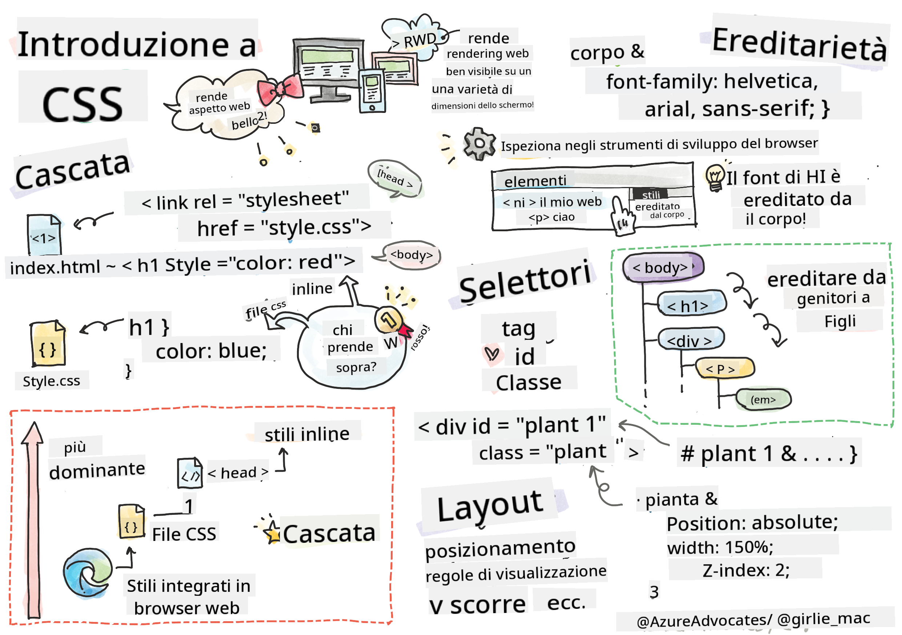

<!--
CO_OP_TRANSLATOR_METADATA:
{
  "original_hash": "e375c2aeb94e2407f2667633d39580bd",
  "translation_date": "2025-08-25T21:27:51+00:00",
  "source_file": "3-terrarium/2-intro-to-css/README.md",
  "language_code": "it"
}
-->
# Progetto Terrarium Parte 2: Introduzione a CSS


> Sketchnote di [Tomomi Imura](https://twitter.com/girlie_mac)

## Quiz Pre-Lezione

[Quiz pre-lezione](https://ff-quizzes.netlify.app/web/quiz/17)

### Introduzione

CSS, o Cascading Style Sheets, risolve un problema importante nello sviluppo web: come rendere il tuo sito web esteticamente gradevole. Dare uno stile alle tue app le rende più usabili e visivamente accattivanti; inoltre, puoi utilizzare CSS per creare un Responsive Web Design (RWD) - permettendo alle tue app di adattarsi bene a qualsiasi dimensione dello schermo. CSS non serve solo a migliorare l'aspetto della tua app; le sue specifiche includono animazioni e trasformazioni che possono abilitare interazioni sofisticate per le tue app. Il CSS Working Group aiuta a mantenere aggiornate le specifiche di CSS; puoi seguire il loro lavoro sul [sito del World Wide Web Consortium](https://www.w3.org/Style/CSS/members).

> Nota, CSS è un linguaggio in evoluzione, come tutto ciò che riguarda il web, e non tutti i browser supportano le parti più recenti delle specifiche. Controlla sempre le tue implementazioni consultando [CanIUse.com](https://caniuse.com).

In questa lezione, aggiungeremo stili al nostro terrarium online e impareremo di più su diversi concetti di CSS: la cascata, l'ereditarietà, l'uso dei selettori, il posizionamento e l'uso di CSS per creare layout. Durante il processo, creeremo il layout del terrarium e costruiremo il terrarium stesso.

### Prerequisiti

Dovresti avere l'HTML del tuo terrarium già costruito e pronto per essere stilizzato.

> Guarda il video

> 
> [](https://www.youtube.com/watch?v=6yIdOIV9p1I)

### Compito

Nella tua cartella del terrarium, crea un nuovo file chiamato `style.css`. Importa quel file nella sezione `<head>`:

```html
<link rel="stylesheet" href="./style.css" />
```

---

## La Cascata

I Fogli di Stile a Cascata incorporano l'idea che gli stili "cascano", in modo che l'applicazione di uno stile sia guidata dalla sua priorità. Gli stili impostati da un autore di un sito web hanno priorità su quelli impostati da un browser. Gli stili impostati "inline" hanno priorità su quelli definiti in un foglio di stile esterno.

### Compito

Aggiungi lo stile inline "color: red" al tuo tag `<h1>`:

```HTML
<h1 style="color: red">My Terrarium</h1>
```

Poi, aggiungi il seguente codice al tuo file `style.css`:

```CSS
h1 {
 color: blue;
}
```

✅ Quale colore viene visualizzato nella tua app web? Perché? Riesci a trovare un modo per sovrascrivere gli stili? Quando vorresti farlo, o perché no?

---

## Ereditarietà

Gli stili vengono ereditati da uno stile antenato a un discendente, in modo che gli elementi annidati ereditino gli stili dei loro genitori.

### Compito

Imposta il font del corpo a un determinato font e verifica il font di un elemento annidato:

```CSS
body {
	font-family: helvetica, arial, sans-serif;
}
```

Apri la console del tuo browser nella scheda 'Elementi' e osserva il font dell'H1. Esso eredita il font dal corpo, come indicato nel browser:


✅ Puoi fare in modo che uno stile annidato erediti una proprietà diversa?

---

## Selettori CSS

### Tag

Finora, il tuo file `style.css` ha stilizzato solo pochi tag, e l'app appare piuttosto strana:

```CSS
body {
	font-family: helvetica, arial, sans-serif;
}

h1 {
	color: #3a241d;
	text-align: center;
}
```

Questo modo di stilizzare un tag ti dà controllo su elementi unici, ma hai bisogno di controllare gli stili di molte piante nel tuo terrarium. Per farlo, devi sfruttare i selettori CSS.

### Id

Aggiungi uno stile per disporre i contenitori sinistro e destro. Poiché c'è solo un contenitore sinistro e uno destro, vengono assegnati id nel markup. Per stilizzarli, usa `#`:

```CSS
#left-container {
	background-color: #eee;
	width: 15%;
	left: 0px;
	top: 0px;
	position: absolute;
	height: 100%;
	padding: 10px;
}

#right-container {
	background-color: #eee;
	width: 15%;
	right: 0px;
	top: 0px;
	position: absolute;
	height: 100%;
	padding: 10px;
}
```

Qui, hai posizionato questi contenitori con posizionamento assoluto ai lati sinistro e destro dello schermo, e hai usato percentuali per la loro larghezza in modo che possano adattarsi agli schermi mobili più piccoli.

✅ Questo codice è piuttosto ripetitivo, quindi non è "DRY" (Don't Repeat Yourself); riesci a trovare un modo migliore per stilizzare questi id, magari con un id e una classe? Dovresti modificare il markup e rifattorizzare il CSS:

```html
<div id="left-container" class="container"></div>
```

### Classi

Nell'esempio sopra, hai stilizzato due elementi unici sullo schermo. Se vuoi che gli stili si applichino a molti elementi sullo schermo, puoi usare le classi CSS. Fai questo per disporre le piante nei contenitori sinistro e destro.

Nota che ogni pianta nel markup HTML ha una combinazione di id e classi. Gli id qui sono usati dal JavaScript che aggiungerai in seguito per manipolare il posizionamento delle piante nel terrarium. Le classi, invece, danno a tutte le piante uno stile specifico.

```html
<div class="plant-holder">
	
</div>
```

Aggiungi il seguente codice al tuo file `style.css`:

```CSS
.plant-holder {
	position: relative;
	height: 13%;
	left: -10px;
}

.plant {
	position: absolute;
	max-width: 150%;
	max-height: 150%;
	z-index: 2;
}
```

Degno di nota in questo snippet è il mix di posizionamento relativo e assoluto, che approfondiremo nella prossima sezione. Dai un'occhiata al modo in cui le altezze sono gestite con percentuali:

Hai impostato l'altezza del contenitore delle piante al 13%, un buon valore per assicurarti che tutte le piante siano visualizzate in ogni contenitore verticale senza bisogno di scorrimento.

Hai spostato il contenitore delle piante verso sinistra per permettere alle piante di essere più centrate all'interno del loro contenitore. Le immagini hanno un ampio sfondo trasparente per renderle più trascinabili, quindi devono essere spostate a sinistra per adattarsi meglio allo schermo.

Poi, la pianta stessa ha una larghezza massima del 150%. Questo le permette di ridimensionarsi quando il browser viene ridimensionato. Prova a ridimensionare il tuo browser; le piante rimangono nei loro contenitori ma si ridimensionano per adattarsi.

Degno di nota è anche l'uso di z-index, che controlla l'altitudine relativa di un elemento (in modo che le piante si trovino sopra il contenitore e sembrino sedersi all'interno del terrarium).

✅ Perché hai bisogno sia di un selettore CSS per il contenitore delle piante che per la pianta?

## Posizionamento CSS

Mescolare le proprietà di posizionamento (ci sono posizioni statiche, relative, fisse, assolute e sticky) può essere un po' complicato, ma se fatto correttamente ti dà un buon controllo sugli elementi delle tue pagine.

Gli elementi posizionati in modo assoluto sono posizionati rispetto ai loro antenati posizionati più vicini, e se non ce ne sono, sono posizionati rispetto al corpo del documento.

Gli elementi posizionati in modo relativo sono posizionati in base alle indicazioni del CSS per regolare la loro posizione rispetto alla loro posizione iniziale.

Nel nostro esempio, il `plant-holder` è un elemento posizionato in modo relativo che è posizionato all'interno di un contenitore posizionato in modo assoluto. Il comportamento risultante è che i contenitori della barra laterale sono fissati a sinistra e a destra, e il `plant-holder` è annidato, regolando se stesso all'interno delle barre laterali, dando spazio per posizionare le piante in una fila verticale.

> La `plant` stessa ha anche un posizionamento assoluto, necessario per renderla trascinabile, come scoprirai nella prossima lezione.

✅ Sperimenta cambiando i tipi di posizionamento dei contenitori laterali e del `plant-holder`. Cosa succede?

## Layout CSS

Ora userai ciò che hai imparato per costruire il terrarium stesso, tutto usando CSS!

Per prima cosa, stila i figli del div `.terrarium` come un rettangolo arrotondato usando CSS:

```CSS
.jar-walls {
	height: 80%;
	width: 60%;
	background: #d1e1df;
	border-radius: 1rem;
	position: absolute;
	bottom: 0.5%;
	left: 20%;
	opacity: 0.5;
	z-index: 1;
}

.jar-top {
	width: 50%;
	height: 5%;
	background: #d1e1df;
	position: absolute;
	bottom: 80.5%;
	left: 25%;
	opacity: 0.7;
	z-index: 1;
}

.jar-bottom {
	width: 50%;
	height: 1%;
	background: #d1e1df;
	position: absolute;
	bottom: 0%;
	left: 25%;
	opacity: 0.7;
}

.dirt {
	width: 60%;
	height: 5%;
	background: #3a241d;
	position: absolute;
	border-radius: 0 0 1rem 1rem;
	bottom: 1%;
	left: 20%;
	opacity: 0.7;
	z-index: -1;
}
```

Nota l'uso delle percentuali qui. Se ridimensioni il tuo browser, puoi vedere come anche il barattolo si ridimensiona. Nota anche le percentuali di larghezza e altezza per gli elementi del barattolo e come ogni elemento è posizionato assolutamente al centro, fissato in basso nella finestra.

Stiamo anche usando `rem` per il border-radius, una lunghezza relativa al font. Leggi di più su questo tipo di misura relativa nelle [specifiche CSS](https://www.w3.org/TR/css-values-3/#font-relative-lengths).

✅ Prova a cambiare i colori e l'opacità del barattolo rispetto a quelli della terra. Cosa succede? Perché?

---

## 🚀Sfida

Aggiungi un riflesso "a bolla" nella parte inferiore sinistra del barattolo per farlo sembrare più simile al vetro. Stilerai `.jar-glossy-long` e `.jar-glossy-short` per farli sembrare un riflesso. Ecco come dovrebbe apparire:


Per completare il quiz post-lezione, segui questo modulo Learn: [Dai stile alla tua app HTML con CSS](https://docs.microsoft.com/learn/modules/build-simple-website/4-css-basics/?WT.mc_id=academic-77807-sagibbon)

## Quiz Post-Lezione

[Quiz post-lezione](https://ff-quizzes.netlify.app/web/quiz/18)

## Revisione e Studio Autonomo

CSS sembra ingannevolmente semplice, ma ci sono molte sfide quando si cerca di stilizzare un'app perfettamente per tutti i browser e tutte le dimensioni dello schermo. CSS-Grid e Flexbox sono strumenti sviluppati per rendere il lavoro un po' più strutturato e affidabile. Impara a usare questi strumenti giocando a [Flexbox Froggy](https://flexboxfroggy.com/) e [Grid Garden](https://codepip.com/games/grid-garden/).

## Compito

[Refactoring CSS](assignment.md)

**Disclaimer (Avvertenza)**:  
Questo documento è stato tradotto utilizzando il servizio di traduzione automatica [Co-op Translator](https://github.com/Azure/co-op-translator). Sebbene ci impegniamo per garantire l'accuratezza, si prega di notare che le traduzioni automatiche potrebbero contenere errori o imprecisioni. Il documento originale nella sua lingua nativa dovrebbe essere considerato la fonte autorevole. Per informazioni critiche, si raccomanda una traduzione professionale effettuata da un traduttore umano. Non siamo responsabili per eventuali incomprensioni o interpretazioni errate derivanti dall'uso di questa traduzione.