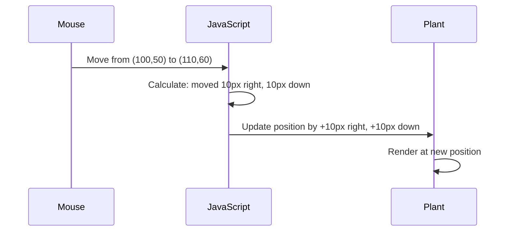

<!--
CO_OP_TRANSLATOR_METADATA:
{
  "original_hash": "bc93f6285423033ebf5b8abeb5282888",
  "translation_date": "2025-10-22T23:30:13+00:00",
  "source_file": "3-terrarium/3-intro-to-DOM-and-closures/README.md",
  "language_code": "it"
}
-->
# Progetto Terrario Parte 3: Manipolazione del DOM e Closures in JavaScript


> Sketchnote di [Tomomi Imura](https://twitter.com/girlie_mac)

Benvenuto in uno degli aspetti più coinvolgenti dello sviluppo web: rendere le cose interattive! Il Document Object Model (DOM) è come un ponte tra il tuo HTML e JavaScript, e oggi lo useremo per dare vita al tuo terrario. Quando Tim Berners-Lee ha creato il primo browser web, immaginava un web in cui i documenti potessero essere dinamici e interattivi - il DOM rende possibile questa visione.

Esploreremo anche le closures in JavaScript, che potrebbero sembrare inizialmente intimidatorie. Pensa alle closures come a "tasche di memoria" che permettono alle tue funzioni di ricordare informazioni importanti. È come se ogni pianta nel tuo terrario avesse il proprio registro dati per tracciare la sua posizione. Alla fine di questa lezione, capirai quanto siano naturali e utili.

Ecco cosa stiamo costruendo: un terrario in cui gli utenti possono trascinare e posizionare le piante ovunque vogliano. Imparerai le tecniche di manipolazione del DOM che alimentano tutto, dai caricamenti di file tramite drag-and-drop ai giochi interattivi. Facciamo prendere vita al tuo terrario.

## Quiz Pre-Lezione

[Quiz pre-lezione](https://ff-quizzes.netlify.app/web/quiz/19)

## Comprendere il DOM: La tua porta d'accesso alle pagine web interattive

Il Document Object Model (DOM) è il modo in cui JavaScript comunica con gli elementi HTML. Quando il tuo browser carica una pagina HTML, crea una rappresentazione strutturata di quella pagina in memoria - questo è il DOM. Pensalo come un albero genealogico in cui ogni elemento HTML è un membro della famiglia che JavaScript può accedere, modificare o riorganizzare.

La manipolazione del DOM trasforma le pagine statiche in siti web interattivi. Ogni volta che vedi un pulsante cambiare colore al passaggio del mouse, un contenuto aggiornarsi senza ricaricare la pagina o elementi che puoi trascinare, è la manipolazione del DOM in azione.


> Una rappresentazione del DOM e del markup HTML che lo riferisce. Da [Olfa Nasraoui](https://www.researchgate.net/publication/221417012_Profile-Based_Focused_Crawler_for_Social_Media-Sharing_Websites)

**Ecco cosa rende il DOM potente:**
- **Fornisce** un modo strutturato per accedere a qualsiasi elemento della tua pagina
- **Permette** aggiornamenti dinamici dei contenuti senza ricaricare la pagina
- **Consente** risposte in tempo reale alle interazioni dell'utente come clic e trascinamenti
- **Crea** la base per applicazioni web interattive moderne

## Closures in JavaScript: Creare codice organizzato e potente

Una [closure in JavaScript](https://developer.mozilla.org/docs/Web/JavaScript/Closures) è come dare a una funzione il proprio spazio di lavoro privato con memoria persistente. Considera come i fringuelli di Darwin nelle Isole Galápagos hanno sviluppato beccucci specializzati in base al loro ambiente specifico - le closures funzionano in modo simile, creando funzioni specializzate che "ricordano" il loro contesto specifico anche dopo che la funzione genitore ha terminato.

Nel nostro terrario, le closures aiutano ogni pianta a ricordare la propria posizione in modo indipendente. Questo schema appare in tutto lo sviluppo professionale di JavaScript, rendendolo un concetto prezioso da comprendere.

> 💡 **Comprendere le Closures**: Le closures sono un argomento significativo in JavaScript, e molti sviluppatori le usano per anni prima di comprendere appieno tutti gli aspetti teorici. Oggi ci concentreremo sull'applicazione pratica - vedrai le closures emergere naturalmente mentre costruiamo le nostre funzionalità interattive. La comprensione si svilupperà man mano che vedrai come risolvono problemi reali.


> Una rappresentazione del DOM e del markup HTML che lo riferisce. Da [Olfa Nasraoui](https://www.researchgate.net/publication/221417012_Profile-Based_Focused_Crawler_for_Social_Media-Sharing_Websites)

In questa lezione, completeremo il nostro progetto interattivo del terrario creando il JavaScript che permetterà a un utente di manipolare le piante sulla pagina.

## Prima di iniziare: Prepararsi al successo

Avrai bisogno dei tuoi file HTML e CSS delle lezioni precedenti sul terrario - stiamo per rendere quel design statico interattivo. Se ti unisci per la prima volta, completare quelle lezioni prima ti fornirà un contesto importante.

Ecco cosa costruiremo:
- **Trascinamento fluido** per tutte le piante del terrario
- **Tracciamento delle coordinate** in modo che le piante ricordino le loro posizioni
- **Un'interfaccia interattiva completa** usando JavaScript puro
- **Codice pulito e organizzato** usando schemi di closure

## Configurare il tuo file JavaScript

Creiamo il file JavaScript che renderà interattivo il tuo terrario.

**Passo 1: Crea il tuo file script**

Nella tua cartella del terrario, crea un nuovo file chiamato `script.js`.

**Passo 2: Collega il JavaScript al tuo HTML**

Aggiungi questo tag script alla sezione `<head>` del tuo file `index.html`:

```html
<script src="./script.js" defer></script>
```

**Perché l'attributo `defer` è importante:**
- **Garantisce** che il tuo JavaScript aspetti che tutto l'HTML sia caricato
- **Previene** errori in cui JavaScript cerca elementi che non sono ancora pronti
- **Assicura** che tutti gli elementi delle piante siano disponibili per l'interazione
- **Fornisce** prestazioni migliori rispetto al posizionamento degli script in fondo alla pagina

> ⚠️ **Nota Importante**: L'attributo `defer` previene problemi di temporizzazione comuni. Senza di esso, JavaScript potrebbe tentare di accedere agli elementi HTML prima che siano caricati, causando errori.

---

## Collegare JavaScript agli elementi HTML

Prima di poter rendere gli elementi trascinabili, JavaScript deve localizzarli nel DOM. Pensalo come un sistema di catalogazione della biblioteca - una volta che hai il numero di catalogo, puoi trovare esattamente il libro di cui hai bisogno e accedere a tutti i suoi contenuti.

Useremo il metodo `document.getElementById()` per stabilire queste connessioni. È come avere un sistema di archiviazione preciso - fornisci un ID e individua esattamente l'elemento di cui hai bisogno nel tuo HTML.

### Abilitare la funzionalità di trascinamento per tutte le piante

Aggiungi questo codice al tuo file `script.js`:

```javascript
// Enable drag functionality for all 14 plants
dragElement(document.getElementById('plant1'));
dragElement(document.getElementById('plant2'));
dragElement(document.getElementById('plant3'));
dragElement(document.getElementById('plant4'));
dragElement(document.getElementById('plant5'));
dragElement(document.getElementById('plant6'));
dragElement(document.getElementById('plant7'));
dragElement(document.getElementById('plant8'));
dragElement(document.getElementById('plant9'));
dragElement(document.getElementById('plant10'));
dragElement(document.getElementById('plant11'));
dragElement(document.getElementById('plant12'));
dragElement(document.getElementById('plant13'));
dragElement(document.getElementById('plant14'));
```

**Ecco cosa fa questo codice:**
- **Localizza** ogni elemento pianta nel DOM usando il suo ID unico
- **Recupera** un riferimento JavaScript a ciascun elemento HTML
- **Passa** ogni elemento a una funzione `dragElement` (che creeremo a breve)
- **Prepara** ogni pianta per l'interazione drag-and-drop
- **Collega** la tua struttura HTML alla funzionalità JavaScript

> 🎯 **Perché usare gli ID invece delle classi?** Gli ID forniscono identificatori univoci per elementi specifici, mentre le classi CSS sono progettate per stilizzare gruppi di elementi. Quando JavaScript deve manipolare singoli elementi, gli ID offrono la precisione e le prestazioni di cui abbiamo bisogno.

> 💡 **Suggerimento Pro**: Nota come stiamo chiamando `dragElement()` per ogni pianta individualmente. Questo approccio garantisce che ogni pianta abbia il proprio comportamento di trascinamento indipendente, essenziale per un'interazione fluida dell'utente.

---

## Costruire la Closure Drag Element

Ora creeremo il cuore della nostra funzionalità di trascinamento: una closure che gestisce il comportamento di trascinamento per ogni pianta. Questa closure conterrà più funzioni interne che lavorano insieme per tracciare i movimenti del mouse e aggiornare le posizioni degli elementi.

Le closures sono perfette per questo compito perché ci permettono di creare variabili "private" che persistono tra le chiamate di funzione, dando a ogni pianta il proprio sistema di tracciamento delle coordinate indipendente.

### Comprendere le Closures con un esempio semplice

Lascia che ti dimostri le closures con un esempio semplice che illustra il concetto:

```javascript
function createCounter() {
    let count = 0; // This is like a private variable
    
    function increment() {
        count++; // The inner function remembers the outer variable
        return count;
    }
    
    return increment; // We're giving back the inner function
}

const myCounter = createCounter();
console.log(myCounter()); // 1
console.log(myCounter()); // 2
```

**Ecco cosa succede in questo schema di closure:**
- **Crea** una variabile privata `count` che esiste solo all'interno di questa closure
- **La funzione interna** può accedere e modificare quella variabile esterna (il meccanismo della closure)
- **Quando restituiamo** la funzione interna, mantiene la sua connessione a quei dati privati
- **Anche dopo** che `createCounter()` termina l'esecuzione, `count` persiste e ricorda il suo valore

### Perché le Closures sono perfette per la funzionalità di trascinamento

Per il nostro terrario, ogni pianta deve ricordare le proprie coordinate di posizione attuali. Le closures forniscono la soluzione perfetta:

**Vantaggi chiave per il nostro progetto:**
- **Mantiene** variabili di posizione private per ogni pianta in modo indipendente
- **Preserva** i dati delle coordinate tra gli eventi di trascinamento
- **Previene** conflitti di variabili tra diversi elementi trascinabili
- **Crea** una struttura di codice pulita e organizzata

> 🎯 **Obiettivo di apprendimento**: Non è necessario padroneggiare ogni aspetto delle closures in questo momento. Concentrati sul vedere come aiutano a organizzare il codice e mantenere lo stato per la nostra funzionalità di trascinamento.

### Creare la funzione dragElement

Ora costruiamo la funzione principale che gestirà tutta la logica di trascinamento. Aggiungi questa funzione sotto le dichiarazioni degli elementi pianta:

```javascript
function dragElement(terrariumElement) {
    // Initialize position tracking variables
    let pos1 = 0,  // Previous mouse X position
        pos2 = 0,  // Previous mouse Y position  
        pos3 = 0,  // Current mouse X position
        pos4 = 0;  // Current mouse Y position
    
    // Set up the initial drag event listener
    terrariumElement.onpointerdown = pointerDrag;
}
```

**Comprendere il sistema di tracciamento della posizione:**
- **`pos1` e `pos2`**: Memorizzano la differenza tra le vecchie e nuove posizioni del mouse
- **`pos3` e `pos4`**: Tracciano le coordinate attuali del mouse
- **`terrariumElement`**: L'elemento pianta specifico che stiamo rendendo trascinabile
- **`onpointerdown`**: L'evento che si attiva quando l'utente inizia a trascinare

**Ecco come funziona il pattern di closure:**
- **Crea** variabili di posizione private per ogni elemento pianta
- **Mantiene** queste variabili durante l'intero ciclo di trascinamento
- **Garantisce** che ogni pianta tracci le proprie coordinate in modo indipendente
- **Fornisce** un'interfaccia pulita attraverso la funzione `dragElement`

### Perché usare gli eventi Pointer?

Potresti chiederti perché usiamo `onpointerdown` invece del più familiare `onclick`. Ecco la spiegazione:

| Tipo di evento | Migliore per | La limitazione |
|----------------|-------------|----------------|
| `onclick` | Clic semplici su pulsanti | Non può gestire il trascinamento (solo clic e rilascio) |
| `onpointerdown` | Mouse e touch | Più recente, ma ben supportato oggi |
| `onmousedown` | Solo mouse desktop | Esclude gli utenti mobili |

**Perché gli eventi pointer sono perfetti per ciò che stiamo costruendo:**
- **Funzionano bene** sia che qualcuno usi un mouse, un dito o persino uno stilo
- **Si comportano allo stesso modo** su laptop, tablet o telefono
- **Gestiscono** il movimento di trascinamento effettivo (non solo clic e rilascio)
- **Creano** un'esperienza fluida che gli utenti si aspettano dalle app web moderne

> 💡 **Prepararsi al futuro**: Gli eventi pointer sono il modo moderno per gestire le interazioni dell'utente. Invece di scrivere codice separato per mouse e touch, ottieni entrambi gratuitamente. Piuttosto interessante, vero?

---

## La funzione pointerDrag: Catturare l'inizio di un trascinamento

Quando un utente preme su una pianta (sia con un clic del mouse che con un tocco), la funzione `pointerDrag` entra in azione. Questa funzione cattura le coordinate iniziali e configura il sistema di trascinamento.

Aggiungi questa funzione all'interno della tua closure `dragElement`, subito dopo la riga `terrariumElement.onpointerdown = pointerDrag;`:

```javascript
function pointerDrag(e) {
    // Prevent default browser behavior (like text selection)
    e.preventDefault();
    
    // Capture the initial mouse/touch position
    pos3 = e.clientX;  // X coordinate where drag started
    pos4 = e.clientY;  // Y coordinate where drag started
    
    // Set up event listeners for the dragging process
    document.onpointermove = elementDrag;
    document.onpointerup = stopElementDrag;
}
```

**Passo dopo passo, ecco cosa succede:**
- **Previene** i comportamenti predefiniti del browser che potrebbero interferire con il trascinamento
- **Registra** le coordinate esatte in cui l'utente ha iniziato il gesto di trascinamento
- **Stabilisce** i listener di eventi per il movimento di trascinamento in corso
- **Prepara** il sistema a tracciare il movimento del mouse/del dito su tutto il documento

### Comprendere la prevenzione degli eventi

La riga `e.preventDefault()` è cruciale per un trascinamento fluido:

**Senza prevenzione, i browser potrebbero:**
- **Selezionare** il testo durante il trascinamento sulla pagina
- **Attivare** menu contestuali con il clic destro durante il trascinamento
- **Interferire** con il nostro comportamento di trascinamento personalizzato
- **Creare** artefatti visivi durante l'operazione di trascinamento

> 🔍 **Esperimento**: Dopo aver completato questa lezione, prova a rimuovere `e.preventDefault()` e osserva come influisce sull'esperienza di trascinamento. Capirai rapidamente perché questa riga è essenziale!

### Sistema di tracciamento delle coordinate

Le proprietà `e.clientX` e `e.clientY` ci forniscono coordinate precise del mouse/touch:

| Proprietà | Cosa misura | Caso d'uso |
|-----------|-------------|------------|
| `clientX` | Posizione orizzontale relativa alla viewport | Tracciamento del movimento sinistra-destra |
| `clientY` | Posizione verticale relativa alla viewport | Tracciamento del movimento su-giù |

**Comprendere queste coordinate:**
- **Fornisce** informazioni di posizionamento precise al pixel
- **Aggiorna** in tempo reale mentre l'utente muove il puntatore
- **Rimane** coerente su diverse dimensioni dello schermo e livelli di zoom
- **Consente** interazioni di trascinamento fluide e reattive

### Configurare i listener di eventi a livello di documento

Nota come colleghiamo gli eventi di movimento e arresto all'intero `document`, non solo all'elemento pianta:

```javascript
document.onpointermove = elementDrag;
document.onpointerup = stopElementDrag;
```

**Perché collegare al documento:**
- **Continua** a tracciare anche quando il mouse lascia l'elemento pianta
- **Previene** interruzioni del trascinamento se l'utente si muove rapidamente
- **Fornisce** un trascinamento fluido su tutto lo schermo
- **Gestisce** casi limite in cui il cursore si sposta fuori dalla finestra del browser

> ⚡ **Nota sulle prestazioni**: Puliremo questi listener a livello di documento quando il trascinamento si arresta per evitare perdite di memoria e problemi di prestazioni.

## Completare il sistema di trascinamento: Movimento e pulizia

Ora aggiungeremo le due funzioni rimanenti che gestiscono il movimento effettivo del trascinamento e la pulizia quando il trascinamento si arresta. Queste funzioni lavorano insieme per creare un movimento fluido e reattivo delle piante nel tuo terrario.

### La funzione elementDrag: Tracciamento del movimento

Aggiungi la funzione `elementDrag` subito dopo la parentesi chiusa di `pointerDrag`:

```javascript
function elementDrag(e) {
    // Calculate the distance moved since the last event
    pos1 = pos3 - e.clientX;  // Horizontal distance moved
    pos2 = pos4 - e.clientY;  // Vertical distance moved
    
    // Update the current position tracking
    pos3 = e.clientX;  // New current X position
    pos4 = e.clientY;  // New current Y position
    
    // Apply the movement to the element's position
    terrariumElement.style.top = (terrariumElement.offsetTop - pos2) + 'px';
    terrariumElement.style.left = (terrariumElement.offsetLeft - pos1) + 'px';
}
```

**Comprendere la matematica delle coordinate:**
- **`pos1` e `pos2`**: Calcolano quanto si è spostato il mouse dall'ultimo aggiornamento
- **`pos3` e `pos4`**: Memorizzano la posizione attuale del mouse per il prossimo calcolo
- **`offsetTop` e `offsetLeft`**: Ottengono la posizione attuale dell'elemento sulla pagina
- **Logica di sottrazione**: Sposta l'elemento della stessa quantità di movimento del mouse

**Ecco la suddivisione del calcolo del movimento:**
1. **Misura** la differenza tra le vecchie e nuove posizioni del mouse
2. **Calcola** quanto spostare l'elemento in base al movimento del mouse
3. **Aggiorna** le proprietà di posizione CSS dell'elemento in tempo reale
4. **Memorizza** la nuova posizione come base per il prossimo calcolo di movimento

### Rappresentazione visiva della matematica



### La funzione stopElementDrag: Pulizia

Aggiungi la funzione di pulizia dopo la parentesi graffa di chiusura di `elementDrag`:

```javascript
function stopElementDrag() {
    // Remove the document-level event listeners
    document.onpointerup = null;
    document.onpointermove = null;
}
```

**Perché la pulizia è essenziale:**
- **Previene** perdite di memoria causate da listener di eventi persistenti
- **Interrompe** il comportamento di trascinamento quando l'utente rilascia la pianta
- **Permette** ad altri elementi di essere trascinati indipendentemente
- **Resetta** il sistema per la prossima operazione di trascinamento

**Cosa succede senza pulizia:**
- I listener di eventi continuano a funzionare anche dopo che il trascinamento si è fermato
- Le prestazioni si degradano man mano che i listener inutilizzati si accumulano
- Comportamenti imprevisti durante l'interazione con altri elementi
- Le risorse del browser vengono sprecate per la gestione di eventi inutili

### Comprendere le proprietà di posizione CSS

Il nostro sistema di trascinamento manipola due proprietà CSS chiave:

| Proprietà | Cosa controlla | Come la usiamo |
|-----------|----------------|----------------|
| `top` | Distanza dal bordo superiore | Posizionamento verticale durante il trascinamento |
| `left` | Distanza dal bordo sinistro | Posizionamento orizzontale durante il trascinamento |

**Informazioni chiave sulle proprietà offset:**
- **`offsetTop`**: Distanza attuale dal bordo superiore dell'elemento genitore posizionato
- **`offsetLeft`**: Distanza attuale dal bordo sinistro dell'elemento genitore posizionato
- **Contesto di posizionamento**: Questi valori sono relativi all'antenato posizionato più vicino
- **Aggiornamenti in tempo reale**: Cambiano immediatamente quando modifichiamo le proprietà CSS

> 🎯 **Filosofia di design**: Questo sistema di trascinamento è volutamente flessibile – non ci sono "zone di rilascio" o restrizioni. Gli utenti possono posizionare le piante ovunque, dando loro il completo controllo creativo sul design del terrario.

## Mettere tutto insieme: Il tuo sistema completo di trascinamento

Congratulazioni! Hai appena costruito un sofisticato sistema di trascinamento e rilascio utilizzando JavaScript puro. La tua funzione completa `dragElement` ora contiene una potente chiusura che gestisce:

**Cosa realizza la tua chiusura:**
- **Mantiene** variabili di posizione private per ogni pianta in modo indipendente
- **Gestisce** l'intero ciclo di vita del trascinamento dall'inizio alla fine
- **Fornisce** un movimento fluido e reattivo su tutto lo schermo
- **Pulisce** correttamente le risorse per prevenire perdite di memoria
- **Crea** un'interfaccia intuitiva e creativa per il design del terrario

### Testare il tuo terrario interattivo

Ora testa il tuo terrario interattivo! Apri il file `index.html` in un browser web e prova la funzionalità:

1. **Clicca e tieni premuto** su una pianta per iniziare il trascinamento
2. **Muovi il mouse o il dito** e osserva la pianta seguire fluidamente
3. **Rilascia** per posizionare la pianta nella sua nuova posizione
4. **Sperimenta** con diverse disposizioni per esplorare l'interfaccia

🥇 **Traguardo**: Hai creato un'applicazione web completamente interattiva utilizzando concetti fondamentali che gli sviluppatori professionisti usano quotidianamente. Questa funzionalità di trascinamento e rilascio utilizza gli stessi principi alla base del caricamento di file, delle bacheche kanban e di molte altre interfacce interattive.


---

## Sfida GitHub Copilot Agent 🚀

Usa la modalità Agent per completare la seguente sfida:

**Descrizione:** Migliora il progetto del terrario aggiungendo una funzionalità di reset che riporta tutte le piante alle loro posizioni originali con animazioni fluide.

**Prompt:** Crea un pulsante di reset che, quando cliccato, anima tutte le piante tornando alle loro posizioni originali nella barra laterale utilizzando transizioni CSS. La funzione dovrebbe memorizzare le posizioni originali quando la pagina viene caricata e far tornare le piante a quelle posizioni in modo fluido in 1 secondo quando il pulsante di reset viene premuto.

Scopri di più sulla [modalità agent](https://code.visualstudio.com/blogs/2025/02/24/introducing-copilot-agent-mode) qui.

## 🚀 Sfida aggiuntiva: Espandi le tue competenze

Pronto a portare il tuo terrario al livello successivo? Prova a implementare questi miglioramenti:

**Estensioni creative:**
- **Doppio clic** su una pianta per portarla in primo piano (manipolazione dello z-index)
- **Aggiungi feedback visivo** come un leggero bagliore quando si passa il mouse sopra le piante
- **Implementa confini** per impedire che le piante vengano trascinate fuori dal terrario
- **Crea una funzione di salvataggio** che memorizza le posizioni delle piante utilizzando localStorage
- **Aggiungi effetti sonori** per il sollevamento e il posizionamento delle piante

> 💡 **Opportunità di apprendimento**: Ognuna di queste sfide ti insegnerà nuovi aspetti della manipolazione del DOM, della gestione degli eventi e del design dell'esperienza utente.

## Quiz post-lezione

[Quiz post-lezione](https://ff-quizzes.netlify.app/web/quiz/20)

## Revisione e studio autonomo: Approfondire la comprensione

Hai padroneggiato i fondamenti della manipolazione del DOM e delle chiusure, ma c'è sempre altro da esplorare! Ecco alcune strade per ampliare le tue conoscenze e competenze.

### Approcci alternativi al trascinamento e rilascio

Abbiamo utilizzato eventi pointer per la massima flessibilità, ma lo sviluppo web offre diversi approcci:

| Approccio | Ideale per | Valore di apprendimento |
|-----------|------------|-------------------------|
| [API HTML Drag and Drop](https://developer.mozilla.org/docs/Web/API/HTML_Drag_and_Drop_API) | Caricamento di file, zone di trascinamento formali | Comprendere le capacità native del browser |
| [Eventi touch](https://developer.mozilla.org/docs/Web/API/Touch_events) | Interazioni specifiche per dispositivi mobili | Modelli di sviluppo mobile-first |
| Proprietà CSS `transform` | Animazioni fluide | Tecniche di ottimizzazione delle prestazioni |

### Argomenti avanzati di manipolazione del DOM

**Prossimi passi nel tuo percorso di apprendimento:**
- **Delegazione degli eventi**: Gestire gli eventi in modo efficiente per più elementi
- **Intersection Observer**: Rilevare quando gli elementi entrano/escono dalla viewport
- **Mutation Observer**: Monitorare i cambiamenti nella struttura del DOM
- **Componenti Web**: Creare elementi UI riutilizzabili e incapsulati
- **Concetti di Virtual DOM**: Comprendere come i framework ottimizzano gli aggiornamenti del DOM

### Risorse essenziali per continuare a imparare

**Documentazione tecnica:**
- [Guida agli eventi pointer di MDN](https://developer.mozilla.org/docs/Web/API/Pointer_events) - Riferimento completo sugli eventi pointer
- [Specifiche degli eventi pointer W3C](https://www.w3.org/TR/pointerevents1/) - Documentazione ufficiale degli standard
- [Approfondimento sulle chiusure JavaScript](https://developer.mozilla.org/docs/Web/JavaScript/Closures) - Modelli avanzati di chiusure

**Compatibilità del browser:**
- [CanIUse.com](https://caniuse.com/) - Controlla il supporto delle funzionalità tra i browser
- [Dati di compatibilità del browser MDN](https://github.com/mdn/browser-compat-data) - Informazioni dettagliate sulla compatibilità

**Opportunità di pratica:**
- **Costruisci** un gioco di puzzle utilizzando meccaniche di trascinamento simili
- **Crea** una bacheca kanban con gestione delle attività tramite trascinamento e rilascio
- **Progetta** una galleria di immagini con disposizioni fotografiche trascinabili
- **Sperimenta** con gesti touch per interfacce mobili

> 🎯 **Strategia di apprendimento**: Il modo migliore per consolidare questi concetti è attraverso la pratica. Prova a costruire variazioni di interfacce trascinabili – ogni progetto ti insegnerà qualcosa di nuovo sull'interazione utente e sulla manipolazione del DOM.

## Compito

[Lavora un po' di più con il DOM](assignment.md)

---

**Disclaimer**:  
Questo documento è stato tradotto utilizzando il servizio di traduzione AI [Co-op Translator](https://github.com/Azure/co-op-translator). Sebbene ci impegniamo per garantire l'accuratezza, si prega di notare che le traduzioni automatiche possono contenere errori o imprecisioni. Il documento originale nella sua lingua nativa dovrebbe essere considerato la fonte autorevole. Per informazioni critiche, si raccomanda una traduzione professionale umana. Non siamo responsabili per eventuali incomprensioni o interpretazioni errate derivanti dall'uso di questa traduzione.