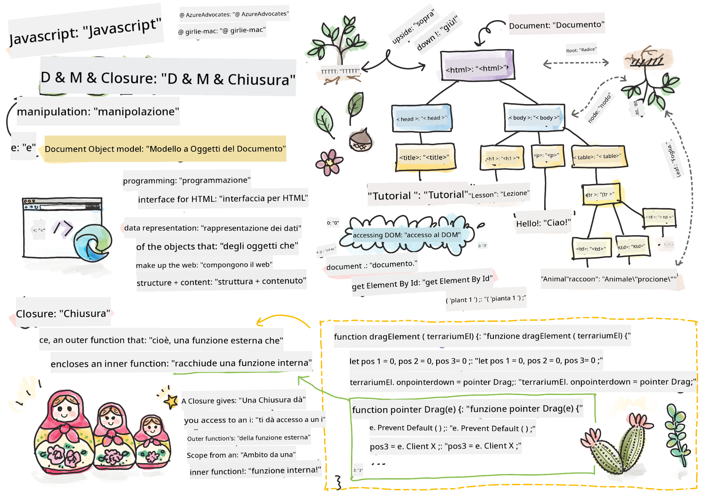
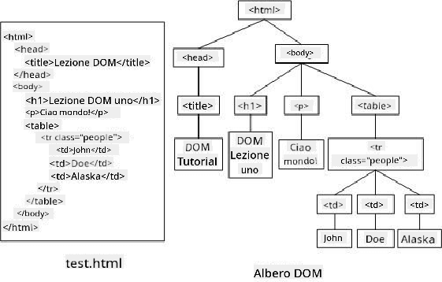

<!--
CO_OP_TRANSLATOR_METADATA:
{
  "original_hash": "30f8903a1f290e3d438dc2c70fe60259",
  "translation_date": "2025-08-25T21:20:45+00:00",
  "source_file": "3-terrarium/3-intro-to-DOM-and-closures/README.md",
  "language_code": "it"
}
-->
# Progetto Terrarium Parte 3: Manipolazione del DOM e una Closure


> Sketchnote di [Tomomi Imura](https://twitter.com/girlie_mac)

## Quiz Pre-Lezione

[Quiz pre-lezione](https://ff-quizzes.netlify.app/web/quiz/19)

### Introduzione

Manipolare il DOM, o "Document Object Model", è un aspetto fondamentale dello sviluppo web. Secondo [MDN](https://developer.mozilla.org/docs/Web/API/Document_Object_Model/Introduction), "Il Document Object Model (DOM) è la rappresentazione dei dati degli oggetti che costituiscono la struttura e il contenuto di un documento sul web." Le sfide legate alla manipolazione del DOM sul web hanno spesso spinto all'uso di framework JavaScript invece del JavaScript puro per gestire il DOM, ma ce la faremo da soli!

Inoltre, questa lezione introdurrà l'idea di una [closure in JavaScript](https://developer.mozilla.org/docs/Web/JavaScript/Closures), che puoi immaginare come una funzione racchiusa da un'altra funzione, in modo che la funzione interna abbia accesso allo scope della funzione esterna.

> Le closure in JavaScript sono un argomento vasto e complesso. Questa lezione tocca l'idea più basilare: nel codice del terrarium troverai una closure, una funzione interna e una funzione esterna costruite in modo da permettere alla funzione interna di accedere allo scope della funzione esterna. Per molte più informazioni su come funziona, visita la [documentazione approfondita](https://developer.mozilla.org/docs/Web/JavaScript/Closures).

Utilizzeremo una closure per manipolare il DOM.

Pensa al DOM come a un albero, che rappresenta tutti i modi in cui un documento di una pagina web può essere manipolato. Sono state scritte varie API (Application Program Interfaces) per consentire ai programmatori, utilizzando il linguaggio di programmazione di loro scelta, di accedere al DOM e modificarlo, cambiarlo, riorganizzarlo e gestirlo in altri modi.



> Una rappresentazione del DOM e del markup HTML che lo fa riferimento. Da [Olfa Nasraoui](https://www.researchgate.net/publication/221417012_Profile-Based_Focused_Crawler_for_Social_Media-Sharing_Websites)

In questa lezione completeremo il nostro progetto interattivo del terrarium creando il JavaScript che permetterà a un utente di manipolare le piante sulla pagina.

### Prerequisiti

Dovresti aver già costruito l'HTML e il CSS per il tuo terrarium. Alla fine di questa lezione sarai in grado di spostare le piante dentro e fuori dal terrarium trascinandole.

### Compito

Nella cartella del tuo terrarium, crea un nuovo file chiamato `script.js`. Importa quel file nella sezione `<head>`:

```html
	<script src="./script.js" defer></script>
```

> Nota: usa `defer` quando importi un file JavaScript esterno nel file HTML per consentire al JavaScript di essere eseguito solo dopo che il file HTML è stato completamente caricato. Puoi anche usare l'attributo `async`, che permette allo script di essere eseguito mentre il file HTML viene analizzato, ma nel nostro caso è importante che gli elementi HTML siano completamente disponibili per il trascinamento prima di eseguire lo script di trascinamento.
---

## Gli elementi del DOM

La prima cosa che devi fare è creare riferimenti agli elementi che vuoi manipolare nel DOM. Nel nostro caso, sono le 14 piante attualmente in attesa nelle barre laterali.

### Compito

```html
dragElement(document.getElementById('plant1'));
dragElement(document.getElementById('plant2'));
dragElement(document.getElementById('plant3'));
dragElement(document.getElementById('plant4'));
dragElement(document.getElementById('plant5'));
dragElement(document.getElementById('plant6'));
dragElement(document.getElementById('plant7'));
dragElement(document.getElementById('plant8'));
dragElement(document.getElementById('plant9'));
dragElement(document.getElementById('plant10'));
dragElement(document.getElementById('plant11'));
dragElement(document.getElementById('plant12'));
dragElement(document.getElementById('plant13'));
dragElement(document.getElementById('plant14'));
```

Cosa sta succedendo qui? Stai facendo riferimento al documento e cercando nel suo DOM per trovare un elemento con un particolare Id. Ricordi che nella prima lezione sull'HTML hai dato Id individuali a ciascuna immagine delle piante (`id="plant1"`)? Ora utilizzerai quel lavoro. Dopo aver identificato ciascun elemento, passi quell'elemento a una funzione chiamata `dragElement` che costruirai tra poco. Così, l'elemento nell'HTML è ora abilitato al trascinamento, o lo sarà a breve.

✅ Perché facciamo riferimento agli elementi tramite Id? Perché non tramite la loro classe CSS? Potresti fare riferimento alla lezione precedente sul CSS per rispondere a questa domanda.

---

## La Closure

Ora sei pronto per creare la closure `dragElement`, che è una funzione esterna che racchiude una funzione o più funzioni interne (nel nostro caso, ne avremo tre).

Le closure sono utili quando una o più funzioni devono accedere allo scope della funzione esterna. Ecco un esempio:

```javascript
function displayCandy(){
	let candy = ['jellybeans'];
	function addCandy(candyType) {
		candy.push(candyType)
	}
	addCandy('gumdrops');
}
displayCandy();
console.log(candy)
```

In questo esempio, la funzione `displayCandy` circonda una funzione che aggiunge un nuovo tipo di caramella a un array che esiste già nella funzione. Se eseguissi questo codice, l'array `candy` sarebbe indefinito, poiché è una variabile locale (locale alla closure).

✅ Come puoi rendere accessibile l'array `candy`? Prova a spostarlo fuori dalla closure. In questo modo, l'array diventa globale, invece di rimanere disponibile solo nello scope locale della closure.

### Compito

Sotto le dichiarazioni degli elementi in `script.js`, crea una funzione:

```javascript
function dragElement(terrariumElement) {
	//set 4 positions for positioning on the screen
	let pos1 = 0,
		pos2 = 0,
		pos3 = 0,
		pos4 = 0;
	terrariumElement.onpointerdown = pointerDrag;
}
```

`dragElement` ottiene il suo oggetto `terrariumElement` dalle dichiarazioni in cima allo script. Poi, imposti alcune posizioni locali a `0` per l'oggetto passato alla funzione. Queste sono le variabili locali che verranno manipolate per ciascun elemento mentre aggiungi la funzionalità di trascinamento e rilascio all'interno della closure per ciascun elemento. Il terrarium sarà popolato da questi elementi trascinati, quindi l'applicazione deve tenere traccia di dove sono posizionati.

Inoltre, l'elemento `terrariumElement` passato a questa funzione viene assegnato a un evento `pointerdown`, che fa parte delle [web API](https://developer.mozilla.org/docs/Web/API) progettate per aiutare con la gestione del DOM. `onpointerdown` viene attivato quando viene premuto un pulsante, o nel nostro caso, quando viene toccato un elemento trascinabile. Questo gestore di eventi funziona sia su [browser web che mobili](https://caniuse.com/?search=onpointerdown), con alcune eccezioni.

✅ Il [gestore di eventi `onclick`](https://developer.mozilla.org/docs/Web/API/GlobalEventHandlers/onclick) ha un supporto molto più ampio tra i browser; perché non usarlo qui? Pensa al tipo esatto di interazione con lo schermo che stai cercando di creare qui.

---

## La funzione Pointerdrag

Il `terrariumElement` è pronto per essere trascinato; quando l'evento `onpointerdown` viene attivato, viene invocata la funzione `pointerDrag`. Aggiungi quella funzione subito sotto questa riga: `terrariumElement.onpointerdown = pointerDrag;`:

### Compito 

```javascript
function pointerDrag(e) {
	e.preventDefault();
	console.log(e);
	pos3 = e.clientX;
	pos4 = e.clientY;
}
```

Succedono diverse cose. Per prima cosa, impedisci che gli eventi predefiniti che normalmente accadono su pointerdown si verifichino usando `e.preventDefault();`. In questo modo hai più controllo sul comportamento dell'interfaccia.

> Torna a questa riga quando avrai completato il file script e prova senza `e.preventDefault()` - cosa succede?

In secondo luogo, apri `index.html` in una finestra del browser e ispeziona l'interfaccia. Quando clicchi su una pianta, puoi vedere come l'evento 'e' viene catturato. Esamina l'evento per vedere quante informazioni vengono raccolte da un singolo evento pointerdown!  

Successivamente, nota come le variabili locali `pos3` e `pos4` vengono impostate su e.clientX. Puoi trovare i valori di `e` nel pannello di ispezione. Questi valori catturano le coordinate x e y della pianta nel momento in cui la clicchi o la tocchi. Avrai bisogno di un controllo preciso sul comportamento delle piante mentre le clicchi e le trascini, quindi tieni traccia delle loro coordinate.

✅ Sta diventando più chiaro perché questa intera app è costruita con una grande closure? Se non lo fosse, come manterresti lo scope per ciascuna delle 14 piante trascinabili?

Completa la funzione iniziale aggiungendo altre due manipolazioni degli eventi pointer sotto `pos4 = e.clientY`:

```html
document.onpointermove = elementDrag;
document.onpointerup = stopElementDrag;
```
Ora stai indicando che vuoi che la pianta venga trascinata insieme al puntatore mentre la muovi, e che il gesto di trascinamento si fermi quando deselezioni la pianta. `onpointermove` e `onpointerup` fanno parte della stessa API di `onpointerdown`. L'interfaccia ora genererà errori poiché non hai ancora definito le funzioni `elementDrag` e `stopElementDrag`, quindi costruiscile subito dopo.

## Le funzioni elementDrag e stopElementDrag

Completerai la tua closure aggiungendo altre due funzioni interne che gestiranno ciò che accade quando trascini una pianta e quando smetti di trascinarla. Il comportamento che desideri è che tu possa trascinare qualsiasi pianta in qualsiasi momento e posizionarla ovunque sullo schermo. Questa interfaccia è piuttosto flessibile (non c'è una zona di rilascio, ad esempio) per permetterti di progettare il tuo terrarium esattamente come preferisci aggiungendo, rimuovendo e riposizionando le piante.

### Compito

Aggiungi la funzione `elementDrag` subito dopo la parentesi graffa di chiusura di `pointerDrag`:

```javascript
function elementDrag(e) {
	pos1 = pos3 - e.clientX;
	pos2 = pos4 - e.clientY;
	pos3 = e.clientX;
	pos4 = e.clientY;
	console.log(pos1, pos2, pos3, pos4);
	terrariumElement.style.top = terrariumElement.offsetTop - pos2 + 'px';
	terrariumElement.style.left = terrariumElement.offsetLeft - pos1 + 'px';
}
```
In questa funzione, modifichi molte delle posizioni iniziali 1-4 che hai impostato come variabili locali nella funzione esterna. Cosa sta succedendo qui?

Mentre trascini, riassegni `pos1` rendendolo uguale a `pos3` (che hai impostato in precedenza come `e.clientX`) meno il valore corrente di `e.clientX`. Fai un'operazione simile per `pos2`. Poi, reimposti `pos3` e `pos4` alle nuove coordinate X e Y dell'elemento. Puoi osservare questi cambiamenti nella console mentre trascini. Poi, manipoli lo stile CSS della pianta per impostare la sua nuova posizione basandoti sulle nuove posizioni di `pos1` e `pos2`, calcolando le coordinate X e Y della pianta in alto e a sinistra confrontandole con queste nuove posizioni.

> `offsetTop` e `offsetLeft` sono proprietà CSS che impostano la posizione di un elemento basandosi su quella del suo genitore; il suo genitore può essere qualsiasi elemento che non sia posizionato come `static`. 

Tutta questa ricalibrazione delle posizioni ti permette di perfezionare il comportamento del terrarium e delle sue piante.

### Compito 

L'ultimo compito per completare l'interfaccia è aggiungere la funzione `stopElementDrag` dopo la parentesi graffa di chiusura di `elementDrag`:

```javascript
function stopElementDrag() {
	document.onpointerup = null;
	document.onpointermove = null;
}
```

Questa piccola funzione reimposta gli eventi `onpointerup` e `onpointermove` in modo che tu possa o ricominciare a trascinare la pianta o iniziare a trascinare una nuova pianta.

✅ Cosa succede se non imposti questi eventi su null?

Ora hai completato il tuo progetto!

🥇Congratulazioni! Hai completato il tuo bellissimo terrarium. 

---

## 🚀Sfida

Aggiungi un nuovo gestore di eventi alla tua closure per fare qualcosa di più con le piante; ad esempio, fai in modo che un doppio clic su una pianta la porti in primo piano. Sii creativo!

## Quiz Post-Lezione

[Quiz post-lezione](https://ff-quizzes.netlify.app/web/quiz/20)

## Revisione e Studio Autonomo

Anche se trascinare elementi sullo schermo sembra banale, ci sono molti modi per farlo e molte insidie, a seconda dell'effetto che cerchi. In effetti, esiste un'intera [API di drag and drop](https://developer.mozilla.org/docs/Web/API/HTML_Drag_and_Drop_API) che puoi provare. Non l'abbiamo usata in questo modulo perché l'effetto che volevamo era leggermente diverso, ma prova questa API su un tuo progetto e vedi cosa riesci a ottenere.

Trova maggiori informazioni sugli eventi pointer nei [documenti W3C](https://www.w3.org/TR/pointerevents1/) e nei [documenti web di MDN](https://developer.mozilla.org/docs/Web/API/Pointer_events).

Controlla sempre le capacità dei browser usando [CanIUse.com](https://caniuse.com/).

## Compito

[Lavora un po' di più con il DOM](assignment.md)

**Disclaimer (Avvertenza)**:  
Questo documento è stato tradotto utilizzando il servizio di traduzione automatica [Co-op Translator](https://github.com/Azure/co-op-translator). Sebbene ci impegniamo per garantire l'accuratezza, si prega di notare che le traduzioni automatiche possono contenere errori o imprecisioni. Il documento originale nella sua lingua nativa dovrebbe essere considerato la fonte autorevole. Per informazioni critiche, si raccomanda una traduzione professionale effettuata da un traduttore umano. Non siamo responsabili per eventuali incomprensioni o interpretazioni errate derivanti dall'uso di questa traduzione.