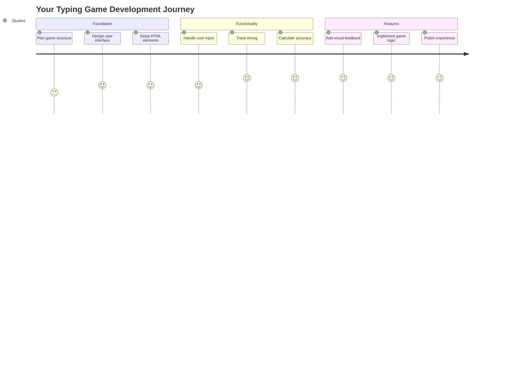
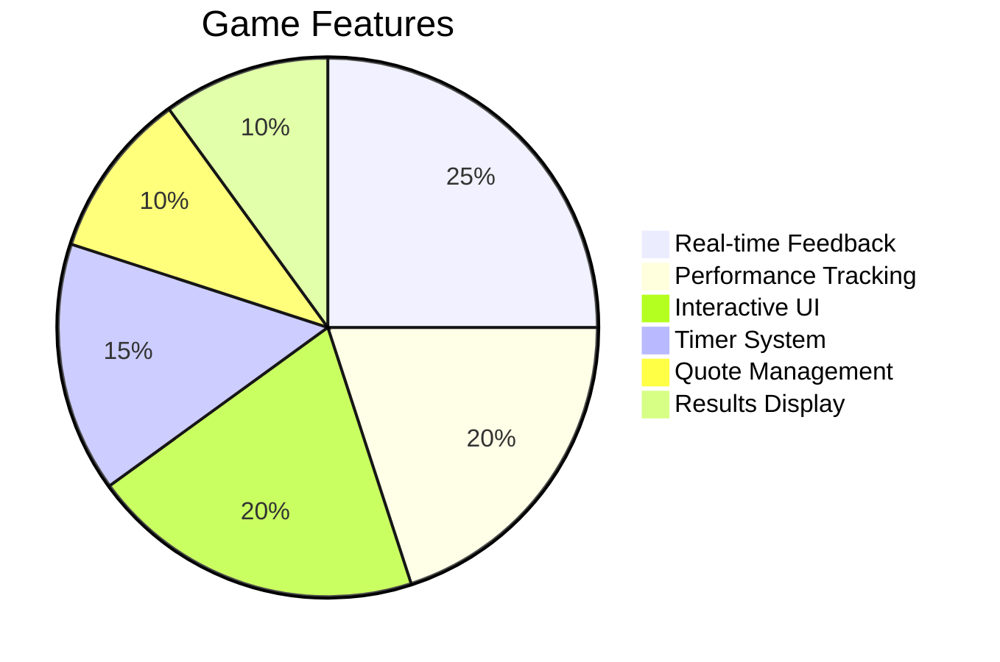
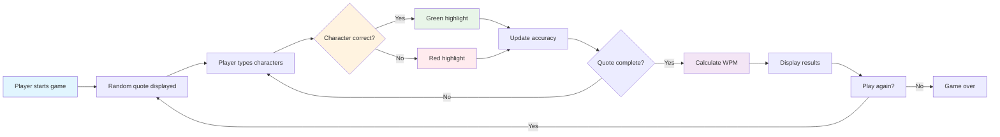
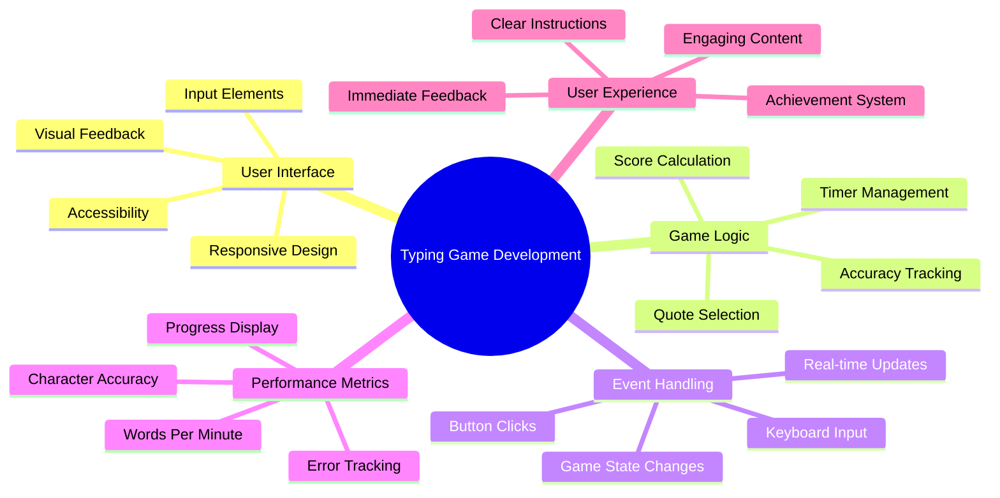
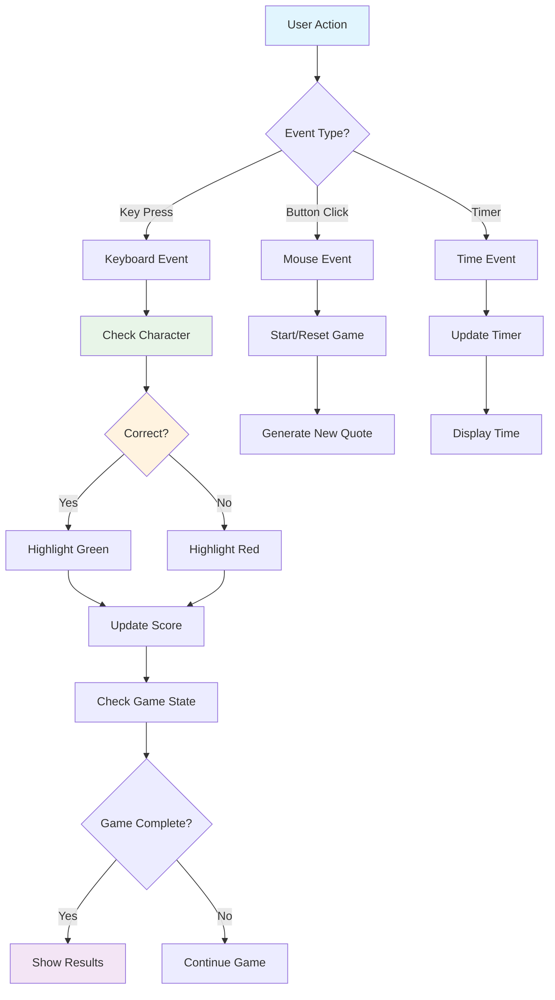
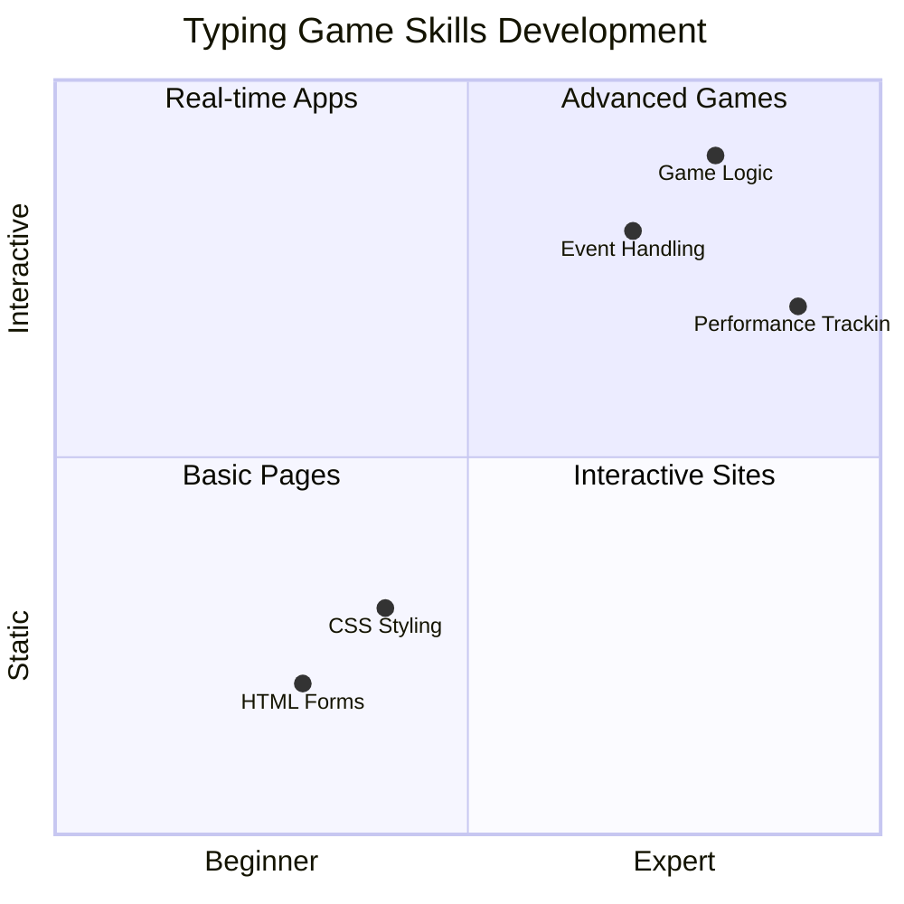
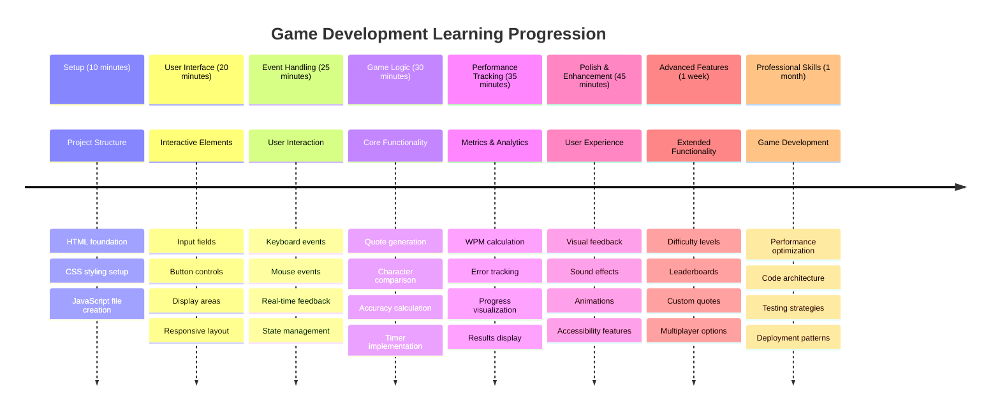

# Programmazione Event-Driven - Crea un Gioco di Scrittura

## Introduzione

Ecco qualcosa che ogni sviluppatore sa ma di cui raramente parla: scrivere velocemente è un superpotere! 🚀 Pensaci - più velocemente riesci a trasferire le tue idee dalla mente all'editor di codice, più la tua creatività può fluire. È come avere un collegamento diretto tra i tuoi pensieri e lo schermo.

Vuoi sapere uno dei modi migliori per migliorare questa abilità? Esatto - costruiremo un gioco!

> Creiamo insieme un fantastico gioco di scrittura!

Pronto a mettere in pratica tutte quelle competenze di JavaScript, HTML e CSS che hai imparato? Costruiremo un gioco di scrittura che ti sfiderà con citazioni casuali del leggendario detective [Sherlock Holmes](https://en.wikipedia.org/wiki/Sherlock_Holmes). Il gioco terrà traccia di quanto velocemente e accuratamente riesci a scrivere - e fidati, è più coinvolgente di quanto pensi!

## Cosa Devi Sapere

Prima di iniziare, assicurati di sentirti a tuo agio con questi concetti (non preoccuparti se hai bisogno di un rapido ripasso - ci siamo passati tutti!):

- Creare controlli di input di testo e pulsanti
- CSS e impostazione degli stili usando le classi  
- Fondamenti di JavaScript
  - Creare un array
  - Generare un numero casuale
  - Ottenere l'ora corrente

Se qualcuno di questi concetti ti sembra un po' arrugginito, va benissimo! A volte il modo migliore per consolidare le tue conoscenze è immergerti in un progetto e imparare strada facendo.

### 🔄 **Check-in Pedagogico**
**Valutazione delle Basi**: Prima di iniziare lo sviluppo, assicurati di comprendere:
- ✅ Come funzionano i form HTML e gli elementi di input
- ✅ Classi CSS e stile dinamico
- ✅ Event listeners e gestori in JavaScript
- ✅ Manipolazione degli array e selezione casuale
- ✅ Misurazione del tempo e calcoli

**Auto-Test Rapido**: Riesci a spiegare come questi concetti lavorano insieme in un gioco interattivo?
- **Eventi** si attivano quando gli utenti interagiscono con gli elementi
- **Gestori** elaborano quegli eventi e aggiornano lo stato del gioco
- **CSS** fornisce feedback visivo per le azioni dell'utente
- **Temporizzazione** consente la misurazione delle prestazioni e la progressione del gioco

## Costruiamo Questo Gioco!

[Creare un gioco di scrittura utilizzando la programmazione event-driven](./typing-game/README.md)

### ⚡ **Cosa Puoi Fare nei Prossimi 5 Minuti**
- [ ] Apri la console del browser e prova a rilevare eventi della tastiera con `addEventListener`
- [ ] Crea una semplice pagina HTML con un campo di input e testa il rilevamento della scrittura
- [ ] Esercitati con la manipolazione delle stringhe confrontando il testo digitato con il testo obiettivo
- [ ] Sperimenta con `setTimeout` per comprendere le funzioni di temporizzazione

### 🎯 **Cosa Puoi Realizzare in Quest'Ora**
- [ ] Completa il quiz post-lezione e comprendi la programmazione event-driven
- [ ] Costruisci una versione base del gioco di scrittura con validazione delle parole
- [ ] Aggiungi feedback visivo per scrittura corretta e sbagliata
- [ ] Implementa un sistema di punteggio semplice basato su velocità e precisione
- [ ] Stile il tuo gioco con CSS per renderlo visivamente accattivante

### 📅 **Sviluppo del Gioco per Una Settimana**
- [ ] Completa il gioco di scrittura con tutte le funzionalità e rifiniture
- [ ] Aggiungi livelli di difficoltà con complessità delle parole variabile
- [ ] Implementa il tracciamento delle statistiche dell'utente (WPM, precisione nel tempo)
- [ ] Crea effetti sonori e animazioni per migliorare l'esperienza utente
- [ ] Rendi il tuo gioco responsive per dispositivi touch
- [ ] Condividi il tuo gioco online e raccogli feedback dagli utenti

### 🌟 **Sviluppo Interattivo per Un Mese**
- [ ] Crea più giochi esplorando diversi modelli di interazione
- [ ] Impara i cicli di gioco, la gestione dello stato e l'ottimizzazione delle prestazioni
- [ ] Contribuisci a progetti di sviluppo di giochi open source
- [ ] Padroneggia concetti avanzati di temporizzazione e animazioni fluide
- [ ] Crea un portfolio che mostri varie applicazioni interattive
- [ ] Mentora altri interessati allo sviluppo di giochi e interazioni utente

## 🎯 La Tua Timeline per Padroneggiare il Gioco di Scrittura

### 🛠️ Riepilogo del Tuo Toolkit per lo Sviluppo del Gioco

Dopo aver completato questo progetto, avrai padroneggiato:
- **Programmazione Event-Driven**: Interfacce utente reattive che rispondono agli input
- **Feedback in Tempo Reale**: Aggiornamenti visivi e prestazionali istantanei
- **Misurazione delle Prestazioni**: Sistemi di temporizzazione e punteggio accurati
- **Gestione dello Stato del Gioco**: Controllo del flusso dell'applicazione e dell'esperienza utente
- **Design Interattivo**: Creazione di esperienze utente coinvolgenti e addictive
- **Modern Web APIs**: Utilizzo delle capacità del browser per interazioni ricche
- **Pattern di Accessibilità**: Design inclusivo per tutti gli utenti

**Applicazioni nel Mondo Reale**: Queste competenze si applicano direttamente a:
- **Applicazioni Web**: Qualsiasi interfaccia interattiva o dashboard
- **Software Educativo**: Piattaforme di apprendimento e strumenti di valutazione delle competenze
- **Strumenti di Produttività**: Editor di testo, IDE e software di collaborazione
- **Industria del Gaming**: Giochi browser e intrattenimento interattivo
- **Sviluppo Mobile**: Interfacce touch e gestione dei gesti

**Livello Successivo**: Sei pronto per esplorare framework avanzati per giochi, sistemi multiplayer in tempo reale o applicazioni interattive complesse!

## Crediti

Scritto con ♥️ da [Christopher Harrison](http://www.twitter.com/geektrainer)

---

**Disclaimer**:  
Questo documento è stato tradotto utilizzando il servizio di traduzione AI [Co-op Translator](https://github.com/Azure/co-op-translator). Sebbene ci impegniamo per garantire l'accuratezza, si prega di notare che le traduzioni automatiche possono contenere errori o imprecisioni. Il documento originale nella sua lingua nativa dovrebbe essere considerato la fonte autorevole. Per informazioni critiche, si raccomanda una traduzione professionale umana. Non siamo responsabili per eventuali incomprensioni o interpretazioni errate derivanti dall'uso di questa traduzione.