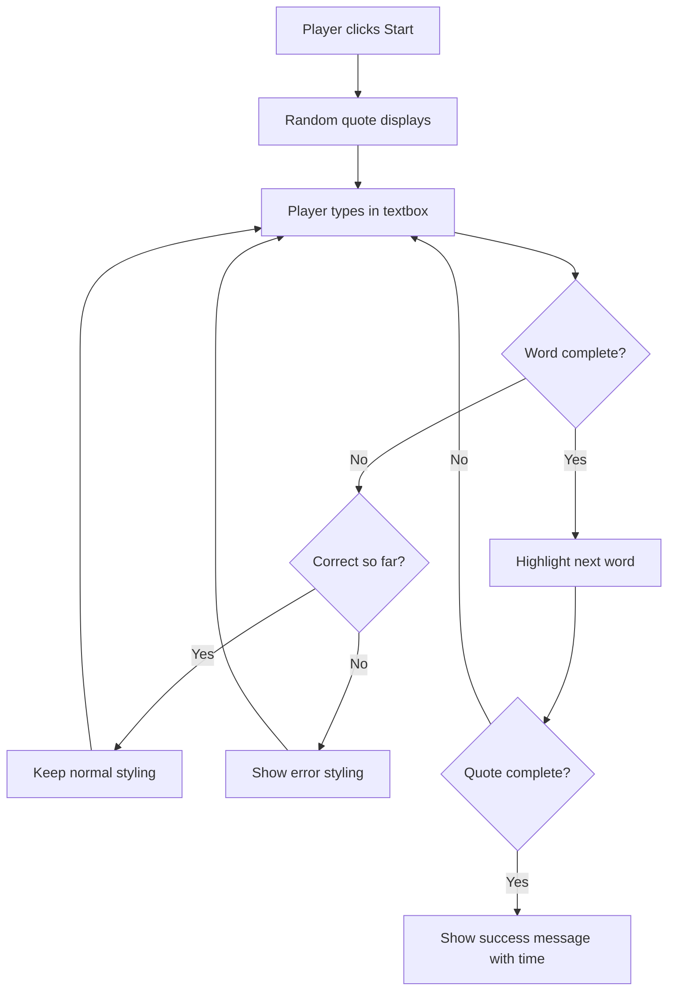
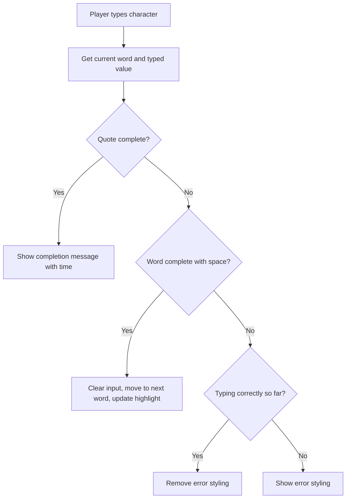
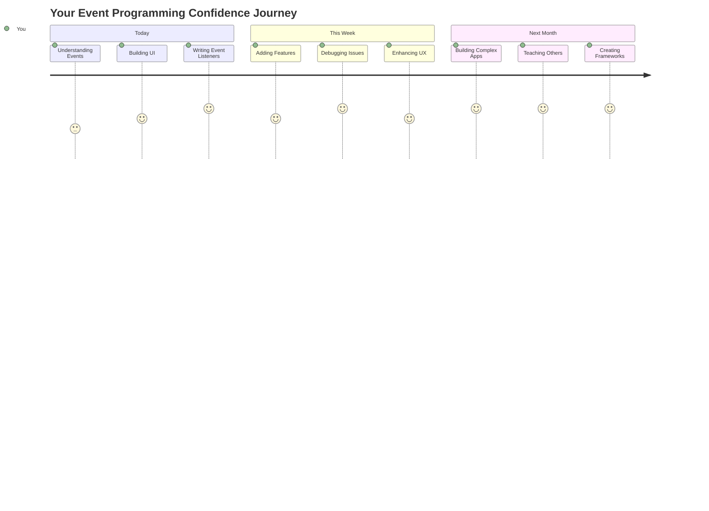

# Creare un gioco usando gli eventi

Ti sei mai chiesto come fanno i siti web a sapere quando clicchi un pulsante o digiti in una casella di testo? È la magia della programmazione basata sugli eventi! Quale modo migliore per imparare questa abilità essenziale se non costruendo qualcosa di utile: un gioco di velocità di digitazione che reagisce a ogni tasto che premi.

Vedrai direttamente come i browser web "comunicano" con il tuo codice JavaScript. Ogni volta che clicchi, digiti o muovi il mouse, il browser invia piccoli messaggi (li chiamiamo eventi) al tuo codice, e tu decidi come rispondere!

Alla fine di questa lezione, avrai creato un vero gioco di digitazione che traccia la tua velocità e precisione. Ancora più importante, comprenderai i concetti fondamentali che alimentano ogni sito web interattivo che hai mai usato. Iniziamo!

## Quiz pre-lezione

[Quiz pre-lezione](https://ff-quizzes.netlify.app/web/quiz/21)

## Programmazione basata sugli eventi

Pensa alla tua app o sito web preferito: cosa lo rende vivo e reattivo? Tutto dipende da come reagisce a ciò che fai! Ogni tocco, clic, scorrimento o pressione di tasto crea quello che chiamiamo un "evento", ed è lì che avviene la vera magia dello sviluppo web.

Ecco cosa rende interessante la programmazione per il web: non sappiamo mai quando qualcuno cliccherà quel pulsante o inizierà a digitare in una casella di testo. Potrebbero cliccare immediatamente, aspettare cinque minuti o magari non cliccare mai! Questa imprevedibilità ci obbliga a pensare in modo diverso su come scriviamo il nostro codice.

Invece di scrivere codice che si esegue dall'alto verso il basso come una ricetta, scriviamo codice che aspetta pazientemente che accada qualcosa. È simile a come gli operatori del telegrafo nel 1800 aspettavano accanto alle loro macchine, pronti a rispondere nel momento in cui arrivava un messaggio.

Quindi, cos'è esattamente un "evento"? In parole semplici, è qualcosa che accade! Quando clicchi un pulsante - quello è un evento. Quando digiti una lettera - quello è un evento. Quando muovi il mouse - quello è un altro evento.

La programmazione basata sugli eventi ci permette di configurare il nostro codice per ascoltare e rispondere. Creiamo funzioni speciali chiamate **event listeners** che aspettano pazientemente che accada qualcosa di specifico, per poi entrare in azione quando succede.

Pensa agli event listeners come a un campanello per il tuo codice. Configuri il campanello (`addEventListener()`), gli dici quale suono ascoltare (come un 'click' o 'keypress') e poi specifichi cosa dovrebbe accadere quando qualcuno lo suona (la tua funzione personalizzata).

**Ecco come funzionano gli event listeners:**
- **Ascoltano** azioni specifiche dell'utente come clic, pressioni di tasti o movimenti del mouse
- **Eseguono** il tuo codice personalizzato quando si verifica l'evento specificato
- **Rispondono** immediatamente alle interazioni dell'utente, creando un'esperienza fluida
- **Gestiscono** più eventi sullo stesso elemento usando listener diversi

> **NOTE:** Vale la pena sottolineare che ci sono molti modi per creare event listeners. Puoi usare funzioni anonime o crearne di nominate. Puoi usare vari scorciatoie, come impostare la proprietà `click` o utilizzare `addEventListener()`. Nel nostro esercizio ci concentreremo su `addEventListener()` e funzioni anonime, poiché è probabilmente la tecnica più comune utilizzata dagli sviluppatori web. È anche la più flessibile, dato che `addEventListener()` funziona per tutti gli eventi e il nome dell'evento può essere fornito come parametro.

### Eventi comuni

Mentre i browser web offrono decine di eventi diversi che puoi ascoltare, la maggior parte delle applicazioni interattive si basa solo su una manciata di eventi essenziali. Comprendere questi eventi fondamentali ti darà le basi per costruire interazioni utente sofisticate.

Ci sono [dozzine di eventi](https://developer.mozilla.org/docs/Web/Events) disponibili da ascoltare quando si crea un'applicazione. Fondamentalmente, qualsiasi cosa faccia un utente su una pagina genera un evento, il che ti dà un grande potere per garantire che ottengano l'esperienza che desideri. Fortunatamente, normalmente avrai bisogno solo di una piccola manciata di eventi. Ecco alcuni comuni (inclusi i due che useremo per creare il nostro gioco):

| Evento | Descrizione | Casi d'uso comuni |
|--------|-------------|-------------------|
| `click` | L'utente ha cliccato su qualcosa | Pulsanti, link, elementi interattivi |
| `contextmenu` | L'utente ha cliccato con il tasto destro del mouse | Menu contestuali personalizzati |
| `select` | L'utente ha evidenziato del testo | Modifica del testo, operazioni di copia |
| `input` | L'utente ha inserito del testo | Validazione dei moduli, ricerca in tempo reale |

**Comprendere questi tipi di eventi:**
- **Si attivano** quando gli utenti interagiscono con elementi specifici sulla tua pagina
- **Forniscono** informazioni dettagliate sull'azione dell'utente tramite oggetti evento
- **Permettono** di creare applicazioni web reattive e interattive
- **Funzionano** in modo coerente su diversi browser e dispositivi

## Creare il gioco

Ora che hai capito come funzionano gli eventi, mettiamo in pratica questa conoscenza costruendo qualcosa di utile. Creeremo un gioco di velocità di digitazione che dimostra la gestione degli eventi mentre ti aiuta a sviluppare un'importante abilità da sviluppatore.

Creeremo un gioco per esplorare come funzionano gli eventi in JavaScript. Il nostro gioco testerà l'abilità di digitazione di un giocatore, che è una delle abilità più sottovalutate che tutti gli sviluppatori dovrebbero avere. Curiosità: la tastiera QWERTY che usiamo oggi è stata progettata negli anni '70 dell'Ottocento per le macchine da scrivere - e buone abilità di digitazione sono ancora preziose per i programmatori oggi! Il flusso generale del gioco sarà simile a questo:



**Ecco come funzionerà il nostro gioco:**
- **Inizia** quando il giocatore clicca sul pulsante di avvio e visualizza una citazione casuale
- **Traccia** i progressi di digitazione del giocatore parola per parola in tempo reale
- **Evidenzia** la parola corrente per guidare l'attenzione del giocatore
- **Fornisce** un feedback visivo immediato per gli errori di digitazione
- **Calcola** e visualizza il tempo totale quando la citazione è completata

Costruiamo il nostro gioco e impariamo sugli eventi!

### Struttura dei file

Prima di iniziare a scrivere codice, organizziamoci! Avere una struttura di file pulita fin dall'inizio ti risparmierà mal di testa in seguito e renderà il tuo progetto più professionale. 😊

Terremo le cose semplici con solo tre file: `index.html` per la struttura della pagina, `script.js` per tutta la logica del gioco e `style.css` per rendere tutto bello. Questo è il trio classico che alimenta la maggior parte del web!

**Crea una nuova cartella per il tuo lavoro aprendo una console o una finestra del terminale ed eseguendo il seguente comando:**

```bash
# Linux or macOS
mkdir typing-game && cd typing-game

# Windows
md typing-game && cd typing-game
```

**Ecco cosa fanno questi comandi:**
- **Crea** una nuova directory chiamata `typing-game` per i file del tuo progetto
- **Naviga** automaticamente nella directory appena creata
- **Configura** uno spazio di lavoro pulito per lo sviluppo del tuo gioco

**Apri Visual Studio Code:**

```bash
code .
```

**Questo comando:**
- **Avvia** Visual Studio Code nella directory corrente
- **Apre** la cartella del tuo progetto nell'editor
- **Fornisce** accesso a tutti gli strumenti di sviluppo di cui hai bisogno

**Aggiungi tre file alla cartella in Visual Studio Code con i seguenti nomi:**
- `index.html` - Contiene la struttura e il contenuto del tuo gioco
- `script.js` - Gestisce tutta la logica del gioco e gli event listeners
- `style.css` - Definisce l'aspetto visivo e lo stile

## Creare l'interfaccia utente

Ora costruiamo il palco dove avverrà tutta l'azione del nostro gioco! Pensa a questo come progettare il pannello di controllo di un'astronave: dobbiamo assicurarci che tutto ciò di cui i giocatori hanno bisogno sia esattamente dove si aspettano che sia.

Cerchiamo di capire cosa serve effettivamente al nostro gioco. Se stessi giocando a un gioco di digitazione, cosa vorresti vedere sullo schermo? Ecco cosa ci servirà:

| Elemento UI | Scopo | Elemento HTML |
|-------------|-------|---------------|
| Visualizzazione della citazione | Mostra il testo da digitare | `<p>` con `id="quote"` |
| Area messaggi | Mostra messaggi di stato e successo | `<p>` con `id="message"` |
| Input di testo | Dove i giocatori digitano la citazione | `<input>` con `id="typed-value"` |
| Pulsante di avvio | Avvia il gioco | `<button>` con `id="start"` |

**Comprendere la struttura dell'interfaccia utente:**
- **Organizza** il contenuto in modo logico dall'alto verso il basso
- **Assegna** ID univoci agli elementi per il targeting in JavaScript
- **Fornisce** una gerarchia visiva chiara per una migliore esperienza utente
- **Include** elementi HTML semantici per l'accessibilità

Ognuno di questi avrà bisogno di ID in modo che possiamo lavorarci nel nostro JavaScript. Aggiungeremo anche riferimenti ai file CSS e JavaScript che stiamo per creare.

Crea un nuovo file chiamato `index.html`. Aggiungi il seguente HTML:

```html
<!-- inside index.html -->
<html>
<head>
  <title>Typing game</title>
  <link rel="stylesheet" href="style.css">
</head>
<body>
  <h1>Typing game!</h1>
  <p>Practice your typing skills with a quote from Sherlock Holmes. Click **start** to begin!</p>
  <p id="quote"></p> <!-- This will display our quote -->
  <p id="message"></p> <!-- This will display any status messages -->
  <div>
    <input type="text" aria-label="current word" id="typed-value" /> <!-- The textbox for typing -->
    <button type="button" id="start">Start</button> <!-- To start the game -->
  </div>
  <script src="script.js"></script>
</body>
</html>
```

**Analisi di ciò che questa struttura HTML realizza:**
- **Collega** il foglio di stile CSS nel `<head>` per lo stile
- **Crea** un'intestazione chiara e istruzioni per gli utenti
- **Stabilisce** paragrafi segnaposto con ID specifici per contenuti dinamici
- **Include** un campo di input con attributi di accessibilità
- **Fornisce** un pulsante di avvio per attivare il gioco
- **Carica** il file JavaScript alla fine per prestazioni ottimali

### Avviare l'applicazione

Testare frequentemente la tua applicazione durante lo sviluppo ti aiuta a individuare problemi in anticipo e a vedere i tuoi progressi in tempo reale. Live Server è uno strumento prezioso che aggiorna automaticamente il browser ogni volta che salvi le modifiche, rendendo lo sviluppo molto più efficiente.

È sempre meglio sviluppare in modo iterativo per vedere come appaiono le cose. Avviamo la nostra applicazione. C'è un'ottima estensione per Visual Studio Code chiamata [Live Server](https://marketplace.visualstudio.com/items?itemName=ritwickdey.LiveServer&WT.mc_id=academic-77807-sagibbon) che ospiterà la tua applicazione localmente e aggiornerà il browser ogni volta che salvi.

**Installa [Live Server](https://marketplace.visualstudio.com/items?itemName=ritwickdey.LiveServer&WT.mc_id=academic-77807-sagibbon) seguendo il link e cliccando su Installa:**

**Ecco cosa succede durante l'installazione:**
- **Apre** il browser per avviare Visual Studio Code
- **Guida** attraverso il processo di installazione dell'estensione
- **Potrebbe richiedere** il riavvio di Visual Studio Code per completare la configurazione

**Una volta installato, in Visual Studio Code, premi Ctrl-Shift-P (o Cmd-Shift-P) per aprire il pannello dei comandi:**

**Comprendere il pannello dei comandi:**
- **Fornisce** accesso rapido a tutti i comandi di VS Code
- **Cerca** i comandi mentre digiti
- **Offre** scorciatoie da tastiera per uno sviluppo più veloce

**Digita "Live Server: Open with Live Server":**

**Cosa fa Live Server:**
- **Avvia** un server di sviluppo locale per il tuo progetto
- **Aggiorna automaticamente** il browser quando salvi i file
- **Serve** i tuoi file da un URL locale (tipicamente `localhost:5500`)

**Apri un browser e naviga su `https://localhost:5500`:**

Ora dovresti vedere la pagina che hai creato! Aggiungiamo un po' di funzionalità.

## Aggiungere il CSS

Ora rendiamo tutto più bello! Il feedback visivo è stato cruciale per le interfacce utente fin dai primi giorni dell'informatica. Negli anni '80, i ricercatori hanno scoperto che il feedback visivo immediato migliora notevolmente le prestazioni degli utenti e riduce gli errori. È esattamente ciò che creeremo.

Il nostro gioco deve essere chiarissimo su ciò che sta accadendo. I giocatori dovrebbero sapere immediatamente quale parola devono digitare e, se commettono un errore, dovrebbero vederlo subito. Creiamo uno stile semplice ma efficace:

Crea un nuovo file chiamato `style.css` e aggiungi la seguente sintassi.

```css
/* inside style.css */
.highlight {
  background-color: yellow;
}

.error {
  background-color: lightcoral;
  border: red;
}
```

**Comprendere queste classi CSS:**
- **Evidenzia** la parola corrente con uno sfondo giallo per una guida visiva chiara
- **Segnala** errori di digitazione con un colore di sfondo corallo chiaro
- **Fornisce** un feedback immediato senza interrompere il flusso di digitazione dell'utente
- **Utilizza** colori contrastanti per accessibilità e comunicazione visiva chiara

✅ Quando si tratta di CSS, puoi disporre la tua pagina come preferisci. Prenditi un po' di tempo e rendi la pagina più accattivante:

- Scegli un font diverso
- Colora le intestazioni
- Ridimensiona gli elementi

## JavaScript

Ecco dove le cose si fanno interessanti! 🎉 Abbiamo la struttura HTML e lo stile CSS, ma al momento il nostro gioco è come una bella macchina senza motore. JavaScript sarà quel motore: è ciò che fa funzionare tutto e risponde a ciò che fanno i giocatori.

Qui vedrai la tua creazione prendere vita. Affronteremo questo passo dopo passo, così nulla sembrerà troppo complicato:

| Passo | Scopo | Cosa imparerai |
|-------|-------|----------------|
| [Creare le costanti](../../../../4-typing-game/typing-game) | Configurare citazioni e riferimenti DOM | Gestione delle variabili e selezione DOM |
| [Event listener per avviare il gioco](../../../../4-typing-game/typing-game) | Gestire l'inizializzazione del gioco | Gestione degli eventi e aggiornamenti UI |
| [Event listener per la digitazione](../../../../4-typing-game/typing-game) | Elaborare l'input dell'utente in tempo reale | Validazione dell'input e feedback dinamico |

**Questo approccio strutturato ti aiuta a:**
- **Organizzare** il tuo codice in sezioni logiche e gestibili
- **Costruire** funzionalità in modo incrementale per un debug più semplice
- **Comprendere** come le diverse parti della tua applicazione lavorano insieme
- **Creare** modelli riutilizzabili per progetti futuri

Ma prima, crea un nuovo file chiamato `script.js`.

### Aggiungere le costanti

Prima di immergerci nell'azione, raccogliamo tutte le nostre risorse! Proprio come il controllo missione della NASA prepara tutti i sistemi di monitoraggio prima del lancio, è molto più facile quando hai tutto pronto e organizzato. Questo ci risparmia la fatica di cercare le cose in seguito e aiuta a prevenire errori di battitura.

Ecco cosa dobbiamo configurare prima:

| Tipo di dato | Scopo | Esempio |
|--------------|-------|---------|
| Array di citazioni | Memorizza tutte le possibili citazioni per il gioco | `['Citazione 1', 'Citazione 2', ...]` |
| Array di parole | Suddivide la citazione corrente in singole parole | `['Quando', 'tu', 'hai', ...]` |
| Indice parola | Tiene traccia della parola che il giocatore sta digitando | `0, 1, 2, 3...` |
| Ora di inizio | Calcola il tempo trascorso per il punteggio | `Date.now()` |

**Avremo anche bisogno di riferimenti ai nostri elementi dell'interfaccia utente:**
| Elemento | ID | Scopo |
|---------|----|-------|
| Input di testo | `typed-value` | Dove i giocatori digitano |
| Visualizzazione citazione | `quote` | Mostra la citazione da digitare |
| Area messaggi | `message` | Mostra aggiornamenti di stato |

```javascript
// inside script.js
// all of our quotes
const quotes = [
    'When you have eliminated the impossible, whatever remains, however improbable, must be the truth.',
    'There is nothing more deceptive than an obvious fact.',
    'I ought to know by this time that when a fact appears to be opposed to a long train of deductions it invariably proves to be capable of bearing some other interpretation.',
    'I never make exceptions. An exception disproves the rule.',
    'What one man can invent another can discover.',
    'Nothing clears up a case so much as stating it to another person.',
    'Education never ends, Watson. It is a series of lessons, with the greatest for the last.',
];
// store the list of words and the index of the word the player is currently typing
let words = [];
let wordIndex = 0;
// the starting time
let startTime = Date.now();
// page elements
const quoteElement = document.getElementById('quote');
const messageElement = document.getElementById('message');
const typedValueElement = document.getElementById('typed-value');
```

**Analisi di ciò che realizza questo codice di configurazione:**
- **Memorizza** un array di citazioni di Sherlock Holmes usando `const` poiché le citazioni non cambieranno
- **Inizializza** variabili di tracciamento con `let` poiché questi valori si aggiorneranno durante il gioco
- **Cattura** riferimenti agli elementi DOM usando `document.getElementById()` per un accesso efficiente
- **Imposta** le basi per tutte le funzionalità del gioco con nomi di variabili chiari e descrittivi
- **Organizza** dati e elementi correlati in modo logico per una manutenzione del codice più semplice

✅ Vai avanti e aggiungi altre citazioni al tuo gioco

> 💡 **Suggerimento Pro**: Possiamo recuperare gli elementi ogni volta che vogliamo nel codice usando `document.getElementById()`. Poiché faremo riferimento a questi elementi regolarmente, eviteremo errori di battitura con stringhe letterali utilizzando costanti. Framework come [Vue.js](https://vuejs.org/) o [React](https://reactjs.org/) possono aiutarti a gestire meglio la centralizzazione del tuo codice.
>
**Ecco perché questo approccio funziona così bene:**
- **Previene** errori di ortografia quando si fa riferimento agli elementi più volte
- **Migliora** la leggibilità del codice con nomi di costanti descrittivi
- **Abilita** un migliore supporto IDE con completamento automatico e controllo degli errori
- **Rende** più facile la ristrutturazione se gli ID degli elementi cambiano in seguito

Prenditi un minuto per guardare un video sull'uso di `const`, `let` e `var`

[](https://youtube.com/watch?v=JNIXfGiDWM8 "Tipi di variabili")

> 🎥 Clicca sull'immagine sopra per un video sui tipi di variabili.

### Aggiungi la logica di avvio

È qui che tutto prende forma! 🚀 Stai per scrivere il tuo primo vero event listener, e c'è qualcosa di davvero soddisfacente nel vedere il tuo codice rispondere a un clic su un pulsante.

Pensaci: da qualche parte, un giocatore cliccherà sul pulsante "Start", e il tuo codice deve essere pronto per lui. Non sappiamo quando lo farà - potrebbe essere subito, potrebbe essere dopo aver preso un caffè - ma quando lo farà, il tuo gioco prenderà vita.

Quando l'utente clicca su `start`, dobbiamo selezionare una citazione, configurare l'interfaccia utente e impostare il tracciamento per la parola corrente e il tempo. Di seguito trovi il JavaScript che devi aggiungere; lo analizziamo subito dopo il blocco script.

```javascript
// at the end of script.js
document.getElementById('start').addEventListener('click', () => {
  // get a quote
  const quoteIndex = Math.floor(Math.random() * quotes.length);
  const quote = quotes[quoteIndex];
  // Put the quote into an array of words
  words = quote.split(' ');
  // reset the word index for tracking
  wordIndex = 0;

  // UI updates
  // Create an array of span elements so we can set a class
  const spanWords = words.map(function(word) { return `<span>${word} </span>`});
  // Convert into string and set as innerHTML on quote display
  quoteElement.innerHTML = spanWords.join('');
  // Highlight the first word
  quoteElement.childNodes[0].className = 'highlight';
  // Clear any prior messages
  messageElement.innerText = '';

  // Setup the textbox
  // Clear the textbox
  typedValueElement.value = '';
  // set focus
  typedValueElement.focus();
  // set the event handler

  // Start the timer
  startTime = new Date().getTime();
});
```

**Analizziamo il codice in sezioni logiche:**

**📊 Configurazione del tracciamento delle parole:**
- **Seleziona** una citazione casuale usando `Math.floor()` e `Math.random()` per varietà
- **Converte** la citazione in un array di parole singole usando `split(' ')`
- **Reimposta** l'`wordIndex` a 0 poiché i giocatori iniziano con la prima parola
- **Prepara** lo stato del gioco per un nuovo round

**🎨 Configurazione e visualizzazione dell'interfaccia utente:**
- **Crea** un array di elementi `<span>`, avvolgendo ogni parola per uno stile individuale
- **Unisce** gli elementi span in una singola stringa per un aggiornamento efficiente del DOM
- **Evidenzia** la prima parola aggiungendo la classe CSS `highlight`
- **Cancella** eventuali messaggi di gioco precedenti per fornire una schermata pulita

**⌨️ Preparazione della casella di testo:**
- **Cancella** qualsiasi testo esistente nel campo di input
- **Imposta il focus** sulla casella di testo in modo che i giocatori possano iniziare a digitare immediatamente
- **Prepara** l'area di input per la nuova sessione di gioco

**⏱️ Inizializzazione del timer:**
- **Cattura** il timestamp corrente usando `new Date().getTime()`
- **Abilita** il calcolo accurato della velocità di digitazione e del tempo di completamento
- **Avvia** il tracciamento delle prestazioni per la sessione di gioco

### Aggiungi la logica di digitazione

Ecco dove affrontiamo il cuore del nostro gioco! Non preoccuparti se all'inizio sembra tanto - analizzeremo ogni pezzo, e alla fine vedrai quanto è logico tutto questo.

Quello che stiamo costruendo qui è piuttosto sofisticato: ogni volta che qualcuno digita una lettera, il nostro codice controllerà ciò che ha digitato, gli darà un feedback e deciderà cosa dovrebbe accadere dopo. È simile a come i primi word processor come WordStar negli anni '70 fornivano feedback in tempo reale ai dattilografi.

```javascript
// at the end of script.js
typedValueElement.addEventListener('input', () => {
  // Get the current word
  const currentWord = words[wordIndex];
  // get the current value
  const typedValue = typedValueElement.value;

  if (typedValue === currentWord && wordIndex === words.length - 1) {
    // end of sentence
    // Display success
    const elapsedTime = new Date().getTime() - startTime;
    const message = `CONGRATULATIONS! You finished in ${elapsedTime / 1000} seconds.`;
    messageElement.innerText = message;
  } else if (typedValue.endsWith(' ') && typedValue.trim() === currentWord) {
    // end of word
    // clear the typedValueElement for the new word
    typedValueElement.value = '';
    // move to the next word
    wordIndex++;
    // reset the class name for all elements in quote
    for (const wordElement of quoteElement.childNodes) {
      wordElement.className = '';
    }
    // highlight the new word
    quoteElement.childNodes[wordIndex].className = 'highlight';
  } else if (currentWord.startsWith(typedValue)) {
    // currently correct
    // highlight the next word
    typedValueElement.className = '';
  } else {
    // error state
    typedValueElement.className = 'error';
  }
});
```

**Comprendere il flusso logico della digitazione:**

Questa funzione utilizza un approccio a cascata, controllando le condizioni dalla più specifica alla più generale. Analizziamo ogni scenario:



**🏁 Citazione completata (Scenario 1):**
- **Controlla** se il valore digitato corrisponde alla parola corrente E siamo sull'ultima parola
- **Calcola** il tempo trascorso sottraendo l'ora di inizio dall'ora corrente
- **Converte** i millisecondi in secondi dividendo per 1.000
- **Mostra** un messaggio di congratulazioni con il tempo di completamento

**✅ Parola completata (Scenario 2):**
- **Rileva** il completamento della parola quando l'input termina con uno spazio
- **Valida** che l'input troncato corrisponda esattamente alla parola corrente
- **Cancella** il campo di input per la parola successiva
- **Avanza** alla parola successiva incrementando `wordIndex`
- **Aggiorna** l'evidenziazione visiva rimuovendo tutte le classi e evidenziando la nuova parola

**📝 Digitazione in corso (Scenario 3):**
- **Verifica** che la parola corrente inizi con ciò che è stato digitato finora
- **Rimuove** qualsiasi stile di errore per mostrare che l'input è corretto
- **Permette** di continuare a digitare senza interruzioni

**❌ Stato di errore (Scenario 4):**
- **Attiva** quando il testo digitato non corrisponde all'inizio della parola prevista
- **Applica** la classe CSS di errore per fornire un feedback visivo immediato
- **Aiuta** i giocatori a identificare e correggere rapidamente gli errori

## Testa la tua applicazione

Guarda cosa hai realizzato! 🎉 Hai appena costruito un vero gioco di digitazione funzionante da zero utilizzando la programmazione basata sugli eventi. Prenditi un momento per apprezzarlo - non è un'impresa da poco!

Ora arriva la fase di test! Funzionerà come previsto? Abbiamo dimenticato qualcosa? Ecco il punto: se qualcosa non funziona perfettamente subito, è del tutto normale. Anche gli sviluppatori esperti trovano regolarmente bug nel loro codice. Fa parte del processo di sviluppo!

Clicca su `start` e inizia a digitare! Dovrebbe assomigliare un po' all'animazione che abbiamo visto prima.


**Cosa testare nella tua applicazione:**
- **Verifica** che cliccando su Start venga visualizzata una citazione casuale
- **Conferma** che la digitazione evidenzi correttamente la parola corrente
- **Controlla** che lo stile di errore appaia per la digitazione errata
- **Assicura** che completare le parole avanzi correttamente l'evidenziazione
- **Testa** che completare la citazione mostri il messaggio di completamento con il tempo

**Suggerimenti comuni per il debug:**
- **Controlla** la console del browser (F12) per errori JavaScript
- **Verifica** che tutti i nomi dei file corrispondano esattamente (case-sensitive)
- **Assicurati** che Live Server sia in esecuzione e si aggiorni correttamente
- **Testa** citazioni diverse per verificare che la selezione casuale funzioni

---

## Sfida GitHub Copilot Agent 🎮

Usa la modalità Agent per completare la seguente sfida:

**Descrizione:** Estendi il gioco di digitazione implementando un sistema di difficoltà che si adatta alle prestazioni del giocatore. Questa sfida ti aiuterà a praticare la gestione avanzata degli eventi, l'analisi dei dati e gli aggiornamenti dinamici dell'interfaccia utente.

**Prompt:** Crea un sistema di regolazione della difficoltà per il gioco di digitazione che:
1. Tracci la velocità di digitazione del giocatore (parole al minuto) e la percentuale di precisione
2. Si adatti automaticamente a tre livelli di difficoltà: Facile (citazioni semplici), Medio (citazioni attuali), Difficile (citazioni complesse con punteggiatura)
3. Mostri il livello di difficoltà corrente e le statistiche del giocatore nell'interfaccia utente
4. Implementi un contatore di serie che aumenta la difficoltà dopo 3 prestazioni consecutive buone
5. Aggiunga feedback visivi (colori, animazioni) per indicare i cambiamenti di difficoltà

Aggiungi gli elementi HTML necessari, gli stili CSS e le funzioni JavaScript per implementare questa funzionalità. Includi una gestione degli errori adeguata e assicurati che il gioco rimanga accessibile con etichette ARIA appropriate.

Scopri di più sulla [modalità agent](https://code.visualstudio.com/blogs/2025/02/24/introducing-copilot-agent-mode) qui.

## 🚀 Sfida

Pronto a portare il tuo gioco di digitazione al livello successivo? Prova a implementare queste funzionalità avanzate per approfondire la tua comprensione della gestione degli eventi e della manipolazione del DOM:

**Aggiungi più funzionalità:**

| Funzionalità | Descrizione | Competenze che praticherai |
|--------------|-------------|---------------------------|
| **Controllo Input** | Disabilita il listener dell'evento `input` al completamento e riabilitalo quando viene cliccato il pulsante | Gestione degli eventi e controllo dello stato |
| **Gestione dello stato UI** | Disabilita la casella di testo quando il giocatore completa la citazione | Manipolazione delle proprietà DOM |
| **Dialog Modal** | Mostra una finestra di dialogo modale con il messaggio di successo | Pattern UI avanzati e accessibilità |
| **Sistema di punteggio alto** | Memorizza i punteggi alti usando `localStorage` | API di archiviazione del browser e persistenza dei dati |

**Suggerimenti per l'implementazione:**
- **Ricerca** `localStorage.setItem()` e `localStorage.getItem()` per l'archiviazione persistente
- **Pratica** l'aggiunta e la rimozione dinamica dei listener di eventi
- **Esplora** gli elementi di dialog HTML o i pattern modali CSS
- **Considera** l'accessibilità quando disabiliti e abiliti i controlli del modulo

## Quiz post-lezione

[Quiz post-lezione](https://ff-quizzes.netlify.app/web/quiz/22)

---

## 🚀 La tua timeline di padronanza del gioco di digitazione

### ⚡ **Cosa puoi fare nei prossimi 5 minuti**
- [ ] Testa il tuo gioco di digitazione con citazioni diverse per assicurarti che funzioni senza problemi
- [ ] Sperimenta con lo stile CSS - prova a cambiare i colori di evidenziazione e errore
- [ ] Apri gli strumenti di sviluppo del browser (F12) e osserva la Console mentre giochi
- [ ] Sfida te stesso a completare una citazione il più velocemente possibile

### ⏰ **Cosa puoi realizzare in quest'ora**
- [ ] Aggiungi più citazioni all'array (magari dai tuoi libri o film preferiti)
- [ ] Implementa il sistema di punteggio alto con localStorage dalla sezione sfida
- [ ] Crea un calcolatore di parole al minuto che si visualizza dopo ogni partita
- [ ] Aggiungi effetti sonori per digitazioni corrette, errori e completamento

### 📅 **La tua avventura di una settimana**
- [ ] Costruisci una versione multiplayer dove gli amici possono competere fianco a fianco
- [ ] Crea livelli di difficoltà diversi con complessità variabile delle citazioni
- [ ] Aggiungi una barra di progresso che mostra quanto della citazione è completato
- [ ] Implementa account utente con tracciamento delle statistiche personali
- [ ] Progetta temi personalizzati e lascia che gli utenti scelgano il loro stile preferito

### 🗓️ **La tua trasformazione di un mese**
- [ ] Crea un corso di digitazione con lezioni che insegnano progressivamente il posizionamento corretto delle dita
- [ ] Costruisci analisi che mostrano quali lettere o parole causano più errori
- [ ] Aggiungi supporto per lingue e layout di tastiera diversi
- [ ] Integra con API educative per estrarre citazioni da database di letteratura
- [ ] Pubblica il tuo gioco di digitazione migliorato per altri da usare e divertirsi

### 🎯 **Riflessione finale**

**Prima di andare avanti, prenditi un momento per festeggiare:**
- Qual è stato il momento più soddisfacente durante la creazione di questo gioco?
- Come ti senti riguardo alla programmazione basata sugli eventi rispetto a quando hai iniziato?
- Qual è una funzionalità che sei entusiasta di aggiungere per rendere questo gioco unico?
- Come potresti applicare i concetti di gestione degli eventi ad altri progetti?



> 🌟 **Ricorda**: Hai appena padroneggiato uno dei concetti fondamentali che alimentano ogni sito web e applicazione interattiva. La programmazione basata sugli eventi è ciò che rende il web vivo e reattivo. Ogni volta che vedi un menu a tendina, un modulo che si convalida mentre digiti o un gioco che risponde ai tuoi clic, ora capisci la magia dietro di esso. Non stai solo imparando a programmare - stai imparando a creare esperienze che sembrano intuitive e coinvolgenti! 🎉

---

## Revisione e studio autonomo

Leggi [tutti gli eventi disponibili](https://developer.mozilla.org/docs/Web/Events) per lo sviluppatore tramite il browser web e considera gli scenari in cui utilizzeresti ciascuno di essi.

## Compito

[Crea un nuovo gioco di tastiera](assignment.md)

---

**Disclaimer**:  
Questo documento è stato tradotto utilizzando il servizio di traduzione AI [Co-op Translator](https://github.com/Azure/co-op-translator). Sebbene ci impegniamo per garantire l'accuratezza, si prega di notare che le traduzioni automatiche potrebbero contenere errori o imprecisioni. Il documento originale nella sua lingua nativa dovrebbe essere considerato la fonte autorevole. Per informazioni critiche, si consiglia una traduzione professionale umana. Non siamo responsabili per eventuali incomprensioni o interpretazioni errate derivanti dall'uso di questa traduzione.